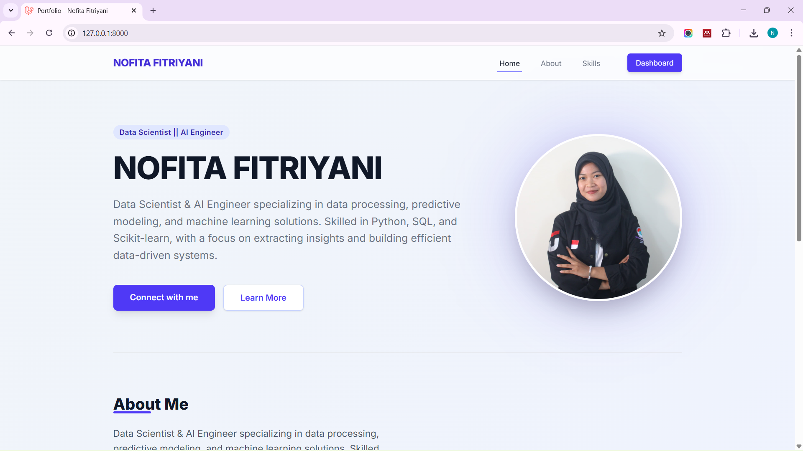
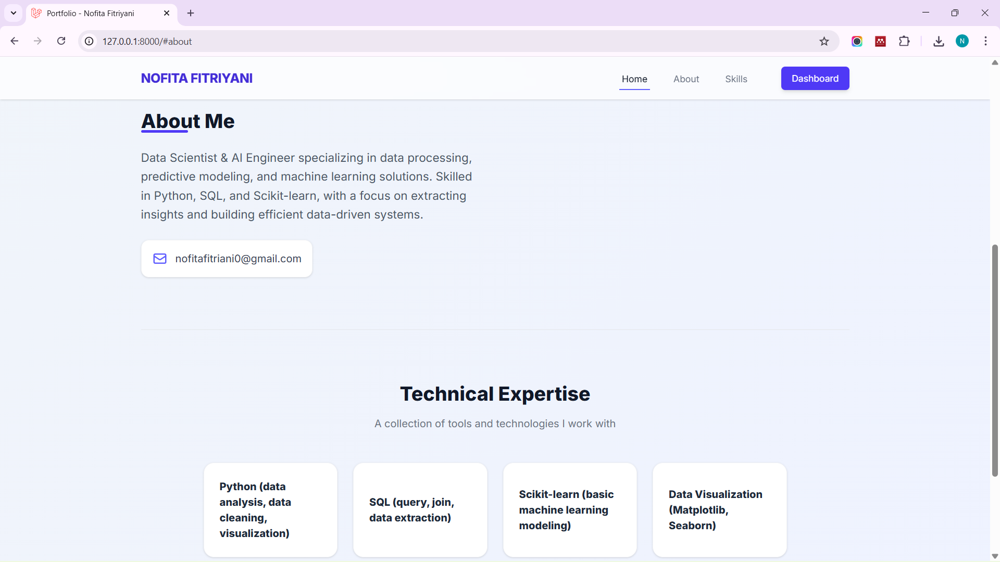
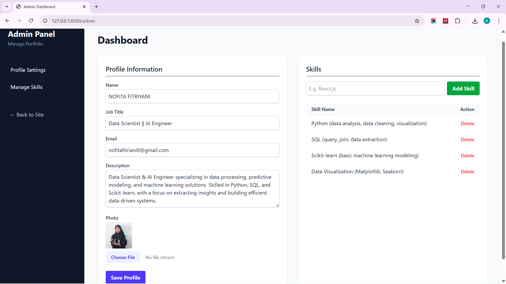

<h1 align="center">LAPORAN PRAKTIKUM</h1>
<h1 align="center">APLIKASI BERBASIS PLATFORM</h1>

<br>

<h2 align="center">UJIAN-UTS</h2>
<h2 align="center">WEB PORTOFOLIO</h2>

<br><br>

<p align="center">

</p>
<br><br><br>

<h2 align="center">Disusun Oleh :</h2>

<p align="center" style="font-size:28px;">
  <b>Nofita Fitriyani</b><br>
  <b>2311102001</b><br>
  <b>S1 IF-11-REG 01</b>
</p>
<br>
<h2 align="center">Dosen Pengampu :</h2>

<p align="center" style="font-size:28px;">
  <b>Dimas Fanny Hebrasianto Permadi, S.ST., M.Kom</b>
</p>
<br>
<h2 align="center">Asisten Praktikum :</h2>

<p align="center" style="font-size:28px;">
  <b>Apri Pandu Wicaksono</b><br>
  <b>Rangga Pradarrell Fathi</b>
</p>
<br>
<h1 align="center">LABORATORIUM HIGH PERFORMANCE</h1>
<h1 align="center">FAKULTAS INFORMATIKA</h1>
<h1 align="center">UNIVERSITAS TELKOM PURWOKERTO</h1>
<h1 align="center">TAHUN 2026</h1>

<hr>


## 1. SOURCE CODE
Source code untuk pengerjaan project **PORTOFOLIO** secara lengkap dapat dilihat pada repositori dan folder proyek aplikasi ini, khususnya berada di dalam folder `/portfolio`.

### admin.blade.php
```
<!DOCTYPE html>
<html lang="en">
<head>
    <meta charset="UTF-8">
    <meta name="viewport" content="width=device-width, initial-scale=1.0">
    <title>Admin Dashboard</title>
    @vite(['resources/css/app.css', 'resources/js/app.js'])
</head>
<body class="bg-gray-50 font-sans text-gray-800">
    <div class="min-h-screen flex">
        <!-- Sidebar -->
        <aside class="w-64 bg-slate-900 text-white min-h-screen">
            <div class="p-6">
                <h2 class="text-2xl font-bold">Admin Panel</h2>
                <p class="text-slate-400 text-sm mt-1">Manage Portfolio</p>
            </div>
            <nav class="mt-6 px-4">
                <a href="#profile" class="block py-2.5 px-4 rounded transition duration-200 hover:bg-slate-800 hover:text-white">Profile Settings</a>
                <a href="#skills" class="block py-2.5 px-4 rounded transition duration-200 hover:bg-slate-800 hover:text-white mt-2">Manage Skills</a>
                <a href="/" class="block py-2.5 px-4 rounded transition duration-200 hover:bg-slate-800 hover:text-white mt-10 opacity-70">← Back to Site</a>
            </nav>
        </aside>

        <!-- Main Content -->
        <main class="flex-1 p-10 overflow-y-auto">
            @if(session('success'))
                <div class="bg-green-100 border border-green-400 text-green-700 px-4 py-3 rounded relative mb-6">
                    {{ session('success') }}
                </div>
            @endif

            <header class="mb-8">
                <h1 class="text-3xl font-bold text-gray-900">Dashboard</h1>
            </header>

            <div class="grid grid-cols-1 lg:grid-cols-2 gap-8">
                <!-- Profile Form -->
                <div id="profile" class="bg-white rounded-xl shadow-sm border border-gray-100 p-6">
                    <h3 class="text-xl font-semibold mb-4 border-b pb-2">Profile Information</h3>
                    <form action="/admin/profile" method="POST" enctype="multipart/form-data">
                        @csrf
                        <div class="mb-4">
                            <label class="block text-sm font-medium text-gray-700 mb-1">Name</label>
                            <input type="text" name="name" value="{{ $profile->name ?? '' }}" class="w-full rounded-md border-gray-300 shadow-sm focus:border-indigo-500 focus:ring focus:ring-indigo-200 focus:ring-opacity-50 p-2 border" required>
                        </div>
                        <div class="mb-4">
                            <label class="block text-sm font-medium text-gray-700 mb-1">Job Title</label>
                            <input type="text" name="job_title" value="{{ $profile->job_title ?? '' }}" class="w-full rounded-md border-gray-300 shadow-sm focus:border-indigo-500 focus:ring focus:ring-indigo-200 focus:ring-opacity-50 p-2 border" required>
                        </div>
                        <div class="mb-4">
                            <label class="block text-sm font-medium text-gray-700 mb-1">Email</label>
                            <input type="email" name="email" value="{{ $profile->email ?? '' }}" class="w-full rounded-md border-gray-300 shadow-sm focus:border-indigo-500 focus:ring focus:ring-indigo-200 focus:ring-opacity-50 p-2 border" required>
                        </div>
                        <div class="mb-4">
                            <label class="block text-sm font-medium text-gray-700 mb-1">Description</label>
                            <textarea name="description" rows="4" class="w-full rounded-md border-gray-300 shadow-sm focus:border-indigo-500 focus:ring focus:ring-indigo-200 focus:ring-opacity-50 p-2 border" required>{{ $profile->description ?? '' }}</textarea>
                        </div>
                        <div class="mb-6">
                            <label class="block text-sm font-medium text-gray-700 mb-1">Photo</label>
                        
                            @if($profile && $profile->photo)
    photo) }}" 
         alt="Current Photo" 
         class="h-20 w-20 object-cover rounded mb-2">
@endif
                            <input type="file" name="photo" class="w-full text-sm text-gray-500 file:mr-4 file:py-2 file:px-4 file:rounded-md file:border-0 file:text-sm file:font-semibold file:bg-indigo-50 file:text-indigo-700 hover:file:bg-indigo-100">
                        </div>
                        <button type="submit" class="bg-indigo-600 hover:bg-indigo-700 text-white font-bold py-2 px-4 rounded transition">
                            Save Profile
                        </button>
                    </form>
                </div>

                <!-- Skills Management -->
                <div id="skills" class="bg-white rounded-xl shadow-sm border border-gray-100 p-6 flex flex-col h-full">
                    <h3 class="text-xl font-semibold mb-4 border-b pb-2">Skills</h3>
                    
                    <form action="/admin/skills" method="POST" class="mb-6 flex gap-2">
                        @csrf
                        <input type="text" name="name" placeholder="E.g. React.js" class="flex-1 rounded-md border-gray-300 shadow-sm focus:border-indigo-500 focus:ring focus:ring-indigo-200 focus:ring-opacity-50 p-2 border" required>
                        <button type="submit" class="bg-green-600 hover:bg-green-700 text-white font-bold py-2 px-4 rounded transition">
                            Add Skill
                        </button>
                    </form>

                    <div class="overflow-y-auto flex-1 max-h-96">
                        <table class="w-full text-left border-collapse">
                            <thead>
                                <tr>
                                    <th class="py-2 px-4 border-b border-gray-200 bg-gray-50 text-gray-600 text-sm">Skill Name</th>
                                    <th class="py-2 px-4 border-b border-gray-200 bg-gray-50 text-gray-600 text-sm text-right">Action</th>
                                </tr>
                            </thead>
                            <tbody>
                                @foreach($skills as $skill)
                                <tr>
                                    <td class="py-3 px-4 border-b border-gray-100">{{ $skill->name }}</td>
                                    <td class="py-3 px-4 border-b border-gray-100 text-right">
                                        <form action="/admin/skills/{{ $skill->id }}" method="POST" class="inline">
                                            @csrf
                                            @method('DELETE')
                                            <button type="submit" class="text-red-500 hover:text-red-700 text-sm font-semibold transition" onclick="return confirm('Delete this skill?')">Delete</button>
                                        </form>
                                    </td>
                                </tr>
                                @endforeach
                                @if($skills->isEmpty())
                                <tr>
                                    <td colspan="2" class="py-4 text-center text-gray-500 text-sm">No skills added yet.</td>
                                </tr>
                                @endif
                            </tbody>
                        </table>
                    </div>
                </div>
            </div>
        </main>
    </div>
</body>
</html>

```

### welcome.blade.php
```
<!DOCTYPE html>
<html lang="en">
<head>
    <meta charset="UTF-8">
    <meta name="viewport" content="width=device-width, initial-scale=1.0">
    <title>Portfolio - Nofita Fitriyani</title>
    @vite(['resources/css/app.css', 'resources/js/app.js'])
    <link href="https://fonts.googleapis.com/css2?family=Inter:wght@300;400;600;800&display=swap" rel="stylesheet">
    <style>
        body { font-family: 'Inter', sans-serif; }
        .glass { background: rgba(255, 255, 255, 0.7); backdrop-filter: blur(10px); border: 1px solid rgba(255, 255, 255, 0.3); }
    </style>
</head>
<body class="bg-gradient-to-br from-slate-100 to-indigo-50 min-h-screen text-slate-800">
    <!-- Navbar -->
    <nav class="fixed w-full z-50 glass shadow-sm">
        <div class="max-w-6xl mx-auto px-4 sm:px-6 lg:px-8">
            <div class="flex justify-between h-16 items-center">
                <div class="flex-shrink-0 flex items-center font-bold text-xl text-indigo-700 tracking-tight">
                    <span id="nav-brand">Loading...</span>
                </div>
                <div class="hidden sm:ml-6 sm:flex sm:space-x-8">
                    <a href="#" class="border-indigo-500 text-gray-900 inline-flex items-center px-1 pt-1 border-b-2 text-sm font-medium">Home</a>
                    <a href="#about" class="border-transparent text-gray-500 hover:border-gray-300 hover:text-gray-700 inline-flex items-center px-1 pt-1 border-b-2 text-sm font-medium transition">About</a>
                    <a href="#skills-section" class="border-transparent text-gray-500 hover:border-gray-300 hover:text-gray-700 inline-flex items-center px-1 pt-1 border-b-2 text-sm font-medium transition">Skills</a>
                    <a href="/admin" class="ml-4 px-4 py-2 rounded-md bg-indigo-600 text-white text-sm font-medium hover:bg-indigo-700 transition shadow-md">Dashboard</a>
                </div>
            </div>
        </div>
    </nav>

    <!-- Main Content -->
    <main class="pt-28 pb-20 px-4 sm:px-6 lg:px-8 max-w-6xl mx-auto">
        <div id="loading" class="text-center py-20">
            <div class="inline-block animate-spin rounded-full h-12 w-12 border-t-2 border-b-2 border-indigo-600"></div>
            <p class="mt-4 text-gray-500">Fetching portfolio data...</p>
        </div>

        <div id="content" class="hidden opacity-0 transition-opacity duration-1000">
            <!-- Hero Section -->
            <div class="flex flex-col md:flex-row items-center gap-12 py-10">
                <div class="flex-1 space-y-6">
                    <div class="inline-block px-3 py-1 rounded-full bg-indigo-100 text-indigo-800 text-sm font-semibold tracking-wide" id="hero-job"></div>
                    <h1 class="text-5xl md:text-6xl font-extrabold tracking-tight text-gray-900" id="hero-name"></h1>
                    <p class="text-xl text-gray-500 leading-relaxed max-w-2xl" id="hero-desc"></p>
                    <div class="pt-4 flex gap-4">
                        <a href="#contact" class="px-8 py-3 bg-indigo-600 hover:bg-indigo-700 text-white font-semibold rounded-lg shadow-lg hover:shadow-xl transition transform hover:-translate-y-1">Connect with me</a>
                        <a href="#about" class="px-8 py-3 bg-white hover:bg-gray-50 text-indigo-600 border border-indigo-200 font-semibold rounded-lg shadow-sm transition">Learn More</a>
                    </div>
                </div>
                <div class="flex-shrink-0 relative">
                    <div class="absolute inset-0 bg-indigo-600 rounded-full blur-3xl opacity-20 animate-pulse"></div>
                    
                    <div id="hero-image-placeholder" class="relative z-10 w-64 h-64 md:w-80 md:h-80 rounded-full shadow-2xl border-4 border-white bg-indigo-200 flex items-center justify-center text-indigo-500 hidden">
                        <svg class="h-24 w-24" fill="none" viewBox="0 0 24 24" stroke="currentColor">
                           <path stroke-linecap="round" stroke-linejoin="round" stroke-width="2" d="M16 7a4 4 0 11-8 0 4 4 0 018 0zM12 14a7 7 0 00-7 7h14a7 7 0 00-7-7z" />
                        </svg>
                    </div>
                </div>
            </div>

            <!-- About & Details Section -->
            <section id="about" class="py-20 border-t border-gray-200 mt-10">
                <div class="grid grid-cols-1 md:grid-cols-2 gap-16 items-center">
                    <div>
                        <h2 class="text-3xl font-bold mb-6 text-gray-900 relative inline-block">
                            About Me
                            <span class="absolute bottom-0 left-0 w-1/2 h-1 bg-indigo-600 rounded"></span>
                        </h2>
                        <p class="text-gray-600 text-lg leading-relaxed mb-6" id="about-desc"></p>
                        
                        <div class="flex items-center gap-3 text-gray-700 bg-white p-4 rounded-xl shadow-sm border border-gray-100 w-max">
                            <svg class="h-6 w-6 text-indigo-500" fill="none" viewBox="0 0 24 24" stroke="currentColor">
                                <path stroke-linecap="round" stroke-linejoin="round" stroke-width="2" d="M3 8l7.89 5.26a2 2 0 002.22 0L21 8M5 19h14a2 2 0 002-2V7a2 2 0 00-2-2H5a2 2 0 00-2 2v10a2 2 0 002 2z" />
                            </svg>
                            <span id="about-email" class="font-medium"></span>
                        </div>
                    </div>
                </div>
            </section>

            <!-- Skills Section -->
            <section id="skills-section" class="py-20 border-t border-gray-200">
                <div class="text-center mb-12">
                    <h2 class="text-3xl font-bold text-gray-900">Technical Expertise</h2>
                    <p class="mt-4 text-gray-500">A collection of tools and technologies I work with</p>
                </div>
                
                <div id="skills-container" class="grid grid-cols-2 md:grid-cols-4 gap-6 max-w-4xl mx-auto">
                    <!-- Skills will be injected here -->
                </div>
            </section>
        </div>
    </main>

    <!-- Footer-->
    <footer class="bg-slate-900 py-8 text-center mt-auto border-t border-slate-800">
        <p class="text-slate-400 font-medium tracking-wide text-sm mb-1">&copy; {{ date('Y') }} Portfolio. All rights reserved.</p>
    </footer>

    <!-- AJAX Script Fetch -->
    <script>
        document.addEventListener('DOMContentLoaded', () => {
            fetch('/api/portfolio-data')
                .then(response => response.json())
                .then(data => {
                    if(data.profile) {
                        const { name, job_title, description, email, photo } = data.profile;
                        
                        document.getElementById('nav-brand').textContent = name;
                        document.getElementById('hero-name').textContent = name;
                        document.getElementById('hero-job').textContent = job_title || 'Professional Developer';
                        document.getElementById('hero-desc').textContent = description;
                        document.getElementById('about-desc').textContent = description;
                        document.getElementById('about-email').textContent = email;

                        // Handle photo
                        if (photo) {
                            const img = document.getElementById('hero-image');
                            img.src = '/storage/' + photo;
                            img.classList.remove('hidden');
                        } else {
                            document.getElementById('hero-image-placeholder').classList.remove('hidden');
                        }
                    }

                    // Handle skills
                    if(data.skills) {
                        const skillsContainer = document.getElementById('skills-container');
                        data.skills.forEach(skill => {
                            const skillDiv = document.createElement('div');
                            skillDiv.className = 'bg-white p-6 rounded-2xl shadow-sm border border-gray-100 flex items-center justify-center hover:shadow-md hover:border-indigo-300 transition-all transform hover:-translate-y-1 group';
                            skillDiv.innerHTML = `
                                <span class="font-bold text-gray-800 group-hover:text-indigo-600 transition-colors">${skill.name}</span>
                            `;
                            skillsContainer.appendChild(skillDiv);
                        });
                    }

                    // Hide loading and show content with fade-in
                    document.getElementById('loading').classList.add('hidden');
                    const content = document.getElementById('content');
                    content.classList.remove('hidden');
                    setTimeout(() => {
                        content.classList.remove('opacity-0');
                    }, 50);
                })
                .catch(error => {
                    console.error('Error fetching data:', error);
                    document.getElementById('loading').innerHTML = '<p class="text-red-500">Failed to load portfolio data.</p>';
                });
        });
    </script>
</body>
</html>

```


## 3. OUTPUT
### A. Landing Page
<p>

</p>

<p>

</p>

### B. Admin Panel
<p>

</p>


## 4. PEMBAHASAN SOURCE CODE

Berdasarkan praktikum yang telah dilakukan, berikut adalah pembahasan mengenai implementasi bagian utama source code pada web portofolio:
### 4.1. Arsitektur MVC (Model-View-Controller)
Aplikasi portofolio ini dibangun menggunakan framework Laravel dengan pola arsitektur **MVC**, yang memisahkan logika aplikasi menjadi tiga komponen utama:
- **Model**: Merepresentasikan struktur data dan berinteraksi dengan database. File model seperti `Profile.php` dan `Skill.php` menggunakan Eloquent ORM untuk mempermudah manipulasi data.
- **View**: Menangani tampilan antarmuka pengguna menggunakan Blade Templating Engine. File `welcome.blade.php` digunakan untuk landing page publik, sementara `admin.blade.php` menyediakan interface manajemen konten.
- **Controller**: Bertugas mengolah permintaan (request) dari pengguna, mengambil data dari model, dan mengirimkannya ke view atau dalam bentuk JSON (API).

### 4.2. Manajemen Data dengan Eloquent
Implementasi model pada aplikasi ini sangat efisien berkat penggunaan Eloquent ORM. 
- **Model Profile**: Menyimpan informasi biodata seperti nama, jabatan, email, deskripsi, dan foto. Penggunaan `$fillable` memastikan keamanan data melalui *Mass Assignment*.
- **Model Skill**: Mengelola daftar keahlian pengguna secara dinamis, memungkinkan penambahan atau penghapusan data secara mudah melalui dashboard admin.

### 4.3. Kontroler dan Logika Bisnis
Terdapat dua kontroler utama yang menangani alur kerja aplikasi:
1. **AdminController**: Menangani fungsi CRUD (Create, Read, Update, Delete) pada dashboard.
   - Fungsi `updateProfile()` mencakup logika validasi data dan pengunggahan file (foto) ke dalam storage Laravel.
   - Fungsi `addSkill()` dan `deleteSkill()` memungkinkan pengelolaan list skill secara real-time.
2. **ApiController**: Dirancang khusus untuk mendukung konsep pengerjaan modern (decoupling). Kontroler ini memiliki fungsi `getPortfolioData()` yang mengembalikan data profil dan skill dalam format JSON, yang nantinya akan dikonsumsi oleh frontend melalui AJAX.

### 4.4. Implementasi AJAX (Fetch API)
Salah satu aspek penting dalam proyek ini adalah penggunaan **AJAX** pada landing page (`welcome.blade.php`). 
- Saat halaman dimuat, script JavaScript menjalankan perintah `fetch('/api/portfolio-data')`.
- Respon yang diterima berupa JSON kemudian diproses secara asinkron untuk mengisi elemen-elemen DOM (Document Object Model) seperti nama, deskripsi, dan daftar skill.
- Hal ini memberikan pengalaman pengguna yang lebih mulus (seamless) karena data dimuat tanpa perlu memuat ulang (reload) seluruh halaman.

### 4.5. Desain Modern dengan Tailwind CSS
Untuk bagian *styling*, aplikasi ini sepenuhnya mengandalkan **Tailwind CSS**. Beberapa teknik desain yang diterapkan meliputi:
- **Glassmorphism**: Memberikan efek transparan dan blur pada navbar untuk kesan premium.
- **Responsive Design**: Penggunaan utility class seperti `md:flex-row` dan `grid-cols-2 md:grid-cols-4` memastikan tampilan tetap rapi di berbagai ukuran layar (mobile, tablet, desktop).
- **Animasi Micro-interactions**: Penerapan *hover effects* dan *fade-in transitions* saat data AJAX selesai dimuat untuk meningkatkan interaktivitas.

## 5. KESIMPULAN
Berdasarkan hasil praktikum yang telah dilakukan, dapat disimpulkan bahwa pembuatan web portofolio menggunakan framework Laravel berhasil mengimplementasikan konsep pengembangan web modern berbasis MVC (Model-View-Controller). Sistem yang dibangun mampu menampilkan data profil, skill, pengalaman, dan project secara dinamis melalui komunikasi API menggunakan AJAX (fetch), sehingga data tidak di-render secara langsung pada tampilan frontend.

Selain itu, penggunaan Tailwind CSS membantu dalam mempercepat proses styling antarmuka sehingga tampilan menjadi lebih rapi, responsif, dan profesional. Fitur admin dashboard juga berhasil diimplementasikan untuk melakukan proses CRUD (Create, Read, Update, Delete) terhadap data portofolio, sehingga konten dapat diperbarui tanpa perlu mengubah kode secara langsung.

Dari praktikum ini dapat dipahami bahwa pemisahan antara frontend dan backend, serta penggunaan API, membuat sistem lebih fleksibel, modular, dan mudah dikembangkan. Selain itu, integrasi database juga memastikan data dapat disimpan secara permanen dan dikelola dengan lebih baik.

Secara keseluruhan, praktikum ini memberikan pemahaman mengenai penerapan Laravel dalam pengembangan web dinamis, penggunaan AJAX untuk komunikasi data, serta pentingnya desain antarmuka yang baik dalam membangun sistem portofolio yang profesional.
