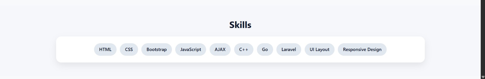
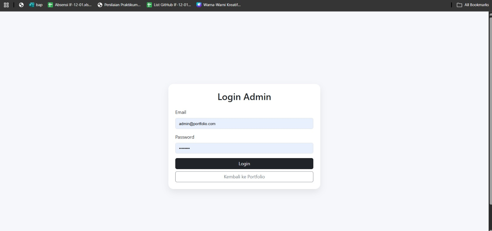
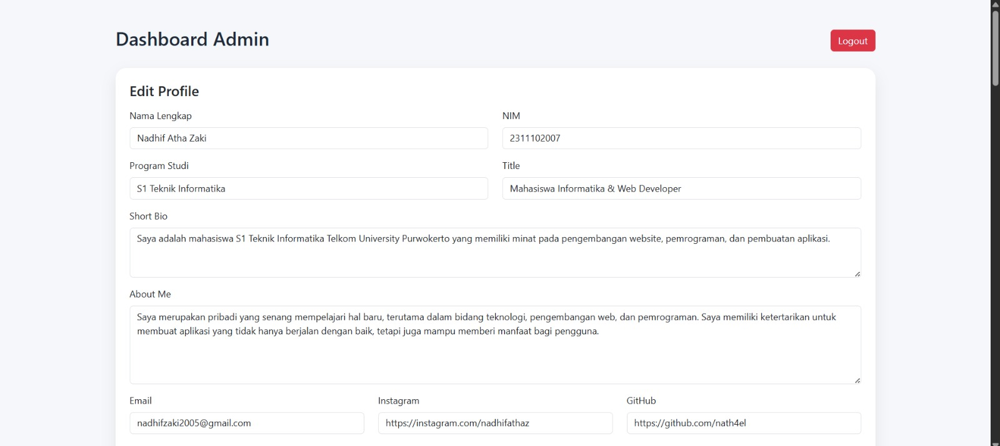
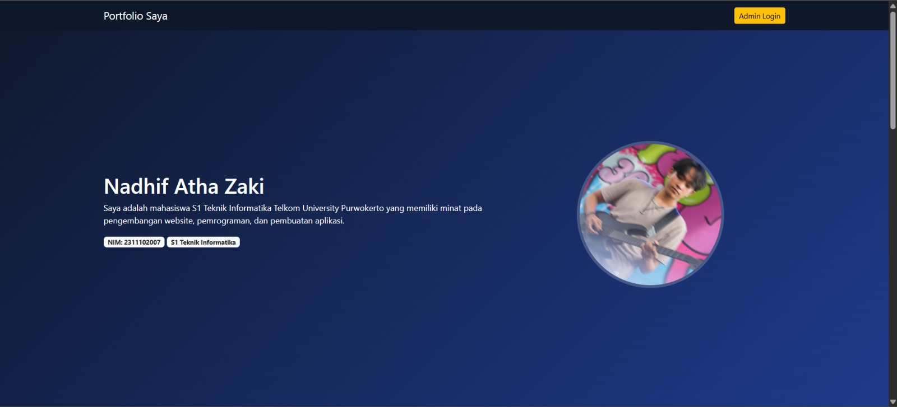
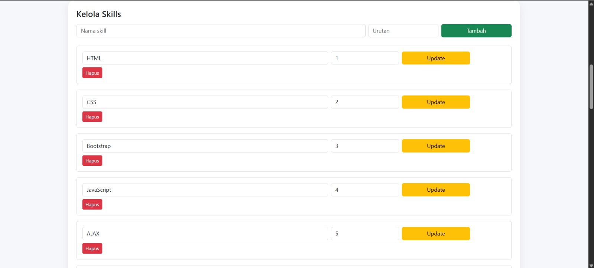
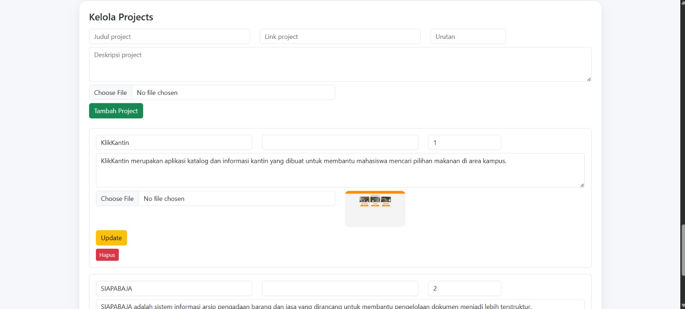

<div align="center">
  <br />
  <h1>LAPORAN PROYEK UTS <br>APLIKASI BERBASIS PLATFORM</h1>
  <br />
  <h3>UTS</h3>
  <br />
  <br />
  
  <br />
  <br />
  <br />
  <h3>Disusun Oleh :</h3>
  <p>
    <strong>Nadhif Atha Zaki</strong><br>
    <strong>2311102007</strong><br>
    <strong>S1 IF-11-01</strong>
  </p>
  <br />
  <h3>Dosen Pengampu :</h3>
  <p>
    <strong>Dimas Fanny Hebrasianto Permadi, S.ST., M.Kom</strong>
  </p>
  <br />
  <h4>Asisten Praktikum :</h4>
  <strong>Apri Pandu Wicaksono</strong> <br>
  <strong>Rangga Pradarrell Fathi</strong>
  <br />
  <h3>LABORATORIUM HIGH PERFORMANCE
 <br>FAKULTAS INFORMATIKA <br>UNIVERSITAS TELKOM PURWOKERTO <br>2026</h3>
</div>

---

## 1. Spesifikasi dan Implementasi Sistem (Kebutuhan Fungsional)

Penugasan Ujian Tengah Semester (UTS), proyek ini merupakan pengembangan **Website Portofolio Personal** yang didesain agar benar-benar dapat dimanfaatkan di dunia nyata sebagai portofolio digital (*Personal Branding*).

Adapun spesifikasi teknis dan fungsionalitas utama yang diterapkan berdasarkan instruksi ujian mencakup:

1. **Framework Utama**: Menjadikan **Laravel 12** sebagai pondasi *backend* utama dengan **PostgreSQL** sebagai sistem manajemen basis data relasional.
2. **Kebebasan Desain Antarmuka (Styling)**: Memanfaatkan **Bootstrap 5** untuk perancangan visual halaman web (*Landing Page* & *Dashboard*) secara responsif dan profesional.
3. **Pengelolaan Konten (Admin Dashboard)**: Menyediakan *dashboard* khusus yang ditujukan bagi administrator untuk mengonfigurasi dan melakukan perubahan konten yang tampil di halaman depan. Rincian seperti data profil, foto diri, keahlian, riwayat pendidikan, serta jejak proyek dapat dikontrol melalui operasi CRUD di area ini. Fitur unggah berkas (*file upload*) turut disediakan untuk foto profil yang tersimpan di `public/uploads/profile` maupun gambar tangkapan layar proyek di `public/uploads/projects`.
4. **Implementasi AJAX Terpadu (Wajib)**: Seluruh tampilan data profil, perolehan *skill*, riwayat pendidikan, hingga pencapaian proyek pada *landing page* sama sekali tidak menggunakan operan variabel Blade reguler (*direct rendering*). Tampilan halaman utama mutlak diisi dengan menarik data (*fetching*) yang di-*supply* oleh *backend endpoint* menggunakan **AJAX** berbasis Fetch API.

---

## 2. Penjelasan Kode Sumber

### 2.1 Backend API untuk AJAX (Routing & Logic)

Untuk mewujudkan aturan penampilan data yang harus memanggil *request* melewati AJAX, sistem menyediakan *endpoint* khusus yang sekadar mengirim respon kembalian berupa format tipe JSON untuk dibaca oleh kode sisi *client*.

*File Referensi: `routes/web.php` (Grup API)*

```php
// Rute untuk mengekspos endpoint API AJAX bagi landing page
Route::get('/api/portfolio', [PortfolioController::class, 'data']);
```

*File Referensi: `app/Http/Controllers/PortfolioController.php`*

```php
public function data(): JsonResponse
{
    return response()->json([
        'profile'    => \App\Models\Profile::first(),
        'skills'     => \App\Models\Skill::all(),
        'educations' => \App\Models\Education::orderBy('year', 'desc')->get(),
        'projects'   => \App\Models\Project::latest()->get(),
    ]);
}
```

---

### 2.2 Client-Side Load AJAX (`welcome.blade.php`)

Semua *scripting* yang menyusun bagian deskripsi di halaman depan terbuat dari struktur asynchronous. Hal ini memastikan bahwa data mentah berhasil dijemput dari API *backend* Laravel barulah ditempelkan pada *Document Object Model* (DOM) yang bersangkutan.

*File Referensi: `resources/views/welcome.blade.php`*

```javascript
// Implementasi AJAX / Fetch Data secara Asynchronous
fetch('/api/portfolio')
    .then(response => response.json())
    .then(data => {
        // Memanipulasi teks dan gambar secara dinamis dengan data API
        const profile = data.profile;
        document.getElementById('hero-name').innerText = profile.name;
        document.getElementById('hero-bio').innerText = profile.bio;
        document.getElementById('about-photo').src = '/uploads/profile/' + profile.photo;

        // Render daftar keahlian secara dinamis
        const skillsList = document.getElementById('skills-list');
        data.skills.forEach(skill => {
            skillsList.innerHTML += `<div class="mb-2">
                <span>${skill.name}</span>
                <div class="progress"><div class="progress-bar" style="width:${skill.percentage}%"></div></div>
            </div>`;
        });

        // Render daftar proyek secara dinamis
        const projectsList = document.getElementById('projects-list');
        data.projects.forEach(project => {
            projectsList.innerHTML += `<div class="col-md-4">
                <div class="card">
                    
                    <div class="card-body"><h5 class="card-title">${project.title}</h5>
                    <p class="card-text">${project.description}</p></div>
                </div>
            </div>`;
        });
    })
    .catch(error => console.error("Gagal mendapatkan data: ", error));
```

---

### 2.3 Migration & Model Basis Data Portofolio

Sistem diatur agar menyuplai empat koleksi basis data utama, yaitu `profiles`, `skills`, `educations`, dan `projects`. Melalui utilitas *Migration*, pendefinisian cetak biru basis data mempermudah pemindahan struktur antar *environment* pengembangan dengan PostgreSQL sebagai mesin basis data.

*Contoh Format Migration: `database/migrations/2026_04_20_000001_create_profiles_table.php`*

```php
public function up(): void
{
    Schema::create('profiles', function (Blueprint $table) {
        $table->id();
        $table->string('name');
        $table->text('bio')->nullable();
        $table->string('photo')->nullable();
        $table->string('email')->nullable();
        $table->string('linkedin_url')->nullable();
        $table->string('github_url')->nullable();
        $table->string('instagram_url')->nullable();
        $table->timestamps();
    });
}
```

*Contoh Format Migration: `database/migrations/2026_04_20_000002_create_projects_table.php`*

```php
public function up(): void
{
    Schema::create('projects', function (Blueprint $table) {
        $table->id();
        $table->string('title');
        $table->text('description')->nullable();
        $table->string('image')->nullable();
        $table->string('url')->nullable();
        $table->timestamps();
    });
}
```

---

### 2.4 Area Khusus Admin (Middleware Otentikasi)

Agar keleluasaan fungsi *dashboard* terlindungi dari publik, rute divalidasi terhadap pengunjung menggunakan *middleware* penguat sesi log in sekaligus verifikasi peran administrator.

*File Referensi: `routes/web.php`*

```php
// Perlindungan halaman admin dari pengguna yang belum login dan bukan admin
Route::middleware(['auth', 'admin'])->prefix('admin')->group(function () {
    Route::get('/dashboard', [DashboardController::class, 'index'])->name('dashboard');

    // Pengelolaan profil utama
    Route::get('/profile', [ProfileController::class, 'edit'])->name('admin.profile.edit');
    Route::put('/profile', [ProfileController::class, 'update'])->name('admin.profile.update');

    // Penerjemahan aksi resource CRUD tabel Keahlian, Pendidikan, dan Proyek
    Route::resource('skills', SkillController::class);
    Route::resource('educations', EducationController::class);
    Route::resource('projects', ProjectController::class);
});
```

---

### 2.5 Halaman Dashboard CRUD

Sebagai papan pengatur, *Dashboard* didesain mengakomodir empat area pengelolaan data sekaligus, yaitu profil, keahlian, pendidikan, dan proyek. Admin dapat memantau dan mengelola seluruh konten portofolio melalui antarmuka yang intuitif berbasis Bootstrap 5, termasuk fitur unggah gambar untuk foto profil maupun tangkapan layar proyek.

```html
<!-- Cuplikan Tampilan Dashboard Administrator -->
<div class="row g-4">
    <div class="col-lg-6">
        <div class="card shadow-sm">
            <div class="card-header fw-bold">Daftar Keahlian Saat Ini</div>
            <div class="card-body">
                <table class="table table-striped">
                    @foreach($latestSkills as $skill)
                        <tr>
                            <td>{{ $skill->name }}</td>
                            <td>{{ $skill->percentage }}%</td>
                        </tr>
                    @endforeach
                </table>
            </div>
        </div>
    </div>
    <div class="col-lg-6">
        <div class="card shadow-sm">
            <div class="card-header fw-bold">Proyek Terbaru</div>
            <div class="card-body">
                <table class="table table-striped">
                    @foreach($latestProjects as $project)
                        <tr>
                            <td>{{ $project->title }}</td>
                        </tr>
                    @endforeach
                </table>
            </div>
        </div>
    </div>
</div>
```

---

## 3. Hasil Tampilan (Screenshots) Aplikasi

Halaman utama portofolio yang dapat diakses oleh publik. Seluruh data profil, keahlian, riwayat pendidikan, dan proyek yang tampil ditarik dari *backend* menggunakan *fetch API* (AJAX).




---

### 3.2 Halaman Login

Halaman autentikasi administrator. Hanya pengguna yang terdaftar pada *database* dengan peran admin yang dapat masuk untuk mengakses *dashboard* pengelolaan data.



---

### 3.3 Halaman Dashboard Admin

Halaman utama administrator setelah berhasil *login*. Memuat tabel visual yang menampilkan data keahlian dan proyek terbaru untuk mempermudah pemantauan konten portofolio secara menyeluruh.



---

### 3.4 Halaman Profil

Halaman pengisian untuk mengelola dan memperbarui informasi identitas profil utama, meliputi nama, teks bio, unggah foto profil, serta tautan media sosial LinkedIn, GitHub, dan Instagram.



---

### 3.5 Halaman CRUD Skill

Halaman manajemen data keahlian. Melalui halaman ini, admin dapat menambah data *skill* baru (*Create*), memperbarui nama dan persentase *skill* (*Update*), serta menghapus *skill* yang sudah tidak relevan (*Delete*).




---

### 3.6 Halaman CRUD Project

Halaman tabel formulir untuk mengelola kumpulan portofolio proyek. Admin leluasa menambahkan gambar tangkapan layar proyek melalui fitur *upload*, melengkapi deskripsi, hingga mencantumkan judul hasil karya agar otomatis tayang di *landing page*.




---

## 4. Kesimpulan

Proyek portofolio personal berbasis web yang dirancang ini membuktikan diri sukses menjawab setiap detail tuntutan penugasan di masa evaluasi UTS secara kohesif. Spesifikasi pilar layaknya kerangka integrasi **Laravel 12** bersama **PostgreSQL** sebagai basis data relasional, pemakaian tata busana HTML melalui **Bootstrap 5**, proteksi pengelolaan data spesifik *dashboard* kontrol admin menggunakan *middleware* berlapis (`auth` dan `admin`), fitur unggah berkas untuk foto profil maupun gambar proyek, beserta mekanisme aliran data non-konvensional **AJAX** berbasis Fetch API (memisahkan pengaksesan data secara asinkron, menepis integrasi *direct view rendering*) semuanya terlaksana seutuhnya. Karya akhirnya bukan sekadar prototipe tugas mentah, melainkan sebuah web personal sungguhan yang mantap diakomodasi untuk kepentingan karir perorangan ke depannya.

---

## 5. Referensi

- **Laravel Documentation**: [https://laravel.com/docs](https://laravel.com/docs)
- **Bootstrap 5 Styling**: [https://getbootstrap.com/docs](https://getbootstrap.com/docs)
- **Aplikasi AJAX Fetch API**: [https://developer.mozilla.org/en-US/docs/Web/API/Fetch_API](https://developer.mozilla.org/en-US/docs/Web/API/Fetch_API)