<div align="center">

# LAPORAN PRAKTIKUM
## APLIKASI BERBASIS PLATFORM
### MODUL 11, 12, 13 — LARAVEL


**Disusun Oleh:**
Annisa Al Jauhar
2311102014
S1 IF-11-REG01

**Dosen Pengampu:**
Dimas Fanny Hebrasianto Permadi, S.ST., M.Kom

**PROGRAM STUDI S1 INFORMATIKA**
**FAKULTAS INFORMATIKA**
**UNIVERSITAS TELKOM PURWOKERTO**
2025/2026

</div>

---

## 1. Dasar Teori

### Laravel Framework
Laravel adalah framework PHP berbasis MVC (Model-View-Controller) yang menyediakan struktur pengembangan web yang elegan dan terorganisir. Laravel menyederhanakan berbagai tugas umum seperti routing, autentikasi, migrasi database, dan manajemen session. Pada praktikum ini Laravel digunakan sebagai fondasi utama untuk membangun aplikasi portofolio personal dengan fitur manajemen konten melalui dashboard admin.

### MVC (Model-View-Controller)
MVC adalah pola arsitektur perangkat lunak yang memisahkan logika aplikasi menjadi tiga komponen utama. Model bertugas mengelola data dan interaksi dengan database, View bertanggung jawab atas tampilan antarmuka pengguna, dan Controller menjadi perantara antara Model dan View untuk memproses request dari pengguna. Pada praktikum ini, Model Profile, Skill, Experience, Education, dan Project mengelola data portofolio, Controller DashboardController memproses logika admin, serta file Blade template menjadi View yang ditampilkan ke pengguna.

### Eloquent ORM
Eloquent adalah ORM (Object-Relational Mapping) bawaan Laravel yang memungkinkan interaksi dengan database menggunakan sintaks PHP yang ekspresif tanpa perlu menulis query SQL secara manual. Setiap tabel database direpresentasikan oleh sebuah Model. Pada praktikum ini Eloquent digunakan untuk operasi CRUD konten portofolio seperti `Skill::create()`, `Education::orderBy()`, `$experience->update()`, dan `$project->delete()`.

### Migration dan Schema Builder
Migration adalah mekanisme Laravel untuk mendefinisikan dan mengelola struktur database menggunakan kode PHP. Migration memungkinkan pembuatan, modifikasi, dan penghapusan tabel secara terstruktur dan dapat di-rollback. Pada praktikum ini migration digunakan untuk membuat tabel users, profiles, skills, experiences, educations, dan projects dengan kolom-kolom yang telah didefinisikan menggunakan Schema Builder Laravel.

### Sistem Autentikasi dengan Session
Autentikasi berbasis session adalah mekanisme keamanan di mana informasi pengguna yang telah login disimpan di sisi server. Laravel menyediakan facade `Auth` yang memudahkan proses login, logout, dan pengecekan status autentikasi. Middleware `auth` digunakan untuk melindungi route dashboard admin sehingga hanya pengguna yang sudah login yang dapat mengakses dan mengelola konten portofolio.

### Blade Template Engine
Blade adalah template engine bawaan Laravel yang memungkinkan penulisan kode PHP di dalam file HTML dengan sintaks yang lebih bersih dan mudah dibaca. Blade mendukung inheritance layout dengan direktif `@extends` dan `@section`, perulangan dengan `@foreach`, kondisi dengan `@if`, serta komponen lainnya. Pada praktikum ini seluruh tampilan portofolio dan dashboard admin dibangun menggunakan Blade template.

### REST API dengan JSON Response
Pada praktikum ini dashboard admin menggunakan pendekatan API dengan JSON response untuk komunikasi antara frontend dan backend. Controller mengembalikan `JsonResponse` yang kemudian dikonsumsi oleh JavaScript di sisi frontend untuk menampilkan dan memperbarui data secara dinamis tanpa perlu reload halaman penuh.

---

## 2. Struktur Project

```
portofolio-annisa/
├── app/
│   ├── Http/
│   │   └── Controllers/
│   │       ├── Admin/
│   │       │   └── DashboardController.php  (kelola konten portofolio)
│   │       └── Auth/
│   │           └── LoginController.php      (autentikasi admin)
│   └── Models/
│       ├── Profile.php                      (model profil)
│       ├── Skill.php                        (model skill)
│       ├── Experience.php                   (model pengalaman)
│       ├── Education.php                    (model pendidikan)
│       └── Project.php                      (model project)
├── database/
│   ├── migrations/
│   │   └── create_portfolio_tables.php      (struktur semua tabel)
│   └── seeders/
│       └── DatabaseSeeder.php               (data awal portofolio)
├── resources/
│   └── views/
│       ├── welcome.blade.php                (halaman portofolio publik)
│       ├── auth/
│       │   └── login.blade.php              (halaman login admin)
│       └── admin/
│           └── dashboard.blade.php          (dashboard admin)
├── routes/
│   └── web.php                              (definisi semua route)
└── .env                                     (konfigurasi database)
```

---

## 3. Struktur Database

### Tabel `users`
| Kolom | Tipe | Keterangan |
|-------|------|------------|
| id | BIGINT (PK) | Primary key auto increment |
| name | VARCHAR(255) | Nama pengguna |
| email | VARCHAR(255) | Email unik pengguna |
| password | VARCHAR(255) | Password terenkripsi |
| created_at | TIMESTAMP | Waktu dibuat |
| updated_at | TIMESTAMP | Waktu diperbarui |

### Tabel `profiles`
| Kolom | Tipe | Keterangan |
|-------|------|------------|
| id | BIGINT (PK) | Primary key auto increment |
| name | VARCHAR(255) | Nama lengkap |
| tagline | VARCHAR(255) | Tagline/subtitle |
| bio | TEXT | Deskripsi diri |
| email | VARCHAR(255) | Email kontak |
| phone | VARCHAR(20) | Nomor telepon |
| location | VARCHAR(255) | Lokasi |
| github_username | VARCHAR(100) | Username GitHub |
| linkedin_url | VARCHAR(255) | URL LinkedIn |
| instagram_url | VARCHAR(255) | URL Instagram |
| photo | VARCHAR(255) | Path foto profil |
| created_at | TIMESTAMP | Waktu dibuat |
| updated_at | TIMESTAMP | Waktu diperbarui |

### Tabel `skills`
| Kolom | Tipe | Keterangan |
|-------|------|------------|
| id | BIGINT (PK) | Primary key auto increment |
| name | VARCHAR(100) | Nama skill |
| category | VARCHAR(50) | Kategori skill |
| level | INTEGER | Level kemampuan (0-100) |
| icon | VARCHAR(10) | Ikon emoji skill |
| order | INTEGER | Urutan tampil |
| created_at | TIMESTAMP | Waktu dibuat |
| updated_at | TIMESTAMP | Waktu diperbarui |

### Tabel `experiences`
| Kolom | Tipe | Keterangan |
|-------|------|------------|
| id | BIGINT (PK) | Primary key auto increment |
| company | VARCHAR(255) | Nama perusahaan |
| role | VARCHAR(255) | Jabatan/posisi |
| description | TEXT | Deskripsi pekerjaan |
| start_date | VARCHAR(50) | Tanggal mulai |
| end_date | VARCHAR(50) | Tanggal selesai |
| order | INTEGER | Urutan tampil |
| created_at | TIMESTAMP | Waktu dibuat |
| updated_at | TIMESTAMP | Waktu diperbarui |

### Tabel `educations`
| Kolom | Tipe | Keterangan |
|-------|------|------------|
| id | BIGINT (PK) | Primary key auto increment |
| institution | VARCHAR(255) | Nama institusi |
| degree | VARCHAR(100) | Jenjang pendidikan |
| field | VARCHAR(255) | Jurusan/bidang |
| start_year | VARCHAR(10) | Tahun mulai |
| end_year | VARCHAR(10) | Tahun selesai |
| description | TEXT | Deskripsi pendidikan |
| order | INTEGER | Urutan tampil |
| created_at | TIMESTAMP | Waktu dibuat |
| updated_at | TIMESTAMP | Waktu diperbarui |

---

## 4. Langkah-Langkah Penggunaan

### P0 - Struktur Database portfolio_annisa
Sebelum menjalankan aplikasi, database portfolio_annisa dibuat terlebih dahulu melalui phpMyAdmin. Setelah menjalankan perintah php artisan migrate --seed, Laravel secara otomatis membuat seluruh tabel yang dibutuhkan. Tabel yang terbentuk antara lain educations, experiences, failed_jobs, migrations, password_resets, personal_access_tokens, profiles, skills, dan users. Tabel-tabel tersebut menggunakan engine InnoDB dengan charset utf8mb4_unicode_ci. Data awal portofolio juga langsung terisi melalui proses seeder yang dijalankan bersamaan dengan migration.

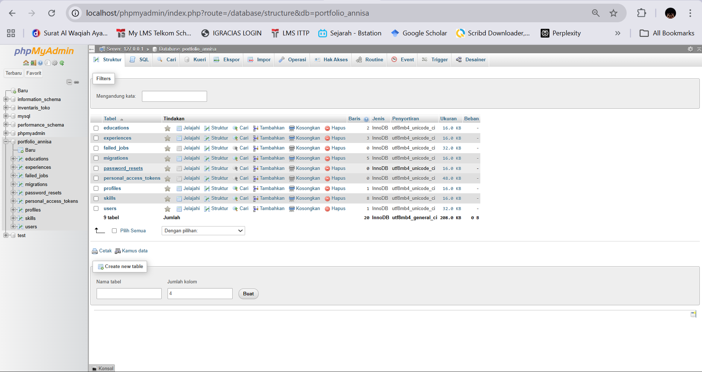

---

### P1 - Tampilan Tentang Saya
Bagian ini menampilkan informasi personal Annisa Al Jauhar beserta foto profil, bio singkat, dan informasi kontak. Pengunjung dapat melihat deskripsi diri, lokasi, email, serta tautan ke media sosial seperti GitHub, LinkedIn, dan Instagram.

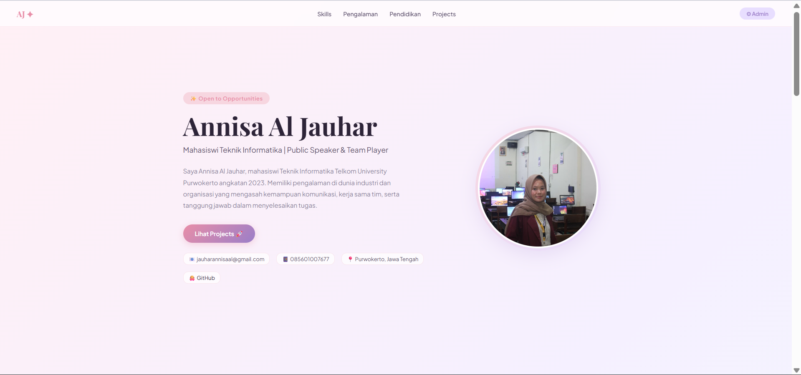

---

### P2 - Tampilan Kemampuan
Bagian kemampuan menampilkan daftar skill Annisa yang dibagi menjadi dua kategori yaitu Soft Skill dan Kemampuan Teknis. Setiap skill ditampilkan dengan nama, ikon, dan indikator level kemampuan dalam bentuk progress bar. Data skill ini diambil dari database dan dapat dikelola melalui dashboard admin.

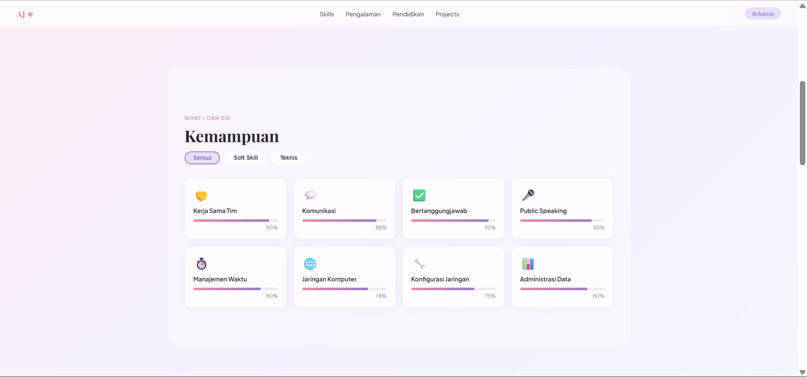

---

### P3 - Tampilan Pengalaman
Bagian pengalaman menampilkan riwayat pengalaman kerja atau organisasi Annisa secara kronologis. Setiap entri pengalaman menampilkan nama perusahaan/organisasi, jabatan, periode waktu, dan deskripsi singkat kegiatan yang dilakukan.

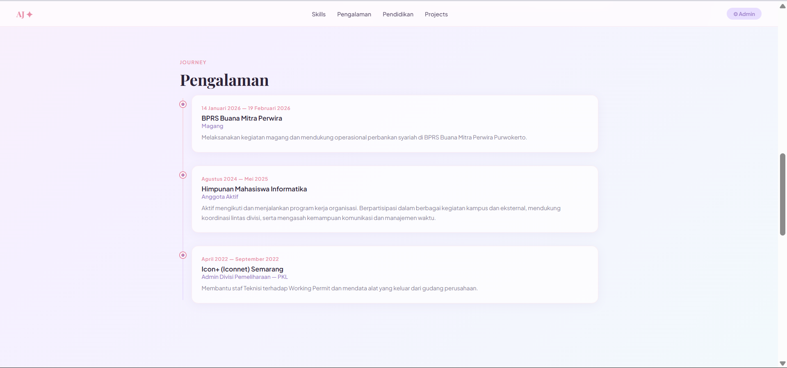

---

### P4 - Tampilan Pendidikan
Bagian pendidikan menampilkan riwayat pendidikan formal Annisa mulai dari SMK hingga perguruan tinggi. Setiap entri pendidikan menampilkan nama institusi, jenjang, jurusan, tahun masuk dan lulus, serta deskripsi singkat.

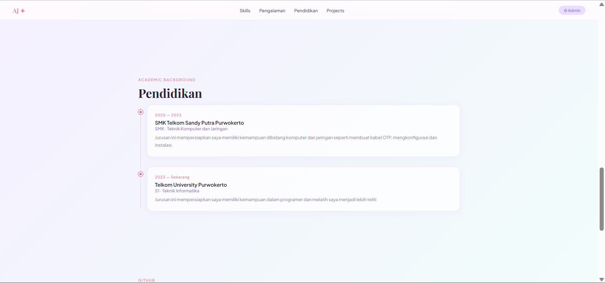

---

### P5 - Tampilan Projects
Bagian projects menampilkan daftar project yang pernah dikerjakan oleh Annisa. Setiap project ditampilkan dengan nama project, deskripsi, dan tautan langsung ke repositori GitHub. Ketika pengunjung mengklik project tersebut, mereka akan langsung diarahkan ke halaman GitHub project yang bersangkutan.

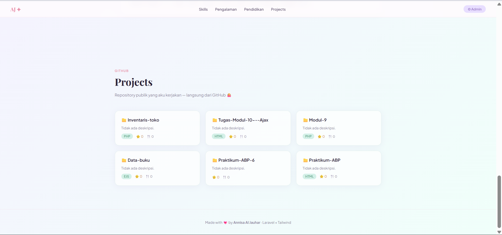

---

### P6 - Tampilan Dashboard Admin - Profil
Halaman dashboard admin dapat diakses setelah login. Pada bagian profil, admin dapat mengedit seluruh informasi profil portofolio seperti nama, tagline, bio, email, nomor telepon, lokasi, username GitHub, URL LinkedIn, URL Instagram, dan foto profil. Perubahan yang disimpan akan langsung tercermin di halaman portofolio publik.

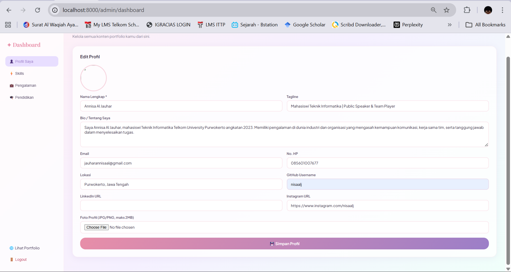

---

### P7 - Tampilan Dashboard Admin - Skill
Pada bagian skill di dashboard admin, admin dapat menambahkan skill baru dengan mengisi nama skill, kategori (Soft Skill atau Teknis), level kemampuan, dan ikon emoji. Skill yang sudah ada juga dapat diedit atau dihapus. Semua perubahan akan langsung ditampilkan di halaman portofolio publik.

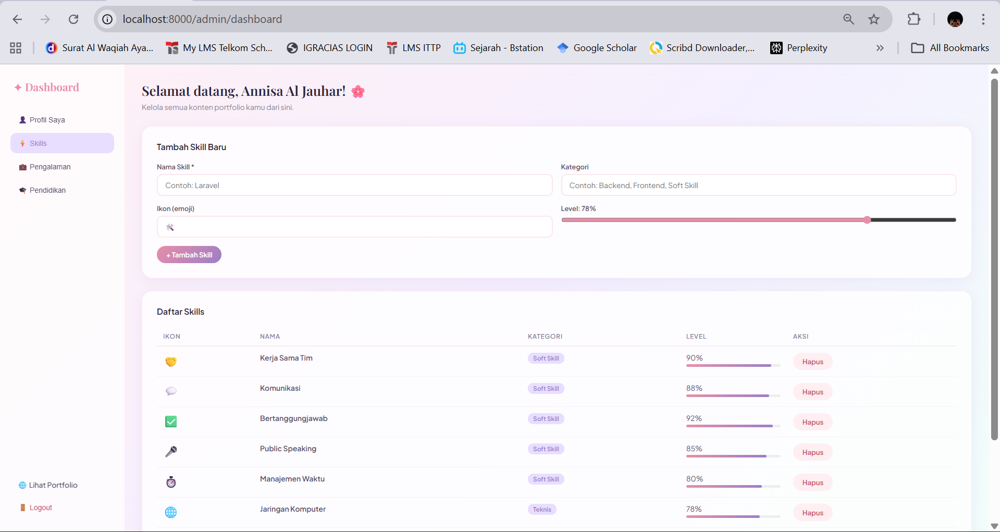

---

### P8 - Tampilan Dashboard Admin - Pengalaman
Pada bagian pengalaman di dashboard admin, admin dapat menambahkan pengalaman baru dengan mengisi nama perusahaan/organisasi, jabatan/posisi, tanggal mulai, tanggal selesai, dan deskripsi kegiatan. Pengalaman yang sudah ada juga dapat diperbarui atau dihapus sesuai kebutuhan.

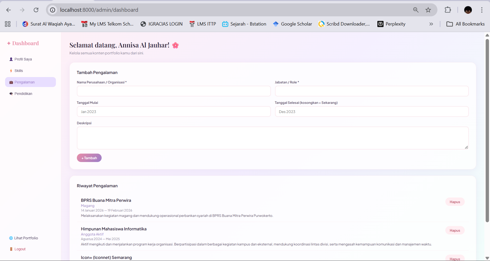

---

### P9 - Tampilan Dashboard Admin - Pendidikan
Pada bagian pendidikan di dashboard admin, admin dapat menambahkan riwayat pendidikan baru dengan mengisi nama institusi, jenjang pendidikan, jurusan/bidang, tahun mulai, tahun selesai, dan deskripsi. Data pendidikan yang sudah ada juga dapat diedit atau dihapus melalui antarmuka yang disediakan.

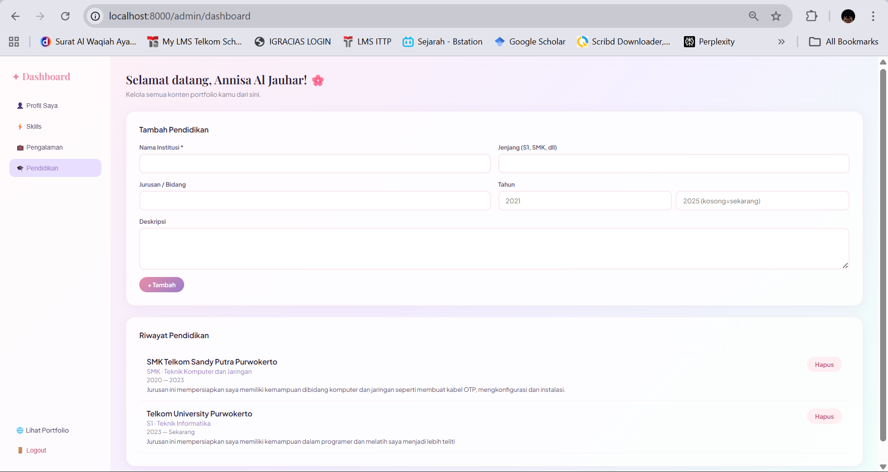

---

### P10 - Tampilan Halaman Login Admin
Halaman login admin dapat diakses melalui route khusus yang dilindungi. Halaman ini menampilkan form login dengan field email dan password. Hanya pengguna yang terdaftar sebagai admin yang dapat masuk ke dashboard dan mengelola konten portofolio. Setelah berhasil login, admin akan diarahkan ke halaman dashboard.

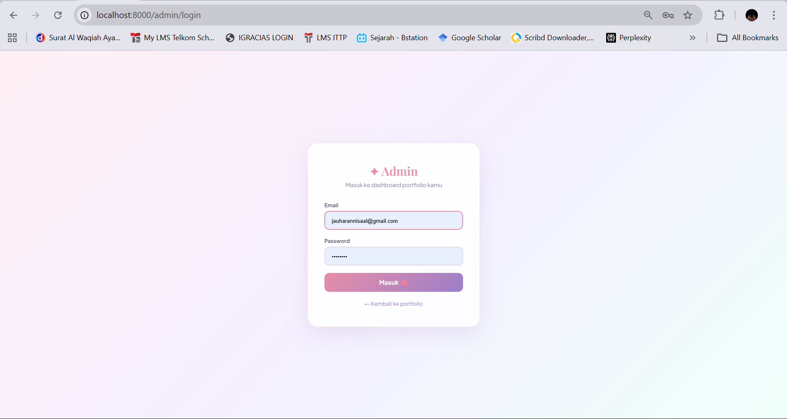

---

## 5. Cara Menjalankan Aplikasi

```bash
# 1. Pastikan XAMPP sudah terinstal dan Apache + MySQL sudah aktif

# 2. Copy project ke direktori htdocs XAMPP
#    Contoh: C:\xampp\htdocs\portofolio-annisa

# 3. Masuk ke direktori project
cd C:\xampp\htdocs\portofolio-annisa

# 4. Install dependencies Laravel
composer install

# 5. Copy file .env dan generate key
cp .env.example .env
php artisan key:generate

# 6. Sesuaikan konfigurasi database di file .env
DB_CONNECTION=mysql
DB_HOST=127.0.0.1
DB_PORT=3306
DB_DATABASE=portfolio_annisa
DB_USERNAME=root
DB_PASSWORD=

# 7. Jalankan migration dan seeder
php artisan migrate --seed

# 8. Buat symbolic link untuk storage
php artisan storage:link

# 9. Jalankan server Laravel
php artisan serve

# 10. Buka browser dan akses aplikasi
# http://127.0.0.1:8000
```

---

## 6. Fitur Aplikasi

| Fitur | Keterangan |
|-------|------------|
| Halaman Portofolio Publik | Tampilan portofolio yang dapat diakses oleh siapapun |
| Login Admin | Autentikasi untuk masuk ke dashboard admin |
| Kelola Profil | Edit informasi profil dan foto melalui dashboard |
| Kelola Skill | Tambah, edit, dan hapus skill di dashboard |
| Kelola Pengalaman | Tambah, edit, dan hapus pengalaman di dashboard |
| Kelola Pendidikan | Tambah, edit, dan hapus pendidikan di dashboard |
| Kelola Projects | Tambah project dengan tautan GitHub |
| Integrasi GitHub | Klik project langsung diarahkan ke repositori GitHub |
| Proteksi Route | Dashboard hanya bisa diakses setelah login |
| AJAX / Fetch API | Semua data dimuat secara dinamis tanpa reload halaman |