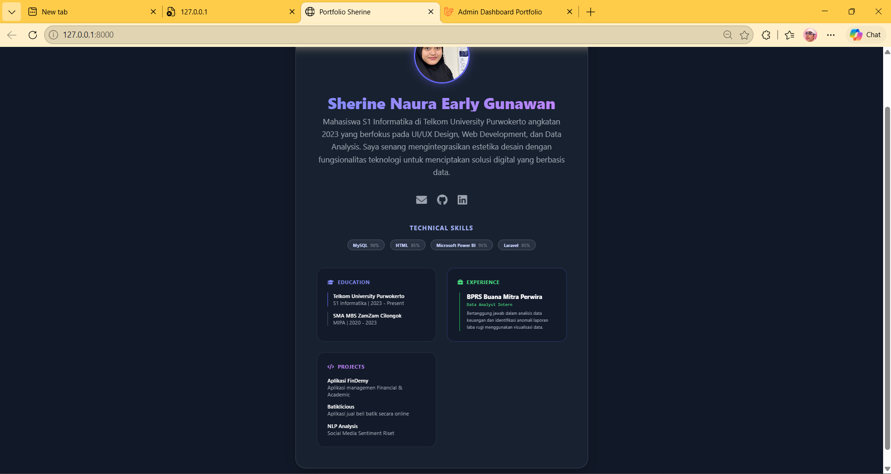
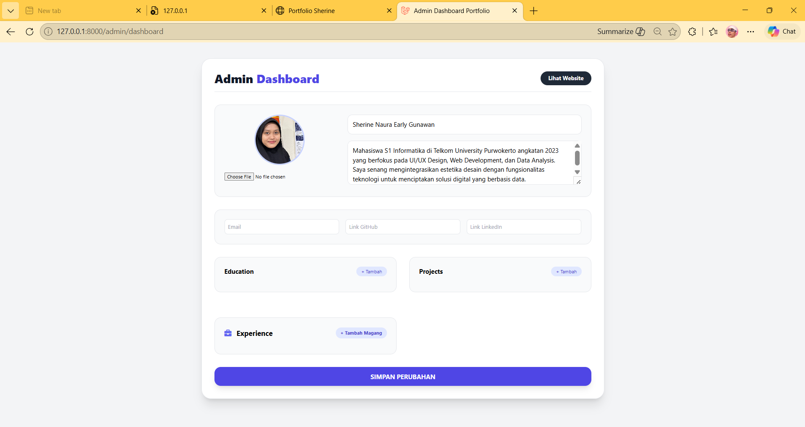
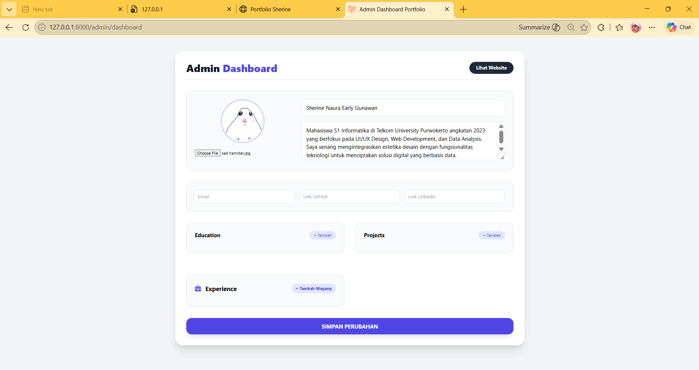
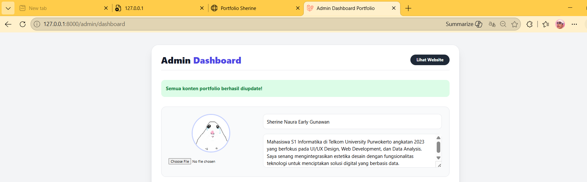
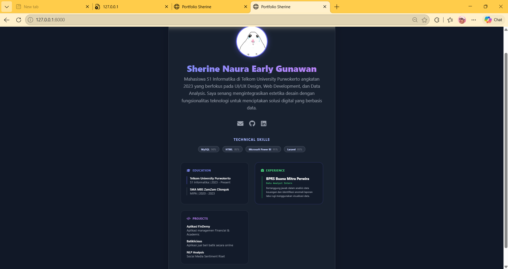

<div align="center">

# LAPORAN PRAKTIKUM
# APLIKASI BERBASIS PLATFORM


## UTS
## MEMBUAT WEB PORTOFOLIO


**Disusun Oleh :**

**Sherine Naura Early Gunawan**

**2311102020**

**S1 IF-11-REG01**


**PROGRAM STUDI S1 INFORMATIKA**

**FAKULTAS INFORMATIKA**

**UNIVERSITAS TELKOM PURWOKERTO**

**2025/2026**

</div>

---

## 1. Dasar Teori


---

## 2. Source Code
### app/Http/Controller/Api/PortofolioController 

```php
<?php

namespace App\Http\Controllers\Api;

use App\Http\Controllers\Controller;
use Illuminate\Http\Request;
use App\Models\Profile;
use App\Models\Skill;
use App\Models\Education; 
use App\Models\Project;   
class PortfolioController extends Controller
{
    public function index()
    {
        $profile = Profile::first(); 
        $skills = Skill::all();
        $education = Education::all(); 
        $projects = Project::all();   

        return response()->json([
            'profile'   => $profile,
            'skills'    => $skills,
            'education' => $education, 
            'projects'  => $projects    
        ]);
    }
}
```
### app/Http/Controller/Admin/ProfileController
```php
<?php

namespace App\Http\Controllers\Admin;

use App\Http\Controllers\Controller;
use App\Models\Profile;
use App\Models\Education;
use App\Models\Project;
use App\Models\Experience; 
use Illuminate\Http\Request;
use Illuminate\Support\Facades\Storage;

class ProfileController extends Controller
{
    public function index() {
        $profile = Profile::first();
        $education = Education::all(); 
        $projects = Project::all();  
        $experiences = Experience::all();  
        
        return view('admin.dashboard', compact('profile', 'education', 'projects', 'experiences'));
    }

    public function update(Request $request) {
        $profile = Profile::first();
        
        $validated = $request->validate([
            'name' => 'required',
            'description' => 'required',
            'photo' => 'nullable|image|mimes:jpg,png,jpeg|max:2048',
            'email' => 'required|email',
            'github_link' => 'nullable|url',
            'linkedin_link' => 'nullable|url',
            
            'edu.*.institution_name' => 'required',
            'edu.*.year_period' => 'required',
            
            'proj.*.project_name' => 'required',
            'proj.*.description' => 'required',

            'exp.*.company_name' => 'required',
            'exp.*.position' => 'required',
        ]);

        if ($request->hasFile('photo')) {
            if ($profile->photo) Storage::disk('public')->delete($profile->photo);
            $validated['photo'] = $request->file('photo')->store('photos', 'public');
        }

        $profileData = collect($validated)->only(['name', 'description', 'photo', 'email', 'github_link', 'linkedin_link'])->toArray();
        $profile->update($profileData);

        Education::query()->delete(); 
        if($request->edu) {
            foreach ($request->edu as $eduData) {
                Education::create($eduData);
            }
        }

        Project::query()->delete(); 
        if($request->proj) {
            foreach ($request->proj as $projData) {
                Project::create($projData);
            }
        }

        Experience::query()->delete();
        if($request->exp) {
            foreach ($request->exp as $expData) {
                Experience::create($expData);
            }
        }

        return back()->with('success', 'Semua konten portfolio berhasil diupdate!');
    }
}
```
### app/models/Education
```php
<?php

namespace App\Models;

use Illuminate\Database\Eloquent\Model;

class Education extends Model
{
    protected $table = 'education';

    protected $fillable = [
        'institution_name', 
        'year_period'
    ];
}
```
### app/Models/Experience 
```php
<?php

namespace App\Models;

use Illuminate\Database\Eloquent\Model;

class Experience extends Model
{
    protected $fillable = ['company_name', 'position', 'year_period', 'description'];
}
```
### app/Models/Profile
```php
<?php

namespace App\Models;

use Illuminate\Database\Eloquent\Factories\HasFactory;
use Illuminate\Database\Eloquent\Model;

class Profile extends Model
{
    use HasFactory;

    protected $fillable = [
        'name', 
        'description', 
        'photo', 
        'email',         
        'github_link',   
        'linkedin_link'  
    ];
}
```
### app/Models/Project
```php
<?php

namespace App\Models;

use Illuminate\Database\Eloquent\Model;

class Project extends Model
{
    protected $fillable = [
        'project_name', 
        'description'
    ];
}
```
### app/Models/Skill
```php
<?php

namespace App\Models;

use Illuminate\Database\Eloquent\Model;

class Skill extends Model
{
    protected $fillable = [
    'skill_name',
    'level',
    ];
}
```
### database/Migration/create_profile_table
```php
<?php

use Illuminate\Database\Migrations\Migration;
use Illuminate\Database\Schema\Blueprint;
use Illuminate\Support\Facades\Schema;

return new class extends Migration
{
    /**
     * Run the migrations.
     */
    public function up(): void
    {
        Schema::create('profiles', function (Blueprint $table) {
            $table->id();
            $table->string('name');
            $table->text('description');
            $table->string('photo')->nullable();
            $table->string('email');
            $table->string('github_link')->nullable(); 
            $table->string('linkedin_link')->nullable(); 
            $table->timestamps();
        });
}

    /**
     * Reverse the migrations.
     */
    public function down(): void
    {
        Schema::dropIfExists('profiles');
    }
};
```
### database/Migration/create_skills_table
```php
<?php

use Illuminate\Database\Migrations\Migration;
use Illuminate\Database\Schema\Blueprint;
use Illuminate\Support\Facades\Schema;

return new class extends Migration
{
    /**
     * Run the migrations.
     */
    public function up(): void
    {
        Schema::create('skills', function (Blueprint $table) {
            $table->id();
            $table->string('skill_name');
            $table->integer('level');      
            $table->timestamps();
        });
    }

    /**
     * Reverse the migrations.
     */
    public function down(): void
    {
        Schema::dropIfExists('skills');
    }
};
```
### database/Migration/create_education_table
```php 
<?php

use Illuminate\Database\Migrations\Migration;
use Illuminate\Database\Schema\Blueprint;
use Illuminate\Support\Facades\Schema;

return new class extends Migration
{
    /**
     * Run the migrations.
     */
    public function up(): void
    {
        Schema::create('education', function (Blueprint $table) {
            $table->id();
            $table->string('institution_name');
            $table->string('year_period');
            $table->timestamps();
        });
    }

    /**
     * Reverse the migrations.
     */
    public function down(): void
    {
        Schema::dropIfExists('education');
    }
};
```
### database/Migration/create_project_table
```php
<?php

use Illuminate\Database\Migrations\Migration;
use Illuminate\Database\Schema\Blueprint;
use Illuminate\Support\Facades\Schema;

return new class extends Migration
{
    /**
     * Run the migrations.
     */
    public function up(): void
    {
        Schema::create('projects', function (Blueprint $table) {
            $table->id();
            $table->string('project_name');
            $table->text('description');
            $table->timestamps();
        });
    }

    /**
     * Reverse the migrations.
     */
    public function down(): void
    {
        Schema::dropIfExists('projects');
    }
};
```
### database/Migration/create_experience_table
```php
<?php

use Illuminate\Database\Migrations\Migration;
use Illuminate\Database\Schema\Blueprint;
use Illuminate\Support\Facades\Schema;

return new class extends Migration
{
    /**
     * Run the migrations.
     */
    public function up(): void
    {
        Schema::create('experiences', function (Blueprint $table) {
        $table->id();
        $table->string('company_name');
        $table->string('position');
        $table->string('year_period');
        $table->text('description')->nullable();
        $table->timestamps();
    });
    }

    /**
     * Reverse the migrations.
     */
    public function down(): void
    {
        Schema::dropIfExists('experiences');
    }
};
```

### database/Seeder/PortofolioSeeder
```php
<?php

namespace Database\Seeders;

use Illuminate\Database\Seeder;
use App\Models\Profile;
use App\Models\Skill;

class PortfolioSeeder extends Seeder
{
    public function run(): void
    {
        Profile::truncate();
        Skill::truncate();

        Profile::create([
            'name' => 'Sherine Naura Early Gunawan',
            'description' => 'Mahasiswa S1 Informatika di Universitas Telkom Purwokerto.',
            'email' => 'sheringunawan777@gmail.com',
        ]);

        Skill::create(['skill_name' => 'MySQL', 'level' => 90]);
        Skill::create(['skill_name' => 'HTML', 'level' => 85]);
        Skill::create(['skill_name' => 'Microsoft Power BI', 'level' => 95]);
        Skill::create(['skill_name' => 'Laravel', 'level' => 85]);
    }
}
```
### database/Seeder/DatabaseSeeder
```php
<?php

namespace Database\Seeders;

use App\Models\User;
use Illuminate\Database\Console\Seeds\WithoutModelEvents;
use Illuminate\Database\Seeder;

class DatabaseSeeder extends Seeder
{
    use WithoutModelEvents;

    /**
     * Seed the application's database.
     */
    public function run(): void
    {
        $this->call([
        PortfolioSeeder::class,
    ]);
    }
}
```
### resource/views/welcome.blade.php
```php
<!DOCTYPE html>
<html lang="en">
<head>
    <meta charset="UTF-8">
    <title>Portfolio Sherine</title>
    <script src="https://cdn.tailwindcss.com"></script>
    <link rel="stylesheet" href="https://cdnjs.cloudflare.com/ajax/libs/font-awesome/6.0.0/css/all.min.css">
    <style>
        .fade-in { animation: fadeIn 0.8s ease-in-out; }
        @keyframes fadeIn { from { opacity: 0; transform: translateY(20px); } to { opacity: 1; transform: translateY(0); } }
        .glass-card { background: rgba(31, 41, 55, 0.5); backdrop-filter: blur(10px); }
    </style>
</head>
<body class="bg-gray-900 text-white font-sans selection:bg-indigo-500 selection:text-white">

    <div class="min-h-screen flex items-center justify-center p-6 py-12">
        <div id="loading" class="text-xl animate-pulse font-mono text-indigo-400">
            &gt; Loading...
        </div>

        <div id="app" class="hidden fade-in max-w-2xl w-full text-center p-8 md:p-12 glass-card rounded-3xl shadow-2xl border border-gray-700">
            
            
            
            <h1 id="p-name" class="text-4xl font-extrabold text-transparent bg-clip-text bg-gradient-to-r from-indigo-400 to-purple-400 mb-2"></h1>
            <p id="p-desc" class="text-gray-400 text-lg mb-8 leading-relaxed"></p>
            
            <div class="flex justify-center gap-6 mb-10">
                <a id="p-email-link" href="#" class="text-gray-400 hover:text-indigo-400 transition-all transform hover:scale-110 text-2xl">
                    <i class="fa-solid fa-envelope"></i>
                </a>
                <a href="https://github.com/sherinenaura" target="_blank" class="text-gray-400 hover:text-white transition-all transform hover:scale-110 text-2xl">
                    <i class="fa-brands fa-github"></i>
                </a>
                <a href="https://www.linkedin.com/in/sherine-naura-early-gunawan-97764b39b" target="_blank" class="text-gray-400 hover:text-blue-400 transition-all transform hover:scale-110 text-2xl">
                    <i class="fa-brands fa-linkedin"></i>
                </a>
            </div>

            <div class="mb-10">
                <h3 class="text-sm uppercase tracking-widest font-bold mb-4 text-indigo-300">Technical Skills</h3>
                <div id="p-skills" class="flex flex-wrap justify-center gap-3"></div>
            </div>

            <div class="grid md:grid-cols-2 gap-6 text-left">
                <div class="bg-gray-900/60 p-6 rounded-2xl border border-gray-700/50">
                    <h3 class="text-indigo-400 font-bold mb-4 flex items-center text-xs uppercase tracking-wider">
                        <i class="fa-solid fa-graduation-cap mr-2"></i> Education
                    </h3>
                    <ul class="text-gray-400 space-y-3 text-xs">
                        <li class="border-l-2 border-indigo-500 pl-3">
                            <p class="text-white font-semibold">Telkom University Purwokerto</p>
                            <p>S1 Informatika | 2023 - Present</p>
                        </li>
                        <li class="border-l-2 border-gray-600 pl-3">
                            <p class="text-white font-semibold">SMA MBS ZamZam Cilongok</p>
                            <p>MIPA | 2020 - 2023</p>
                        </li>
                    </ul>
                </div>

                <div class="bg-gray-900/60 p-6 rounded-2xl border border-indigo-500/30">
                    <h3 class="text-green-400 font-bold mb-4 flex items-center text-xs uppercase tracking-wider">
                        <i class="fa-solid fa-briefcase mr-2"></i> Experience
                    </h3>
                    <div class="space-y-4">
                        <div class="border-l-2 border-green-500 pl-4 ml-1">
                            <p class="text-white font-bold text-sm">BPRS Buana Mitra Perwira</p>
                            <p class="text-green-400 text-[10px] font-mono">Data Analyst Intern</p>
                            <p class="text-gray-400 text-[10px] mt-1 leading-relaxed">
                                Bertanggung jawab dalam analisis data keuangan dan identifikasi anomali laporan laba rugi menggunakan visualisasi data.
                            </p>
                        </div>
                    </div>
                </div>

                <div class="bg-gray-900/60 p-6 rounded-2xl border border-gray-700/50">
                    <h3 class="text-purple-400 font-bold mb-4 flex items-center text-xs uppercase tracking-wider">
                        <i class="fa-solid fa-code mr-2"></i> Projects
                    </h3>
                    <ul class="text-gray-400 space-y-3 text-xs">
                        <li>
                            <p class="text-white font-semibold">Aplikasi FinDemy</p>
                            <p>Aplikasi managemen Financial & Academic</p>
                        </li>
                        <li>
                            <p class="text-white font-semibold">Batiklicious</p>
                            <p>Aplikasi jual beli batik secara online</p>
                        </li>
                        <li>
                            <p class="text-white font-semibold">NLP Analysis</p>
                            <p>Social Media Sentiment Riset</p>
                        </li>
                    </ul>
                </div>
            </div>

        </div>
    </div>

    <script>
        async function loadPortfolio() {
            try {
                const response = await fetch('/api/portfolio-data?t=' + new Date().getTime());
                if (!response.ok) throw new Error('API bermasalah');
                
                const data = await response.json();

                document.getElementById('p-name').innerText = data.profile.name;
                document.getElementById('p-desc').innerText = data.profile.description;
                document.getElementById('p-email-link').href = "mailto:" + data.profile.email;
                
                const photoEl = document.getElementById('p-photo');
                photoEl.src = data.profile.photo 
                    ? `/storage/${data.profile.photo}` 
                    : `https://ui-avatars.com/api/?name=${data.profile.name}&background=6366f1&color=fff&size=128`;

                let skillHtml = '';
                data.skills.forEach(skill => {
                    skillHtml += `
                        <span class="px-3 py-1 bg-gray-700/50 rounded-full text-[10px] font-bold border border-gray-600 text-indigo-200">
                            ${skill.skill_name} <span class="text-gray-500 ml-1">${skill.level}%</span>
                        </span>`;
                });
                document.getElementById('p-skills').innerHTML = skillHtml;

                document.getElementById('loading').classList.add('hidden');
                document.getElementById('app').classList.remove('hidden');
                
            } catch (error) {
                console.error(error);
                document.getElementById('loading').innerHTML = `<p class="text-red-400">Gagal memuat data :(</p>`;
            }
        }
        loadPortfolio();
    </script>
</body>
</html>
```
### resource/views/admin/dashboard.blade.php
```php
<!DOCTYPE html>
<html lang="en">
<head>
    <meta charset="UTF-8">
    <title>Admin Dashboard Portfolio</title>
    <script src="https://cdn.tailwindcss.com"></script>
    <link rel="stylesheet" href="https://cdnjs.cloudflare.com/ajax/libs/font-awesome/6.0.0/css/all.min.css">
</head>
<body class="bg-gray-100 p-6 md:p-10">

    <div class="max-w-5xl mx-auto bg-white p-8 rounded-3xl shadow-xl border border-gray-200">
        <div class="flex justify-between items-center mb-8 border-b pb-4">
            <h1 class="text-3xl font-extrabold text-gray-900">Admin <span class="text-indigo-600">Dashboard</span></h1>
            <a href="/" class="bg-gray-800 text-white px-5 py-2 rounded-full text-sm font-bold hover:bg-black">Lihat Website</a>
        </div>

        @if(session('success'))
            <div class="bg-green-100 text-green-700 p-4 rounded-xl mb-6 font-bold">{{ session('success') }}</div>
        @endif

        <form action="{{ route('admin.update') }}" method="POST" enctype="multipart/form-data" class="space-y-8">
            @csrf

            <div class="grid md:grid-cols-3 gap-8 p-6 bg-gray-50 rounded-2xl border">
                <div class="md:col-span-1 text-center">
                    photo ? asset('storage/' . $profile->photo) : 'https://ui-avatars.com/api/?name='.$profile->name }}" class="w-32 h-32 rounded-full mx-auto mb-4 object-cover border-4 border-indigo-200">
                    <input type="file" name="photo" onchange="previewImage(this)" class="w-full text-xs">
                </div>
                <div class="md:col-span-2 space-y-4">
                    <input type="text" name="name" value="{{ $profile->name }}" placeholder="Nama" class="w-full border p-3 rounded-xl">
                    <textarea name="description" placeholder="Deskripsi" class="w-full border p-3 rounded-xl h-28">{{ $profile->description }}</textarea>
                </div>
            </div>

            <div class="p-6 bg-gray-50 rounded-2xl border grid md:grid-cols-3 gap-4">
                <input type="email" name="email" value="{{ $profile->email }}" placeholder="Email" class="border p-2 rounded-lg text-sm">
                <input type="url" name="github_link" value="{{ $profile->github_link }}" placeholder="Link GitHub" class="border p-2 rounded-lg text-sm">
                <input type="url" name="linkedin_link" value="{{ $profile->linkedin_link }}" placeholder="Link LinkedIn" class="border p-2 rounded-lg text-sm">
            </div>

            <div class="grid md:grid-cols-2 gap-8">
                <div class="p-6 bg-gray-50 rounded-2xl border">
                    <div class="flex justify-between mb-4">
                        <h3 class="font-bold">Education</h3>
                        <button type="button" onclick="addEducation()" class="text-xs bg-indigo-100 text-indigo-700 px-3 py-1 rounded-full">+ Tambah</button>
                    </div>
                    <div id="education-container" class="space-y-3">
                        @foreach($education as $index => $edu)
                            <div class="flex gap-2 items-start border-b pb-2">
                                <input type="text" name="edu[{{ $index }}][institution_name]" value="{{ $edu->institution_name }}" placeholder="Sekolah" class="w-3/5 border p-1 text-xs rounded">
                                <input type="text" name="edu[{{ $index }}][year_period]" value="{{ $edu->year_period }}" placeholder="Tahun" class="w-2/5 border p-1 text-xs rounded">
                                <button type="button" onclick="this.parentElement.remove()" class="text-red-500"><i class="fa-solid fa-trash"></i></button>
                            </div>
                        @endforeach
                    </div>
                </div>

                <div class="p-6 bg-gray-50 rounded-2xl border">
                    <div class="flex justify-between mb-4">
                        <h3 class="font-bold">Projects</h3>
                        <button type="button" onclick="addProject()" class="text-xs bg-indigo-100 text-indigo-700 px-3 py-1 rounded-full">+ Tambah</button>
                    </div>
                    <div id="projects-container" class="space-y-3">
                        @foreach($projects as $index => $proj)
                            <div class="border-b pb-2 relative">
                                <input type="text" name="proj[{{ $index }}][project_name]" value="{{ $proj->project_name }}" placeholder="Project" class="w-full border p-1 text-xs rounded mb-1 font-bold">
                                <textarea name="proj[{{ $index }}][description]" class="w-full border p-1 text-xs rounded h-12">{{ $proj->description }}</textarea>
                                <button type="button" onclick="this.parentElement.remove()" class="text-red-500 absolute top-0 right-0"><i class="fa-solid fa-trash"></i></button>
                            </div>
                        @endforeach
                    </div>
                </div>

                <div class="p-6 bg-gray-50 rounded-2xl border mt-8">
    <div class="flex justify-between mb-4">
        <h3 class="font-bold text-lg"><i class="fa-solid fa-briefcase mr-2 text-indigo-500"></i> Experience</h3>
        <button type="button" onclick="addExperience()" class="text-xs bg-indigo-100 text-indigo-700 px-3 py-1 rounded-full font-bold">+ Tambah Magang</button>
    </div>
    <div id="experience-container" class="space-y-4">
        @foreach($experiences as $index => $exp)
            <div class="border-b pb-3 relative grid grid-cols-1 gap-2">
                <input type="text" name="exp[{{ $index }}][company_name]" value="{{ $exp->company_name }}" placeholder="Nama Perusahaan" class="w-full border p-2 text-xs rounded font-bold">
                <div class="flex gap-2">
                    <input type="text" name="exp[{{ $index }}][position]" value="{{ $exp->position }}" placeholder="Posisi (Contoh: Web Developer Intern)" class="w-3/5 border p-2 text-xs rounded">
                    <input type="text" name="exp[{{ $index }}][year_period]" value="{{ $exp->year_period }}" placeholder="Tahun (Contoh: 2023 - 2024)" class="w-2/5 border p-2 text-xs rounded">
                </div>
                <textarea name="exp[{{ $index }}][description]" placeholder="Apa saja yang kamu kerjakan?" class="w-full border p-2 text-xs rounded h-16">{{ $exp->description }}</textarea>
                <button type="button" onclick="this.parentElement.remove()" class="text-red-500 absolute top-0 right-0 p-1"><i class="fa-solid fa-trash"></i></button>
            </div>
        @endforeach
    </div>
</div>
            </div>

            <button type="submit" class="bg-indigo-600 text-white px-10 py-3 rounded-2xl w-full font-bold shadow-lg hover:bg-indigo-700">SIMPAN PERUBAHAN</button>
        </form>
    </div>

    <script>
        function previewImage(input) {
            if (input.files && input.files[0]) {
                var reader = new FileReader();
                reader.onload = function(e) { document.getElementById('preview-photo').src = e.target.result; }
                reader.readAsDataURL(input.files[0]);
            }
        }

        let eduCount = {{ count($education) }};
        function addEducation() {
            const html = `<div class="flex gap-2 items-start border-b pb-2">
                <input type="text" name="edu[${eduCount}][institution_name]" placeholder="Sekolah" class="w-3/5 border p-1 text-xs rounded">
                <input type="text" name="edu[${eduCount}][year_period]" placeholder="Tahun" class="w-2/5 border p-1 text-xs rounded">
                <button type="button" onclick="this.parentElement.remove()" class="text-red-500"><i class="fa-solid fa-trash"></i></button>
            </div>`;
            document.getElementById('education-container').insertAdjacentHTML('beforeend', html);
            eduCount++;
        }

        let projCount = {{ count($projects) }};
        function addProject() {
            const html = `<div class="border-b pb-2 relative">
                <input type="text" name="proj[${projCount}][project_name]" placeholder="Project" class="w-full border p-1 text-xs rounded mb-1 font-bold">
                <textarea name="proj[${projCount}][description]" class="w-full border p-1 text-xs rounded h-12" placeholder="Deskripsi"></textarea>
                <button type="button" onclick="this.parentElement.remove()" class="text-red-500 absolute top-0 right-0"><i class="fa-solid fa-trash"></i></button>
            </div>`;
            document.getElementById('projects-container').insertAdjacentHTML('beforeend', html);
            projCount++;
        }

        let expCount = {{ count($experiences) ?? 0 }};
        function addExperience() {
            const container = document.getElementById('experience-container');
            const html = `<div class="border-b pb-3 relative grid grid-cols-1 gap-2">
                <input type="text" name="exp[${expCount}][company_name]" placeholder="Nama Perusahaan" class="w-full border p-2 text-xs rounded font-bold">
                <div class="flex gap-2">
                <input type="text" name="exp[${expCount}][position]" placeholder="Posisi" class="w-3/5 border p-2 text-xs rounded">
                <input type="text" name="exp[${expCount}][year_period]" placeholder="Tahun" class="w-2/5 border p-2 text-xs rounded">
            </div>
            <textarea name="exp[${expCount}][description]" placeholder="Apa saja yang kamu kerjakan?" class="w-full border p-2 text-xs rounded h-16"></textarea>
            <button type="button" onclick="this.parentElement.remove()" class="text-red-500 absolute top-0 right-0 p-1"><i class="fa-solid fa-trash"></i></button>
        </div>`;
    container.insertAdjacentHTML('beforeend', html);
    expCount++;
}

    </script>
</body>
</html>
```
### routes/api.php
```php
<?php

use App\Http\Controllers\Api\PortfolioController;
use Illuminate\Support\Facades\Route;

Route::get('/portfolio-data', [PortfolioController::class, 'index']);
```
### routes/web.php
```php
<?php

use App\Http\Controllers\Admin\ProfileController;
use Illuminate\Support\Facades\Route;

Route::get('/', function () {
    return view('welcome');
});

Route::get('/admin/dashboard', [ProfileController::class, 'index'])->name('admin.dashboard');
Route::post('/admin/update', [ProfileController::class, 'update'])->name('admin.update');
```

---

## 3. Penjelasan Kode 

### A. app/Http/Controller/Api/PortofolioController
Bagian ini berfungsi sebagai penyedia data utama bagi antarmuka pengguna (frontend). Controller ini berperan sebagai REST API yang menjembatani komunikasi antara basis data dengan halaman web. Melalui metode index(), sistem secara otomatis mengumpulkan informasi dari berbagai model, seperti Profile, Skill, Education, dan Project.

Data yang telah dikumpulkan kemudian dikonversi menjadi format JSON agar dapat diolah oleh fungsi fetch() pada JavaScript di sisi klien. Implementasi ini memungkinkan konten portofolio bersifat dinamis; setiap perubahan yang dilakukan melalui dashboard admin akan langsung diperbarui pada tampilan depan tanpa memerlukan modifikasi kode HTML secara manual.

### B. app/Http/Controller/Admin/ProfileController
Pada sisi admin ini berfungsi sebagai pusat kendali untuk mengelola seluruh konten portofolio secara dinamis. Melalui metode index(), Controller memanggil data profil, pendidikan, proyek, hingga pengalaman magang untuk ditampilkan pada halaman Dashboard Admin.

### C. database/migration/...
Folder Migrations berfungsi sebagai sistem kendali versi (version control) untuk basis data aplikasi. File-file di dalamnya bekerja seperti cetak biru atau instruksi terstruktur yang mendefinisikan bagaimana tabel-tabel di dalam database harus dibentuk, mulai dari penamaan tabel hingga penentuan tipe data untuk setiap kolom. Secara keseluruhan, kumpulan file migration ini menjalankan peran sebagai berikut:

- Definisi Struktur Tabel: Mengatur pembuatan tabel inti seperti profiles, skills, education, projects, hingga experiences. Setiap file merinci atribut yang dibutuhkan, seperti tipe data string untuk nama perusahaan atau teks untuk deskripsi proyek magang.

- Manajemen Perubahan: Memungkinkan pengembang untuk melakukan modifikasi basis data secara aman dan bertahap, seperti penambahan kolom tautan media sosial melalui file add_sosmed_to_profiles_table tanpa merusak data yang sudah ada.

### D. app/Models/...
Beberapa file dalam folder Models berfungsi sebagai representasi struktur data dan logika bisnis dalam aplikasi. Setiap file Model merupakan jembatan antara kode program dengan tabel spesifik di dalam basis data melalui fitur Eloquent ORM Laravel.

Secara keseluruhan, folder ini bertanggung jawab untuk menentukan kolom mana saja yang boleh diisi (fillable), mengelola relasi antar tabel, serta memastikan bahwa data yang ditarik atau disimpan oleh Controller memiliki format yang sesuai. Keberadaan Model mempermudah pengelolaan informasi seperti detail profil, riwayat pendidikan, serta pengalaman magang secara terstruktur, sehingga aplikasi dapat melakukan operasi CRUD (Create, Read, Update, Delete) dengan lebih aman dan konsisten.

### E. resource/views/welcome.blade.php
Kode ini berfungsi sebagai antarmuka pengguna (user interface) utama yang menyajikan informasi portofolio secara visual. File ini mengintegrasikan teknologi HTML, Tailwind CSS untuk desain responsif, dan JavaScript untuk interaksi data dinamis.

Secara teknis, file ini memiliki peran sebagai berikut:
- Struktur Visual: Mengatur tata letak (layout) untuk menampilkan foto profil, perkenalan diri, daftar keahlian teknis, riwayat pendidikan, pengalaman, serta projek.
- Konsumsi Data API: Menggunakan fungsi fetch() pada JavaScript untuk mengambil data JSON dari PortfolioController. Hal ini memungkinkan halaman untuk memperbarui konten secara otomatis tanpa perlu memuat ulang seluruh halaman.


### F. resource/views/admin/dashboard.blade.php
Kode ini digunakan sebagai Content Management System (CMS) sederhana yang memungkinkan pemilik website untuk memperbarui data secara mandiri tanpa harus menyentuh kode program.
- Media Pengelolaan Data: Menyediakan formulir interaktif untuk mengubah informasi utama seperti nama, deskripsi diri, foto profil, link media sosial, hingga riwayat pendidikan dan proyek.
- Fitur Dinamis (JavaScript): Dilengkapi dengan fungsi JavaScript yang memungkinkan pengguna menambah atau menghapus baris input secara real-time sesuai dengan kebutuhan jumlah data yang ingin dimasukkan.

### G. routes/api.php
Kode routes ini berfungsi sebagai pengatur rute yang menentukan URL khusus untuk pertukaran data. Dalam sistem ini, rute tersebut berperan sebagai pintu masuk yang menerima setiap permintaan (request) dari sisi frontend, lalu meneruskannya ke proses atau logika yang ada di backend.
### H. routes/web.php
Berperan sebagai pengatur navigasi utama yang menentukan bagaimana pengguna berinteraksi dengan alamat URL di browser. Bagian ini mendefinisikan hubungan antara alamat web yang diakses dengan tampilan (view) atau fungsi tertentu di dalam aplikasi.

---

## 4. Hasil
- Landing Page
<div align="center">
    
</div>

- Halaman Admin 
<div align="center">
    
</div>

- Admin Edit 
<div align="center">
    
</div>

- Admin Update 
<div align="center">
    
</div>

- Halaman landing page setelah di update admin
<div align="center">
    
</div>