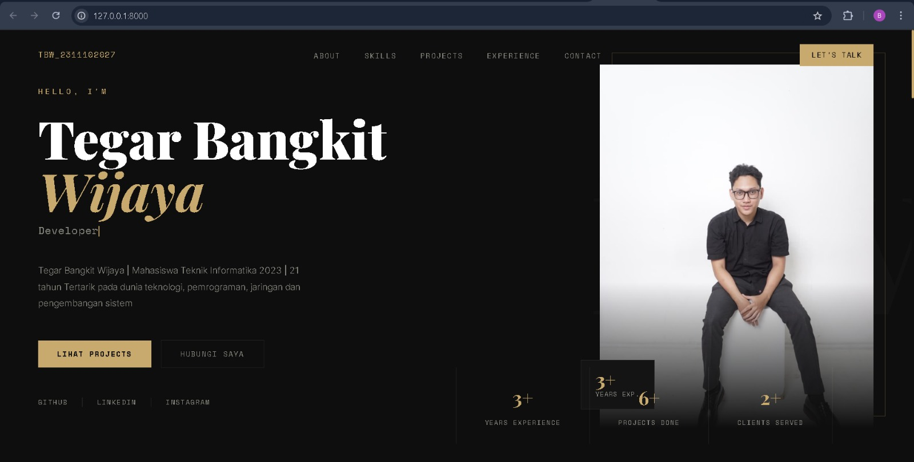
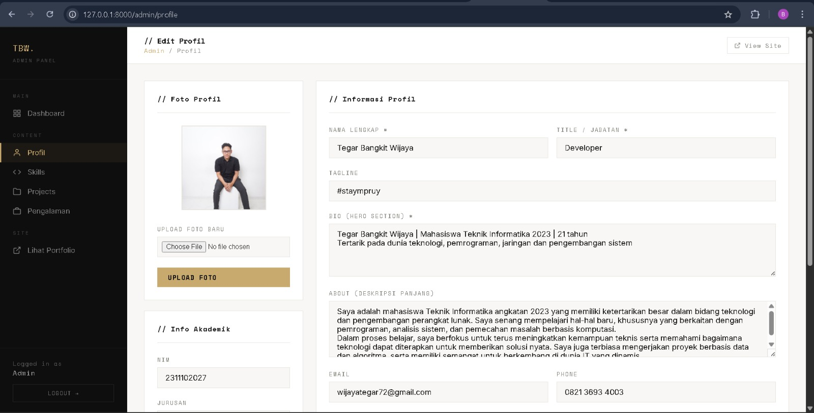
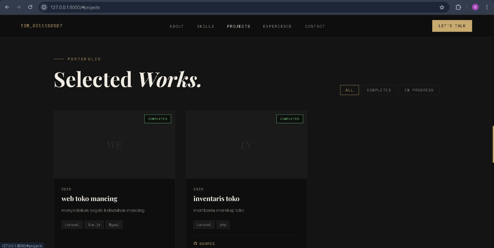
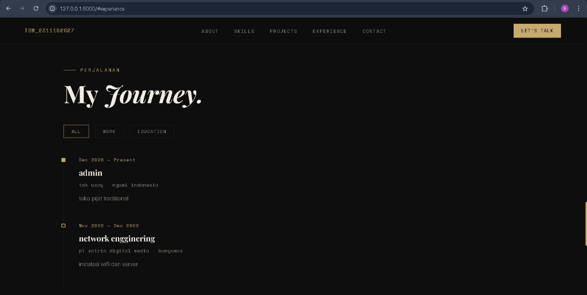
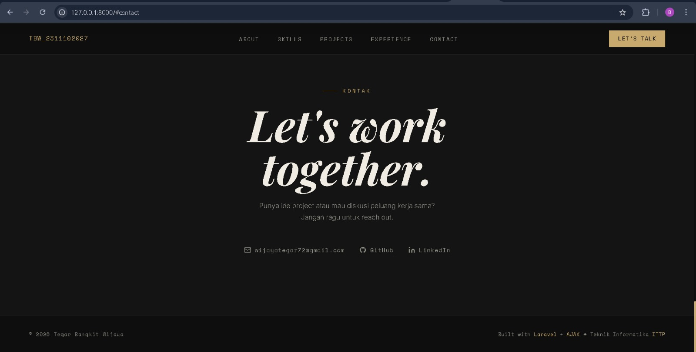
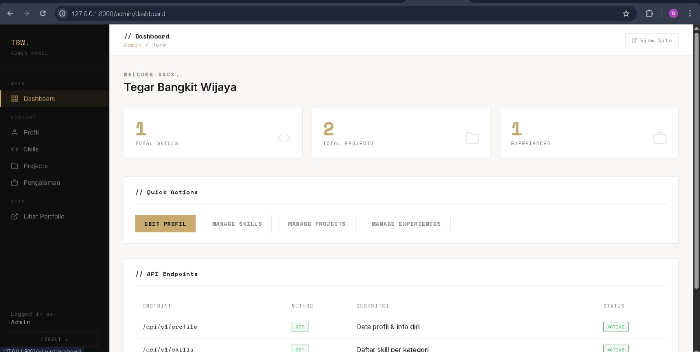
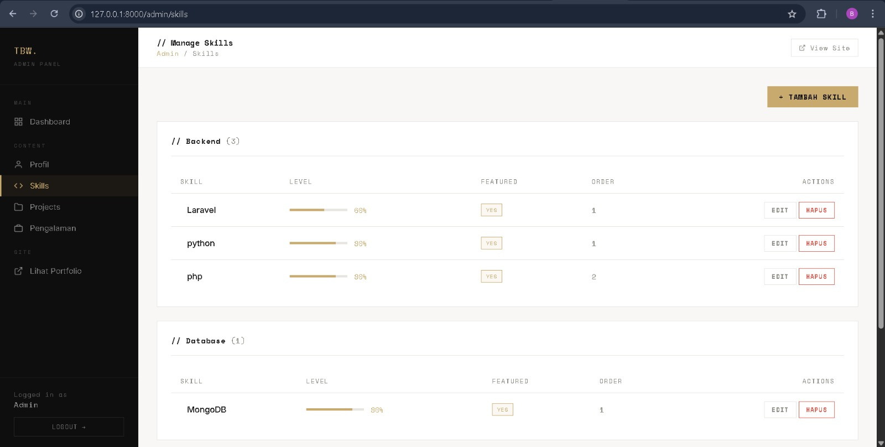
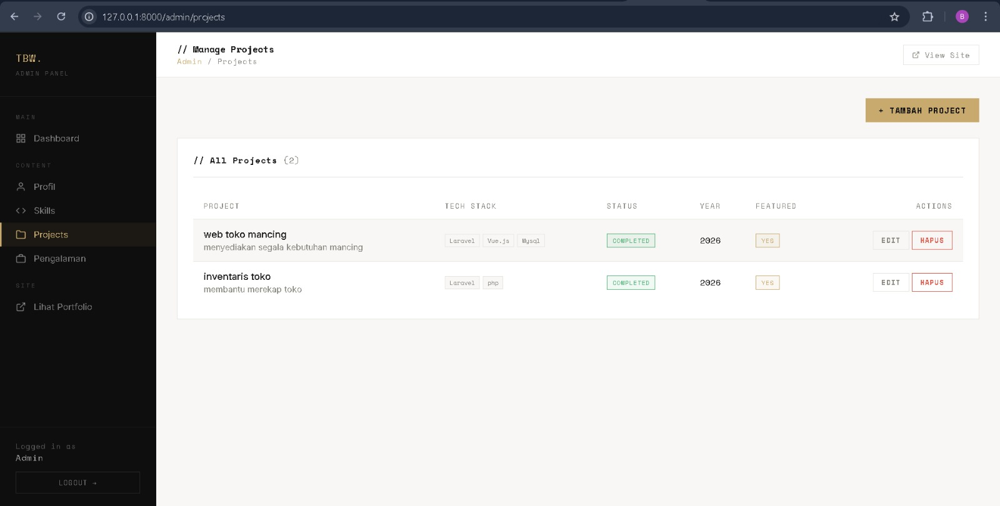
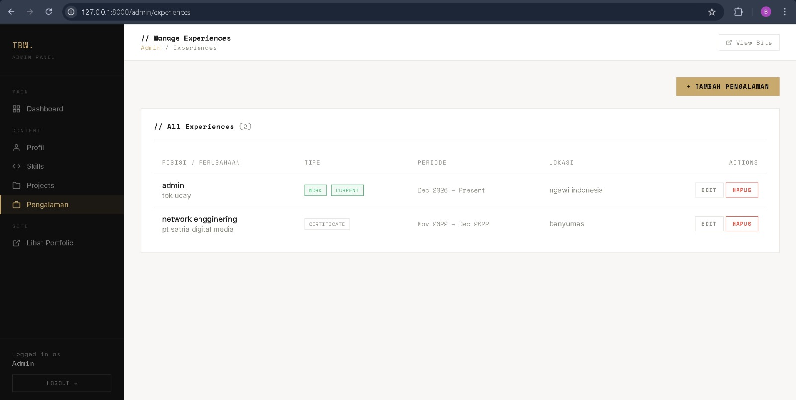

---

## 3. Penjelasan Fitur & Source Code

### 3.1 Migration — Struktur Tabel Utama

```php
Schema::create('profiles', function (Blueprint $table) {
    $table->id();
    $table->string('name');
    $table->string('nim')->nullable();
    $table->string('jurusan')->nullable();
    $table->string('title');
    $table->string('tagline')->nullable();
    $table->text('bio');
    $table->text('about')->nullable();
    $table->string('email')->nullable();
    $table->string('phone')->nullable();
    $table->string('location')->nullable();
    $table->string('github')->nullable();
    $table->string('linkedin')->nullable();
    $table->string('instagram')->nullable();
    $table->string('photo')->default('images/profile-default.png');
    $table->integer('years_experience')->default(0);
    $table->integer('projects_done')->default(0);
    $table->integer('clients')->default(0);
    $table->timestamps();
});

Schema::create('skills', function (Blueprint $table) {
    $table->id();
    $table->string('name');
    $table->string('category');
    $table->integer('level');
    $table->string('icon')->nullable();
    $table->string('color')->nullable();
    $table->integer('order')->default(0);
    $table->boolean('is_featured')->default(false);
    $table->timestamps();
});
```

### 3.2 Eloquent Model — Accessor & Scope

```php
// app/Models/Skill.php
public function scopeOrdered($query)
{
    return $query->orderBy('order')->orderBy('name');
}

public function scopeFeatured($query)
{
    return $query->where('is_featured', true);
}

// app/Models/Experience.php
public function getPeriodAttribute(): string
{
    $start = $this->start_date->format('M Y');
    $end   = $this->is_current
        ? 'Present'
        : ($this->end_date ? $this->end_date->format('M Y') : 'Present');
    return "$start – $end";
}
```

### 3.3 Seeder — Data Default Portofolio

```php
public function run(): void
{
    AdminUser::create([
        'name'     => 'Tegar Bangkit Wijaya',
        'email'    => 'admin@portfolio.com',
        'password' => Hash::make('admin123'),
    ]);

    Profile::create([
        'name'    => 'Tegar Bangkit Wijaya',
        'nim'     => '2311102027',
        'jurusan' => 'Teknik Informatika',
        'title'   => 'Full-Stack Developer',
    ]);

    foreach ($skills as $skill)        Skill::create($skill);
    foreach ($projects as $project)    Project::create($project);
    foreach ($experiences as $exp)     Experience::create($exp);
}
```

### 3.4 Routing — Web & API

```php
Route::get('/', [PortfolioController::class, 'index'])->name('portfolio');

Route::prefix('admin')->name('admin.')->group(function () {
    Route::get('/login',  [AuthController::class, 'showLogin'])->name('login')
         ->middleware('guest:admin');
    Route::post('/login', [AuthController::class, 'login'])->name('login.post');
    Route::post('/logout',[AuthController::class, 'logout'])->name('logout');

    Route::middleware('auth:admin')->group(function () {
        Route::get('/dashboard', [DashboardController::class, 'index'])->name('dashboard');
        Route::resource('skills',      SkillAdminController::class)->except(['show']);
        Route::resource('projects',    ProjectAdminController::class)->except(['show']);
        Route::resource('experiences', ExperienceAdminController::class)->except(['show']);
    });
});

Route::prefix('api/v1')->group(function () {
    Route::get('/profile',     [PortfolioApiController::class, 'profile']);
    Route::get('/skills',      [PortfolioApiController::class, 'skills']);
    Route::get('/projects',    [PortfolioApiController::class, 'projects']);
    Route::get('/experiences', [PortfolioApiController::class, 'experiences']);
});
```

### 3.5 REST API Controller — Response JSON

```php
public function skills(): JsonResponse
{
    $skills = Skill::ordered()->get()->groupBy('category');

    $formatted = [];
    foreach ($skills as $category => $items) {
        $formatted[] = [
            'category' => $category,
            'skills'   => $items->map(fn($s) => [
                'id'    => $s->id,
                'name'  => $s->name,
                'level' => $s->level,
                'icon'  => $s->icon,
                'color' => $s->color,
            ]),
        ];
    }

    return response()->json(['success' => true, 'data' => $formatted]);
}
```

### 3.6 Autentikasi Admin — Login & Guard

```php
public function login(Request $request)
{
    $credentials = $request->validate([
        'email'    => 'required|email',
        'password' => 'required|string',
    ]);

    if (Auth::guard('admin')->attempt($credentials, $request->boolean('remember'))) {
        $request->session()->regenerate();
        return redirect()->intended(route('admin.dashboard'));
    }

    return back()->withErrors(['email' => 'Email atau password salah.']);
}

public function logout(Request $request)
{
    Auth::guard('admin')->logout();
    $request->session()->invalidate();
    $request->session()->regenerateToken();
    return redirect()->route('admin.login');
}
```

### 3.7 AJAX — Fetch Data ke Landing Page

```javascript
const API_BASE = '/api/v1';

async function fetchProfile() {
    const res  = await fetch(`${API_BASE}/profile`);
    const json = await res.json();
    const p    = json.data;

    document.getElementById('hero-name').innerHTML         = p.name;
    document.getElementById('hero-title-text').textContent = p.title;
    document.getElementById('hero-bio').textContent        = p.bio;
    document.getElementById('hero-photo').src              = p.photo;
    document.getElementById('about-nim').textContent       = p.nim;
    document.getElementById('about-jurusan').textContent   = p.jurusan;
}

document.addEventListener('DOMContentLoaded', () => {
    fetchProfile();
    fetchSkills();
    fetchProjects();
    fetchExperiences();
});
```

### 3.8 CRUD Admin — AJAX tanpa Page Reload

```javascript
async function saveSkill() {
    const id   = document.getElementById('skill-id').value;
    const data = {
        name:     document.getElementById('skill-name').value,
        category: document.getElementById('skill-category').value,
        level:    document.getElementById('skill-level').value,
    };

    let res;
    if (id) {
        const body = new URLSearchParams({ ...data, _method: 'PUT' });
        res = await fetch(`/admin/skills/${id}`, {
            method: 'POST',
            headers: { 'X-CSRF-TOKEN': CSRF, 'Content-Type': 'application/x-www-form-urlencoded' },
            body,
        });
    } else {
        res = await fetch('/admin/skills', {
            method: 'POST',
            headers: { 'X-CSRF-TOKEN': CSRF, 'Content-Type': 'application/json' },
            body: JSON.stringify(data),
        });
    }

    const json = await res.json();
    if (json.success) {
        toast(json.message, 'success');
        closeModal('modal-skill');
        setTimeout(() => location.reload(), 800);
    }
}
```

---

## 4. Tampilan Aplikasi

### 4.1 Landing Page — Hero / Perkenalan
Halaman utama portofolio dimuat dengan animasi loader selama ±1.8 detik, kemudian seluruh konten di-inject ke DOM melalui AJAX fetch ke `/api/v1/profile`.



### 4.2 Landing Page — Informasi Profil (About)
About section menampilkan informasi diri lengkap (Nama, NIM, Jurusan, Lokasi, Email) yang diambil via AJAX dari `/api/v1/profile`.



### 4.3 Landing Page — Projects
Projects section menampilkan grid kartu project dengan filter status client-side. Data diambil dari `/api/v1/projects`.



### 4.4 Landing Page — Experiences
Timeline perjalanan kerja dan pendidikan dengan tab filter Work/Education. Data diambil dari `/api/v1/experiences`.



### 4.5 Landing Page — Contact
Link kontak dinamis yang diambil dari database via AJAX (email, GitHub, LinkedIn).



### 4.6 Admin Dashboard
Menampilkan 3 kartu statistik, quick action buttons, dan tabel status 4 endpoint API.



### 4.7 Admin — Manage Skills
CRUD skill dengan modal, range slider level, dan devicon icon. Semua operasi via AJAX.



### 4.8 Admin — Manage Projects
CRUD project dengan modal, upload thumbnail, dan preview gambar via AJAX.



### 4.9 Admin — Manage Experiences
CRUD pengalaman dengan modal, date picker, dan checkbox "Masih berlangsung" via AJAX.



---

## 5. Cara Menjalankan Aplikasi

```bash
git clone https://github.com/Aplikasi-Berbasis-Platform-S1IF-11-01/ujian-uts.git
cd ujian-uts/2311102027_Tegar-Bangkit-Wijaya

composer install

copy .env.example .env

php artisan key:generate

# Edit .env sesuaikan DB_DATABASE, DB_USERNAME, DB_PASSWORD

php artisan migrate:fresh --seed

php artisan storage:link

php artisan serve
```

| Field    | Value               |
|----------|---------------------|
| Email    | admin@portfolio.com |
| Password | admin123            |

---

## 6. Alur Kerja Aplikasi