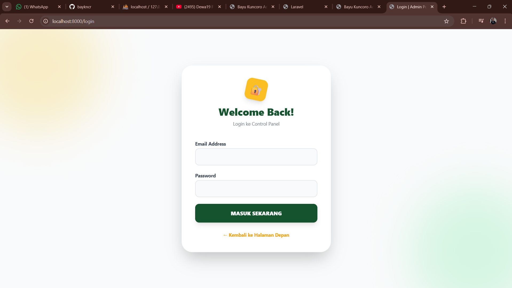
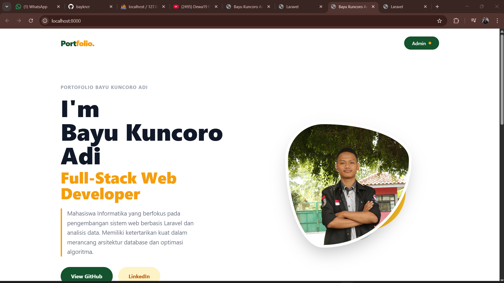
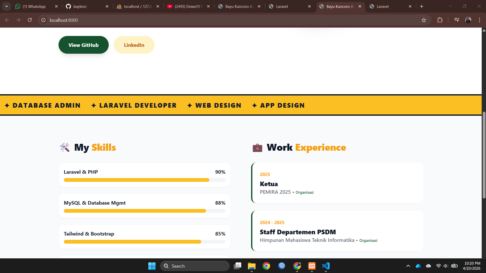
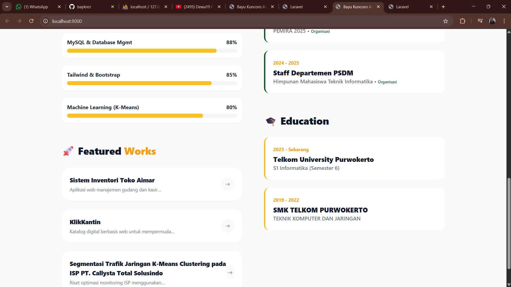
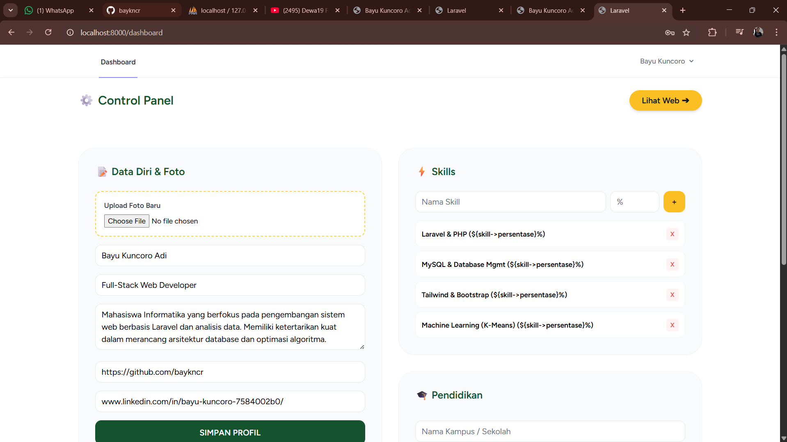
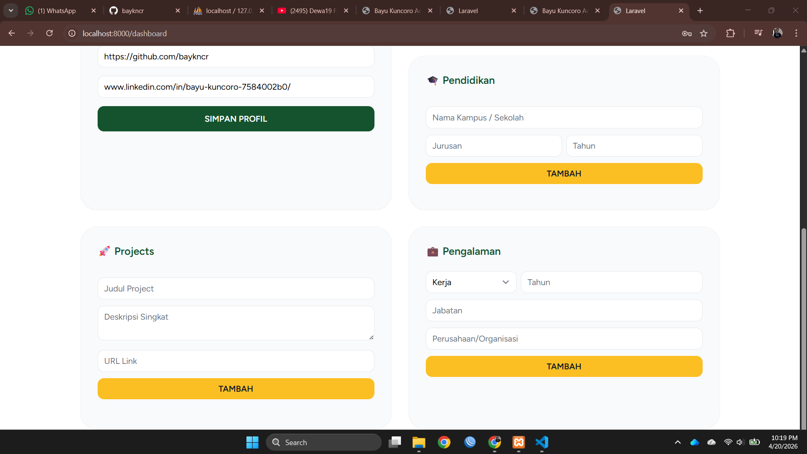

<div align="center">
  <br />
  <h1>LAPORAN PRAKTIKUM <br>APLIKASI BERBASIS PLATFORM</h1>
  <br />
  <h3> UTS <br> APLIKASI BERBASIS PLATFORM </h3>
  <br />
   
  <br />
  <br />
  <br />
  <h3>Disusun Oleh :</h3>
  <p>
    <strong>Bayu Kuncoro Adi</strong><br>
    <strong>2311102031</strong><br>
    <strong>S1 IF-11-01</strong>
  </p>
  <br />
  <h3>Dosen Pengampu :</h3>
  <p>
    <strong>Dimas Fanny Hebrasianto Permadi, S.ST., M.Kom</strong>
  </p>
  <br />
  <br />
    <h4>Asisten Praktikum :</h4>
    <strong> Apri Pandu Wicaksono </strong> <br>
    <strong>Rangga Pradarrell Fathi</strong>
  <br />
  <h3>LABORATORIUM HIGH PERFORMANCE
 <br>FAKULTAS INFORMATIKA <br>UNIVERSITAS TELKOM PURWOKERTO <br>2026</h3>
</div>

---

## Dasar Teori

### Pengertian Framework dan MVC

Framework merupakan kerangka kerja yang digunakan untuk mempermudah pengembangan aplikasi dengan menyediakan struktur dan aturan tertentu. Salah satu konsep yang umum digunakan adalah MVC (Model-View-Controller).

- Model: Mengelola data dan logika bisnis
- View: Menampilkan data ke pengguna
- Controller: Menghubungkan Model dan View

Konsep MVC membantu memisahkan logika aplikasi sehingga lebih terstruktur dan mudah dikembangkan.

---

### Pengenalan Laravel

Laravel merupakan framework PHP yang digunakan untuk membangun aplikasi web dengan sintaks yang sederhana, elegan, dan terstruktur.

Laravel menyediakan berbagai fitur seperti:
1. Routing
2. Middleware
3. ORM (Eloquent)
4. Template Engine (Blade)

Dengan Laravel, proses pengembangan menjadi lebih cepat dan efisien dibandingkan menggunakan PHP native.

---

### Cara Kerja Laravel

Laravel bekerja dengan konsep MVC dan memiliki beberapa komponen utama:

1. Routing
   Routing berfungsi untuk mengatur jalur URL menuju fungsi tertentu dalam aplikasi
   Contoh:
    ```php
    Route::get('/home', [HomeController::class, 'index']);
    ```
2. Controller
   Controller digunakan untuk mengatur logika aplikasi dan menghubungkan Model dengan View.
   Contoh:
    ```php
    public function index() {
    return view('home');
    }
    ```
2. Controller
   Controller digunakan untuk mengatur logika aplikasi dan menghubungkan Model dengan View.
   Contoh:
    ```php
    public function index() {
    return view('home');
    }
    ```
3. View
   View digunakan untuk menampilkan data ke pengguna, biasanya menggunakan Blade Template.
   Contoh:
    ```php
    <h1>Selamat Datang</h1>
    ```
4. CRUD dalam Laravel
   CRUD adalah operasi dasar dalam pengolahan data:
   - Create: Menambah data
   - Read: Menampilkan data
   - Update: Mengubah data
   - Delete: Menghapus data
   Laravel mempermudah CRUD dengan menggunakan:
   - Model (Eloquent ORM)
   - Controller
   - Migration
 
5. Model dalam Laravel
   Model digunakan untuk berinteraksi dengan database.
   Contoh:
    ```php
    class User extends Model {
    protected $table = 'users';
    }
    ```
    Model memungkinkan pengolahan data tanpa harus menulis query SQL secara manual.

6. Blade Templating
   Blade adalah template engine Laravel untuk membuat tampilan lebih dinamis.  
   Contoh:
    ```php
    @foreach($data as $item)
    <p>{{ $item->nama }}</p>
    @endforeach
    ```
7. Form Validation
   Laravel menyediakan fitur validasi untuk memastikan data input sesuai aturan.
   Contoh:
    ```php
    $request->validate([
    'nama' => 'required',
    'email' => 'required|email'
    ]);
    ```
8. Session dan Middleware
   - Session: Menyimpan data sementara (misalnya login user)
   - Middleware: Menyaring request sebelum masuk ke aplikasi
   Contoh:
    ```php
    Route::middleware(['auth'])->group(function () {
    Route::get('/dashboard', function () {
        return view('dashboard');
        });
        );
    ```
9. Relasi Model
   Laravel mendukung relasi antar tabel seperti:
   - One to One
   - One to Many
   - Many to Many
   Contoh:
    ```php
    public function posts() {
    return $this->hasMany(Post::class);
    }
    ```

10. CRUD dan Database pada Laravel
   CRUD (Create, Read, Update, Delete) merupakan operasi dasar dalam pengelolaan data pada aplikasi berbasis database.
   Dalam Laravel, implementasi CRUD dilakukan dengan beberapa komponen utama:
   - Model → representasi tabel database
   - Controller → logika pengolahan data
   - View → tampilan data ke user
   Laravel menggunakan Eloquent ORM sehingga pengembang tidak perlu menulis query SQL secara manual.

11. Konfigurasi dan Skema Database
   Sebelum menggunakan database, Laravel perlu dikonfigurasi pada file .env.
   Contoh:
    ```env
    DB_DATABASE=nama_database
    DB_USERNAME=root
    DB_PASSWORD=
    ```
    Selain itu, Laravel menyediakan fitur migration untuk membuat dan mengelola struktur tabel database secara terstruktur.

12. Model pada Laravel
   Model digunakan untuk berinteraksi dengan tabel database.
   Contoh:
    ```php
    class Produk extends Model {
    protected $table = 'produk';
    }
    ```
    Model memungkinkan proses seperti:
    - mengambil data
    - menyimpan data
    - menghapus data
    tanpa menggunakan query SQL secara langsung.

13. Controller dalam Pengolahan Data
   Controller berfungsi sebagai penghubung antara Model dan View dalam proses CRUD.
   Contoh:
    ```php
    public function index() {
    $data = Produk::all();
    return view('produk.index', compact('data'));
    }
    ```
    Controller akan:
    - mengambil data dari Model
    - mengirim ke View

14. View dan Tampilan Halaman
   View digunakan untuk menampilkan data ke pengguna.
   Biasanya menggunakan Blade Template:
    ```php
    @foreach($data as $item)
    <p>{{ $item->nama }}</p>
    @endforeach
    ```

15. Templating Halaman (Blade)
   Blade memungkinkan pembuatan layout yang reusable.
   Contoh:
    ```php
    @extends('layouts.app')

    @section('content')
        <h1>Halaman Produk</h1>
    @endsection
    ```

15. Form Validation
   Form validation digunakan untuk memastikan input dari user sesuai dengan aturan.
   Contoh:
    ```php
    $request->validate([
    'nama' => 'required',
    'harga' => 'required|numeric'
    ]);
    ```
    Jika data tidak valid, Laravel otomatis mengembalikan error ke user.

17. Session
   Session digunakan untuk menyimpan data sementara di sisi server.
   Contoh:
    ```php
    session(['nama' => 'Bayu']);
    ```
    Fungsi session:
    - menyimpan data login
    - menyimpan notifikasi
    - menyimpan state aplikasi

18. Middleware
   Middleware berfungsi sebagai penyaring request sebelum masuk ke aplikasi.
   Contoh:
    ```php
    Route::middleware(['auth'])->group(function () {
        Route::get('/dashboard', function () {
            return view('dashboard');
        });
    });
    ```
    Middleware sering digunakan untuk:
    - autentikasi (login)
    - otorisasi akses halaman

15. Relasi Model (Eloquent Relationship)
   Laravel mendukung relasi antar tabel database.
   Jenis relasi:
    - One to One
    - One to Many
    - Many to Many
   Contoh relasi One to Many:
    ```php
    public function produk() {
    return $this->hasMany(Produk::class);
    }
    ```
    Relasi ini memudahkan pengambilan data yang saling berhubungan tanpa query kompleks.


## Sourcecode 

### Salah satu Sourcecode yaitu DatabaseSeeder.php
``` PHP
<?php
namespace Database\Seeders;

use Illuminate\Database\Seeder;
use Illuminate\Support\Facades\Hash;
use App\Models\{User, Profile, Skill, Experience, Education, Project};

class DatabaseSeeder extends Seeder
{
    public function run(): void
    {
        User::create(['name' => 'Bayu Kuncoro', 'email' => 'bayukuncoroadi542@gmail.com', 'password' => Hash::make('password123')]);

        Profile::create([
            'nama' => 'Bayu Kuncoro Adi',
            'profesi' => 'Full-Stack Web Developer',
            'deskripsi' => 'Mahasiswa Informatika yang berfokus pada pengembangan sistem web berbasis Laravel dan analisis data. Memiliki ketertarikan kuat dalam merancang arsitektur database dan optimasi algoritma.',
            'github_link' => 'https://github.com/baykncr',
            'linkedin_link' => 'www.linkedin.com/in/bayu-kuncoro-7584002b0/'
        ]);

        Skill::create(['nama_skill' => 'Laravel & PHP', 'persentase' => 90]);
        Skill::create(['nama_skill' => 'MySQL & Database Mgmt', 'persentase' => 88]);
        Skill::create(['nama_skill' => 'Tailwind & Bootstrap', 'persentase' => 85]);
        Skill::create(['nama_skill' => 'Machine Learning (K-Means)', 'persentase' => 80]);

        Experience::create(['kategori' => 'Organisasi', 'posisi' => 'Staff Departemen PSDM', 'instansi' => 'Himpunan Mahasiswa Teknik Informatika', 'tahun' => '2024 - 2025']);
        Experience::create(['kategori' => 'Kerja', 'posisi' => 'Network Engineer', 'instansi' => 'PT. CALL=YSTA TOTAL SOLUSINDO', 'tahun' => '2023 - Sekarang']);

        Education::create(['institusi' => 'Telkom University Purwokerto', 'jurusan' => 'S1 Informatika (Semester 6)', 'tahun' => '2023 - Sekarang']);

        Project::create(['judul' => 'Sistem Inventori Toko Aimar', 'deskripsi' => 'Aplikasi web manajemen gudang dan kasir menggunakan Laravel 13 dengan fitur CRUD, AJAX, dan autentikasi.', 'link_project' => '#']);
        Project::create(['judul' => 'KlikKantin', 'deskripsi' => 'Katalog digital berbasis web untuk mempermudah pemesanan menu kantin kampus yang terintegrasi dengan WhatsApp.', 'link_project' => '#']);
        Project::create(['judul' => 'Segmentasi Trafik Jaringan K-Means Clustering pada ISP PT. Callysta Total Solusindo', 'deskripsi' => 'Riset optimasi monitoring ISP menggunakan algoritma K-Means Clustering berbasis Machine Learning.', 'link_project' => '#']);
    }
}
```

### Salah satu Sourcecode yaitu AdminController.php
``` PHP
<?php

namespace App\Http\Controllers;

use Illuminate\Http\Request;
use App\Models\{Profile, Skill, Experience, Education, Project};

class AdminController extends Controller
{
    // Tampilkan semua data di Dashboard Admin
    public function index() {
        $profile = Profile::first();
        $skills = Skill::all();
        $experiences = Experience::orderBy('tahun', 'desc')->get();
        $educations = Education::orderBy('tahun', 'desc')->get();
        $projects = Project::latest()->get();
        
        return view('admin.dashboard', compact('profile', 'skills', 'experiences', 'educations', 'projects'));
    }

    // --- UPDATE PROFIL & FOTO ---
    public function updateProfile(Request $request) {
        $profile = Profile::first();
        $data = $request->all();
        
        if ($request->hasFile('foto')) {
            $path = $request->file('foto')->store('photos', 'public');
            $data['foto'] = $path;
        }
        $profile->update($data);
        return back()->with('success', 'Data Profil & Foto berhasil diperbarui!');
    }

    // --- CRUD SKILL ---
    public function storeSkill(Request $request) { Skill::create($request->all()); return back()->with('success', 'Skill ditambah!'); }
    public function destroySkill($id) { Skill::destroy($id); return back()->with('success', 'Skill dihapus!'); }

    // --- CRUD PENGALAMAN ---
    public function storeExperience(Request $request) { Experience::create($request->all()); return back()->with('success', 'Pengalaman ditambah!'); }
    public function destroyExperience($id) { Experience::destroy($id); return back()->with('success', 'Pengalaman dihapus!'); }

    // --- CRUD PENDIDIKAN ---
    public function storeEducation(Request $request) { Education::create($request->all()); return back()->with('success', 'Pendidikan ditambah!'); }
    public function destroyEducation($id) { Education::destroy($id); return back()->with('success', 'Pendidikan dihapus!'); }

    // --- CRUD PROJECT ---
    public function storeProject(Request $request) { Project::create($request->all()); return back()->with('success', 'Project ditambah!'); }
    public function destroyProject($id) { Project::destroy($id); return back()->with('success', 'Project dihapus!'); }
}
```

### Salah satu Sourcecode yaitu landing.blade.php
``` PHP
<!DOCTYPE html>
<html lang="id" class="scroll-smooth">
<head>
    <meta charset="UTF-8">
    <meta name="viewport" content="width=device-width, initial-scale=1.0">
    <title>Portfolio | Bayu Kuncoro Adi</title>
    @vite(['resources/css/app.css', 'resources/js/app.js'])
</head>
<body class="bg-white text-gray-800 font-sans antialiased min-h-screen overflow-x-hidden selection:bg-amber-300">

    <div id="loading-screen" class="fixed inset-0 z-50 bg-white flex flex-col items-center justify-center transition-opacity duration-500">
        <div class="w-16 h-16 border-4 border-amber-200 border-t-amber-500 rounded-full animate-spin"></div>
        <p class="mt-4 text-green-900 font-bold tracking-widest text-sm animate-pulse">MEMUAT DATA...</p>
    </div>

    <div id="portfolio-content" class="hidden opacity-0 transition-opacity duration-1000">
        
        <header class="py-6 px-8 md:px-16 flex justify-between items-center max-w-7xl mx-auto">
            <div class="font-black text-2xl text-green-900 tracking-tighter">
                Port<span class="text-amber-500">folio.</span>
            </div>
            <a href="{{ route('login') }}" class="bg-green-900 hover:bg-green-800 text-white px-6 py-2.5 rounded-full font-semibold text-sm transition-all flex items-center gap-2">
                Admin <span class="bg-amber-500 w-2 h-2 rounded-full"></span>
            </a>
        </header>

        <section class="max-w-7xl mx-auto px-8 md:px-16 py-12 md:py-20 flex flex-col md:flex-row items-center gap-12">
            <div class="md:w-1/2 relative z-10">
                <p class="text-sm font-bold text-gray-400 tracking-widest uppercase mb-4">Portofolio Bayu Kuncoro Adi</p>
                <h1 class="text-5xl md:text-7xl font-black text-gray-900 leading-[1.1] mb-2">
                    I'm <span id="el-nama" class="relative inline-block"></span>
                </h1>
                <h2 id="el-profesi" class="text-3xl md:text-5xl font-black text-amber-500 mb-6 drop-shadow-sm"></h2>
                <p id="el-deskripsi" class="text-gray-500 text-lg leading-relaxed mb-8 max-w-md border-l-4 border-amber-500 pl-4"></p>
                
                <div class="flex gap-4">
                    <a id="el-github" href="#" target="_blank" class="bg-green-900 hover:bg-green-800 text-white px-8 py-4 rounded-full font-bold shadow-lg transition-transform hover:-translate-y-1">View GitHub</a>
                    <a id="el-linkedin" href="#" target="_blank" class="bg-amber-100 hover:bg-amber-200 text-amber-700 px-8 py-4 rounded-full font-bold transition-transform hover:-translate-y-1">LinkedIn</a>
                </div>
            </div>

            <div class="md:w-1/2 relative flex justify-center items-center">
                <div class="absolute w-80 h-80 bg-amber-400 rounded-[40%_60%_70%_30%/40%_50%_60%_50%] z-0 animate-[spin_10s_linear_infinite]"></div>
                <div class="absolute w-72 h-72 bg-green-900 rounded-[60%_40%_30%_70%/60%_30%_70%_40%] z-0 -translate-x-10 translate-y-10 animate-[spin_15s_linear_infinite_reverse] opacity-20"></div>
                
                
            </div>
        </section>

        <div class="bg-amber-400 py-4 flex overflow-hidden whitespace-nowrap mt-12 border-y-4 border-gray-900">
            <div class="animate-[marquee_20s_linear_infinite] flex gap-8 items-center font-black text-gray-900 text-xl uppercase tracking-widest">
                <span>✦ Laravel Developer</span><span>✦ Web Design</span><span>✦ App Design</span><span>✦ Database Admin</span><span>✦ Laravel Developer</span><span>✦ Web Design</span><span>✦ App Design</span>
            </div>
        </div>

        <style>
            @keyframes marquee { 0% { transform: translateX(0); } 100% { transform: translateX(-50%); } }
        </style>

        <section class="bg-gray-50 py-20">
            <div class="max-w-7xl mx-auto px-8 md:px-16 grid grid-cols-1 lg:grid-cols-2 gap-16">
                
                <div class="space-y-16">
                    <div>
                        <h3 class="text-3xl font-black text-gray-900 mb-8">🛠️ My <span class="text-amber-500">Skills</span></h3>
                        <div id="skills-container" class="space-y-5"></div>
                    </div>
                    <div>
                        <h3 class="text-3xl font-black text-gray-900 mb-8">🚀 Featured <span class="text-amber-500">Works</span></h3>
                        <div id="projects-container" class="space-y-6"></div>
                    </div>
                </div>

                <div class="space-y-16">
                    <div>
                        <h3 class="text-3xl font-black text-gray-900 mb-8">💼 Work <span class="text-amber-500">Experience</span></h3>
                        <div id="experience-container" class="space-y-6"></div>
                    </div>
                    <div>
                        <h3 class="text-3xl font-black text-gray-900 mb-8">🎓 Education</h3>
                        <div id="education-container" class="space-y-6"></div>
                    </div>
                </div>

            </div>
        </section>
    </div>

    <script>
        document.addEventListener('DOMContentLoaded', function() {
            setTimeout(() => {
                fetch('/api/portfolio-data')
                    .then(res => res.json())
                    .then(data => {
                        document.getElementById('loading-screen').style.display = 'none';
                        const content = document.getElementById('portfolio-content');
                        content.classList.remove('hidden');
                        setTimeout(() => content.classList.remove('opacity-0'), 50);

                        document.title = data.profile.nama + " | Portfolio";
                        document.getElementById('el-nama').innerText = data.profile.nama;
                        document.getElementById('el-profesi').innerText = data.profile.profesi;
                        document.getElementById('el-deskripsi').innerText = data.profile.deskripsi;
                        document.getElementById('el-github').href = data.profile.github_link;
                        document.getElementById('el-linkedin').href = data.profile.linkedin_link;
                        
                        if(data.profile.foto) {
                            document.getElementById('el-foto').src = '/storage/' + data.profile.foto;
                        } else {
                            document.getElementById('el-foto').src = 'https://ui-avatars.com/api/?name=Bayu+Kuncoro&background=ffb703&color=fff&size=500';
                        }

                        // Skills
                        let htmlSkills = '';
                        data.skills.forEach(skill => {
                            htmlSkills += `
                                <div class="bg-white p-4 rounded-2xl shadow-sm border border-gray-100">
                                    <div class="flex justify-between font-bold text-gray-800 mb-2"><span>${skill.nama_skill}</span><span>${skill.persentase}%</span></div>
                                    <div class="w-full bg-gray-100 rounded-full h-3"><div class="bg-amber-400 h-3 rounded-full" style="width: ${skill.persentase}%"></div></div>
                                </div>`;
                        });
                        document.getElementById('skills-container').innerHTML = htmlSkills;

                        // Experience
                        let htmlExp = '';
                        data.experiences.forEach(exp => {
                            htmlExp += `
                                <div class="bg-white p-6 rounded-2xl shadow-sm border-l-4 border-green-900 hover:shadow-md transition">
                                    <span class="text-sm font-bold text-amber-500">${exp.tahun}</span>
                                    <h4 class="font-black text-xl text-gray-900 mt-1">${exp.posisi}</h4>
                                    <p class="text-gray-500 font-medium">${exp.instansi} • <span class="text-green-800 text-xs">${exp.kategori}</span></p>
                                </div>`;
                        });
                        document.getElementById('experience-container').innerHTML = htmlExp;

                        // Education
                        let htmlEdu = '';
                        data.educations.forEach(edu => {
                            htmlEdu += `
                                <div class="bg-white p-6 rounded-2xl shadow-sm border-l-4 border-amber-400 hover:shadow-md transition">
                                    <span class="text-sm font-bold text-amber-500">${edu.tahun}</span>
                                    <h4 class="font-black text-xl text-gray-900 mt-1">${edu.institusi}</h4>
                                    <p class="text-gray-500 font-medium">${edu.jurusan}</p>
                                </div>`;
                        });
                        document.getElementById('education-container').innerHTML = htmlEdu;

                        // Projects
                        let htmlProj = '';
                        data.projects.forEach(proj => {
                            htmlProj += `
                                <div class="bg-white p-6 rounded-3xl shadow-sm border border-gray-100 flex items-center justify-between group hover:border-amber-400 transition cursor-pointer">
                                    <div>
                                        <h4 class="font-black text-lg text-gray-900 group-hover:text-green-900 transition">${proj.judul}</h4>
                                        <p class="text-sm text-gray-500 line-clamp-1 max-w-xs mt-1">${proj.deskripsi}</p>
                                    </div>
                                    <a href="${proj.link_project}" target="_blank" class="w-10 h-10 bg-gray-50 rounded-full flex items-center justify-center text-gray-400 group-hover:bg-amber-400 group-hover:text-white transition">
                                        ➔
                                    </a>
                                </div>`;
                        });
                        document.getElementById('projects-container').innerHTML = htmlProj;
                    });
            }, 500);
        });
    </script>
</body>
</html>
```

### Salah satu Sourcecode yaitu app.blade.php
``` PHP
<!DOCTYPE html>
<html lang="{{ str_replace('_', '-', app()->getLocale()) }}">
    <head>
        <meta charset="utf-8">
        <meta name="viewport" content="width=device-width, initial-scale=1">
        <meta name="csrf-token" content="{{ csrf_token() }}">

        <title>{{ config('app.name', 'Laravel') }}</title>

        <!-- Fonts -->
        <link rel="preconnect" href="https://fonts.bunny.net">
        <link href="https://fonts.bunny.net/css?family=figtree:400,500,600&display=swap" rel="stylesheet" />

        <!-- Scripts -->
        @vite(['resources/css/app.css', 'resources/js/app.js'])
    </head>
    <body class="font-sans antialiased">
        <div class="min-h-screen bg-gray-100">
            @include('layouts.navigation')

            <!-- Page Heading -->
            @isset($header)
                <header class="bg-white shadow">
                    <div class="max-w-7xl mx-auto py-6 px-4 sm:px-6 lg:px-8">
                        {{ $header }}
                    </div>
                </header>
            @endisset

            <!-- Page Content -->
            <main>
                {{ $slot }}
            </main>
        </div>
    </body>
</html>

```


## Tampilan Output

1. Login Dashboard


2. Tampilan Portofolio




3. Dashboard Edit Portofolio




## Kesimpulan

Pengembangan aplikasi web portofolio ini memanfaatkan framework Laravel untuk menciptakan sistem manajemen konten (CMS) personal yang interaktif, dinamis, dan terstruktur. Berpegang pada arsitektur MVC, aplikasi ini secara tegas memisahkan logika pemrosesan data di backend dengan presentasi antarmuka di frontend. Nilai tambah utama dari proyek ini adalah implementasi AJAX (Asynchronous JavaScript and XML) melalui Fetch API yang mengambil data secara asinkron dari endpoint RESTful API bawaan Laravel, sehingga halaman utama dapat merender informasi profil, keahlian, riwayat, dan proyek secara instan tanpa memerlukan page reload. Pada sisi manajemen data, aplikasi ini dilengkapi dengan kontrol panel Admin yang memfasilitasi operasi CRUD terintegrasi Eloquent ORM, memungkinkan pembaruan konten portofolio secara real-time dan efisien. Keamanan sistem dikelola dengan ketat melalui autentikasi berbasis session dan pelindungan middleware yang memastikan hanya pengguna sah yang dapat mengakses dashboard. Perpaduan struktur database yang dikelola melalui migration dan seeder, serta balutan antarmuka modern menggunakan Tailwind CSS, menjadikan proyek ini sebagai portofolio digital yang tidak hanya mutakhir secara teknologi, tetapi juga memberikan pengalaman pengguna yang optimal dan profesional.


---

##  Referensi

[1] Modul 11, 12, 13 Praktikum ABP PDF
   https://drive.google.com/drive/folders/1ZdFmzgClXlRth7sXkQxOFqbW-itYm-Ju?usp=sharing

[2] Laravel Eloquent ORM Documentation
   https://laravel.com/docs/5.0/eloquent?c=atila&utm

[3] Laravel Eloquent CRUD Example
   https://www.slingacademy.com/article/laravel-eloquent-crud-example/?utm

[4] Laravel Eloquent Model Basics (GeeksforGeeks)
   geeksforgeeks.org/php/laravel-eloquent-model-basics/?utm

[5] Eloquent ORM (Nevaweb)
   https://nevaweb.id/blog/apa-itu-eloquent-orm/?utm


