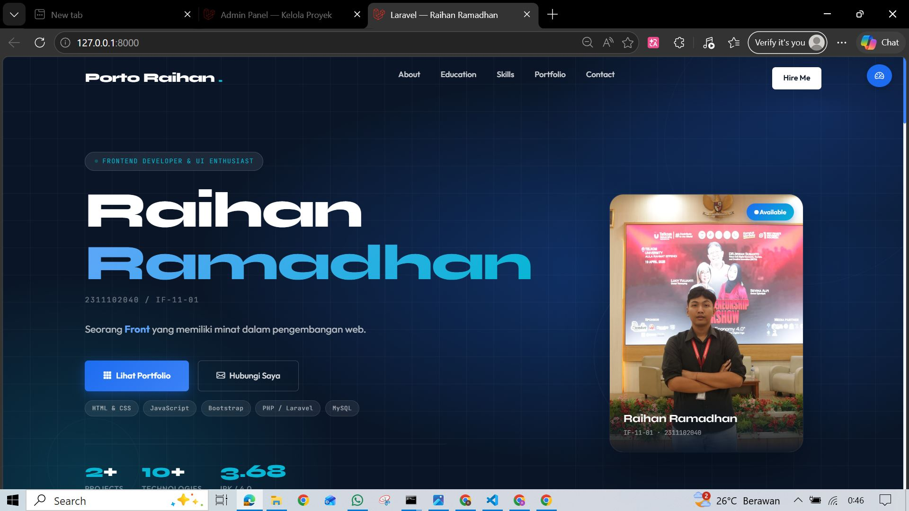
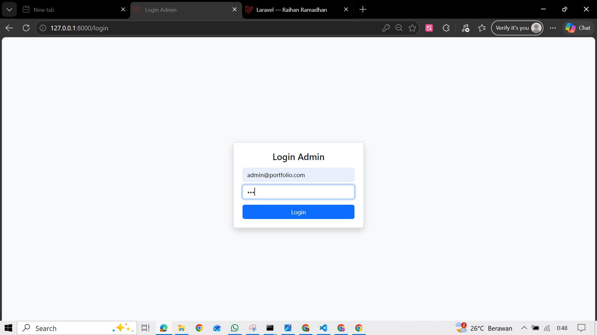
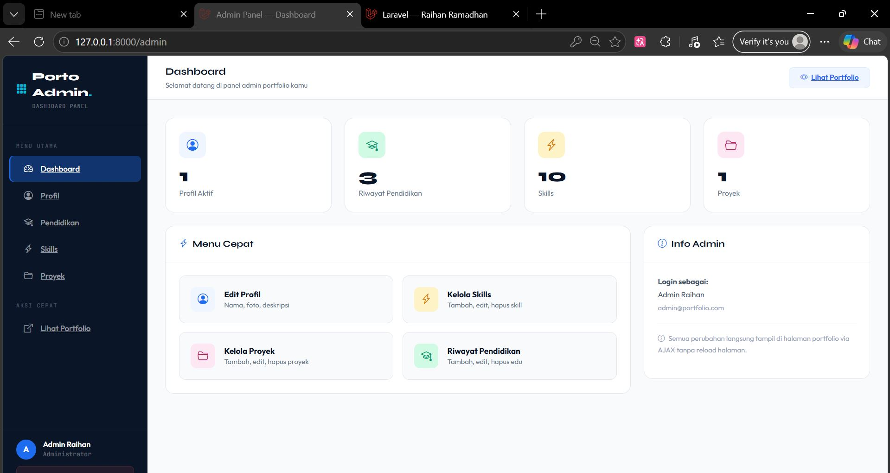
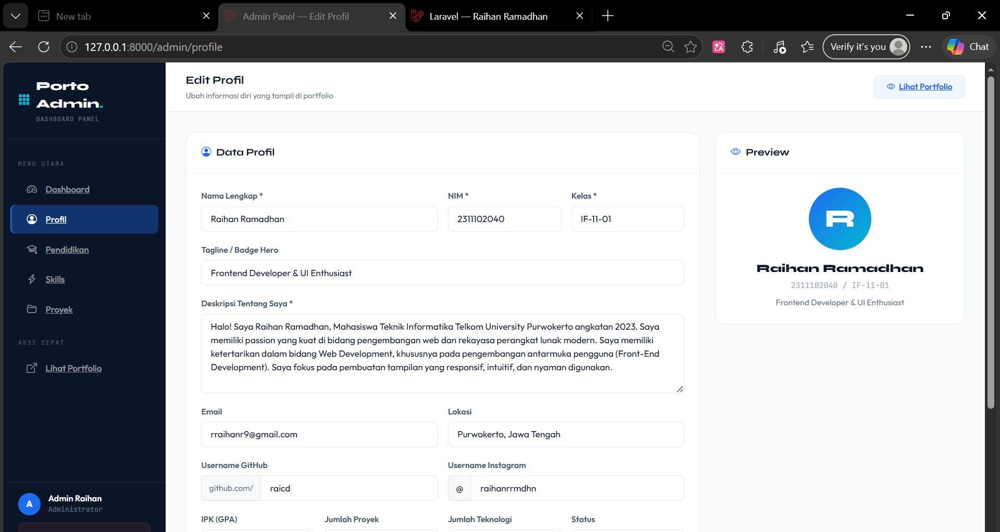
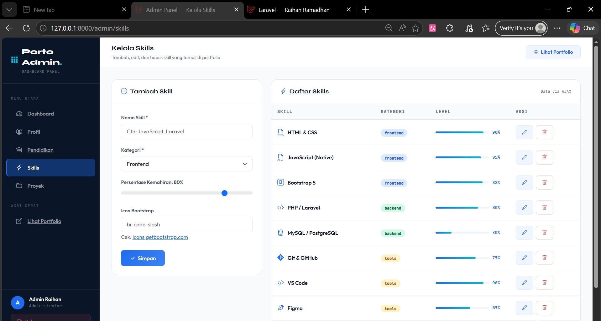
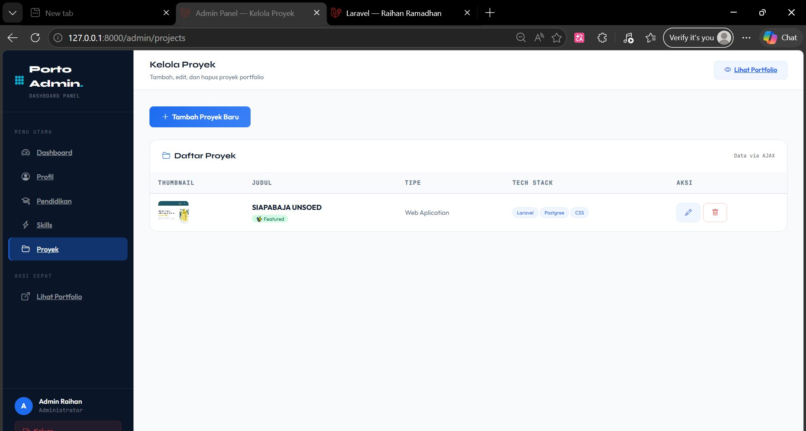
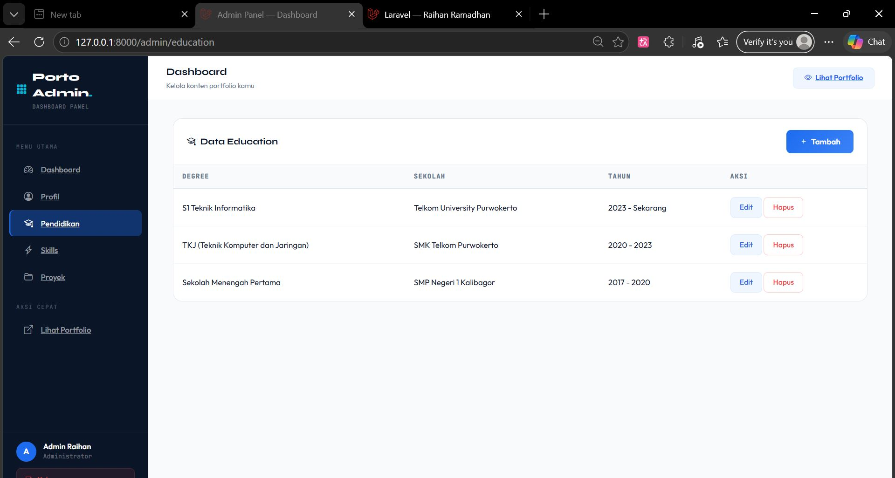

<div align="center">
  <br />
  <h1>LAPORAN PROYEK UTS <br>APLIKASI BERBASIS PLATFORM</h1>
  <br />
  <h3>UTS PORTOFOLIO LANDING PAGE & CRUDE </h3>
  <br />
  <br />
  
  <br />
  <br />
  <br />
  <h3>Disusun Oleh :</h3>
  <p>
    <strong>RAIHAN RAMADHAN</strong><br>
    <strong>2311102040</strong><br>
    <strong>S1 IF-11-REG01</strong>
  </p>
  <br />
  <h3>Dosen Pengampu :</h3>
  <p>
    <strong>Dimas Fanny Hebrasianto Permadi, S.ST., M.Kom</strong>
  </p>
  <br />
  <h4>Asisten Praktikum :</h4>
  <strong>Apri Pandu Wicaksono</strong> <br>
  <strong>Rangga Pradarrell Fathi</strong>
  <br />
  <h3>LABORATORIUM HIGH PERFORMANCE
 <br>FAKULTAS INFORMATIKA <br>UNIVERSITAS TELKOM PURWOKERTO <br>2026</h3>
</div>

---

# 📌 UTS — Website Portfolio Berbasis Laravel

## 1. Spesifikasi dan Implementasi Sistem

Pada Ujian Tengah Semester (UTS) ini, sistem yang dikembangkan adalah **Website Portfolio Personal** berbasis Laravel yang bertujuan untuk menampilkan profil, skill, dan proyek secara dinamis sebagai media personal branding.

### Fitur Utama Sistem:

1. **Framework Backend**
```bash
   - Menggunakan **Laravel 12** sebagai backend utama.
```
2. **Tampilan Frontend (Portfolio)**
```bash
   - Dibangun dengan HTML, CSS, dan Bootstrap.
   - Data tidak ditampilkan langsung dari Blade, melainkan melalui AJAX.
```
3. **Admin Dashboard**
```bash
   - Digunakan untuk mengelola:
     - Profil
     - Skills
     - Projects
     - Education
   - Mendukung operasi CRUD (Create, Read, Update, Delete)
```
4. **AJAX (WAJIB)**
```bash
   - Semua data portfolio diambil melalui endpoint API:
     - `/api/profile`
     - `/api/skills`
     - `/api/projects`
     - `/api/education`
```
5. **Autentikasi Login**
```bash
   - Login hanya untuk admin
   - Portfolio bisa diakses tanpa login
```
6. **Upload Gambar**
```bash
   - Gambar project disimpan di `storage/app/public`
   - Ditampilkan melalui `storage:link`
```

## 2. Penjelasan Kode Sumber

### 2.1 Routing API (Backend Laravel)
```bash
File: `routes/web.php`

```php
Route::prefix('api')->name('api.')->group(function () {
    Route::get('/profile',   [PortfolioController::class, 'apiProfile']);
    Route::get('/skills',    [PortfolioController::class, 'apiSkills']);
    Route::get('/projects',  [PortfolioController::class, 'apiProjects']);
    Route::get('/education', [PortfolioController::class, 'apiEducation']);
});
```
### 2.2 Controller Portfolio (API Response)
```bash
 File: app/Http/Controllers/PortfolioController.php

public function apiProjects(): JsonResponse
{
    $projects = Project::orderBy('sort_order')->get()->map(function ($p) {
        $p->image_url = $p->image
            ? asset('storage/' . $p->image)
            : asset('images/placeholder.jpg');
        return $p;
    });

    return response()->json([
        'success' => true,
        'data' => $projects
    ]);
}
Data dikirim dalam bentuk JSON untuk digunakan oleh AJAX.
```
### 2.3 AJAX Fetch Data (Frontend)
```bash
File: resources/views/portofolio/index.blade.php
fetch('/api/projects')  .then(res => res.json())  .then(res => {    res.data.forEach(p => {      document.getElementById('projects').innerHTML += `        <div class="project-card">                    <h3>${p.title}</h3>        </div>      `;    });  });
Semua data diambil secara asynchronous (AJAX).
```
### 2.4 Migration Database
```bash
File: database/migrations/create_projects_table.php
Schema::create('projects', function (Blueprint $table) {    $table->id();    $table->string('title');    $table->text('description');    $table->string('image')->nullable();    $table->string('tech_stack');    $table->timestamps();});
```
### 2.5 Admin Dashboard (CRUD)
```bash
File: routes/web.php
Route::prefix('admin')->middleware('auth')->group(function () {    Route::get('/projects', [AdminController::class, 'projectsPage']);    Route::post('/api/projects', [AdminController::class, 'projectStore']);    Route::delete('/api/projects/{project}', [AdminController::class, 'projectDestroy']);});
Semua fitur CRUD dilakukan melalui AJAX.
```
### 2.6 Upload Gambar
```bash
File: AdminController.php
if ($request->hasFile('image')) {    $data['image'] = $request->file('image')->store('projects', 'public');}
Gambar disimpan di:
storage/app/public/projects
```
### 2.7 Autentikasi Login
```bash
Route::post('/login', function (Request $r) {    if (Auth::attempt($r->only('email', 'password'))) {        return redirect('/admin');    }});
Login hanya untuk admin.
```
### 3. Kesimpulan
```bash
Sistem yang dikembangkan telah memenuhi seluruh kebutuhan UTS, yaitu:
✅ Menggunakan Laravel
✅ Menggunakan AJAX untuk semua data
✅ Memiliki Admin Dashboard CRUD
✅ Menggunakan API endpoint
✅ Mendukung upload gambar
✅ Memiliki sistem login
```
### 4. Hasil Output
### 4.1 Halaman utama portofolio 

### 4.2 Login

### 4.3 Halaman Dashboard Admin

### 3.4 Halaman Profil

### 3.5 Halaman Skill

### 3.6 Halaman Project

### 3.7 Pendidikan


## 4. Kesimpulan
```bash
Berdasarkan hasil pengembangan yang telah dilakukan, sistem Website Portfolio berbasis Laravel ini berhasil memenuhi seluruh kebutuhan yang ditentukan pada tugas Ujian Tengah Semester. Aplikasi ini mampu menampilkan data profil, keterampilan, proyek, dan pendidikan secara dinamis melalui implementasi AJAX tanpa menggunakan rendering langsung dari Blade. Selain itu, sistem juga dilengkapi dengan dashboard admin yang memungkinkan pengelolaan data secara lengkap melalui fitur CRUD, serta didukung oleh sistem autentikasi untuk menjaga keamanan akses. Fitur upload gambar pada proyek juga telah berjalan dengan baik menggunakan mekanisme penyimpanan Laravel. Dengan demikian, website ini tidak hanya memenuhi aspek teknis yang diminta, tetapi juga layak digunakan sebagai media personal branding yang interaktif dan profesional.
```

## 5. Referensi

- **Laravel Documentation**: https://laravel.com/docs  
- **Laravel File Storage (Upload Gambar)**: https://laravel.com/docs/filesystem  
- **Bootstrap 5 Documentation**: https://getbootstrap.com/docs/5.3/  
- **Fetch API (AJAX)**: https://developer.mozilla.org/en-US/docs/Web/API/Fetch_API  
- **JavaScript XMLHttpRequest**: https://developer.mozilla.org/en-US/docs/Web/API/XMLHttpRequest  
- **PHP Official Documentation**: https://www.php.net/docs.php  
- **MySQL Documentation**: https://dev.mysql.com/doc/  
