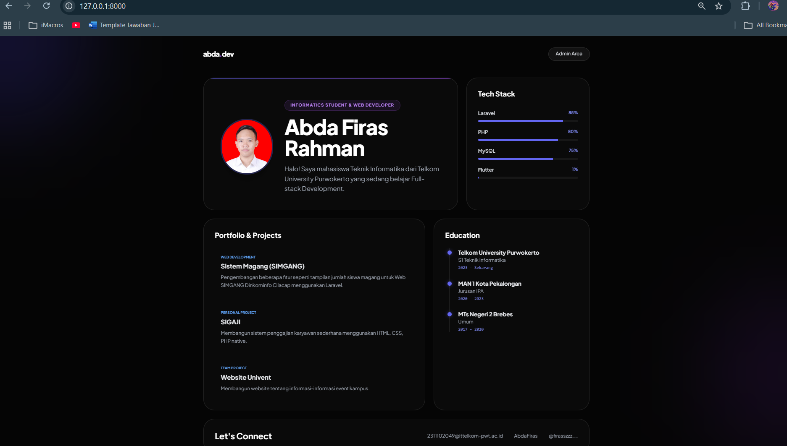
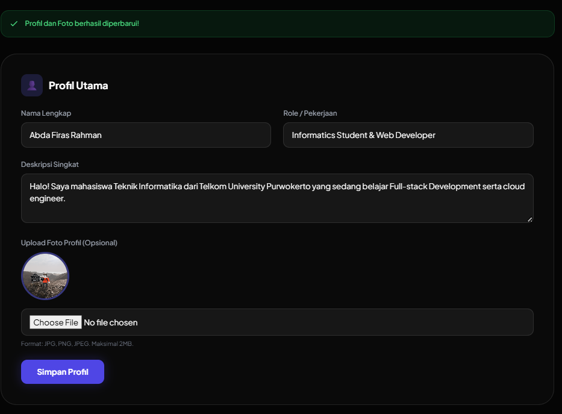
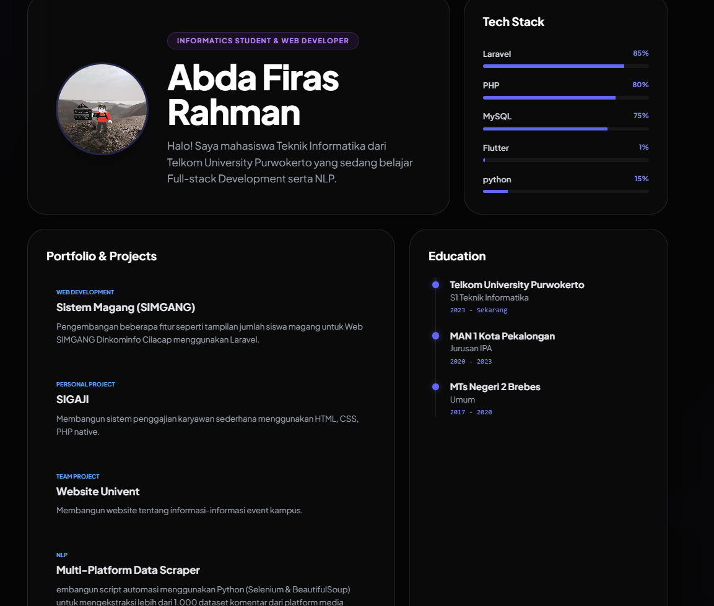
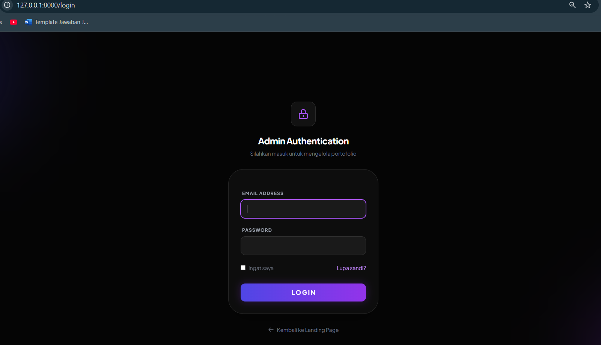
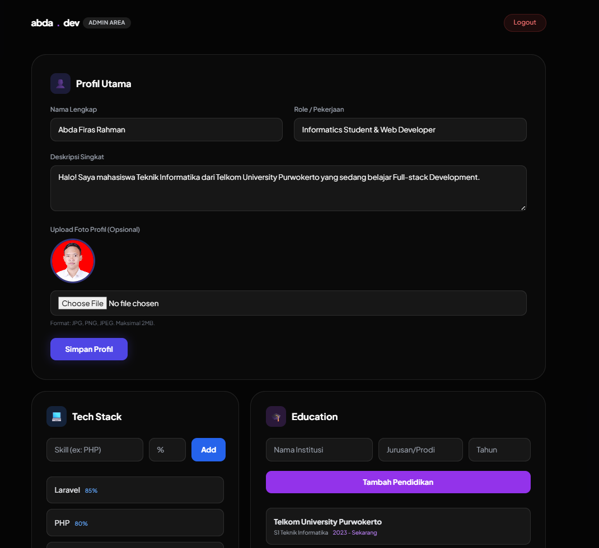
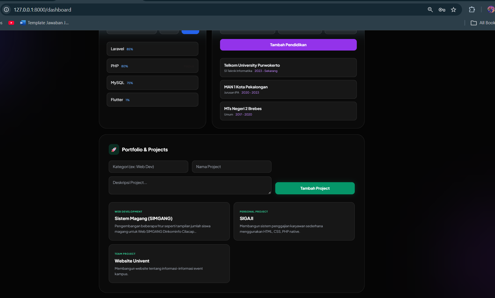

<div align="center">
  <br />

  <h1>LAPORAN PRAKTIKUM <br>
  APLIKASI BERBASIS PLATFORM
  </h1>

  <br />

  <h3>UTS</h3>
Website Profile
  <br>
  
  </h3>

  <br />

  <p align="center">

</p>

  <br />
  <br />
  <br />

  <h3>Disusun Oleh :</h3>

  <p>
    <strong>Abda Firas Rahman</strong><br>
    <strong>2311102049</strong><br>
    <strong>S1 IF-11-REG01</strong>
  </p>

  <br />

  <h3>Dosen Pengampu :</h3>

  <p>
    <strong>Dimas Fanny Hebrasianto Permadi, S.ST., M.Kom</strong>
  </p>
  
  <br />
  <br />
    <h4>Asisten Praktikum :</h4>
    <strong>Apri Pandu Wicaksono </strong> <br>
    <strong>Rangga Pradarrell Fathi</strong>
  <br />

  <h3>LABORATORIUM HIGH PERFORMANCE
 <br>FAKULTAS INFORMATIKA <br>UNIVERSITAS TELKOM PURWOKERTO <br>2026</h3>
</div>

<hr>

### Dasar Teori
1. Aplikasi Berbasis Web
Aplikasi web beroperasi dengan arsitektur client-server. Sisi klien (front-end) bertugas menampilkan antarmuka pengguna, sedangkan sisi server (back-end) memproses logika aplikasi dan berinteraksi dengan basis data.

2. Framework Laravel dan MVC
Laravel adalah framework PHP yang menggunakan pola arsitektur Model-View-Controller (MVC). Model mengelola struktur data, View menangani tampilan visual, dan Controller bertindak sebagai penghubung yang memproses permintaan (request) antara Model dan View.

2. RESTful API
RESTful API (Application Programming Interface) adalah antarmuka yang memungkinkan sistem klien dan server saling berkomunikasi. Dalam web dinamis, API bertugas mengirimkan data dari database ke halaman web dalam format yang ringan, yaitu JSON.

2. AJAX dan Fetch API
AJAX adalah teknik yang memungkinkan web mengambil atau mengirim data ke server di latar belakang tanpa melakukan refresh halaman. Pada web modern, teknik ini umumnya diimplementasikan menggunakan Fetch API bawaan JavaScript agar tampilan web bisa diperbarui secara dinamis.

2. Tailwind CSS
Tailwind CSS adalah framework CSS utility-first yang memungkinkan pembuatan desain antarmuka (UI) secara cepat langsung di dalam HTML. Framework ini sangat efisien untuk membangun tata letak web yang responsif agar tampilannya rapi di perangkat HP maupun PC.

2. Basis Data Relasional (RDBMS)
Basis data (seperti MySQL) digunakan sebagai media penyimpanan data utama pada aplikasi. Data disimpan secara terstruktur dalam tabel yang saling berelasi, sehingga mudah dikelola untuk operasi tambah, baca, ubah, dan hapus (CRUD).


### Hasil Kode Program:

## DASHBOARD NYA


## UPDATE PP


## AFTER UPDATE


## ADMIN




## Kode program 
Berikut adalah kode program nya:

### PortfolioController.php
```php
<?php

namespace App\Http\Controllers;

use App\Models\Profile;
use App\Models\Skill;
use App\Models\Project;
use App\Models\Education;
use Illuminate\Http\JsonResponse;

class PortfolioController extends Controller
{
    public function getProfile(): JsonResponse {
        return response()->json(['status' => 'success', 'data' => Profile::first()]);
    }
    public function getSkills(): JsonResponse {
        return response()->json(['status' => 'success', 'data' => Skill::all()]);
    }
    public function getProjects(): JsonResponse {
        return response()->json(['status' => 'success', 'data' => Project::all()]);
    }
    public function getEducation(): JsonResponse {
        return response()->json(['status' => 'success', 'data' => Education::all()]);
    }
}
```
## Penjelasan Program
komponen kontroler yang bertindak sebagai antarmuka pemrograman aplikasi (API) untuk sisi klien (front-end). File ini murni berisi logika untuk membaca atau mengambil (Read) sekumpulan data dari database—seperti data profil utama, riwayat pendidikan, keterampilan (tech stack), dan daftar proyek—melalui perantara Model Eloquent. Data yang berhasil diambil kemudian dikemas dan dikembalikan dalam format JSON (JavaScript Object Notation), sehingga siap untuk ditarik dan dirender secara langsung oleh halaman depan web tanpa perlu memuat ulang (reload) halaman.

### Web.php
```php
<?php

use App\Http\Controllers\PortfolioController;
use App\Http\Controllers\AdminController; 
use Illuminate\Support\Facades\Route;

Route::get('/', function () { return view('landing'); });

// API UNTUK AJAX 
Route::prefix('api')->group(function () {
    Route::get('/profile', [PortfolioController::class, 'getProfile']);
    Route::get('/skills', [PortfolioController::class, 'getSkills']);
    Route::get('/projects', [PortfolioController::class, 'getProjects']);
    Route::get('/education', [PortfolioController::class, 'getEducation']);
});

// DASHBOARD ADMIN 
Route::middleware(['auth'])->group(function () {
    Route::get('/dashboard', [AdminController::class, 'index'])->name('dashboard');
    Route::get('/profile', [AdminController::class, 'index'])->name('profile.edit');
    Route::patch('/profile', [AdminController::class, 'index'])->name('profile.update');
    Route::delete('/profile', [AdminController::class, 'index'])->name('profile.destroy');
    Route::post('/dashboard/profile', [AdminController::class, 'updateProfile'])->name('admin.profile.update');
    
    // Skill
    Route::post('/dashboard/skill', [AdminController::class, 'addSkill'])->name('admin.skill.add');
    Route::delete('/dashboard/skill/{id}', [AdminController::class, 'deleteSkill'])->name('admin.skill.delete');

    // Project
    Route::post('/dashboard/project', [AdminController::class, 'addProject'])->name('admin.project.add');
    Route::delete('/dashboard/project/{id}', [AdminController::class, 'deleteProject'])->name('admin.project.delete');

    // Education
    Route::post('/dashboard/education', [AdminController::class, 'addEducation'])->name('admin.education.add');
    Route::delete('/dashboard/education/{id}', [AdminController::class, 'deleteEducation'])->name('admin.education.delete');
});

require __DIR__.'/auth.php';
```
## Penjelasan Program
Berfungsi sebagai pusat navigasi atau pengatur rute (router) utama dalam aplikasi web berbasis Laravel. Di dalam file ini didefinisikan bagaimana sistem harus merespons setiap URL yang diakses oleh pengguna. Rute-rute ini dikelompokkan secara terstruktur menjadi tiga bagian utama: rute publik untuk menampilkan halaman depan antarmuka, rute API (/api) yang bertugas sebagai endpoint penyedia data JSON untuk diakses secara asinkron (AJAX), serta rute terproteksi (middleware auth) yang mengamankan akses ke halaman dashboard admin agar hanya bisa diakses oleh pengguna yang telah melakukan otentikasi (login).

### Landing.blade.php
```php
async function loadPortfolioData() {
    try {
        const [profileRes, projectsRes] = await Promise.all([
            fetch('/api/profile'), 
            fetch('/api/projects')
        ]);

        const profile = await profileRes.json();
        const projects = await projectsRes.json();

        if(profile.status === 'success') {
            document.getElementById('user-name').innerText = profile.data.name;
            
            document.getElementById('projects-list').innerHTML = projects.data.map(p => `
                <div class="project-card">
                    <h3>${p.title}</h3>
                    <p>${p.description}</p>
                </div>
            `).join('');
        }
    } catch (error) { 
        console.error("Gagal memuat data API:", error); 
    }
}
```
## Penjelasan Program
Halaman front-end atau sisi klien yang langsung dilihat dan diinteraksikan oleh pengunjung web. Dibangun menggunakan arsitektur HTML modern dengan kerangka kerja Tailwind CSS untuk mencapai desain visual bergaya glassmorphism dan tata letak yang responsif. Keunggulan utama dari file ini terletak pada penggunaan script JavaScript bawaan (Fetch API) di bagian bawah kodenya. Script tersebut bertugas melakukan request secara asinkron ke PortfolioController.php untuk mengambil data JSON, lalu menyuntikkannya secara dinamis ke dalam elemen-elemen HTML.

## AdminController.php
```php
<?php

namespace App\Http\Controllers;

use App\Models\Profile;
use App\Models\Skill;
use App\Models\Project;
use App\Models\Education;
use Illuminate\Http\Request;
use Illuminate\Support\Facades\Storage;

class AdminController extends Controller
{
    public function index()
    {
        $profile = Profile::first();
        $skills = Skill::all();
        $projects = Project::all();
        $educations = Education::all(); // Tambahkan baris ini
        
        return view('dashboard', compact('profile', 'skills', 'projects', 'educations'));
    }

    public function updateProfile(Request $request)
{
    $request->validate([
        'name' => 'required',
        'role' => 'required',
        'description' => 'required',
        'profile_image' => 'nullable|image|mimes:jpeg,png,jpg|max:2048',
    ]);

    $profile = Profile::first();
    
    $data = $request->only(['name', 'role', 'description']);

    if ($request->hasFile('profile_image')) {
        // Hapus foto lama jika ada
        if ($profile->profile_image) {
            Storage::delete('public/' . $profile->profile_image);
        }
        
        $path = $request->file('profile_image')->store('profiles', 'public');
        $data['profile_image'] = $path;
    }

    $profile->update($data);
    return back()->with('success', 'Profil dan Foto berhasil diperbarui!');
}

    public function addSkill(Request $request) 
    {
        $request->validate(['skill_name' => 'required', 'percentage' => 'required|numeric']);
        Skill::create($request->all());
        return back()->with('success', 'Skill baru berhasil ditambahkan!');
    }

    public function deleteSkill($id) 
    {
        Skill::destroy($id);
        return back()->with('success', 'Skill berhasil dihapus!');
    }

    public function addProject(Request $request) 
    {
        $request->validate(['category' => 'required', 'title' => 'required', 'description' => 'required']);
        Project::create($request->all());
        return back()->with('success', 'Project baru berhasil ditambahkan!');
    }

    public function deleteProject($id) 
    {
        Project::destroy($id);
        return back()->with('success', 'Project berhasil dihapus!');
    }

    public function addEducation(Request $request) 
    {
        $request->validate(['institution' => 'required', 'degree' => 'required', 'year' => 'required']);
        Education::create($request->all());
        return back()->with('success', 'Pendidikan berhasil ditambahkan!');
    }

    public function deleteEducation($id) 
    {
        Education::destroy($id);
        return back()->with('success', 'Pendidikan berhasil dihapus!');
    }
}
```
## Penjelasan Program
Bertindak sebagai otak atau mesin pemroses utama di balik panel dashboard administrator. File ini menangani seluruh operasi logika bisnis CRUD (Create, Read, Update, Delete) yang mengubah status data di dalam database. Di dalamnya terdapat fungsi-fungsi kompleks, mulai dari memvalidasi keamanan input yang dikirim melalui formulir, memproses unggahan file (seperti menghapus foto lama dan menyimpan foto profil baru ke direktori lokal penyimpanan), hingga mengeksekusi perintah untuk menambah atau menghapus baris data proyek dan pendidikan dari sistem dengan aman.

### DatabseSeeder.php
```php
<?php

namespace Database\Seeders;

use Illuminate\Database\Seeder;
use App\Models\User;
use App\Models\Profile;
use App\Models\Skill;
use App\Models\Project;
use App\Models\Education;
use Illuminate\Support\Facades\Hash;

class DatabaseSeeder extends Seeder
{
    public function run(): void
    {
        // 1. Bikin Akun Admin 
        User::create([
            'name' => 'Admin Abda',
            'email' => 'admin@admin.com',
            'password' => Hash::make('password123'),
        ]);

        // 2. Data Profil Bawaan
        Profile::create([
            'name' => 'Abda Firas Rahman',
            'role' => 'Informatics Student & Web Developer',
            'description' => 'Halo! Saya mahasiswa Teknik Informatika dari IT Telkom Purwokerto yang sedang belajar Full-stack Development.',
        ]);

        // 3. Data Tech Stack Bawaan
        Skill::create(['skill_name' => 'Laravel', 'percentage' => 85]);
        Skill::create(['skill_name' => 'PHP', 'percentage' => 80]);
        Skill::create(['skill_name' => 'MySQL', 'percentage' => 75]);

        // 4. Data Portfolio 
        Project::create([
            'category' => 'Web Development',
            'title' => 'Sistem Magang (SIMGANG)',
            'description' => 'Pengembangan beberapa fitur seperti tampilan jumlah siswa magang untuk Web SIMGANG Dinkominfo Cilacap menggunakan Laravel.'
        ]);
        Project::create([
            'category' => 'Personal Project',
            'title' => 'SIGAJI',
            'description' => 'Membangun sistem penggajian karyawan sederhana menggunakan HTML, CSS, PHP native.'
        ]);
        Project::create([
            'category' => 'Team Project',
            'title' => 'Website Univent',
            'description' => 'Membangun website tentang informasi-informasi event kampus.'
        ]);

        // 5. Data Education 
        Education::create([
            'institution' => 'Telkom University Purwokerto',
            'degree' => 'S1 Teknik Informatika',
            'year' => '2023 - Sekarang'
        ]);
        Education::create([
            'institution' => 'MAN 1 Kota Pekalongan',
            'degree' => 'Jurusan IPA',
            'year' => '2020 - 2023'
        ]);
        Education::create([
            'institution' => 'MTs Negeri 2 Brebes',
            'degree' => 'Umum',
            'year' => '2017 - 2020'
        ]);
    }
}
```
## Penjelasan Program
digunakan untuk melakukan otomatisasi pengisian data awal (seeding) ke dalam database saat sistem pertama kali dijalankan atau diatur ulang (migrate:fresh). Alih-alih menginput data secara manual satu per satu ke dalam database, file ini menyediakan skrip untuk langsung menciptakan akun kredensial administrator (username dan password terenkripsi) serta menyuntikkan data default seperti informasi profil dan beberapa contoh portofolio proyek awal.
