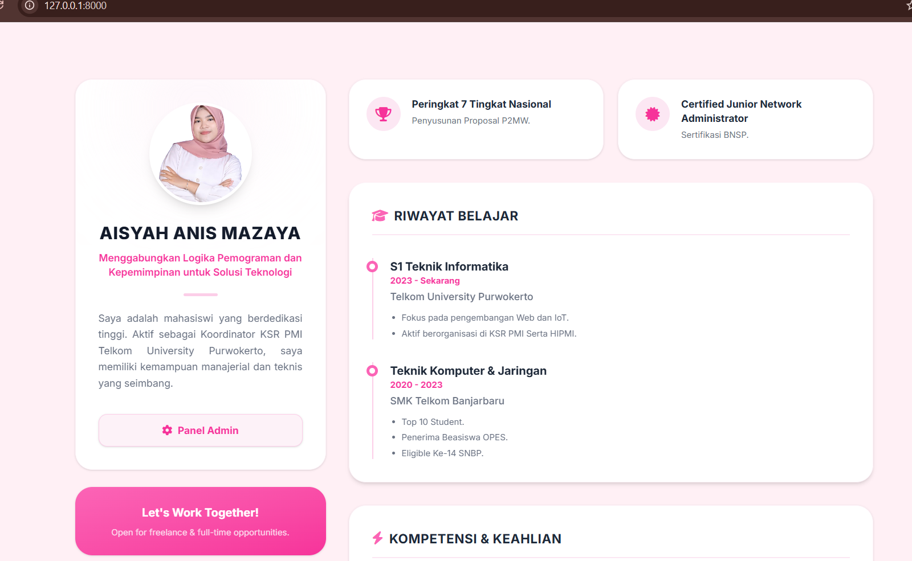
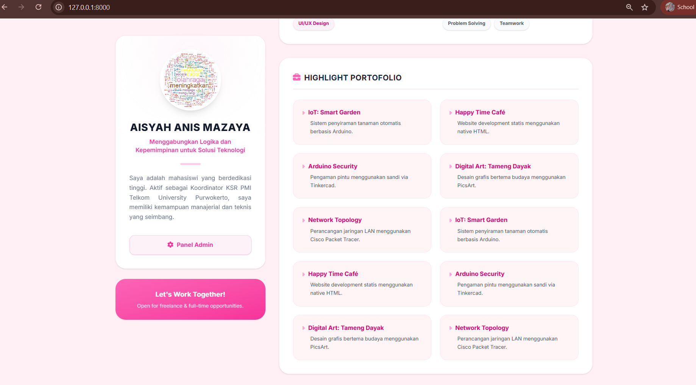
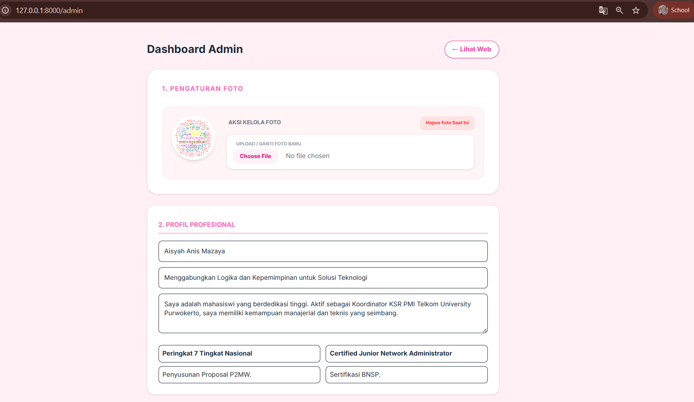
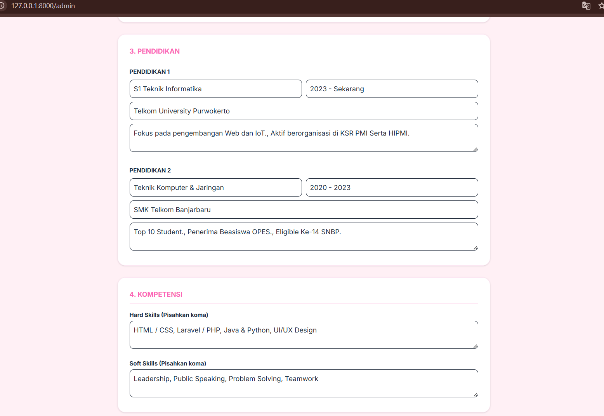
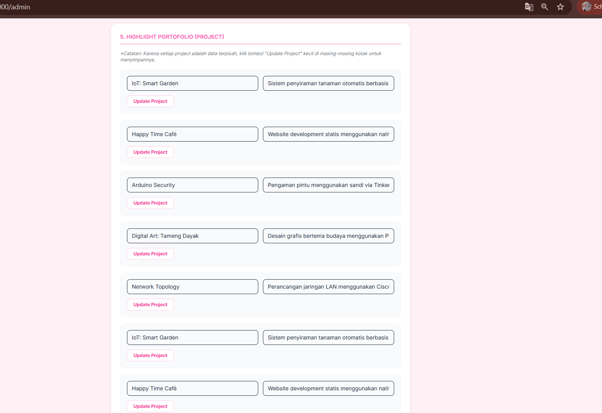
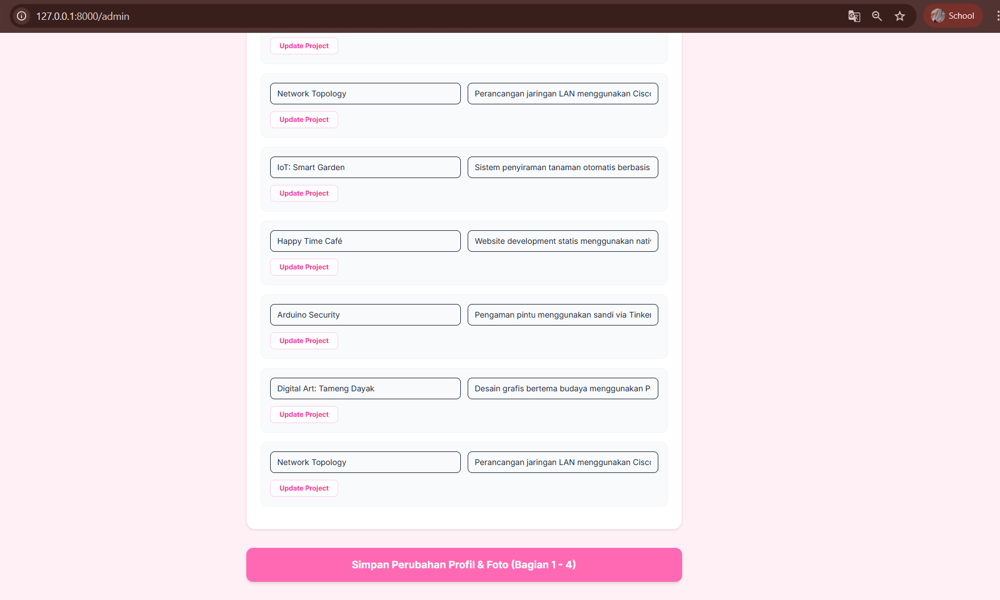
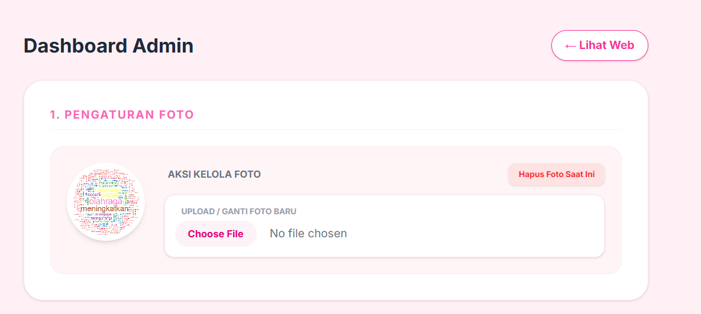
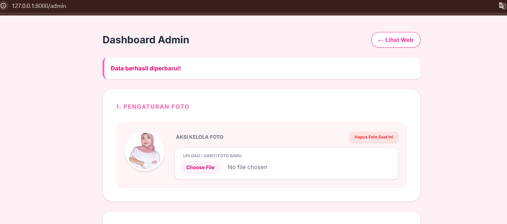
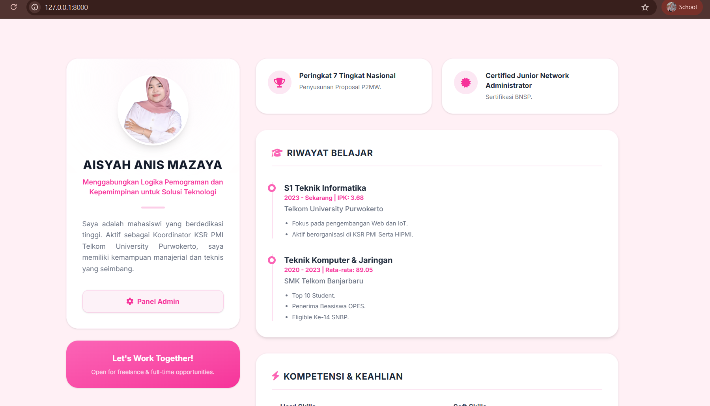

<div align="center">
  <br />

  <h1>LAPORAN PRAKTIKUM <br>
  APLIKASI BERBASIS PLATFORM
  </h1>

  <br />

  <h3>UTS</h3>
Ujian Tengah Semester
  <br>
  
  </h3>

  <br />

  <p align="center">

</p>

  <br />
  <br />
  <br />

  <h3>Disusun Oleh :</h3>

  <p>
    <strong>Aisyah Anis Mazaya </strong><br>
    <strong>2311102095</strong><br>
    <strong>S1 IF-11-REG01</strong>
  </p>

  <br />

  <h3>Dosen Pengampu :</h3>

  <p>
    <strong>Dimas Fanny Hebrasianto Permadi, S.ST., M.Kom</strong>
  </p>
  
  <br />
  <br />
    <h4>Asisten Praktikum :</h4>
    <strong>Apri Pandu Wicaksono </strong> <br>
    <strong>Rangga Pradarrell Fathi</strong>
  <br />

  <h3>LABORATORIUM HIGH PERFORMANCE
 <br>FAKULTAS INFORMATIKA <br>UNIVERSITAS TELKOM PURWOKERTO <br>2026</h3>
</div>

<hr>

### Dasar Teori
Pertukaran Data Asinkron Menggunakan AJAX
Sistem mengimplementasikan teknologi AJAX untuk memfasilitasi pertukaran data antara server dan browser secara asinkron di latar belakang. Mekanisme ini memungkinkan pembaruan konten halaman web secara dinamis tanpa perlu melakukan pemuatan ulang (reload) secara keseluruhan, sehingga menciptakan antarmuka yang lebih responsif, cepat, dan efisien bagi pengguna.

Manajemen Database dan Automasi Pengisian Data (Seeder)
Penyimpanan informasi dikelola melalui basis data terstruktur untuk menjamin integritas data. Dalam proses pengembangannya, sistem menggunakan fitur Database Seeding untuk mengautomasi pengisian data awal melalui skrip kode. Hal ini meminimalkan input manual yang repetitif, mempercepat fase pengujian, serta memastikan ketersediaan data contoh yang konsisten sesuai dengan skema tabel yang dirancang.

Arsitektur Pemrograman Berbasis Objek dan Model Data
Pengembangan aplikasi menggunakan pendekatan pemrograman berbasis objek, di mana setiap entitas database direpresentasikan melalui sebuah Model. Arsitektur ini memudahkan pengelolaan logika sistem dan manipulasi data secara lebih terorganisir. Dengan memisahkan antara struktur data dan logika pemrosesan, sistem menjadi lebih modular, aman dari celah keamanan dasar, dan mudah untuk dikembangkan di masa mendatang.

Antarmuka Responsif dan Pengalaman Pengguna (UI/UX)
Perancangan antarmuka dititikberatkan pada fleksibilitas tata letak agar tampilan aplikasi tetap optimal saat diakses melalui berbagai perangkat, baik ponsel maupun komputer. Fokus utama dari desain ini adalah memberikan navigasi yang intuitif dan visual yang konsisten, sehingga administrator dapat mengelola konten portofolio dengan mudah melalui panel kendali yang terstruktur secara logis.


## Kode program 
Berikut adalah kode program nya:

### PortofolioController.php
```php
<?php

namespace App\Http\Controllers;

use Illuminate\Http\Request;
use App\Models\Profile;
use App\Models\Skill;
use App\Models\Project; 
use Illuminate\Support\Facades\Storage; // <

class PortfolioController extends Controller
{
    // Landing Page
    public function index()
    {
        return view('welcome');
    }

    // API untuk AJAX mengambil data Profil
    public function getProfile()
    {
        $profile = Profile::first();
        return response()->json($profile);
    }

    // API untuk AJAX mengambil data Skill
    public function getSkills()
    {
        $skills = Skill::all();
        return response()->json($skills);
    }

    // API untuk AJAX mengambil data Project
    public function getProjects()
    {
        return response()->json(Project::all());
    }

    // Halaman Dashboard Admin
    public function adminDashboard()
    {
        $profile = Profile::first();
        $skills = Skill::all();
        $projects = Project::all(); 
        
        return view('admin', compact('profile', 'skills', 'projects')); 
    }

    // Update Profil & Foto
    public function updateProfile(Request $request)
    {
        $profile = Profile::first();
        $data = $request->all();

        if ($request->hasFile('photo')) {
            if ($profile->photo) {
                Storage::delete('public/' . $profile->photo);
            }
            $data['photo'] = $request->file('photo')->store('uploads', 'public');
        }

        $profile->update($data);
        return back()->with('success', 'Data berhasil diperbarui!');
    }

    // Hapus Foto
    public function deletePhoto()
    {
        $profile = Profile::first();
        if ($profile->photo) {
            Storage::delete('public/' . $profile->photo);
            $profile->update(['photo' => null]);
        }
        return back()->with('success', 'Foto profil berhasil dihapus!');
    }

    // Update Skill
    public function updateSkill(Request $request, $id)
    {
        $skill = Skill::find($id);
        $skill->update([
            'percentage' => $request->percentage
        ]);
        return back()->with('success', 'Skill berhasil diperbarui!');
    }

    // Update Project
    public function updateProject(Request $request, $id)
    {
        $project = Project::find($id);
        $project->update([
            'title' => $request->title,
            'description' => $request->description,
        ]);
        return back()->with('success', 'Project berhasil diperbarui!');
    }
}
```
## Penjelasan Program
File ini berfungsi sebagai otak atau pusat logika dari aplikasi portofolio yang sedang dikembangkan. Sebagai sebuah Controller, file ini bertanggung jawab untuk mengatur alur data antara basis data dan tampilan antarmuka. Di dalamnya terdapat fungsi-fungsi untuk mengambil data profil dan proyek dari database melalui Eloquent ORM, serta menyediakan logika untuk memperbarui informasi tersebut melalui panel admin. Dengan adanya controller ini, seluruh permintaan pengguna dapat diproses secara terpusat, memastikan data yang ditampilkan pada halaman depan selalu sinkron dengan data yang ada di sistem penyimpanan.

### Web.php
```php
<?php

use Illuminate\Support\Facades\Route;
use App\Http\Controllers\PortfolioController;

// Rute web
Route::get('/', [PortfolioController::class, 'index']);

// Rute AJAX 
Route::get('/api/profile', [PortfolioController::class, 'getProfile']);
Route::get('/api/skills', [PortfolioController::class, 'getSkills']);
Route::get('/api/projects', [\App\Http\Controllers\PortfolioController::class, 'getProjects']);

Route::get('/admin', [PortfolioController::class, 'adminDashboard']);
Route::post('/admin/profile/update', [PortfolioController::class, 'updateProfile'])->name('profile.update');
Route::post('/admin/skill/update/{id}', [PortfolioController::class, 'updateSkill'])->name('skill.update');
Route::post('/admin/profile/delete-photo', [PortfolioController::class, 'deletePhoto'])->name('profile.delete-photo');
Route::post('/admin/project/update/{id}', [\App\Http\Controllers\PortfolioController::class, 'updateProject'])->name('project.update');('project.update');
```
## Penjelasan Program
gerbang utama atau sistem navigasi yang mendefinisikan seluruh jalur akses (routing) dalam aplikasi web. Setiap alamat URL yang diketikkan oleh pengguna di peramban akan dicocokkan dengan definisi yang ada di dalam file ini untuk menentukan tindakan apa yang harus diambil oleh sistem. Selain mengatur rute untuk halaman publik, file ini juga berperan penting dalam mengelompokkan rute khusus admin serta menerapkan mekanisme pengamanan (middleware) agar halaman manajemen data hanya dapat diakses oleh pengguna yang sudah melalui proses autentikasi.

### Admin.blade.php
```php
<!DOCTYPE html>
<html lang="id">
<head>
    <meta charset="UTF-8">
    <title>Admin Panel</title>
    @vite(['resources/css/app.css', 'resources/js/app.js'])
    <link href="https://fonts.googleapis.com/css2?family=Inter:wght@400;600;700&display=swap" rel="stylesheet">
    <style>body { font-family: 'Inter', sans-serif; }</style>
</head>
<body class="bg-[#FFF0F5] text-gray-800 p-6">
    
    <div class="max-w-3xl mx-auto mt-4 pb-10">
        
        <div class="flex justify-between items-center mb-6">
            <h1 class="text-2xl font-bold">Dashboard Admin</h1>
            <a href="/" class="text-pink-500 text-sm font-bold bg-white px-4 py-2 rounded-full shadow border hover:bg-pink-50">← Lihat Web</a>
        </div>

        @if(session('success'))
            <div class="bg-white border-l-4 border-pink-400 text-pink-600 p-4 rounded-xl shadow mb-6 font-bold text-sm">
                {{ session('success') }}
            </div>
        @endif

        <div class="bg-white rounded-3xl shadow-sm border border-pink-100 p-8 mb-6">
            <h2 class="text-sm font-bold uppercase tracking-widest text-pink-400 mb-5 border-b border-pink-50 pb-2">1. Pengaturan Foto</h2>
            
            <div class="flex flex-col md:flex-row items-center md:items-start gap-6 p-5 bg-[#FFF5F7] rounded-2xl border border-pink-100">
                <div class="relative w-24 h-24 bg-white rounded-full overflow-hidden border-4 border-white shadow-md flex-shrink-0">
                    @if($profile->photo)
                        photo) }}" class="w-full h-full object-cover">
                    @else
                        <div class="w-full h-full flex items-center justify-center text-pink-300 font-bold text-3xl">A</div>
                    @endif
                </div>

                <div class="flex-1 w-full">
                    <div class="flex justify-between items-center mb-3">
                        <p class="text-xs font-bold text-gray-500 uppercase pl-1">Aksi Kelola Foto</p>
                        
                        @if($profile->photo)
                        <form action="{{ route('profile.delete-photo') }}" method="POST">
                            @csrf
                            <button type="submit" class="text-[10px] bg-red-100 text-red-500 px-3 py-1.5 rounded-lg font-bold hover:bg-red-200 transition shadow-sm">Hapus Foto Saat Ini</button>
                        </form>
                        @endif
                    </div>

                    <div class="bg-white p-3 rounded-xl border border-pink-100 shadow-sm">
                        <label class="block text-[10px] font-bold text-gray-400 mb-1 uppercase pl-2">Upload / Ganti Foto Baru</label>
                        <input type="file" name="photo" form="form-profil" class="w-full text-sm text-gray-500 file:mr-4 file:py-2 file:px-4 file:rounded-full file:border-0 file:text-xs file:font-bold file:bg-pink-50 file:text-pink-600 hover:file:bg-pink-100 cursor-pointer">
                    </div>
                </div>
            </div>
        </div>

        <form id="form-profil" action="{{ route('profile.update') }}" method="POST" enctype="multipart/form-data" class="space-y-6">
            @csrf
            
            <div class="bg-white rounded-2xl shadow-sm border border-pink-100 p-6">
                <h2 class="text-sm font-bold uppercase text-pink-400 mb-4 border-b pb-2 pt-2">2. Profil Profesional</h2>
                
                <div class="space-y-3">
                    <input type="text" name="name" value="{{ $profile->name }}" placeholder="Nama Lengkap" class="w-full border rounded-lg p-3 text-sm focus:ring-2 focus:ring-pink-200 outline-none">
                    <input type="text" name="headline" value="{{ $profile->headline }}" placeholder="Headline" class="w-full border rounded-lg p-3 text-sm focus:ring-2 focus:ring-pink-200 outline-none">
                    <textarea name="description" rows="3" class="w-full border rounded-lg p-3 text-sm focus:ring-2 focus:ring-pink-200 outline-none">{{ $profile->description }}</textarea>
                    
                    <div class="grid grid-cols-2 gap-3 mt-2">
                        <div>
                            <input type="text" name="achieve_1_title" value="{{ $profile->achieve_1_title }}" placeholder="Judul Pencapaian 1" class="w-full border rounded-lg p-2 text-sm mb-2 font-bold focus:ring-2 focus:ring-pink-200 outline-none">
                            <input type="text" name="achieve_1_desc" value="{{ $profile->achieve_1_desc }}" placeholder="Deskripsi 1" class="w-full border rounded-lg p-2 text-sm focus:ring-2 focus:ring-pink-200 outline-none">
                        </div>
                        <div>
                            <input type="text" name="achieve_2_title" value="{{ $profile->achieve_2_title }}" placeholder="Judul Pencapaian 2" class="w-full border rounded-lg p-2 text-sm mb-2 font-bold focus:ring-2 focus:ring-pink-200 outline-none">
                            <input type="text" name="achieve_2_desc" value="{{ $profile->achieve_2_desc }}" placeholder="Deskripsi 2" class="w-full border rounded-lg p-2 text-sm focus:ring-2 focus:ring-pink-200 outline-none">
                        </div>
                    </div>
                </div>
            </div>

            <div class="bg-white rounded-2xl shadow-sm border border-pink-100 p-6">
                <h2 class="text-sm font-bold uppercase text-pink-400 mb-4 border-b pb-2">3. Pendidikan</h2>
                
                <h3 class="text-xs font-bold mb-2">PENDIDIKAN 1</h3>
                <div class="grid grid-cols-2 gap-2 mb-2">
                    <input type="text" name="edu_1_major" value="{{ $profile->edu_1_major }}" placeholder="Jurusan" class="border rounded-lg p-2 text-sm focus:ring-2 focus:ring-pink-200 outline-none">
                    <input type="text" name="edu_1_year" value="{{ $profile->edu_1_year }}" placeholder="Tahun / IPK" class="border rounded-lg p-2 text-sm focus:ring-2 focus:ring-pink-200 outline-none">
                </div>
                <input type="text" name="edu_1_campus" value="{{ $profile->edu_1_campus }}" placeholder="Kampus" class="w-full border rounded-lg p-2 text-sm mb-2 focus:ring-2 focus:ring-pink-200 outline-none">
                <textarea name="edu_1_desc" rows="2" placeholder="Detail (Pisahkan koma)" class="w-full border rounded-lg p-2 text-sm mb-6 focus:ring-2 focus:ring-pink-200 outline-none">{{ $profile->edu_1_desc }}</textarea>

                <h3 class="text-xs font-bold mb-2">PENDIDIKAN 2</h3>
                <div class="grid grid-cols-2 gap-2 mb-2">
                    <input type="text" name="edu_2_major" value="{{ $profile->edu_2_major }}" placeholder="Jurusan" class="border rounded-lg p-2 text-sm focus:ring-2 focus:ring-pink-200 outline-none">
                    <input type="text" name="edu_2_year" value="{{ $profile->edu_2_year }}" placeholder="Tahun / Nilai" class="border rounded-lg p-2 text-sm focus:ring-2 focus:ring-pink-200 outline-none">
                </div>
                <input type="text" name="edu_2_campus" value="{{ $profile->edu_2_campus }}" placeholder="Sekolah" class="w-full border rounded-lg p-2 text-sm mb-2 focus:ring-2 focus:ring-pink-200 outline-none">
                <textarea name="edu_2_desc" rows="2" placeholder="Detail (Pisahkan koma)" class="w-full border rounded-lg p-2 text-sm focus:ring-2 focus:ring-pink-200 outline-none">{{ $profile->edu_2_desc }}</textarea>
            </div>

            <div class="bg-white rounded-2xl shadow-sm border border-pink-100 p-6">
                <h2 class="text-sm font-bold uppercase text-pink-400 mb-4 border-b pb-2">4. Kompetensi</h2>
                <label class="block text-xs font-bold mb-1">Hard Skills (Pisahkan koma)</label>
                <textarea name="hard_skills" rows="2" class="w-full border rounded-lg p-2 text-sm mb-4 focus:ring-2 focus:ring-pink-200 outline-none">{{ $profile->hard_skills }}</textarea>
                
                <label class="block text-xs font-bold mb-1">Soft Skills (Pisahkan koma)</label>
                <textarea name="soft_skills" rows="2" class="w-full border rounded-lg p-2 text-sm focus:ring-2 focus:ring-pink-200 outline-none">{{ $profile->soft_skills }}</textarea>
            </div>

        </form> <div class="bg-white rounded-2xl shadow-sm border border-pink-100 p-6 mt-6">
            <h2 class="text-sm font-bold uppercase text-pink-400 mb-4 border-b pb-2">5. Highlight Portofolio (Project)</h2>
            
            <p class="text-xs text-gray-500 mb-4 italic">*Catatan: Karena setiap project adalah data terpisah, klik tombol "Update Project" kecil di masing-masing kotak untuk menyimpannya.</p>

            @if(isset($projects) && $projects->count() > 0)
                @foreach($projects as $project)
                <form action="{{ route('project.update', $project->id) }}" method="POST" class="mb-4 bg-gray-50 p-4 rounded-xl border border-gray-100">
                    @csrf
                    <div class="grid grid-cols-1 md:grid-cols-2 gap-3 mb-3">
                        <input type="text" name="title" value="{{ $project->title }}" placeholder="Judul Project" class="w-full border rounded-lg px-3 py-2 text-sm focus:ring-2 focus:ring-pink-200 outline-none">
                        <input type="text" name="description" value="{{ $project->description }}" placeholder="Deskripsi" class="w-full border rounded-lg px-3 py-2 text-sm focus:ring-2 focus:ring-pink-200 outline-none">
                    </div>
                    <button type="submit" class="bg-white border border-pink-200 text-pink-500 px-4 py-1.5 rounded-lg text-xs font-bold hover:bg-pink-50 transition">Update Project</button>
                </form>
                @endforeach
            @else
                <p class="text-sm text-gray-500">Data project belum ada.</p>
            @endif
        </div>

        <button type="submit" form="form-profil" class="w-full bg-[#FF69B4] text-white py-4 mt-8 rounded-xl font-bold text-lg shadow-md hover:bg-[#FF1493] transition hover:-translate-y-1">
            Simpan Perubahan Profil & Foto (Bagian 1 - 4)
        </button>

    </div>
</body>
</html>
```
## Penjelasan Program
epresentasi dari antarmuka pengguna di sisi manajemen atau panel kontrol aplikasi. Menggunakan mesin templat Blade bawaan Laravel, file ini menyusun tata letak formulir dan tabel yang memungkinkan pengelola situs untuk melakukan operasi tambah, ubah, atau hapus data secara visual tanpa harus menyentuh basis data secara langsung.


### Welcome.blade.php
```html
<!DOCTYPE html>
<html lang="id" class="scroll-smooth">
<head>
    <meta charset="UTF-8">
    <meta name="viewport" content="width=device-width, initial-scale=1.0">
    <title>Portofolio - Aisyah Anis Mazaya</title>
    @vite(['resources/css/app.css', 'resources/js/app.js'])
    <link href="https://fonts.googleapis.com/css2?family=Inter:wght@400;500;600;700;800&display=swap" rel="stylesheet">
    <link rel="stylesheet" href="https://cdnjs.cloudflare.com/ajax/libs/font-awesome/6.4.0/css/all.min.css">
    <style>body { font-family: 'Inter', sans-serif; }</style>
</head>
<body class="bg-[#FFF0F5] text-gray-800 antialiased selection:bg-pink-200 selection:text-pink-900">

    <div class="max-w-6xl mx-auto px-4 py-12 lg:py-20">
        
        <div class="grid grid-cols-1 lg:grid-cols-12 gap-8 items-start">

            <div class="lg:col-span-4 space-y-6 lg:sticky lg:top-10">
                
                <div class="bg-white rounded-3xl shadow-sm border border-pink-50 p-8 text-center relative overflow-hidden group hover:shadow-md transition duration-300">
                    <div class="absolute left-1/2 -translate-x-1/2 -top-10 w-40 h-40 bg-pink-100 rounded-full blur-3xl opacity-60"></div>
                    
                    <div class="relative w-36 h-36 mx-auto bg-white rounded-full border-4 border-white shadow-lg overflow-hidden mb-6 cursor-pointer">
                        
                        <div id="foto-profil-fallback" class="w-full h-full flex items-center justify-center text-4xl font-bold text-pink-300">A</div>
                    </div>

                    <h1 id="nama-profil" class="text-2xl font-extrabold uppercase tracking-wide text-gray-900">Memuat...</h1>
                    <p id="headline-profil" class="text-pink-500 font-semibold mt-2 text-sm">Sabar ya...</p>
                    
                    <div class="w-12 h-1 bg-pink-200 mx-auto my-5 rounded-full"></div>
                    
                    <p id="deskripsi-profil" class="text-sm text-gray-500 leading-relaxed text-justify mb-8">
                        ...
                    </p>

                    <a href="/admin" class="inline-flex items-center justify-center gap-2 w-full text-sm bg-pink-50 text-pink-500 border border-pink-200 px-6 py-3 rounded-xl font-bold hover:bg-pink-500 hover:text-white shadow-sm transition duration-300">
                        <i class="fas fa-cog"></i> Panel Admin
                    </a>
                </div>

                <div class="bg-gradient-to-br from-pink-400 to-pink-500 rounded-3xl shadow-sm p-6 text-white text-center">
                    <h3 class="font-bold mb-2">Let's Work Together!</h3>
                    <p class="text-xs text-pink-100 opacity-90">Open for freelance & full-time opportunities.</p>
                </div>
            </div>


            <div class="lg:col-span-8 space-y-8">

                <div class="grid grid-cols-1 sm:grid-cols-2 gap-5">
                    <div class="bg-white rounded-3xl p-6 border border-pink-50 shadow-sm hover:shadow-md transition flex items-start gap-4">
                        <div class="bg-pink-100 w-12 h-12 rounded-full flex items-center justify-center text-pink-500 text-xl flex-shrink-0"><i class="fas fa-trophy"></i></div>
                        <div>
                            <h3 id="achieve-1-title" class="font-bold text-gray-800 mb-1 text-sm">Memuat...</h3>
                            <p id="achieve-1-desc" class="text-xs text-gray-500 leading-relaxed">-</p>
                        </div>
                    </div>
                    <div class="bg-white rounded-3xl p-6 border border-pink-50 shadow-sm hover:shadow-md transition flex items-start gap-4">
                        <div class="bg-pink-100 w-12 h-12 rounded-full flex items-center justify-center text-pink-500 text-xl flex-shrink-0"><i class="fas fa-certificate"></i></div>
                        <div>
                            <h3 id="achieve-2-title" class="font-bold text-gray-800 mb-1 text-sm">Memuat...</h3>
                            <p id="achieve-2-desc" class="text-xs text-gray-500 leading-relaxed">-</p>
                        </div>
                    </div>
                </div>

                <div class="bg-white rounded-3xl shadow-sm border border-pink-50 p-8 hover:shadow-md transition duration-300">
                    <h2 class="text-lg font-bold uppercase tracking-wide border-b-2 border-pink-100 pb-3 mb-8 text-gray-800 flex items-center gap-2">
                        <i class="fas fa-graduation-cap text-pink-400"></i> Riwayat Belajar
                    </h2>
                    
                    <div class="space-y-8">
                        <div class="relative pl-6 border-l-2 border-pink-200">
                            <div class="absolute w-4 h-4 bg-white border-4 border-pink-400 rounded-full -left-[9px] top-1"></div>
                            <h3 id="edu-1-major" class="font-bold text-gray-800 text-base">Memuat...</h3>
                            <p id="edu-1-year" class="text-xs text-pink-500 font-bold mb-1">-</p>
                            <p id="edu-1-campus" class="text-sm text-gray-500 mb-3 font-medium">-</p>
                            <ul id="edu-1-desc" class="text-xs text-gray-500 list-disc ml-4 space-y-1.5"></ul>
                        </div>
                        <div class="relative pl-6 border-l-2 border-pink-200">
                            <div class="absolute w-4 h-4 bg-white border-4 border-pink-400 rounded-full -left-[9px] top-1"></div>
                            <h3 id="edu-2-major" class="font-bold text-gray-800 text-base">Memuat...</h3>
                            <p id="edu-2-year" class="text-xs text-pink-500 font-bold mb-1">-</p>
                            <p id="edu-2-campus" class="text-sm text-gray-500 mb-3 font-medium">-</p>
                            <ul id="edu-2-desc" class="text-xs text-gray-500 list-disc ml-4 space-y-1.5"></ul>
                        </div>
                    </div>
                </div>

                <div class="bg-white rounded-3xl shadow-sm border border-pink-50 p-8 hover:shadow-md transition duration-300">
                    <h2 class="text-lg font-bold uppercase tracking-wide border-b-2 border-pink-100 pb-3 mb-6 text-gray-800 flex items-center gap-2">
                        <i class="fas fa-bolt text-pink-400"></i> Kompetensi & Keahlian
                    </h2>
                    
                    <div class="grid grid-cols-1 md:grid-cols-2 gap-8">
                        <div>
                            <h3 class="font-bold text-gray-700 mb-3 text-sm">— Hard Skills</h3>
                            <div id="hard-skills-container" class="flex flex-wrap gap-2"></div>
                        </div>
                        <div>
                            <h3 class="font-bold text-gray-700 mb-3 text-sm">— Soft Skills</h3>
                            <div id="soft-skills-container" class="flex flex-wrap gap-2"></div>
                        </div>
                    </div>
                </div>

                <div class="bg-white rounded-3xl shadow-sm border border-pink-50 p-8 hover:shadow-md transition duration-300">
                    <h2 class="text-lg font-bold uppercase tracking-wide border-b-2 border-pink-100 pb-3 mb-6 text-gray-800 flex items-center gap-2">
                        <i class="fas fa-briefcase text-pink-400"></i> Highlight Portofolio
                    </h2>
                    
                    <div id="tempat-project" class="grid grid-cols-1 md:grid-cols-2 gap-5">
                        <div class="text-sm text-pink-400 col-span-full">Memuat project...</div>
                    </div>
                </div>

            </div>
        </div>
    </div>

    <script>
        document.addEventListener('DOMContentLoaded', function() {
            
            // 1. Fetch Profil
            fetch('/api/profile')
                .then(res => res.json())
                .then(data => {
                    // Update Identitas
                    document.getElementById('nama-profil').innerText = data.name || 'Aisyah Anis Mazaya';
                    document.getElementById('headline-profil').innerText = data.headline || 'Web Developer';
                    document.getElementById('deskripsi-profil').innerText = data.description || 'Deskripsi belum diisi.';
                    
                    // Update Foto
                    const imgElement = document.getElementById('foto-profil-img');
                    const fallbackElement = document.getElementById('foto-profil-fallback');
                    if(data.photo) {
                        imgElement.src = `/storage/${data.photo}`;
                        imgElement.classList.remove('hidden');
                        fallbackElement.classList.add('hidden');
                    } else {
                        imgElement.src = `https://ui-avatars.com/api/?name=${data.name || 'A'}&background=FFB6C1&color=fff&size=200`;
                        imgElement.classList.remove('hidden');
                        fallbackElement.classList.add('hidden');
                    }
                    
                    // Update Pencapaian
                    document.getElementById('achieve-1-title').innerText = data.achieve_1_title || '-';
                    document.getElementById('achieve-1-desc').innerText = data.achieve_1_desc || '-';
                    document.getElementById('achieve-2-title').innerText = data.achieve_2_title || '-';
                    document.getElementById('achieve-2-desc').innerText = data.achieve_2_desc || '-';

                    // Utility Format
                    const formatList = str => str ? str.split(',').map(item => `<li>${item.trim()}</li>`).join('') : '<li>-</li>';
                    const formatSkill = (str, colorClass) => str ? str.split(',').map(item => `<span class="${colorClass} px-3 py-1.5 rounded-full text-[11px] font-bold shadow-sm border border-opacity-50">${item.trim()}</span>`).join('') : '-';

                    // Update Pendidikan
                    document.getElementById('edu-1-major').innerText = data.edu_1_major || '-';
                    document.getElementById('edu-1-year').innerText = data.edu_1_year || '-';
                    document.getElementById('edu-1-campus').innerText = data.edu_1_campus || '-';
                    document.getElementById('edu-1-desc').innerHTML = formatList(data.edu_1_desc);

                    document.getElementById('edu-2-major').innerText = data.edu_2_major || '-';
                    document.getElementById('edu-2-year').innerText = data.edu_2_year || '-';
                    document.getElementById('edu-2-campus').innerText = data.edu_2_campus || '-';
                    document.getElementById('edu-2-desc').innerHTML = formatList(data.edu_2_desc);

                    // Update Skills Pill
                    document.getElementById('hard-skills-container').innerHTML = formatSkill(data.hard_skills, 'bg-pink-50 text-pink-600 border-pink-100');
                    document.getElementById('soft-skills-container').innerHTML = formatSkill(data.soft_skills, 'bg-gray-50 text-gray-600 border-gray-100');
                });

            // 2. Fetch Projects
            fetch('/api/projects')
                .then(res => res.json())
                .then(projects => {
                    document.getElementById('tempat-project').innerHTML = projects.map(project => `
                        <div class="bg-[#FFF5F7] rounded-2xl p-5 border border-pink-100 hover:border-pink-300 transition duration-300 group">
                            <h3 class="font-bold text-pink-600 text-sm mb-1.5 flex items-start gap-2">
                                <i class="fas fa-caret-right text-pink-300 mt-1 group-hover:translate-x-1 transition-transform"></i>
                                ${project.title}
                            </h3>
                            <p class="text-xs text-gray-600 leading-relaxed pl-5">${project.description}</p>
                        </div>
                    `).join('');
                });
        });
    </script>
</body>
</html>
```

## Penjelasan Program
Komponen utama yang merepresentasikan halaman depan (Landing Page) atau antarmuka publik dari aplikasi portofolio. Berbeda dengan halaman statis biasa, file ini dirancang untuk menampilkan informasi secara dinamis dengan mengintegrasikan data yang diambil dari peladen melalui permintaan API. Di dalam file ini, struktur tata letak disusun menggunakan kerangka kerja Tailwind CSS untuk memastikan tampilan yang responsif dan estetis pada berbagai perangkat.

### ProjectSeeder.php
```php
<?php

namespace Database\Seeders;
use Illuminate\Database\Seeder;
use App\Models\Project;

class ProjectSeeder extends Seeder
{
    public function run(): void
    {
        Project::insert([
            ['title' => 'IoT: Smart Garden', 'description' => 'Sistem penyiraman tanaman otomatis berbasis Arduino.'],
            ['title' => 'Happy Time Café', 'description' => 'Website development statis menggunakan native HTML.'],
            ['title' => 'Arduino Security', 'description' => 'Pengaman pintu menggunakan sandi via Tinkercad.'],
            ['title' => 'Digital Art: Tameng Dayak', 'description' => 'Desain grafis bertema budaya menggunakan PicsArt.'],
            ['title' => 'Network Topology', 'description' => 'Perancangan jaringan LAN menggunakan Cisco Packet Tracer.'],
        ]);
    }
}
```
## Penjelasan Program
Sebagai penyedia data awal (automated data filler) yang digunakan untuk mengisi tabel-tabel pada basis data secara otomatis. Dalam proses pengembangan, Seeder memegang peranan penting untuk menjamin ketersediaan data contoh (dummy data) yang konsisten, sehingga pengembang atau penguji sistem tidak perlu memasukkan data secara manual melalui antarmuka atau perintah SQL dasar.

### DatabseSeeder.php
```php
<?php

namespace Database\Seeders;
use Illuminate\Database\Seeder;
use App\Models\Profile;

class DatabaseSeeder extends Seeder
{
    public function run(): void
    {
        Profile::create([
            'name' => 'Aisyah Anis Mazaya',
            'headline' => 'Menggabungkan Logika dan Kepemimpinan untuk Solusi Teknologi',
            'description' => 'Dengan IPK 3.68, saya adalah mahasiswi S1 Teknik Informatika di Telkom University Purwokerto...',
            'achieve_1_title' => 'Peringkat 7 Tingkat Nasional',
            'achieve_1_desc' => 'Penyusunan Proposal P2MW.',
            'achieve_2_title' => 'Certified Junior Network Administrator',
            'achieve_2_desc' => 'Sertifikasi BNSP.',
            'edu_1_major' => 'S1 Teknik Informatika',
            'edu_1_year' => '2023 - Sekarang | IPK: 3.68',
            'edu_1_campus' => 'Telkom University Purwokerto',
            'edu_1_desc' => 'Fokus pada pengembangan Web dan IoT., Aktif berorganisasi di KSR PMI.',
            'edu_2_major' => 'Teknik Komputer & Jaringan',
            'edu_2_year' => '2020 - 2023 | Rata-rata: 89.05',
            'edu_2_campus' => 'SMK Telkom Banjarbaru',
            'edu_2_desc' => 'Top 10 Student., Penerima Beasiswa OPES., Eligible Ke-14 SNBP.',
            'hard_skills' => 'HTML / CSS, Laravel / PHP, Java & Python, UI/UX Design',
            'soft_skills' => 'Leadership, Public Speaking, Problem Solving, Teamwork'
        ]);
    }
}
```
## Penjelasan Program
pusat kendali atau direktori utama dalam mekanisme pengisian data awal (seeding) pada kerangka kerja Laravel. Secara teknis, DatabaseSeeder.php berperan sebagai titik masuk yang mengonsolidasikan berbagai kelas seeder spesifik, seperti seeder untuk profil dan proyek, agar dapat dijalankan secara serentak melalui satu perintah eksekusi tunggal. Implementasi file ini sangat krusial dalam siklus pengembangan sistem informasi, karena memungkinkan pengembang untuk membangun kembali seluruh basis data beserta isinya secara cepat dan konsisten.

### Tampilan Hasil Kode Program:
## DASHBOARD



## ADMIN





## FOTO PROFILE BEFORE AND AFTER



## AFTER UPDATE

