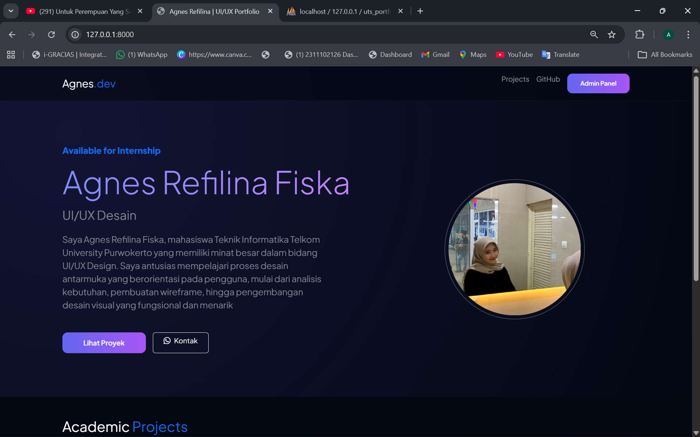
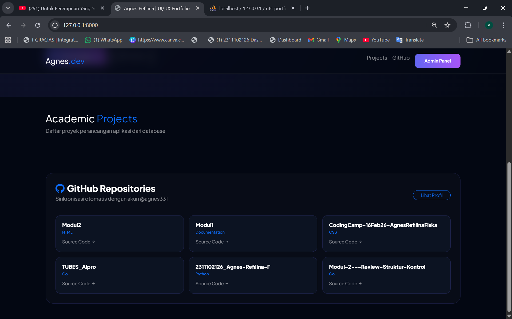
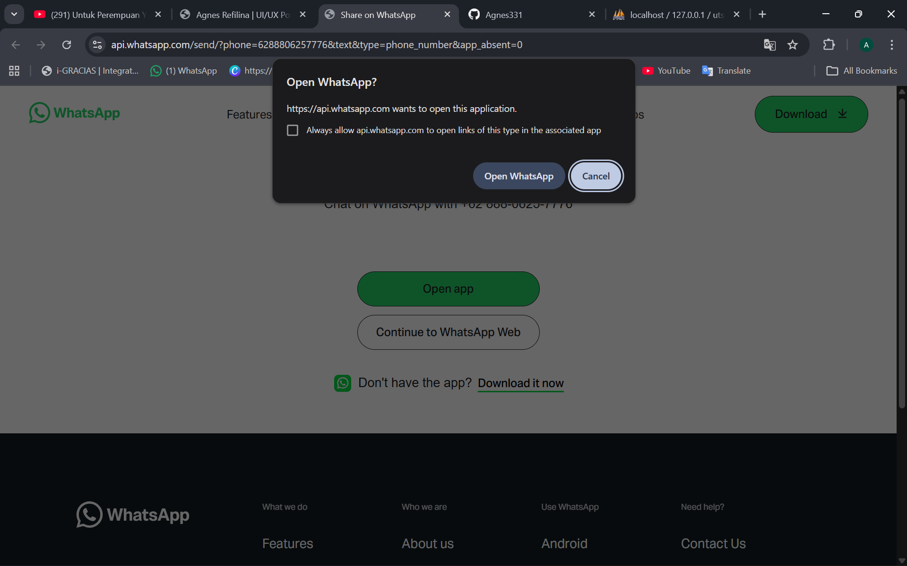
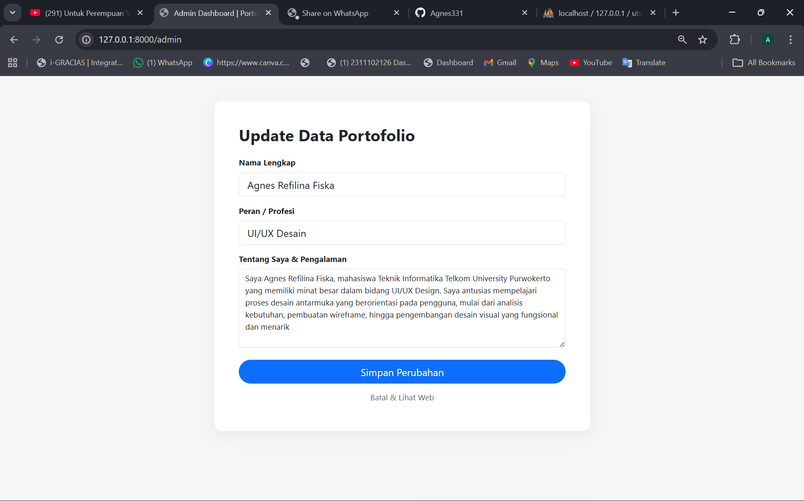
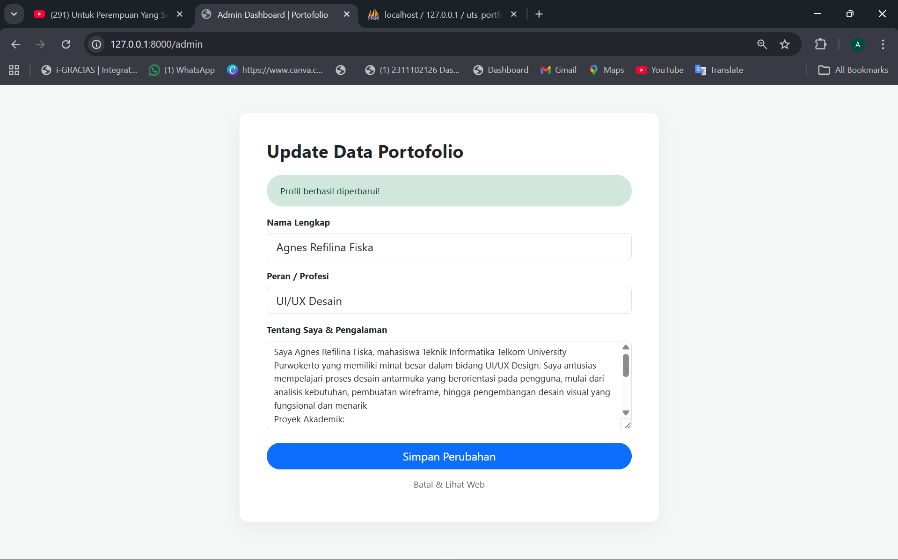

<div align="center">
  <br />
  <h1>LAPORAN PRAKTIKUM <br> APLIKASI BERBASIS PLATFORM</h1>
  <br />
  <h3>UTS <br> Web Profile </h3>
  <br />
  
  <br />
  <br />
  <br />
  <h3>Disusun Oleh :</h3>
  <p>
    <strong>Agnes Refilina Fiska</strong><br>
    <strong>2311102126</strong><br>
    <strong>S1 IF-11-01</strong>
  </p>
  <br />
  <h3>Dosen Pengampu :</h3>
  <p>
    <strong>Dimas Fanny Hebrasianto Permadi, S.ST., M.Kom</strong>
  </p>
  <br />
  <br />
  <h4>Asisten Praktikum :</h4>
  <strong>Apri Pandu Wicaksono</strong> <br>
  <strong>Rangga Pradarrell Fathi</strong>
  <br />
  <br />
  <br />
  <br />
  <h3>LABORATORIUM HIGH PERFORMANCE <br> FAKULTAS INFORMATIKA <br> UNIVERSITAS TELKOM PURWOKERTO <br> 2026</h3>
</div>

---

## A. Dasar Teori

### 1. Laravel
Laravel merupakan framework PHP open-source paling populer saat ini yang dirancang untuk meningkatkan produktivitas pengembang melalui sintaks yang ekspresif dan elegan. Keunggulan utama Laravel terletak pada implementasi pola arsitektur MVC (Model-View-Controller). Pola ini secara cerdas memisahkan logika bisnis (Model), antarmuka pengguna (View), dan penghubung antar keduanya (Controller). Dengan pemisahan ini, kode program menjadi lebih rapi, mudah dirawat (maintainable), dan sangat efisien untuk pengembangan aplikasi skala besar seperti sistem inventaris atau platform portofolio yang sedang kita bangun.

### 2. Web Portofolio Dinamis
Berbeda dengan situs statis konvensional yang kaku karena kontennya tertanam langsung di dalam kode HTML, Web Portofolio Dinamis menawarkan fleksibilitas tinggi. Seluruh data, mulai dari biografi singkat, daftar proyek, hingga detail keahlian, disimpan di dalam basis data (database). Hal ini memungkinkan pengguna untuk memperbarui informasi secara real-time melalui panel admin tanpa perlu menyentuh baris kode program sedikit pun. Pendekatan ini memastikan informasi yang ditampilkan kepada pengunjung selalu mutakhir.

### 3. Fetch API & AJAX (Asynchronous JavaScript and XML)
Dalam pengembangan web modern, pengalaman pengguna (User Experience) adalah prioritas utama. AJAX (Asynchronous JavaScript and XML) hadir sebagai teknik yang memungkinkan halaman web berkomunikasi dengan server di balik layar. Dengan menggunakan Fetch API (standar modern JavaScript), aplikasi dapat mengambil atau mengirim data ke server tanpa harus memuat ulang (reload) seluruh halaman. Hasilnya, transisi antar konten terasa sangat halus (seamless), cepat, dan interaktif, mirip dengan aplikasi mobile asli.

### 4. REST API
Representational State Transfer atau REST API bertindak sebagai protokol komunikasi standar yang menghubungkan berbagai sistem berbeda. Dalam proyek ini, terdapat dua jenis integrasi API:

- Internal API: Dibangun di dalam Laravel untuk menjembatani data dari database MySQL agar bisa dikonsumsi oleh bagian frontend.

- External API (GitHub API): Digunakan untuk melakukan integrasi dengan server pihak ketiga (GitHub). Melalui ini, data publik seperti nama repositori, statistik koding, dan bahasa pemrograman dapat ditarik secara otomatis ke dalam portofolio, memberikan bukti kompetensi teknis yang transparan.

### 5. JSON (JavaScript Object Notation)
JSON adalah format pertukaran data berbasis teks yang sangat ringan dan mudah dipahami baik oleh manusia maupun mesin. Saat ini, JSON telah menjadi standar industri dalam komunikasi API. Dalam praktiknya, data profil atau informasi proyek dari Laravel dikirim dalam format JSON, kemudian JavaScript akan melakukan parsing (pengolahan) data tersebut untuk dirender menjadi elemen visual yang menarik, seperti kartu proyek atau badges keahlian.

### 6. Laravel Controller & API Routing
Laravel memiliki sistem Routing yang sangat fleksibel untuk mendefinisikan titik masuk (endpoint) aplikasi. Setiap permintaan (request) yang masuk akan diarahkan ke Controller yang relevan. Di dalam Controller, logika pengambilan data dari database diproses. Setelah data berhasil diambil, Controller akan mengembalikan respon dalam format JSON melalui fungsi response()->json(). Hal ini memungkinkan pemisahan yang tegas antara penyedia data dan penyaji tampilan.

### 7. Middleware & Security
Keamanan adalah aspek krusial dalam aplikasi berbasis web. Laravel menyediakan fitur Middleware yang berfungsi sebagai filter atau "penjaga pintu" bagi setiap permintaan yang masuk ke server. Meskipun data portofolio mungkin bersifat publik, penggunaan Middleware memastikan bahwa fungsi-fungsi sensitif (seperti menambah, mengedit, atau menghapus data) hanya dapat diakses oleh pengguna yang memiliki otoritas (Admin). Pemisahan jalur akses antara Web dan API juga merupakan langkah strategis untuk menjaga integritas data dan keamanan aplikasi secara keseluruhan.

---

## B. Penjelasan Kode

### 1. Sourcecode routes/web.php
```php
<?php

use Illuminate\Support\Facades\Route;
use Illuminate\Http\Request;
use Illuminate\Support\Facades\DB;

/*
|--------------------------------------------------------------------------
| Web Routes - Portofolio Agnes Refilina
|--------------------------------------------------------------------------
*/

// --- HALAMAN UTAMA ---
Route::get('/', function () {
    return view('landing');
});

// --- HALAMAN ADMIN ---
Route::get('/admin', function () {
    $data = DB::table('profiles')->first();
    // Mengambil semua proyek untuk ditampilkan di tabel admin
    $projects = DB::table('projects')->get(); 
    return view('admin', compact('data', 'projects'));
});

// --- API UNTUK AJAX (DATA DINAMIS) ---
Route::get('/api/profile', function () {
    $profile = DB::table('profiles')->first();
    return response()->json($profile);
});

Route::get('/api/projects', function () {
    $projects = DB::table('projects')->get();
    return response()->json($projects);
});

// --- LOGIKA UPDATE PROFIL UTAMA ---
Route::post('/update-profile', function (Request $request) {
    DB::table('profiles')->updateOrInsert(
        ['id' => 1],
        [
            'nama' => $request->nama,
            'peran' => $request->peran,
            'deskripsi' => $request->deskripsi,
            'updated_at' => now()
        ]
    );
    return back()->with('success', 'Profil berhasil diperbarui!');
});

// --- LOGIKA CRUD PROYEK (TAMBAH & EDIT) ---
Route::post('/project/save', function (Request $request) {
    // Jika ada ID, maka Update. Jika tidak ada, maka Insert baru.
    DB::table('projects')->updateOrInsert(
        ['id' => $request->id],
        [
            'judul' => $request->judul,
            'kategori' => $request->kategori,
            'deskripsi' => $request->deskripsi,
            'created_at' => now(),
            'updated_at' => now()
        ]
    );
    return back()->with('success', 'Data proyek berhasil disimpan!');
});

// --- LOGIKA HAPUS PROYEK ---
Route::get('/project/delete/{id}', function ($id) {
    DB::table('projects')->where('id', $id)->delete();
    return back()->with('success', 'Proyek berhasil dihapus!');
});
```

### Penjelasan

Kode program tersebut merupakan konfigurasi routing pada Laravel yang berfungsi sebagai pusat kendali untuk menghubungkan antarmuka pengguna dengan basis data MySQL melalui pemanfaatan fasad DB . Secara teknis, kode ini mengatur navigasi untuk menampilkan halaman portofolio utama dan panel admin, serta menyediakan API internal dalam format JSON yang memungkinkan pengambilan data profil dan proyek secara dinamis menggunakan teknik AJAX . Selain itu, seluruh logika manipulasi data atau CRUD (Create, Read, Update, Delete) dikelola secara terpusat, mulai dari memperbarui biografi diri, menambah atau menyunting rincian proyek akademik seperti E-Grocery dan CekSehat, hingga menghapus data proyek tertentu dari database.

### 2. Sourcecode landing.blade.php
```php
<!DOCTYPE html>
<html lang="id">
<head>
    <meta charset="UTF-8">
    <meta name="viewport" content="width=device-width, initial-scale=1.0">
    <title>Agnes Refilina | UI/UX Portfolio</title>
    
    <link href="https://cdn.jsdelivr.net/npm/bootstrap@5.3.0/dist/css/bootstrap.min.css" rel="stylesheet">
    <link href="https://fonts.googleapis.com/css2?family=Plus+Jakarta+Sans:wght@300;400;600;800&display=swap" rel="stylesheet">
    <link rel="stylesheet" href="https://cdn.jsdelivr.net/npm/bootstrap-icons@1.11.1/font/bootstrap-icons.css">
    <link href="https://unpkg.com/aos@2.3.1/dist/aos.css" rel="stylesheet">

    <style>
        :root { --primary: #6366f1; --secondary: #a855f7; --bg: #030712; }
        body { font-family: 'Plus Jakarta Sans', sans-serif; background: var(--bg); color: #fff; scroll-behavior: smooth; overflow-x: hidden; }
        
        /* Navbar */
        .navbar { background: rgba(3, 7, 18, 0.7); backdrop-filter: blur(15px); border-bottom: 1px solid rgba(255,255,255,0.05); }
        
        /* Hero Section */
        .hero { padding: 180px 0 100px; background: radial-gradient(circle at 10% 20%, rgba(99, 102, 241, 0.15), transparent); }
        .text-gradient { background: linear-gradient(to right, #818cf8, #c084fc); -webkit-background-clip: text; -webkit-text-fill-color: transparent; }
        
        /* Glass Card - Versi Gelap Agar Teks Jelas */
        .glass-card { 
            background: rgba(255, 255, 255, 0.03); 
            border: 1px solid rgba(255, 255, 255, 0.1); 
            border-radius: 24px; padding: 30px; transition: 0.4s;
        }
        .glass-card:hover { background: rgba(255, 255, 255, 0.07); border-color: var(--primary); transform: translateY(-10px); }

        /* Card GitHub Baru - Deep Dark */
        .repo-card {
            background: rgba(15, 23, 42, 0.6); /* Biru gelap transparan */
            border: 1px solid rgba(99, 102, 241, 0.2);
            border-radius: 16px;
            padding: 20px;
            height: 100%;
            transition: 0.3s;
        }
        .repo-card:hover {
            background: rgba(99, 102, 241, 0.1);
            border-color: var(--primary);
        }

        .btn-grad { background: linear-gradient(to right, var(--primary), var(--secondary)); border: none; color: white; border-radius: 12px; padding: 12px 30px; font-weight: 600; }
        #loader { position: fixed; inset: 0; background: var(--bg); z-index: 9999; display: flex; align-items: center; justify-content: center; }
    </style>
</head>
<body>

    <div id="loader"><div class="spinner-grow text-primary"></div></div>

    <nav class="navbar navbar-expand-lg navbar-dark fixed-top py-3">
        <div class="container">
            <a class="navbar-brand fw-800 fs-4" href="#">Agnes<span class="text-primary">.dev</span></a>
            <div class="ms-auto d-flex gap-3">
                <a href="#projects" class="nav-link text-white-50">Projects</a>
                <a href="#github" class="nav-link text-white-50">GitHub</a>
                <a href="/admin" class="btn btn-grad btn-sm">Admin Panel</a>
            </div>
        </div>
    </nav>

    <section class="hero">
        <div class="container">
            <div class="row align-items-center">
                <div class="col-lg-7" data-aos="fade-right">
                    <h5 class="text-primary fw-bold mb-3">Available for Internship</h5>
                    <h1 class="display-2 fw-800 mb-3"><span id="nama-display" class="text-gradient">Agnes Refilina Fiska</span></h1>
                    <h2 id="peran-display" class="h3 fw-light text-white-50 mb-4">UI/UX Designer</h2>
                    <p id="desc-display" class="lead text-white-50 mb-5" style="max-width: 600px;">
                        Mahasiswa Teknik Informatika Telkom University Purwokerto yang antusias dalam perancangan antarmuka pengguna[cite: 8, 16].
                    </p>
                    <div class="d-flex gap-3">
                        <a href="#projects" class="btn btn-grad px-5">Lihat Proyek</a>
                        <a href="https://wa.me/6288806257776" class="btn btn-outline-light px-4" target="_blank"><i class="bi bi-whatsapp me-2"></i>Kontak</a>
                    </div>
                </div>
                <div class="col-lg-5 text-center" data-aos="zoom-in">
                    
                </div>
            </div>
        </div>
    </section>

    <section id="projects" class="py-5">
        <div class="container">
            <div class="mb-5" data-aos="fade-up">
                <h2 class="fw-800">Academic <span class="text-primary">Projects</span></h2>
                <p class="text-white-50">Daftar proyek perancangan aplikasi dari database</p>
            </div>
            <div class="row g-4" id="db-projects">
                </div>
        </div>
    </section>

    <section id="github" class="py-5">
        <div class="container">
            <div class="glass-card" style="background: rgba(255,255,255,0.02); border: 1px solid rgba(99,102,241,0.2);" data-aos="fade-up">
                <div class="row align-items-center mb-4">
                    <div class="col-md-8">
                        <h3 class="fw-bold mb-0 text-white"><i class="bi bi-github me-2 text-primary"></i>GitHub Repositories</h3>
                        <p class="text-white-50 mt-1">Sinkronisasi otomatis dengan akun @agnes331</p>
                    </div>
                    <div class="col-md-4 text-md-end">
                        <a href="https://github.com/agnes331" target="_blank" class="btn btn-sm btn-outline-primary rounded-pill px-4">Lihat Profil</a>
                    </div>
                </div>
                <div class="row g-3" id="github-list">
                    </div>
            </div>
        </div>
    </section>

    <script src="https://code.jquery.com/jquery-3.6.0.min.js"></script>
    <script src="https://unpkg.com/aos@2.3.1/dist/aos.js"></script>
    <script>
        $(document).ready(function() {
            AOS.init({ duration: 1000, once: true });
            const githubUsername = "agnes331";

            // 1. GitHub Profile Image
            $.get(`https://api.github.com/users/${githubUsername}`, function(user) {
                if(user.avatar_url) $('#profile-img').attr('src', user.avatar_url);
            });

            // 2. Fetch Profile DB
            $.get('/api/profile', function(data) {
                if(data) {
                    $('#nama-display').text(data.nama);
                    $('#peran-display').text(data.peran);
                    $('#desc-display').text(data.deskripsi);
                }
                $('#loader').fadeOut();
            });

            // 3. Fetch Projects DB
            $.get('/api/projects', function(data) {
                data.forEach(p => {
                    $('#db-projects').append(`
                        <div class="col-md-6" data-aos="fade-up">
                            <div class="glass-card">
                                <h4 class="fw-bold text-gradient mb-2">${p.judul}</h4>
                                <span class="badge bg-primary bg-opacity-10 text-primary border border-primary mb-3">${p.kategori}</span>
                                <p class="text-white-50 mb-0">${p.deskripsi}</p>
                            </div>
                        </div>
                    `);
                });
            });

            // 4. Fetch GitHub Repos (KOTAK DIPERBAIKI)
            $.get(`https://api.github.com/users/${githubUsername}/repos?sort=updated`, function(repos) {
                repos.slice(0, 6).forEach(repo => {
                    $('#github-list').append(`
                        <div class="col-md-4">
                            <div class="repo-card">
                                <h6 class="fw-bold text-white mb-1">${repo.name}</h6>
                                <p class="text-primary mb-2" style="font-size: 0.75rem; font-weight: 600;">${repo.language || 'Documentation'}</p>
                                <a href="${repo.html_url}" target="_blank" class="text-white-50 text-decoration-none small">
                                    Source Code <i class="bi bi-arrow-right-short"></i>
                                </a>
                            </div>
                        </div>
                    `);
                });
            });
        });
    </script>
</body>
</html>
```

### Penjelasan

Kode tersebut merupakan struktur halaman Landing Page Portofolio yang dirancang secara modern menggunakan kerangka kerja Bootstrap 5 dan pustaka JavaScript jQuery untuk menciptakan pengalaman pengguna yang dinamis dan interaktif. Inti dari fungsionalitas kode ini terletak pada penggunaan teknik AJAX untuk melakukan pemanggilan data secara asinkron dari API internal Laravel guna menampilkan informasi profil serta daftar proyek akademik, sekaligus melakukan integrasi dengan API eksternal GitHub untuk menyinkronkan foto profil dan repositori koding secara otomatis tanpa perlu melakukan pemuatan ulang halaman. Seluruh elemen visual tersebut dibungkus dengan desain dark mode bertema glassmorphism dan animasi halus dari AOS (Animate On Scroll) untuk menonjolkan aspek estetika dan profesionalisme seorang desainer UI/UX.

### 3. Sourcecode Profile.php
```php
<?php

use Illuminate\Database\Migrations\Migration;
use Illuminate\Database\Schema\Blueprint;
use Illuminate\Support\Facades\Schema;

return new class extends Migration
{
    public function up()
    {
        Schema::create('profiles', function (Blueprint $table) {
            $table->id();
            $table->string('nama');
            $table->string('peran'); // Contoh: UI/UX Designer
            $table->text('deskripsi');
            $table->timestamps();
        });
    }

    public function down()
    {
        Schema::dropIfExists('profiles');
    }
};
```

### Penjelasan

Kode tersebut merupakan file migration pada Laravel yang berfungsi sebagai skema cetak biru untuk membangun tabel bernama profiles di dalam basis data secara otomatis. Di dalam metode up(), struktur tabel didefinisikan dengan beberapa kolom spesifik, yaitu id sebagai kunci utama (primary key), kolom nama dan peran dengan tipe data string, serta kolom deskripsi yang menggunakan tipe data text untuk menampung penjelasan diri yang lebih panjang. Selain itu, terdapat fungsi timestamps() yang secara otomatis menciptakan kolom created_at dan updated_at untuk melacak waktu pembuatan serta perubahan data. Terakhir, metode down() disediakan sebagai fungsi pembatalan (rollback) yang akan menghapus tabel profiles jika perintah migrasi ditarik kembali, guna menjaga integritas dan kebersihan struktur basis data.

### 4. Sourcecode resources/views/admin.blade.php
```php
<!DOCTYPE html>
<html lang="id">
<head>
    <title>Admin Dashboard | Portofolio</title>
    <link href="https://cdn.jsdelivr.net/npm/bootstrap@5.3.0/dist/css/bootstrap.min.css" rel="stylesheet">
    <style>
        body { background: #f4f7f6; padding-top: 50px; }
        .card { border: none; border-radius: 15px; box-shadow: 0 10px 30px rgba(0,0,0,0.05); }
    </style>
</head>
<body>
    <div class="container">
        <div class="row justify-content-center">
            <div class="col-md-7">
                <div class="card p-5">
                    <h2 class="fw-bold mb-4">Update Data Portofolio</h2>
                    
                    @if(session('success'))
                        <div class="alert alert-success border-0 rounded-pill px-4">{{ session('success') }}</div>
                    @endif

                    <form action="/update-profile" method="POST">
                        @csrf
                        <div class="mb-3">
                            <label class="form-label fw-bold">Nama Lengkap</label>
                            <input type="text" name="nama" class="form-control form-control-lg" value="{{ $data->nama ?? '' }}" placeholder="Contoh: Agnes Refilina Fiska" required>
                        </div>
                        <div class="mb-3">
                            <label class="form-label fw-bold">Peran / Profesi</label>
                            <input type="text" name="peran" class="form-control form-control-lg" value="{{ $data->peran ?? '' }}" placeholder="Contoh: UI/UX Designer" required>
                        </div>
                        <div class="mb-4">
                            <label class="form-label fw-bold">Tentang Saya & Pengalaman</label>
                            <textarea name="deskripsi" class="form-control" rows="6" placeholder="Ambil data dari CV kamu..." required>{{ $data->deskripsi ?? '' }}</textarea>
                        </div>
                        <div class="d-grid gap-2">
                            <button type="submit" class="btn btn-primary btn-lg rounded-pill">Simpan Perubahan</button>
                            <a href="/" class="btn btn-link text-decoration-none text-muted">Batal & Lihat Web</a>
                        </div>
                    </form>
                </div>
            </div>
        </div>
    </div>
</body>
</html>
```
### Penjelasan

Kode tersebut merupakan struktur halaman Admin Dashboard yang berfungsi sebagai antarmuka pengelola konten (Content Management System) sederhana untuk memperbarui informasi pada situs portofolio secara dinamis. Dibangun menggunakan kerangka kerja Bootstrap 5, halaman ini menyediakan formulir interaktif yang memungkinkan administrator untuk mengubah data penting seperti nama lengkap, peran profesional, dan deskripsi pengalaman kerja yang tersimpan dalam basis data. Secara teknis, formulir ini menggunakan metode POST untuk mengirimkan data ke rute /update-profile di server Laravel, lengkap dengan direktif @csrf untuk menjamin keamanan transaksi data dari serangan siber. Selain itu, halaman ini dilengkapi dengan logika Blade untuk menampilkan notifikasi sukses menggunakan sesi Laravel serta pengisian otomatis (auto-fill) nilai input berdasarkan data yang sudah ada di database, memberikan pengalaman pengelolaan data yang efisien tanpa harus menyentuh kode program utama.

---

## C. Penjelasan Implementasi Sistem

Sistem portofolio dinamis ini dibangun di atas arsitektur **Model-View-Controller (MVC)** pada *framework* Laravel untuk menyatukan manajemen data internal dari database MySQL dengan data eksternal dari GitHub API secara selaras. Pada level basis data, konsistensi skema tabel dijaga melalui sistem *Migration*, sementara data identitas awal dikelola secara otomatis oleh *ProfileSeeder*. Keamanan dan integritas informasi pada model data juga diperkuat dengan fitur *Mass Assignment Protection* untuk mencegah manipulasi ilegal selama proses pembaruan data. Di bagian *backend*, *ProfileController* berfungsi sebagai pusat logika yang mengatur *API Routing*, pengolahan file citra, serta manajemen data kompetensi dalam format JSON.

Aspek inovatif dari sistem ini terletak pada penerapan teknik **AJAX** menggunakan *Fetch API* yang memungkinkan interaksi data secara asinkron di latar belakang. Ketika *Landing Page* diakses, JavaScript secara otomatis melakukan permintaan ganda untuk menarik profil dari server lokal dan repositori terbaru dari GitHub REST API secara *real-time*. Metode ini menjamin informasi yang ditampilkan tetap mutakhir tanpa memerlukan *reload* halaman, sehingga memberikan pengalaman pengguna yang lebih cepat dan efisien.

Pada bagian *frontend*, antarmuka dibangun menggunakan *Blade Templating Engine* dan **Bootstrap** (dengan sentuhan desain *Glassmorphism*) untuk menciptakan tampilan yang elegan dan responsif. Data JSON yang diterima kemudian diproses melalui manipulasi **DOM (Document Object Model)** untuk mengisi konten HTML secara otomatis. Transformasi ini mencakup pengisian deskripsi diri hingga konversi deretan data menjadi komponen visual yang interaktif, menghasilkan sebuah platform portofolio digital yang fungsional, adaptif, dan profesional.
---

## D. Hasil Tampilan 

### Halaman Home


- Isi: Menampilkan bagian teratas website dengan nama lengkap "Agnes Refilina Fiska", peran "UI/UX Desain", dan deskripsi diri yang diambil dari database.
- Fungsi: Sebagai impresi pertama bagi pengunjung yang menunjukkan identitas dan ketersediaan kamu untuk posisi magang.
- Elemen Penting: Terdapat foto profil yang diambil secara dinamis dari GitHub dan tombol navigasi interaktif.

---

### Halaman Foto Proyek & GitHub Repositories


- Isi: Menampilkan daftar repositori GitHub yang telah disesuaikan desainnya menjadi lebih gelap agar teks lebih mudah dibaca.
- Fungsi: Menunjukkan kompetensi teknis kamu melalui proyek nyata yang tersinkronisasi langsung dengan akun GitHub @agnes331.
- Elemen Penting: Menampilkan nama proyek (seperti Modul1, Modul2, TUBES_Alpro) beserta bahasa pemrogramannya.
---

### Halaman Foto Integrasi Kontak (WhatsApp)


- Isi: Menampilkan jendela konfirmasi pengalihan (redirect) ke aplikasi WhatsApp.
- Fungsi: Sebagai fitur Call to Action (CTA) yang memungkinkan pengunjung untuk langsung menghubungi kamu secara personal melalui nomor telepon yang terdaftar.

---

### Halaman Admin


- Isi: Menampilkan formulir "Update Data Portofolio" dengan kolom Nama, Peran, dan Tentang Saya.
- Fungsi: Tempat bagi kamu sebagai admin untuk mengubah konten website secara dinamis melalui antarmuka yang ramah pengguna tanpa harus mengedit kode.

---

### Halaman Sesudah Edit


- Isi: Menampilkan notifikasi berwarna hijau dengan tulisan "Profil berhasil diperbarui!" di bagian atas formulir admin.
- Fungsi: Memberikan konfirmasi visual bahwa data yang kamu masukkan telah berhasil disimpan ke dalam database MySQL dan sudah siap ditampilkan di halaman depan.

---
## E. Kesimpulan

Kesimpulan dari proyek pengembangan portofolio dinamis ini adalah keberhasilan implementasi integrasi antara framework Laravel dengan teknik komunikasi data asinkron (AJAX). Melalui proyek ini, terbukti bahwa penggunaan Fetch API mampu meningkatkan kualitas antarmuka pengguna menjadi lebih responsif dan interaktif karena proses pengambilan data, baik dari database internal MySQL maupun dari pihak ketiga seperti GitHub API, dapat dilakukan secara latar belakang tanpa mengganggu alur navigasi halaman.

Selain itu, penerapan arsitektur Model-View-Controller (MVC) memberikan kemudahan dalam pengelolaan konten melalui panel admin yang terpusat. Hal ini menunjukkan bahwa sistem tidak hanya berfungsi sebagai media presentasi statis, tetapi juga sebagai aplikasi web fungsional yang memiliki manajemen data yang baik. Secara keseluruhan, proyek ini berhasil memenuhi standar pengembangan web modern dengan menggabungkan aspek keamanan data, efisiensi performa melalui API, serta estetika desain antarmuka (UI/UX) berbasis Glassmorphism yang mampu mempresentasikan identitas profesional pengembang secara efektif dan adaptif.
---

## Referensi

[1] Modul Praktikum Aplikasi Berbasis Platform (ABP) Modul 11  
[2] Modul Praktikum Aplikasi Berbasis Platform (ABP) Modul 12  
[3] Modul Praktikum Aplikasi Berbasis Platform (ABP) Modul 13  
[4] Modul Praktikum Aplikasi Berbasis Platform (ABP) Modul 6
[5] Modul Praktikum Aplikasi Berbasis Platform (ABP) Modul 7
[6] Modul Praktikum Aplikasi Berbasis Platform (ABP) Modul 8
[7] Modul Praktikum Aplikasi Berbasis Platform (ABP) Modul 9
[8] Modul Praktikum Aplikasi Berbasis Platform (ABP) Modul 10
[9] W3Schools. https://www.w3schools.com  