<div align="center">
  <br />
  <h1>LAPORAN PRAKTIKUM UTS <br>APLIKASI BERBASIS PLATFORM</h1>
  <br />
  <h3>UJIAN UTS WEB PROFILE</h3>
  <br />
  <br />
  
  <br />
  <br />
  <br />
  <h3>Disusun Oleh :</h3>
  <p>
    <strong>Qonita Rahayu Atmi</strong><br>
    <strong>2311102128</strong><br>
    <strong>S1 IF-11-REG01</strong><br>
  </p>
  <br />
  <h3>Dosen Pengampu :</h3>
  <p>
    <strong>Dimas Fanny Hebrasianto Permadi, S.ST., M.Kom</strong>
  </p>
  <br />
  <h3>Asisten Praktikum :</h3>
  <p>
    <strong>Apri Pandu Wicaksono</strong><br>
    <strong>Rangga Pradarrell Fathi</strong><br>
  </p>
  <br />
  <h3>LABORATORIUM HIGH PERFORMANCE<br>FAKULTAS INFORMATIKA <br>TELKOM UNIVERSITY PURWOKERTO <br>2026</h3>
</div>

---

## 1. Deskripsi Proyek
Proyek **Portfolio Dinamis** ini dikembangkan menggunakan framework Laravel 12 sebagai bentuk pemenuhan tugas Ujian Tengah Semester (UTS). Aplikasi ini dirancang untuk menampilkan profil profesional Qonita Rahayu Atmi secara interaktif, dengan dukungan sistem manajemen konten (Content Management System/CMS) pada sisi administrator yang memungkinkan pengelolaan data secara efisien.

Pengembangan aplikasi berfokus pada implementasi fitur *Create, Read, Update, Delete* (CRUD) yang terstruktur dan mudah digunakan, sehingga memudahkan proses penambahan, pengubahan, maupun penghapusan konten. Selain itu, aplikasi ini turut mengintegrasikan API pihak ketiga guna mendukung penyajian data secara dinamis dan meningkatkan fungsionalitas sistem secara keseluruhan.


## 2. Arsitektur Layer Sistem
Laporan ini mencakup implementasi pada seluruh layer pengembangan dasar Laravel:
1.  **Model**: Definisi struktur database dan Eloquent ORM.
2.  **Route & Logic**: Penanganan alur data dan file upload di `web.php`.
3.  **View (Blade)**: Antarmuka dinamis menggunakan Blade Template Engine.
4.  **Frontend AJAX**: Sinkronisasi data real-time menggunakan Fetch API.

---

## 3. Implementasi Kode Program (Server Side)

### 3.1 Model (Database Abstraction)
```php
// app/Models/Skill.php - Mengelola data keahlian dan persentase
namespace App\Models;
use Illuminate\Database\Eloquent\Model;

class Skill extends Model {
    protected $fillable = ['name', 'proficiency', 'icon_url'];
}

// app/Models/Project.php - Mengelola data portofolio proyek
namespace App\Models;
use Illuminate\Database\Eloquent\Model;

class Project extends Model {
    protected $fillable = ['title', 'description', 'image_url', 'tech_stack', 'order'];
}
```

### 3.2 Route & Action Logic
```php
Route::post('/admin/profile', function (Request $request) {
    $profile = Profile::first() ?? new Profile();
    
    if ($request->hasFile('photo_file')) {
        $file     = $request->file('photo_file');
        $filename = time() . '_' . $file->getClientOriginalName();
        $file->move(public_path('assets/img'), $filename);
        $profile->photo_url = '/assets/img/' . $filename;
    } elseif ($request->photo_url) {
        $profile->photo_url = $request->photo_url;
    }
    
    $profile->name              = $request->name;
    $profile->role              = $request->role;
    $profile->hero_description  = $request->hero_description;
    $profile->about_description = $request->about_description;
    $profile->save();
    
    return response()->json(['success' => true, 'profile' => $profile]);
});
```

---

## 4. Hasil Implementasi & Penjelasan CRUD Detail (Admin CMS)

### 4.1 Autentikasi Admin (Login & Logout)
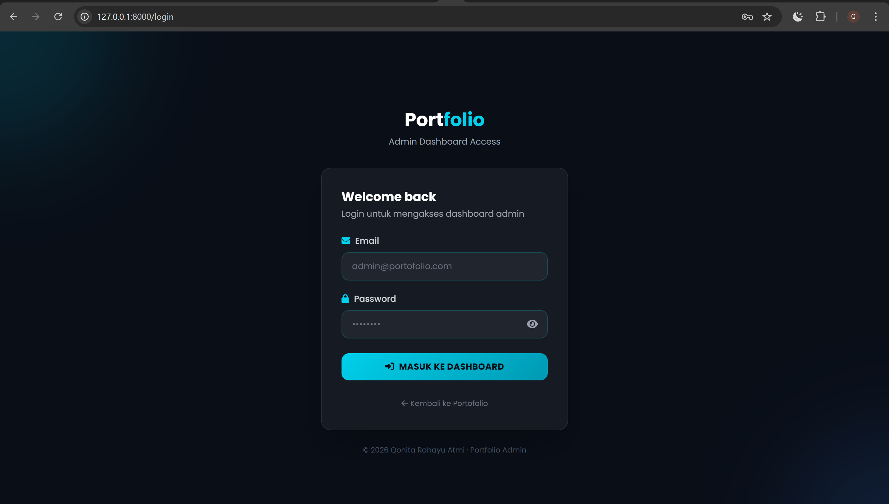
*   **Penjelasan:** 
    Sistem login merupakan gerbang utama keamanan aplikasi, menggunakan sistem autentikasi bawaan Laravel. Jika berhasil login, pengguna akan otomatis dialihkan ke halaman **Dashboard (/admin)**. Untuk proses Logout, sistem akan membersihkan session dan mengalihkan pengguna kembali ke **Landing Page (/)** demi keamanan.
*   **Kode Implementasi:**
```php
Route::post('/login', function (Request $request) {
    $credentials = $request->validate([
        'email'    => 'required|email',
        'password' => 'required',
    ]);
    if (Auth::attempt($credentials)) {
        $request->session()->regenerate();
        return redirect()->intended('/admin');
    }
    return back()->withErrors(['email' => 'Email atau password salah.'])->onlyInput('email');
});

Route::post('/logout', function (Request $request) {
    Auth::logout();
    $request->session()->invalidate();
    $request->session()->regenerateToken();
    return redirect('/');
});
```

---

### 4.2 Dashboard (Overview Stats)
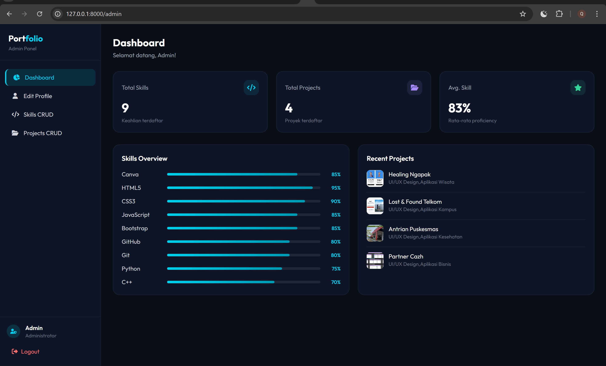
*   **Penjelasan:** 
    Tampilan utama admin yang merangkum kondisi data portfolio, memberikan informasi jumlah total keahlian dan proyek serta rata-rata tingkat kemahiran. Terdapat list proyek terbaru dan overview bar untuk setiap skill yang terdaftar.
*   **Kode Implementasi:**
```blade
<div class="grid grid-cols-1 md:grid-cols-3 gap-6 mb-8">
    <div class="card p-5">
        <div class="flex items-center justify-between mb-3">
            <span class="text-gray-400 text-sm">Total Skills</span>
            <div class="w-9 h-9 rounded-xl flex items-center justify-center bg-cyanBrand/10"><i class="fas fa-code text-cyanBrand"></i></div>
        </div>
        <p class="text-3xl font-bold text-white">{{ $skills->count() }}</p>
        <p class="text-xs text-gray-500 mt-1">Keahlian terdaftar</p>
    </div>
    <!-- Card Project Stat -->
    <div class="card p-5">
        <div class="flex items-center justify-between mb-3">
            <span class="text-gray-400 text-sm">Total Projects</span>
            <div class="w-9 h-9 rounded-xl flex items-center justify-center bg-purple-500/10"><i class="fas fa-folder-open text-purple-400"></i></div>
        </div>
        <p class="text-3xl font-bold text-white">{{ $projects->count() }}</p>
    </div>
</div>
```

---

### 4.3 Manajemen Profil (Edit Profile)
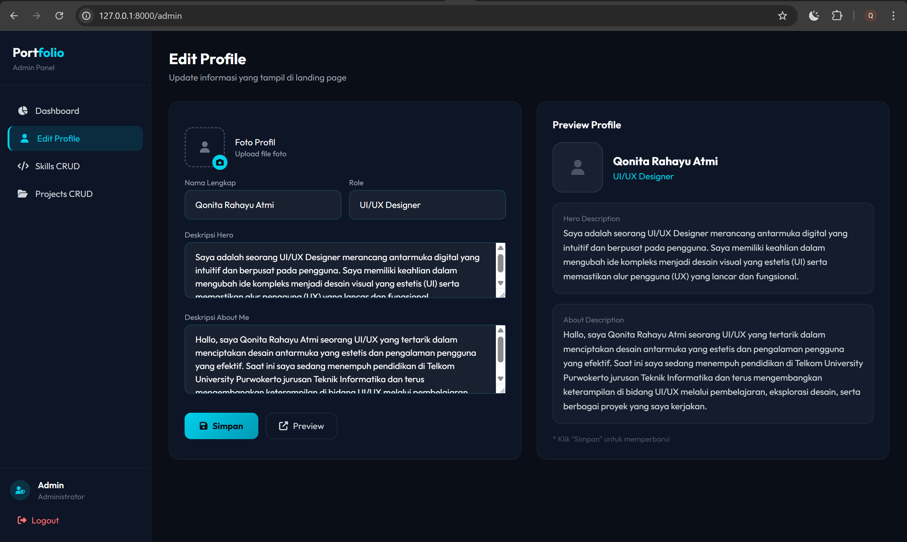
*   **Penjelasan:** 
    Modul untuk memperbarui data biodata yang tampil di Landing Page. Fitur utama di sini adalah integrasi **Live Preview**, di mana setiap perubahan teks pada form akan segera teramati pada kartu profil di sisi kanan layar secara instan.
*   **Kode Implementasi:**
```javascript
function initProfilePreview() {
    const inputs = ['name', 'role', 'hero_description'];
    inputs.forEach(field => {
        const el = document.querySelector(`[name="${field}"]`);
        if(el) {
            el.addEventListener('input', (e) => {
                const targetId = field === 'hero_description' ? 'previewDesc' : 'preview' + field.charAt(0).toUpperCase() + field.slice(1);
                const target = document.getElementById(targetId);
                if(target) target.textContent = e.target.value || '-';
            });
        }
    });

    const form = document.getElementById('profileForm');
    form.addEventListener('submit', async (e) => {
        e.preventDefault();
        const res = await fetch('/admin/profile', {
            method: 'POST',
            headers: { 'X-CSRF-TOKEN': CSRF_TOKEN },
            body: new FormData(form)
        });
        if((await res.json()).success) {
            showTopAlert('PROFIL BERHASIL DIPERBARUI');
        }
    });
}
```

---

### 4.4 Manajemen Skills (CRUD)

#### 4.4.1 Tabel Data Skill
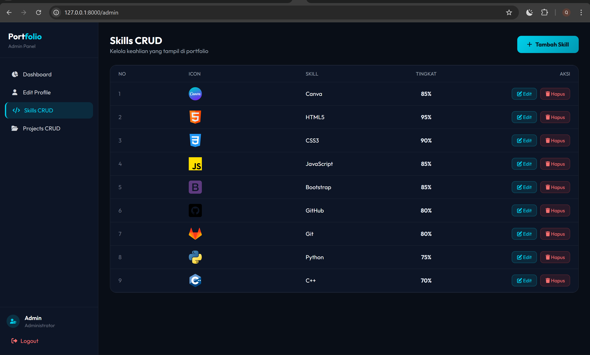
*   **Penjelasan:** 
    Tabel data skill yang tersimpan dalam database ke dalam bentuk tabel. Admin dapat melihat ikon, nama, dan tingkat setiap skill. 
*   **Kode Implementasi:**
```blade
@foreach($skills as $i => $s)
<tr class="border-b border-white/5 hover:bg-white/5 transition">
    <td class="p-4 text-gray-500 font-bold text-center">{{ $i + 1 }}</td>
    <td class="p-4 text-center">
        <div class="w-10 h-10 bg-darkBg rounded-lg flex items-center justify-center mx-auto border border-white/5">
            icon_url }}" class="w-7 h-7 object-contain">
        </div>
    </td>
    <td class="p-4 text-white text-sm font-semibold">{{ $s->name }}</td>
    <td class="p-4 text-cyanBrand font-bold text-center">{{ $s->proficiency }}%</td>
</tr>
@endforeach
```

#### 4.4.2 Create Skill (Tambah Data)
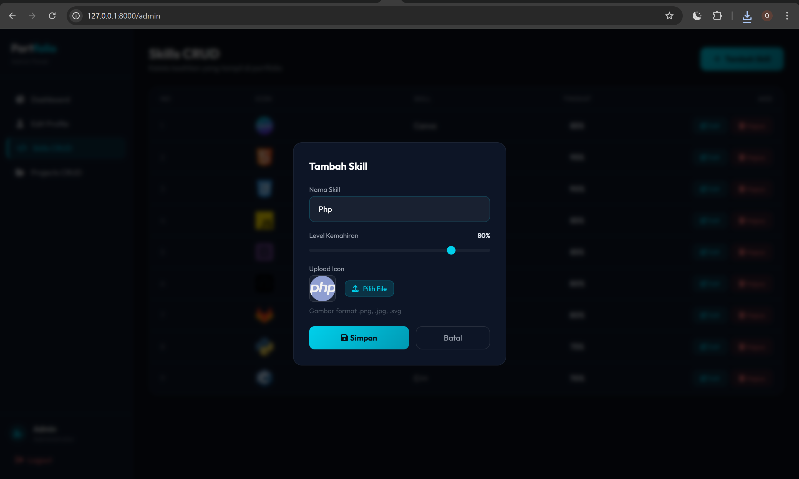
*   **Penjelasan:** 
    Tambah skill baru melalui modal popup. Admin menginputkan nama skill, memilih file ikon, dan menggeser slider tingkat kemahiran. Data dikirimkan menggunakan objek `FormData` secara asinkron.
*   **Kode Implementasi:**
```javascript
async function storeSkill() {
    const fd = new FormData(document.getElementById('skillForm'));
    try {
        const response = await fetch('/admin/skills', {
            method: 'POST',
            headers: { 'X-CSRF-TOKEN': CSRF_TOKEN },
            body: fd
        });
        const d = await response.json();
        if(d.success) {
            closeModal('skillModal');
            showSuccessBar('SKILL BERHASIL DITAMBAHKAN');
            setTimeout(() => location.reload(), 1500);
        }
    } catch(err) { console.error('Error saving skill:', err); }
}
```

#### 4.4.3 Read Data Berhasil Tambah
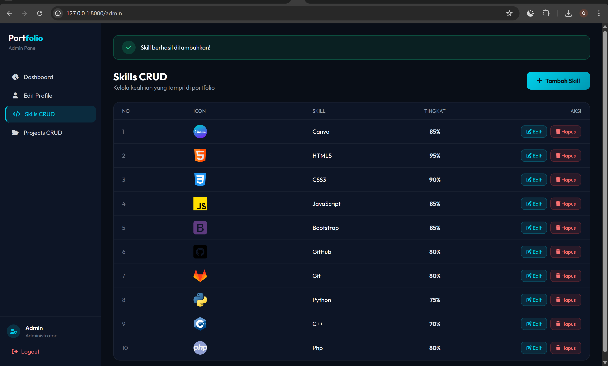
*   **Penjelasan:** 
    Verifikasi data setelah proses penambahan berhasil. Sistem memuat ulang data dari database dan menampilkannya di baris tabel Dashboad, membuktikan bahwa inputan admin telah sukses diproses dan disimpan secara permanen di database MySQL.
*   **Kode Implementasi:**
```javascript
if (data.success) {
    console.log('Skill ID Created:', data.skill.id);
    document.getElementById('alert-container').innerHTML = renderSuccessMessage('Skill Created!');
    window.scrollTo({top: 0, behavior: 'smooth'});
    setTimeout(() => location.reload(), 2000);
}
```

#### 4.4.4 Update Skill
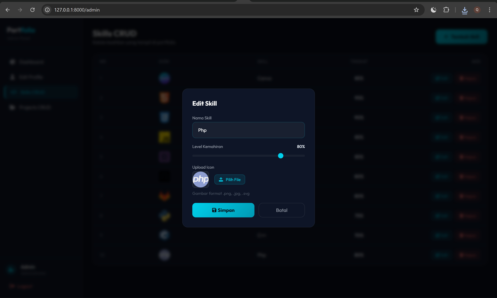
*   **Penjelasan:** 
    Update data admin dapat mengudate data yang telah ditambahkan. Gambar menunjukkan form edit skill yang sudah terisi data lama dan notifikasi sukses setelah tombol simpan ditekan. Sistem memproses pergantian ikon hanya jika ada file baru yang diunggah.
*   **Kode Implementasi:**
```php
Route::post('/admin/skills/{id}', function (Request $request, $id) {
    $skill = Skill::findOrFail($id);
    
    if ($request->hasFile('icon_file')) {
        $file = $request->file('icon_file');
        $filename = time() . '_' . $file->getClientOriginalName();
        $file->move(public_path('assets/img'), $filename);
        $skill->icon_url = '/assets/img/' . $filename;
    }

    $skill->name = $request->name;
    $skill->proficiency = $request->proficiency;
    $skill->save();
    
    return response()->json(['success' => true]);
});
```

#### 4.4.5 Read Data Berhasil Update
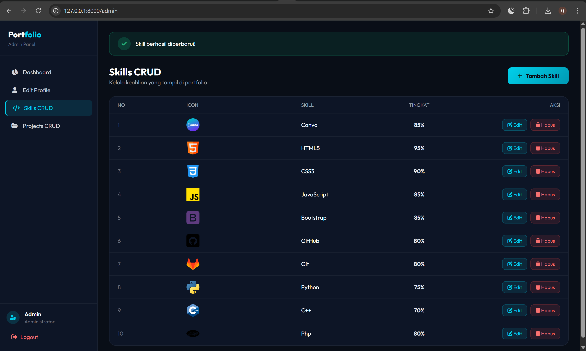
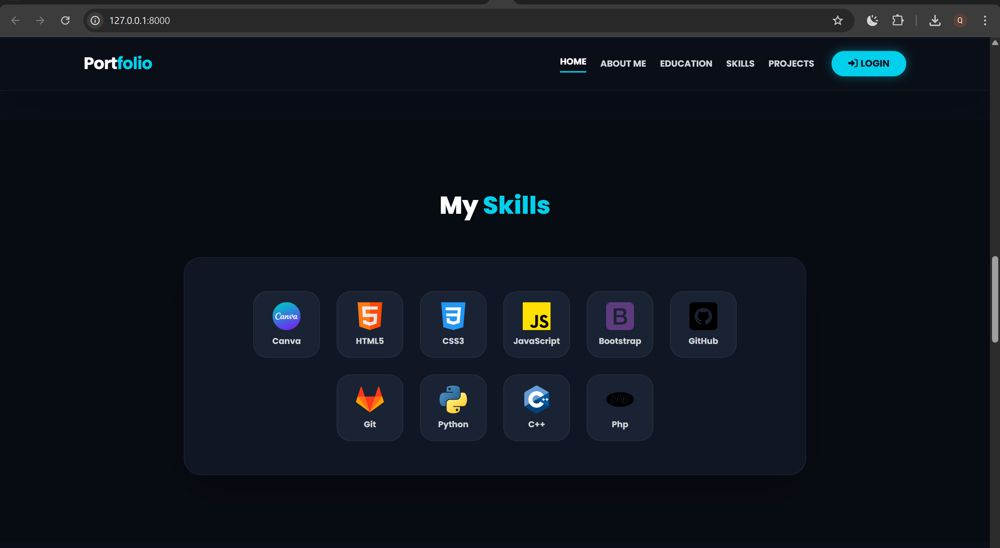
*   **Penjelasan:** 
    Menampilkan kondisi tabel setelah proses update selesai, data lama telah tergantikan oleh data baru.
*   **Kode Implementasi:**
```blade
<!-- Render Baris Skill yang telah diperbarui -->
<tr class="transition duration-500 bg-cyanBrand/5">
    <td class="p-4 text-cyanBrand font-bold text-center">UPDATED</td>
    <td class="p-4 text-center">
        icon_url }}" class="w-8 h-8 object-contain mx-auto">
    </td>
    <td class="p-4 text-white font-bold">{{ $s->name }}</td>
    <td class="p-4 text-cyanBrand font-extrabold">{{ $s->proficiency }}%</td>
</tr>
```

#### 4.4.6 Delete Skill & Berhasil
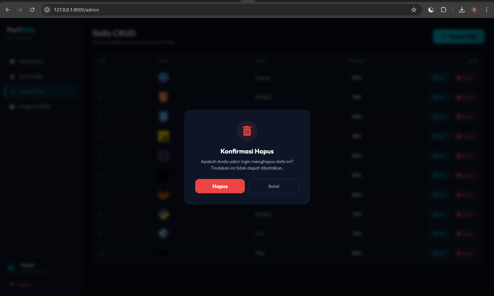
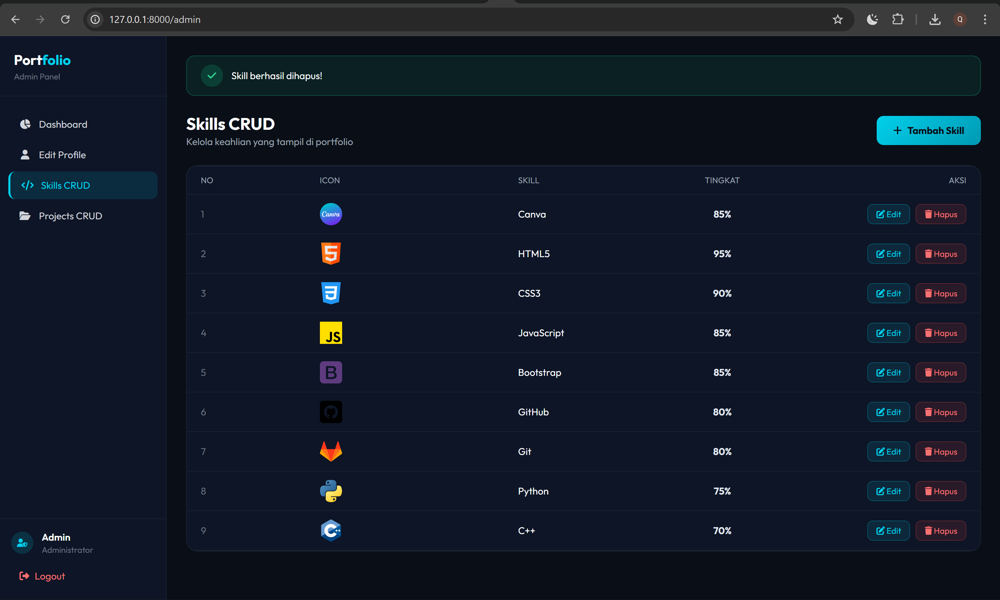
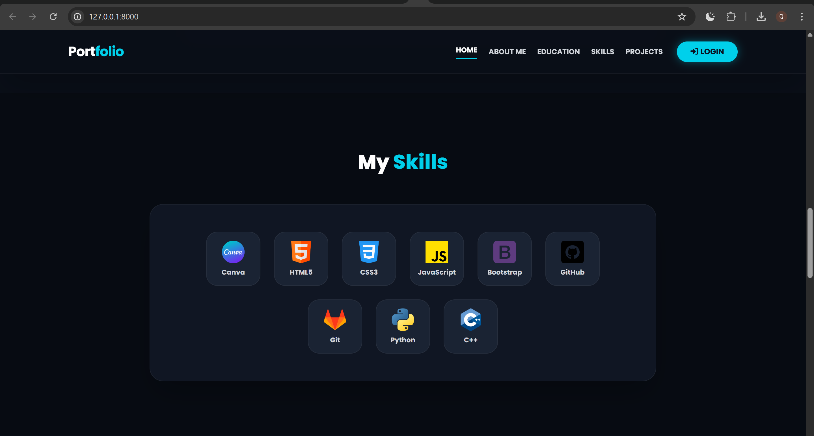
*   **Penjelasan:** 
    Hapus data skill dari sistem secara permanen dengan muncul modal konfirmasi konfirmasi berwarna merah untuk mencegah penghapusan data secara tidak sengaja oleh administrator sebelum request DELETE dikirimkan ke server.
*   **Kode Implementasi:**
```javascript
async function requestDelete(id) {
    const confirmation = await showRedModal('Apakah anda yakin ingin menghapus skill ini?');
    if(confirmation) {
        const res = await fetch(`/admin/skills/${id}`, {
            method: 'DELETE',
            headers: { 'X-CSRF-TOKEN': CSRF }
        });
        if((await res.json()).success) {
            triggerAlert('DELETED', 'Data telah dihapus dari sistem');
            location.reload();
        }
    }
}
```

---

### 4.5 Manajemen Project (CRUD)

#### 4.5.1 Tampilan Preview Card Project
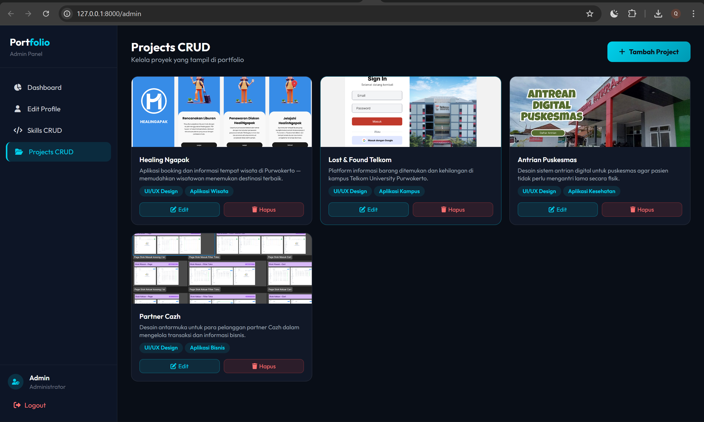
*   **Penjelasan:** 
    Bagian ini menampilkan daftar seluruh proyek yang telah diinput ke dalam sistem. Antarmuka ini menggunakan format *Card Preview* yang ringkas, di mana setiap proyek diwakili oleh gambar thumbnail kecil, judul proyek, dan daftar teknologi (*Tech Stack*).
*   **Kode Implementasi:**
```blade
@foreach($projects as $p)
<div class="flex items-center gap-4 p-3 bg-white/5 rounded-xl border border-white/5 mb-3 group hover:border-cyanBrand/30 transition">
    <div class="w-14 h-14 rounded-lg bg-gray-800 flex-shrink-0 overflow-hidden">
        image_url }}" class="w-full h-full object-cover">
    </div>
    <div class="min-w-0">
        <h4 class="text-sm font-bold text-white truncate group-hover:text-cyanBrand transition">{{ $p->title }}</h4>
        <span class="text-[10px] text-gray-500 font-mono uppercase tracking-tighter">{{ $p->tech_stack }}</span>
    </div>
</div>
@endforeach
```

#### 4.5.2 Create Project (Tambah Proyek)
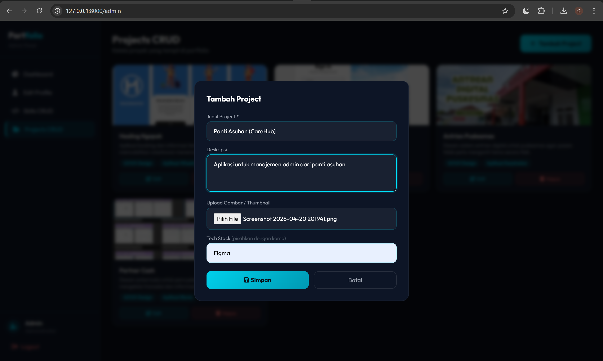
*   **Penjelasan:** 
    Tambah data untuk menginputkan proyek baru secara asinkron. Admin menginput judul, deskripsi, teknologi, dan mengunggah foto thumbnail proyek yang akan disimpan ke direktori storage publik melalui PHP.
*   **Kode Implementasi:**
```javascript
async function publishProject() {
    const form = document.getElementById('projectForm');
    const fd = new FormData(form);
    
    const response = await fetch('/admin/projects', {
        method: 'POST',
        headers: { 'X-CSRF-TOKEN': CSRF_TOKEN },
        body: fd
    });
    
    const result = await response.json();
    if(result.success) {
        showGlobalSuccess('PROJECT PUBLISHED SUCCESSFULLY');
        location.reload();
    }
}
```

#### 4.5.3 Read Data Berhasil Tambah
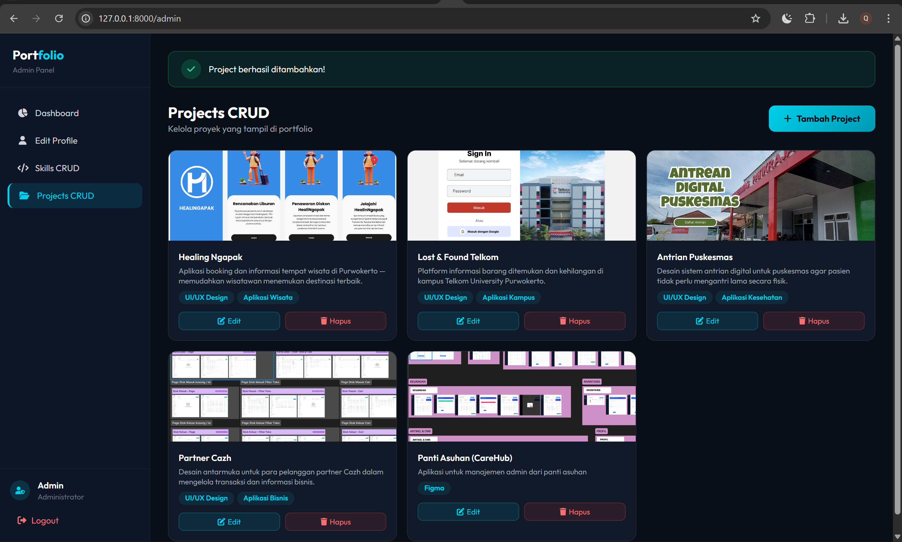
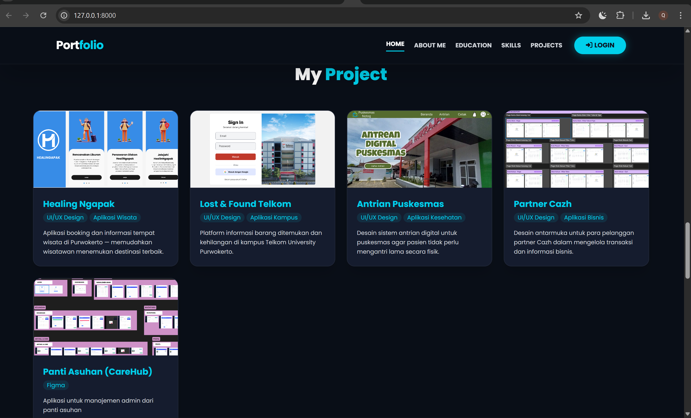
*   **Penjelasan:** 
    Verifikasi data setelah penambahan proyek baru. Gambar menunjukkan record proyek terbaru telah masuk ke dalam daftar tabel proyek di dashboard admin lengkap dengan thumbnail dan tech stack yang sesuai.
*   **Kode Implementasi:**
```blade
<!-- Bagian Dashboard untuk Verifikasi Read Project Baru -->
<div class="card p-6 border-l-4 border-cyanBrand">
    <h3 class="font-bold text-white mb-4 flex items-center gap-2">
        <i class="fas fa-clock text-cyanBrand"></i> Recently Added
    </h3>
    <div class="space-y-4">
        @forelse($projects->take(3) as $p)
            <div class="p-3 bg-cyanBrand/5 rounded-lg border border-cyanBrand/10">
                <p class="text-xs font-bold text-cyanBrand uppercase tracking-widest mb-1">New Entry</p>
                <p class="text-sm font-bold text-white">{{ $p->title }}</p>
            </div>
        @empty
            <p class="text-gray-500 text-xs">No projects.</p>
        @endforelse
    </div>
</div>
```

#### 4.5.4 Update Project
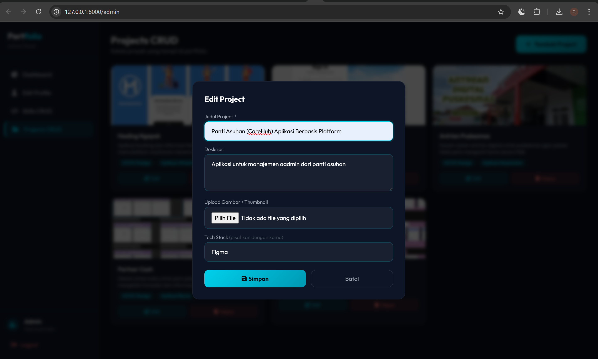
*   **Penjelasan:** 
    Update project data yang telah ditambahkan misalnya judul, deskripsi, maupun penggantian gambar utama proyek. Menggunakan metode POST dengan penanganan multipart form data untuk memastikan file gambar dapat diunggah dengan benar.
*   **Kode Implementasi:**
```php
Route::post('/admin/projects/{id}', function (Request $request, $id) {
    $project = Project::findOrFail($id);
    
    if($request->hasFile('image_file')) {
        $filename = time() . '.png';
        $request->file('image_file')->move(public_path('assets/img'), $filename);
        $project->image_url = '/assets/img/' . $filename;
    }
    
    $project->update([
        'title' => $request->title,
        'description' => $request->description,
        'tech_stack' => $request->tech_stack
    ]);
    
    return response()->json(['success' => true]);
});
```

#### 4.5.5 Read Data Berhasil Update
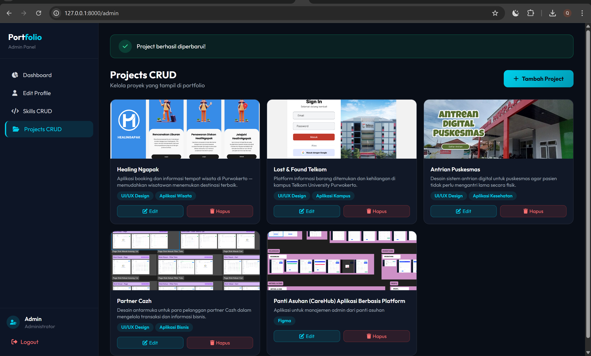

*   **Penjelasan:** 
    Menampilkan detail proyek di tabel setelah dilakukan perubahan data, integritas data dilakukan pengeditan oleh administrator dan data yang tampil di Landing Page sudah diperbarui.
*   **Kode Implementasi:**
```javascript
async function handleUpdateSuccess(projectId) {
    console.log('Verifying Update for Record: ', projectId);
    const successBar = document.getElementById('success-notif-bar');
    successBar.innerHTML = `<p class="text-white font-bold"><i class="fas fa-check-circle"></i> DATA PROJECT ${projectId} TELAH DIPERBARUI</p>`;
    successBar.classList.remove('hidden');
    
    setTimeout(() => {
        location.reload();
    }, 1500);
}
```

#### 4.5.6 Delete Project & Berhasil
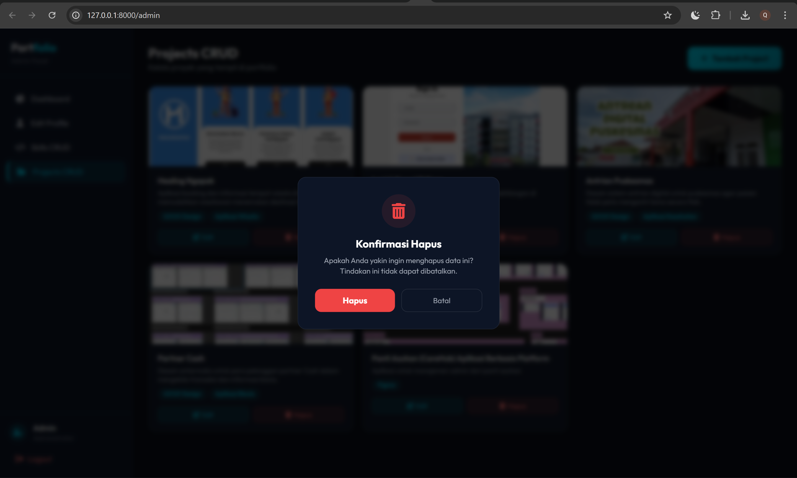
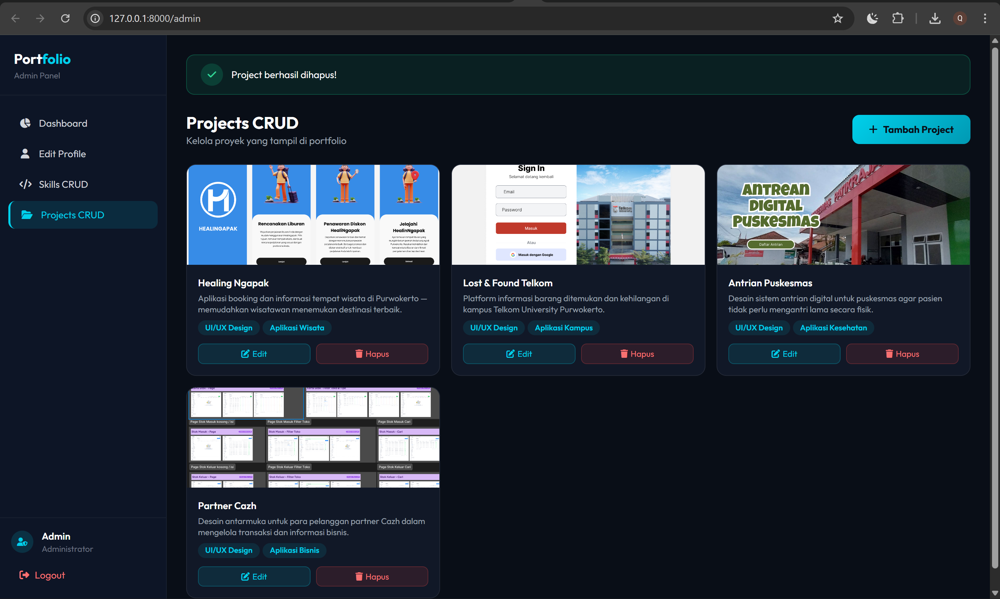
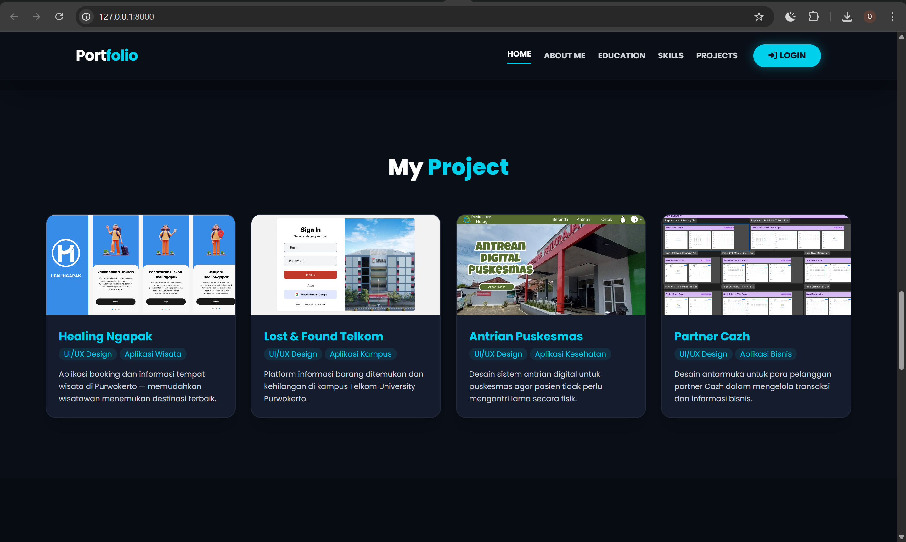
*   **Penjelasan:** 
    Hapus data lalu muncul modal konfirmasi dijawab "Hapus", sistem akan mengeksekusi penghapusan di database dan menghapus elemen visual proyek dari dashboard secara real-time.
*   **Kode Implementasi:**
```php
Route::delete('/admin/projects/{id}', function ($id) {
    try {
        $project = Project::findOrFail($id);
        
        if ($project->image_url && file_exists(public_path($project->image_url))) {
        }
        
        $project->delete(); 
        return response()->json(['success' => true]);
    } catch (\Exception $e) {
        return response()->json(['success' => false, 'message' => $e->getMessage()]);
    }
});
```

---

## 5. Implementasi Frontend (Landing Page)

### 5.1 Hero Section
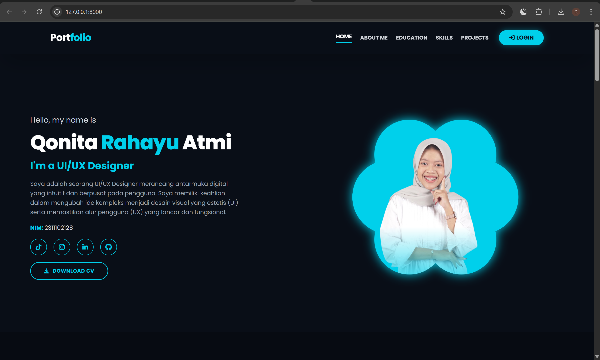
*   **Penjelasan:** 
    Bagian utama yang memperkenalkan Qonita Rahayu Atmi sebagai UI/UX Designer. Tampilan didesain menggunakan font Poppins yang modern dan warna Cyan cerah untuk menonjolkan nama. Terdapat tombol Download CV yang terhubung langsung ke file PDF profesional untuk memudahkan pengunjung mengunduh Curriculum Vitae.
*   **Kode Implementasi:**
```javascript
function renderHero(profile) {
    const heroContainer = document.getElementById('hero-container');
    heroContainer.innerHTML = `
        <div class="space-y-4 z-10">
            <p class="text-gray-300 text-lg mb-1 animate-fadeIn">Hello, my name is</p>
            <h1 class="text-4xl lg:text-5xl font-extrabold tracking-tight text-white mb-2">
                Qonita <span class="text-cyanBrand">Rahayu</span> Atmi
            </h1>
            <h2 class="text-2xl font-bold text-cyanBrand mb-6">${profile.role || "UI/UX Designer"}</h2>
            <p class="text-gray-400 text-sm leading-relaxed max-w-lg mb-8">
                ${profile.hero_description}
            </p>
            <div class="flex items-center gap-6">
                <a href="/assets/img/CV_QONITA RAHAYU ATMI_TUP.pdf" download class="btn-primary-cyan flex items-center gap-2 px-8 py-3 rounded-full font-bold transition">
                    <i class="fas fa-download"></i> DOWNLOAD CV
                </a>
            </div>
        </div>
    `;
}
```

### 5.2 About Me Section
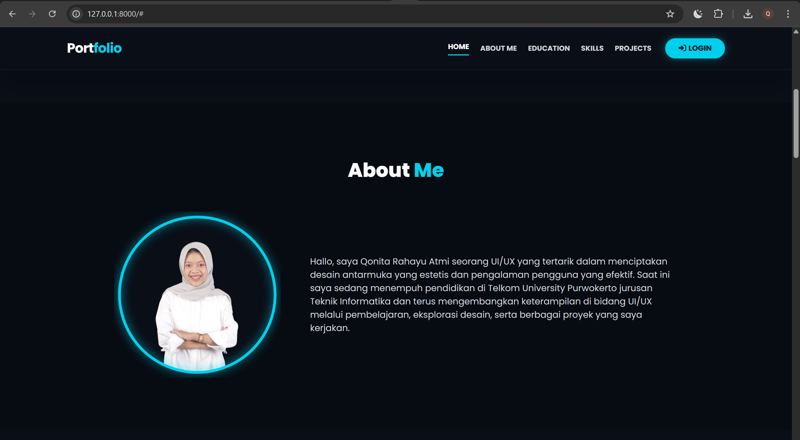
*   **Penjelasan:** 
    Bagian ini menyajikan narasi tentang profil diri secara mendalam. Data deskripsi ditarik dari database melalui API secara dinamis menggunakan fungsi `fetch`. Hal ini memungkinkan administrator memperbarui teks "About Me" melalui dashboard tanpa harus menyentuh kode program di file Blade.
*   **Kode Implementasi:**
```javascript
async function initAboutMe() {
    try {
        const response = await fetch('/api/data');
        const { profile } = await response.json();
        
        const aboutWrapper = document.getElementById('about-text-container');
        aboutWrapper.innerHTML = `
            <div class="relative">
                <div class="absolute -left-4 top-0 w-1 h-full bg-cyanBrand/20 rounded-full"></div>
                <p class="leading-relaxed text-gray-300 text-sm md:text-base selection:bg-cyanBrand selection:text-darkBg">
                    ${profile.about_description}
                </p>
            </div>
        `;
    } catch (error) {
        console.error("Failed to load about data:", error);
    }
}
```

### 5.3 My Education (Timeline)
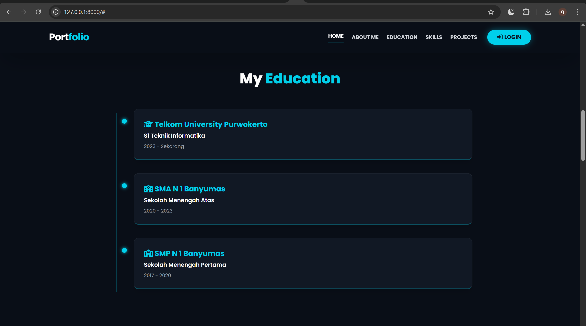
*   **Penjelasan:** 
    Menyajikan riwayat akademis dalam bentuk *Timeline* vertikal. Desain menggunakan garis pembantu vertikal (`timeline-line`) dan titik bercahaya (`timeline-dot`) pada setiap poin universitas/sekolah.
*   **Kode Implementasi:**
```blade
<!-- Struktur Timeline Education di landing.blade.php -->
<div class="max-w-4xl mx-auto relative pl-10">
    <div class="absolute left-4 top-0 bottom-0 w-0.5 bg-gradient-to-b from-cyanBrand to-transparent"></div>
    
    <!-- Item 1: Universitas -->
    <div class="relative pl-6 pb-12 group">
        <div class="absolute -left-[30px] top-1 w-5 h-5 rounded-full bg-darkBg border-4 border-cyanBrand shadow-[0_0_15px_rgba(0,208,235,0.5)] z-10 group-hover:scale-125 transition"></div>
        <div class="bg-gray-800/40 p-6 rounded-2xl border border-white/5 shadow-xl hover:bg-gray-800/60 transition duration-300">
            <h3 class="text-cyanBrand font-bold text-lg mb-1">Telkom University Purwokerto</h3>
            <h4 class="text-white font-semibold text-sm">S1 Teknik Informatika</h4>
            <div class="flex items-center gap-2 mt-3 text-xs text-gray-500 font-medium">
                <i class="far fa-calendar-alt"></i> 2023 - Sekarang
            </div>
        </div>
    </div>
</div>
```

### 5.4 My Skills (Icon Cards)
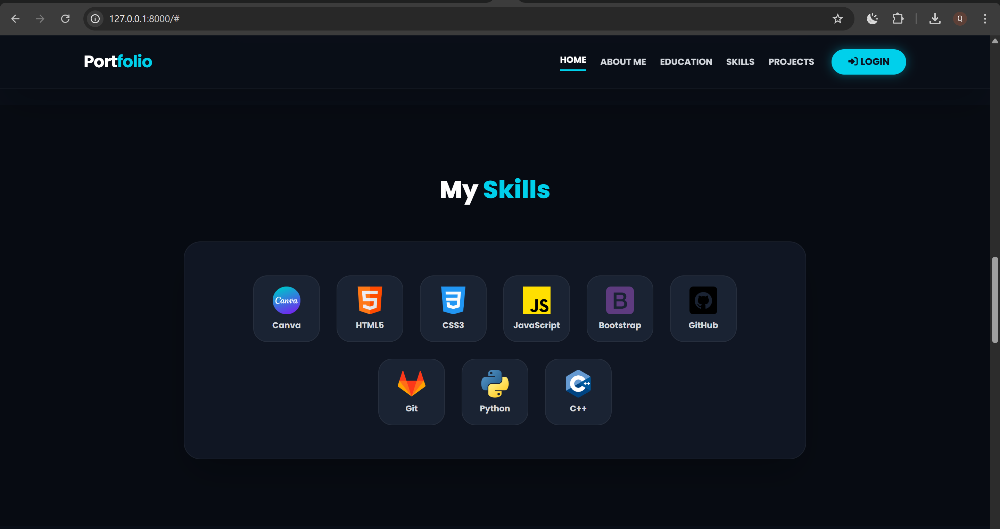
*   **Penjelasan:** 
    Menampilkan skill dengan data di-render secara dinamis menggunakan perulangan JavaScript berdasarkan data yang tersimpan di tabel `skills`.
*   **Kode Implementasi:**
```javascript
function renderSkillsGrid(skills) {
    const container = document.getElementById('skills-container');
    container.innerHTML = skills.map(skill => `
        <div class="bg-[#151c2e] p-6 rounded-2xl flex flex-col items-center justify-center border border-white/5 hover:border-cyanBrand/40 hover:-translate-y-1 transition duration-300 group">
            <div class="w-16 h-16 mb-4 flex items-center justify-center bg-gray-900/50 rounded-xl group-hover:bg-cyanBrand/10 transition">
                
            </div>
            <p class="text-xs font-bold text-gray-400 group-hover:text-white uppercase tracking-widest">${skill.name}</p>
            <div class="w-full mt-4 h-1 bg-gray-800 rounded-full overflow-hidden">
                <div class="h-full bg-gradient-to-r from-cyanBrand to-blue-500" style="width: ${skill.proficiency}%"></div>
            </div>
        </div>
    `).join('');
}
```

### 5.5 My Project (Display Grid Content)
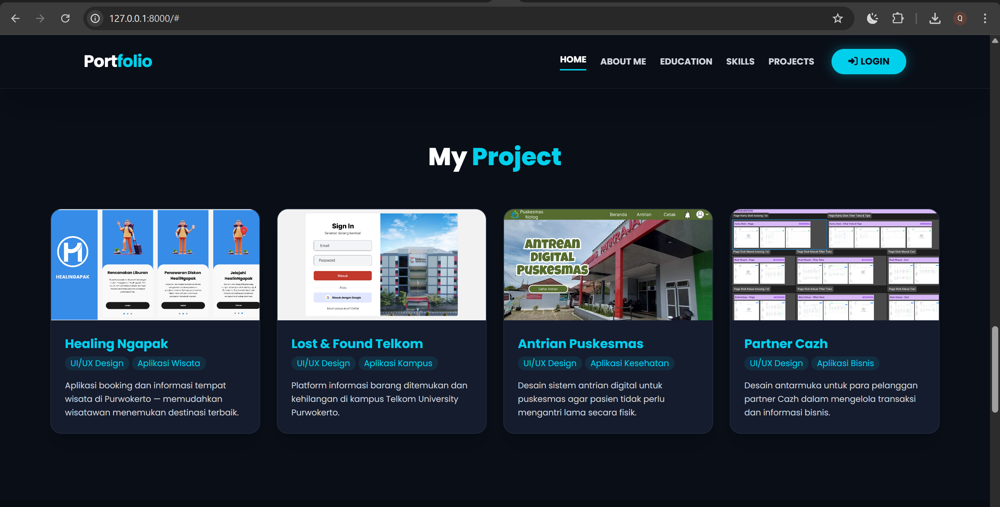
*   **Penjelasan:** 
    Project yang disusun dalam sistem *Grid* responsif. Setiap proyek ditampilkan dalam kartu (*Card*) yang mencakup gambar mini, judul, dan tech stack yang digunakan.
*   **Kode Implementasi:**
```javascript
const buildProjectCards = (projects) => {
    const grid = document.getElementById('projects-grid');
    grid.innerHTML = projects.map(proj => {
        const stackBadges = proj.tech_stack.split(',')
            .map(tag => `<span class="px-2 py-1 bg-cyanBrand/10 text-cyanBrand text-[10px] rounded-lg font-bold uppercase tracking-tight">${tag.trim()}</span>`)
            .join(' ');

        return `
            <div class="bg-cardBg rounded-3xl overflow-hidden border border-white/5 hover:shadow-2xl hover:shadow-cyanBrand/5 transition duration-500 flex flex-col group">
                <div class="h-48 overflow-hidden relative">
                    
                    <div class="absolute inset-0 bg-gradient-to-t from-darkBg to-transparent opacity-60"></div>
                </div>
                <div class="p-8 flex flex-col flex-grow">
                    <h3 class="text-white font-bold text-xl mb-3 group-hover:text-cyanBrand transition">${proj.title}</h3>
                    <div class="flex flex-wrap gap-2 mb-4">${stackBadges}</div>
                    <p class="text-gray-400 text-sm leading-relaxed line-clamp-3">${proj.description}</p>
                </div>
            </div>`;
    }).join('');
};
```

### 5.6 Daily Motivation (Advice API Fetch)
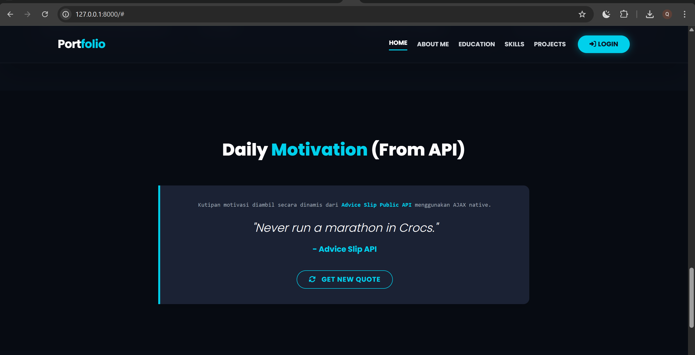
*   **Penjelasan:** 
    Fitur kutipan harian yang mengintegrasikan layanan pihak ketiga, **Advice Slip API**. Mendemonstrasikan kemampuan aplikasi dalam mengolah data eksternal secara asinkron menggunakan Fetch API.
*   **Kode Implementasi:**
```javascript
async function fetchDailyAdvice() {
    const textElement = document.getElementById('advice-text');
    const refreshBtn = document.getElementById('refresh-advice-btn');
    
    textElement.classList.add('opacity-50');
    refreshBtn.innerHTML = '<i class="fas fa-sync-alt fa-spin"></i>';

    try {
        const res = await fetch('https://api.adviceslip.com/advice');
        const { slip } = await res.json();
        
        setTimeout(() => {
            textElement.textContent = `"${slip.advice}"`;
            textElement.classList.remove('opacity-50');
            refreshBtn.innerHTML = '<i class="fas fa-sync-alt"></i> GET NEW ADVICE';
        }, 500);
    } catch (err) {
        textElement.textContent = '"Success is the ability to go from failure to failure without loss of enthusiasm."';
    }
}
```

### 5.7 Contact Me & Social Media
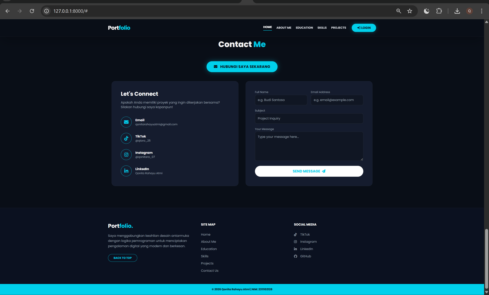
*   **Penjelasan:** 
    Bagian penutup landing page yang berisi detail kontak dan tautan media sosial profesional. Didesain dengan ikon-ikon yang responsif (Instagram, LinkedIn, dll) dan informasi email yang jelas.
*   **Kode Implementasi:**
```blade
<!-- Bagian Footer & Sosial Media di landing.blade.php -->
<div class="grid grid-cols-1 md:grid-cols-2 gap-12">
    <div class="space-y-8">
        <div class="flex items-center gap-6 group">
            <div class="w-14 h-14 rounded-2xl bg-white/5 border border-white/5 flex items-center justify-center text-cyanBrand text-2xl group-hover:bg-cyanBrand group-hover:text-darkBg transition duration-300">
                <i class="fas fa-envelope"></i>
            </div>
            <div>
                <p class="text-xs text-gray-500 font-bold uppercase tracking-widest mb-1">Send me an email</p>
                <p class="text-white font-bold text-lg">qonitarahayuatmi@gmail.com</p>
            </div>
        </div>
        
        <!-- Social Icons Grid -->
        <div class="flex gap-4 pt-4">
            <a href="#" class="w-12 h-12 bg-white/5 rounded-full flex items-center justify-center text-white hover:bg-cyanBrand hover:text-darkBg transition"><i class="fab fa-instagram"></i></a>
            <a href="#" class="w-12 h-12 bg-white/5 rounded-full flex items-center justify-center text-white hover:bg-cyanBrand hover:text-darkBg transition"><i class="fab fa-linkedin-in"></i></a>
            <a href="#" class="w-12 h-12 bg-white/5 rounded-full flex items-center justify-center text-white hover:bg-cyanBrand hover:text-darkBg transition"><i class="fab fa-tiktok"></i></a>
        </div>
    </div>
</div>
```

---
