<div align="center">
  <br />
  <h1>LAPORAN PROYEK UTS <br>APLIKASI BERBASIS PLATFORM</h1>
  <br />
  <h3>PORTOFOLIO LANDING PAGE & CRUD</h3>
  <br />
  <br />
  
  <br />
  <br />
  <br />
  <h3>Disusun Oleh :</h3>
  <p>
    <strong>HAMID SABIRIN</strong><br>
    <strong>2311102129</strong><br>
    <strong>S1 IF-11-REG01</strong>
  </p>
  <br />
  <h3>Dosen Pengampu :</h3>
  <p>
    <strong>Dimas Fanny Hebrasianto Permadi, S.ST., M.Kom</strong>
  </p>
  <br />
  <h4>Asisten Praktikum :</h4>
  <strong>Apri Pandu Wicaksono</strong> <br>
  <strong>Rangga Pradarrell Fathi</strong>
  <br />
  <h3>LABORATORIUM HIGH PERFORMANCE
 <br>FAKULTAS INFORMATIKA <br>UNIVERSITAS TELKOM PURWOKERTO <br>2026</h3>
</div>

---

## 1. Spesifikasi dan Implementasi Sistem (Kebutuhan Fungsional)

Penugasan Ujian Tengah Semester (UTS), proyek ini merupakan pengembangan **Website Portofolio Personal** yang didesain agar benar-benar dapat dimanfaatkan di dunia nyata sebagai portfolio digital (*Personal Branding*).

Adapun spesifikasi teknis dan fungsionalitas utama yang diterapkan berdasarkan instruksi ujian mencakup:

1. **Framework Utama**: Menjadikan **Laravel** sebagai pondasi *backend* utama.
2. **Kebebasan Desain Antarmuka (Styling)**: Memanfaatkan **Tailwind CSS** untuk perancangan visual halaman web (*Landing Page* & *Dashboard*) secara bebas dan elegan.
3. **Pengelolaan Konten (Admin Dashboard)**: Menyediakan *dashboard* khusus yang ditujukan bagi administrator untuk mengonfigurasi dan memberikan pengubahan konten yang tampil di halaman depan. Rincian seperti narasi diri, foto, identitas, *skills* dan jejak proyek dapat dikontrol melalui operasi CRUD di area ini.
4. **Implementasi AJAX Terpadu (Wajib)**: Seluruh tampilan data diri, perolehan *skill*, hingga pencapaian pada *landing page* sama sekali tidak menggunakan operan variabel Blade reguler (*direct rendering*). Tampilan halaman utama mutlak diisi dengan menarik data (*fetching*) yang di-supply oleh *backend endpoint* menggunakan **AJAX**.

---

## 2. Penjelasan Kode Sumber

### 2.1 Backend API untuk AJAX (Routing & Logic)

Untuk mewujudkan aturan penampilan data yang harus memanggil *request* melewati AJAX, sistem menyediakan *endpoint* khusus yang sekadar mengirim respon kembalian berupa format tipe JSON untuk dibaca oleh kode sisi *client*.

*File Referensi: `routes/web.php` (Grup API)*

```php
// Rute untuk mengekspos endpoint API AJAX bagi landing page
Route::get('/api/portfolio-data', function () {
    return response()->json([
        'portfolio' => \App\Models\Portfolio::first(),
        'skills' => \App\Models\Skill::all(),
        'projects' => \App\Models\Project::latest()->get()
    ]);
});
```

---

### 2.2 Client-Side Load AJAX (`welcome.blade.php`)

Semua *scripting* yang menyusun bagian deskripsi di halaman depan terbuat dari struktur asynchronous. Hal ini memastikan bahwa data mentah berhasil dijemput dari API *backend* Laravel barulah ditempelkan pada *Document Object Model* (DOM) yang bersangkutan.

*File Referensi: `resources/views/welcome.blade.php`*

```javascript
// Implementasi AJAX / Fetch Data secara Asynchronous
fetch('/api/portfolio-data')
    .then(response => response.json())
    .then(data => {
        // Memanipulasi teks dan gambar secara dinamis dengan data API
        const p = data.portfolio;
        document.getElementById('hero-name').innerText = p.name;
        document.getElementById('hero-subtitle').innerText = p.subtitle;
        document.getElementById('about-text').innerText = p.about_me;
        document.getElementById('about-photo').src = p.photo_url;
    })
    .catch(error => console.error("Gagal mendapatkan data: ", error));
```

---

### 2.3 Migration & Model Basis Data Portofolio

Sistem diatur agar menyuplai tiga koleksi basis data, salah satunya adalah `portfolios`. Melalui utilitas *Migration*, pendefinisian cetak biru basis data mempermudah pemindahan struktur antar *environment* pengembangan.

*Contoh Format Migration: `database/migrations/2026_04_20_040920_create_portfolios_table.php`*

```php
public function up(): void
{
    Schema::create('portfolios', function (Blueprint $table) {
        $table->id();
        $table->string('name');
        $table->string('subtitle')->nullable();
        $table->text('about_me')->nullable();
        $table->string('photo_url')->nullable(); 
        $table->string('github_url')->nullable();
        $table->timestamps();
    });
}
```

---

### 2.4 Area Khusus Admin (Middleware Otentikasi)

Agar keleluasaan fungsi *dashboard* terlindungi dari publik, rute divalidasi terhadap pengunjung menggunakan *middleware* penguat sesi log in.

*File Referensi: `routes/web.php`*

```php
// Perlindungan halaman admin dari pengguna yang belum login
Route::middleware(['auth'])->prefix('admin')->group(function () {
    Route::get('/dashboard', [DashboardController::class, 'index'])->name('dashboard');
  
    // Penerjemahan aksi resource CRUD tabel Keahlian, dan Proyek
    Route::resource('skills', SkillController::class);
    Route::resource('projects', ProjectController::class);
    Route::get('/portfolio', [PortfolioController::class, 'edit'])->name('admin.portfolio.edit');
});
```

---

### 2.5 Halaman Dashboard CRUD

Sebagai papan pengatur, *Dashboard* didesain mengakomodir dua visual matriks tabel sehingga sang admin lebih simpel dalam memonitor segala data historis perbaruan portofolio dirinya.

```html
<!-- Cuplikan Tampilan Dashboard Administrator -->
<div class="grid grid-cols-1 lg:grid-cols-2 gap-8">
    <div class="bg-white overflow-hidden shadow-sm sm:rounded-lg p-6">
        <h3 class="font-bold mb-4">Daftar Keahlian Saat Ini</h3>
        <table class="min-w-full">
            @foreach($latestSkills as $sk)
                <tr><td>{{ $sk->name }}</td></tr>
            @endforeach
        </table>
    </div>
</div>
```

---

## 3. Hasil Tampilan (Screenshots) Aplikasi

Halaman utama portofolio yang dapat diakses oleh publik. Seluruh data profil, keahlian, dan proyek yang tampil ditarik dari *backend* menggunakan *fetch API* (AJAX).

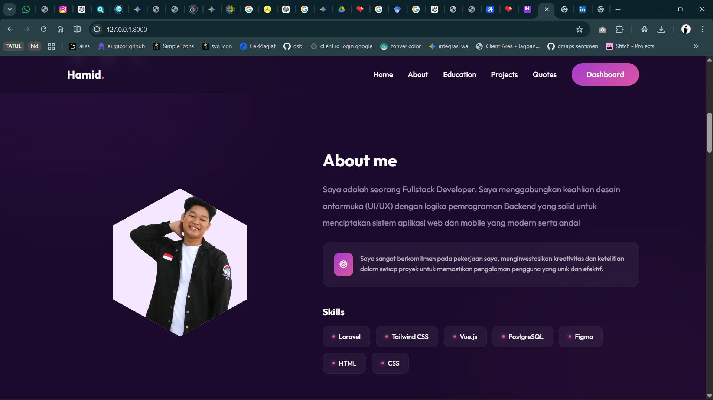
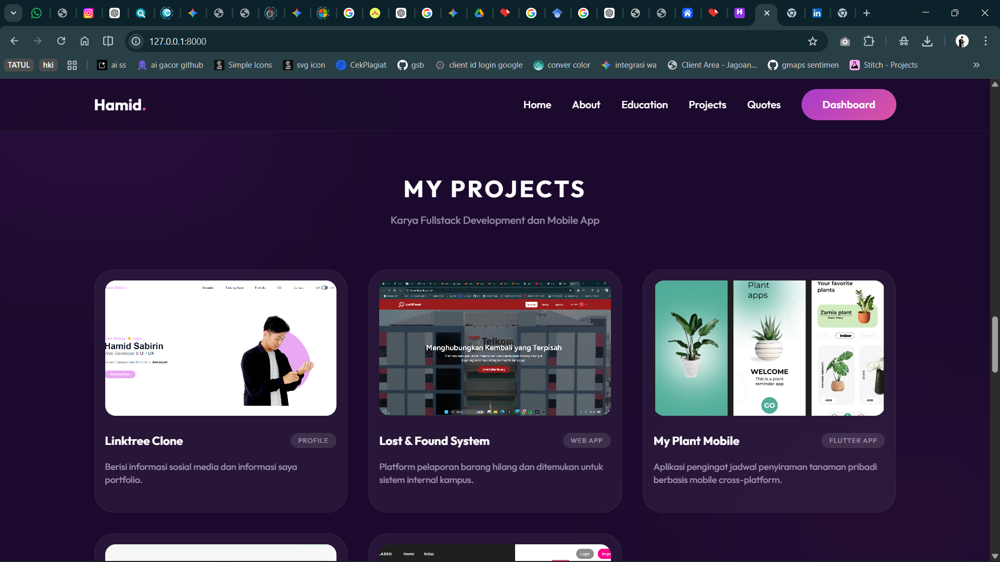

---

### 3.2 Halaman Login

Halaman autentikasi administrator. Hanya pengguna yang terdaftar pada database yang dapat masuk untuk mengakses dashboard pengelolaan data.

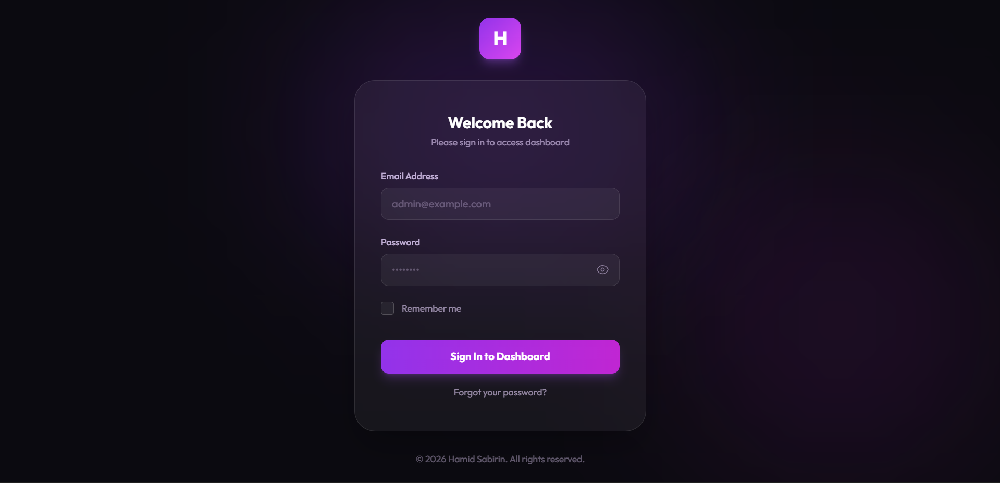

---

### 3.3 Halaman Dashboard Admin

Halaman utama administrator setelah berhasil login. Memuat tabel visual yang menampilkan 5 data keahlian dan proyek terbaru untuk mempermudah monitoring.

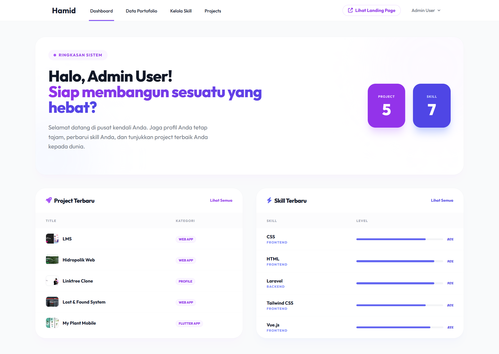

---

### 3.4 Halaman Profil

Halaman pengisian untuk mengelola dan memperbarui informasi identitas profil utama (nama, teks deskripsi, URL foto, tautan media sosial LinkedIn, GitHub, dan Instagram).

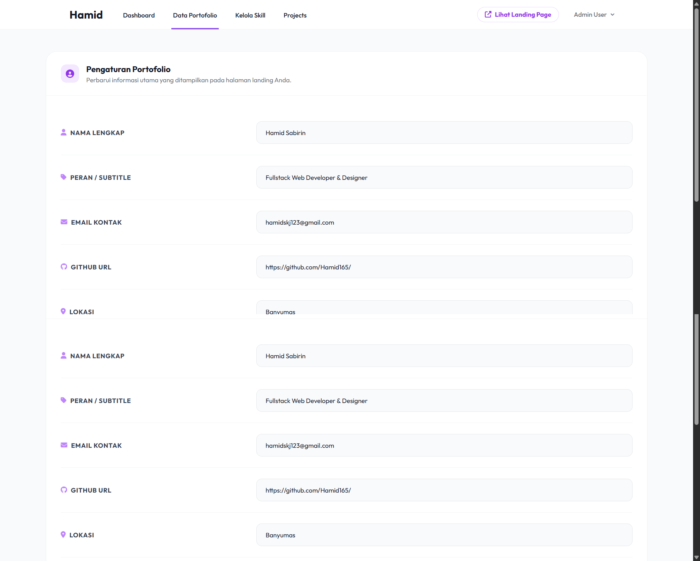

---

### 3.5 Halaman CRUD Skill

Halaman manajemen data keahlian. Melalui halaman ini, admin dapat menambah data skill baru (*Create*), memperbarui persentase skill (*Update*), serta menghapus skill yang sudah tidak relevan (*Delete*).

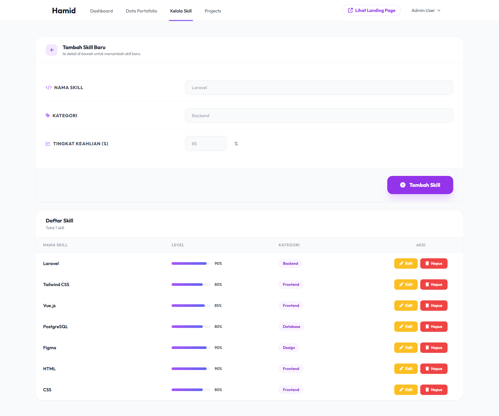
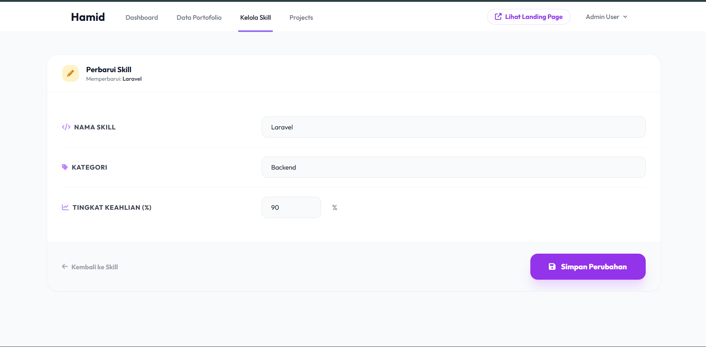
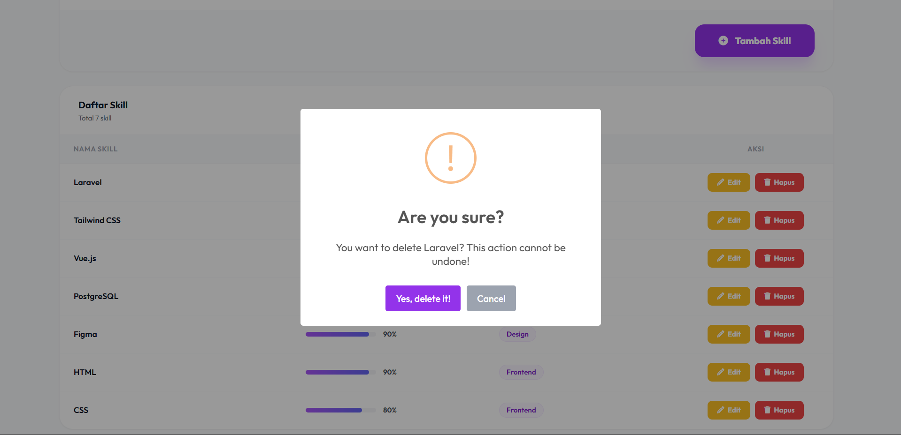

---

### 3.6 Halaman CRUD Project

Halaman tabel form untuk mengelola kumpulan portofolio proyek. Admin leluasa menambahkan gambar cuplikan proyek (*image url*), tag deskripsi, hingga judul hasil karya agar otomatis tayang di landing page.

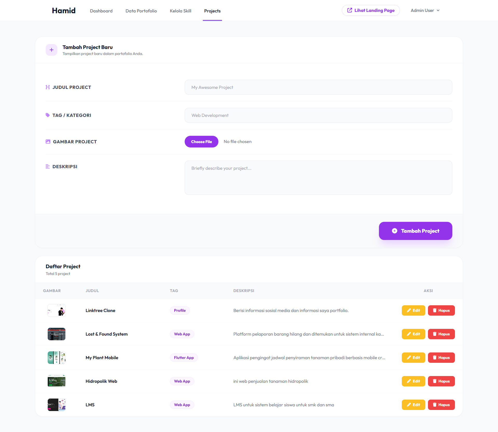
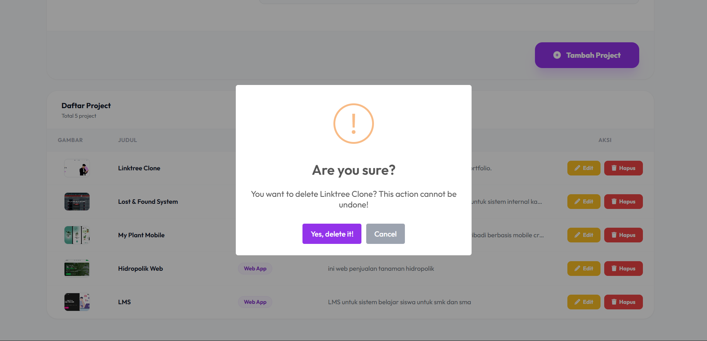
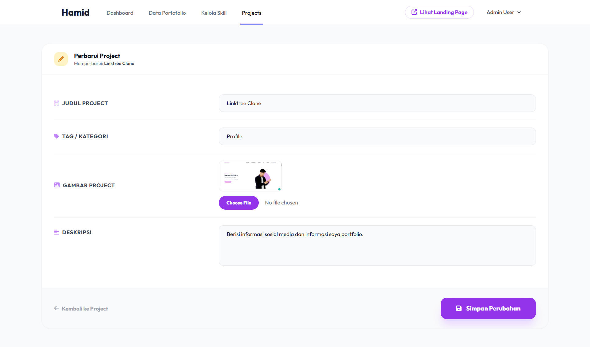

---

## 4. Kesimpulan

Tugas portofolio personal Web yang dirancang ini membuktikan diri sukses menjawab setiap detil tuntutan penugasan di masa evaluasi UTS saat ini secara kohesif. Spesifikasi pilar layaknya kerangka integrasi Laravel, pemakaian tata busana HTML melalui Tailwind CSS, proteksi kelola data spesifik dashboard kontrol admin, beserta mekanisme aliran data non konvensional AJAX (memisahkan pengaksesan data secara asinkron menepis integrasi *direct view rendering*) semua terlaksana seutuhnya. Karya akhirnya bukan sekadar protipe tugas mentah, melainkan sebuah web personal sungguhan yang mantap diakomodasi untuk kepentingan karir perorangan kedepannya.

---

## 5. Referensi

- **Laravel Documentation**: [https://laravel.com/docs](https://laravel.com/docs)
- **Tailwind CSS Styling**: [https://tailwindcss.com/docs](https://tailwindcss.com/docs)
- **Aplikasi AJAX Fetch API**: [https://developer.mozilla.org/en-US/docs/Web/API/Fetch_API](https://developer.mozilla.org/en-US/docs/Web/API/Fetch_API)
