<div align="center">
   <h2>LAPORAN PRAKTIKUM<br>APLIKASI BERBASIS PLATFORM</h2>
   <h>
   <br>
   <h4>UTS<br>PORTOFOLIO</h4>
   <br>
   
   <br><br>
 
**Disusun Oleh :**<br>
RICO ADE PRATAMA<br>
2311102138<br>
PS1IF-11-REG01
<br><br>
 
**Dosen Pengampu :**<br>
Dimas Fanny Hebrasianto Permadi, S.ST., M.Kom
<br><br>
 
**Assisten Praktikum :**<br>
Apri Pandu Wicaksono
<br>Rangga Pradarrell Fathi
<br><br>
 
PROGRAM STUDI S1 TEKNIK INFORMATIKA<br>
FAKULTAS INFORMATIKA<br>
UNIVERSITAS TELKOM PURWOKERTO<br>
2026

</div>

---

## 1. Dasar Teori

**1. Deskripsi Proyek**
Proyek ini adalah sebuah aplikasi web Portofolio Personal Dinamis. Aplikasi ini dirancang untuk menampilkan profil profesional, daftar keahlian (skills), riwayat pengalaman (experiences), dan daftar proyek (projects) milik pengguna.

Berbeda dengan portofolio statis, aplikasi ini memiliki sisi Admin Dashboard yang memungkinkan pengguna untuk mengelola data secara langsung tanpa menyentuh kode program. Sistem ini juga mengimplementasikan pemisahan antara frontend yang interaktif dan backend yang aman.

**2. Teknologi yang Digunakan**
Pembangunan aplikasi ini memanfaatkan ekosistem web modern:

- Framework Backend: Laravel (PHP) sebagai fondasi utama (Routing, Controller, Eloquent ORM).
- Database: MySQL untuk penyimpanan data relasional.
- Frontend Styling: Tailwind CSS untuk desain modern dan responsif.
- Interaktivitas: jQuery & AJAX untuk memuat data secara asinkron tanpa reload halaman.
- Keamanan: Middleware Authentication (Auth) untuk melindungi area sensitif.
- Ikon & Font: FontAwesome 6 dan Google Fonts.

## 2. Kode Program Unguided

**UTS**

pagi guys, buat agenda praktikum hari ini cuma di isi sama yang belum bimbingan aja yaa, buat kelompok yang udah bimbingan bisa gausah berangkat, trus buat uts karena sekarang minggu uts, kita ganti skema nya yaa, buat uts itu ngerjain nya hari ini dan ditutup di 23.59 jadi sehari aja tapi mengerjakan nya boleh asynchronous. buat uts nya kalian diminta membuat web portofolio dimana layaknya web portofolio pasti ada landing page buat nampilin skill dan data diri kalian, cuma ditambahin dashboard khusus admin buat ngerubah konten dari yang kalian tampilin, misal deskripsi, foto, skill, dan data lain nya bisa dirubah dari dashboard admin untuk ketentuan pertama jelas ya harus pake laravel, buat styling dibebasin boleh tailwind boleh yang lain, trus system nya wajib pake ajax otomatis data ga bisa ditampilin langsung ya, harus fetch data ke backend dulu buat ngambil informasi kalian skill dan data diri. output dari project ini diharapkan beneran dipake buat kalian, jadi buat yang serius dikit ya suki. semangat all

### Struktur Program

```php
PORTOFOLIO-RICO (Folder Utama)
├── 📁 app
│   ├── 📁 Http
│   │   └── 📁 Controllers ➔ (Otak/Logika Aplikasi)
│   │       ├── AuthController.php      (Sistem Login & Logout Admin)
│   │       ├── PortfolioController.php (CRUD Data & API JSON Portfolio)
│   │       └── Controller.php          (Base controller bawaan)
│   └── 📁 Models ➔ (Penghubung ke Tabel Database)
│       ├── Profile.php                 (Data diri & Bio)
│       ├── Skill.php                   (Data keahlian teknis)
│       ├── Project.php                 (Data portofolio karya)
│       ├── Experience.php              (Data rekam jejak/pengalaman)
│       └── User.php                    (Data akun admin@rico.com)
├── 📁 database
│   ├── 📁 migrations                 ➔ (Cetak biru struktur tabel DB)
│   └── 📁 seeders                    ➔ (Pengisi data awal/dummy)
│       └── DatabaseSeeder.php          (Data awal agar web tidak kosong)
├── 📁 public ➔ (Aset yang bisa diakses publik)
│   ├── 📁 assets
│   │   └── profil.jpeg                 (Foto profil utama kamu)
│   └── 📁 storage                  ➔ (Link ke foto yang diupload via Admin)
├── 📁 resources
│   └── 📁 views                     ➔ (Tampilan UI/UX - Blade Engine)
│       ├── 📁 admin
│       │   └── dashboard.blade.php     (Panel CRUD lengkap)
│       ├── 📁 auth
│       │   └── login.blade.php         (Halaman login admin)
│       └── welcome.blade.php           (Halaman depan & Integrasi API GitHub)
├── 📁 routes
│   └── web.php                     ➔ (Daftar alamat/URL website)
└── .env                            ➔ (Konfigurasi Database & API Key)
```

### Kode AuthController.php (Folder app/Http)

```php
<?php

namespace App\Http\Controllers;

use Illuminate\Http\Request;
use Illuminate\Support\Facades\Auth;

class AuthController extends Controller
{
    public function loginPage() {
        return view('auth.login');
    }

    public function login(Request $request) {
        $credentials = $request->validate([
            'email' => 'required|email',
            'password' => 'required'
        ]);

        if (Auth::attempt($credentials)) {
            $request->session()->regenerate();
            return redirect()->intended('admin/dashboard');
        }

        return back()->with('error', 'Email atau password salah!');
    }

    public function logout(Request $request) {
        Auth::logout();

        $request->session()->invalidate();
        $request->session()->regenerateToken();

        return redirect('/')->with('success', 'Anda telah berhasil logout.');
    }
}
```

### Kode PortfolioController.php (Folder app/Http)

```php
<?php

namespace App\Http\Controllers;

use Illuminate\Http\Request;
use App\Models\Profile;
use App\Models\Skill;
use App\Models\Project;
use App\Models\Experience;
use Illuminate\Support\Facades\Storage;

class PortfolioController extends Controller
{
    public function index() { return view('welcome'); }

    public function getApiData() {
        return response()->json([
            'success' => true,
            'profile' => Profile::first(),
            'skills'  => Skill::all(),
            'projects' => Project::orderBy('created_at', 'desc')->get(),
            'experiences' => Experience::orderBy('tahun', 'desc')->get()
        ]);
    }

    public function adminDashboard() {
        $profile = Profile::first() ?? Profile::create([
            'nama' => 'User Baru',
            'email' => 'admin@email.com',
            'deskripsi' => 'Bio baru'
        ]);
        $skills = Skill::all();
        $projects = Project::all();
        $experiences = Experience::all();
        return view('admin.dashboard', compact('profile', 'skills', 'projects', 'experiences'));
    }

    public function updateProfile(Request $request, $id) {
        $request->validate([
            'nama' => 'required|string|max:255',
            'email' => 'required|email',
            'deskripsi' => 'required',
            'foto' => 'nullable|image|mimes:jpeg,png,jpg|max:2048',
        ]);
        $profile = Profile::findOrFail($id);
        if ($request->hasFile('foto')) {
            if ($profile->foto) Storage::delete('public/' . $profile->foto);
            $profile->foto = $request->file('foto')->store('profile_photos', 'public');
        }
        $profile->update($request->except('foto') + ['foto' => $profile->foto]);
        return redirect()->back()->with('success', 'Informasi profil berhasil diperbarui!');
    }

    // SKILL
    public function addSkill(Request $request) { Skill::create($request->all()); return redirect()->back()->with('success', 'Skill ditambah!'); }
    public function updateSkill(Request $request, $id) { Skill::findOrFail($id)->update($request->all()); return redirect()->back()->with('success', 'Skill diupdate!'); }
    public function deleteSkill($id) { Skill::findOrFail($id)->delete(); return redirect()->back()->with('success', 'Skill dihapus!'); }

    // PROJECT
    public function addProject(Request $request) { Project::create($request->all()); return redirect()->back()->with('success', 'Proyek ditambah!'); }
    public function updateProject(Request $request, $id) { Project::findOrFail($id)->update($request->all()); return redirect()->back()->with('success', 'Proyek diupdate!'); }
    public function deleteProject($id) { Project::findOrFail($id)->delete(); return redirect()->back()->with('success', 'Proyek dihapus!'); }

    // EXPERIENCE
    public function addExperience(Request $request) { Experience::create($request->all()); return redirect()->back()->with('success', 'Pengalaman ditambah!'); }
    public function updateExperience(Request $request, $id)
        {
            $request->validate([
                'perusahaan' => 'required',
                'posisi'     => 'required',
                'tahun'      => 'required',
            ]);

            $exp = Experience::findOrFail($id);
            $exp->update($request->all());

            return redirect()->back()->with('success', 'Pengalaman berhasil diperbarui!');
        }
    public function deleteExperience($id) { Experience::findOrFail($id)->delete(); return redirect()->back()->with('success', 'Pengalaman dihapus!'); }
}
```

### Kode Experience.php (Folder app/Models)

```php
<?php

namespace App\Models;

use Illuminate\Database\Eloquent\Model;

class Experience extends Model
{
    protected $fillable = ['perusahaan', 'posisi', 'tahun'];
}

```

### Kode Profile.php (Folder app/Models)

```php
<?php

namespace App\Models;

use Illuminate\Database\Eloquent\Model;

class Profile extends Model
{
    protected $fillable = ['nama', 'email', 'deskripsi', 'foto', 'no_hp', 'alamat', 'sekolah'];
}
```

### Kode Project.php (Folder app/Models)

```php
<?php

namespace App\Models;

use Illuminate\Database\Eloquent\Model;

class Project extends Model
{
    protected $fillable = ['nama_proyek', 'link_github', 'deskripsi'];
}

```

### Kode Skill.php (Folder app/Models)

```php
<?php

namespace App\Models;

use Illuminate\Database\Eloquent\Model;

class Skill extends Model
{
    protected $fillable = ['nama_skill'];
}

```

### Kode User.php (Folder app/Models)

```php
<?php

namespace App\Models;
use Database\Factories\UserFactory;
use Illuminate\Database\Eloquent\Factories\HasFactory;
use Illuminate\Foundation\Auth\User as Authenticatable;
use Illuminate\Notifications\Notifiable;

class User extends Authenticatable
{
    use HasFactory, Notifiable;
     @var list<string>
    protected $fillable = [
        'name',
        'email',
        'password',
    ];
     @var list<string>
    protected $hidden = [
        'password',
        'remember_token',
    ];
     @return array<string, string>

    protected function casts(): array
    {
        return [
            'email_verified_at' => 'datetime',
            'password' => 'hashed',
        ];
    }
}

```

### Kode UserFactory.php (Folder database/factories)

```php
<?php

namespace Database\Factories;

use App\Models\User;
use Illuminate\Database\Eloquent\Factories\Factory;
use Illuminate\Support\Facades\Hash;
use Illuminate\Support\Str;

/**
 * @extends Factory<User>
 */
class UserFactory extends Factory
{
    /**
     * The current password being used by the factory.
     */
    protected static ?string $password;

    /**
     * Define the model's default state.
     *
     * @return array<string, mixed>
     */
    public function definition(): array
    {
        return [
            'name' => fake()->name(),
            'email' => fake()->unique()->safeEmail(),
            'email_verified_at' => now(),
            'password' => static::$password ??= Hash::make('password'),
            'remember_token' => Str::random(10),
        ];
    }

    /**
     * Indicate that the model's email address should be unverified.
     */
    public function unverified(): static
    {
        return $this->state(fn (array $attributes) => [
            'email_verified_at' => null,
        ]);
    }
}

```

### Kode dashboard.blade.php (Folder resources/views/admin)

```php
<!DOCTYPE html>
<html lang="en">
<head>
    <meta charset="UTF-8">
    <meta name="viewport" content="width=device-width, initial-scale=1.0">
    <title>Admin Dashboard | Portfolio</title>
    <script src="https://cdn.tailwindcss.com"></script>
    <link rel="stylesheet" href="https://cdnjs.cloudflare.com/ajax/libs/font-awesome/6.4.2/css/all.min.css" />
    <style>
        body { background-color: #0f172a; color: #f8fafc; scroll-behavior: smooth; }
        .glass-card { background: rgba(30, 41, 59, 0.7); border: 1px solid rgba(255,255,255,0.1); backdrop-filter: blur(10px); }
        input, textarea { background: #1e293b !important; border: 1px solid #334155 !important; color: white !important; transition: all 0.3s; }
        input:focus, textarea:focus { border-color: #3b82f6 !important; outline: none; box-shadow: 0 0 0 2px rgba(59, 130, 246, 0.2); }
    </style>
</head>
<body class="p-6 md:p-10">

    <div class="max-w-6xl mx-auto">
        <div class="flex justify-between items-center mb-10">
            <h1 class="text-3xl font-black text-blue-500 italic tracking-tighter">ADMIN PANEL</h1>
            <div class="flex gap-4">
                <a href="/" class="px-6 py-2 bg-slate-800 hover:bg-slate-700 rounded-full text-sm font-bold transition flex items-center">
                    <i class="fas fa-external-link-alt mr-2"></i> Lihat Portfolio
                </a>
                <form action="{{ route('logout') }}" method="POST">
                    @csrf
                    <button type="submit" class="px-6 py-2 bg-rose-600/20 hover:bg-rose-600 text-rose-500 hover:text-white rounded-full text-sm font-bold transition">
                        <i class="fas fa-sign-out-alt mr-2"></i> Logout
                    </button>
                </form>
            </div>
        </div>

        @if(session('success'))
            <div class="bg-emerald-600/20 border border-emerald-500 text-emerald-400 p-4 rounded-2xl mb-8 animate-pulse">
                <i class="fas fa-check-circle mr-2"></i> {{ session('success') }}
            </div>
        @endif

        <div class="grid grid-cols-1 lg:grid-cols-2 gap-8">

            <section class="glass-card p-8 rounded-3xl h-fit">
                <h3 class="text-xl font-bold mb-6 text-blue-400 uppercase tracking-wider"><i class="fas fa-user-edit mr-2"></i> Profile Settings</h3>
                <form action="{{ route('profile.update', $profile->id) }}" method="POST" enctype="multipart/form-data" class="space-y-4">
                    @csrf @method('PUT')

                    <div class="grid grid-cols-1 md:grid-cols-2 gap-4">
                        <div class="space-y-1">
                            <label class="text-[10px] text-slate-400 font-bold uppercase">Nama Lengkap</label>
                            <input type="text" name="nama" value="{{ $profile->nama }}" class="w-full p-3 rounded-xl outline-none" required>
                        </div>
                        <div class="space-y-1">
                            <label class="text-[10px] text-slate-400 font-bold uppercase">Email</label>
                            <input type="email" name="email" value="{{ $profile->email }}" class="w-full p-3 rounded-xl outline-none" required>
                        </div>
                    </div>

                    <div class="grid grid-cols-1 md:grid-cols-2 gap-4">
                        <div class="space-y-1">
                            <label class="text-[10px] text-slate-400 font-bold uppercase">Nomor HP</label>
                            <input type="text" name="no_hp" value="{{ $profile->no_hp }}" class="w-full p-3 rounded-xl outline-none">
                        </div>
                        <div class="space-y-1">
                            <label class="text-[10px] text-slate-400 font-bold uppercase">Sekolah / Instansi</label>
                            <input type="text" name="sekolah" value="{{ $profile->sekolah }}" class="w-full p-3 rounded-xl outline-none">
                        </div>
                    </div>

                    <div class="space-y-1">
                        <label class="text-[10px] text-slate-400 font-bold uppercase">Alamat</label>
                        <input type="text" name="alamat" value="{{ $profile->alamat }}" class="w-full p-3 rounded-xl outline-none">
                    </div>

                    <div class="space-y-1">
                        <label class="text-[10px] text-slate-400 font-bold uppercase">Bio Deskripsi</label>
                        <textarea name="deskripsi" rows="4" class="w-full p-3 rounded-xl outline-none" required>{{ $profile->deskripsi }}</textarea>
                    </div>

                    <div class="space-y-1">
                        <label class="text-[10px] text-slate-400 font-bold uppercase">Foto Profil</label>
                        <input type="file" name="foto" class="text-xs text-slate-400 block w-full file:mr-4 file:py-2 file:px-4 file:rounded-full file:border-0 file:text-xs file:font-semibold file:bg-blue-600 file:text-white hover:file:bg-blue-700 cursor-pointer">
                    </div>

                    <button class="w-full bg-blue-600 hover:bg-blue-700 py-4 rounded-xl font-bold transition shadow-lg shadow-blue-900/40 mt-4">
                        <i class="fas fa-save mr-2"></i> Update Profile
                    </button>
                </form>
            </section>

            <section class="glass-card p-8 rounded-3xl h-fit">
                <h3 class="text-xl font-bold mb-6 text-emerald-400 uppercase tracking-wider"><i class="fas fa-code mr-2"></i> Technical Skills</h3>
                <form action="{{ route('skill.add') }}" method="POST" class="flex gap-2 mb-8">
                    @csrf
                    <input type="text" name="nama_skill" class="flex-1 p-3 rounded-xl outline-none" placeholder="Contoh: Laravel, UI/UX..." required>
                    <button class="bg-emerald-600 px-6 rounded-xl font-bold hover:bg-emerald-700 transition text-white">Add</button>
                </form>

                <div class="flex flex-wrap gap-3">
                    @foreach($skills as $s)
                    <div class="bg-slate-800 border border-slate-700 pl-4 pr-2 py-2 rounded-full flex items-center gap-2 group transition hover:border-blue-500">
                        <span class="text-sm font-medium text-slate-200">{{ $s->nama_skill }}</span>
                        <div class="flex gap-1">
                            <button onclick="openEdit('skill', {{ $s->id }}, '{{ $s->nama_skill }}')" class="w-6 h-6 rounded-full flex items-center justify-center bg-blue-600/20 text-blue-400 hover:bg-blue-600 hover:text-white transition shadow-sm border border-blue-500/30">
                                <i class="fas fa-edit text-[10px]"></i>
                            </button>
                            <form action="{{ route('skill.delete', $s->id) }}" method="POST">
                                @csrf @method('DELETE')
                                <button onclick="return confirm('Hapus skill ini?')" class="w-6 h-6 rounded-full flex items-center justify-center bg-red-600/20 text-red-400 hover:bg-red-600 hover:text-white transition shadow-sm border border-red-500/30">
                                    <i class="fas fa-trash text-[10px]"></i>
                                </button>
                            </form>
                        </div>
                    </div>
                    @endforeach
                </div>
            </section>

            <section class="glass-card p-8 rounded-3xl lg:col-span-2">
                <h3 class="text-xl font-bold mb-6 text-indigo-400 uppercase tracking-wider"><i class="fas fa-project-diagram mr-2"></i> My Projects</h3>
                <form action="{{ route('project.add') }}" method="POST" class="grid grid-cols-1 md:grid-cols-3 gap-4 mb-8">
                    @csrf
                    <input type="text" name="nama_proyek" placeholder="Nama Proyek" class="p-3 rounded-xl outline-none" required>
                    <input type="text" name="link_github" placeholder="URL Github (Opsional)" class="p-3 rounded-xl outline-none">
                    <button class="bg-indigo-600 rounded-xl font-bold hover:bg-indigo-700 transition text-white">Create Project</button>
                    <textarea name="deskripsi" placeholder="Deskripsi singkat proyek..." class="md:col-span-3 p-3 rounded-xl outline-none" rows="2" required></textarea>
                </form>

                <div class="grid grid-cols-1 md:grid-cols-2 gap-4">
                    @foreach($projects as $p)
                    <div class="bg-slate-800/40 p-5 rounded-2xl border border-slate-700 flex justify-between items-center group shadow-md transition hover:border-indigo-500">
                        <div class="truncate mr-4">
                            <h4 class="font-bold text-white">{{ $p->nama_proyek }}</h4>
                            <p class="text-xs text-slate-500 truncate italic">{{ $p->link_github ?? 'No link' }}</p>
                        </div>
                        <div class="flex gap-2 shrink-0">
                            <button onclick="openEdit('project', {{ $p->id }}, '{{ $p->nama_proyek }}', '{{ $p->link_github }}', '{{ $p->deskripsi }}')" class="w-10 h-10 rounded-xl flex items-center justify-center bg-blue-600/20 text-blue-400 hover:bg-blue-600 hover:text-white transition border border-blue-500/30">
                                <i class="fas fa-edit"></i>
                            </button>
                            <form action="{{ route('project.delete', $p->id) }}" method="POST">
                                @csrf @method('DELETE')
                                <button onclick="return confirm('Hapus proyek ini?')" class="w-10 h-10 rounded-xl flex items-center justify-center bg-rose-600/20 text-rose-400 hover:bg-rose-600 hover:text-white transition border border-rose-500/30">
                                    <i class="fas fa-trash"></i>
                                </button>
                            </form>
                        </div>
                    </div>
                    @endforeach
                </div>
            </section>

            <section class="glass-card p-8 rounded-3xl lg:col-span-2">
                <h3 class="text-xl font-bold mb-6 text-rose-400 uppercase tracking-wider"><i class="fas fa-history mr-2"></i> Experience & Education</h3>
                <form action="{{ route('experience.add') }}" method="POST" class="grid grid-cols-1 md:grid-cols-4 gap-4 mb-8">
                    @csrf
                    <input type="text" name="perusahaan" placeholder="Institusi/Perusahaan" class="p-3 rounded-xl outline-none" required>
                    <input type="text" name="posisi" placeholder="Posisi/Jurusan" class="p-3 rounded-xl outline-none" required>
                    <input type="text" name="tahun" placeholder="Periode (e.g 2023-Now)" class="p-3 rounded-xl outline-none" required>
                    <button class="bg-rose-600 rounded-xl font-bold hover:bg-rose-700 transition text-white">Add Entry</button>
                </form>

                <div class="space-y-4">
                    @foreach($experiences as $e)
                    <div class="bg-slate-800/40 p-5 rounded-2xl border border-slate-700 flex justify-between items-center shadow-md transition hover:border-rose-500">
                        <div>
                            <p class="font-bold text-white text-lg leading-tight">{{ $e->perusahaan }}</p>
                            <p class="text-sm text-slate-400 uppercase font-bold tracking-tighter">{{ $e->posisi }} <span class="text-slate-600 mx-2">|</span> {{ $e->tahun }}</p>
                        </div>
                        <div class="flex gap-2">
                            <button onclick="openEdit('experience', {{ $e->id }}, '{{ $e->perusahaan }}', '{{ $e->posisi }}', '{{ $e->tahun }}')" class="w-10 h-10 rounded-xl flex items-center justify-center bg-blue-600/20 text-blue-400 hover:bg-blue-600 transition border border-blue-500/30">
                                <i class="fas fa-edit"></i>
                            </button>
                            <form action="{{ route('experience.delete', $e->id) }}" method="POST">
                                @csrf @method('DELETE')
                                <button onclick="return confirm('Hapus pengalaman ini?')" class="w-10 h-10 rounded-xl flex items-center justify-center bg-rose-600/20 text-rose-400 hover:bg-rose-600 transition border border-rose-500/30">
                                    <i class="fas fa-trash"></i>
                                </button>
                            </form>
                        </div>
                    </div>
                    @endforeach
                </div>
            </section>
        </div>
    </div>

    <div id="editModal" class="fixed inset-0 bg-slate-950/90 backdrop-blur-sm hidden items-center justify-center p-4 z-[100]">
        <div class="glass-card p-8 rounded-3xl w-full max-w-lg border border-blue-500/30 shadow-2xl">
            <h3 class="text-2xl font-bold mb-6 text-blue-400 flex items-center"><i class="fas fa-edit mr-3"></i> Edit Entry</h3>
            <form id="editForm" method="POST" class="space-y-4">
                @csrf @method('PUT')
                <div id="modalInputs" class="space-y-4"></div>
                <div class="flex gap-3 pt-6">
                    <button type="button" onclick="closeModal()" class="flex-1 py-3 bg-slate-700 hover:bg-slate-600 rounded-xl font-bold transition">Batal</button>
                    <button type="submit" class="flex-1 py-3 bg-blue-600 hover:bg-blue-700 rounded-xl font-bold transition shadow-lg shadow-blue-900/40 text-white text-sm uppercase">Simpan Perubahan</button>
                </div>
            </form>
        </div>
    </div>

    <script>
        function openEdit(type, id, v1, v2, v3) {
            const form = document.getElementById('editForm');
            const container = document.getElementById('modalInputs');

            // Sesuai route di controller kamu
            form.action = `/admin/${type}/update/${id}`;
            container.innerHTML = '';

            if(type === 'skill') {
                container.innerHTML = `<div class="space-y-1"><label class="text-[10px] uppercase font-bold text-slate-500">Nama Skill</label><input type="text" name="nama_skill" value="${v1}" class="w-full p-3 rounded-xl outline-none" required></div>`;
            } else if(type === 'project') {
                container.innerHTML = `
                    <div class="space-y-1"><label class="text-[10px] uppercase font-bold text-slate-500">Nama Proyek</label><input type="text" name="nama_proyek" value="${v1}" class="w-full p-3 rounded-xl outline-none" required></div>
                    <div class="space-y-1"><label class="text-[10px] uppercase font-bold text-slate-500">Link Github</label><input type="text" name="link_github" value="${v2}" class="w-full p-3 rounded-xl outline-none"></div>
                    <div class="space-y-1"><label class="text-[10px] uppercase font-bold text-slate-500">Deskripsi Proyek</label><textarea name="deskripsi" class="w-full p-3 rounded-xl outline-none" rows="4" required>${v3}</textarea></div>`;
            } else if(type === 'experience') {
                container.innerHTML = `
                    <div class="space-y-1"><label class="text-[10px] uppercase font-bold text-slate-500">Institusi</label><input type="text" name="perusahaan" value="${v1}" class="w-full p-3 rounded-xl outline-none" required></div>
                    <div class="space-y-1"><label class="text-[10px] uppercase font-bold text-slate-500">Posisi</label><input type="text" name="posisi" value="${v2}" class="w-full p-3 rounded-xl outline-none" required></div>
                    <div class="space-y-1"><label class="text-[10px] uppercase font-bold text-slate-500">Tahun</label><input type="text" name="tahun" value="${v3}" class="w-full p-3 rounded-xl outline-none" required></div>`;
            }

            document.getElementById('editModal').classList.remove('hidden');
            document.getElementById('editModal').classList.add('flex');
        }

        function closeModal() {
            document.getElementById('editModal').classList.remove('flex');
            document.getElementById('editModal').classList.add('hidden');
        }

        // Close modal when clicking outside the content
        window.onclick = function(event) {
            const modal = document.getElementById('editModal');
            if (event.target == modal) closeModal();
        }
    </script>
</body>
</html>
```

### Kode login.blade.php (Folder resources/views/auth)

```php
<!DOCTYPE html>
<html lang="en">
<head>
    <meta charset="UTF-8">
    <meta name="viewport" content="width=device-width, initial-scale=1.0">
    <title>Login Admin | Portfo.io</title>
    <script src="https://cdn.tailwindcss.com"></script>
</head>
<body class="bg-[#0f172a] min-h-screen flex items-center justify-center p-6">
    <div class="w-full max-w-md bg-[#1e293b] rounded-3xl p-8 border border-slate-700 shadow-2xl">
        <h2 class="text-3xl font-black text-blue-500 mb-2 italic tracking-tighter text-center">ADMIN_AUTH</h2>
        <p class="text-slate-400 text-center mb-8 text-sm">Silakan masuk untuk mengelola portofolio</p>

        @if(session('error'))
            <div class="bg-red-500/10 border border-red-500 text-red-500 p-3 rounded-xl mb-6 text-sm">
                {{ session('error') }}
            </div>
        @endif

        <form action="/login" method="POST" class="space-y-6">
            @csrf
            <div>
                <label class="text-xs font-bold text-slate-500 uppercase mb-2 block">Email Address</label>
                <input type="email" name="email" required class="w-full p-4 bg-[#0f172a] border border-slate-700 rounded-2xl text-white outline-none focus:border-blue-500 transition">
            </div>
            <div>
                <label class="text-xs font-bold text-slate-500 uppercase mb-2 block">Password</label>
                <input type="password" name="password" required class="w-full p-4 bg-[#0f172a] border border-slate-700 rounded-2xl text-white outline-none focus:border-blue-500 transition">
            </div>
            <button type="submit" class="w-full bg-blue-600 hover:bg-blue-700 py-4 rounded-2xl text-white font-bold transition shadow-lg shadow-blue-900/20">
                Login ke Dashboard
            </button>
        </form>
    </div>
</body>
</html>
```

### Kode Welcome.blade.php (Folder resources/views)

```php
<!DOCTYPE html>
<html lang="id">
<head>
    <meta charset="UTF-8">
    <meta name="viewport" content="width=device-width, initial-scale=1.0">
    <title>Portfolio | 2311102138</title>
    <script src="https://cdn.tailwindcss.com"></script>
    <link rel="stylesheet" href="https://cdnjs.cloudflare.com/ajax/libs/font-awesome/6.4.2/css/all.min.css">
    <link href="https://fonts.googleapis.com/css2?family=Playfair+Display:ital,wght@0,400;0,700;1,400&family=Plus+Jakarta+Sans:wght@300;400;600;700&display=swap" rel="stylesheet">

    <style>
        body {
            background-color: #0b0f19;
            color: #94a3b8;
            font-family: 'Plus Jakarta Sans', sans-serif;
            scroll-behavior: smooth;
        }
        h1, h2, h3, .font-serif-custom {
            font-family: 'Playfair Display', serif;
        }
        .text-gradient {
            background-clip: text;
            -webkit-background-clip: text;
            -webkit-text-fill-color: transparent;
            background-image: linear-gradient(to right, #06b6d4, #d946ef);
        }
        .glass-card {
            background: rgba(15, 23, 42, 0.6);
            border: 1px solid rgba(255, 255, 255, 0.05);
            backdrop-filter: blur(10px);
        }
    </style>
</head>
<body class="antialiased selection:bg-fuchsia-500 selection:text-white pb-10">

    <nav class="fixed w-full z-50 bg-[#0b0f19]/90 backdrop-blur-md border-b border-slate-800/50 py-4">
        <div class="container mx-auto px-6 max-w-[1400px] flex justify-between items-center">
            <div class="font-black text-2xl tracking-widest text-white">231110<span class="text-gradient">2138</span></div>

            <div class="hidden xl:flex space-x-6 text-sm font-bold text-slate-300">
                <a href="#about" class="hover:text-cyan-400 transition">About Me</a>
                <a href="#experience" class="hover:text-cyan-400 transition">Rekam Jejak</a>
                <a href="#skills" class="hover:text-cyan-400 transition">Keahlian</a>
                <a href="#projects" class="hover:text-cyan-400 transition">Portofolio</a>
                <a href="#github" class="hover:text-cyan-400 transition">API GitHub</a>
                <a href="#quotes" class="hover:text-cyan-400 transition">Quotes</a>
                <a href="#contact" class="hover:text-cyan-400 transition">Kontak</a>

                <a href="/admin/dashboard" class="px-5 py-1.5 ml-4 rounded-full bg-gradient-to-r from-cyan-500 to-fuchsia-500 text-white hover:scale-105 transition shadow-lg shadow-fuchsia-500/20 flex items-center">
                    <i class="fas fa-lock mr-2 text-xs"></i> Admin
                </a>
            </div>
        </div>
    </nav>

    <main class="container mx-auto px-6 max-w-6xl pt-32 pb-10 space-y-32">

        <section id="about" class="grid grid-cols-1 lg:grid-cols-2 gap-16 items-center">
            <div>
                <h1 class="text-6xl md:text-8xl font-bold text-white leading-none mb-2 tracking-tight">
                    <span id="first-name">Rico</span> <br>
                    <span class="text-5xl md:text-7xl text-slate-400 italic font-serif-custom">ade</span> <br>
                    <span id="last-name">Pratama</span>
                </h1>
                <p class="text-cyan-400 tracking-widest uppercase text-sm mb-8 mt-4 font-bold">— Back-End & UI/UX —</p>

                <div class="flex gap-4 mb-12">
                    <button class="px-8 py-3 rounded-full bg-gradient-to-r from-cyan-500 to-fuchsia-500 text-white font-semibold hover:scale-105 transition shadow-lg shadow-cyan-500/25">Download CV</button>
                    <a href="#contact" class="px-8 py-3 rounded-full border border-slate-600 text-white font-bold text-sm hover:bg-slate-800 transition flex items-center">Hubungi Saya</a>
                </div>

                <div class="flex gap-10 text-center">
                    <div class="text-left">
                        <h4 class="text-4xl font-black text-white">5+</h4>
                        <p class="text-xs text-slate-500 uppercase tracking-widest font-bold mt-1">Sertifikasi</p>
                    </div>
                    <div class="text-left">
                        <h4 class="text-4xl font-black text-white">10+</h4>
                        <p class="text-xs text-slate-500 uppercase tracking-widest font-bold mt-1">Proyek</p>
                    </div>
                </div>
            </div>

            <div class="relative">
                <div class="absolute -inset-4 bg-gradient-to-tr from-cyan-500/20 to-fuchsia-500/20 blur-2xl rounded-full"></div>
                <div class="glass-card p-8 rounded-3xl relative z-10 flex flex-col items-start">
                    
                    <p class="text-gradient font-bold text-lg mb-4 italic">— About Me</p>
                    <p id="user-desc" class="text-sm leading-relaxed text-slate-400 mb-6">
                        Mengambil data deskripsi profil...
                    </p>
                    <div class="flex flex-wrap gap-2 text-xs text-slate-300 font-medium">
                        <span class="bg-[#0f172a] px-4 py-2 rounded-md border border-slate-800 shadow-sm">Purwokerto</span>
                        <span id="user-school" class="bg-[#0f172a] px-4 py-2 rounded-md border border-slate-800 shadow-sm">Telkom University</span>
                    </div>
                </div>
            </div>
        </section>

        <section id="experience">
            <h3 class="text-center text-sm tracking-widest text-slate-500 uppercase mb-2">— Pengalaman —</h3>
            <h2 class="text-center text-4xl font-serif-custom text-white mb-12">Rekam <span class="text-gradient italic">Jejak</span></h2>
            <div id="experience-container" class="grid grid-cols-1 md:grid-cols-2 gap-6">
                </div>
        </section>

        <section id="skills">
            <h3 class="text-center text-sm tracking-widest text-slate-500 uppercase mb-2">— Kompetensi —</h3>
            <h2 class="text-center text-4xl font-serif-custom text-white mb-12">Keahlian <span class="text-gradient italic">Teknis</span></h2>
            <div id="skills-container" class="grid grid-cols-1 md:grid-cols-3 gap-6">
                </div>
        </section>

        <section id="projects">
            <h3 class="text-sm tracking-widest text-slate-500 uppercase mb-2 text-center">— Kumpulan Proyek —</h3>
            <h2 class="text-4xl font-serif-custom text-white mb-12 text-center">Portofolio <span class="text-gradient italic">Karya</span></h2>
            <div id="projects-container" class="grid grid-cols-1 md:grid-cols-2 gap-8">
                </div>
        </section>

        <section id="github">
            <h3 class="text-center text-sm tracking-widest text-slate-500 uppercase mb-2">— Live Data —</h3>
            <h2 class="text-center text-4xl font-serif-custom text-white mb-12">API <span class="text-gradient italic">GitHub</span></h2>
            <p class="text-center text-slate-500 text-sm mb-8">*Repositori di bawah ini terhubung dan diperbarui secara otomatis dari akun GitHub Anda.</p>
            <div id="github-container" class="grid grid-cols-1 md:grid-cols-3 gap-6">
                </div>
        </section>

        <section id="quotes" class="relative mt-20">
            <div class="glass-card p-10 md:p-14 rounded-3xl text-center max-w-4xl mx-auto relative overflow-hidden">
                <i class="fas fa-quote-left text-5xl text-slate-700/50 absolute top-6 left-6"></i>
                <i class="fas fa-quote-right text-5xl text-slate-700/50 absolute bottom-6 right-6"></i>

                <p id="quote-text" class="text-xl md:text-3xl font-serif-custom text-white italic mb-6 relative z-10">"Sedang memuat kutipan inspiratif..."</p>
                <p id="quote-author" class="text-cyan-400 tracking-widest uppercase text-sm font-bold">— Memuat</p>
            </div>
        </section>

        <section id="contact" class="mt-20">
            <h3 class="text-sm tracking-widest text-slate-500 uppercase mb-2 text-center">— Terhubung Bersama Saya —</h3>
            <h2 class="text-4xl font-serif-custom text-white mb-12 text-center">Mari <span class="text-gradient italic">Berkolaborasi</span></h2>

            <div class="grid grid-cols-1 lg:grid-cols-2 gap-8">
                <div class="glass-card p-8 rounded-2xl flex flex-col justify-between space-y-8">
                    <div class="space-y-6">
                        <div class="flex items-center gap-4">
                            <div class="w-12 h-12 rounded-xl bg-[#0b0f19] border border-slate-800 flex items-center justify-center text-cyan-400 shrink-0">
                                <i class="fas fa-phone"></i>
                            </div>
                            <div>
                                <p class="text-[10px] text-slate-500 font-bold tracking-widest uppercase">Telepon / WhatsApp</p>
                                <p id="contact-phone" class="text-white font-medium mt-1">Memuat...</p>
                            </div>
                        </div>
                        <div class="flex items-center gap-4">
                            <div class="w-12 h-12 rounded-xl bg-[#0b0f19] border border-slate-800 flex items-center justify-center text-cyan-400 shrink-0">
                                <i class="fas fa-envelope"></i>
                            </div>
                            <div class="truncate">
                                <p class="text-[10px] text-slate-500 font-bold tracking-widest uppercase">Email</p>
                                <p id="contact-email" class="text-white font-medium mt-1 truncate">Memuat...</p>
                            </div>
                        </div>
                        <div class="flex items-center gap-4">
                            <div class="w-12 h-12 rounded-xl bg-[#0b0f19] border border-slate-800 flex items-center justify-center text-cyan-400 shrink-0">
                                <i class="fas fa-map-marker-alt"></i>
                            </div>
                            <div>
                                <p class="text-[10px] text-slate-500 font-bold tracking-widest uppercase">Lokasi</p>
                                <p id="contact-location" class="text-white font-medium mt-1">Memuat...</p>
                            </div>
                        </div>
                        <div class="flex items-center gap-4">
                            <div class="w-12 h-12 rounded-xl bg-[#0b0f19] border border-slate-800 flex items-center justify-center text-cyan-400 shrink-0">
                                <i class="fas fa-graduation-cap"></i>
                            </div>
                            <div>
                                <p class="text-[10px] text-slate-500 font-bold tracking-widest uppercase">Institusi</p>
                                <p id="contact-institution" class="text-white font-medium mt-1">Memuat...</p>
                            </div>
                        </div>
                    </div>

                    <a href="#" id="btn-wa-chat" target="_blank" class="w-full py-4 rounded-xl border border-emerald-500/30 bg-emerald-500/10 text-emerald-400 hover:bg-emerald-500 hover:text-white transition text-center font-bold flex justify-center items-center gap-2 mt-8">
                        <i class="fab fa-whatsapp text-lg"></i> Chat via WhatsApp
                    </a>
                </div>

                <div class="glass-card p-8 rounded-2xl">
                    <form action="#" method="POST" class="space-y-6">
                        <div class="grid grid-cols-1 md:grid-cols-2 gap-6">
                            <div class="space-y-2">
                                <label class="text-[10px] text-fuchsia-400 font-bold tracking-widest uppercase">Nama Lengkap</label>
                                <input type="text" placeholder="Nama Anda" class="w-full bg-[#0b0f19] border border-slate-800 rounded-xl p-4 text-white focus:outline-none focus:border-cyan-500 transition">
                            </div>
                            <div class="space-y-2">
                                <label class="text-[10px] text-fuchsia-400 font-bold tracking-widest uppercase">Email</label>
                                <input type="email" placeholder="email@contoh.com" class="w-full bg-[#0b0f19] border border-slate-800 rounded-xl p-4 text-white focus:outline-none focus:border-cyan-500 transition">
                            </div>
                        </div>
                        <div class="space-y-2">
                            <label class="text-[10px] text-fuchsia-400 font-bold tracking-widest uppercase">Subjek</label>
                            <input type="text" placeholder="Apa yang ingin dibicarakan?" class="w-full bg-[#0b0f19] border border-slate-800 rounded-xl p-4 text-white focus:outline-none focus:border-cyan-500 transition">
                        </div>
                        <div class="space-y-2">
                            <label class="text-[10px] text-fuchsia-400 font-bold tracking-widest uppercase">Pesan</label>
                            <textarea rows="4" placeholder="Tuliskan pesan Anda..." class="w-full bg-[#0b0f19] border border-slate-800 rounded-xl p-4 text-white focus:outline-none focus:border-cyan-500 transition resize-none"></textarea>
                        </div>
                        <button type="button" class="px-8 py-4 rounded-xl bg-gradient-to-r from-cyan-500 to-fuchsia-500 text-white font-bold hover:opacity-90 transition flex items-center gap-2 shadow-lg shadow-fuchsia-500/20">
                            <i class="fas fa-paper-plane"></i> KIRIM PESAN
                        </button>
                    </form>
                </div>
            </div>
        </section>

    </main>

    <footer class="border-t border-slate-800/50 py-10 mt-10 text-center text-sm">
        <p>&copy; 2026 Rico Ade Pratama (2311102138). All rights reserved. YNWA.</p>
    </footer>

    <script src="https://code.jquery.com/jquery-3.6.0.min.js"></script>
    <script>
        $(document).ready(function() {
            // 1. AJAX Data dari Dashboard Admin (Edit Manual via DB)
            $.ajax({
                url: '/api/portfolio-data',
                type: 'GET',
                success: function(res) {
                    if(res.success) {
                        // About Me
                        $('#user-desc').text(res.profile.deskripsi);
                        $('#user-school').text(res.profile.sekolah);

                        // Kontak
                        $('#contact-phone').text(res.profile.no_hp || '-');
                        $('#contact-email').text(res.profile.email || '-');
                        $('#contact-location').text(res.profile.alamat || '-');
                        $('#contact-institution').text(res.profile.sekolah || '-');

                        if(res.profile.no_hp) {
                            // Format nomor ke link WA
                            let waNumber = res.profile.no_hp.replace(/^0/, '62');
                            $('#btn-wa-chat').attr('href', 'https://wa.me/' + waNumber);
                        }

                        // Keahlian
                        let skillHtml = '';
                        res.skills.forEach(s => {
                            skillHtml += `
                                <div class="glass-card p-6 rounded-2xl group hover:-translate-y-1 transition duration-300">
                                    <div class="text-2xl text-cyan-400 mb-4"><i class="fas fa-layer-group"></i></div>
                                    <h4 class="text-xl font-bold text-white mb-2">${s.nama_skill}</h4>
                                    <div class="h-1 w-12 bg-gradient-to-r from-cyan-500 to-fuchsia-500 rounded-full group-hover:w-full transition-all duration-500"></div>
                                </div>`;
                        });
                        $('#skills-container').html(skillHtml);

                        // Portofolio Karya
                        let projHtml = '';
                        res.projects.forEach(p => {
                            projHtml += `
                                <div class="glass-card p-8 rounded-3xl group hover:border-cyan-500/30 transition duration-300">
                                    <div class="flex justify-between items-start mb-4">
                                        <h4 class="text-2xl font-bold text-white">${p.nama_proyek}</h4>
                                        <a href="${p.link_github}" target="_blank" class="text-xs text-cyan-400 border border-cyan-400/30 px-3 py-1 rounded-full hover:bg-cyan-400/10 transition">
                                            GitHub <i class="fas fa-arrow-right ml-1"></i>
                                        </a>
                                    </div>
                                    <p class="text-slate-400 text-sm leading-relaxed">${p.deskripsi}</p>
                                </div>`;
                        });
                        $('#projects-container').html(projHtml || '<p class="text-slate-500">Belum ada karya.</p>');

                        // Rekam Jejak (Experience)
                        let expHtml = '';
                        res.experiences.forEach(e => {
                            expHtml += `
                                <div class="glass-card p-6 rounded-2xl border-l-4 border-l-fuchsia-500">
                                    <p class="text-xs text-cyan-400 font-bold tracking-widest uppercase mb-1">${e.tahun}</p>
                                    <h4 class="text-xl font-bold text-white">${e.perusahaan}</h4>
                                    <p class="text-sm text-slate-400 mt-2">${e.posisi}</p>
                                </div>`;
                        });
                        $('#experience-container').html(expHtml);
                    }
                }
            });

            // 2. AJAX API GitHub (Otomatis Fetch Repo Public kamu)
// --- AJAX API GITHUB UNTUK USER: RICOADEPRATAMA ---
$.ajax({
    url: 'https://api.github.com/users/RICOADEPRATAMA/repos?sort=updated&per_page=6',
    type: 'GET',
    success: function(repos) {
        let gitHtml = '';
        if(repos.length > 0) {
            repos.forEach(r => {
                gitHtml += `
                <div class="glass-card p-6 rounded-2xl group hover:border-cyan-500/30 transition duration-300 flex flex-col justify-between h-full">
                    <div>
                        <div class="flex justify-between items-start mb-2">
                            <h4 class="text-lg font-bold text-white truncate w-3/4">${r.name}</h4>
                            <span class="text-[10px] bg-cyan-500/10 text-cyan-400 px-2 py-0.5 rounded border border-cyan-500/20">Public</span>
                        </div>
                        <p class="text-xs text-slate-400 mb-6 line-clamp-2">${r.description || 'Project ini belum memiliki deskripsi di GitHub.'}</p>
                    </div>
                    <div class="flex justify-between items-center mt-auto">
                        <span class="text-[10px] text-slate-500 font-mono">${r.language || 'Code'}</span>
                        <a href="${r.html_url}" target="_blank" class="text-xs font-bold text-cyan-400 hover:underline flex items-center gap-1">
                            Lihat Source <i class="fas fa-external-link-alt text-[10px]"></i>
                        </a>
                    </div>
                </div>`;
            });
            $('#github-container').html(gitHtml);
        } else {
            $('#github-container').html('<p class="text-slate-500 col-span-3 text-center py-10 italic">Tidak ada repositori publik ditemukan di akun RICOADEPRATAMA.</p>');
        }
    },
    error: function() {
        $('#github-container').html('<p class="text-slate-500 col-span-3 text-center py-10 italic">Gagal terhubung ke API GitHub. Pastikan username benar dan internet aktif.</p>');
    }
});

            // 3. AJAX Untuk Quotes
            $.ajax({
                url: 'https://dummyjson.com/quotes/random',
                type: 'GET',
                success: function(data) {
                    $('#quote-text').text('"' + data.quote + '"');
                    $('#quote-author').text('— ' + data.author);
                },
                error: function() {
                    $('#quote-text').text('"Bukan tentang seberapa cepat kita mahir, tapi seberapa rajin dan konsisten kita belajar."');
                    $('#quote-author').text('— Rico Ade Pratama');
                }
            });
        });
    </script>
</body>
</html>
```

### .env

```php
DB_CONNECTION=mysql
DB_HOST=127.0.0.1
DB_PORT=3306
DB_DATABASE=db_uts_portofolio_rico
DB_USERNAME=root
DB_PASSWORD=
```

### Hasil Output + Langkah Penjelasan

1. Tampilan phpMyAdmin.
   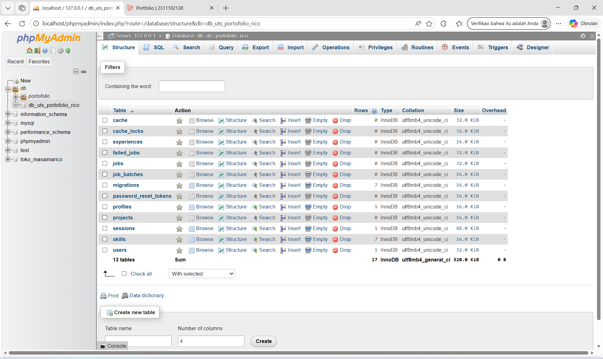

2. Tampilan Halaman Utama, About me
   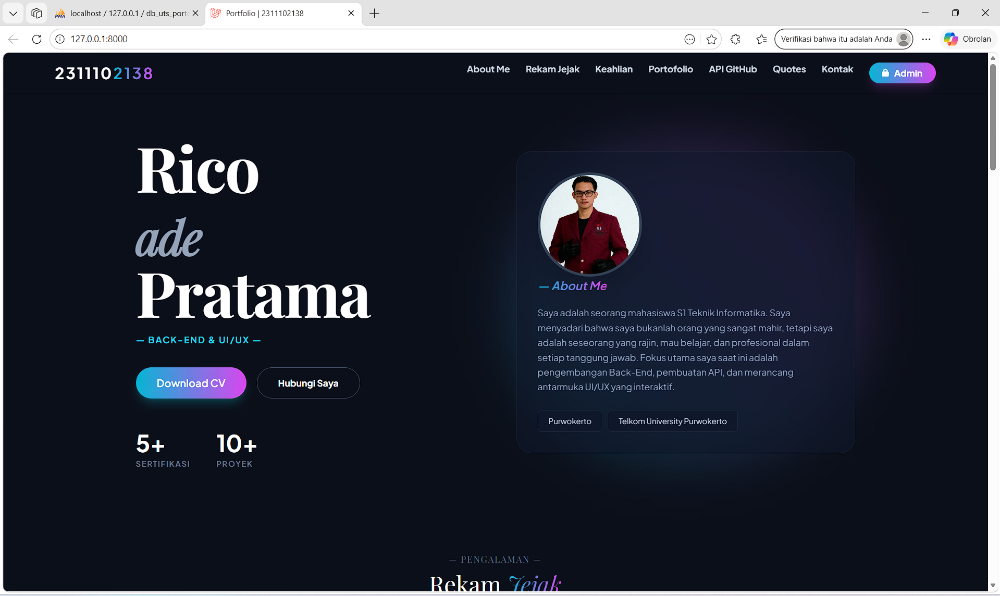

3. Halaman Pendidikan.
   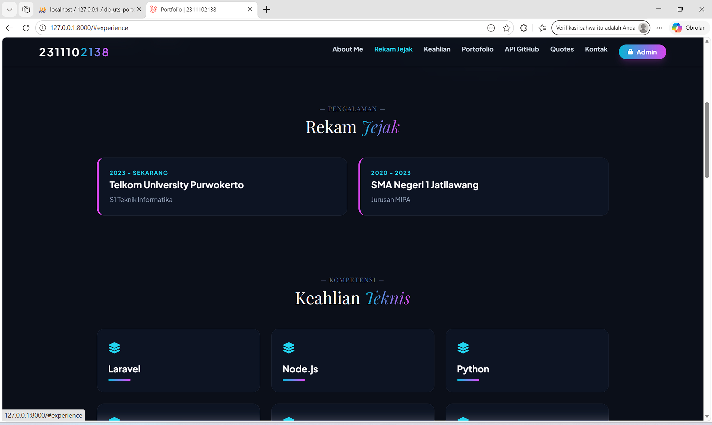

4. Halaman Keahlian.
   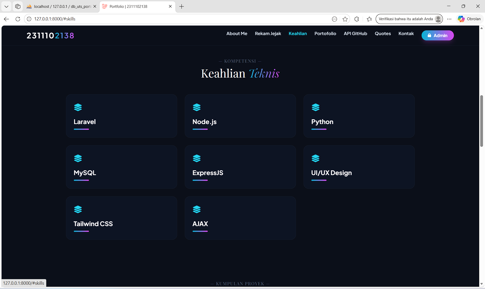

5. Halaman Portfolio.
   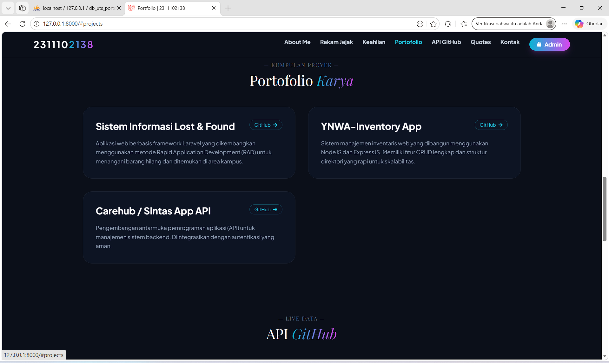

6. Halaman API Github
   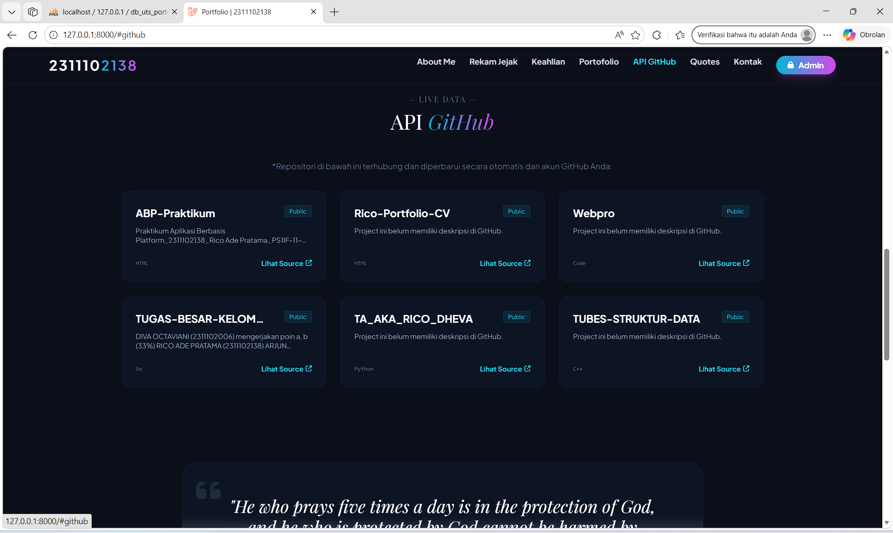

7. Tampilan Quotes by Ajax API, dan Kontak.
   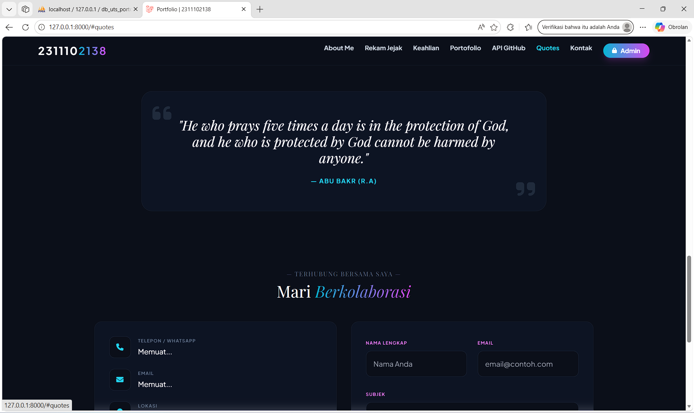

8. Halaman Login Admin Panel
   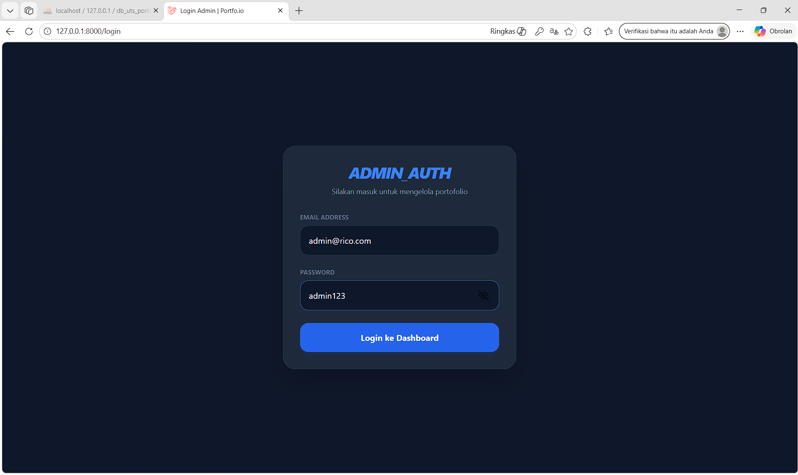

9. Halaman Dashboard Admin Panel
   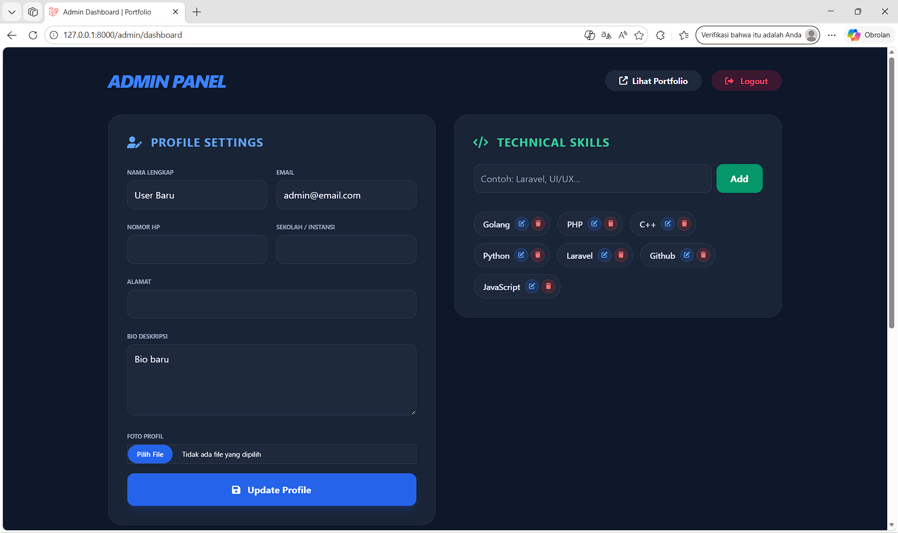

10. Setiap kolom menyesuaikan
    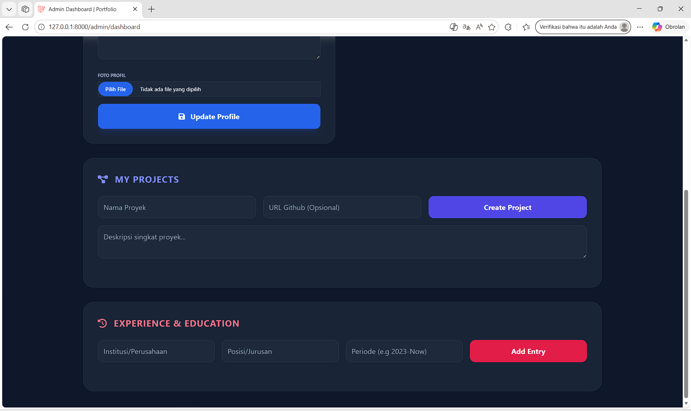

11. Misal Menambah, Edit Dan Hapus bagian Keahlian (CRUD Penting), jika muncul pop up maka berhasil.
    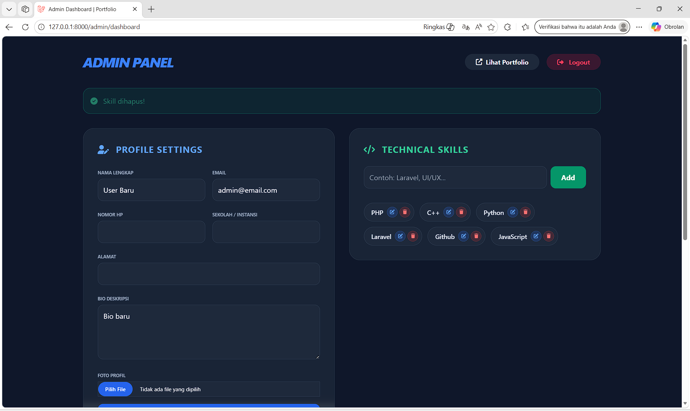

12. Jika mengecek apakah keahlian tersebut berubah.
    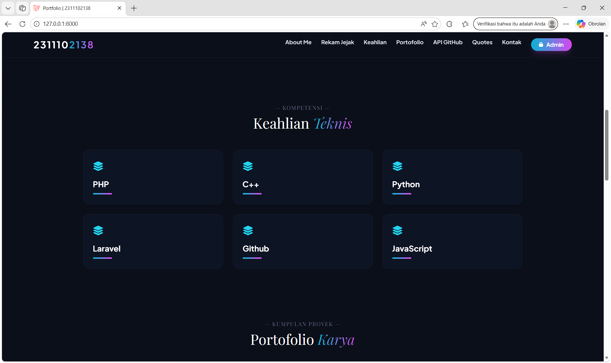

### Penjelasan Kode Per-Modul

Secara garis besar, struktur proyek Laravel ini dibangun di atas pondasi arsitektur MVC (Model-View-Controller) yang memisahkan kode berdasarkan tugasnya masing-masing agar pengembangan menjadi lebih rapi dan terukur. Jantung operasi aplikasi ini berada di dalam folder app/, di mana Controllers bertindak sebagai "otak" pengatur logika pemrograman (seperti memproses alur login pengunjung atau mengatur jalannya simpan-hapus data), dan Models berfungsi sebagai jembatan komunikasi yang menghubungkan logika tersebut dengan tabel-tabel di dalam database. Sementara itu, untuk urusan visual atau "wajah" dari website yang dilihat langsung oleh pengguna di layar peramban mereka, seluruh kodenya disimpan secara terpusat di dalam folder resources/views/.

Di luar komponen utama tersebut, proyek ini juga ditopang oleh sistem infrastruktur dan manajemen file yang sangat terorganisir. Folder routes/ bekerja layaknya peta navigasi utama yang bertugas mengarahkan setiap tautan yang diklik oleh pengunjung ke Controller yang tepat sasaran, sementara folder database/ menyimpan migrations untuk merancang struktur tabel dan seeders untuk menyuntikkan data awal secara otomatis. Terakhir, untuk urusan aset seperti gambar dan dokumen, folder public/ digunakan sebagai etalase terbuka untuk menampilkan aset statis bawaan, sedangkan folder storage/ bertindak sebagai gudang aman di balik layar untuk menyimpan file dinamis yang kamu unggah melalui panel admin.

## 3. Kesimpulan dan Penutup

UTS Praktikum ini mengimplementasikan aplikasi web portofolio dinamis berbasis arsitektur MVC (Model-View-Controller). Dengan fokus pada integrasi framework Laravel, Tailwind CSS, dan AJAX, proyek ini berhasil mengeksekusi operasi CRUD secara menyeluruh, pengelolaan database (Migration & Seeder), pengamanan akses via autentikasi login, dan penarikan data dari API pihak ketiga (GitHub). Sangat cocok direplikasi dan dikembangkan lebih lanjut sebagai standar pembelajaran praktikum bagi mahasiswa program studi Teknik Informatika untuk membangun situs web modern.

## 4. Referensi

- [1] [Materi Modul Praktikum](https://drive.google.com/drive/folders/1ug7dmm-aVF-NG9-YT5kT519HdGmkXaD-?usp=sharing)
- [2] [Laravel Documentation](https://laravel.com/)
- [3] [Eloquent ORM](https://laravel.com/docs/eloquent)
- [4] [Laravel Blade Templates](https://laravel.com/docs/blade)
- [5] [Laravel Resource Controllers](https://laravel.com/docs/controllers#resource-controllers)
