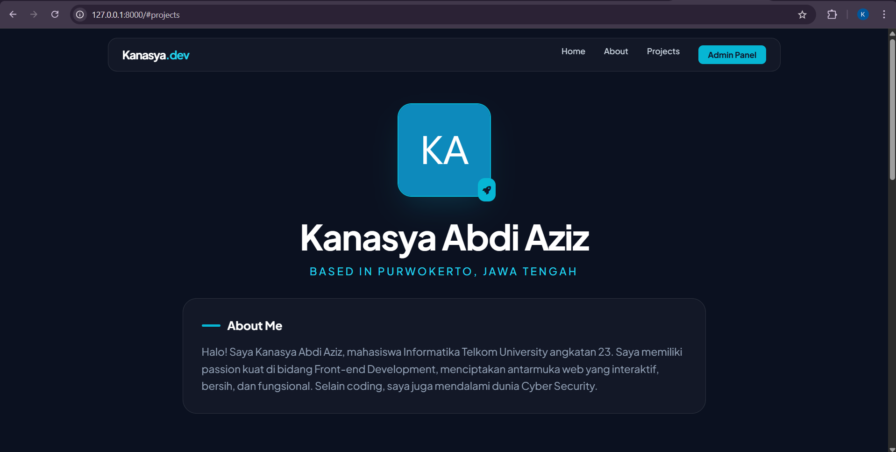
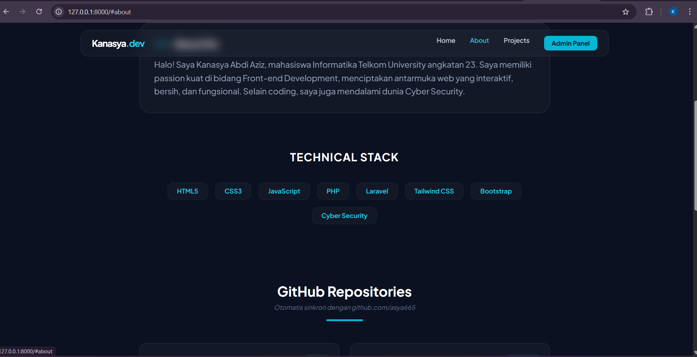
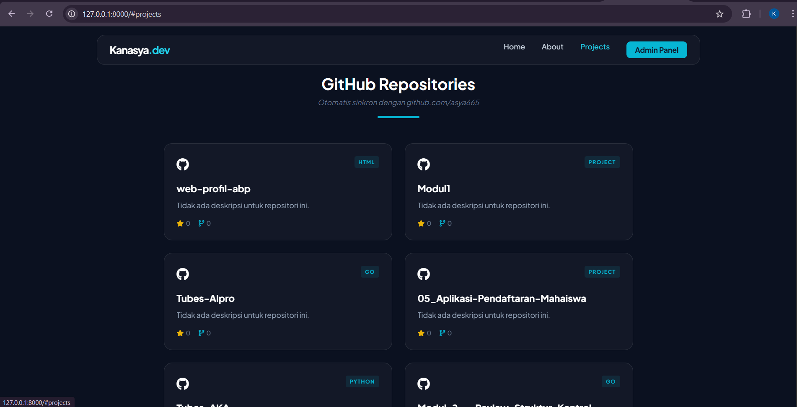
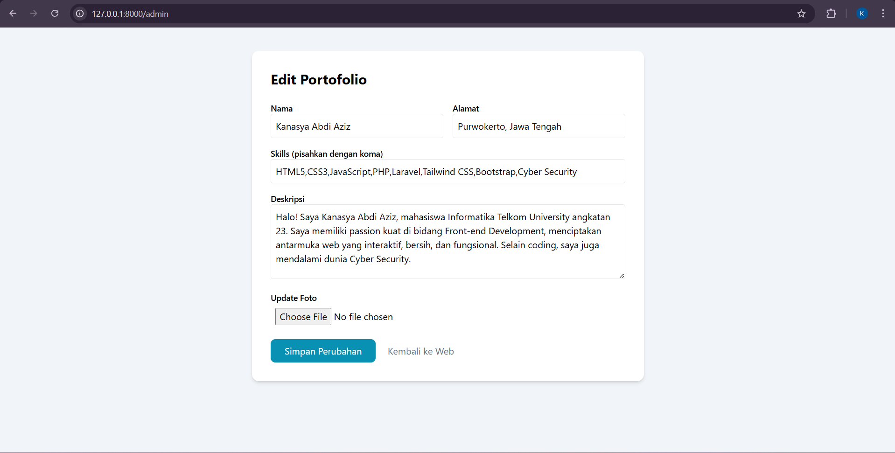
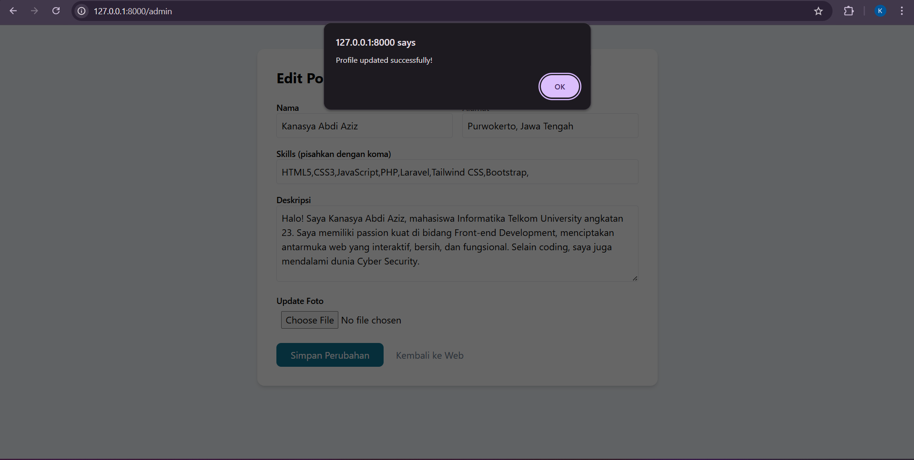

<div align="center">
  <br />
  <h1>LAPORAN PRAKTIKUM <br> APLIKASI BERBASIS PLATFORM</h1>
  <br />
  <h3>UTS <br> Web Profile </h3>
  <br />
  
  <br />
  <br />
  <br />
  <h3>Disusun Oleh :</h3>
  <p>
    <strong>Kanasya Abdi Aziz</strong><br>
    <strong>2311102140</strong><br>
    <strong>S1 IF-11-01</strong>
  </p>
  <br />
  <h3>Dosen Pengampu :</h3>
  <p>
    <strong>Dimas Fanny Hebrasianto Permadi, S.ST., M.Kom</strong>
  </p>
  <br />
  <br />
  <h4>Asisten Praktikum :</h4>
  <strong>Apri Pandu Wicaksono</strong> <br>
  <strong>Rangga Pradarrell Fathi</strong>
  <br />
  <br />
  <br />
  <br />
  <h3>LABORATORIUM HIGH PERFORMANCE <br> FAKULTAS INFORMATIKA <br> UNIVERSITAS TELKOM PURWOKERTO <br> 2026</h3>
</div>

---

## A. Dasar Teori

### 1. Laravel
Laravel adalah salah satu *framework* PHP yang digunakan untuk membangun aplikasi web secara terstruktur, efisien, dan mudah dikembangkan. Laravel employs the **MVC (Model-View-Controller)** architecture, which makes the application development process more efficient since program, tampilan, and data processing are done in accordance with its functions. In this practice, Laravel is used to create an inventory application with features like product data analysis, user authentication, and database integration.

### 2. Web Portofolio Dinamis
Berbeda dengan web statis yang isinya ditulis langsung di HTML, web portofolio dinamis menggunakan database untuk menyimpan informasi. Hal ini memungkinkan konten (seperti deskripsi diri atau daftar keahlian) diubah melalui database tanpa harus menyentuh kode program utama.

### 3. Fetch API & AJAX (Asynchronous JavaScript and XML)
AJAX adalah teknik yang digunakan untuk memperbarui sebagian halaman web tanpa harus melakukan reload secara keseluruhan. Pada proyek ini, Fetch API digunakan untuk mengambil data profil dari server Laravel dan repositori dari GitHub secara asinkron. Ini membuat website terasa lebih cepat dan seamless.

### 4. REST API
API adalah jembatan yang memungkinkan dua aplikasi saling berkomunikasi.
-Internal API: Dibuat di Laravel (/api/profile) untuk mengirimkan data dari MySQL ke halaman depan.
-External API (GitHub API): Digunakan untuk mengambil data publik dari server GitHub (seperti nama repo, bahasa pemrograman, dan jumlah star) untuk ditampilkan di website portofolio.

### 5. JSON (JavaScript Object Notation)
JSON adalah format pertukaran data yang ringan dan mudah dibaca oleh manusia maupun mesin. Data profil dan daftar skill dalam proyek ini dikirimkan dalam format JSON sebelum akhirnya diolah oleh JavaScript untuk ditampilkan dalam bentuk elemen HTML (seperti badges atau cards).

### 6. Laravel Controller & API Routing
Laravel menyediakan sistem routing khusus untuk API yang terletak di routes/api.php atau bisa juga diatur melalui routes/web.php. Controller bertugas mengambil data dari Model dan mengubahnya menjadi respon JSON menggunakan fungsi response()->json().

### 7. Middleware & Security
Meskipun data profil bersifat publik, Laravel menyediakan Middleware untuk melindungi jalur-jalur tertentu. Dalam pengembangan web modern, pemisahan antara jalur akses data (API) dan jalur tampilan (Web) merupakan standar industri untuk menjaga keamanan dan skalabilitas aplikasi.

---

## B. Penjelasan Kode

### 1. Sourcecode routes/web.php
```php
<?php

use App\Http\Controllers\ProfileController;
use Illuminate\Support\Facades\Route;

// Pastikan ini memanggil 'landing' bukan 'welcome' kalau kodenya di landing.blade.php
Route::get('/', function () { 
    return view('landing'); 
});

// Route API untuk AJAX
Route::get('/api/profile', [ProfileController::class, 'getProfile']);

// Route Admin
Route::get('/admin', [ProfileController::class, 'adminDashboard']);
Route::post('/admin/update', [ProfileController::class, 'update']);
```

### Penjelasan

Kode di atas merupakan konfigurasi alur navigasi aplikasi pada file web.php yang menggunakan framework Laravel untuk mengatur interaksi antara pengguna dan server. Pada bagian awal, terdapat rute utama yang mengarahkan pengguna ke halaman depan (landing page) melalui view('landing'), sehingga saat alamat website diakses, tampilan portofolio langsung muncul sebagai antarmuka utama. Untuk mendukung fitur dinamis tanpa muat ulang halaman, kode ini menyediakan rute API /api/profile yang terhubung dengan ProfileController melalui metode getProfile. Jalur ini berfungsi sebagai penyedia data berformat JSON yang nantinya akan ditarik oleh JavaScript menggunakan teknik AJAX untuk menampilkan informasi profil secara otomatis.

Selain mengatur tampilan publik, kode tersebut juga mendefinisikan rute untuk kebutuhan manajerial melalui jalur /admin. Rute ini menggunakan metode GET untuk menampilkan halaman dasbor admin agar pengguna dapat melihat data saat ini, serta metode POST pada jalur /admin/update yang bertugas memproses pengiriman data formulir saat admin melakukan pembaruan informasi profil. Secara keseluruhan, konfigurasi rute ini menciptakan sistem yang terintegrasi antara halaman publik yang interaktif, penyedia data berbasis API, dan panel kendali admin untuk pengelolaan konten secara terpusat.

### 2. Sourcecode ProfileController.php
```php
<?php

namespace App\Http\Controllers; // Pastikan namespace-nya benar

use App\Models\Profile;
use Illuminate\Http\Request;
use Illuminate\Support\Facades\Storage;

class ProfileController extends Controller
{
    public function getProfile() {
        $profile = Profile::first();
        return response()->json($profile);
    }

    public function adminDashboard() {
        $profile = Profile::first();
        return view('admin', compact('profile'));
    }

    public function update(Request $request) {
        $profile = Profile::first();
        $data = $request->only(['nama', 'alamat', 'email', 'instagram', 'deskripsi']);
        
        // Simpan skills sebagai JSON string
        $data['skills'] = json_encode(explode(',', $request->skills));

        if ($request->hasFile('foto')) {
            if ($profile->foto) Storage::delete('public/'.$profile->foto);
            $path = $request->file('foto')->store('uploads', 'public');
            $data['foto'] = $path;
        }

        $profile->update($data);
        return response()->json(['message' => 'Profile updated successfully!']);
    }
}
```

### Penjelasan

Kode ProfileController ini adalah inti dari logika aplikasi portofolio kamu, Nas. Berikut adalah penjelasannya dalam bentuk paragraf untuk laporan UTS kamu:

ProfileController bertugas sebagai pengendali utama yang mengelola seluruh data profil dalam aplikasi, mulai dari penyajian data untuk pengunjung hingga pengelolaan data oleh admin. Di dalamnya terdapat fungsi getProfile yang berfungsi mengambil baris pertama data dari tabel profiles melalui model Eloquent, lalu mengirimkannya kembali dalam format JSON sebagai respon untuk diproses oleh JavaScript (AJAX) di halaman depan. Selain itu, controller ini menyediakan fungsi adminDashboard yang bertugas menyiapkan antarmuka panel kendali dengan mengirimkan data profil yang ada ke dalam view admin menggunakan fungsi compact.

Fungsi paling kompleks dalam controller ini adalah update, yang menangani pembaruan informasi profil melalui permintaan (request) dari admin. Kode ini secara cerdas mengolah data keahlian (skills) yang awalnya berupa teks biasa menjadi format JSON string agar dapat disimpan dengan rapi di database. Tidak hanya itu, fungsi ini juga dilengkapi dengan logika manajemen file yang cukup baik; jika admin mengunggah foto baru, sistem akan menghapus foto lama di penyimpanan server menggunakan Storage::delete sebelum menyimpan foto baru ke dalam folder publik. Setelah seluruh proses pembaruan data selesai, controller akan memberikan respon balik berupa pesan sukses dalam format JSON sebagai konfirmasi bahwa data telah berhasil diperbarui di database.

### 3. Sourcecode Profile.php
```php
<?php

namespace App\Models;

use Illuminate\Database\Eloquent\Model;

class Profile extends Model
{
    // Tambahkan ini! Ini kunci agar data bisa masuk
    protected $fillable = ['nama', 'alamat', 'email', 'instagram', 'deskripsi', 'foto', 'skills'];
}
```

### Penjelasan

File Profile.php merupakan sebuah Model dalam arsitektur Laravel yang berfungsi sebagai representasi dari tabel profiles di dalam database MySQL. Model ini menjadi jembatan utama yang memungkinkan aplikasi berinteraksi dengan data, seperti mengambil informasi untuk ditampilkan di portofolio maupun memperbarui data melalui panel admin menggunakan fitur Eloquent ORM. Dengan menggunakan Model, kita tidak perlu lagi menulis kueri SQL manual yang rumit karena Laravel menyediakan fungsi-fungsi bawaan untuk mengelola record data secara lebih mudah dan bersih.

Salah satu bagian terpenting dalam kode ini adalah properti $fillable, yang merupakan fitur keamanan Mass Assignment Protection pada Laravel. Properti ini secara eksplisit mendefinisikan kolom-kolom mana saja, seperti nama, alamat, email, hingga skills, yang diizinkan untuk diisi datanya secara massal. Tanpa adanya deklarasi $fillable, sistem keamanan Laravel akan memblokir perintah pengisian data (seperti saat proses seeding atau pengiriman formulir update), sehingga keberadaan baris kode ini menjadi kunci utama agar data profil dapat berhasil masuk dan tersimpan dengan aman ke dalam database.

### 4. Sourcecode Migration (2026_01_04_20_131949_create_profile_table.php)
```php
<?php

use Illuminate\Database\Migrations\Migration;
use Illuminate\Database\Schema\Blueprint;
use Illuminate\Support\Facades\Schema;

return new class extends Migration
{
    public function up(): void
    {
        Schema::create('profiles', function (Blueprint $table) {
            $table->id();
            $table->string('nama');
            $table->string('alamat');
            $table->string('email');
            $table->string('instagram');
            $table->text('deskripsi');
            $table->string('foto')->nullable();
            $table->text('skills'); 
            $table->timestamps();
        });
    }

    public function down(): void
    {
        Schema::dropIfExists('profiles');
    }
};
```
### Penjelasan

Kode di atas merupakan file Migration yang berfungsi sebagai cetak biru (blueprint) untuk membangun struktur tabel di dalam database MySQL melalui sistem Laravel. Di dalam metode up(), terdapat perintah Schema::create yang secara otomatis akan membuat tabel baru bernama profiles dengan berbagai spesifikasi kolom yang dibutuhkan, mulai dari tipe data string untuk informasi singkat seperti nama dan email, hingga tipe data text untuk informasi yang lebih panjang seperti deskripsi diri dan daftar keahlian. Penggunaan fungsi timestamps() juga sangat penting karena akan secara otomatis menciptakan kolom created_at dan updated_at yang berguna untuk mencatat waktu kapan data tersebut dibuat atau terakhir kali diperbarui.

Selain mendefinisikan pembuatan tabel, file ini juga menyertakan metode down() yang berfungsi sebagai fitur pembatalan (rollback) untuk menghapus tabel profiles jika sewaktu-waktu terjadi kesalahan atau perubahan desain database. Fitur migrasi ini sangat krusial dalam pengerjaan proyek UTS, karena memungkinkan sinkronisasi struktur database antar anggota tim atau lingkungan server yang berbeda secara konsisten hanya dengan menjalankan perintah terminal. Dengan adanya file ini, integritas data profil kamu tetap terjaga karena setiap kolom telah diatur tipe datanya secara spesifik, termasuk kolom foto yang diatur bersifat nullable agar aplikasi tidak error meskipun pengguna belum mengunggah gambar.

### 5. Sourcecode ProfileSeeder.php
```php
<?php

namespace Database\Seeders;

use Illuminate\Database\Seeder;
use App\Models\Profile;

class ProfileSeeder extends Seeder
{
    /**
     * Run the database seeds.
     */
    public function run(): void
    {
        // Menghapus data lama jika ada agar tidak double
        Profile::truncate();

        Profile::create([
            'nama' => 'Kanasya Abdi Aziz',
            'alamat' => 'Purwokerto, Jawa Tengah',
            'email' => 'kanasyaabdiaziz@gmail.com',
            'instagram' => '@k.asyaaa_',
            'deskripsi' => 'Halo! Saya Kanasya Abdi Aziz, mahasiswa Informatika Telkom University angkatan 23. Saya memiliki passion kuat di bidang Front-end Development, menciptakan antarmuka web yang interaktif, bersih, dan fungsional. Selain coding, saya juga mendalami dunia Cyber Security.',
            'skills' => json_encode([
                'HTML5', 
                'CSS3', 
                'JavaScript', 
                'PHP', 
                'Laravel', 
                'Tailwind CSS', 
                'Bootstrap', 
                'Cyber Security'
            ]),
            'foto' => null, // Biarkan null dulu, nanti upload lewat Dashboard Admin
        ]);
    }
}
```

### Penjelasan

Kode ProfileSeeder ini memiliki peran yang sangat vital dalam fase pengembangan aplikasi, karena berfungsi sebagai pengisi data otomatis (automatic data filler) ke dalam database. Dalam konteks proyek UTS kamu, seeder ini digunakan untuk memasukkan data identitas diri secara instan tanpa harus mengetiknya secara manual melalui database manager seperti phpMyAdmin. Di dalam metode run(), terdapat perintah Profile::truncate() yang berfungsi untuk membersihkan data lama terlebih dahulu, sehingga saat kamu menjalankan proses seeding ulang, tidak akan terjadi penumpukan data ganda yang bisa merusak tampilan portofolio.

Selain efisiensi, kode ini juga menunjukkan cara penanganan data yang terstruktur dengan menggunakan fungsi json_encode untuk kolom keahlian (skills). Hal ini memungkinkan daftar kemampuan teknis kamu disimpan dalam satu kolom database sebagai format teks, namun tetap bisa diolah kembali menjadi elemen-elemen terpisah saat dirender di halaman depan. Dengan adanya file seeder ini, pengembang dapat dengan mudah mengembalikan atau memulihkan data awal profil hanya melalui satu baris perintah di terminal, sehingga mempercepat proses pengujian fitur AJAX dan API yang telah dibangun pada aplikasi portofolio tersebut.

### 6. Sourcecode landing.blade.php
```php
<!DOCTYPE html>
<html lang="id">
<head>
    <meta charset="UTF-8">
    <meta name="viewport" content="width=device-width, initial-scale=1.0">
    <title>Portfolio | Kanasya Abdi Aziz</title>
    <script src="https://cdn.tailwindcss.com"></script>
    <link href="https://cdnjs.cloudflare.com/ajax/libs/font-awesome/6.0.0/css/all.min.css" rel="stylesheet">
    <link href="https://fonts.googleapis.com/css2?family=Plus+Jakarta+Sans:wght@400;500;600;700&display=swap" rel="stylesheet">
    <style>
        body { font-family: 'Plus Jakarta Sans', sans-serif; scroll-behavior: smooth; }
        .glass-card { background: rgba(255, 255, 255, 0.03); backdrop-filter: blur(10px); border: 1px solid rgba(255, 255, 255, 0.1); }
        .line-clamp-2 { display: -webkit-box; -webkit-line-clamp: 2; -webkit-box-orient: vertical; overflow: hidden; }
        
        /* Animasi halus saat hover */
        .repo-card:hover { transform: translateY(-5px); border-color: rgba(34, 211, 238, 0.4); }
    </style>
</head>
<body class="bg-[#0b1120] text-slate-300">

    <nav class="fixed w-full z-50 px-6 py-4">
        <div class="max-w-6xl mx-auto flex justify-between items-center glass-card px-6 py-3 rounded-2xl">
            <div class="text-white font-bold text-xl tracking-tighter">Kanasya<span class="text-cyan-400">.dev</span></div>
            <div class="hidden md:flex gap-8 text-sm font-medium">
                <a href="#" class="hover:text-cyan-400 transition-colors">Home</a>
                <a href="#about" class="hover:text-cyan-400 transition-colors">About</a>
                <a href="#projects" class="hover:text-cyan-400 transition-colors">Projects</a>
                <a href="/admin" class="bg-cyan-500 text-slate-900 px-4 py-1.5 rounded-lg hover:bg-cyan-400 transition-all font-bold">Admin Panel</a>
            </div>
        </div>
    </nav>

    <main class="pt-32 pb-20 px-6">
        <div class="max-w-4xl mx-auto">
            <div class="text-center mb-16">
                <div class="relative inline-block mb-8">
                    
                    <div class="absolute -bottom-2 -right-2 bg-cyan-500 text-slate-900 p-2 rounded-xl">
                        <i class="fas fa-rocket text-sm"></i>
                    </div>
                </div>
                
                <h1 class="text-5xl md:text-6xl font-extrabold text-white mb-4 tracking-tight" id="display-nama">Memuat...</h1>
                <p class="text-cyan-400 text-lg font-medium mb-8 uppercase tracking-[0.2em]" id="display-alamat">Loading Location...</p>
                
                <div class="glass-card p-8 rounded-3xl text-left relative overflow-hidden" id="about">
                    <h3 class="text-white font-bold text-xl mb-4 flex items-center">
                        <span class="w-8 h-1 bg-cyan-500 rounded-full mr-3"></span> About Me
                    </h3>
                    <p class="text-slate-400 leading-relaxed text-lg" id="display-deskripsi">Memuat profil...</p>
                </div>
            </div>

            <div class="mt-20">
                <h3 class="text-center text-white font-bold text-2xl mb-10 tracking-wider">TECHNICAL STACK</h3>
                <div id="display-skills" class="flex flex-wrap justify-center gap-4">
                    <p class="text-slate-500 italic">Memuat skills...</p>
                </div>
            </div>

            <div class="mt-32" id="projects">
                <div class="flex flex-col items-center mb-12">
                    <h3 class="text-white font-bold text-3xl mb-2">GitHub Repositories</h3>
                    <p class="text-slate-500 text-sm italic">Otomatis sinkron dengan github.com/asya665</p>
                    <div class="h-1 w-20 bg-cyan-500 mt-4 rounded-full"></div>
                </div>
                
                <div id="github-projects" class="grid grid-cols-1 md:grid-cols-2 gap-6">
                    <div class="col-span-full text-center py-10">
                        <i class="fas fa-circle-notch fa-spin text-cyan-500 text-3xl mb-4"></i>
                        <p class="text-slate-500">Menarik data dari GitHub API...</p>
                    </div>
                </div>
            </div>

            <footer class="mt-32 text-center border-t border-slate-800 pt-10">
                <div class="flex justify-center gap-6 mb-8 text-2xl">
                    <a id="link-email" href="#" class="hover:text-cyan-400 transition-all"><i class="fas fa-envelope"></i></a>
                    <a id="link-ig" href="#" target="_blank" class="hover:text-cyan-400 transition-all"><i class="fab fa-instagram"></i></a>
                    <a href="https://github.com/asya665" target="_blank" class="hover:text-cyan-400 transition-all"><i class="fab fa-github"></i></a>
                </div>
                <p class="text-slate-500 text-sm uppercase tracking-widest">UTS Pemrograman Web - Kanasya Abdi Aziz</p>
            </footer>
        </div>
    </main>

    <script>
        // 1. Ambil Data Profile dari Backend Laravel
        async function loadProfile() {
            try {
                const response = await fetch('/api/profile');
                const data = await response.json();

                if (data) {
                    document.getElementById('display-nama').innerText = data.nama;
                    document.getElementById('display-alamat').innerText = `Based in ${data.alamat}`;
                    document.getElementById('display-deskripsi').innerText = data.deskripsi;
                    document.getElementById('link-email').href = `mailto:${data.email}`;
                    document.getElementById('link-ig').href = `https://instagram.com/${data.instagram.replace('@', '')}`;

                    if (data.foto) {
                        document.getElementById('display-foto').src = `/storage/${data.foto}`;
                    }

                    const skillsArr = JSON.parse(data.skills);
                    const skillContainer = document.getElementById('display-skills');
                    skillContainer.innerHTML = '';
                    skillsArr.forEach(skill => {
                        const badge = document.createElement('span');
                        badge.className = 'glass-card px-5 py-2 rounded-xl text-sm font-semibold text-cyan-400 border border-cyan-500/10 hover:bg-cyan-500/5 transition-colors';
                        badge.innerText = skill;
                        skillContainer.appendChild(badge);
                    });
                }
            } catch (error) {
                console.error('Error Profile:', error);
                document.getElementById('display-nama').innerText = "Gagal Memuat Data";
            }
        }

        // 2. Ambil Data Repositori dari GitHub API (Username: asya665)
        const githubUsername = 'asya665'; 

        async function loadGithubRepos() {
            try {
                // Menampilkan 6 repo terbaru yang diupdate
                const response = await fetch(`https://api.github.com/users/${githubUsername}/repos?sort=updated&per_page=6`);
                const repos = await response.json();
                const container = document.getElementById('github-projects');
                
                container.innerHTML = ''; 

                if (repos.length === 0) {
                    container.innerHTML = '<p class="text-center text-slate-500 col-span-full">Belum ada repositori publik.</p>';
                    return;
                }

                repos.forEach(repo => {
                    container.innerHTML += `
                        <a href="${repo.html_url}" target="_blank" class="repo-card glass-card p-6 rounded-2xl transition-all duration-300 group">
                            <div class="flex justify-between items-start mb-4">
                                <i class="fab fa-github text-2xl text-white group-hover:text-cyan-400 transition-colors"></i>
                                <span class="text-[10px] font-bold uppercase tracking-widest text-cyan-500 bg-cyan-500/10 px-2 py-1 rounded">
                                    ${repo.language || 'Project'}
                                </span>
                            </div>
                            <h4 class="text-white font-bold text-lg mb-2 group-hover:text-cyan-400 transition-colors">${repo.name}</h4>
                            <p class="text-slate-400 text-sm line-clamp-2 mb-4">
                                ${repo.description || 'Tidak ada deskripsi untuk repositori ini.'}
                            </p>
                            <div class="flex gap-4 text-xs text-slate-500 font-medium">
                                <span><i class="fas fa-star mr-1 text-yellow-500"></i>${repo.stargazers_count}</span>
                                <span><i class="fas fa-code-branch mr-1 text-cyan-500"></i>${repo.forks_count}</span>
                            </div>
                        </a>
                    `;
                });
            } catch (error) {
                console.error('Error GitHub:', error);
                document.getElementById('github-projects').innerHTML = '<p class="text-center text-red-400 col-span-full py-10">Gagal memuat repositori GitHub.</p>';
            }
        }

        // Load semuanya saat halaman siap
        document.addEventListener('DOMContentLoaded', () => {
            loadProfile();
            loadGithubRepos();
        });
    </script>
</body>
</html>
```

### Penjelasan

Kode di atas adalah file View (landing.blade.php) yang berfungsi sebagai antarmuka utama (front-end) portofolio kamu. Berikut penjelasannya dalam bentuk paragraf untuk laporan UTS:

Bagian kode ini merupakan lapisan presentasi aplikasi yang dibangun menggunakan Blade Engine Laravel dengan dukungan Tailwind CSS untuk menciptakan desain modern berbasis glassmorphism. Halaman ini dirancang sebagai Single Page Application (SPA) sederhana yang bersifat dinamis, di mana sebagian besar konten tidak ditulis secara manual, melainkan diambil melalui permintaan asinkron menggunakan JavaScript Fetch API. Secara estetika, halaman ini menggunakan skema warna gelap dengan aksen cyan dan tipografi Plus Jakarta Sans untuk memberikan kesan profesional, lengkap dengan fitur responsif yang menyesuaikan tampilan di perangkat mobile maupun desktop.

Hal yang paling krusial dalam kode ini terdapat pada bagian skrip JavaScript-nya, yang menjalankan dua fungsi utama saat halaman dimuat melalui event listener DOMContentLoaded. Fungsi pertama, loadProfile, bertugas mengambil data profil dari API internal Laravel dan melakukan manipulasi DOM untuk merender nama, deskripsi, serta lencana keahlian (skill badges) secara otomatis. Fungsi kedua, loadGithubRepos, berfungsi sebagai integrasi API eksternal yang menarik data langsung dari server GitHub untuk menampilkan repositori terbaru milik pengguna lengkap dengan informasi jumlah star dan bahasa pemrograman. Dengan penggabungan teknik AJAX ini, website dapat menyajikan informasi yang selalu aktual dan interaktif tanpa perlu melakukan muat ulang halaman secara keseluruhan.

---

## C. Penjelasan Implementasi Sistem

Sistem portofolio dinamis ini diimplementasikan dengan mengadopsi arsitektur Model-View-Controller (MVC) pada framework Laravel yang mengintegrasikan pengolahan data internal dari database MySQL dan data eksternal melalui GitHub API secara sinkron. Pada lapisan basis data, struktur tabel dikelola secara terstruktur melalui Migration untuk menjamin konsistensi skema, sementara pengisian data identitas awal dilakukan secara otomatis menggunakan ProfileSeeder. Data tersebut kemudian direpresentasikan oleh Model Profile yang dilengkapi fitur keamanan Mass Assignment Protection guna menjaga integritas data saat terjadi proses manipulasi. Di sisi server, ProfileController bertindak sebagai otak aplikasi yang menyediakan jalur akses data melalui API Routing, di mana controller ini tidak hanya bertugas mengirimkan data profil dalam format JSON, tetapi juga mengelola logika manajemen file foto dan pengolahan data keahlian yang disimpan dalam format terenkripsi JSON.

Ciri khas utama dari implementasi sistem ini terletak pada penggunaan teknik Asynchronous JavaScript and XML (AJAX) melalui Fetch API pada sisi klien yang memungkinkan pertukaran data secara latar belakang. Saat pengguna mengakses halaman Landing Page, skrip JavaScript akan menjalankan permintaan ganda secara asinkron, yaitu ke server internal Laravel untuk mengambil data profil pribadi dan ke GitHub REST API untuk menarik daftar proyek terbaru secara real-time. Mekanisme ini memastikan halaman web selalu menyajikan informasi yang aktual tanpa perlu melakukan muat ulang halaman secara keseluruhan, sehingga meningkatkan efisiensi performa dan pengalaman pengguna.

Pada lapisan antarmuka, sistem menggunakan Blade Templating Engine yang dikombinasikan dengan Tailwind CSS untuk menciptakan desain modern berbasis Glassmorphism. Proses penyajian informasi dilakukan melalui teknik rendering dinamis menggunakan manipulasi Document Object Model (DOM), di mana data JSON yang diterima dari API diproses oleh JavaScript untuk mengisi elemen-elemen HTML secara otomatis. Hal ini mencakup transformasi teks penampung menjadi deskripsi diri yang personal serta konversi array data menjadi lencana keahlian yang interaktif, sehingga menciptakan satu kesatuan sistem portofolio yang responsif, fungsional, dan profesional.

---

## D. Hasil Tampilan 

### Halaman Home


Halaman Home ini berfungsi sebagai identitas visual utama yang menyajikan profil profesional secara ringkas dan modern. Menggunakan desain dark mode dengan sentuhan glassmorphism, halaman ini menampilkan inisial pengguna, nama lengkap, dan lokasi domisili. Bagian "About Me" merangkum latar belakang akademik sebagai mahasiswa Informatika serta fokus keahlian di bidang Front-end Development dan Cyber Security dalam satu tampilan yang bersih dan responsif.

---

### Halaman About


Bagian ini menampilkan Technical Stack dan pengantar GitHub Repositories yang menonjolkan aspek dinamis dari sistem. Daftar keahlian seperti HTML5, Laravel, hingga Cyber Security disajikan dalam bentuk badge interaktif yang datanya ditarik secara asinkron dari database melalui API internal. Di bawahnya, terdapat bagian repositori yang memberikan informasi bahwa daftar proyek akan tersinkronisasi secara otomatis dengan akun GitHub pengguna, menunjukkan kemampuan sistem dalam mengintegrasikan data dari pihak ketiga secara real-time.
---

### Halaman Project


Halaman ini menampilkan GitHub Repositories yang merupakan hasil integrasi langsung dengan GitHub API. Setiap kartu proyek menyajikan informasi real-time seperti nama repositori, deskripsi, bahasa pemrograman yang digunakan, serta jumlah star dan fork. Melalui teknik AJAX, daftar ini secara otomatis diperbarui mengikuti aktivitas pada akun GitHub pengguna, memberikan bukti autentik atas proyek yang telah dikerjakan secara transparan dan dinamis.

---

### Halaman Admin


Halaman Edit Portofolio ini merupakan panel kendali admin yang berfungsi untuk mengelola konten website secara terpusat. Melalui formulir ini, pengguna dapat memperbarui informasi pribadi seperti nama, alamat, daftar keahlian, hingga deskripsi profil secara langsung. Panel ini juga dilengkapi fitur unggah foto untuk memperbarui aspek visual portofolio, di mana setiap perubahan yang disimpan akan langsung memperbarui database dan tercermin pada halaman utama tanpa perlu mengubah kode program.

---

### Halaman Sesudah Edit


Halaman ini menunjukkan munculnya notifikasi alert sebagai pesan konfirmasi setelah pengguna melakukan pembaruan data pada panel admin. Notifikasi ini menandakan bahwa proses pengiriman data melalui metode POST telah berhasil diproses oleh server, dan database telah diperbarui secara real-time. Kehadiran pesan sukses ini sangat penting bagi pengalaman pengguna untuk memberikan kepastian bahwa perubahan informasi profil telah tersimpan dengan aman ke dalam sistem.

---
## E. Kesimpulan

Kesimpulan dari proyek pengembangan portofolio dinamis ini adalah keberhasilan pengimplementasian integrasi antara framework Laravel dengan teknik komunikasi data asinkron (AJAX). Melalui proyek ini, dapat dibuktikan bahwa penggunaan Fetch API mampu meningkatkan kualitas antarmuka pengguna menjadi lebih responsif dan interaktif karena proses pengambilan data, baik dari database internal MySQL maupun dari pihak ketiga seperti GitHub API, dapat dilakukan secara latar belakang tanpa mengganggu alur navigasi halaman.

Selain itu, penerapan arsitektur Model-View-Controller (MVC) memberikan kemudahan dalam pengelolaan konten melalui panel admin yang terpusat. Hal ini menunjukkan bahwa sistem tidak hanya berfungsi sebagai media presentasi statis, tetapi juga sebagai aplikasi web fungsional yang memiliki manajemen data yang baik. Secara keseluruhan, tugas UTS ini berhasil memenuhi standar pengembangan web modern dengan menggabungkan aspek keamanan data, efisiensi performa melalui API, dan estetika desain yang adaptif.
---

## Referensi

[1] Modul Praktikum Aplikasi Berbasis Platform (ABP) Modul 11  
[2] Modul Praktikum Aplikasi Berbasis Platform (ABP) Modul 12  
[3] Modul Praktikum Aplikasi Berbasis Platform (ABP) Modul 13  
[4] Modul Praktikum Aplikasi Berbasis Platform (ABP) Modul 6
[5] Modul Praktikum Aplikasi Berbasis Platform (ABP) Modul 7
[6] Modul Praktikum Aplikasi Berbasis Platform (ABP) Modul 8
[7] Modul Praktikum Aplikasi Berbasis Platform (ABP) Modul 9
[8] Modul Praktikum Aplikasi Berbasis Platform (ABP) Modul 10
[9] W3Schools. https://www.w3schools.com  