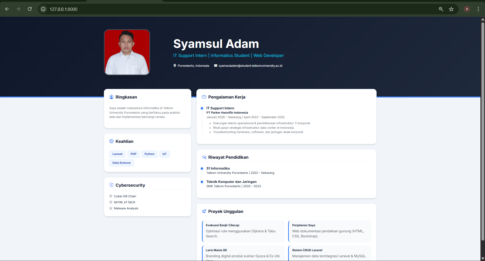
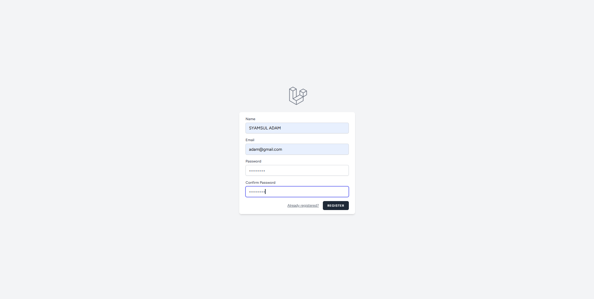

<div align="center">
  <br />
  <h1>LAPORAN PROYEK UTS <br>APLIKASI BERBASIS PLATFORM</h1>
  <br />
  <h3>UTS</h3>
  <br />
  <br />
  
  <br />
  <br />
  <br />
  <h3>Disusun Oleh :</h3>
  <p>
    <strong>Syamsul Adam</strong><br>
    <strong>2311102144</strong><br>
    <strong>S1 IF-11-01</strong>
  </p>
  <br />
  <h3>Dosen Pengampu :</h3>
  <p>
    <strong>Dimas Fanny Hebrasianto Permadi, S.ST., M.Kom</strong>
  </p>
  <br />
  <h4>Asisten Praktikum :</h4>
  <strong>Apri Pandu Wicaksono</strong> <br>
  <strong>Rangga Pradarrell Fathi</strong>
  <br />
  <h3>LABORATORIUM HIGH PERFORMANCE
 <br>FAKULTAS INFORMATIKA <br>UNIVERSITAS TELKOM PURWOKERTO <br>2026</h3>
</div>

---

## 1. Spesifikasi dan Implementasi Sistem (Kebutuhan Fungsional)

Penugasan Ujian Tengah Semester (UTS), proyek ini merupakan pengembangan **Website Portofolio Personal** yang didesain agar benar-benar dapat dimanfaatkan di dunia nyata sebagai portofolio digital (*Personal Branding*).

Adapun spesifikasi teknis dan fungsionalitas utama yang diterapkan berdasarkan instruksi ujian mencakup:

1. **Framework Utama**: Menjadikan **Laravel 12** sebagai pondasi *backend* utama dengan **PostgreSQL** sebagai sistem manajemen basis data relasional.
2. **Kebebasan Desain Antarmuka (Styling)**: Memanfaatkan **Bootstrap 5** untuk perancangan visual halaman web (*Landing Page* & *Dashboard*) secara responsif dan profesional.
3. **Pengelolaan Konten (Admin Dashboard)**: Menyediakan *dashboard* khusus yang ditujukan bagi administrator untuk mengonfigurasi dan melakukan perubahan konten yang tampil di halaman depan. Rincian seperti data profil, foto diri, keahlian, riwayat pendidikan, serta jejak proyek dapat dikontrol melalui operasi CRUD di area ini. Fitur unggah berkas (*file upload*) turut disediakan untuk foto profil yang tersimpan di `public/uploads/profile` maupun gambar tangkapan layar proyek di `public/uploads/projects`.
4. **Implementasi AJAX Terpadu (Wajib)**: Seluruh tampilan data profil, perolehan *skill*, riwayat pendidikan, hingga pencapaian proyek pada *landing page* sama sekali tidak menggunakan operan variabel Blade reguler (*direct rendering*). Tampilan halaman utama mutlak diisi dengan menarik data (*fetching*) yang di-*supply* oleh *backend endpoint* menggunakan **AJAX** berbasis Fetch API.

---

## 2. Penjelasan Kode Sumber

### 2.1 Backend API untuk AJAX (Routing & Logic)

Komunikasi data antara sisi klien (frontend) dan server (backend) pada aplikasi ini dijembatani oleh sebuah Endpoint API yang dibangun di atas rute Laravel. Metode getProfile dalam PortfolioController berperan sebagai resource provider yang mengekstraksi data dari model Profile dan melakukan serialisasi data ke dalam format JSON (JavaScript Object Notation). Format ini dipilih karena sifatnya yang ringan dan kompatibilitasnya yang tinggi dengan fungsi fetch() pada JavaScript, sehingga memungkinkan pembaruan konten halaman secara dinamis tanpa memerlukan proses refresh seluruh halaman (asynchronous data loading).

*File Referensi: `routes/web.php` (Grup API)*

```php
// Route untuk mengambil data profil secara asinkron (AJAX)
Route::get('/api/user-profile', [PortfolioController::class, 'getProfile'])->name('api.profile');
```

*File Referensi: `app/Http/Controllers/PortfolioController.php`*

```php
/**
 * Mengambil data profil untuk kebutuhan AJAX Frontend.
 * Fungsi ini mengembalikan data dalam format JSON.
 */
public function getProfile() 
{
    // Mengambil satu data profil pertama dari database
    $data = Profile::first(); 

    // Jika data tidak ditemukan, kirim pesan error
    if (!$data) {
        return response()->json(['message' => 'Data profil belum diatur'], 404);
    }

    // Mengirimkan data profil ke frontend dalam bentuk JSON
    return response()->json($data);
}
```

---

### 2.2 Client-Side Load AJAX (`welcome.blade.php`)

Pada sisi klien (Client-Side), pemuatan data diimplementasikan menggunakan Asynchronous JavaScript and XML (AJAX) melalui Fetch API. Mekanisme ini memastikan bahwa struktur halaman HTML (DOM) dimuat terlebih dahulu, kemudian skrip JavaScript melakukan permintaan HTTP secara asinkron ke endpoint /api/user-profile. Respon yang diterima berupa objek JSON kemudian diproses untuk melakukan manipulasi DOM (Document Object Model) secara dinamis. Keunggulan dari pendekatan ini adalah terciptanya pemisahan tugas (separation of concerns) yang jelas antara penyajian data dan logika tampilan, serta memberikan pengalaman pengguna yang lebih responsif karena halaman tidak perlu dimuat ulang sepenuhnya saat terjadi pembaruan data dari basis data

*File Referensi: `resources/views/welcome.blade.php`*

```javascript
<script>
    /**
     * Fungsi Asinkron untuk memuat data portofolio dari Backend API.
     * Menggunakan Fetch API untuk memenuhi kriteria Client-Side Load (AJAX).
     */
    async function loadPortfolioData() {
        try {
            // 1. Melakukan permintaan data ke Endpoint API Laravel
            const response = await fetch('/api/user-profile');
            
            // 2. Mengonversi respon menjadi objek JSON
            const data = await response.json();

            // 3. Injeksi data ke elemen HTML secara dinamis
            if (data) {
                // Mengisi Nama dan NIM
                document.getElementById('nama-user').innerText = data.nama;
                document.getElementById('nim-user').innerText = `NIM: ${data.nim}`;
                
                // Mengisi Deskripsi/About
                document.getElementById('about-user').innerText = data.about;
                
                // Menangani Foto: Menggunakan foto hasil upload atau default Adam.jpg
                const fotoElement = document.getElementById('foto-user');
                fotoElement.src = data.foto ? `/assets/img/${data.foto}` : '/assets/img/Adam.jpg';

                // Menangani Skills: Mengubah string koma menjadi badge/tag
                const skillContainer = document.getElementById('skills-user');
                skillContainer.innerHTML = ''; // Reset container
                
                const skillsArray = data.skills.split(',');
                skillsArray.forEach(skill => {
                    const span = document.createElement('span');
                    span.className = 'badge-skill'; // Menggunakan class CSS yang sudah kita buat
                    span.innerText = skill.trim();
                    skillContainer.appendChild(span);
                });
            }
        } catch (error) {
            console.error('Gagal mengambil data dari API:', error);
            document.getElementById('about-user').innerText = "Gagal memuat data profil.";
        }
    }

    // Jalankan fungsi saat seluruh elemen halaman telah dimuat
    window.onload = loadPortfolioData;
</script>
```

---

### 2.3 Migration & Model Basis Data Portofolio

Basis data aplikasi ini dirancang menggunakan pendekatan Migration-Driven Development pada Laravel, yang memungkinkan kontrol versi skema tabel secara konsisten. Tabel profiles berfungsi sebagai repositori pusat untuk seluruh entitas data portofolio Syamsul Adam, dengan penggunaan tipe data text pada kolom about untuk menampung deskripsi panjang dan nullable pada kolom foto untuk fleksibilitas manajemen aset visual. Integrasi dengan Eloquent ORM melalui model Profile menyederhanakan proses manipulasi data (CRUD). Penerapan properti $fillable pada model menjamin keamanan data melalui mekanisme perlindungan terhadap Mass Assignment, sehingga proses pembaruan data dari Dashboard Admin dapat dilakukan dengan aman dan terstruktur.

```php
<?php

use Illuminate\Database\Migrations\Migration;
use Illuminate\Database\Schema\Blueprint;
use Illuminate\Support\Facades\Schema;

return new class extends Migration
{
    /**
     * Jalankan migrasi untuk membuat tabel profiles.
     */
    public function up(): void
    {
        Schema::create('profiles', function (Blueprint $table) {
            $table->id();
            $table->string('nama');      // Menyimpan Nama Lengkap
            $table->string('nim');       // Menyimpan Nomor Induk Mahasiswa
            $table->text('about');       // Deskripsi diri (Long Text)
            $table->string('skills');    // Daftar skill dalam format string (CSV)
            $table->string('foto')->nullable(); // Nama file foto (Bisa kosong)
            $table->timestamps();        // Kolom created_at dan updated_at
        });
    }

    /**
     * Membatalkan migrasi.
     */
    public function down(): void
    {
        Schema::dropIfExists('profiles');
    }
};
```

*Contoh Format Migration: `database/migrations/2026_04_20_000002_create_projects_table.php`*

```php
<?php

namespace App\Models;

use Illuminate\Database\Eloquent\Factories\HasFactory;
use Illuminate\Database\Eloquent\Model;

class Profile extends Model
{
    use HasFactory;

    /**
     * Atribut yang dapat diisi secara massal (Mass Assignment).
     * Penting agar fungsi $profile->update() di Controller berjalan lancar.
     */
    protected $fillable = [
        'nama',
        'nim',
        'about',
        'skills',
        'foto',
    ];
}
```

---

### 2.4 Area Khusus Admin (Middleware Otentikasi)

Keamanan data pada aplikasi ini dijamin melalui implementasi Middleware Otentikasi yang disediakan oleh Laravel Breeze. Middleware auth bertindak sebagai lapisan filter antara permintaan pengguna (request) dan controller tujuan. Secara teknis, sistem akan melakukan intersepsi terhadap setiap permintaan akses ke rute /dashboard. Jika sesi pengguna tidak valid atau belum terautentikasi, middleware secara otomatis akan mengalihkan (redirect) pengguna ke halaman login. Penerapan grup rute (Route Grouping) memungkinkan pengelolaan hak akses secara terpusat, memastikan bahwa fungsi krusial seperti pembaruan data identitas dan unggah berkas foto hanya dapat dieksekusi oleh administrator resmi, sehingga integritas data portofolio tetap terjaga.

*File Referensi: `routes/web.php`*

```php
use App\Http\Controllers\PortfolioController;

/**
 * Grup Rute Terproteksi
 * Middleware 'auth' memastikan hanya user yang sudah login yang bisa akses.
 */
Route::middleware(['auth', 'verified'])->group(function () {
    // Menampilkan halaman form edit portofolio
    Route::get('/dashboard', [PortfolioController::class, 'edit'])->name('dashboard');
    
    // Memproses update data dan foto
    Route::post('/dashboard/update', [PortfolioController::class, 'update'])->name('portfolio.update');
});
```

---

### 2.5 Halaman Dashboard CRUD

*Dashboard* didesain mengakomodir empat area pengelolaan data sekaligus, yaitu profil, keahlian, pendidikan, dan proyek. Admin dapat memantau dan mengelola seluruh konten portofolio melalui antarmuka yang intuitif berbasis Bootstrap 5, termasuk fitur unggah gambar untuk foto profil maupun tangkapan layar proyek.

```html
<!DOCTYPE html>
<html lang="id">
<head>
    <meta charset="UTF-8">
    <meta name="viewport" content="width=device-width, initial-scale=1.0">
    <title>Curriculum Vitae | Syamsul Adam</title>
    <link href="https://cdn.jsdelivr.net/npm/bootstrap@5.3.0/dist/css/bootstrap.min.css" rel="stylesheet">
    <link href="https://fonts.googleapis.com/css2?family=Inter:wght@300;400;600;700&display=swap" rel="stylesheet">
    <link rel="stylesheet" href="https://cdn.jsdelivr.net/npm/bootstrap-icons@1.11.1/font/bootstrap-icons.css">
    <style>
        :root { --navy: #0f172a; --azure: #3b82f6; --slate: #64748b; --glass: rgba(255, 255, 255, 0.9); }
        body { font-family: 'Inter', sans-serif; background-color: #f1f5f9; color: #1e293b; }
        
        /* Hero Section */
        .hero { background: linear-gradient(135deg, var(--navy) 0%, #1e293b 100%); color: white; padding: 60px 0 100px; border-bottom: 5px solid var(--azure); }
        .profile-img { width: 220px; height: 220px; object-fit: cover; border-radius: 24px; border: 4px solid rgba(255,255,255,0.2); box-shadow: 0 20px 25px -5px rgba(0,0,0,0.2); }
        
        /* Cards */
        .cv-card { background: white; border-radius: 16px; padding: 25px; box-shadow: 0 4px 6px -1px rgba(0,0,0,0.1); border: 1px solid #e2e8f0; margin-bottom: 24px; }
        .section-header { font-weight: 700; color: var(--navy); border-bottom: 2px solid #f1f5f9; padding-bottom: 10px; margin-bottom: 20px; display: flex; align-items: center; gap: 10px; }
        .section-header i { color: var(--azure); }

        /* Timeline */
        .timeline-item { border-left: 2px solid #e2e8f0; padding-left: 20px; position: relative; margin-bottom: 20px; }
        .timeline-item::before { content: ""; position: absolute; left: -7px; top: 5px; width: 12px; height: 12px; background: var(--azure); border-radius: 50%; }
        
        /* Skills */
        .skill-tag { background: #eff6ff; color: #1e40af; padding: 6px 14px; border-radius: 8px; font-size: 0.85rem; font-weight: 600; border: 1px solid #dbeafe; }
        
        .project-item { background: #f8fafc; border-radius: 12px; padding: 15px; border-left: 4px solid var(--azure); transition: 0.2s; }
        .project-item:hover { background: #f1f5f9; transform: translateX(5px); }
    </style>
</head>
<body>

<div class="hero">
    <div class="container">
        <div class="row align-items-center text-center text-md-start">
            <div class="col-md-3 mb-4 mb-md-0">
                
            </div>
            <div class="col-md-9">
                <h1 id="nama-user" class="display-4 fw-bold">...</h1>
                <p class="fs-5 text-info mb-4">IT Support Intern | Informatics Student | Web Developer</p>
                <div class="d-flex flex-wrap justify-content-center justify-content-md-start gap-4 small text-light">
                    <span><i class="bi bi-geo-alt-fill me-2 text-azure"></i>Purwokerto, Indonesia</span>
                    <span><i class="bi bi-envelope-fill me-2 text-azure"></i>syamsuladam@student.telkomuniversity.ac.id</span>
                </div>
            </div>
        </div>
    </div>
</div>

<div class="container" style="margin-top: -40px;">
    <div class="row">
        <div class="col-lg-4">
            <div class="cv-card">
                <h5 class="section-header"><i class="bi bi-person-circle"></i> Ringkasan</h5>
                <p id="about-user" class="small text-secondary leading-relaxed">Memuat informasi...</p>
            </div>

            <div class="cv-card">
                <h5 class="section-header"><i class="bi bi-cpu"></i> Keahlian</h5>
                <div id="skills-user" class="d-flex flex-wrap gap-2">
                    </div>
            </div>

            <div class="cv-card">
                <h5 class="section-header"><i class="bi bi-shield-lock"></i> Cybersecurity</h5>
                <div class="small">
                    <div class="mb-2"><i class="bi bi-check2-circle text-azure me-2"></i>Cyber Kill Chain</div>
                    <div class="mb-2"><i class="bi bi-check2-circle text-azure me-2"></i>MITRE ATT&CK</div>
                    <div><i class="bi bi-check2-circle text-azure me-2"></i>Malware Analysis</div>
                </div>
            </div>
        </div>

        <div class="col-lg-8">
            <div class="cv-card">
                <h5 class="section-header"><i class="bi bi-briefcase"></i> Pengalaman Kerja</h5>
                <div class="timeline-item">
                    <h6 class="fw-bold mb-0">IT Support Intern</h6>
                    <span class="text-azure small fw-bold">PT Parker Hannifin Indonesia</span>
                    <p class="text-muted small mb-2">Januari 2026 – Sekarang | April 2022 – September 2022</p>
                    <ul class="small text-secondary">
                        <li>Dukungan teknis operasional & pemeliharaan infrastruktur TI korporat.</li>
                        <li>Riset pasar strategis infrastruktur data center di Indonesia.</li>
                        <li>Troubleshooting hardware, software, dan jaringan skala korporat.</li>
                    </ul>
                </div>
            </div>

            <div class="cv-card">
                <h5 class="section-header"><i class="bi bi-mortarboard"></i> Riwayat Pendidikan</h5>
                <div class="timeline-item">
                    <h6 class="fw-bold mb-0">S1 Informatika</h6>
                    <small>Telkom University Purwokerto | 2022 – Sekarang</small>
                </div>
                <div class="timeline-item">
                    <h6 class="fw-bold mb-0">Teknik Komputer dan Jaringan</h6>
                    <small>SMK Telkom Purwokerto | 2020 – 2023</small>
                </div>
            </div>

            <div class="cv-card">
                <h5 class="section-header"><i class="bi bi-rocket-takeoff"></i> Proyek Unggulan</h5>
                <div class="row g-3">
                    <div class="col-md-6">
                        <div class="project-item h-100">
                            <h6 class="fw-bold small">Evakuasi Banjir Cilacap</h6>
                            <p class="x-small text-muted mb-0">Optimasi rute menggunakan Dijkstra & Tabu Search.</p>
                        </div>
                    </div>
                    <div class="col-md-6">
                        <div class="project-item h-100">
                            <h6 class="fw-bold small">Perjalanan Saya</h6>
                            <p class="x-small text-muted mb-0">Web dokumentasi pendakian gunung (HTML, CSS, Bootstrap).</p>
                        </div>
                    </div>
                    <div class="col-md-6">
                        <div class="project-item h-100">
                            <h6 class="fw-bold small">Laris Manis 88</h6>
                            <p class="x-small text-muted mb-0">Branding digital produk kuliner Gyoza & Es Ubi Ungu.</p>
                        </div>
                    </div>
                    <div class="col-md-6">
                        <div class="project-item h-100">
                            <h6 class="fw-bold small">Sistem CRUD Laravel</h6>
                            <p class="x-small text-muted mb-0">Manajemen data terintegrasi Laravel & MySQL.</p>
                        </div>
                    </div>
                </div>
            </div>
        </div>
    </div>
</div>

<script>
    async function loadCV() {
        const res = await fetch('/api/user-profile');
        const data = await res.json();
        if(data) {
            document.getElementById('nama-user').innerText = data.nama;
            document.getElementById('about-user').innerText = data.about;
            document.getElementById('foto-user').src = data.foto ? `/assets/img/${data.foto}` : '/assets/img/Adam.jpg';
            
            const skills = data.skills.split(',');
            const container = document.getElementById('skills-user');
            container.innerHTML = skills.map(s => `<span class="skill-tag">${s.trim()}</span>`).join('');
        }
    }
    window.onload = loadCV;
</script>
</body>
</html>
```

---

## 3. Hasil Tampilan (Screenshots) Aplikasi

Halaman utama portofolio yang dapat diakses oleh publik. Seluruh data profil, keahlian, riwayat pendidikan, dan proyek yang tampil ditarik dari *backend* menggunakan *fetch API* (AJAX).



---

### 3.2 Halaman Login

Halaman autentikasi administrator. Hanya pengguna yang terdaftar pada *database* dengan peran admin yang dapat masuk untuk mengakses *dashboard* pengelolaan data.



---

### 3.3 Halaman Dashboard Admin

Halaman utama administrator setelah berhasil *login*. Memuat tabel visual yang menampilkan data keahlian dan proyek terbaru untuk mempermudah pemantauan konten portofolio secara menyeluruh.


---

## 4. Kesimpulan

Proyek portofolio personal berbasis web yang dirancang ini membuktikan diri sukses menjawab setiap detail tuntutan penugasan di masa evaluasi UTS secara kohesif. Spesifikasi pilar layaknya kerangka integrasi **Laravel 12** bersama **PostgreSQL** sebagai basis data relasional, pemakaian tata busana HTML melalui **Bootstrap 5**, proteksi pengelolaan data spesifik *dashboard* kontrol admin menggunakan *middleware* berlapis (`auth` dan `admin`), fitur unggah berkas untuk foto profil maupun gambar proyek, beserta mekanisme aliran data non-konvensional **AJAX** berbasis Fetch API (memisahkan pengaksesan data secara asinkron, menepis integrasi *direct view rendering*) semuanya terlaksana seutuhnya. Karya akhirnya bukan sekadar prototipe tugas mentah, melainkan sebuah web personal sungguhan yang mantap diakomodasi untuk kepentingan karir perorangan ke depannya.

---

## 5. Referensi

- **Laravel Documentation**: [https://laravel.com/docs](https://laravel.com/docs)
- **Bootstrap 5 Styling**: [https://getbootstrap.com/docs](https://getbootstrap.com/docs)
- **Aplikasi AJAX Fetch API**: [https://developer.mozilla.org/en-US/docs/Web/API/Fetch_API](https://developer.mozilla.org/en-US/docs/Web/API/Fetch_API)