<div align="center">
  <br />
  <h1>LAPORAN PRAKTIKUM <br>APLIKASI BERBASIS PLATFORM</h1>
  <br />
  <h2> UTS <br> LARAVEL - PORTOFOLIO DIGITAL DYNAMIC </h2>
  <br />
  <br />
   
  <br />
  <br />
  <br />
  <h3>Disusun Oleh :</h3>
  <p>
    <strong>Satrio Wibowo</strong><br>
    <strong>2311102149</strong><br>
    <strong>S1 IF-11-REG 01</strong>
  </p>
  <br />
  <h3>Dosen Pengampu :</h3>
  <p>
    <strong>Dimas Fanny Hebrasianto Permadi, S.ST., M.Kom</strong>
  </p>
  <br />
  <br />
    <h4>Asisten Praktikum :</h4>
    <strong> Apri Pandu Wicaksono </strong> <br>
    <strong>Rangga Pradarrell Fathi</strong>
  <br />
  <h2>LABORATORIUM HIGH PERFORMANCE
 <br>FAKULTAS INFORMATIKA <br>UNIVERSITAS TELKOM PURWOKERTO <br>2026</h2>
</div>

---
## 1. DASAR TEORI
 
### Laravel Framework (Versi 12)
Framework Laravel merupakan kerangka kerja PHP terbuka (*open-source*) berdesain MVC (*Model-View-Controller*) yang digunakan untuk mendukung pengembangan aplikasi web secara cepat (Rapid Application Development). Laravel 12, yang dirilis pada awal tahun 2025, memperkenalkan pendekatan *fluent configuration* pada `bootstrap/app.php` di mana routing, middleware, dan exception handling dikonfigurasi secara terpadu dalam satu titik entri. Framework ini menawarkan Eloquent ORM untuk manipulasi data SQL yang intuitif, sistem routing yang terstruktur, Storage Facade untuk pengelolaan berkas media, serta Artisan CLI untuk otomatisasi tugas pengembangan.
 
### MVC (Model-View-Controller)
MVC merupakan pola arsitektur perangkat lunak yang membagi aplikasi menjadi tiga komponen utama:
 
- **Model**: bertugas mengelola data dan berinteraksi dengan database. Model utama pada proyek ini adalah `Profile`, `Project`, dan `ContactMessage`, masing-masing mendefinisikan `$fillable` dan `$casts` untuk pengelolaan tipe data secara otomatis.
- **View**: bertanggung jawab menampilkan data kepada pengguna menggunakan Blade templating engine yang dipadukan dengan Alpine.js untuk reaktivitas sisi klien.
- **Controller**: menghubungkan Model dan View serta mengatur alur aplikasi. Pada proyek ini, logika CRUD backend ditangani oleh **Filament Resource** sebagai pengganti Controller konvensional, sementara endpoint data dilayani langsung melalui closure di `routes/api.php`.
 
### Filament v3
Filament adalah paket Laravel yang menyediakan panel administrasi CRUD lengkap dan siap pakai dengan konfigurasi minimal. Filament v3 dibangun di atas **Livewire v3** dan **Alpine.js**, menghadirkan komponen UI yang kaya — `TextInput`, `Textarea`, `Select`, `TagsInput`, `FileUpload`, `Repeater`, dan lainnya — tanpa memerlukan penulisan JavaScript secara eksplisit. Setiap entitas data direpresentasikan sebagai sebuah **Filament Resource** yang mendefinisikan Form Schema, Table Schema, dan halaman-halaman CRUD (List, Create, Edit) secara deklaratif.
 
### AJAX dan Fetch API
AJAX (*Asynchronous JavaScript and XML*) adalah teknik pengembangan web yang memungkinkan halaman berkomunikasi dengan server dan memperbarui konten secara parsial tanpa melakukan pemuatan ulang halaman penuh. Pada proyek ini, AJAX diimplementasikan menggunakan **Fetch API** — antarmuka JavaScript modern berbasis Promise yang menggantikan `XMLHttpRequest`. Pendekatan ini merupakan syarat utama praktikum: data tidak ditampilkan langsung melalui Blade view, melainkan diambil secara asinkron setelah halaman dimuat, menciptakan pemisahan tegas antara layer presentasi (frontend) dan layer data (backend API).
 
### RESTful API di Laravel
REST (*Representational State Transfer*) adalah gaya arsitektur yang memanfaatkan protokol HTTP secara semantik. Pada Laravel, `routes/api.php` adalah berkas routing khusus yang mengaplikasikan middleware stateless (tanpa session dan cookie) secara otomatis pada seluruh route di dalamnya. Endpoint `GET /api/portfolio-data` pada proyek ini melayani semua kebutuhan data halaman utama — profil dan proyek — dalam satu request yang efisien, menggunakan eager loading `with('media')` untuk menghindari masalah N+1 query.
 
### Alpine.js dan Tailwind CSS
**Alpine.js** adalah framework JavaScript ringan yang menambahkan reaktivitas pada halaman HTML secara deklaratif melalui atribut seperti `x-data`, `x-init`, `x-show`, `x-for`, `x-text`, dan `@click`. Pada proyek ini Alpine.js mengelola state reaktif (daftar proyek, kategori aktif, status loading), mendistribusikan proyek ke dalam kolom Masonry Grid, serta menangani transisi Dark Mode. **Tailwind CSS** adalah framework CSS *utility-first* yang menyediakan kelas-kelas utilitas berbutir halus untuk membangun antarmuka langsung di dalam markup HTML, dengan dukungan native untuk dark mode (`dark:`), responsivitas (`md:`, `lg:`), serta animasi dan transisi.
 
---
 
## 2. SOURCE CODE
 
Source code lengkap project **OXY-LAB / OXY-PROJECT** berada di dalam folder `oxy-lab/`.
 
### routes/web.php
```php
<?php
 
use Illuminate\Support\Facades\Route;
use App\Http\Controllers\ContactController;
use Illuminate\Http\Request;
use App\Models\Project;
 
Route::get('/', function () {
    $projects = Project::with('media')->latest()->get();
    return view('pages.home', compact('projects'));
})->name('home');
 
Route::get('/work', function (Request $request) {
    $allowed = ['all', 'design', 'photo', 'video', 'illustration'];
    $type = strtolower($request->query('type', 'all'));
 
    if (!in_array($type, $allowed, true)) {
        $type = 'all';
    }
 
    $query = Project::with('media')->latest();
 
    if ($type !== 'all') {
        $query->where('category', $type);
    }
 
    $projects = $query->paginate(12)->withQueryString();
    return view('pages.work', compact('projects', 'type'));
})->name('work.index');
 
Route::get('/work/{project:slug}', function (Project $project) {
    $project->load('media');
    return view('pages.work-detail', compact('project'));
})->name('work.show');
 
Route::get('/login', function () {
    return view('auth.login');
})->name('login');
 
Route::post('/contact', [ContactController::class, 'store'])->name('contact.store');
```
 
### routes/api.php
```php
<?php
 
use App\Models\Profile;
use App\Models\Project;
use Illuminate\Support\Facades\Storage;
use Illuminate\Support\Facades\Route;
 
Route::get('/portfolio-data', function () {
    $profile  = Profile::first();
    $projects = Project::with('media')->latest()->get();
 
    // Mengambil kategori unik dari database secara dinamis
    $categories = $projects->pluck('category')
        ->unique()
        ->map(fn($cat) => ucfirst(strtolower($cat))) // DESIGN -> Design
        ->prepend('All')                              // Tambahkan opsi 'All' di awal
        ->values();
 
    return response()->json([
        'projects'   => $projects,
        'categories' => $categories,
        'profile'    => [
            'heading'     => $profile->heading     ?? 'Crafting meaning from visual chaos.',
            'description' => $profile->description ?? 'Halo, aku Satrio Wibowo! Mahasiswa Teknik Informatika yang fokus di industri kreatif.',
            'skills'      => $profile->skills      ?? ['Branding', 'UI/UX', 'Photography'],
            'photo_url'   => $profile->photo
                ? Storage::url($profile->photo)
                : asset('storage/Satrio.jpeg'),
        ],
    ]);
});
```
 
### app/Models/Profile.php
```php
<?php
 
namespace App\Models;
 
use Illuminate\Database\Eloquent\Model;
 
class Profile extends Model
{
    protected $fillable = ['heading', 'description', 'skills', 'photo'];
 
    protected $casts = [
        'skills' => 'array', // Kolom JSON di-cast otomatis ke array PHP
    ];
}
```
 
### app/Models/Project.php
```php
<?php
 
namespace App\Models;
 
use Illuminate\Database\Eloquent\Model;
use Illuminate\Database\Eloquent\Relations\HasMany;
use Illuminate\Database\Eloquent\Relations\HasOne;
 
class Project extends Model
{
    protected $fillable = [
        'title', 'slug', 'category', 'year',
        'description', 'tags', 'is_featured', 'published_at',
    ];
 
    protected $casts = [
        'tags'         => 'array',
        'is_featured'  => 'boolean',
        'published_at' => 'datetime',
    ];
 
    public function media(): HasMany
    {
        return $this->hasMany(ProjectMedia::class)->orderBy('sort_order');
    }
 
    public function thumbnail(): HasOne
    {
        return $this->hasOne(ProjectMedia::class)->where('role', 'thumbnail');
    }
}
```
 
### app/Models/ContactMessage.php
```php
<?php
 
namespace App\Models;
 
use Illuminate\Database\Eloquent\Model;
 
class ContactMessage extends Model
{
    protected $fillable = [
        'name',
        'email',
        'project_type',
        'message',
        'is_read',
    ];
}
```
 
### app/Filament/Resources/ProfileResource.php
```php
<?php
 
namespace App\Filament\Resources;
 
use App\Models\Profile;
use Filament\Forms;
use Filament\Forms\Form;
use Filament\Resources\Resource;
use Filament\Tables;
use Filament\Tables\Table;
 
class ProfileResource extends Resource
{
    protected static ?string $model           = Profile::class;
    protected static ?string $navigationIcon  = 'heroicon-o-user-circle';
    protected static ?string $navigationLabel = 'My Profile';
 
    public static function form(Form $form): Form
    {
        return $form->schema([
            Forms\Components\Section::make('Main Information')->schema([
                Forms\Components\TextInput::make('heading')->required(),
                Forms\Components\Textarea::make('description')->required()->rows(5),
                Forms\Components\TagsInput::make('skills')->required(),
                Forms\Components\FileUpload::make('photo')
                    ->image()
                    ->directory('profile-photos')
                    ->visibility('public')
                    ->preserveFilenames()
                    ->required(),
            ]),
        ]);
    }
 
    public static function table(Table $table): Table
    {
        return $table
            ->columns([
                Tables\Columns\ImageColumn::make('photo')->circular(),
                Tables\Columns\TextColumn::make('heading')->searchable(),
                Tables\Columns\TextColumn::make('updated_at')->dateTime(),
            ])
            ->actions([Tables\Actions\EditAction::make()])
            ->bulkActions([
                Tables\Actions\BulkActionGroup::make([
                    Tables\Actions\DeleteBulkAction::make(),
                ]),
            ]);
    }
 
    public static function getPages(): array
    {
        return [
            'index'  => Pages\ListProfiles::route('/'),
            'create' => Pages\CreateProfile::route('/create'),
            'edit'   => Pages\EditProfile::route('/{record}/edit'),
        ];
    }
}
```
 
### app/Filament/Resources/ProjectResource.php
```php
<?php
 
namespace App\Filament\Resources;
 
use App\Models\Project;
use Filament\Forms;
use Filament\Forms\Form;
use Filament\Resources\Resource;
use Filament\Tables;
use Filament\Tables\Table;
use Illuminate\Support\Str;
 
class ProjectResource extends Resource
{
    protected static ?string $model           = Project::class;
    protected static ?string $navigationIcon  = 'heroicon-o-squares-2x2';
    protected static ?string $navigationLabel = 'Projects';
 
    public static function form(Form $form): Form
    {
        return $form->schema([
            Forms\Components\Section::make('Project')
                ->columns(12)
                ->schema([
                    Forms\Components\TextInput::make('title')
                        ->required()
                        ->live(onBlur: true)
                        ->maxLength(255)
                        ->columnSpan(8)
                        ->afterStateUpdated(function ($state, Forms\Set $set) {
                            $set('slug', Str::slug($state));
                        }),
 
                    Forms\Components\TextInput::make('slug')
                        ->required()
                        ->maxLength(255)
                        ->unique(ignoreRecord: true)
                        ->columnSpan(4),
 
                    Forms\Components\Select::make('category')
                        ->required()
                        ->options([
                            'design'       => 'Design',
                            'photo'        => 'Photo',
                            'video'        => 'Video',
                            'illustration' => 'Illustration',
                        ])
                        ->native(false)
                        ->columnSpan(4),
 
                    Forms\Components\Toggle::make('is_featured')
                        ->label('Featured (Landing)')
                        ->inline(false)
                        ->columnSpan(3),
 
                    Forms\Components\Textarea::make('description')
                        ->rows(4)
                        ->columnSpan(12),
 
                    Forms\Components\TagsInput::make('tags')
                        ->placeholder('Add tags…')
                        ->columnSpan(12),
                ]),
 
            Forms\Components\Section::make('Media')
                ->schema([
                    Forms\Components\Repeater::make('media')
                        ->relationship()
                        ->orderColumn('sort_order')
                        ->reorderable()
                        ->schema([
                            Forms\Components\Grid::make(12)->schema([
                                Forms\Components\Select::make('type')
                                    ->required()
                                    ->options(['image' => 'Image', 'video' => 'Video'])
                                    ->native(false)
                                    ->reactive()
                                    ->columnSpan(3),
 
                                Forms\Components\Select::make('role')
                                    ->required()
                                    ->options([
                                        'thumbnail' => 'Thumbnail',
                                        'gallery'   => 'Gallery',
                                        'cover'     => 'Cover',
                                    ])
                                    ->native(false)
                                    ->columnSpan(3),
 
                                Forms\Components\TextInput::make('caption')
                                    ->maxLength(255)
                                    ->columnSpan(6),
                            ]),
 
                            Forms\Components\FileUpload::make('path')
                                ->label('Image file')
                                ->directory('portfolio/images')
                                ->disk('public')
                                ->image()
                                ->maxSize(10240)
                                ->hidden(fn (Forms\Get $get) => $get('type') !== 'image'),
 
                            Forms\Components\Select::make('provider')
                                ->label('Video provider')
                                ->options([
                                    'youtube' => 'YouTube',
                                    'vimeo'   => 'Vimeo',
                                    'custom'  => 'Custom MP4',
                                ])
                                ->native(false)
                                ->reactive()
                                ->hidden(fn (Forms\Get $get) => $get('type') !== 'video'),
 
                            Forms\Components\TextInput::make('embed_id')
                                ->label('Embed ID')
                                ->hidden(fn (Forms\Get $get) =>
                                    $get('type') !== 'video' ||
                                    !in_array($get('provider'), ['youtube', 'vimeo'], true)
                                ),
                        ])
                        ->defaultItems(0)
                        ->addActionLabel('Add media'),
                ]),
        ]);
    }
 
    public static function table(Table $table): Table
    {
        return $table
            ->columns([
                Tables\Columns\TextColumn::make('title')->searchable()->sortable()->limit(40),
                Tables\Columns\TextColumn::make('category')
                    ->formatStateUsing(fn ($state) => strtoupper($state))
                    ->sortable(),
                Tables\Columns\TextColumn::make('year')->sortable(),
                Tables\Columns\IconColumn::make('is_featured')->boolean()->label('Featured'),
                Tables\Columns\TextColumn::make('updated_at')->dateTime('d M Y H:i')->sortable(),
            ])
            ->filters([
                Tables\Filters\SelectFilter::make('category')
                    ->options([
                        'design'       => 'Design',
                        'photo'        => 'Photo',
                        'video'        => 'Video',
                        'illustration' => 'Illustration',
                    ]),
            ])
            ->actions([Tables\Actions\EditAction::make()])
            ->bulkActions([
                Tables\Actions\BulkActionGroup::make([
                    Tables\Actions\DeleteBulkAction::make(),
                ]),
            ]);
    }
 
    public static function getPages(): array
    {
        return [
            'index'  => Pages\ListProjects::route('/'),
            'create' => Pages\CreateProject::route('/create'),
            'edit'   => Pages\EditProject::route('/{record}/edit'),
        ];
    }
}
```
 
### resources/views/partials/home.blade.php (Work Section)
```html
<section id="work" class="py-24 scroll-mt-20"
    x-data="{
        active: 'all',
        allProjects: [],
        categories: [],
        loading: true,
        init() {
            fetch('/api/portfolio-data')
                .then(res => res.json())
                .then(data => {
                    this.allProjects = data.projects;
                    this.categories  = data.categories;
                    this.loading     = false;
                });
        },
        get columns() {
            let filtered = this.active === 'all'
                ? this.allProjects
                : this.allProjects.filter(
                    p => p.category.toLowerCase() === this.active.toLowerCase()
                  );
            let numCols = window.innerWidth >= 1024 ? 5
                        : (window.innerWidth >= 768  ? 2 : 1);
            let cols = Array.from({ length: numCols }, () => []);
            filtered.forEach((p, i) => cols[i % numCols].push(p));
            return cols;
        }
    }">
 
    <div class="max-w-[90rem] mx-auto px-6">
 
        {{-- Filter Dinamis: dihasilkan dari data categories hasil fetch --}}
        <div class="flex flex-wrap gap-3 mb-16" x-show="!loading">
            <template x-for="cat in categories" :key="cat">
                <button @click="active = cat.toLowerCase()"
                    :class="active === cat.toLowerCase()
                        ? 'bg-pinkCreamy dark:bg-gold text-white dark:text-black shadow-lg'
                        : 'bg-white dark:bg-white/5 text-gray-400 dark:text-white/50'"
                    class="px-8 py-2.5 rounded-full border text-sm font-bold transition duration-300"
                    x-text="cat">
                </button>
            </template>
        </div>
 
        {{-- Loading State --}}
        <div x-show="loading" class="flex justify-center py-20 text-gray-400">
            Loading Portfolio...
        </div>
 
        {{-- Masonry Grid --}}
        <div x-show="!loading" class="flex flex-wrap -mx-3 items-start">
            <template x-for="(col, index) in columns" :key="index">
                <div class="px-3 flex flex-col gap-6"
                     :class="window.innerWidth >= 1024 ? 'w-1/5' : (window.innerWidth >= 768 ? 'w-1/2' : 'w-full')">
                    <template x-for="project in col" :key="project.id">
                        <article class="group relative overflow-hidden rounded-[1.5rem] border
                                        border-gray-100 dark:border-white/10 bg-white dark:bg-white/5
                                        transition-all hover:shadow-xl dark:hover:border-gold/30">
                            <div class="relative overflow-hidden">
                                 m.role === 'thumbnail')?.path
                                       || project.media[0]?.path)"
                                     class="w-full h-auto object-cover transition duration-700
                                            group-hover:scale-105 group-hover:brightness-[0.4]">
                                <div class="absolute inset-0 flex flex-col items-center justify-center
                                            opacity-0 group-hover:opacity-100 transition-all text-center p-6">
                                    <h3 class="text-sm font-bold text-white uppercase tracking-tight"
                                        x-text="project.title"></h3>
                                    <p class="text-pinkCreamy dark:text-gold text-[9px] font-bold mt-2
                                              tracking-widest uppercase"
                                       x-text="project.category"></p>
                                    <a :href="'/work/' + project.slug" class="absolute inset-0 z-10"></a>
                                </div>
                            </div>
                        </article>
                    </template>
                </div>
            </template>
        </div>
    </div>
</section>
```
 
### resources/views/partials/about.blade.php
```html
<section id="about"
    class="mx-auto max-w-7xl px-6 py-24 scroll-mt-20"
    x-data="{ profile: {}, loading: true }"
    x-init="fetch('/api/portfolio-data')
        .then(res => res.json())
        .then(data => { profile = data.profile; loading = false; })">
 
    <p class="text-[10px] tracking-[0.4em] font-bold text-pinkCreamy dark:text-gold uppercase mb-12">About</p>
 
    <div class="grid grid-cols-1 gap-16 lg:grid-cols-2 lg:items-center">
 
        {{-- Foto Profil AJAX --}}
        <div class="aspect-[4/5] overflow-hidden rounded-[2.5rem] bg-gray-50 dark:bg-white/5
                    border border-gray-100 dark:border-white/10">
            
        </div>
 
        <div>
            {{-- Heading AJAX --}}
            <h2 class="text-4xl md:text-6xl font-bold tracking-tight text-gray-900 dark:text-white
                       leading-[1.1]"
                x-text="profile.heading"></h2>
 
            {{-- Deskripsi AJAX --}}
            <p class="mt-8 text-gray-600 dark:text-white/60 text-lg leading-relaxed"
               x-text="profile.description"></p>
 
            {{-- Skills AJAX --}}
            <div class="mt-12">
                <p class="text-[10px] tracking-[0.3em] font-bold text-pinkCreamy dark:text-gold
                          uppercase mb-6">Skills & Services</p>
                <div class="flex flex-wrap gap-2">
                    <template x-for="skill in profile.skills" :key="skill">
                        <span class="rounded-full px-5 py-2 border border-gray-100 dark:border-white/5
                                     bg-white dark:bg-white/[0.03] text-gray-500 dark:text-white/50
                                     text-xs font-bold uppercase"
                              x-text="skill">
                        </span>
                    </template>
                </div>
            </div>
        </div>
    </div>
</section>
```
 
### database/migrations/2026_04_20_173958_create_profiles_table.php
```php
<?php
 
use Illuminate\Database\Migrations\Migration;
use Illuminate\Database\Schema\Blueprint;
use Illuminate\Support\Facades\Schema;
 
return new class extends Migration
{
    public function up(): void
    {
        Schema::create('profiles', function (Blueprint $table) {
            $table->id();
            $table->string('heading');
            $table->text('description');
            $table->json('skills');
            $table->string('photo')->nullable();
            $table->timestamps();
        });
    }
 
    public function down(): void
    {
        Schema::dropIfExists('profiles');
    }
};
```
 
### database/migrations/2026_02_22_114255_create_contact_messages_table.php
```php
<?php
 
use Illuminate\Database\Migrations\Migration;
use Illuminate\Database\Schema\Blueprint;
use Illuminate\Support\Facades\Schema;
 
return new class extends Migration
{
    public function up(): void
    {
        Schema::create('contact_messages', function (Blueprint $table) {
            $table->id();
            $table->string('name');
            $table->string('email');
            $table->string('project_type')->nullable();
            $table->text('message');
            $table->boolean('is_read')->default(false);
            $table->timestamps();
        });
    }
 
    public function down(): void
    {
        Schema::dropIfExists('contact_messages');
    }
};
```
 
---
 
## 3. CARA INSTALASI
 
### Persyaratan Sistem
- PHP >= 8.2 (dengan ekstensi `pdo_mysql` dan `pdo_sqlite`)
- Composer
- Node.js >= 20 & npm
- MySQL / MariaDB (XAMPP) **atau** SQLite
 
### Langkah Instalasi
 
**1. Masuk ke folder project**
```bash
cd "D:\S6\Aplikasi Berbasis Platform\Praktikum\modul 11,12,13\2311102149_Satrio-Wibowo\oxy-lab"
```
 
**2. Install dependensi PHP**
```bash
composer install
```
 
**3. Install dependensi Node.js**
```bash
npm install
```
 
**4. Salin file environment**
```bash
cp .env.example .env
php artisan key:generate
```
 
**5. Konfigurasi database di `.env`**
 
Untuk **MySQL**:
```env
DB_CONNECTION=mysql
DB_HOST=127.0.0.1
DB_PORT=3306
DB_DATABASE=oxy_lab
DB_USERNAME=root
DB_PASSWORD=
```
 
Untuk **SQLite** (default):
```env
DB_CONNECTION=sqlite
```
 
**6. Buat database (khusus MySQL)**
 
Buka phpMyAdmin lalu buat database baru dengan nama `oxy_lab`, collation `utf8mb4_unicode_ci`. Atau via terminal:
```bash
mysql -u root -e "CREATE DATABASE oxy_lab CHARACTER SET utf8mb4 COLLATE utf8mb4_unicode_ci;"
```
 
**7. Jalankan migrasi**
```bash
php artisan migrate
```
 
**8. Buat symlink storage**
```bash
php artisan storage:link
```
 
**9. Build asset frontend**
```bash
npm run build
```
 
**10. Jalankan server**
```bash
composer run dev
```
 
Buka browser: **http://127.0.0.1:8000**
 
### Akun Login Default (Filament Admin)
 
| Field    | Value              |
|----------|--------------------|
| URL      | /admin             |
| Email    | admin@example.com  |
| Password | password           |
 
### Penanganan Error Driver SQLite (PDO)
 
Jika muncul error `could not find driver` saat menjalankan migrasi:
 
1. Cari lokasi `php.ini` dengan perintah:
   ```bash
   php --ini
   ```
2. Buka file `php.ini`, cari dan hapus tanda `;` di depan baris berikut:
   ```ini
   extension=pdo_sqlite
   extension=sqlite3
   extension=pdo_mysql
   extension=mysqli
   ```
3. Simpan file, restart terminal, lalu jalankan ulang perintah migrasi.
Verifikasi ekstensi aktif:
```bash
php -m | findstr sqlite
php -m | findstr mysql
```
 
---
 
## 4. OUTPUT
 
### A. Tampilan Landing Page (Hero Section)
Halaman beranda OXY-LAB menampilkan Hero Section dengan tagline utama portofolio dan call-to-action. Teks dan elemen dekoratif menggunakan animasi AOS (Animate On Scroll) untuk pengalaman scroll yang sinematik.
 
<p>
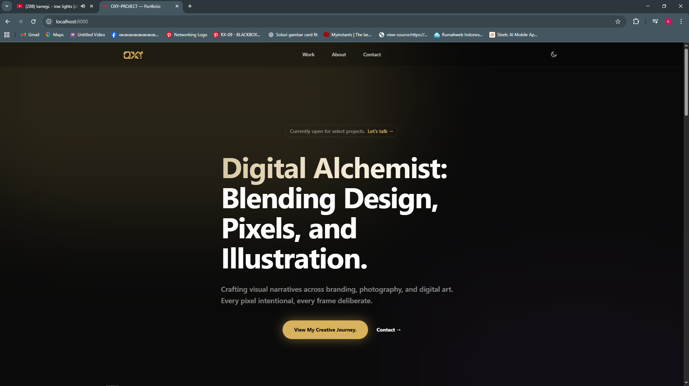
</p>

### B. Work Section — Filter Kategori Dinamis
Setelah data diterima dari API, tombol-tombol filter kategori muncul secara otomatis berdasarkan kategori yang benar-benar ada di database. Proyek ditampilkan dalam format Masonry Grid responsif dengan 5 kolom pada desktop.
 
<p>
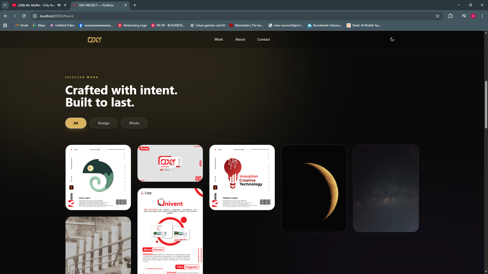
</p>

### C. About Section
Menampilkan foto profil dengan efek grayscale yang berubah berwarna saat di-hover, heading, deskripsi, dan daftar skills — seluruhnya diambil secara asinkron dari `/api/portfolio-data`.
 
<p>
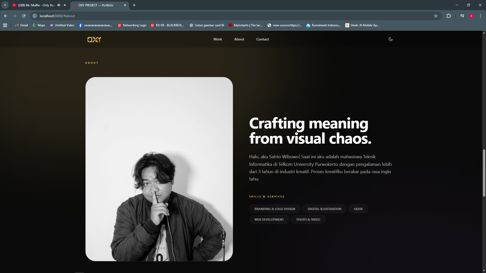
</p>

### D. Contact Section
Formulir kontak dengan empat field (Name, Email, Project Type, Message) beserta validasi server-side. Pesan kesalahan ditampilkan per-field menggunakan `@error` Blade.
 
<p>
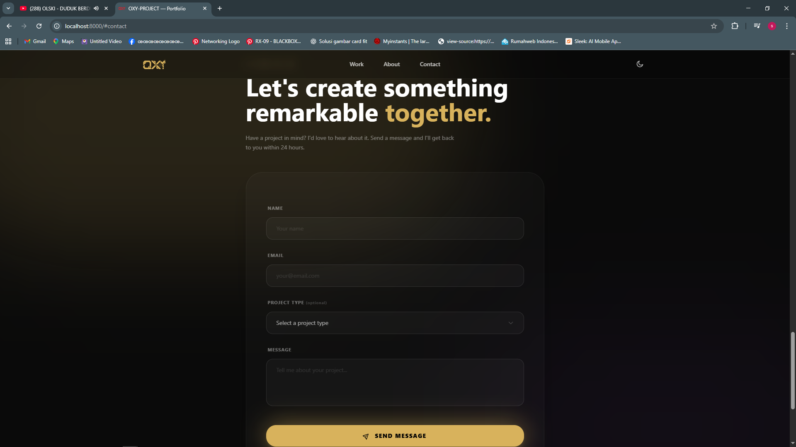
</p>

### E. Light Mode
Keseluruhan halaman mendukung transisi antara Dark Mode dan Light Mode menggunakan kelas `dark:` Tailwind CSS. Warna aksen berganti antara `gold` (gelap) dan `pinkCreamy` (terang).
 
<p>
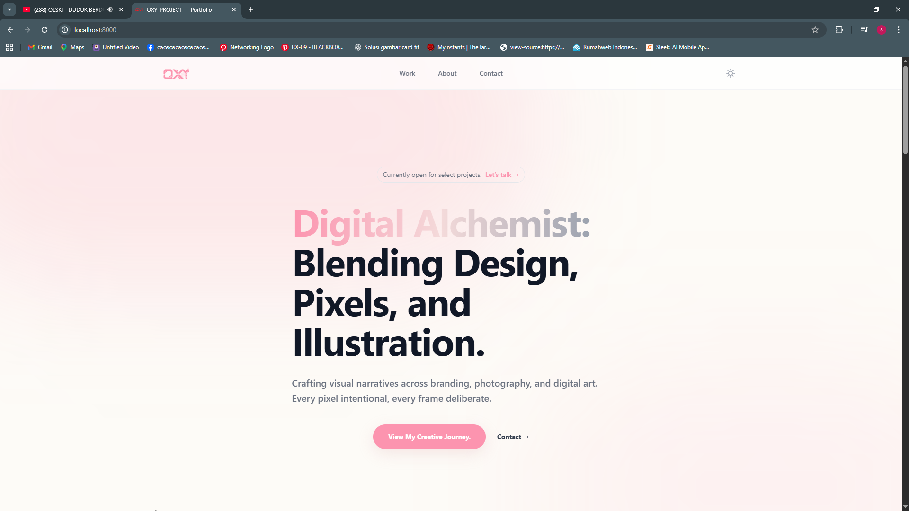
</p>

<p>
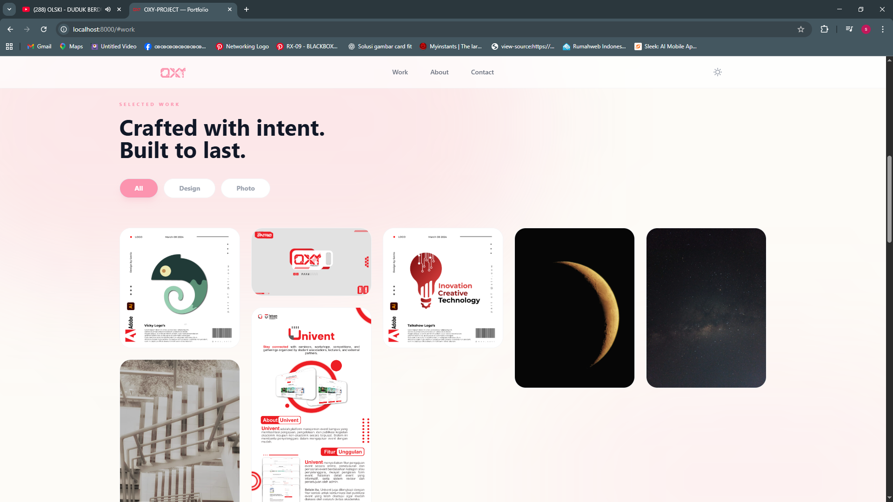
</p>

<p>
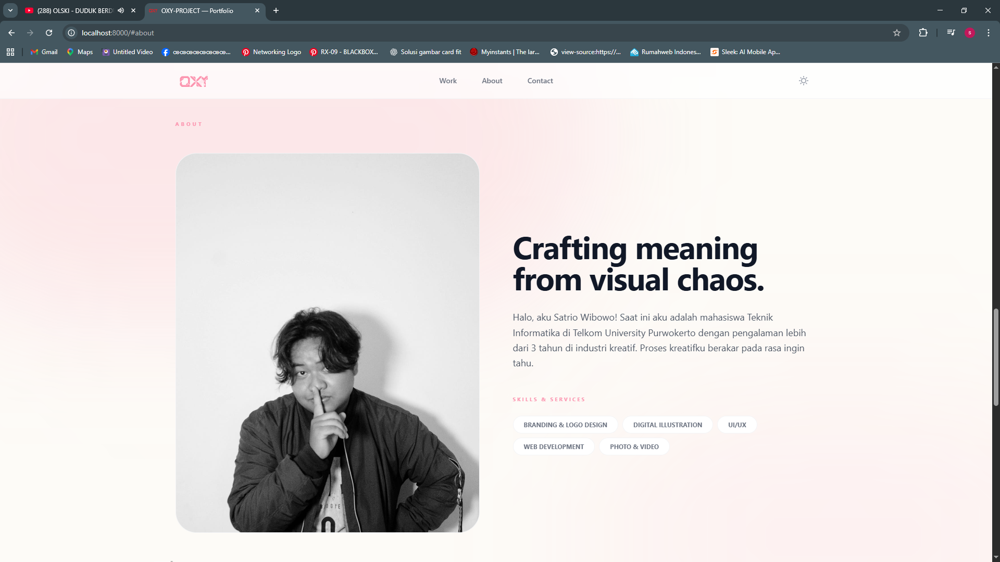
</p>

<p>
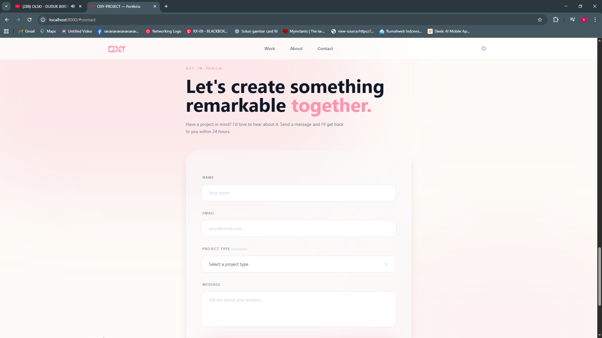
</p>

### F. Dashboard Admin — My Profile (Filament)
Panel administrasi Filament dapat diakses melalui `/admin`. Menu **My Profile** memungkinkan admin mengedit heading, deskripsi, skills (TagsInput), dan foto profil. Perubahan langsung tercermin pada landing page karena API selalu membaca data terbaru via `Profile::first()`.
 
<p>
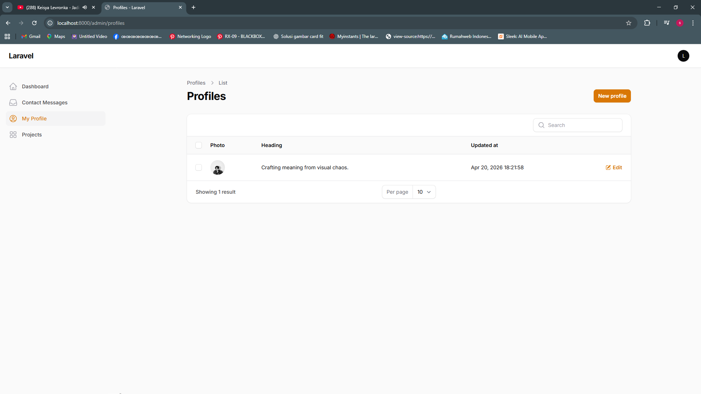
</p>

<p>
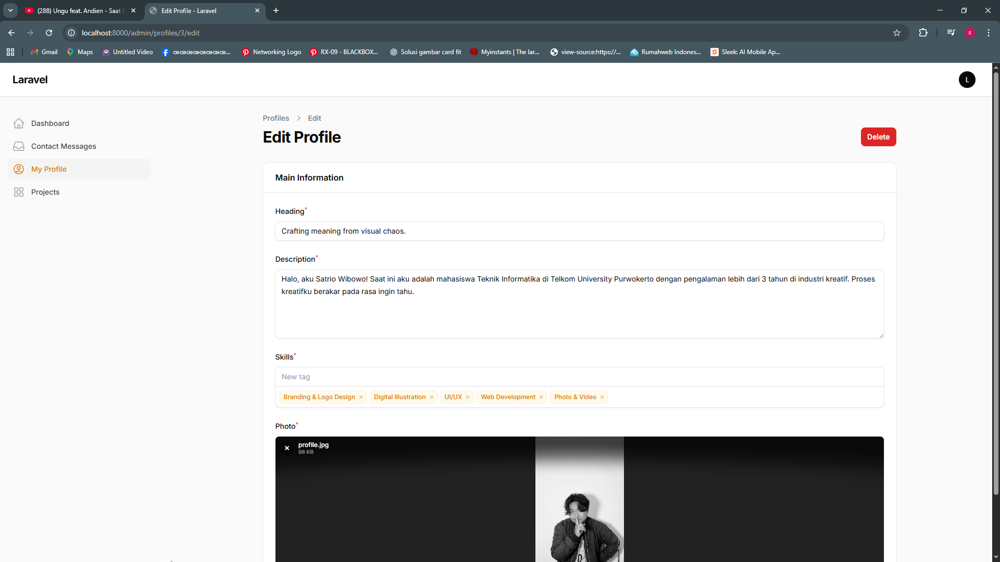
</p>

### G. Dashboard Admin — Projects (Filament)
Menu **Projects** menampilkan daftar semua proyek dengan filter kategori dan status featured. Form proyek mendukung manajemen media bertingkat menggunakan Repeater dengan drag-and-drop reordering berdasarkan `sort_order`.
 
<p>
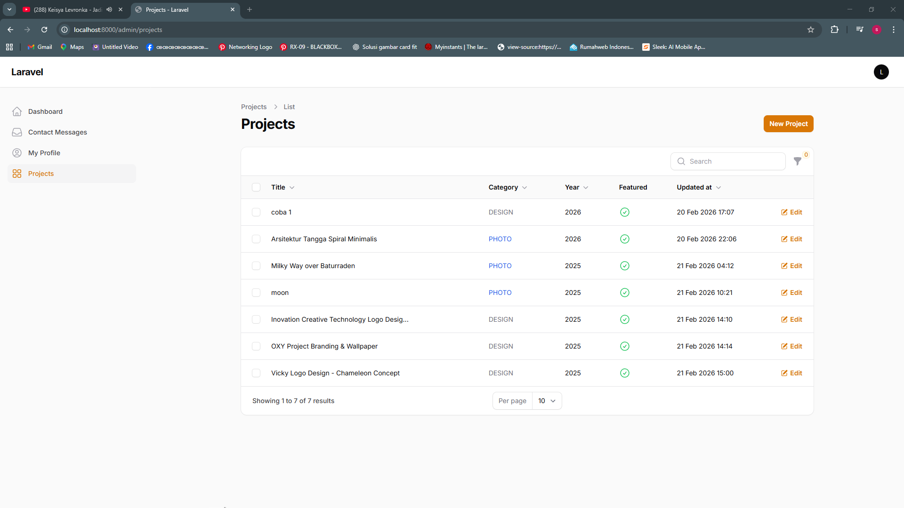
</p>

<p>
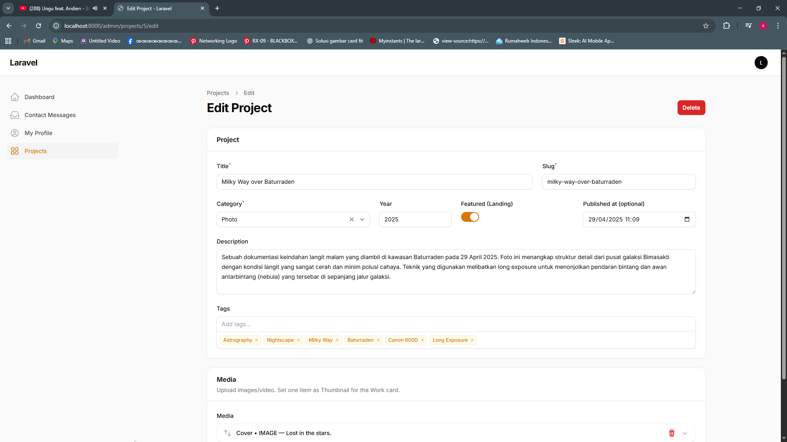
</p>

### H. Dashboard Admin — Contact Messages (Filament)
Menu **Contact Messages** menampilkan semua pesan yang masuk dari formulir kontak, diurutkan dari yang terbaru, dengan filter berdasarkan project type dan aksi view, edit, serta delete per baris.
 
<p>
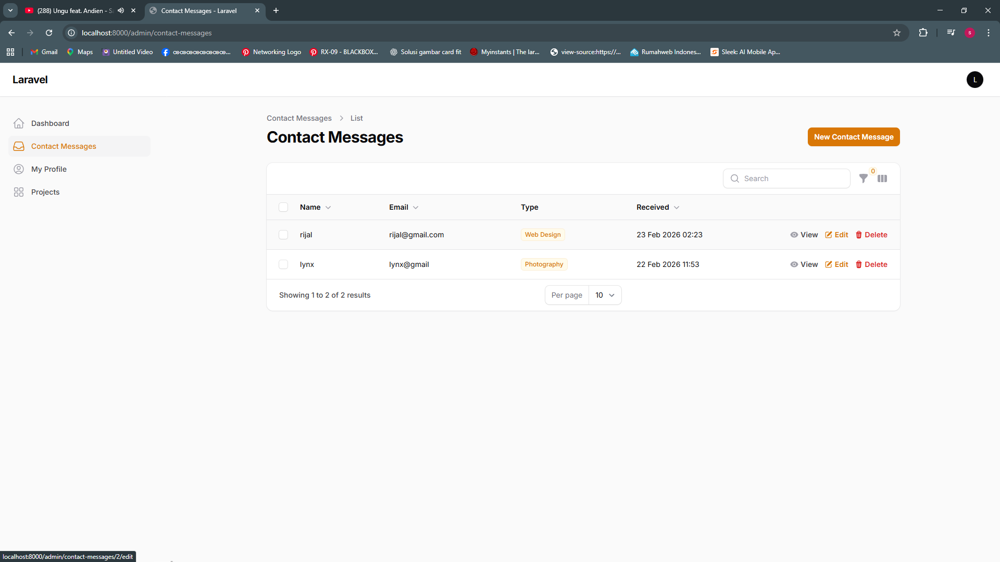
</p>

<p>
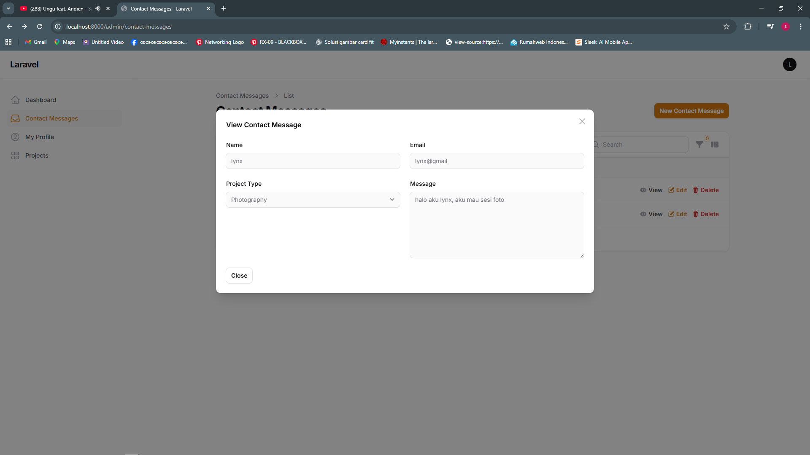
</p>

---
 
## 5. PEMBAHASAN SOURCE CODE
 
### A. Routing (`routes/web.php` dan `routes/api.php`)
Proyek OXY-LAB menggunakan dua berkas routing dengan peran berbeda. **`routes/web.php`** mendefinisikan halaman-halaman publik yang dirender oleh Blade: beranda (`/`), daftar karya (`/work`) dengan sistem pagination dan filter kategori via query string, serta detail proyek (`/work/{project:slug}`) menggunakan Route Model Binding otomatis Laravel. Route kontak (`POST /contact`) menerima data formulir dengan proteksi CSRF bawaan. **`routes/api.php`** mendefinisikan endpoint stateless `/api/portfolio-data` yang dikonsumsi oleh Fetch API dari sisi klien. Pemisahan ini menciptakan arsitektur yang bersih: halaman publik dikelola oleh `web.php`, sedangkan kebutuhan data asinkron dilayani oleh `api.php`.

### B. Filament Resources
 
**`ProfileResource`** mendefinisikan antarmuka CRUD untuk data diri pemilik portofolio. Form schema-nya mencakup `TextInput` untuk heading, `Textarea` untuk deskripsi, `TagsInput` untuk skills (disimpan sebagai JSON dan di-cast otomatis ke array PHP via `$casts`), dan `FileUpload` untuk foto profil dengan konfigurasi directory dan visibility. Karena data profil bersifat tunggal (*single record*), tabel hanya menyediakan `EditAction` tanpa bulk actions yang kompleks.
 
**`ProjectResource`** merupakan resource paling kompleks karena mencakup form bertingkat dengan `Repeater` untuk manajemen media. Slug dihasilkan secara otomatis dari judul melalui callback `afterStateUpdated` menggunakan `Str::slug()`. Field-field media (upload gambar, provider video, embed ID) muncul atau tersembunyi secara kondisional berdasarkan nilai field `type` menggunakan closure `hidden()`. Item media dapat diurutkan ulang melalui drag-and-drop bawaan Filament, dengan urutan disimpan pada kolom `sort_order`.
 
**`ContactMessageResource`** menampilkan pesan kontak yang masuk dari formulir publik, diurutkan dari yang terbaru (`defaultSort('created_at', 'desc')`). Tersedia filter berdasarkan `project_type`, serta aksi view, edit, dan delete per baris.
 
### C. Model (`app/Models/Profile.php` dan `app/Models/Project.php`)
Model `Profile` menggunakan `$casts` untuk mengkonversi kolom `skills` dari JSON di database menjadi array PHP secara otomatis, sehingga data skills dapat langsung diiterasi di frontend menggunakan `x-for` Alpine.js tanpa parsing manual. Model `Project` mendefinisikan dua relasi: `media()` (HasMany) yang mengembalikan semua media diurutkan berdasarkan `sort_order`, dan `thumbnail()` (HasOne) yang memfilter hanya media dengan `role = 'thumbnail'`. Eager loading `with('media')` digunakan pada setiap query untuk menghindari masalah N+1 query saat data dikembalikan melalui API.
 
### D. Implementasi AJAX (Alpine.js + Fetch API)
Komponen Alpine.js pada Work Section dan About Section menggunakan pola yang sama: `x-data` mendefinisikan state awal (`loading: true`, array kosong untuk data), kemudian fungsi `init()` (dipanggil otomatis oleh Alpine.js) menjalankan Fetch API ke `/api/portfolio-data` secara asinkron. Setelah respons diterima, state diperbarui secara reaktif dan Alpine.js secara otomatis merender ulang seluruh bagian DOM yang bergantung pada state tersebut — tombol filter kategori, grid proyek, dan data profil — tanpa reload halaman. Computed property `columns` pada Work Section mendistribusikan proyek ke dalam kolom Masonry menggunakan algoritma *round-robin* (`proyek ke-i → kolom i % numCols`) berdasarkan lebar viewport saat itu.
 
### E. Struktur Folder
```text
oxy-lab/
├── app/
│   ├── Filament/
│   │   └── Resources/
│   │       ├── ProfileResource.php         (CRUD data profil)
│   │       ├── ProjectResource.php         (CRUD proyek + media repeater)
│   │       └── ContactMessageResource.php  (inbox pesan kontak)
│   ├── Http/
│   │   └── Controllers/
│   │       └── ContactController.php       (simpan pesan kontak ke DB)
│   └── Models/
│       ├── Profile.php                     (model profil + cast JSON skills)
│       ├── Project.php                     (model proyek + relasi media)
│       ├── ProjectMedia.php                (model media proyek)
│       └── ContactMessage.php              (model pesan kontak)
├── database/
│   └── migrations/
│       ├── ..._create_users_table.php
│       ├── ..._create_profiles_table.php
│       ├── ..._add_details_to_profiles_table.php
│       ├── ..._create_contact_messages_table.php
│       └── ..._create_media_table.php
├── resources/
│   └── views/
│       ├── pages/
│       │   ├── home.blade.php              (landing page utama)
│       │   ├── work.blade.php              (daftar karya + pagination)
│       │   └── work-detail.blade.php       (detail proyek)
│       └── partials/
│           ├── hero.blade.php
│           ├── about.blade.php             (AJAX: data profil)
│           └── contact.blade.php           (formulir kontak + validasi)
├── routes/
│   ├── web.php                             (halaman publik)
│   └── api.php                             (endpoint AJAX /api/portfolio-data)
└── .env                                    (konfigurasi database & aplikasi)
```
 
---
 
## 6. KESIMPULAN
 
Pada pengimplementasian modul ini, praktikan berhasil membangun aplikasi portofolio digital dinamis berbasis web menggunakan kombinasi **Laravel 12**, **Filament v3**, **Alpine.js**, dan **Tailwind CSS**. Berbeda dengan pendekatan MVC konvensional yang mengandalkan Controller untuk CRUD, proyek ini memanfaatkan **Filament Resource** sebagai pengganti controller administratif yang sekaligus menyediakan antarmuka manajemen konten yang lengkap tanpa penulisan kode berulang.
 
Syarat utama praktikum — data tidak ditampilkan secara langsung — berhasil dipenuhi melalui implementasi **AJAX berbasis Fetch API** yang dipadukan dengan **Alpine.js**. Data profil dan proyek diambil secara asinkron dari endpoint RESTful `GET /api/portfolio-data` setelah halaman dimuat, menciptakan pemisahan tegas antara layer presentasi (frontend) dan layer data (backend API). Sistem filter kategori yang dihasilkan sepenuhnya dari data database, Masonry Grid responsif, loading state, Dark Mode, serta formulir kontak dengan validasi server-side melengkapi fungsionalitas portofolio sebagai produk yang siap digunakan. Kesimpulannya, kombinasi Laravel 12 sebagai backend API dan Filament v3 sebagai panel admin terbukti mempermudah pengelolaan portofolio digital yang dinamis, interaktif, dan mudah dikembangkan tanpa reload halaman.
 
---
 
## 7. REFERENSI
 
1. Laravel Framework Documentation, Release 12.x. Retrieved from https://laravel.com/docs/12.x
2. Filament PHP Documentation v3. Retrieved from https://filamentphp.com/docs/3.x
3. Alpine.js Documentation. Retrieved from https://alpinejs.dev
4. Tailwind CSS Documentation v4. Retrieved from https://tailwindcss.com/docs
5. MDN Web Docs — Fetch API. Retrieved from https://developer.mozilla.org/en-US/docs/Web/API/Fetch_API
6. MDN Web Docs — AJAX Getting Started. Retrieved from https://developer.mozilla.org/en-US/docs/Web/Guide/AJAX/Getting_Started
7. Laravel Eloquent: Relationships. Retrieved from https://laravel.com/docs/12.x/eloquent-relationships
8. Spatie Laravel Media Library Documentation. Retrieved from https://spatie.be/docs/laravel-medialibrary