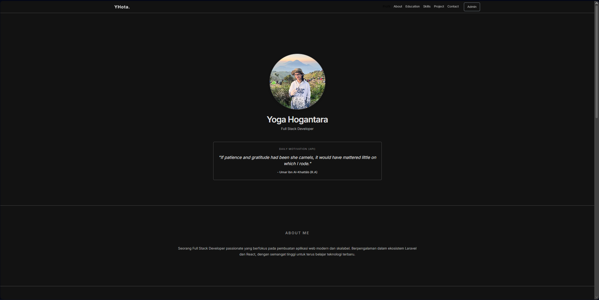
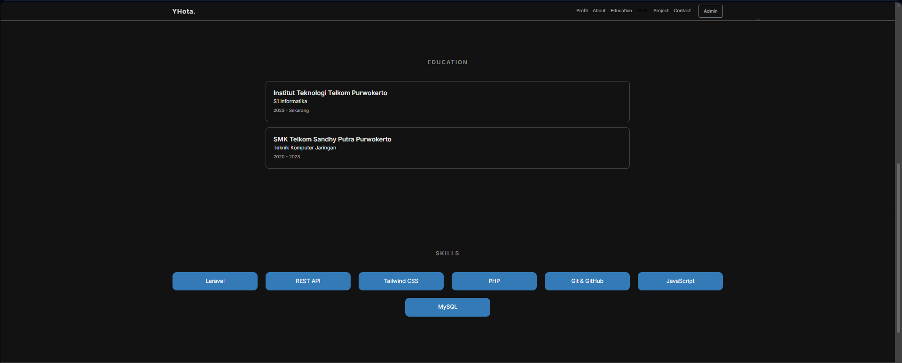
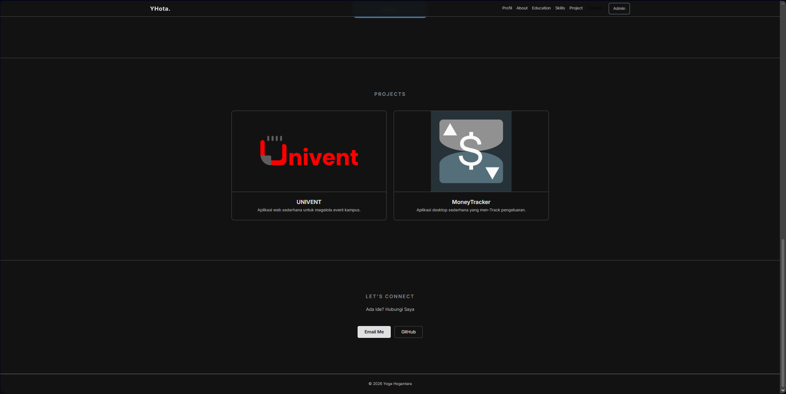
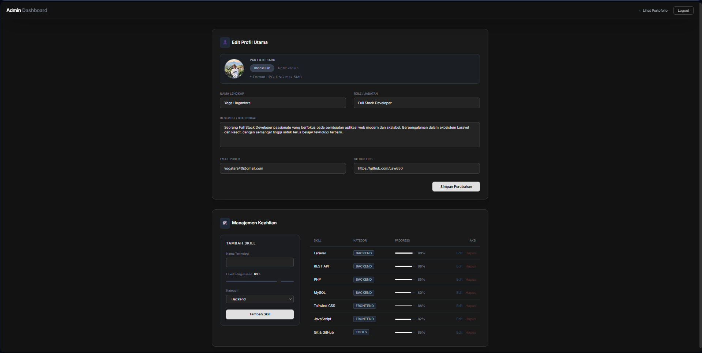

<div align="center">
  <br />
  <h1>LAPORAN PRAKTIKUM <br>APLIKASI BERBASIS PLATFORM</h1>
  <br />
  <h3>UTS <br> PORTOFOLIO</h3>
  <br />
  <br />
   
  <br />
  <br />
  <br />
  <h3>Disusun Oleh :</h3>
  <p>
    <strong>Yoga Hogantara</strong><br>
    <strong>2311102153</strong><br>
    <strong>S1 IF-11-01</strong>
  </p>
  <br />
  <h3>Dosen Pengampu :</h3>
  <p>
    <strong>Dimas Fanny Hebrasianto Permadi, S.ST., M.Kom</strong>
  </p>
  <br />
  <br />
    <h4>Asisten Praktikum :</h4>
    <strong> Apri Pandu Wicaksono </strong> <br>
    <strong>Rangga Pradarrell Fathi</strong>
  <br />
  <h3>LABORATORIUM HIGH PERFORMANCE
 <br>FAKULTAS INFORMATIKA <br>UNIVERSITAS TELKOM PURWOKERTO <br>2026</h3>
</div>

---

## 1. Web Portofolio Dinamis Berbasis Laravel

Laporan ini mendokumentasikan pembuatan aplikasi website portofolio pribadi yang interaktif dan dinamis menggunakan framework Laravel. Website ini terdiri dari halaman *landing page* (publik) untuk menampilkan informasi portofolio dan *dashboard* admin (privat) untuk mengelola konten secara langsung melalui mekanisme CRUD (Create, Read, Update, Delete) dan REST API.

---

## 2. Dasar Teori

Pembuatan aplikasi web portofolio ini didasarkan pada beberapa teknologi dan konsep pengembangan web modern:

1. **Laravel (PHP Framework)**
   Laravel adalah kerangka kerja aplikasi web berbasis PHP yang menggunakan arsitektur MVC (Model-View-Controller). Laravel mempermudah proses *routing*, manajemen *database* (melalui ORM Eloquent), autentikasi, dan manipulasi *session*.
2. **Arsitektur MVC (Model-View-Controller)**
   Pola desain arsitektur perangkat lunak yang memisahkan aplikasi menjadi tiga komponen utama:
   * **Model:** Mengelola data dan logika bisnis (contoh: interaksi dengan tabel `profiles` dan `skills`).
   * **View:** Mengelola tampilan antarmuka (UI) menggunakan *template engine* Blade.
   * **Controller:** Menghubungkan Model dan View, memproses *request* dari pengguna, dan mengirimkan *response*.
3. **RESTful API & Fetch API (AJAX)**
   Proyek ini mengimplementasikan penyediaan antarmuka pemrograman aplikasi (API) internal yang merespons dengan format JSON. Di sisi *client*, JavaScript `fetch()` digunakan untuk mengambil data dari API tersebut secara asinkron (AJAX) untuk memanipulasi DOM tanpa harus memuat ulang seluruh halaman.
4. **Tailwind CSS & Bootstrap 5**
   Proyek ini menggunakan dua *framework* CSS:
   * **Tailwind CSS:** Digunakan pada halaman *dashboard* admin untuk pendekatan *utility-first* yang mempercepat penyusunan antarmuka kustom (termasuk *dark mode*).
   * **Bootstrap 5:** Digunakan pada halaman *landing page* untuk memanfaatkan sistem *grid* dan komponen responsif secara cepat.

---

## 3. Penjelasan Kode

Aplikasi ini dibagi menjadi beberapa bagian utama: *Database*, *Routing*, *Controller*, dan *View*. Berikut adalah penjelasan dari masing-masing kode pembangunnya:

### 3.1 Database (Migrations & Seeder)
#### create_profiles_tables.php
```php
<?php

use Illuminate\Database\Migrations\Migration;
use Illuminate\Database\Schema\Blueprint;
use Illuminate\Support\Facades\Schema;

return new class extends Migration
{
    /**
     * Run the migrations.
     */
    public function up(): void
    {
        Schema::create('profiles', function (Blueprint $table) {
            $table->id();
            $table->string('nama');
            $table->string('role');
            $table->text('deskripsi');
            $table->string('path_foto')->nullable();
            $table->string('email')->nullable();
            $table->string('github')->nullable();
            $table->string('linkedin')->nullable();
            $table->timestamps();
        });
    }

    /**
     * Reverse the migrations.
     */
    public function down(): void
    {
        Schema::dropIfExists('profiles');
    }

};

```
#### create_skills_tables.php
```php
<?php

use Illuminate\Database\Migrations\Migration;
use Illuminate\Database\Schema\Blueprint;
use Illuminate\Support\Facades\Schema;

return new class extends Migration
{
    /**
     * Run the migrations.
     */
    public function up(): void
    {
        Schema::create('skills', function (Blueprint $table) {
            $table->id();
            $table->string('nama_skill');
            $table->unsignedTinyInteger('level'); // 0-100
            $table->string('kategori')->default('Technical'); // Technical / Soft Skill
            $table->timestamps();
        });
    }

    /**
     * Reverse the migrations.
     */
    public function down(): void
    {
        Schema::dropIfExists('skills');
    }
};

```
* **`create_profiles_table.php` & `create_skills_table.php`:**
  File *migration* ini mendefinisikan struktur tabel untuk menyimpan data. Tabel `profiles` menyimpan informasi identitas seperti nama, role, bio, URL foto, email, dan *link* sosial media. Tabel `skills` menyimpan data keahlian (nama, persentase penguasaan, dan kategori).
#### DatabaseSeeder.php

```php
<?php

namespace Database\Seeders;

use App\Models\Profile;
use App\Models\Skill;
use App\Models\User;
use Illuminate\Database\Seeder;
use Illuminate\Support\Facades\Hash;

class DatabaseSeeder extends Seeder
{
    public function run(): void
    {
        // Admin User
        User::updateOrCreate(
            ['email' => 'admin@porto.com'],
            [
                'name'     => 'Admin',
                'email'    => 'admin@porto.com',
                'password' => Hash::make('123456789'),
            ]
        );

        // Profile
        Profile::create([
            'nama'      => 'Yoga Hogantara',
            'role'      => 'Full Stack Developer',
            'deskripsi' => 'Seorang Full Stack Developer passionate yang berfokus pada pembuatan aplikasi web modern dan skalabel. Berpengalaman dalam ekosistem Laravel dan React, dengan semangat tinggi untuk terus belajar teknologi terbaru.',
            'email'     => 'yogatara40@gmail.com',
            'github'    => 'https://github.com/Law650',
            'linkedin'  => 'https://linkedin.com/in/yogahogantara',
            'path_foto' => null,
        ]);

        // Skills
        $skills = [
            ['nama_skill' => 'Laravel',      'level' => 90, 'kategori' => 'Backend'],
            ['nama_skill' => 'PHP',           'level' => 85, 'kategori' => 'Backend'],
            ['nama_skill' => 'MySQL',         'level' => 80, 'kategori' => 'Backend'],
            ['nama_skill' => 'Vue.js',        'level' => 75, 'kategori' => 'Frontend'],
            ['nama_skill' => 'Tailwind CSS',  'level' => 88, 'kategori' => 'Frontend'],
            ['nama_skill' => 'JavaScript',    'level' => 82, 'kategori' => 'Frontend'],
            ['nama_skill' => 'Git & GitHub',  'level' => 85, 'kategori' => 'Tools'],
            ['nama_skill' => 'REST API',      'level' => 88, 'kategori' => 'Backend'],
        ];

        foreach ($skills as $skill) {
            Skill::create($skill);
        }
    }
}
```
* **`DatabaseSeeder.php`:**
  Berfungsi untuk mengisi data awal (*dummy data*) ke dalam *database* secara otomatis. File ini akan membuatkan akun admin (`admin@porto.com`), profil *default*, serta beberapa daftar *skill* awal.

### 3.2 Routing (`routes/web.php`)
#### web.php
```php
<?php

use App\Http\Controllers\AdminController;
use App\Http\Controllers\Api\PortfolioController;
use Illuminate\Support\Facades\Route;

Route::get('/', fn() => view('welcome'))->name('home');

Route::get('/api/profile', [PortfolioController::class, 'profile']);
Route::get('/api/skills',  [PortfolioController::class, 'skills']);

// Auth routes (Laravel Breeze/default)
require __DIR__ . '/auth.php';

// Admin Routes
Route::middleware('auth')->prefix('admin')->name('admin.')->group(function () {
    Route::get('/dashboard',            [AdminController::class, 'dashboard'])->name('dashboard');
    Route::post('/profile',             [AdminController::class, 'updateProfile'])->name('profile.update');
    Route::get('/skills/{skill}/edit',  [AdminController::class, 'editSkill'])->name('skills.edit');
    Route::put('/skills/{skill}',       [AdminController::class, 'updateSkill'])->name('skills.update');
    Route::post('/skills',              [AdminController::class, 'storeSkill'])->name('skills.store');
    Route::delete('/skills/{skill}',    [AdminController::class, 'destroySkill'])->name('skills.destroy');
});
```

File ini memetakan URL yang diakses oleh pengguna ke fungsi *controller* yang sesuai.
* **Web Route:** `/` mengarah ke halaman utama (landing page).
* **API Route:** `/api/profile` dan `/api/skills` disediakan tanpa autentikasi (publik) agar bisa dibaca oleh halaman *landing page* melalui *fetch* JavaScript.
* **Admin Route:** Rute yang dikelompokkan dengan *prefix* `/admin` dan dilindungi oleh *middleware* `auth`. Hanya pengguna yang sudah *login* yang bisa mengakses rute ini untuk mengelola *dashboard*, mengedit profil, dan mengubah *skill*.

### 3.3 Controllers
#### AdminController.php
```php
<?php

namespace App\Http\Controllers;

use App\Models\Profile;
use App\Models\Skill;
use Illuminate\Http\Request;
use Illuminate\Support\Facades\Storage;

class AdminController extends Controller
{
    public function dashboard()
    {
        $profile = Profile::first();
        $skills  = Skill::orderBy('kategori')->orderBy('level', 'desc')->get();
        return view('admin.dashboard', compact('profile', 'skills'));
    }

    // ── Profile ──────────────────────────────────────────────
    public function updateProfile(Request $request)
    {
        $request->validate([
            'nama'      => 'required|string|max:255',
            'role'      => 'required|string|max:255',
            'deskripsi' => 'required|string',
            'email'     => 'nullable|email',
            'github'    => 'nullable|url',
            'linkedin'  => 'nullable|url',
            'foto'      => 'nullable|image|mimes:jpg,jpeg,png,webp|max:5120',
        ]);

        $profile = Profile::firstOrNew([]);
        $profile->fill($request->only(['nama', 'role', 'deskripsi', 'email', 'github', 'linkedin']));

        if ($request->hasFile('foto')) {
            // Hapus foto lama
            if ($profile->path_foto) {
                Storage::disk('public')->delete($profile->path_foto);
            }
            $profile->path_foto = $request->file('foto')->store('profile', 'public');
        }

        $profile->save();

        return redirect()->route('admin.dashboard')->with('success', 'Profil berhasil diperbarui!');
    }

    // ── Skills ────────────────────────────────────────────────
    public function storeSkill(Request $request)
    {
        $request->validate([
            'nama_skill' => 'required|string|max:100',
            'level'      => 'required|integer|min:1|max:100',
            'kategori'   => 'required|string|max:50',
        ]);

        Skill::create($request->only(['nama_skill', 'level', 'kategori']));

        return redirect()->route('admin.dashboard')->with('success', 'Skill berhasil ditambahkan!');
    }

    public function editSkill(Skill $skill)
    {
        $profile = Profile::first();
        $skills  = Skill::orderBy('kategori')->orderBy('level', 'desc')->get();
        return view('admin.dashboard', compact('profile', 'skills', 'skill'));
    }

    public function updateSkill(Request $request, Skill $skill)
    {
        $request->validate([
            'nama_skill' => 'required|string|max:100',
            'level'      => 'required|integer|min:1|max:100',
            'kategori'   => 'required|string|max:50',
        ]);

        $skill->update($request->only(['nama_skill', 'level', 'kategori']));

        return redirect()->route('admin.dashboard')->with('success', 'Skill berhasil diperbarui!');
    }

    public function destroySkill(Skill $skill)
    {
        $skill->delete();
        return redirect()->route('admin.dashboard')->with('success', 'Skill berhasil dihapus!');
    }
}
```
* **`AdminController.php`:**
  Berfungsi sebagai otak dari halaman admin. Memiliki metode-metode untuk operasi CRUD:
  * `dashboard()`: Memuat data profil dan daftar *skill* untuk dirender di halaman admin.
  * `updateProfile()`: Menangani validasi dan pembaruan data profil. Controller ini juga menggunakan `Storage` *facade* untuk menangani proses unggah foto (menghapus foto lama dan menyimpan foto baru di direktori *public*).
  * `storeSkill()`, `editSkill()`, `updateSkill()`, `destroySkill()`: Menangani siklus hidup penambahan, pengubahan, dan penghapusan data keahlian (*skill*).

#### PortofolioController.php
```php
<?php

namespace App\Http\Controllers\Api;

use App\Http\Controllers\Controller;
use App\Models\Profile;
use App\Models\Skill;
use Illuminate\Http\JsonResponse;

class PortfolioController extends Controller
{
    public function profile(): JsonResponse
    {
        $profile = Profile::first();

        if (!$profile) {
            return response()->json(['message' => 'Profile not found'], 404);
        }

        $data = $profile->toArray();
        $data['foto_url'] = $profile->path_foto
            ? asset('storage/' . $profile->path_foto)
            : null;

        return response()->json($data);
    }

    public function skills(): JsonResponse
    {
        $skills = Skill::orderBy('level', 'desc')->get();
        return response()->json($skills);
    }
}
```

* **`PortfolioController.php` (API):**
  Mengembalikan data *Profile* dan *Skill* langsung dari *database* ke dalam wujud JSON (`JsonResponse`). Pada `profile()`, dilakukan juga logika untuk membungkus jalur (*path*) foto menjadi URL lengkap menggunakan *helper* `asset()`.

### 3.4 Views (Antarmuka Pengguna)
#### dashboard.blade.php
```php
<!DOCTYPE html>
<html lang="id">
<head>
    <meta charset="UTF-8">
    <meta name="viewport" content="width=device-width, initial-scale=1.0">
    <title>Admin Dashboard — Portfolio</title>
    <script src="https://cdn.tailwindcss.com"></script>
    <link href="https://fonts.googleapis.com/css2?family=Inter:wght@300;400;600&display=swap" rel="stylesheet">
    
    <style>
        body {
            font-family: 'Inter', sans-serif;
            background-color: #121212;
            color: #E0E0E0;
        }

        .navbar-custom {
            background-color: rgba(18, 18, 18, 0.95);
            backdrop-filter: blur(10px);
            border-bottom: 1px solid #333333;
        }

        .card-minimal {
            background-color: #1a1a1a;
            border: 1px solid #333333;
            border-radius: 12px;
        }

        .input-custom {
            background-color: #242424;
            border: 1px solid #444444;
            color: #E0E0E0;
            transition: 0.3s;
        }

        .input-custom:focus {
            border-color: #888888;
            outline: none;
            background-color: #2d2d2d;
        }

        .btn-minimal {
            background-color: #E0E0E0;
            color: #121212;
            font-weight: 600;
            transition: 0.3s;
        }

        .btn-minimal:hover {
            background-color: #ffffff;
            transform: translateY(-2px);
        }

        .btn-outline-custom {
            border: 1px solid #444444;
            color: #B0B0B0;
            transition: 0.3s;
        }

        .btn-outline-custom:hover {
            border-color: #888888;
            color: #E0E0E0;
        }

        /* Custom scrollbar untuk dark mode */
        ::-webkit-scrollbar { width: 8px; }
        ::-webkit-scrollbar-track { background: #121212; }
        ::-webkit-scrollbar-thumb { background: #333; border-radius: 4px; }
        ::-webkit-scrollbar-thumb:hover { background: #444; }
    </style>
</head>
<body class="min-h-screen">

{{-- Navbar --}}
<nav class="navbar-custom sticky top-0 z-50 px-6 py-4 flex justify-between items-center shadow-2xl">
    <span class="text-xl font-bold tracking-tight text-white"> Admin <span class="text-gray-500">Dashboard</span></span>
    <div class="flex items-center gap-6">
        <a href="{{ route('home') }}" 
           class="text-sm text-gray-400 hover:text-white transition">← Lihat Portofolio</a>
        <form method="POST" action="{{ route('logout') }}">
            @csrf
            <button type="submit"
                    class="btn-outline-custom px-4 py-1.5 rounded-lg text-sm">
                Logout
            </button>
        </form>
    </div>
</nav>

<div class="max-w-6xl mx-auto px-4 py-10 space-y-10">

    {{-- Flash Message --}}
    @if(session('success'))
        <div class="bg-green-900/30 border border-green-500/50 text-green-400 px-6 py-3 rounded-xl flex justify-between items-center animate-pulse">
            <span class="text-sm font-medium">✅ {{ session('success') }}</span>
        </div>
    @endif

    {{-- SECTION: Edit Profile                       --}}

    <div class="card-minimal p-8 shadow-xl">
        <h2 class="text-lg font-semibold text-white mb-6 flex items-center gap-2">
            <span class="p-2 bg-gray-800 rounded-lg">👤</span> Edit Profil Utama
        </h2>

        <form action="{{ route('admin.profile.update') }}" method="POST" enctype="multipart/form-data">
            @csrf

            <div class="grid grid-cols-1 md:grid-cols-2 gap-8">
                {{-- Foto Preview --}}
                <div class="md:col-span-2 flex items-center gap-6 p-4 bg-gray-800/30 rounded-xl border border-gray-700/50">
                    path_foto ? Storage::url($profile->path_foto) : 'https://ui-avatars.com/api/?name=' . urlencode($profile?->nama ?? 'Admin') . '&background=333&color=fff&size=100' }}"
                         class="w-20 h-20 rounded-full object-cover border-2 border-gray-600 shadow-lg">
                    <div>
                        <label class="block text-xs font-semibold text-gray-400 uppercase tracking-wider mb-2">Pas Foto Baru</label>
                        <input type="file" name="foto" accept="image/*" onchange="previewFoto(event)"
                               class="text-xs text-gray-500 file:mr-4 file:py-2 file:px-4 file:rounded-full file:border-0 file:bg-gray-700 file:text-gray-300 file:cursor-pointer hover:file:bg-gray-600 transition">
                        <p class="text-[11px] text-gray-500 mt-2 font-medium tracking-wide">
                            * Format JPG, PNG max 5MB</p>       
                    </div>
                </div>

                <div class="space-y-2">
                    <label class="block text-xs font-semibold text-gray-500 uppercase">Nama Lengkap</label>
                    <input type="text" name="nama" value="{{ old('nama', $profile?->nama) }}" required
                           class="input-custom w-full rounded-lg px-4 py-2.5 text-sm">
                </div>

                <div class="space-y-2">
                    <label class="block text-xs font-semibold text-gray-500 uppercase">Role / Jabatan</label>
                    <input type="text" name="role" value="{{ old('role', $profile?->role) }}" required
                           class="input-custom w-full rounded-lg px-4 py-2.5 text-sm">
                </div>

                <div class="md:col-span-2 space-y-2">
                    <label class="block text-xs font-semibold text-gray-500 uppercase">Deskripsi / Bio Singkat</label>
                    <textarea name="deskripsi" rows="4" required
                              class="input-custom w-full rounded-lg px-4 py-2.5 text-sm resize-none">{{ old('deskripsi', $profile?->deskripsi) }}</textarea>
                </div>

                <div class="space-y-2">
                    <label class="block text-xs font-semibold text-gray-500 uppercase">Email Publik</label>
                    <input type="email" name="email" value="{{ old('email', $profile?->email) }}"
                           class="input-custom w-full rounded-lg px-4 py-2.5 text-sm">
                </div>

                <div class="space-y-2">
                    <label class="block text-xs font-semibold text-gray-500 uppercase">GitHub Link</label>
                    <input type="url" name="github" value="{{ old('github', $profile?->github) }}"
                           class="input-custom w-full rounded-lg px-4 py-2.5 text-sm">
                </div>
            </div>

            <div class="mt-8 flex justify-end">
                <button type="submit" class="btn-minimal px-8 py-2.5 rounded-lg text-sm shadow-lg">
                    Simpan Perubahan
                </button>
            </div>
        </form>
    </div>

    {{-- SECTION: Skills                             --}}
    <div class="card-minimal p-8 shadow-xl">
        <h2 class="text-lg font-semibold text-white mb-6 flex items-center gap-2">
            <span class="p-2 bg-gray-800 rounded-lg">🛠️</span> Manajemen Keahlian
        </h2>

        <div class="grid grid-cols-1 lg:grid-cols-3 gap-10">
            {{-- Form Tambah / Edit Skill --}}
            <div class="bg-gray-800/20 rounded-2xl p-6 border border-gray-700/50 h-fit">
                @isset($skill)
                    <h3 class="text-sm font-bold text-gray-300 mb-6 uppercase tracking-widest">Edit Skill</h3>
                    <form action="{{ route('admin.skills.update', $skill) }}" method="POST">
                        @csrf @method('PUT')
                @else
                    <h3 class="text-sm font-bold text-gray-300 mb-6 uppercase tracking-widest">Tambah Skill</h3>
                    <form action="{{ route('admin.skills.store') }}" method="POST">
                        @csrf
                @endisset

                <div class="space-y-5">
                    <div>
                        <label class="block text-xs font-semibold text-gray-500 mb-2">Nama Teknologi</label>
                        <input type="text" name="nama_skill" value="{{ old('nama_skill', $skill?->nama_skill ?? '') }}" required
                               class="input-custom w-full rounded-lg px-4 py-2 text-sm">
                    </div>
                    <div>
                        <label class="block text-xs font-semibold text-gray-500 mb-2">
                            Level Penguasaan: <span id="levelVal" class="text-white">{{ $skill?->level ?? 80 }}</span>%
                        </label>
                        <input type="range" name="level" min="1" max="100" value="{{ old('level', $skill?->level ?? 80) }}"
                               oninput="document.getElementById('levelVal').textContent = this.value"
                               class="w-full h-1.5 bg-gray-700 rounded-lg appearance-none cursor-pointer accent-white">
                    </div>
                    <div>
                        <label class="block text-xs font-semibold text-gray-500 mb-2">Kategori</label>
                        <select name="kategori" class="input-custom w-full rounded-lg px-4 py-2 text-sm">
                            @foreach(['Backend','Frontend','Mobile','Tools','Soft Skill'] as $kat)
                                <option value="{{ $kat }}" {{ old('kategori', $skill?->kategori ?? 'Backend') === $kat ? 'selected' : '' }}>
                                    {{ $kat }}
                                </option>
                            @endforeach
                        </select>
                    </div>
                </div>
                
                <button type="submit" class="btn-minimal mt-6 w-full py-2.5 rounded-lg text-sm">
                    {{ isset($skill) ? 'Update Skill' : 'Tambah Skill' }}
                </button>
                @isset($skill)
                    <a href="{{ route('admin.dashboard') }}" class="mt-3 block text-center text-xs text-gray-500 hover:text-gray-300 transition">Batal Edit</a>
                @endisset
                </form>
            </div>

            {{-- Tabel Skills --}}
            <div class="lg:col-span-2">
                <div class="overflow-x-auto">
                    <table class="w-full text-sm text-left">
                        <thead>
                            <tr class="text-gray-500 text-xs uppercase tracking-tighter border-b border-gray-800">
                                <th class="px-4 py-4 font-semibold">Skill</th>
                                <th class="px-4 py-4 font-semibold">Kategori</th>
                                <th class="px-4 py-4 font-semibold">Progress</th>
                                <th class="px-4 py-4 font-semibold text-right">Aksi</th>
                            </tr>
                        </thead>
                        <tbody class="divide-y divide-gray-800/50">
                            @forelse($skills as $s)
                            <tr class="hover:bg-white/5 transition-colors group">
                                <td class="px-4 py-4 font-medium text-gray-200">{{ $s->nama_skill }}</td>
                                <td class="px-4 py-4">
                                    <span class="text-[10px] bg-gray-800 text-gray-400 px-2 py-0.5 rounded border border-gray-700 uppercase font-bold">{{ $s->kategori }}</span>
                                </td>
                                <td class="px-4 py-4">
                                    <div class="flex items-center gap-3">
                                        <div class="w-20 bg-gray-800 rounded-full h-1">
                                            <div class="bg-white h-1 rounded-full" style="width:{{ $s->level }}%"></div>
                                        </div>
                                        <span class="text-[10px] text-gray-500 font-bold">{{ $s->level }}%</span>
                                    </div>
                                </td>
                                <td class="px-4 py-4 text-right">
                                    <div class="flex justify-end gap-3 opacity-30 group-hover:opacity-100 transition">
                                        <a href="{{ route('admin.skills.edit', $s) }}" class="text-blue-400 hover:text-blue-300">Edit</a>
                                        <form action="{{ route('admin.skills.destroy', $s) }}" method="POST" onsubmit="return confirm('Hapus skill ini?')">
                                            @csrf @method('DELETE')
                                            <button type="submit" class="text-red-500 hover:text-red-400">Hapus</button>
                                        </form>
                                    </div>
                                </td>
                            </tr>
                            @empty
                            <tr><td colspan="4" class="px-4 py-10 text-center text-gray-600 italic">Belum ada data skill yang ditambahkan.</td></tr>
                            @endforelse
                        </tbody>
                    </table>
                </div>
            </div>
        </div>
    </div>
</div>

<script>
function previewFoto(event) {
    const reader = new FileReader();
    reader.onload = () => document.getElementById('fotoPreview').src = reader.result;
    reader.readAsDataURL(event.target.files[0]);
}
</script>
</body>
</html>
```

* **`admin/dashboard.blade.php`:**
  Tampilan halaman admin yang di- *styling* dengan **Tailwind CSS**. Menggunakan skema warna gelap (*dark mode*). Terdapat form untuk memperbarui data profil (lengkap dengan fitur *preview* foto menggunakan JavaScript `FileReader`) serta tabel dinamis untuk menambah, mengedit, atau menghapus daftar *skill*.

#### welcome.blade.php
```php
<!DOCTYPE html>
<html lang="id">

<head>
    <meta charset="UTF-8">
    <meta name="viewport" content="width=device-width, initial-scale=1.0">
    <title>Yoga Hogantara - Portfolio</title>

    <link href="https://cdn.jsdelivr.net/npm/bootstrap@5.3.2/dist/css/bootstrap.min.css" rel="stylesheet">
    <link href="https://fonts.googleapis.com/css2?family=Inter:wght@300;400;600&display=swap" rel="stylesheet">

    <style>
        :root {
            --accent-blue: #0d6efd;
        }

        body {
            font-family: 'Inter', sans-serif;
            background-color: #121212;
            color: #E0E0E0;
            padding-top: 80px;
        }

        .text-muted {
            color: #B0B0B0 !important;
        }

        .navbar-custom {
            background-color: rgba(18, 18, 18, 0.95);
            backdrop-filter: blur(5px);
            border-bottom: 1px solid #444444;
        }

        .navbar-custom .nav-link {
            color: #B0B0B0;
            font-size: 0.9rem;
            transition: 0.3s;
        }

        .navbar-custom .nav-link:hover {
            color: #E0E0E0;
        }

        .navbar-custom .navbar-brand {
            color: #E0E0E0;
            letter-spacing: 1px;
        }

        .navbar-toggler {
            border-color: #444444 !important;
        }

        .navbar-toggler-icon {
            filter: invert(1);
        }

        .profile-img {
            width: 200px;
            height: 200px;
            object-fit: cover;
            border-radius: 50%;
            border: 1px solid #444444;
            box-shadow: 0 4px 15px rgba(0, 0, 0, 0.2);
        }

        section {
            padding: 90px 0;
        }

        .section-alt {
            background-color: #121212;
            border-top: 1px solid #444444;
            border-bottom: 1px solid #444444;
        }

        .section-title {
            font-size: 1.1rem;
            text-transform: uppercase;
            letter-spacing: 2px;
            color: #888888;
            margin-bottom: 3rem;
            font-weight: 600;
        }

        .card-minimal {
            border: 1px solid #444444;
            border-radius: 8px;
            transition: transform 0.3s ease, border-color 0.3s ease, box-shadow 0.3s ease;
            background-color: #121212;
            color: #E0E0E0;
        }

        .card-minimal:hover {
            transform: translateY(-5px);
            border-color: #888888;
        }

        #skills .card-minimal {
            background-color: #337ab7;
            border: none;
            border-radius: 10px;
            padding: 12px 15px;
        }

        #skills .card-minimal .fw-semibold {
            color: #ffffff !important;
            font-size: 1.1rem;
            font-weight: 400 !important;
        }

        #skills .card-minimal:hover {
            background-color: #286090;
            transform: translateY(-3px);
            box-shadow: 0 4px 10px rgba(0, 0, 0, 0.3);
        }

        .quote-box {
            border: 1px solid #444444;
            background-color: #121212;
        }

        .portofolio-img {
            width: 100%;
            height: 220px;
            object-fit: contain;
            object-position: center;
            border-bottom: 1px solid #444444;
        }

        .btn-minimal {
            background-color: #E0E0E0;
            color: #121212;
            border: 1px solid #E0E0E0;
            border-radius: 4px;
            transition: 0.3s;
            font-weight: 600;
            text-decoration: none;
        }

        .btn-minimal:hover {
            background-color: transparent;
            color: #E0E0E0;
        }

        .btn-outline-minimal {
            background-color: transparent;
            color: #E0E0E0;
            border: 1px solid #444444;
            border-radius: 4px;
            transition: 0.3s;
            text-decoration: none;
        }

        .btn-outline-minimal:hover {
            border-color: #888888;
            color: #E0E0E0;
        }

        /* Tambahan kecil untuk loading skeleton */
        .loading-text { opacity: 0.5; animation: pulse 1.5s infinite; }
        @keyframes pulse { 0% { opacity: 0.5; } 50% { opacity: 1; } 100% { opacity: 0.5; } }
    </style>
</head>

<body data-bs-spy="scroll" data-bs-target="#navbar">

    <nav id="navbar" class="navbar navbar-expand-lg navbar-custom fixed-top">
        <div class="container">
            <a class="navbar-brand fw-bold" href="#" id="nav-brand">YHota.</a>
            <button class="navbar-toggler border-0" type="button" data-bs-toggle="collapse" data-bs-target="#navbarNav">
                <span class="navbar-toggler-icon"></span>
            </button>
            <div class="collapse navbar-collapse" id="navbarNav">
                <ul class="navbar-nav ms-auto">
                    <li class="nav-item"><a class="nav-link" href="#header">Profil</a></li>
                    <li class="nav-item"><a class="nav-link" href="#about">About</a></li>
                    <li class="nav-item"><a class="nav-link" href="#education">Education</a></li>
                    <li class="nav-item"><a class="nav-link" href="#skills">Skills</a></li>
                    <li class="nav-item"><a class="nav-link" href="#portfolio">Project</a></li>
                    <li class="nav-item"><a class="nav-link" href="#contact">Contact</a></li>
                    <li class="nav-item ms-lg-3"><a class="nav-link border border-secondary rounded px-3" href="admin/dashboard">Admin</a></li>
                </ul>
            </div>
        </div>
    </nav>

    <section id="header" class="text-center mt-4">
        <div class="container">
            
            <h1 id="profile-name" class="fw-bold loading-text" style="letter-spacing: -1px; color: #E0E0E0;">Memuat Data...</h1>
            <p id="profile-role" class="text-muted mb-2 loading-text">Memuat Role...</p>
            
            <div class="mt-5 mx-auto p-4 rounded quote-box" style="max-width: 600px;">
                <p class="text-uppercase" style="font-size: 0.75rem; letter-spacing: 1px; color: #888888;">Daily
                    Motivation (API)</p>
                <p id="quote-text" class="fst-italic fs-5 mb-3" style="color: #E0E0E0;">Mencari kutipan...</p>
                <p id="quote-author" class="text-muted fw-bold mb-0" style="font-size: 0.9rem;"></p>
            </div>
        </div>
    </section>

    <section id="about" class="section-alt">
        <div class="container">
            <h2 class="text-center section-title">About Me</h2>
            <div class="row">
                <div class="col-md-8 mx-auto text-center text-muted" style="line-height: 1.8;">
                    <p id="about-desc" class="loading-text">Sedang memuat deskripsi dari database...</p>
                </div>
            </div>
        </div>
    </section>

    <section id="education" class="container">
        <h2 class="text-center section-title">Education</h2>
        <div class="row">
            <div class="col-md-8 mx-auto">
                <div class="p-4 card-minimal mb-3">
                    <h5 class="fw-bold mb-1">Institut Teknologi Telkom Purwokerto</h5>
                    <p class="mb-1">S1 Informatika</p>
                    <small class="text-muted">2023 - Sekarang</small>
                </div>
                <div class="p-4 card-minimal mb-3">
                    <h5 class="fw-bold mb-1">SMK Telkom Sandhy Putra Purwokerto</h5>
                    <p class="mb-1">Teknik Komputer Jaringan</p>
                    <small class="text-muted">2020 - 2023</small>
                </div>
            </div>
        </div>
    </section>

    <section id="skills" class="section-alt">
        <div class="container">
            <h2 class="text-center section-title">Skills</h2>
            <div id="skills-container" class="row text-center justify-content-center">
                <p class="text-muted loading-text">Memuat daftar keahlian...</p>
            </div>
        </div>
    </section>

    <section id="portfolio" class="container">
        <h2 class="text-center section-title">Projects</h2>
        <div class="row justify-content-center">
            <div class="col-md-4 mb-4">
                <div class="card-minimal h-100 overflow-hidden text-center">
                    
                    <div class="p-4">
                        <h5 class="fw-bold mb-2">UNIVENT</h5>
                        <p class="text-muted mb-0" style="font-size: 0.9rem;">Aplikasi web sederhana untuk megelola
                            event kampus.</p>
                    </div>
                </div>
            </div>
            <div class="col-md-4 mb-4">
                <div class="card-minimal h-100 overflow-hidden text-center">
                    
                    <div class="p-4">
                        <h5 class="fw-bold mb-2">MoneyTracker</h5>
                        <p class="text-muted mb-0" style="font-size: 0.9rem;">Aplikasi desktop sederhana yang men-Track
                            pengeluaran.</p>
                    </div>
                </div>
            </div>
        </div>
    </section>

    <section id="contact" class="section-alt">
        <div class="container text-center">
            <h2 class="section-title mb-4">Let's Connect</h2>
            <p class="text-muted mb-5">Ada ide? Hubungi Saya</p>
            <div>
                <a id="contact-email" href="#" class="btn btn-minimal px-4 py-2 d-inline-block me-2 mb-2">Email Me</a>
                <a id="contact-github" href="#" class="btn btn-outline-minimal px-4 py-2 d-inline-block mb-2" target="_blank">GitHub</a>
            </div>
        </div>
    </section>

    <footer class="text-center py-4 border-top" style="background-color: #121212; border-color: #444444 !important;">
        <p class="text-muted mb-0" style="font-size: 0.85rem;">&copy; <span id="footer-year"></span> <span id="footer-name">YHota.</span></p>
    </footer>

    <script src="https://cdn.jsdelivr.net/npm/bootstrap@5.3.2/dist/js/bootstrap.bundle.min.js"></script>

    <script>
        // 1. Script API Quote Bawaan
        function ambilQuoteMotivasi() {
            const apiURL = 'https://dummyjson.com/quotes/random';
            fetch(apiURL)
                .then(response => {
                    if (!response.ok) throw new Error('Jaringan bermasalah');
                    return response.json();
                })
                .then(data => {
                    document.getElementById('quote-text').innerText = `"${data.quote}"`;
                    document.getElementById('quote-author').innerText = `- ${data.author}`;
                })
                .catch(error => {
                    console.error('Error API:', error);
                    document.getElementById('quote-text').innerText = `"Simplicity is the ultimate sophistication."`;
                    document.getElementById('quote-author').innerText = "- Leonardo da Vinci";
                });
        }

        // 2. Script Ambil Data Profil dari Laravel
        async function loadProfile() {
            try {
                const response = await fetch('/api/profile');
                const data = await response.json();

                // Hapus efek loading
                document.getElementById('profile-name').classList.remove('loading-text');
                document.getElementById('profile-role').classList.remove('loading-text');
                document.getElementById('about-desc').classList.remove('loading-text');

                // Masukkan data ke HTML
                document.getElementById('profile-name').textContent = data.nama;
                document.getElementById('profile-role').textContent = data.role;
                document.getElementById('about-desc').textContent = data.deskripsi;
                document.getElementById('footer-name').textContent = data.nama;

                // Cek jika ada foto yang diupload via Admin
                if (data.foto_url) {
                    document.getElementById('profile-img').src = data.foto_url;
                }

                // Update Link Kontak
                if (data.email) {
                    document.getElementById('contact-email').href = `mailto:${data.email}`;
                }
                if (data.github) {
                    document.getElementById('contact-github').href = data.github;
                }

            } catch (error) {
                console.error('Gagal mengambil data profil:', error);
                document.getElementById('profile-name').textContent = "Gagal Memuat Data";
            }
        }

        // 3. Script Ambil Data Skills dari Laravel
        async function loadSkills() {
            try {
                const response = await fetch('/api/skills');
                const skills = await response.json();

                const container = document.getElementById('skills-container');
                container.innerHTML = ''; // Bersihkan container

                // Looping data skill dan gunakan struktur HTML card-minimal milikmu
                skills.forEach(skill => {
                    container.innerHTML += `
                        <div class="col-md-2 col-6 mb-4">
                            <div class="p-3 card-minimal">
                                <span class="fw-semibold">${skill.nama_skill}</span>
                            </div>
                        </div>
                    `;
                });

            } catch (error) {
                console.error('Gagal mengambil data skills:', error);
                document.getElementById('skills-container').innerHTML = '<p class="text-danger">Gagal memuat skill.</p>';
            }
        }

        // Jalankan semua fungsi saat halaman dimuat
        document.addEventListener('DOMContentLoaded', () => {
            document.getElementById('footer-year').textContent = new Date().getFullYear();
            ambilQuoteMotivasi();
            loadProfile();
            loadSkills();
        });
    </script>
</body>

</html>
```

* **`welcome.blade.php`:**
  Tampilan *landing page* (*frontend*) yang dilihat oleh pengunjung publik, didesain menggunakan **Bootstrap 5**. Halaman ini tidak me- *render* data langsung dari PHP, melainkan menampilkan status *loading* *(skeleton text)* dan memanggil fungsi JavaScript secara asinkron saat halaman dimuat (DOM Content Loaded):
  * `loadProfile()` dan `loadSkills()`: Memanggil *endpoint* internal Laravel (`/api/profile` dan `/api/skills`) untuk menempelkan data dinamis ke dalam elemen HTML.
  * `ambilQuoteMotivasi()`: Melakukan *fetch* ke *endpoint* API eksternal (`DummyJSON`) untuk menampilkan kutipan harian acak.

---

## 4. Hasil Tampilan (Screenshots) Aplikasi
### 4.1 Halaman Utama



### 4.2 CRUD Admin


## 5. Kesimpulan
Website portofolio personal ini berhasil memenuhi semua kriteria penugasan UTS dengan sangat baik. Seluruh spesifikasi teknis utama telah diterapkan secara utuh, mulai dari penggunaan framework Laravel, styling antarmuka menggunakan Tailwind CSS, sistem keamanan pada dashboard admin, hingga penerapan AJAX untuk memuat data secara asinkron tanpa perlu memuat ulang (reload) halaman. Hasil akhirnya bukan sekadar prototipe tugas kuliah biasa, melainkan sebuah website personal fungsional yang siap digunakan untuk mendukung profil profesional dan karier ke depannya.

## 6. Referensi

1. **Laravel Documentation:** Dokumentasi resmi kerangka kerja PHP untuk fitur routing, controller, eloquent ORM, dan storage. (https://laravel.com/docs)
2. **Tailwind CSS:** Dokumentasi framework CSS *utility-first* untuk penataan komponen dashboard admin. (https://tailwindcss.com/docs)
3. **Bootstrap 5:** Dokumentasi framework komponen antarmuka untuk desain halaman utama yang responsif. (https://getbootstrap.com/docs/5.3/)
4. **DummyJSON API:** Layanan penyedia API kutipan motivasi (*Random Quotes*). (https://dummyjson.com/docs/quotes)
5. **MDN Web Docs (Fetch API):** Dokumentasi mengenai penggunaan metode `fetch()` di JavaScript untuk pengambilan sumber daya secara asinkron. (https://developer.mozilla.org/en-US/docs/Web/API/Fetch_API)