<div align="center">
  <br />
  <h1>LAPORAN PRAKTIKUM <br>APLIKASI BERBASIS PLATFORM</h1>
  <br />
  <h3> Ujian UTS <br> Sistem Manajemen Portofolio Berbasis Web dengan Laravel </h3>
  <br />
   
  <br />
  <br />
  <br />
  <h3>Disusun Oleh :</h3>
  <p>
    <strong>Nisrina Amalia Iffatunnisa</strong><br>
    <strong>2311102156</strong><br>
    <strong>S1 IF-11-01</strong>
  </p>
  <br />
  <h3>Dosen Pengampu :</h3>
  <p>
    <strong>Dimas Fanny Hebrasianto Permadi, S.ST., M.Kom</strong>
  </p>
  <br />
  <br />
    <h4>Asisten Praktikum :</h4>
    <strong> Apri Pandu Wicaksono </strong> <br>
    <strong>Rangga Pradarrell Fathi</strong>
  <br />
  <h3>LABORATORIUM HIGH PERFORMANCE
 <br>FAKULTAS INFORMATIKA <br>UNIVERSITAS TELKOM PURWOKERTO <br>2026</h3>
</div>


## 1. Penjelasan Lengkap Pembuatan Proyek

### A. Inisialisasi Proyek Laravel
- Pembuatan Proyek: Proyek ini diinisialisasi menggunakan framework Laravel melalui sistem dependency manager Composer dengan perintah composer create-project laravel/laravel. Ini memberikan struktur dasar aplikasi web modern yang berbasis arsitektur MVC (Model-View-Controller). Perintah: `composer create-project laravel/laravel my-portfolio`
(Atau composer create-project laravel/laravel . jika sudah berada di dalam folder yang diinginkan). Fungsinya akan mengunduh dan menginstal struktur framework Laravel dari repositori resmi. Ini langsung menyiapkan arsitektur MVC (Model-View-Controller) dasar yang siap pakai.
- Konfigurasi Database: Aplikasi dihubungkan ke sistem database lokal (MySQL) melalui pengaturan kredensial di file .env sistem. File yang dimodifikasi: .env (berada di root folder proyek). Untuk menginstruksikan aplikasi Laravel untuk terhubung ke database MySQL lokal agar data portofolio bisa disimpan secara permanen.
- Autentikasi: Proyek ini memanfaatkan starter-kit autentikasi Laravel bawaan (seperti Laravel Breeze) untuk men-generate sistem registrasi, login, dan manajemen sesi (session) secara instan.

### B. Migrations (Struktur Basis Data)
Bertujuan membuat rancangan cetak biru (blueprint) tabel di database menggunakan kode PHP.

- Struktur database dirancang menggunakan fitur Migration (php artisan make:migration). Migration berfungsi sebagai kontrol versi (version-control) untuk struktur tabel di database. Perintah: </br>
php artisan make:migration create_profiles_table </br>
php artisan make:migration create_portfolios_table </br>
php artisan make:migration create_education_table </br>
php artisan make:migration create_skills_table</br>
File yang dihasilkan: Berada di folder database/migrations/ (misal: 2024_04_20_000000_create_portfolios_table.php).</br>
Fungsi: File ini berisi definisi kolom. Misalnya, di tabel portfolios, Anda akan mendefinisikan kolom untuk judul dangan tipe string, deskripsi dengan tipe text, dan gambar.</br>

- Pembuatan skema beberapa tabel utama meliputi:
profiles: Menyimpan informasi pribadi seperti nama, title, deskripsi "Tentang Saya", serta direktori gambar profil.
portfolios: Mengelola daftar mahakarya/proyek, meliputi atribut judul proyek, deskripsi detail, tautan (link), rentang tanggal, kategori, dan ilustrasi gambar penunjang.
education & skills: Menampung rekam jejak institusi pendidikan maupun daftar keterampilan/keahlian teknis secara berurutan.
- Setelah file disiapkan, eksekusi dilakukan dengan php artisan migrate agar tabel otomatis terbentuk di database.

### C. Model (Representasi Data)
Model adalah perantara yang menghubungkan logika aplikasi Anda dengan database. Perintah Pembuatan Model: (Bisa dijalankan satu per satu untuk fitur yang ada) </br>
php artisan make:model Profile </br>
php artisan make:model Portfolio </br>
php artisan make:model Education </br>
php artisan make:model Skill </br>
(Jika menggunakan php artisan make:model Portfolio -m, Laravel akan membuat Model dan file Migration sekaligus).</br>
File yang dihasilkan/dimodifikasi: Folder app/Models/ (misal: app/Models/Portfolio.php).</br>
Tindakan di dalam Model: Menambahkan properti $fillable. </br>
- File Model (seperti Profile.php, Portfolio.php, Education.php, dan Skill.php) yang terletak pada folder app/Models mendefinisikan representasi struktur interaksi ke tabel dalam ekosistem database.
- Masing-masing model dikonfigurasi atribut $fillable yang merinci kolom apa saja yang diizinkan untuk menerima input dan dimanipulasi melalui sistem. Fitur ini merupakan sistem pengamanan built-in dari teknik eksploitasi Mass Assignment Vulnerability.

### D. Controller & Routes (Alur dan Logika Bisnis)
Bagian ini adalah otak dari aplikasi. Route mengatur "URL ini akan menjalankan fitur apa", sedangkan Controller adalah tempat menulis logika "fitur apa" tersebut. Perintahnya adalah `php artisan make:controller PortfolioController`</br>
- Routes (routes/web.php): Berperan sebagai pusat lalu lintas URL (URL Dispatcher). Rute dibedakan menjadi dua area izin spesifik:
Public Routes: Mengarah ke Landing Page utama (view('welcome')) yang merupakan antarmuka diakses oleh para pengunjung.
Protected Routes: Rute untuk Dashboard Admin yang dibungkus oleh middleware auth sehingga tidak bisa diakses/dikunjungi tanpa terlebih dahulu login. Public Routes:
```php
Route::get('/', function () {
    // Logika memanggil data portofolio dari database
    return view('welcome', compact('portfolios'));
});
```
Fungsi: Jika ada yang mengakses URL dasar (misal: localhost:8000), maka tampilkan halaman depan (landing page/welcome) yang bebas dilihat siapa saja.
- Sistem CRUD (Create, Read, Update, Delete): Proses logika eksekusi ini diintegrasikan lewat fungsi atau langsung didelegasikan dari file rute tersebut. Hal ini mencakup: 

Create dan Update: Menerima request formulir ($request), menjalankan sistem validasi (seperti filter format string dan membatasi size gambar maksimal 2MB), lalu menyimpannya di file penyimpanan sistem lokal storage (store('public')), kemudian memanggil metode ::create() atau ->update() ke database. 
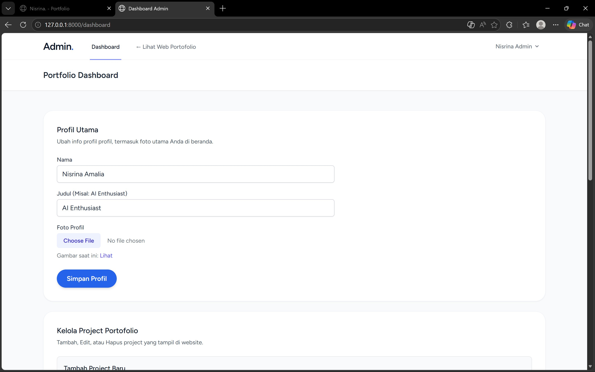
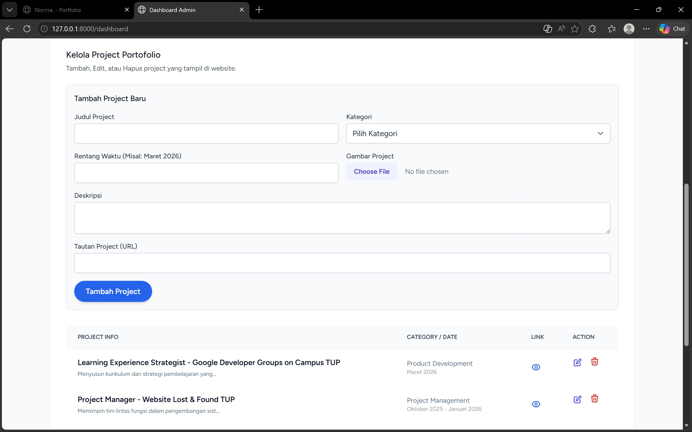
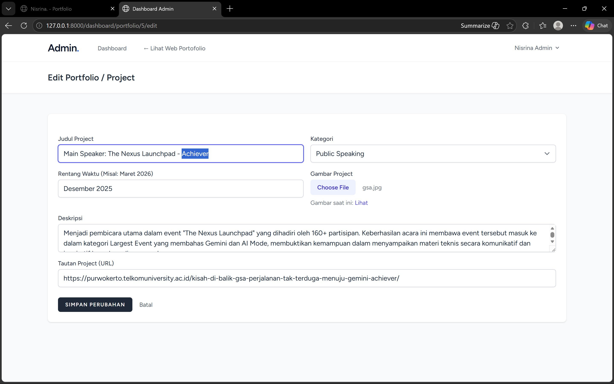
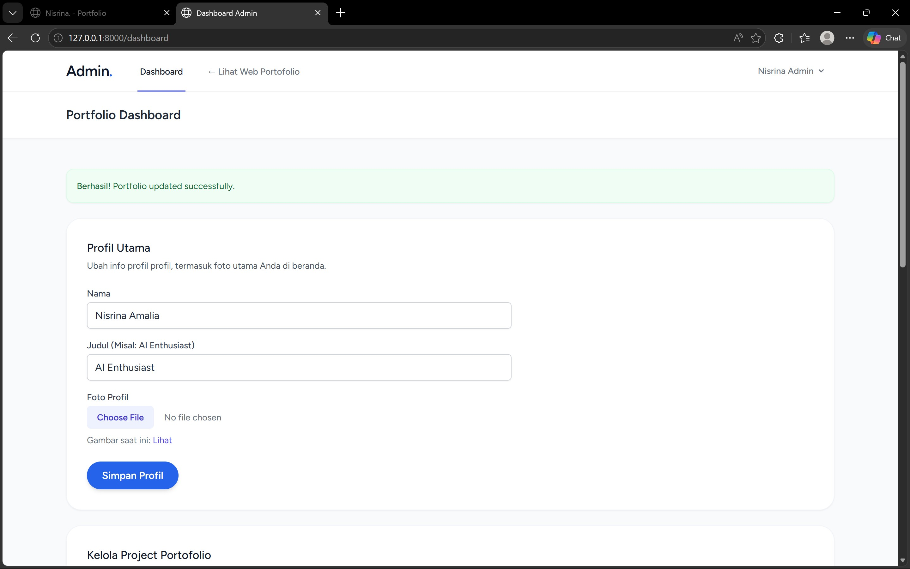
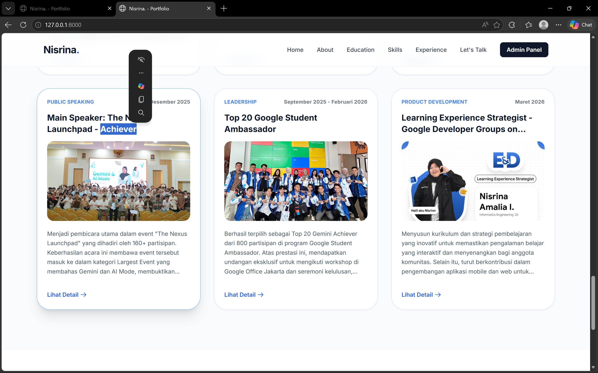


Dan Delete: Memanggil metode pencarian ::findOrFail($id) pada Model bersangkutan untuk menghapus entitas data portofolio terkait secara mutlak.
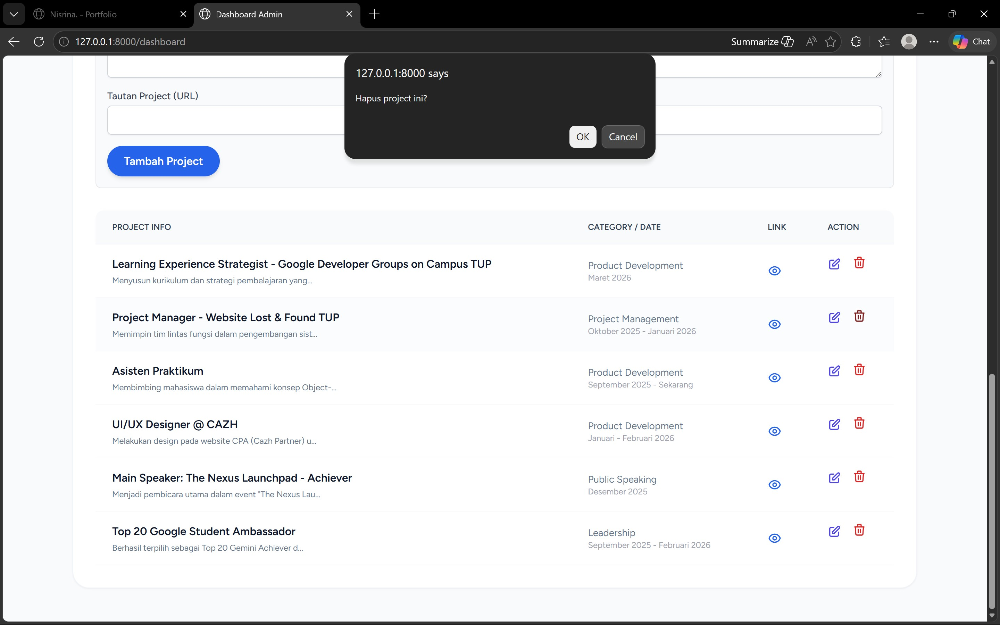


### E. Views (Antarmuka - Blade Templates)
- Antarmuka program dimodifikasi menggunakan template engine spesifik Laravel, yakni file ber-ekstensi Blade (.blade.php). Pembentukan gaya struktur dikoordinasi menggunakan Tailwind CSS untuk mempercepat desain tata letak UI yang responsif.
- Tampilan Admin (dashboard.blade.php dll): Difungsikan sebagai Control Panel tempat pemilik aplikasi melakukan submit form secara dinamis untuk mengelola halaman depan.
- Tampilan Publik (welcome.blade.php): Merupakan etalase portofolio tempat data diekstraksi ke publik. Interaktivitas dimaksimalkan dengan metode manipulasi AJAX / Vanilla Javascript yang berfungsi untuk menyajikan proyek-proyek spesifik dari database secara elegan dalam bentuk jendela detail (modal details) atau pop-up bagi para pengunjung website.
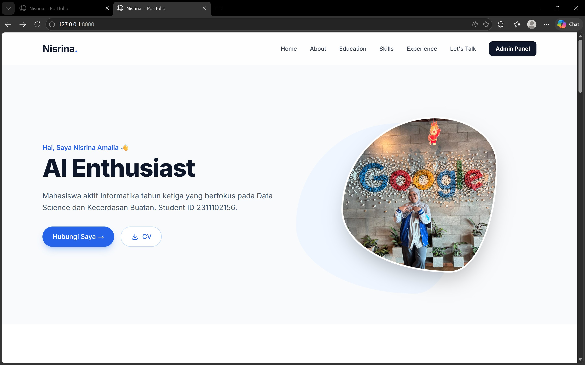
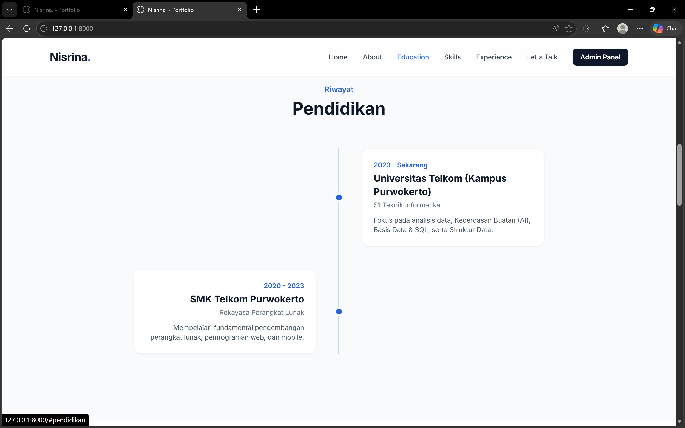
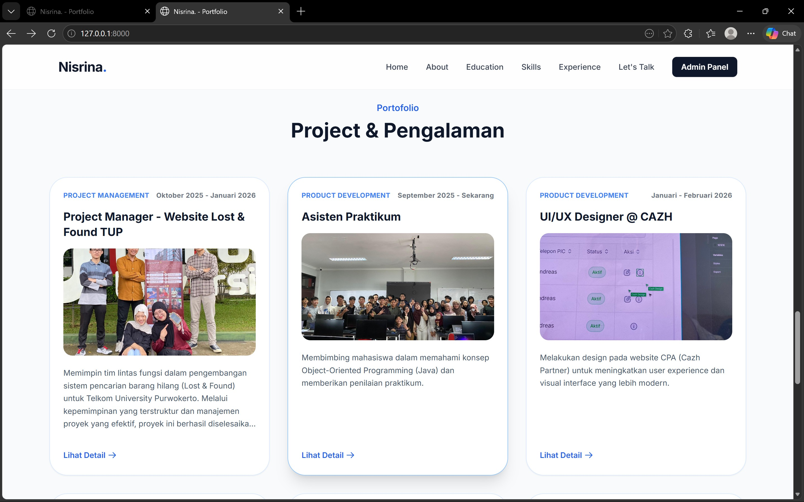
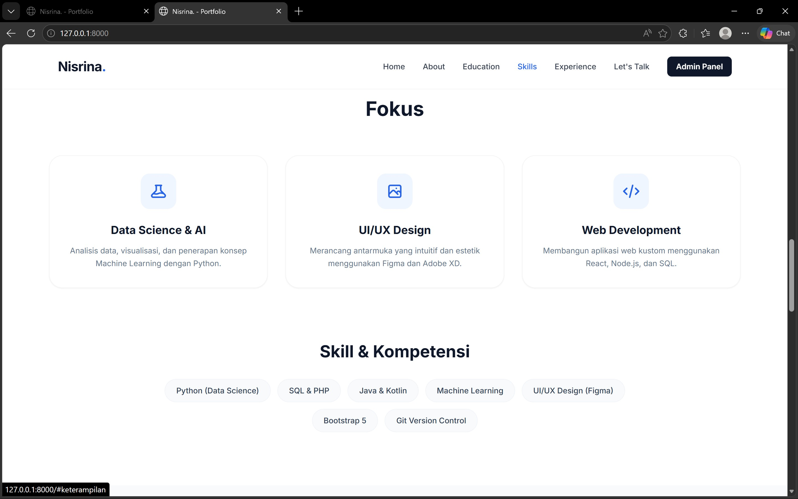
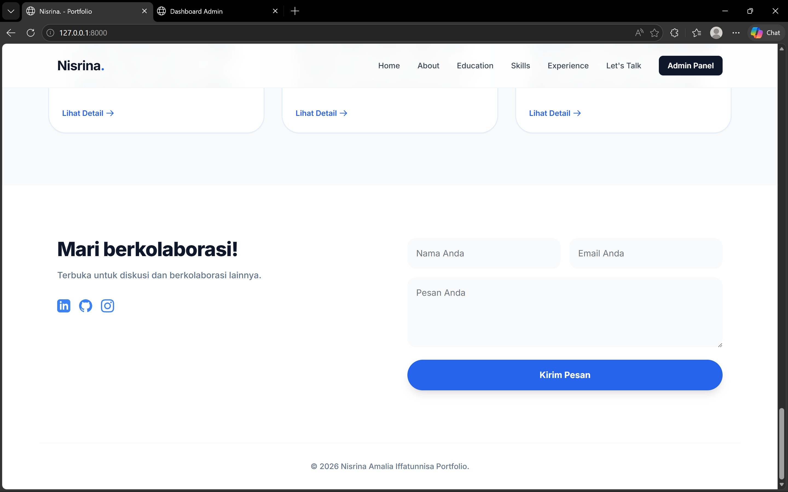

### F. Integrasi Fetch & Backend API (Sistem Tampil Data Dinamis)
Penerapan ini bertujuan mengambil data spesifik (misalnya detail satu portofolio) dari database via perantara (API) menggunakan JavaScript khusus di frontend.
- 1. Backend API (Penyedia Data) Berdasarkan cara kerjanya untuk melayani permintaan data otomatis. Routes (File Rute): Di dalam routes/web.php (maupun file khusus api.php)
- 2. Controller (Fungsi Ekstrak Data): Di dalam PortfolioController, fungsi membaca ID yang dikirimkan. Kemudian mencari data tersebut di database. Berbeda dari balasan biasa yang mengembalikan view('...') HTML, API di-set untuk membalas/melemparkan kembali menjadi JSON.

## 2. Sourcecode 

### Sourcecode ProfileController.php
``` PHP
<?php

namespace App\Http\Controllers;

use App\Http\Requests\ProfileUpdateRequest;
use Illuminate\Http\RedirectResponse;
use Illuminate\Http\Request;
use Illuminate\Support\Facades\Auth;
use Illuminate\Support\Facades\Redirect;
use Illuminate\View\View;

class ProfileController extends Controller
{
    /**
     * Display the user's profile form.
     */
    public function edit(Request $request): View
    {
        return view('profile.edit', [
            'user' => $request->user(),
        ]);
    }

    /**
     * Update the user's profile information.
     */
    public function update(ProfileUpdateRequest $request): RedirectResponse
    {
        $request->user()->fill($request->validated());

        if ($request->user()->isDirty('email')) {
            $request->user()->email_verified_at = null;
        }

        $request->user()->save();

        return Redirect::route('profile.edit')->with('status', 'profile-updated');
    }

    /**
     * Delete the user's account.
     */
    public function destroy(Request $request): RedirectResponse
    {
        $request->validateWithBag('userDeletion', [
            'password' => ['required', 'current_password'],
        ]);

        $user = $request->user();

        Auth::logout();

        $user->delete();

        $request->session()->invalidate();
        $request->session()->regenerateToken();

        return Redirect::to('/');
    }
}
```

### Sourcecode Model Portfolio.php
``` PHP
<?php

namespace App\Models;

use Illuminate\Database\Eloquent\Model;

class Portfolio extends Model
{
    protected $guarded = [];
}
```

### Sourcecode Model Profile.php
``` PHP
<?php

namespace App\Models;

use Illuminate\Database\Eloquent\Model;

class Profile extends Model
{
    protected $guarded = [];
}
```
### Sourcecode Model User.php
```PHP
<?php

namespace App\Models;

// use Illuminate\Contracts\Auth\MustVerifyEmail;
use Database\Factories\UserFactory;
use Illuminate\Database\Eloquent\Factories\HasFactory;
use Illuminate\Foundation\Auth\User as Authenticatable;
use Illuminate\Notifications\Notifiable;

class User extends Authenticatable
{
    /** @use HasFactory<UserFactory> */
    use HasFactory, Notifiable;

    /**
     * The attributes that are mass assignable.
     *
     * @var list<string>
     */
    protected $fillable = [
        'name',
        'email',
        'password',
    ];

    /**
     * The attributes that should be hidden for serialization.
     *
     * @var list<string>
     */
    protected $hidden = [
        'password',
        'remember_token',
    ];

    /**
     * Get the attributes that should be cast.
     *
     * @return array<string, string>
     */
    protected function casts(): array
    {
        return [
            'email_verified_at' => 'datetime',
            'password' => 'hashed',
        ];
    }
}
```

### Sourcecode web.php
```PHP
<?php

use App\Http\Controllers\ProfileController;
use Illuminate\Support\Facades\Route;

use App\Models\Profile;
use App\Models\Portfolio;
use App\Models\Education;
use App\Models\Skill;
use Illuminate\Http\Request;

Route::get('/', function () {
    return view('welcome');
});

Route::middleware(['auth', 'verified'])->group(function () {
    Route::get('/dashboard', function () {
        $profile = Profile::first();
        $portfolios = Portfolio::all();
        $education = Education::all();
        $skills = Skill::all();
        return view('dashboard', compact('profile', 'portfolios', 'education', 'skills'));
    })->name('dashboard');

    Route::post('/dashboard/profile', function (Request $request) {
        $validated = $request->validate([
            'name' => 'required|string',
            'title' => 'required|string',
            'description' => 'nullable|string',
            'about_description' => 'nullable|string',
            'image_url' => 'nullable|image|max:2048'
        ]);
        
        if ($request->hasFile('image_url')) {
            $path = $request->file('image_url')->store('profile', 'public');
            $validated['image_url'] = '/storage/' . $path;
        } else {
            unset($validated['image_url']);
        }

        $profile = Profile::first();
        $profile->update($validated);
        return back()->with('success', 'Profile updated successfully.');
    })->name('profile.update-data');

    // Portfolio Routes
    Route::post('/dashboard/portfolio', function (Request $request) {
        $validated = $request->validate([
            'title' => 'required|string',
            'category' => 'nullable|string',
            'date_range' => 'nullable|string',
            'description' => 'nullable|string',
            'image_url' => 'nullable|image|max:2048',
            'link' => 'nullable|string'
        ]);
        
        if ($request->hasFile('image_url')) {
            $path = $request->file('image_url')->store('portfolios', 'public');
            $validated['image_url'] = '/storage/' . $path;
        }

        Portfolio::create($validated);
        return back()->with('success', 'Portfolio created successfully.');
    })->name('portfolio.store');

    Route::get('/dashboard/portfolio/{id}/edit', function ($id) {
        $portfolio = Portfolio::findOrFail($id);
        return view('portfolio.edit', compact('portfolio'));
    })->name('portfolio.edit');

    Route::put('/dashboard/portfolio/{id}', function (Request $request, $id) {
        $validated = $request->validate([
            'title' => 'required|string',
            'category' => 'nullable|string',
            'date_range' => 'nullable|string',
            'description' => 'nullable|string',
            'image_url' => 'nullable|image|max:2048',
            'link' => 'nullable|string'
        ]);

        if ($request->hasFile('image_url')) {
            $path = $request->file('image_url')->store('portfolios', 'public');
            $validated['image_url'] = '/storage/' . $path;
        } else {
            unset($validated['image_url']);
        }

        Portfolio::findOrFail($id)->update($validated);
        return redirect()->route('dashboard')->with('success', 'Portfolio updated successfully.');
    })->name('portfolio.update');

    Route::delete('/dashboard/portfolio/{id}', function ($id) {
        Portfolio::findOrFail($id)->delete();
        return back()->with('success', 'Portfolio deleted successfully.');
    })->name('portfolio.destroy');

    // Education Routes
    Route::post('/dashboard/education', function (Request $request) {
        $validated = $request->validate([
            'period' => 'required|string',
            'institution' => 'required|string',
            'major' => 'required|string',
            'description' => 'nullable|string'
        ]);
        Education::create($validated);
        return back()->with('success', 'Education created successfully.');
    })->name('education.store');

    Route::get('/dashboard/education/{id}/edit', function ($id) {
        $education = Education::findOrFail($id);
        return view('education.edit', compact('education'));
    })->name('education.edit');

    Route::put('/dashboard/education/{id}', function (Request $request, $id) {
        $validated = $request->validate([
            'period' => 'required|string',
            'institution' => 'required|string',
            'major' => 'required|string',
            'description' => 'nullable|string'
        ]);
        Education::findOrFail($id)->update($validated);
        return redirect()->route('dashboard')->with('success', 'Education updated successfully.');
    })->name('education.update');

    Route::delete('/dashboard/education/{id}', function ($id) {
        Education::findOrFail($id)->delete();
        return back()->with('success', 'Education deleted successfully.');
    })->name('education.destroy');

    // Skill Routes
    Route::post('/dashboard/skill', function (Request $request) {
        $validated = $request->validate([
            'name' => 'required|string'
        ]);
        Skill::create($validated);
        return back()->with('success', 'Skill created successfully.');
    })->name('skill.store');

    Route::get('/dashboard/skill/{id}/edit', function ($id) {
        $skill = Skill::findOrFail($id);
        return view('skill.edit', compact('skill'));
    })->name('skill.edit');

    Route::put('/dashboard/skill/{id}', function (Request $request, $id) {
        $validated = $request->validate([
            'name' => 'required|string'
        ]);
        Skill::findOrFail($id)->update($validated);
        return redirect()->route('dashboard')->with('success', 'Skill updated successfully.');
    })->name('skill.update');

    Route::delete('/dashboard/skill/{id}', function ($id) {
        Skill::findOrFail($id)->delete();
        return back()->with('success', 'Skill deleted successfully.');
    })->name('skill.destroy');
});

Route::middleware('auth')->group(function () {
    Route::get('/profile', [ProfileController::class, 'edit'])->name('profile.edit');
    Route::patch('/profile', [ProfileController::class, 'update'])->name('profile.update');
    Route::delete('/profile', [ProfileController::class, 'destroy'])->name('profile.destroy');
});

require __DIR__.'/auth.php';
```

### Sourcecode navigation.blade.php
```PHP
<nav x-data="{ open: false }" class="bg-white border-b border-gray-100">
    <!-- Primary Navigation Menu -->
    <div class="max-w-7xl mx-auto px-4 sm:px-6 lg:px-8">
        <div class="flex justify-between h-16">
            <div class="flex">
                <!-- Logo -->
                <div class="shrink-0 flex items-center">
                    <a href="{{ route('dashboard') }}" class="text-2xl font-extrabold tracking-tight">
                        <span class="text-slate-900">Admin</span><span class="text-blue-600">.</span>
                    </a>
                </div>

                <!-- Navigation Links -->
                <div class="hidden space-x-8 sm:-my-px sm:ms-10 sm:flex">
                    <x-nav-link :href="route('dashboard')" :active="request()->routeIs('dashboard')">
                        {{ __('Dashboard') }}
                    </x-nav-link>
                    
                    <x-nav-link href="/">
                        &larr; Lihat Web Portofolio
                    </x-nav-link>
                </div>
            </div>

            <!-- Settings Dropdown -->
            <div class="hidden sm:flex sm:items-center sm:ms-6">
                <x-dropdown align="right" width="48">
                    <x-slot name="trigger">
                        <button class="inline-flex items-center px-3 py-2 border border-transparent text-sm leading-4 font-medium rounded-md text-gray-500 bg-white hover:text-gray-700 focus:outline-none transition ease-in-out duration-150">
                            <div>{{ Auth::user()->name ?? 'Admin' }}</div>

                            <div class="ms-1">
                                <svg class="fill-current h-4 w-4" xmlns="http://www.w3.org/2000/svg" viewBox="0 0 20 20">
                                    <path fill-rule="evenodd" d="M5.293 7.293a1 1 0 011.414 0L10 10.586l3.293-3.293a1 1 0 111.414 1.414l-4 4a1 1 0 01-1.414 0l-4-4a1 1 0 010-1.414z" clip-rule="evenodd" />
                                </svg>
                            </div>
                        </button>
                    </x-slot>

                    <x-slot name="content">
                        <x-dropdown-link :href="route('profile.edit')">
                            {{ __('Profile') }}
                        </x-dropdown-link>

                        <!-- Authentication -->
                        <form method="POST" action="{{ route('logout') }}">
                            @csrf

                            <x-dropdown-link :href="route('logout')"
                                    onclick="event.preventDefault();
                                                this.closest('form').submit();">
                                {{ __('Log Out') }}
                            </x-dropdown-link>
                        </form>
                    </x-slot>
                </x-dropdown>
            </div>

            <!-- Hamburger -->
            <div class="-me-2 flex items-center sm:hidden">
                <button @click="open = ! open" class="inline-flex items-center justify-center p-2 rounded-md text-gray-400 hover:text-gray-500 hover:bg-gray-100 focus:outline-none focus:bg-gray-100 focus:text-gray-500 transition duration-150 ease-in-out">
                    <svg class="h-6 w-6" stroke="currentColor" fill="none" viewBox="0 0 24 24">
                        <path :class="{'hidden': open, 'inline-flex': ! open }" class="inline-flex" stroke-linecap="round" stroke-linejoin="round" stroke-width="2" d="M4 6h16M4 12h16M4 18h16" />
                        <path :class="{'hidden': ! open, 'inline-flex': open }" class="hidden" stroke-linecap="round" stroke-linejoin="round" stroke-width="2" d="M6 18L18 6M6 6l12 12" />
                    </svg>
                </button>
            </div>
        </div>
    </div>

    <!-- Responsive Navigation Menu -->
    <div :class="{'block': open, 'hidden': ! open}" class="hidden sm:hidden">
        <div class="pt-2 pb-3 space-y-1">
            <x-responsive-nav-link :href="route('dashboard')" :active="request()->routeIs('dashboard')">
                {{ __('Dashboard') }}
            </x-responsive-nav-link>
        </div>

        <!-- Responsive Settings Options -->
        <div class="pt-4 pb-1 border-t border-gray-200">
            <div class="px-4">
                <div class="font-medium text-base text-gray-800">{{ Auth::user()->name ?? 'Admin' }}</div>
                <div class="font-medium text-sm text-gray-500">{{ Auth::user()->email ?? 'admin@portfolio.com' }}</div>
            </div>

            <div class="mt-3 space-y-1">
                <x-responsive-nav-link :href="route('profile.edit')">
                    {{ __('Profile') }}
                </x-responsive-nav-link>

                <!-- Authentication -->
                <form method="POST" action="{{ route('logout') }}">
                    @csrf

                    <x-responsive-nav-link :href="route('logout')"
                            onclick="event.preventDefault();
                                        this.closest('form').submit();">
                        {{ __('Log Out') }}
                    </x-responsive-nav-link>
                </form>
            </div>
        </div>
    </div>
</nav>
```

### Sourcecode view login.blade.php
```PHP
<x-guest-layout>
    <!-- Session Status -->
    <x-auth-session-status class="mb-4" :status="session('status')" />

    <form method="POST" action="{{ route('login') }}">
        @csrf

        <!-- Email Address -->
        <div>
            <x-input-label for="email" :value="__('Email')" />
            <x-text-input id="email" class="block mt-1 w-full" type="email" name="email" :value="old('email')" required autofocus autocomplete="username" />
            <x-input-error :messages="$errors->get('email')" class="mt-2" />
        </div>

        <!-- Password -->
        <div class="mt-4">
            <x-input-label for="password" :value="__('Password')" />

            <x-text-input id="password" class="block mt-1 w-full"
                            type="password"
                            name="password"
                            required autocomplete="current-password" />

            <x-input-error :messages="$errors->get('password')" class="mt-2" />
        </div>

        <!-- Remember Me -->
        <div class="block mt-4">
            <label for="remember_me" class="inline-flex items-center">
                <input id="remember_me" type="checkbox" class="rounded border-gray-300 text-indigo-600 shadow-sm focus:ring-indigo-500" name="remember">
                <span class="ms-2 text-sm text-gray-600">{{ __('Remember me') }}</span>
            </label>
        </div>

        <div class="flex items-center justify-end mt-4">
            @if (Route::has('password.request'))
                <a class="underline text-sm text-gray-600 hover:text-gray-900 rounded-md focus:outline-none focus:ring-2 focus:ring-offset-2 focus:ring-indigo-500" href="{{ route('password.request') }}">
                    {{ __('Forgot your password?') }}
                </a>
            @endif

            <x-primary-button class="ms-3">
                {{ __('Log in') }}
            </x-primary-button>
        </div>
    </form>
</x-guest-layout>
```

### Sourcecode view dashboard.blade.php
``` PHP
<x-app-layout>
    <x-slot name="header">
        <h2 class="font-semibold text-xl text-gray-800 leading-tight">
            {{ __('Portfolio Dashboard') }}
        </h2>
    </x-slot>

    <div class="py-12">
        <div class="max-w-7xl mx-auto sm:px-6 lg:px-8 space-y-6">

            @if (session('success'))
                <div class="p-4 mb-4 text-sm text-green-800 rounded-xl bg-green-50 shadow-sm border border-green-100"
                    role="alert">
                    <span class="font-medium">Berhasil!</span> {{ session('success') }}
                </div>
            @endif

            @if ($errors->any())
                <div class="p-4 mb-4 text-sm text-red-800 rounded-xl bg-red-50 shadow-sm border border-red-100"
                    role="alert">
                    <span class="font-medium">Oops, ada masalah!</span>
                    <ul class="mt-1.5 list-disc list-inside">
                        @foreach ($errors->all() as $error)
                            <li>{{ $error }}</li>
                        @endforeach
                    </ul>
                </div>
            @endif

            <!-- Edit Profile Utama -->
            <div class="p-4 sm:p-8 bg-white shadow-sm border border-slate-100 sm:rounded-3xl">
                <section>
                    <header class="mb-6">
                        <h2 class="text-lg font-medium text-gray-900">Profil Utama</h2>
                        <p class="mt-1 text-sm text-gray-600">Ubah info profil profil, termasuk foto utama Anda di
                            beranda.</p>
                    </header>
                    <form method="post" action="{{ route('profile.update-data') }}" enctype="multipart/form-data"
                        class="space-y-6 max-w-2xl">
                        @csrf
                        <div class="grid grid-cols-1 gap-4">
                            <div>
                                <x-input-label for="prof_name" value="Nama" />
                                <x-text-input id="prof_name" name="name" type="text" class="mt-1 block w-full"
                                    :value="$profile->name ?? ''" required />
                            </div>
                            <div>
                                <x-input-label for="prof_title" value="Judul (Misal: AI Enthusiast)" />
                                <x-text-input id="prof_title" name="title" type="text" class="mt-1 block w-full"
                                    :value="$profile->title ?? ''" required />
                            </div>
                            <div>
                                <x-input-label for="prof_image" value="Foto Profil" />
                                <input id="prof_image" name="image_url" type="file" accept="image/*"
                                    class="mt-1 block w-full text-sm text-gray-500 file:mr-4 file:py-2 file:px-4 file:rounded-md file:border-0 file:text-sm file:font-semibold file:bg-indigo-50 file:text-indigo-700 hover:file:bg-indigo-100" />
                                @if(isset($profile) && $profile->image_url)
                                    <p class="mt-2 text-sm text-gray-500">Gambar saat ini: <a
                                            href="{{ $profile->image_url }}" target="_blank"
                                            class="text-indigo-600 hover:underline">Lihat</a></p>
                                @endif
                            </div>
                        </div>
                        <div class="mt-4">
                            <button type="submit"
                                class="inline-flex justify-center items-center px-6 py-2.5 bg-blue-600 text-white font-bold rounded-full hover:bg-blue-700 shadow-md hover:shadow-lg transition duration-300">Simpan
                                Profil</button>
                        </div>
                    </form>
                </section>
            </div>

            <!-- Manage Portfolios -->
            <div class="p-4 sm:p-8 bg-white shadow-sm border border-slate-100 sm:rounded-3xl">
                <section>
                    <header class="flex justify-between items-center mb-6">
                        <div>
                            <h2 class="text-lg font-medium text-gray-900">Kelola Project Portofolio</h2>
                            <p class="mt-1 text-sm text-gray-600">Tambah, Edit, atau Hapus project yang tampil di
                                website.</p>
                        </div>
                    </header>

                    <form method="post" action="{{ route('portfolio.store') }}"
                        class="mb-8 bg-gray-50 p-4 rounded-lg border border-gray-200" enctype="multipart/form-data">
                        @csrf
                        <h3 class="text-md font-medium text-gray-900 mb-4">Tambah Project Baru</h3>
                        <div class="grid grid-cols-1 md:grid-cols-2 gap-4">
                            <div>
                                <x-input-label for="p_title" value="Judul Project" />
                                <x-text-input id="p_title" name="title" type="text" class="mt-1 block w-full"
                                    required />
                            </div>
                            <div>
                                <x-input-label for="p_category" value="Kategori" />
                                <select id="p_category" name="category"
                                    class="border-gray-300 focus:border-indigo-500 focus:ring-indigo-500 rounded-md shadow-sm mt-1 block w-full"
                                    required>
                                    <option value="" disabled selected>Pilih Kategori</option>
                                    <option value="Product Development">Product Development</option>
                                    <option value="Project Management">Project Management</option>
                                    <option value="Leadership">Leadership</option>
                                    <option value="Public Speaking">Public Speaking</option>
                                </select>
                            </div>
                            <div>
                                <x-input-label for="p_date_range" value="Rentang Waktu (Misal: Maret 2026)" />
                                <x-text-input id="p_date_range" name="date_range" type="text"
                                    class="mt-1 block w-full" />
                            </div>
                            <div>
                                <x-input-label for="p_image" value="Gambar Project" />
                                <input id="p_image" name="image_url" type="file" accept="image/*"
                                    class="mt-1 block w-full text-sm text-gray-500 file:mr-4 file:py-2 file:px-4 file:rounded-md file:border-0 file:text-sm file:font-semibold file:bg-indigo-50 file:text-indigo-700 hover:file:bg-indigo-100" />
                            </div>
                            <div class="md:col-span-2">
                                <x-input-label for="p_desc" value="Deskripsi" />
                                <textarea id="p_desc" name="description"
                                    class="border-gray-300 focus:border-indigo-500 focus:ring-indigo-500 rounded-md shadow-sm mt-1 block w-full"></textarea>
                            </div>
                            <div class="md:col-span-2">
                                <x-input-label for="p_link" value="Tautan Project (URL)" />
                                <x-text-input id="p_link" name="link" type="url" class="mt-1 block w-full" />
                            </div>
                        </div>
                        <div class="mt-4">
                            <button type="submit"
                                class="inline-flex justify-center items-center px-6 py-2.5 bg-blue-600 text-white font-bold rounded-full hover:bg-blue-700 shadow-md hover:shadow-lg transition duration-300">Tambah
                                Project</button>
                        </div>
                    </form>

                    <div class="overflow-x-auto">
                        <table class="w-full text-sm text-left text-slate-500">
                            <thead
                                class="text-xs text-slate-700 uppercase bg-slate-50 border-b border-slate-100 rounded-xl">
                                <tr>
                                    <th class="px-6 py-4 rounded-tl-xl font-semibold">Project Info</th>
                                    <th class="px-6 py-4 font-semibold">Category / Date</th>
                                    <th class="px-6 py-4 font-semibold">Link</th>
                                    <th class="px-6 py-4 rounded-tr-xl font-semibold">Action</th>
                                </tr>
                            </thead>
                            <tbody>
                                @foreach($portfolios as $p)
                                    <tr class="bg-white border-b border-slate-50 hover:bg-slate-50/50 transition">
                                        <td class="px-6 py-4">
                                            <div class="font-bold text-slate-900 text-base mb-1">{{ $p->title }}</div>
                                            <div class="text-xs">{{ Str::limit($p->description, 50) }}</div>
                                        </td>
                                        <td class="px-6 py-4">
                                            <div>{{ $p->category ?? '-' }}</div>
                                            <div class="text-xs text-gray-400">{{ $p->date_range ?? '-' }}</div>
                                        </td>
                                        <td class="px-6 py-4">
                                            <a href="{{ $p->link }}" class="text-blue-600 hover:text-blue-800 transition"
                                                target="_blank" title="Lihat">
                                                <svg class="w-5 h-5" fill="none" stroke="currentColor" viewBox="0 0 24 24">
                                                    <path stroke-linecap="round" stroke-linejoin="round" stroke-width="2"
                                                        d="M15 12a3 3 0 11-6 0 3 3 0 016 0z"></path>
                                                    <path stroke-linecap="round" stroke-linejoin="round" stroke-width="2"
                                                        d="M2.458 12C3.732 7.943 7.523 5 12 5c4.478 0 8.268 2.943 9.542 7-1.274 4.057-5.064 7-9.542 7-4.477 0-8.268-2.943-9.542-7z">
                                                    </path>
                                                </svg>
                                            </a>
                                        </td>
                                        <td class="px-6 py-4 flex items-center gap-4">
                                            <a href="{{ route('portfolio.edit', $p->id) }}"
                                                class="text-indigo-600 hover:text-indigo-900 transition" title="Edit">
                                                <svg class="w-5 h-5" fill="none" stroke="currentColor" viewBox="0 0 24 24">
                                                    <path stroke-linecap="round" stroke-linejoin="round" stroke-width="2"
                                                        d="M11 5H6a2 2 0 00-2 2v11a2 2 0 002 2h11a2 2 0 002-2v-5m-1.414-9.414a2 2 0 112.828 2.828L11.828 15H9v-2.828l8.586-8.586z">
                                                    </path>
                                                </svg>
                                            </a>
                                            <form method="POST" action="{{ route('portfolio.destroy', $p->id) }}"
                                                class="inline">
                                                @csrf
                                                @method('DELETE')
                                                <button type="submit" class="text-red-600 hover:text-red-900 transition"
                                                    onclick="return confirm('Hapus project ini?')" title="Hapus">
                                                    <svg class="w-5 h-5" fill="none" stroke="currentColor"
                                                        viewBox="0 0 24 24">
                                                        <path stroke-linecap="round" stroke-linejoin="round"
                                                            stroke-width="2"
                                                            d="M19 7l-.867 12.142A2 2 0 0116.138 21H7.862a2 2 0 01-1.995-1.858L5 7m5 4v6m4-6v6m1-10V4a1 1 0 00-1-1h-4a1 1 0 00-1 1v3M4 7h16">
                                                        </path>
                                                    </svg>
                                                </button>
                                            </form>
                                        </td>
                                    </tr>
                                @endforeach
                            </tbody>
                        </table>
                        @if((isset($portfolios) ? $portfolios : collect([]))->isEmpty())
                            <p class="text-center text-gray-500 mt-4">Belum ada project.</p>
                        @endif
                    </div>
                </section>
            </div>

        </div>
    </div>
</x-app-layout>
```
---


## Kesimpulan
Secara keseluruhan, pengembangan sistem aplikasi web portofolio ini dinyatakan berhasil. Keberhasilan ini dibuktikan beroperasinya fungsionalitas manajemen database melalui fitur CRUD di halaman khusus Admin (Dashboard) yang diamankan oleh sistem otentikasi bawaan secara real-time, serta suksesnya fitur rendering antarmuka publik interaktif pada halaman depan (landing page) yang mampu menampilkan detail dinamis setiap proyek melalui implementasi AJAX Modal Pop-Up, memberikan pengalaman bernavigasi yang profesional, cepat, dan lancar bagi pengunjung tanpa adanya kendala operasional (baik error pada database, rute URL, maupun antar muka).


## Referensi
[1] Dokumentasi Resmi Laravel (versi saat ini): https://laravel.com/docs </br>
[2] Dokumentasi Laravel Blade Templates: https://laravel.com/docs/blade </br>
[3] Dokumentasi Eloquent ORM: https://laravel.com/docs/eloquent
