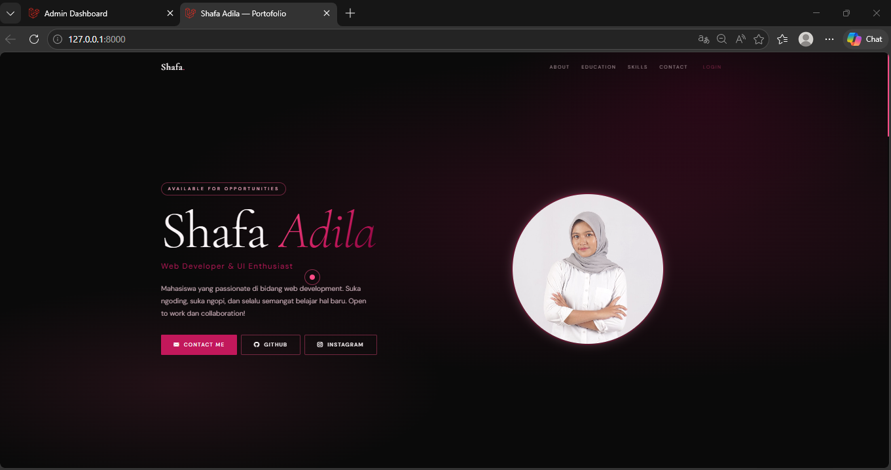
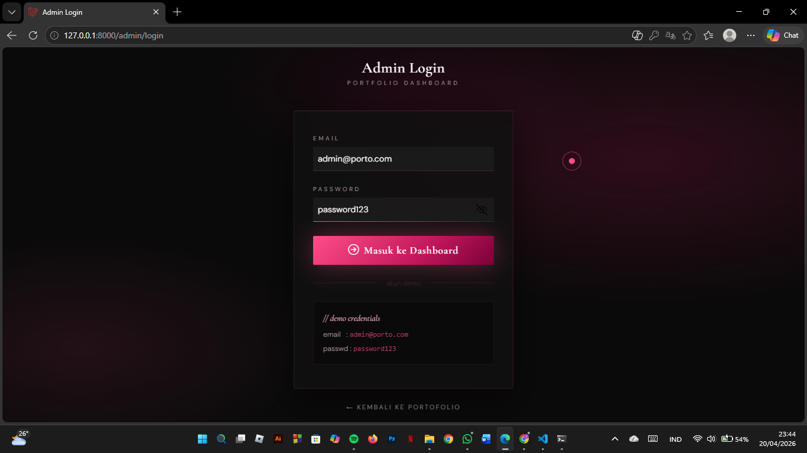
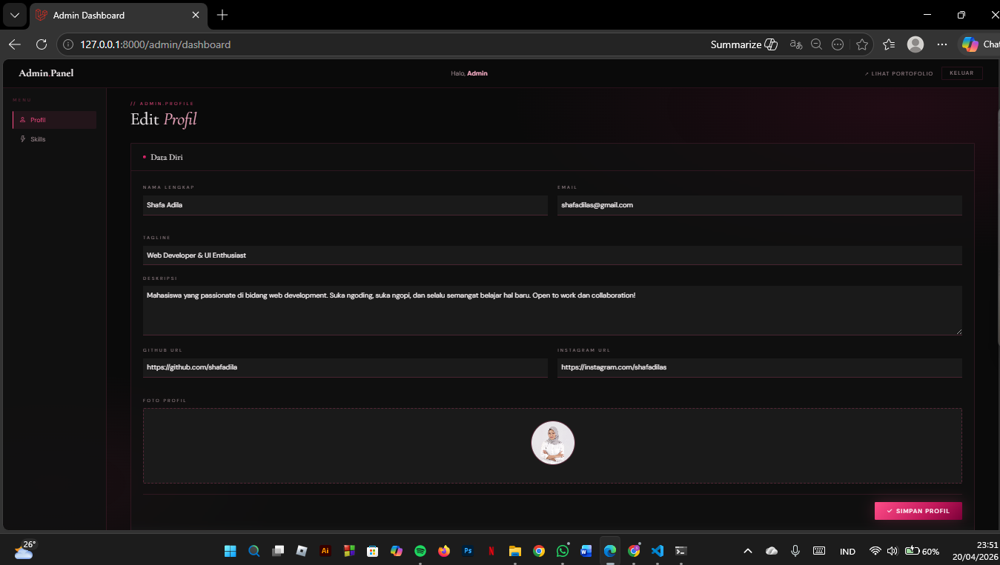
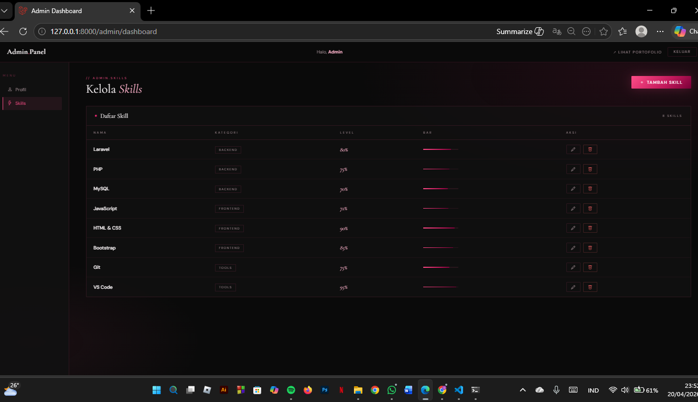
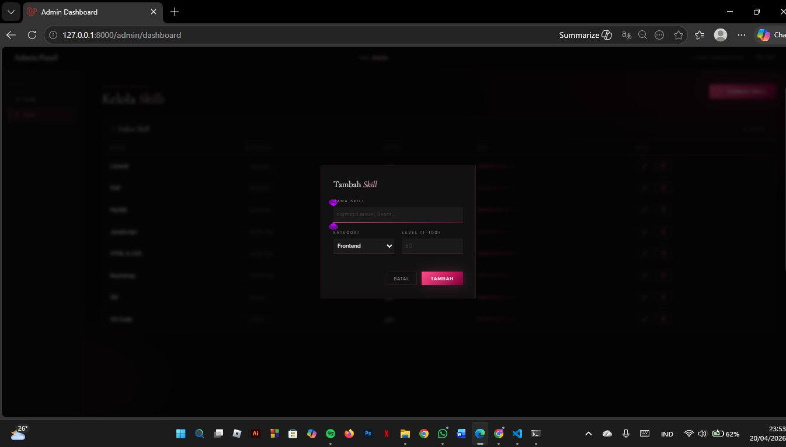

<div align="center">

# LAPORAN PRAKTIKUM  
# APLIKASI BERBASIS PLATFORM

## UTS


### Disusun Oleh
**Shafa Adila Santoso**  
2311102158  
S1 IF-11-REG01

### Dosen Pengampu
**Dimas Fanny Hebrasianto Permadi, S.ST., M.Kom**

### Asisten Praktikum
Apri Pandu Wicaksono  
Rangga Pradarrell Fathi  

### LABORATORIUM HIGH PERFORMANCE  
FAKULTAS INFORMATIKA  
UNIVERSITAS TELKOM PURWOKERTO  
2026

</div>

---

<div align="justify">

# 1. Dasar Teori

## 1. CRUD
CRUD adalah konsep fundamental dalam pengelolaan data pada sistem informasi. Istilah ini mencakup empat aktivitas utama, yaitu Create (menambahkan data), Read (menampilkan atau mengambil data), Update (mengubah data), dan Delete (menghapus data). Hampir seluruh aplikasi berbasis database maupun web menerapkan konsep ini. Dalam konteks pengembangan web, CRUD biasanya direpresentasikan melalui metode HTTP seperti GET, POST, PUT, dan DELETE. Laravel mempermudah implementasi CRUD melalui fungsi-fungsi pada Controller yang terhubung dengan model Eloquent. Selain itu, Laravel juga menyediakan fitur validasi untuk memastikan data yang dikirim pengguna—misalnya harga atau stok—telah memenuhi aturan tertentu sebelum disimpan, sehingga kualitas dan konsistensi data tetap terjaga.

## 2. Framework Laravel dan Arsitektur MVC
Laravel merupakan framework berbasis PHP yang dirancang untuk membantu developer membangun aplikasi web dengan lebih efisien melalui sintaks yang sederhana dan elegan. Framework ini mengadopsi pola Model-View-Controller (MVC), yaitu pemisahan antara pengelolaan data (Model), tampilan antarmuka (View), dan pengatur alur aplikasi (Controller). Dengan konsep ini, struktur aplikasi menjadi lebih rapi, mudah dipelihara, serta mendukung kerja tim karena setiap bagian memiliki fungsi yang jelas.

## 3. Controller
Controller adalah bagian dari arsitektur MVC yang berfungsi sebagai penghubung antara route dan model. Controller menangani logika aplikasi seperti memproses input dari user, mengambil atau mengolah data dari database melalui model, serta mengirimkan hasilnya ke view. Dengan adanya controller, kode program menjadi lebih terstruktur dan mudah dikelola karena logika aplikasi dipisahkan dari tampilan.

## 4. Migrations
Migration adalah fitur Laravel yang digunakan untuk mengelola struktur database secara terstruktur dan terkontrol. Dengan migration, developer dapat membuat, mengubah, atau menghapus tabel menggunakan kode, sehingga tidak perlu melakukan perubahan langsung di database. Migration juga mendukung versioning, sehingga perubahan struktur database dapat dilacak dan dikembalikan (rollback) jika diperlukan.

## 5. Model
Model merupakan komponen yang berfungsi untuk merepresentasikan struktur data dan berinteraksi langsung dengan database. Dalam Laravel, model menggunakan Eloquent ORM yang memungkinkan pengolahan data tanpa perlu menulis query SQL secara langsung. Model digunakan untuk mengambil, menyimpan, memperbarui, dan menghapus data, sehingga mempermudah pengelolaan database dalam aplikasi.

## 6. View
View merupakan bagian dari MVC yang berfungsi untuk menampilkan antarmuka pengguna (user interface). View berisi kode HTML, CSS, dan JavaScript yang digunakan untuk menampilkan data kepada pengguna. Dalam Laravel, view biasanya menggunakan Blade Template Engine yang memudahkan dalam menampilkan data secara dinamis. View tidak menangani logika aplikasi, melainkan hanya fokus pada tampilan agar lebih terpisah dan terstruktur.

### 7. Route 
Route merupakan komponen dalam Laravel yang berfungsi untuk menentukan jalur atau URL yang dapat diakses oleh pengguna serta menghubungkannya dengan fungsi tertentu di dalam aplikasi. Melalui route, setiap permintaan dari user akan diarahkan ke controller atau langsung ke view sesuai dengan kebutuhan. Route juga dapat dikelompokkan menggunakan prefix atau middleware untuk mengatur akses, seperti membedakan antara halaman publik dan halaman admin.

---

## Sourcode
### 1. Routes
**web.php**

```php
<?php

use Illuminate\Support\Facades\Route;
use App\Http\Controllers\AdminController;
use App\Http\Controllers\PortfolioApiController;

// ── LANDING PAGE (public) ─────────────────────────
Route::get('/', function () {
    return view('landing');
})->name('landing');

// ── API ENDPOINTS (AJAX - public) ─────────────────
Route::prefix('api')->group(function () {
    Route::get('/profile', [PortfolioApiController::class, 'profile']);
    Route::get('/skills',  [PortfolioApiController::class, 'skills']);
});

// ── ADMIN AUTH ────────────────────────────────────
Route::get('/admin/login',  [AdminController::class, 'showLogin'])->name('admin.login');
Route::post('/admin/login', [AdminController::class, 'login'])->name('admin.login.post');
Route::post('/admin/logout',[AdminController::class, 'logout'])->name('admin.logout');

// ── ADMIN DASHBOARD (protected) ───────────────────
Route::middleware('admin.auth')->prefix('admin')->group(function () {
    Route::get('/dashboard',           [AdminController::class, 'dashboard'])->name('admin.dashboard');
    Route::post('/profile',            [AdminController::class, 'updateProfile'])->name('admin.profile.update');
    Route::post('/skills',             [AdminController::class, 'storeSkill'])->name('admin.skills.store');
    Route::put('/skills/{skill}',      [AdminController::class, 'updateSkill'])->name('admin.skills.update');
    Route::delete('/skills/{skill}',   [AdminController::class, 'destroySkill'])->name('admin.skills.destroy');
});
```
Kode routing di atas berfungsi sebagai pengatur alur akses dalam aplikasi Laravel yang memisahkan antara halaman publik, API, dan admin. Pada bagian awal, route `'/'` digunakan untuk menampilkan halaman landing sebagai halaman utama yang dapat diakses semua pengguna. Selanjutnya terdapat prefix `api` yang menyediakan endpoint publik berbasis AJAX untuk mengambil data profil dan skill melalui `PortfolioApiController`. Bagian autentikasi admin diatur melalui route login, proses login, dan logout menggunakan `AdminController`. Untuk keamanan, fitur dashboard admin dikelompokkan dalam route yang menggunakan middleware `admin.auth` dengan prefix `admin`, sehingga hanya pengguna yang sudah login yang dapat mengaksesnya. Di dalamnya terdapat berbagai fungsi seperti menampilkan dashboard, mengelola profil, serta melakukan operasi CRUD pada data skill. Secara keseluruhan, routing ini menunjukkan pembagian struktur aplikasi yang jelas antara frontend publik, layanan API, dan backend admin.

---

### 2. Controller
**AdminController.php**

```php
<?php

namespace App\Http\Controllers;

use App\Models\PortfolioProfile;
use App\Models\Skill;
use App\Models\User;
use Illuminate\Http\Request;
use Illuminate\Support\Facades\Hash;
use Illuminate\Support\Facades\Session;

class AdminController extends Controller
{
    // ── AUTH ─────────────────────────────────────────
    public function showLogin()
    {
        if (Session::has('admin')) return redirect()->route('admin.dashboard');
        return view('admin.login');
    }

    public function login(Request $request)
    {
        $request->validate([
            'email'    => 'required|email',
            'password' => 'required',
        ]);

        $user = User::where('email', $request->email)->first();

        if ($user && Hash::check($request->password, $user->password)) {
            Session::put('admin', ['id' => $user->id, 'name' => $user->name]);
            return redirect()->route('admin.dashboard')->with('success', 'Selamat datang, ' . $user->name . '!');
        }

        return back()->withErrors(['email' => 'Email atau password salah.'])->withInput();
    }

    public function logout()
    {
        Session::forget('admin');
        return redirect()->route('admin.login');
    }

    // ── DASHBOARD ─────────────────────────────────────
    public function dashboard()
    {
        $profile = PortfolioProfile::first();
        $skills  = Skill::orderBy('kategori')->get();
        return view('admin.dashboard', compact('profile', 'skills'));
    }

    // ── PROFILE ───────────────────────────────────────
    public function updateProfile(Request $request)
    {
        $request->validate([
            'nama'      => 'required|string|max:100',
            'tagline'   => 'required|string|max:150',
            'deskripsi' => 'required|string|max:1000',
            'email'     => 'required|email',
            'github'    => 'nullable|url',
            'instagram' => 'nullable|url',
        ]);

        $profile = PortfolioProfile::first();

        $data = $request->only(['nama', 'tagline', 'deskripsi', 'email', 'github', 'instagram']);

        // Handle foto (base64 upload)
        if ($request->filled('foto_base64')) {
            $data['foto'] = $request->foto_base64;
        }

        $profile->update($data);

        return response()->json(['message' => 'Profil berhasil diperbarui!']);
    }

    // ── SKILLS ────────────────────────────────────────
    public function storeSkill(Request $request)
    {
        $request->validate([
            'nama'     => 'required|string|max:50',
            'level'    => 'required|integer|min:1|max:100',
            'kategori' => 'required|string|max:50',
        ]);

        $skill = Skill::create($request->only(['nama', 'level', 'kategori']));
        return response()->json(['message' => 'Skill ditambahkan!', 'skill' => $skill]);
    }

    public function updateSkill(Request $request, Skill $skill)
    {
        $request->validate([
            'nama'     => 'required|string|max:50',
            'level'    => 'required|integer|min:1|max:100',
            'kategori' => 'required|string|max:50',
        ]);

        $skill->update($request->only(['nama', 'level', 'kategori']));
        return response()->json(['message' => 'Skill diperbarui!', 'skill' => $skill]);
    }

    public function destroySkill(Skill $skill)
    {
        $skill->delete();
        return response()->json(['message' => 'Skill dihapus!']);
    }
}
```

`AdminController` merupakan controller yang mengelola seluruh fitur pada halaman admin, mulai dari autentikasi hingga pengolahan data profil dan skill. Pada bagian autentikasi, controller ini menangani proses login, validasi user, penyimpanan session, serta logout. Setelah berhasil login, admin dapat mengakses dashboard untuk melihat dan mengelola data yang diambil dari model `PortfolioProfile` dan `Skill`. Selain itu, controller ini juga menyediakan fungsi untuk memperbarui data profil, termasuk upload foto dalam bentuk base64, serta melakukan operasi CRUD (Create, Read, Update, Delete) pada data skill. Dengan demikian, `AdminController` berperan sebagai pusat logika backend yang menghubungkan antara tampilan admin, database, dan sistem autentikasi.

---

### 3. Model
**PortfolioProfile.php**

```php
<?php

namespace App\Models;

use Illuminate\Database\Eloquent\Model;

class PortfolioProfile extends Model
{
    protected $table = 'portfolio_profile';

    protected $fillable = [
        'nama', 'tagline', 'deskripsi', 'email', 'github', 'instagram', 'foto',
    ];
}
```

Model `PortfolioProfile` merupakan representasi dari tabel `portfolio_profile` yang digunakan untuk mengelola data profil dalam aplikasi Laravel. Model ini mengatur koneksi antara aplikasi dengan database menggunakan Eloquent ORM, sehingga memudahkan proses pengambilan, penyimpanan, dan manipulasi data. Properti `$fillable` digunakan untuk menentukan kolom-kolom yang boleh diisi secara mass assignment, seperti `nama`, `tagline`, `deskripsi`, `email`, serta media sosial dan foto. Dengan adanya model ini, proses pengolahan data profil menjadi lebih terstruktur, aman, dan efisien tanpa perlu menulis query SQL secara langsung.

---

### 4. Migration
**create_portfolio_profile_table.php**

```php
<?php

use Illuminate\Database\Migrations\Migration;
use Illuminate\Database\Schema\Blueprint;
use Illuminate\Support\Facades\Schema;

return new class extends Migration
{
    public function up(): void
    {
        Schema::create('portfolio_profile', function (Blueprint $table) {
            $table->id();
            $table->string('nama');
            $table->string('tagline');
            $table->text('deskripsi');
            $table->string('email');
            $table->string('github')->nullable();
            $table->string('instagram')->nullable();
            $table->string('foto')->nullable(); // base64 atau url
            $table->timestamps();
        });
    }

    public function down(): void
    {
        Schema::dropIfExists('portfolio_profile');
    }
};
```

File migration ini berfungsi untuk membuat tabel `portfolio_profile` pada database yang digunakan untuk menyimpan data utama portofolio pengguna. Tabel ini memiliki beberapa kolom seperti `nama`, `tagline`, dan `deskripsi` untuk informasi profil, serta `email`, `github`, dan `instagram` sebagai kontak dan media sosial. Selain itu, terdapat kolom `foto` yang bersifat opsional untuk menyimpan gambar profil dalam bentuk URL atau base64. Migration ini juga menggunakan `timestamps` untuk mencatat waktu pembuatan dan pembaruan data secara otomatis. Method `up()` digunakan untuk membuat tabel, sedangkan method `down()` berfungsi untuk menghapus tabel jika dilakukan rollback, sehingga memudahkan pengelolaan struktur database secara terkontrol.

---

### 5. View
**landing.blade.php**

```php
<!DOCTYPE html>
<html lang="id">
<head>
  <meta charset="UTF-8" />
  <meta name="viewport" content="width=device-width, initial-scale=1.0"/>
  <title>Portofolio</title>
  <link href="https://cdn.jsdelivr.net/npm/bootstrap@5.3.3/dist/css/bootstrap.min.css" rel="stylesheet"/>
  <link href="https://cdn.jsdelivr.net/npm/bootstrap-icons@1.11.3/font/bootstrap-icons.css" rel="stylesheet"/>
  <link href="https://fonts.googleapis.com/css2?family=Cormorant+Garamond:ital,wght@0,300;0,400;0,600;1,300;1,400&family=DM+Sans:ital,wght@0,300;0,400;0,500;1,300&display=swap" rel="stylesheet"/>
  <style>
    :root {
      --pink-light:#ffb3cc; --pink:#ff4d88; --pink-deep:#c2185b;
      --black:#0a0a0a; --black-2:#111111; --black-3:#1a1a1a; --black-4:#242424;
      --white:#faf5f7; --muted:#9e8a90;
      --gradient:linear-gradient(135deg,#ff4d88 0%,#c2185b 60%,#7b0038 100%);
      --glow:0 0 40px rgba(255,77,136,.35);
      --font-display:'Cormorant Garamond',serif;
      --font-body:'DM Sans',sans-serif;
    }
    *,*::before,*::after{box-sizing:border-box;margin:0;padding:0;}
    html{scroll-behavior:smooth;}
    body{background:var(--black);color:var(--white);font-family:var(--font-body);font-size:15px;line-height:1.75;overflow-x:hidden;cursor:none;}
    .cursor{width:12px;height:12px;background:var(--pink);border-radius:50%;position:fixed;top:0;left:0;pointer-events:none;z-index:9999;transition:transform .15s ease;transform:translate(-50%,-50%);}
    .cursor-ring{width:36px;height:36px;border:1.5px solid rgba(255,77,136,.5);border-radius:50%;position:fixed;top:0;left:0;pointer-events:none;z-index:9998;transition:transform .35s ease,width .2s,height .2s;transform:translate(-50%,-50%);}
    ::-webkit-scrollbar{width:4px;} ::-webkit-scrollbar-track{background:var(--black);} ::-webkit-scrollbar-thumb{background:var(--pink);border-radius:2px;}
    h1,h2,h3,h4{font-family:var(--font-display);font-weight:300;}
    .section-label{font-family:var(--font-body);font-size:10px;letter-spacing:.35em;text-transform:uppercase;color:var(--pink);margin-bottom:.5rem;}
    .section-title{font-size:clamp(2rem,5vw,3.2rem);font-weight:300;line-height:1.15;margin-bottom:1rem;}
    .section-title em{font-style:italic;color:var(--pink-light);}
    #navbar{position:fixed;top:0;left:0;width:100%;z-index:900;padding:.9rem 0;transition:background .4s,box-shadow .4s,padding .3s;}
    #navbar.scrolled{background:rgba(10,10,10,.92);backdrop-filter:blur(16px);box-shadow:0 1px 0 rgba(255,77,136,.15);padding:.55rem 0;}
    .nav-brand{font-family:var(--font-display);font-size:1.35rem;font-weight:600;color:var(--white)!important;text-decoration:none;letter-spacing:.03em;}
    .nav-brand span{color:var(--pink);}
    .nav-link-custom{font-size:11px;letter-spacing:.2em;text-transform:uppercase;color:var(--muted)!important;text-decoration:none;padding:.3rem .7rem!important;transition:color .25s;}
    .nav-link-custom:hover{color:var(--pink-light)!important;} .nav-link-custom.active{color:var(--pink)!important;}
    .navbar-toggler{border:1px solid rgba(255,77,136,.3);}
    .navbar-toggler-icon{background-image:url("data:image/svg+xml,%3csvg xmlns='http://www.w3.org/2000/svg' viewBox='0 0 30 30'%3e%3cpath stroke='rgba%28255%2C77%2C136%2C0.9%29' stroke-linecap='round' stroke-miterlimit='10' stroke-width='2' d='M4 7h22M4 15h22M4 23h22'/%3e%3c/svg%3e");}
    #hero{min-height:100vh;display:flex;align-items:center;position:relative;overflow:hidden;padding:120px 0 80px;}
    #hero::before{content:'';position:absolute;inset:0;background:radial-gradient(ellipse 80% 60% at 70% 40%,rgba(194,24,91,.18) 0%,transparent 65%),radial-gradient(ellipse 50% 40% at 20% 80%,rgba(255,77,136,.1) 0%,transparent 60%),radial-gradient(ellipse 40% 50% at 80% 10%,rgba(123,0,56,.2) 0%,transparent 60%);pointer-events:none;}
    .hero-tag{display:inline-block;font-size:10px;letter-spacing:.4em;text-transform:uppercase;border:1px solid rgba(255,77,136,.4);padding:.3rem .9rem;border-radius:2rem;color:var(--pink-light);margin-bottom:1.5rem;animation:fadeDown .8s ease both;}
    .hero-name{font-size:clamp(3rem,9vw,7.5rem);font-weight:300;line-height:.95;letter-spacing:-.02em;margin-bottom:.5rem;animation:fadeUp .9s ease .1s both;}
    .hero-name .accent{font-style:italic;background:var(--gradient);-webkit-background-clip:text;-webkit-text-fill-color:transparent;background-clip:text;}
    .hero-tagline{font-size:1.1rem;color:var(--pink-deep);letter-spacing:.1em;margin-bottom:1.4rem;animation:fadeUp .9s ease .2s both;}
    .hero-desc{font-size:1rem;color:#c4a8b2;max-width:480px;margin-bottom:2.2rem;animation:fadeUp .9s ease .3s both;}
    .hero-cta{display:inline-flex;align-items:center;gap:.6rem;padding:.75rem 1.8rem;background:var(--pink-deep);color:#fff!important;text-decoration:none;border-radius:2px;font-size:12px;letter-spacing:.15em;text-transform:uppercase;font-family:var(--font-body);font-weight:500;transition:opacity .25s,transform .2s;animation:fadeUp .9s ease .4s both;}
    .hero-cta:hover{opacity:.88;transform:translateY(-2px);}
    .hero-cta-ghost{display:inline-flex;align-items:center;gap:.6rem;padding:.73rem 1.8rem;border:1px solid rgba(255,77,136,.4);color:var(--white)!important;text-decoration:none;border-radius:3px;font-size:12px;letter-spacing:.15em;text-transform:uppercase;font-family:var(--font-body);font-weight:500;transition:border-color .25s,background .25s,transform .2s;animation:fadeUp .9s ease .5s both;}
    .hero-cta-ghost:hover{background:rgba(255,77,136,.08);border-color:var(--pink);transform:translateY(-2px);}
    .hero-photo-wrap{position:relative;display:flex;justify-content:center;animation:fadeIn 1.1s ease .2s both;}
    .hero-photo{width:350px;height:350px;border-radius:50%;object-fit:cover;border:3px solid rgba(255,44,114,.3);position:relative;z-index:2;box-shadow:0 0 20px rgba(238,165,190,.25);}
    .hero-photo-placeholder{width:350px;height:350px;border-radius:50%;background:linear-gradient(135deg,#2a1520 0%,#1a0d14 100%);border:3px solid rgba(255,77,136,.3);display:flex;align-items:center;justify-content:center;font-size:5rem;color:var(--pink);position:relative;z-index:2;box-shadow:0 0 60px rgba(255,77,136,.25);}
    .skeleton{background:linear-gradient(90deg,#1a1010 25%,#2a1520 50%,#1a1010 75%);background-size:200% 100%;animation:shimmer 1.5s infinite;border-radius:6px;}
    @keyframes shimmer{0%{background-position:200% 0;}100%{background-position:-200% 0;}}
    #quote-strip{background:var(--black-2);border-top:1px solid rgba(255,77,136,.12);border-bottom:1px solid rgba(255,77,136,.12);padding:2rem 0;}
    .quote-content{text-align:center;font-family:var(--font-display);font-size:1.2rem;font-style:italic;color:var(--pink-light);}
    .quote-author{font-size:11px;letter-spacing:.25em;text-transform:uppercase;color:var(--muted);margin-top:.4rem;}
    #quote-loading{display:flex;align-items:center;justify-content:center;gap:.5rem;color:var(--muted);font-size:.85rem;}
    .spinner-pink{width:18px;height:18px;border:2px solid rgba(255,77,136,.2);border-top-color:var(--pink);border-radius:50%;animation:spinFast .7s linear infinite;}
    section{padding:100px 0;position:relative;}
    .divider{width:40px;height:2px;background:var(--gradient);margin:1.2rem 0 2rem;}
    #about{background:var(--black);}
    .about-stats{display:grid;grid-template-columns:repeat(3,1fr);gap:1px;background:rgba(222,141,168,.1);border:1px solid rgba(255,77,136,.1);border-radius:6px;overflow:hidden;margin-top:2rem;}
    .stat-item{background:var(--black-2);padding:1.5rem 1rem;text-align:center;}
    .stat-num{font-family:var(--font-display);font-size:2.5rem;font-weight:300;color:var(--pink);line-height:1;display:block;}
    .stat-label{font-size:10px;letter-spacing:.2em;text-transform:uppercase;color:var(--muted);margin-top:.3rem;}
    .interest-pill{display:inline-flex;align-items:center;gap:.4rem;padding:.3rem .85rem;border:1px solid rgba(255,77,136,.25);border-radius:2rem;font-size:12px;color:var(--pink-light);margin:.25rem;background:rgba(255,77,136,.05);transition:background .2s,border-color .2s;}
    .interest-pill:hover{background:rgba(255,77,136,.12);border-color:var(--pink);}
    .info-card{background:var(--black-2);border:1px solid rgba(255,77,136,.1);border-radius:6px;padding:1rem 1.2rem;}
    .info-card-label{font-size:.75rem;color:var(--muted);letter-spacing:.15em;text-transform:uppercase;margin-bottom:.3rem;}
    .info-card-value{font-family:var(--font-display);font-size:1.1rem;}
    #education{background:var(--black-2);}
    .timeline{position:relative;padding-left:2.5rem;}
    .timeline::before{content:'';position:absolute;left:7px;top:6px;bottom:6px;width:1px;background:linear-gradient(to bottom,var(--pink),rgba(8,8,8,.08));}
    .timeline-item{position:relative;margin-bottom:2.5rem;}
    .timeline-dot{position:absolute;left:-2.5rem;top:6px;width:14px;height:14px;border:2px solid var(--pink);border-radius:50%;background:var(--black-2);box-shadow:0 0 10px rgba(255,77,136,.4);}
    .timeline-dot.active{background:var(--pink);}
    .timeline-card{background:var(--black-3);border:1px solid rgba(255,77,136,.1);border-radius:6px;padding:1.4rem 1.6rem;transition:border-color .3s,box-shadow .3s,transform .25s;}
    .timeline-card:hover{border-color:rgba(255,77,136,.4);box-shadow:0 4px 30px rgba(255,77,136,.12);transform:translateX(4px);}
    .timeline-period{font-size:10px;letter-spacing:.25em;text-transform:uppercase;color:var(--pink);margin-bottom:.3rem;}
    .timeline-school{font-family:var(--font-display);font-size:1.25rem;font-weight:300;margin-bottom:.1rem;}
    .timeline-major{font-size:.85rem;color:var(--muted);}
    #skills{background:var(--black);}
    .skill-category-title{font-size:11px;letter-spacing:.3em;text-transform:uppercase;color:var(--pink);margin-bottom:1rem;}
    .skill-bar-wrap{margin-bottom:1.1rem;}
    .skill-bar-label{display:flex;justify-content:space-between;font-size:13px;margin-bottom:.35rem;color:var(--white);}
    .skill-bar-label span{color:var(--pink-light);font-family:var(--font-display);font-size:1rem;}
    .skill-bar-track{height:3px;background:rgba(249,12,91,.1);border-radius:2px;overflow:hidden;}
    .skill-bar-fill{height:100%;background:var(--gradient);border-radius:2px;width:0;transition:width 1s ease;}
    #contact{background:var(--black);}
    .contact-card{background:var(--black-2);border:1px solid rgba(255,77,136,.12);border-radius:8px;padding:2rem;text-align:center;transition:border-color .3s,transform .3s,box-shadow .3s;}
    .contact-card:hover{border-color:rgba(255,77,136,.45);transform:translateY(-5px);box-shadow:0 15px 40px rgba(255,77,136,.12);}
    .contact-icon{width:52px;height:52px;background:rgba(255,77,136,.1);border:1px solid rgba(255,77,136,.25);border-radius:50%;display:flex;align-items:center;justify-content:center;font-size:1.3rem;color:var(--pink);margin:0 auto .9rem;transition:background .25s;}
    .contact-card:hover .contact-icon{background:rgba(255,77,136,.2);}
    .contact-label{font-size:10px;letter-spacing:.25em;text-transform:uppercase;color:var(--muted);margin-bottom:.25rem;}
    .contact-value{font-size:.95rem;color:var(--white);}
    .contact-value a{color:var(--pink-light);text-decoration:none;} .contact-value a:hover{color:var(--pink);}
    .contact-form-wrap{background:var(--black-2);border:1px solid rgba(255,77,136,.12);border-radius:8px;padding:2.5rem;}
    .form-ctrl{background:var(--black-3)!important;border:1px solid rgba(255,77,136,.2)!important;color:var(--white)!important;border-radius:4px!important;padding:.75rem 1rem!important;font-family:var(--font-body)!important;font-size:.9rem!important;transition:border-color .25s,box-shadow .25s!important;}
    .form-ctrl:focus{border-color:var(--pink)!important;box-shadow:0 0 0 3px rgba(255,77,136,.15)!important;outline:none!important;}
    .form-ctrl::placeholder{color:var(--muted)!important;}
    .btn-pink{background:var(--gradient);color:#fff;border:none;padding:.75rem 2rem;border-radius:4px;font-family:var(--font-body);font-size:12px;letter-spacing:.15em;text-transform:uppercase;font-weight:500;box-shadow:var(--glow);transition:opacity .25s,transform .2s;cursor:pointer;}
    .btn-pink:hover{opacity:.88;transform:translateY(-2px);}
    footer{background:var(--black-2);border-top:1px solid rgba(255,77,136,.12);padding:2rem 0;text-align:center;font-size:12px;color:var(--muted);}
    footer span{color:var(--pink);}
    .reveal{opacity:0;transform:translateY(30px);transition:opacity .7s ease,transform .7s ease;}
    .reveal.visible{opacity:1;transform:translateY(0);}
    @keyframes fadeUp{from{opacity:0;transform:translateY(28px);}to{opacity:1;transform:translateY(0);}}
    @keyframes fadeDown{from{opacity:0;transform:translateY(-18px);}to{opacity:1;transform:translateY(0);}}
    @keyframes fadeIn{from{opacity:0;}to{opacity:1;}}
    @keyframes spinFast{to{transform:rotate(360deg);}}
    @media(max-width:768px){section{padding:70px 0;}.hero-photo,.hero-photo-placeholder{width:200px;height:200px;}.about-stats{grid-template-columns:1fr 1fr;}}
  </style>
</head>
<body>
<div class="cursor" id="cursor"></div>
<div class="cursor-ring" id="cursorRing"></div>

<nav id="navbar" class="navbar navbar-expand-lg">
  <div class="container">
    <a class="nav-brand" href="#hero" id="navBrand">Porto<span>.</span></a>
    <button class="navbar-toggler" type="button" data-bs-toggle="collapse" data-bs-target="#navMenu">
      <span class="navbar-toggler-icon"></span>
    </button>
    <div class="collapse navbar-collapse justify-content-end" id="navMenu">
      <ul class="navbar-nav gap-1">
        <li class="nav-item"><a class="nav-link-custom" href="#about">About</a></li>
        <li class="nav-item"><a class="nav-link-custom" href="#education">Education</a></li>
        <li class="nav-item"><a class="nav-link-custom" href="#skills">Skills</a></li>
        <li class="nav-item"><a class="nav-link-custom" href="#contact">Contact</a></li>
        <li class="nav-item ms-2"><a class="nav-link-custom" href="/admin/login" style="color:rgba(255,77,136,.4)!important;">Login</a></li>
      </ul>
    </div>
  </div>
</nav>

<section id="hero">
  <div class="container">
    <div class="row align-items-center gy-5">
      <div class="col-lg-6">
        <div class="hero-tag">Available for Opportunities</div>
        <h1 class="hero-name" id="heroName"><span class="skeleton" style="display:inline-block;width:300px;height:1em;border-radius:8px;">&nbsp;</span></h1>
        <p class="hero-tagline" id="heroTagline" style="color:var(--muted);">Memuat...</p>
        <p class="hero-desc" id="heroDesc"><span class="skeleton" style="display:block;height:1em;margin-bottom:5px;">&nbsp;</span><span class="skeleton" style="display:block;height:1em;width:80%;">&nbsp;</span></p>
        <div class="d-flex flex-wrap gap-2" id="heroCta" style="opacity:0;transition:opacity .5s;"></div>
      </div>
      <div class="col-lg-6">
        <div class="hero-photo-wrap">
          <div class="hero-photo-placeholder" id="photoPlaceholder">🧑‍💻</div>
          
        </div>
      </div>
    </div>
  </div>
</section>

<div id="quote-strip">
  <div class="container">
    <div id="quote-loading"><div class="spinner-pink"></div><span>Loading quote...</span></div>
    <div id="quote-display" class="text-center" style="display:none;">
      <p class="quote-content" id="quote-text"></p>
      <p class="quote-author" id="quote-author"></p>
    </div>
  </div>
</div>

<section id="about">
  <div class="container">
    <div class="row gy-5 align-items-center">
      <div class="col-lg-5 reveal">
        <p class="section-label">About Me</p>
        <h2 class="section-title">Hi!, I'm <em id="aboutFirstName">...</em></h2>
        <div class="divider"></div>
        <p style="color:#c4a8b2;margin-bottom:1.5rem;text-align:justify;" id="aboutDesc">
          <span class="skeleton" style="display:block;height:1em;margin-bottom:6px;">&nbsp;</span>
          <span class="skeleton" style="display:block;height:1em;width:85%;">&nbsp;</span>
        </p>
        <div id="aboutPills"></div>
      </div>
      <div class="col-lg-7 reveal">
        <div class="row g-3 mb-4" id="aboutCards">
          <div class="col-sm-6"><div class="skeleton" style="height:72px;border-radius:6px;"></div></div>
          <div class="col-sm-6"><div class="skeleton" style="height:72px;border-radius:6px;"></div></div>
          <div class="col-sm-6"><div class="skeleton" style="height:72px;border-radius:6px;"></div></div>
          <div class="col-sm-6"><div class="skeleton" style="height:72px;border-radius:6px;"></div></div>
        </div>
        <div class="about-stats">
          <div class="stat-item"><span class="stat-num" id="count-projects">0</span><div class="stat-label">Projects</div></div>
          <div class="stat-item"><span class="stat-num" id="count-skills">0</span><div class="stat-label">Skills</div></div>
          <div class="stat-item"><span class="stat-num" id="count-semester">0</span><div class="stat-label">Semester</div></div>
        </div>
      </div>
    </div>
  </div>
</section>

<section id="education">
  <div class="container">
    <div class="row justify-content-center mb-5">
      <div class="col-lg-6 text-center reveal">
        <p class="section-label">educational background</p>
        <h2 class="section-title">My Education Path</h2>
        <div class="divider mx-auto"></div>
      </div>
    </div>
    <div class="row justify-content-center">
      <div class="col-lg-8 reveal">
        <div class="timeline">
          <div class="timeline-item">
            <div class="timeline-dot active"></div>
            <div class="timeline-card">
              <div class="timeline-period">2023 — Now</div>
              <div class="timeline-school">Telkom University Purwokerto</div>
              <div class="timeline-major">Sarjana Informatika &nbsp;·&nbsp; Semester 6</div>
              <p style="font-size:.85rem;color:var(--muted);margin-top:.5rem;">Menempuh S1 Informatika dengan fokus web development. Belajar membangun aplikasi digital yang fungsional dan user-friendly menggunakan berbagai teknologi modern.</p>
            </div>
          </div>
          <div class="timeline-item">
            <div class="timeline-dot"></div>
            <div class="timeline-card">
              <div class="timeline-period">2020 — 2023</div>
              <div class="timeline-school">SMA / Sederajat</div>
              <div class="timeline-major">IPA</div>
              <p style="font-size:.85rem;color:var(--muted);margin-top:.5rem;">Menyelesaikan pendidikan SMA jurusan IPA, membangun fondasi berpikir analitis dan logis.</p>
            </div>
          </div>
          <div class="timeline-item">
            <div class="timeline-dot"></div>
            <div class="timeline-card">
              <div class="timeline-period">2017 — 2020</div>
              <div class="timeline-school">SMP / Sederajat</div>
              <div class="timeline-major">Junior High School</div>
              <p style="font-size:.85rem;color:var(--muted);margin-top:.5rem;">Menyelesaikan pendidikan SMP dengan semangat belajar yang tinggi.</p>
            </div>
          </div>
        </div>
      </div>
    </div>
  </div>
</section>

<section id="skills">
  <div class="container">
    <div class="row justify-content-center mb-5">
      <div class="col-lg-6 text-center reveal">
        <p class="section-label">Skills</p>
        <h2 class="section-title">My Skills &amp; Tools</h2>
        <div class="divider mx-auto"></div>
      </div>
    </div>
    <div class="row gy-5" id="skillsContainer">
      <div class="col-lg-6"><div class="skeleton" style="height:220px;border-radius:8px;"></div></div>
      <div class="col-lg-6"><div class="skeleton" style="height:220px;border-radius:8px;"></div></div>
    </div>
  </div>
</section>

<section id="contact">
  <div class="container">
    <div class="row justify-content-center mb-5">
      <div class="col-lg-6 text-center reveal">
        <p class="section-label">Contact</p>
        <h2 class="section-title">Get In Touch</h2>
        <div class="divider mx-auto"></div>
        <p style="color:var(--muted);">Feel free to reach out for collaborations, opportunities, or just to say hello.</p>
      </div>
    </div>
    <div class="row g-3 mb-5 justify-content-center" id="contactCards">
      <div class="col-sm-6 col-lg-3"><div class="skeleton" style="height:130px;border-radius:8px;"></div></div>
      <div class="col-sm-6 col-lg-3"><div class="skeleton" style="height:130px;border-radius:8px;"></div></div>
    </div>
    <div class="row justify-content-center reveal">
      <div class="col-lg-7">
        <div class="contact-form-wrap">
          <h3 style="font-family:var(--font-display);font-size:1.6rem;font-weight:300;margin-bottom:1.5rem;">Kirim Pesan <em style="color:var(--pink);">✦</em></h3>
          <div class="row g-3">
            <div class="col-sm-6"><input type="text" class="form-control form-ctrl" placeholder="Nama Anda"></div>
            <div class="col-sm-6"><input type="email" class="form-control form-ctrl" placeholder="Email Anda"></div>
            <div class="col-12"><input type="text" class="form-control form-ctrl" placeholder="Subjek"></div>
            <div class="col-12"><textarea class="form-control form-ctrl" rows="4" placeholder="Tulis pesan Anda..."></textarea></div>
            <div class="col-12">
              <button class="btn-pink" onclick="handleFormSubmit(this)"><i class="bi bi-send-fill me-2"></i>Send</button>
              <span id="form-msg" style="font-size:.85rem;color:var(--pink);margin-left:1rem;display:none;"></span>
            </div>
          </div>
        </div>
      </div>
    </div>
  </div>
</section>

<footer>
  <div class="container">
    <p id="footerText">© 2026 <span>Portofolio</span> — Crafted with <span>♥</span> using Laravel &amp; Bootstrap</p>
  </div>
</footer>

<script src="https://cdn.jsdelivr.net/npm/bootstrap@5.3.3/dist/js/bootstrap.bundle.min.js"></script>
<script>
/* CURSOR */
const cursor=document.getElementById('cursor'),cursorRing=document.getElementById('cursorRing');
document.addEventListener('mousemove',e=>{cursor.style.left=cursorRing.style.left=e.clientX+'px';cursor.style.top=cursorRing.style.top=e.clientY+'px';});
document.querySelectorAll('a,button,.contact-card,.timeline-card').forEach(el=>{
  el.addEventListener('mouseenter',()=>{cursor.style.transform='translate(-50%,-50%) scale(1.6)';cursorRing.style.width=cursorRing.style.height='52px';cursorRing.style.borderColor='rgba(255,77,136,.7)';});
  el.addEventListener('mouseleave',()=>{cursor.style.transform='translate(-50%,-50%) scale(1)';cursorRing.style.width=cursorRing.style.height='36px';cursorRing.style.borderColor='rgba(255,77,136,.5)';});
});

/* NAVBAR */
window.addEventListener('scroll',()=>{
  document.getElementById('navbar').classList.toggle('scrolled',window.scrollY>60);
  let current='';
  document.querySelectorAll('section[id]').forEach(s=>{if(window.scrollY>=s.offsetTop-120)current=s.id;});
  document.querySelectorAll('.nav-link-custom').forEach(a=>{a.classList.toggle('active',a.getAttribute('href')==='#'+current);});
});

/* SCROLL REVEAL */
let barsTriggered=false,countersTriggered=false;
const observer=new IntersectionObserver(entries=>{
  entries.forEach(e=>{
    if(e.isIntersecting){
      e.target.classList.add('visible');
      if(e.target.closest('#skills'))triggerSkillBars();
      if(e.target.closest('#about'))triggerCounters();
      observer.unobserve(e.target);
    }
  });
},{threshold:0.12});
document.querySelectorAll('.reveal').forEach(el=>observer.observe(el));

function triggerSkillBars(){
  if(barsTriggered)return;barsTriggered=true;
  document.querySelectorAll('.skill-bar-fill').forEach((bar,i)=>setTimeout(()=>{bar.style.width=bar.dataset.width+'%';},i*80));
}
function triggerCounters(){
  if(countersTriggered)return;countersTriggered=true;
  animateCount('count-projects',3);animateCount('count-skills',8);animateCount('count-semester',6);
}
function animateCount(id,target){
  const el=document.getElementById(id);let cur=0;const step=target/40;
  const iv=setInterval(()=>{cur+=step;if(cur>=target){el.textContent=target;clearInterval(iv);}else el.textContent=Math.floor(cur);},30);
}

/* AJAX — PROFILE dari Laravel */
fetch('/api/profile')
  .then(r=>r.json())
  .then(data=>{
    // Hero
    const parts=data.nama.split(' ');
    document.getElementById('heroName').innerHTML=parts.map((w,i)=>i===0?w:`<span class="accent">${w}</span>`).join(' ');
    document.getElementById('heroTagline').textContent=data.tagline;
    document.getElementById('heroTagline').style.color='var(--pink-deep)';
    document.getElementById('heroDesc').textContent=data.deskripsi;
    document.getElementById('heroCta').innerHTML=`
      <a href="#contact" class="hero-cta"><i class="bi bi-envelope-fill"></i> Contact Me</a>
      ${data.github?`<a href="${data.github}" target="_blank" class="hero-cta-ghost"><i class="bi bi-github"></i> GitHub</a>`:''}
      ${data.instagram?`<a href="${data.instagram}" target="_blank" class="hero-cta-ghost"><i class="bi bi-instagram"></i> Instagram</a>`:''}
    `;
    document.getElementById('heroCta').style.opacity='1';
    if(data.foto){document.getElementById('heroPhoto').src=data.foto;document.getElementById('heroPhoto').style.display='block';document.getElementById('photoPlaceholder').style.display='none';}

    // About
    document.getElementById('aboutFirstName').textContent=parts[0];
    document.getElementById('aboutDesc').textContent=data.deskripsi;
    document.getElementById('aboutPills').innerHTML=`
      <span class="interest-pill"><i class="bi bi-code-slash"></i> Web Development</span>
      <span class="interest-pill"><i class="bi bi-palette"></i> UI Design</span>
      <span class="interest-pill"><i class="bi bi-laptop"></i> Laravel</span>
    `;
    document.getElementById('aboutCards').innerHTML=`
      <div class="col-sm-6"><div class="info-card"><div class="info-card-label">Nama Lengkap</div><div class="info-card-value">${data.nama}</div></div></div>
      <div class="col-sm-6"><div class="info-card"><div class="info-card-label">Email</div><div class="info-card-value">${data.email}</div></div></div>
      <div class="col-sm-6"><div class="info-card"><div class="info-card-label">GitHub</div><div class="info-card-value">${data.github?`<a href="${data.github}" target="_blank" style="color:var(--pink-light);">Lihat Profil</a>`:'-'}</div></div></div>
      <div class="col-sm-6"><div class="info-card"><div class="info-card-label">Instagram</div><div class="info-card-value">${data.instagram?`<a href="${data.instagram}" target="_blank" style="color:var(--pink-light);">Lihat Profil</a>`:'-'}</div></div></div>
    `;

    // Navbar & footer
    document.getElementById('navBrand').innerHTML=parts[0]+'<span>.</span>';
    document.title=data.nama+' — Portofolio';
    document.getElementById('footerText').innerHTML=`© 2026 <span>${data.nama}</span> — Crafted with <span>♥</span> using Laravel &amp; Bootstrap`;

    // Contact cards
    document.getElementById('contactCards').innerHTML=`
      <div class="col-sm-6 col-lg-3 reveal"><div class="contact-card"><div class="contact-icon"><i class="bi bi-envelope-fill"></i></div><div class="contact-label">Email</div><div class="contact-value"><a href="mailto:${data.email}">${data.email}</a></div></div></div>
      ${data.github?`<div class="col-sm-6 col-lg-3 reveal"><div class="contact-card"><div class="contact-icon"><i class="bi bi-github"></i></div><div class="contact-label">GitHub</div><div class="contact-value"><a href="${data.github}" target="_blank">GitHub Profile</a></div></div></div>`:''}
      ${data.instagram?`<div class="col-sm-6 col-lg-3 reveal"><div class="contact-card"><div class="contact-icon"><i class="bi bi-instagram"></i></div><div class="contact-label">Instagram</div><div class="contact-value"><a href="${data.instagram}" target="_blank">Instagram</a></div></div></div>`:''}
    `;
    document.querySelectorAll('.reveal').forEach(el=>observer.observe(el));
  }).catch(()=>{document.getElementById('heroName').textContent='Portofolio';});

/* AJAX — SKILLS dari Laravel */
fetch('/api/skills')
  .then(r=>r.json())
  .then(skills=>{
    const grouped={};
    skills.forEach(s=>{if(!grouped[s.kategori])grouped[s.kategori]=[];grouped[s.kategori].push(s);});
    const container=document.getElementById('skillsContainer');
    container.innerHTML='';
    Object.entries(grouped).forEach(([kat,items])=>{
      const col=document.createElement('div');
      col.className='col-lg-6 reveal';
      col.innerHTML=`<div class="skill-category-title">${kat}</div>${items.map(s=>`
        <div class="skill-bar-wrap">
          <div class="skill-bar-label">${s.nama} <span>${s.level}%</span></div>
          <div class="skill-bar-track"><div class="skill-bar-fill" data-width="${s.level}" style="width:0"></div></div>
        </div>`).join('')}`;
      container.appendChild(col);
    });
    document.querySelectorAll('.reveal').forEach(el=>observer.observe(el));
    setTimeout(triggerSkillBars,300);
  });

/* AJAX — QUOTE */
const xhr=new XMLHttpRequest();
xhr.open('GET','https://api.quotable.io/random?tags=technology,inspirational',true);
xhr.onload=function(){
  document.getElementById('quote-loading').style.display='none';
  try{
    const d=JSON.parse(xhr.responseText);
    if(xhr.status===200&&d.content){document.getElementById('quote-text').textContent='"'+d.content+'"';document.getElementById('quote-author').textContent='— '+d.author;}
    else showFallbackQuote();
  }catch{showFallbackQuote();}
};
xhr.onerror=showFallbackQuote;
xhr.send();
function showFallbackQuote(){
  const q=[{content:"The only way to do great work is to love what you do.",author:"Steve Jobs"},{content:"Code is like humor. When you have to explain it, it's bad.",author:"Cory House"}][Math.floor(Math.random()*2)];
  document.getElementById('quote-loading').style.display='none';
  document.getElementById('quote-text').textContent='"'+q.content+'"';
  document.getElementById('quote-author').textContent='— '+q.author;
  document.getElementById('quote-display').style.display='block';
}

/* CONTACT FORM */
function handleFormSubmit(btn){
  const msg=document.getElementById('form-msg');
  btn.disabled=true;btn.innerHTML='<i class="bi bi-hourglass-split me-2"></i>Mengirim...';
  setTimeout(()=>{btn.innerHTML='<i class="bi bi-check2 me-2"></i>Terkirim!';msg.textContent='✓ Pesan berhasil dikirim!';msg.style.display='inline';
    setTimeout(()=>{btn.disabled=false;btn.innerHTML='<i class="bi bi-send-fill me-2"></i>Send';msg.style.display='none';},3000);
  },1500);
}
window.addEventListener('load',()=>{const s=document.getElementById('skills');if(s&&s.getBoundingClientRect().top<window.innerHeight)triggerSkillBars();});
</script>
</body>
</html>
```

File `landing.blade.php`  merupakan halaman utama (frontend) dari aplikasi portofolio yang berfungsi menampilkan informasi profil, pendidikan, skill, dan kontak kepada pengguna. Halaman ini dibangun menggunakan HTML, CSS, Bootstrap, serta JavaScript untuk menciptakan tampilan yang interaktif dan modern. Data yang ditampilkan tidak statis, melainkan diambil secara dinamis melalui AJAX dari endpoint `/api/profile` dan `/api/skills`, sehingga konten dapat diperbarui tanpa perlu reload halaman. Selain itu, halaman ini juga memiliki fitur tambahan seperti animasi, loading skeleton, serta integrasi API eksternal untuk menampilkan kutipan inspiratif. Dengan demikian, file ini berperan sebagai antarmuka utama yang menghubungkan pengguna dengan data yang dikelola oleh sistem backend Laravel.

---

**Output:**

<p align="center">  </p> 
<p align="center"> </b> halaman landing</p>
<p align="center">  </p> 
<p align="center"> </b> halaman login admin</p>
<p align="center">  </p> 
<p align="center"> </b> halaman manage data</p>
<p align="center">  </p>
<p align="center">  </p> 
<p align="center"> </b> halaman manage skills</p>