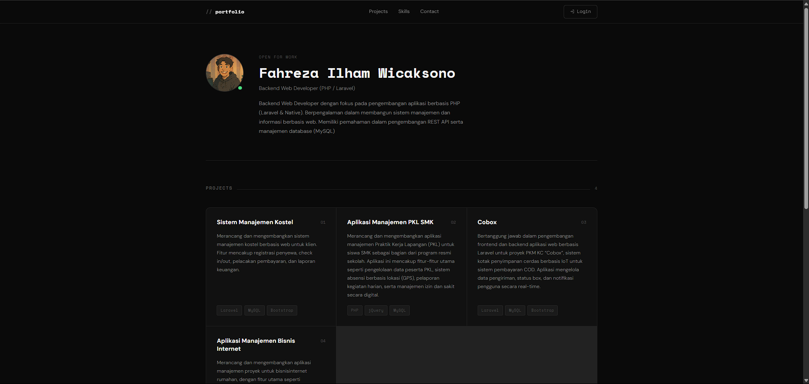
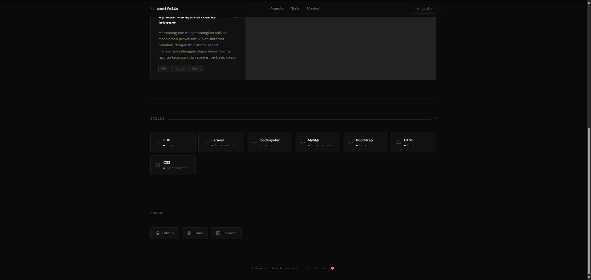
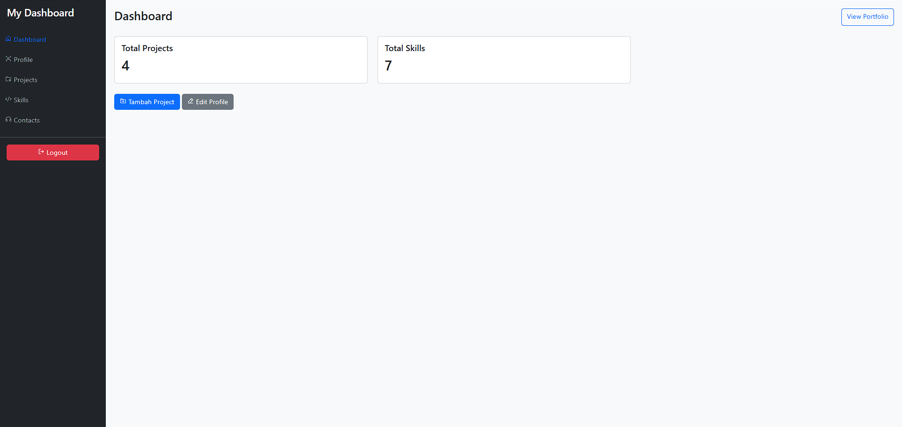
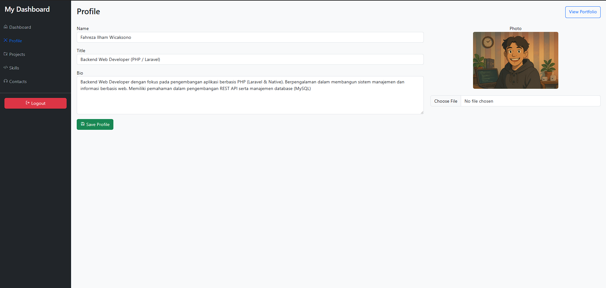
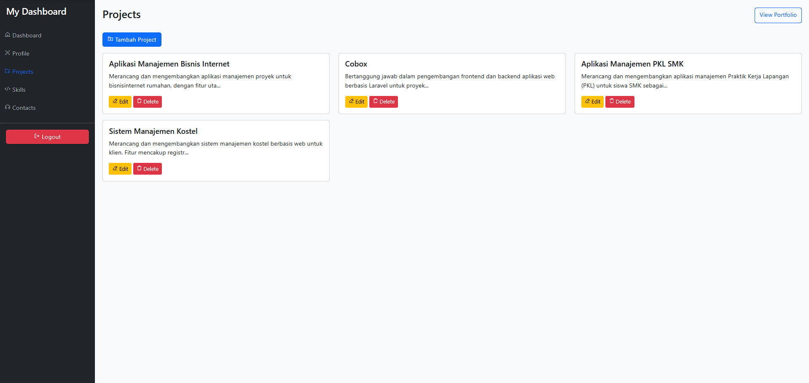
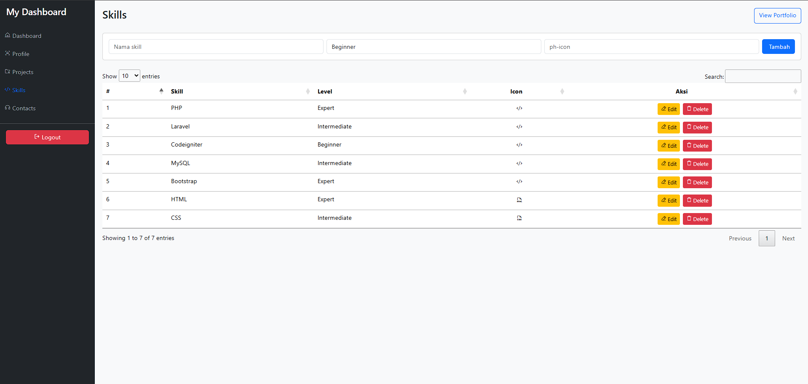
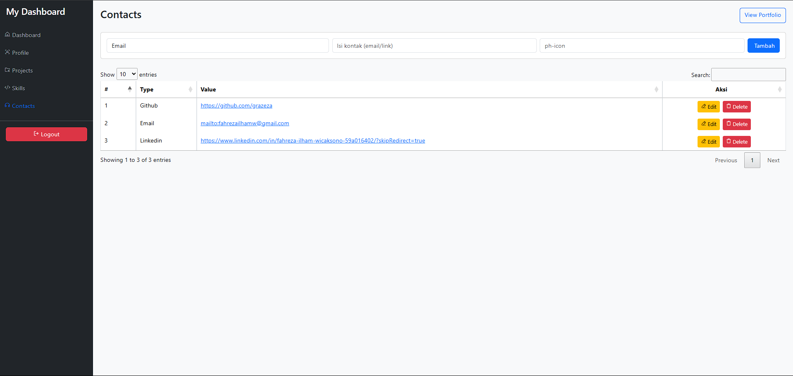

<div align="center">
  <br />

  <h1>LAPORAN PRAKTIKUM <br>
  APLIKASI BERBASIS PLATFORM
  </h1>

  <br />

  <h3>UTS <br>
  Portofolio
  </h3>

  <br />

  

  <br />
  <br />
  <br />

  <h3>Disusun Oleh :</h3>

  <p>
    <strong>Fahreza Ilham Wicaksono</strong><br>
    <strong>2311102191</strong><br>
    <strong>S1 IF-11-REG01</strong>
  </p>

  <br />

  <h3>Dosen Pengampu :</h3>

  <p>
    <strong>Dimas Fanny Hebrasianto Permadi, S.ST., M.Kom</strong>
  </p>
  
  <br />
  <br />
    <h4>Asisten Praktikum :</h4>
    <strong> Apri Pandu Wicaksono </strong> <br>
    <strong>Rangga Pradarrell Fathi</strong>
  <br />

  <h3>LABORATORIUM HIGH PERFORMANCE
 <br>FAKULTAS INFORMATIKA <br>UNIVERSITAS TELKOM PURWOKERTO <br>2026</h3>
</div>

<hr>

## Deskripsi Tugas

Membuat web portofolio dimana layaknya web portofolio pasti ada landing page buat nampilin skill dan data diri kalian, cuma ditambahin dashboard khusus admin buat ngerubah konten dari yang kalian tampilin, misal deskripsi, foto, skill, dan data lain nya bisa dirubah dari dashboard admin untuk ketentuan pertama jelas ya harus pake laravel, buat styling dibebasin boleh tailwind boleh yang lain, trus system nya wajib pake ajax otomatis data ga bisa ditampilin langsung ya, harus fetch data ke backend dulu buat ngambil informasi kalian skill dan data diri

## Pengerjaan

### Route API

```php
use App\Http\Controllers\API\PortfolioController;
use Illuminate\Support\Facades\Route;

Route::prefix('v1')->group(function () {
    Route::get('/portfolio', [PortfolioController::class, 'index']);
});
```

### Controller

#### PortfolioController

```php
class PortfolioController extends Controller
{
    /**
     * Display a listing of the resource.
     */
    public function index()
    {
        $profile = Profile::first();
        $projects = Project::latest()->get();
        $skills = Skill::all();
        $contacts = Contact::all();

        return response()->json([
            'success' => true,
            'data' => [
                'profile' => $profile,
                'projects' => $projects,
                'skills' => $skills,
                'contacts' => $contacts,
            ]
        ]);
    }
}
```

#### ProfileController

```php
class ProfileController extends Controller
{
    /**
     * Display a listing of the resource.
     */
    public function index()
    {
        $page = 'Profile';
        $profile = Profile::first();

        return view('dashboard.profile.index', compact('page', 'profile'));
    }

    /**
     * Show the form for creating a new resource.
     */
    public function create()
    {
        //
    }

    /**
     * Store a newly created resource in storage.
     */
    public function store(Request $request)
    {
        //
    }

    /**
     * Display the specified resource.
     */
    public function show(Profile $profile)
    {
        //
    }

    /**
     * Show the form for editing the specified resource.
     */
    public function edit(Profile $profile)
    {
        //
    }

    /**
     * Update the specified resource in storage.
     */
    public function update(Request $request)
    {
        $validatedData = $request->validate([
            'name' => 'required|string',
            'title' => 'required|string',
            'bio' => 'required|string',
            'photo' => 'nullable|image|max:3072',
        ]);

        $profile = Profile::first();

        if ($request->hasFile('photo')) {
            if ($profile && $profile->photo) {
                Storage::delete($profile->photo);
            }

            $validatedData['photo'] = $request->file('photo')->store('profile-images', 'public');
        }

        if ($profile) {
            $profile->update($validatedData);
            $message = 'Profile updated successfully';
        } else {
            Profile::create($validatedData);
            $message = 'Profile created successfully';
        }

        return redirect()->route('profile.index')->with('success', $message);
    }

    /**
     * Remove the specified resource from storage.
     */
    public function destroy(Profile $profile)
    {
        //
    }
}
```

#### ProjectController

```php
class ProjectController extends Controller
{
    /**
     * Display a listing of the resource.
     */
    public function index()
    {
        $page = 'Projects';
        $projects = Project::get();

        return view('dashboard.projects.index', compact('page', 'projects'));
    }

    /**
     * Show the form for creating a new resource.
     */
    public function create()
    {
        $page = 'Projects';

        return view('dashboard.projects.form', compact('page'));
    }

    /**
     * Store a newly created resource in storage.
     */
    public function store(Request $request)
    {
        $validatedData = $request->validate([
            'title' => 'required|string',
            'description' => 'required|string',
            'tech_stack' => 'required|string'
        ]);

        $validatedData['tech_stack'] = array_map('trim', explode(',', $request->tech_stack));

        Project::create($validatedData);

        return redirect()->route('projects.index')->with('success', 'Project created successfully');
    }

    /**
     * Display the specified resource.
     */
    public function show(Project $project)
    {
        //
    }

    /**
     * Show the form for editing the specified resource.
     */
    public function edit(Project $project)
    {
        $page = 'Projects';

        return view('dashboard.projects.form', compact('page', 'project'));
    }

    /**
     * Update the specified resource in storage.
     */
    public function update(Request $request, Project $project)
    {
        $validatedData = $request->validate([
            'title' => 'required|string',
            'description' => 'required|string',
            'tech_stack' => 'required|string'
        ]);

        $validatedData['tech_stack'] = array_map('trim', explode(',', $request->tech_stack));

        $project->update($validatedData);

        return redirect()->route('projects.index')->with('success', 'Project edited successfully');
    }

    /**
     * Remove the specified resource from storage.
     */
    public function destroy(Project $project)
    {
        $project->delete();

        return redirect()->route('projects.index')->with('success', 'Project deleted successfully');
    }
}

```

#### SkillController

```php
class SkillController extends Controller
{
    /**
     * Display a listing of the resource.
     */
    public function index()
    {
        $page = 'Skills';
        $skills = Skill::get();

        return view('dashboard.skills.index', compact('page', 'skills'));
    }

    /**
     * Show the form for creating a new resource.
     */
    public function create()
    {
        //
    }

    /**
     * Store a newly created resource in storage.
     */
    public function store(Request $request)
    {
        $validatedData = $request->validate([
            'skill_name' => 'required|string',
            'level' => 'required|string|in:beginner,intermediate,expert',
            'icon' => 'required|string'
        ]);

        Skill::create($validatedData);

        return redirect()->route('skills.index')->with('success', 'Skill created successfully');
    }

    /**
     * Display the specified resource.
     */
    public function show(Skill $skill)
    {
        //
    }

    /**
     * Show the form for editing the specified resource.
     */
    public function edit(Skill $skill)
    {
        $page = 'Skills';

        return view('dashboard.skills.edit', compact('page', 'skill'));
    }

    /**
     * Update the specified resource in storage.
     */
    public function update(Request $request, Skill $skill)
    {
        $validatedData = $request->validate([
            'skill_name' => 'required|string',
            'level' => 'required|string|in:beginner,intermediate,expert',
            'icon' => 'required|string'
        ]);

        $skill->update($validatedData);

        return redirect()->route('skills.index')->with('success', 'Skill edited successfully');
    }

    /**
     * Remove the specified resource from storage.
     */
    public function destroy(Skill $skill)
    {
        $skill->delete();

        return redirect()->route('skills.index')->with('success', 'Skill deleted successfully');
    }
}
```

#### ContactController

```php
class ContactController extends Controller
{
    /**
     * Display a listing of the resource.
     */
    public function index()
    {
        $page = 'Contacts';
        $contacts = Contact::get();

        return view('dashboard.contacts.index', compact('page', 'contacts'));
    }

    /**
     * Show the form for creating a new resource.
     */
    public function create()
    {
        //
    }

    /**
     * Store a newly created resource in storage.
     */
    public function store(Request $request)
    {
        $validatedData = $request->validate([
            'type' => 'required|string|in:email,github,linkedin,instagram',
            'value' => 'required|string',
            'icon' => 'required|string'
        ]);

        Contact::create($validatedData);

        return redirect()->route('contacts.index')->with('success', 'Contact created successfully');
    }

    /**
     * Display the specified resource.
     */
    public function show(Contact $contact)
    {
        //
    }

    /**
     * Show the form for editing the specified resource.
     */
    public function edit(Contact $contact)
    {
        $page = 'Contacts';

        return view('dashboard.contacts.edit', compact('page', 'contact'));
    }

    /**
     * Update the specified resource in storage.
     */
    public function update(Request $request, Contact $contact)
    {
        $validatedData = $request->validate([
            'type' => 'required|string|in:email,github,linkedin,instagram',
            'value' => 'required|string',
            'icon' => 'required|string'
        ]);

        $contact->update($validatedData);

        return redirect()->route('contacts.index')->with('success', 'Contact updated successfully');
    }

    /**
     * Remove the specified resource from storage.
     */
    public function destroy(Contact $contact)
    {
        //
    }
}
```

### Output

#### Contoh Data API

```json
{
  "success": true,
  "data": {
    "profile": {
      "id": 1,
      "name": "Fahreza Ilham Wicaksono",
      "title": "Backend Web Developer (PHP / Laravel)",
      "bio": "Backend Web Developer dengan fokus pada pengembangan aplikasi berbasis PHP (Laravel & Native). Berpengalaman dalam membangun sistem manajemen dan informasi berbasis web. Memiliki pemahaman dalam pengembangan REST API serta manajemen database (MySQL)",
      "photo": "profile-images/LxhdWugWUkrgLyI8wFXDfGyAWbESOuVhtlLGuxIh.png",
      "created_at": "2026-04-20T10:24:58.000000Z",
      "updated_at": "2026-04-20T19:51:33.000000Z"
    },
    "projects": [
      {
        "id": 4,
        "title": "Sistem Manajemen Kostel",
        "description": "Merancang dan mengembangkan sistem manajemen kostel berbasis web untuk klien. Fitur mencakup registrasi penyewa, check in/out, pelacakan pembayaran, dan laporan keuangan.",
        "tech_stack": [
          "Laravel",
          "MySQL",
          "Bootstrap"
        ],
        "created_at": "2026-04-20T19:20:57.000000Z",
        "updated_at": "2026-04-20T19:33:30.000000Z"
      },
      {
        "id": 3,
        "title": "Aplikasi Manajemen PKL SMK",
        "description": "Merancang dan mengembangkan aplikasi manajemen Praktik Kerja Lapangan (PKL) untuk siswa SMK sebagai bagian dari program resmi sekolah. Aplikasi ini mencakup fitur-fitur utama seperti pengelolaan data peserta PKL, sistem absensi berbasis lokasi (GPS), pelaporan kegiatan harian, serta manajemen izin dan sakit secara digital.",
        "tech_stack": [
          "PHP",
          "jQuery",
          "MySQL"
        ],
        "created_at": "2026-04-20T19:20:15.000000Z",
        "updated_at": "2026-04-20T19:39:02.000000Z"
      },
      {
        "id": 2,
        "title": "Cobox",
        "description": "Bertanggung jawab dalam pengembangan frontend dan backend aplikasi web berbasis Laravel untuk proyek PKM KC “Cobox”, sistem kotak penyimpanan cerdas berbasis IoT untuk sistem pembayaran COD. Aplikasi mengelola data pengiriman, status box, dan notifikasi pengguna secara real-time.",
        "tech_stack": [
          "Laravel",
          "MySQL",
          "Bootstrap"
        ],
        "created_at": "2026-04-20T08:56:48.000000Z",
        "updated_at": "2026-04-20T19:09:43.000000Z"
      },
      {
        "id": 1,
        "title": "Aplikasi Manajemen Bisnis Internet",
        "description": "Merancang dan mengembangkan aplikasi manajemen proyek untuk bisnisinternet rumahan, dengan fitur utama seperti manajemen pelanggan, tugas harian teknisi, laporan keuangan, dan absensi berbasis lokasi.",
        "tech_stack": [
          "PHP",
          "jQuery",
          "MySQL"
        ],
        "created_at": "2026-04-20T08:50:45.000000Z",
        "updated_at": "2026-04-20T19:09:52.000000Z"
      }
    ],
    "skills": [
      {
        "id": 2,
        "skill_name": "PHP",
        "level": "expert",
        "icon": "ph-code",
        "created_at": "2026-04-20T09:23:53.000000Z",
        "updated_at": "2026-04-20T09:23:53.000000Z"
      },
      {
        "id": 3,
        "skill_name": "Laravel",
        "level": "intermediate",
        "icon": "ph-code",
        "created_at": "2026-04-20T09:24:15.000000Z",
        "updated_at": "2026-04-20T09:24:15.000000Z"
      },
      {
        "id": 4,
        "skill_name": "Codeigniter",
        "level": "beginner",
        "icon": "ph-code",
        "created_at": "2026-04-20T19:21:13.000000Z",
        "updated_at": "2026-04-20T19:21:13.000000Z"
      },
      {
        "id": 5,
        "skill_name": "MySQL",
        "level": "intermediate",
        "icon": "ph-code",
        "created_at": "2026-04-20T19:21:27.000000Z",
        "updated_at": "2026-04-20T19:21:27.000000Z"
      },
      {
        "id": 6,
        "skill_name": "Bootstrap",
        "level": "expert",
        "icon": "ph-code",
        "created_at": "2026-04-20T19:21:48.000000Z",
        "updated_at": "2026-04-20T19:21:48.000000Z"
      },
      {
        "id": 7,
        "skill_name": "HTML",
        "level": "expert",
        "icon": "ph-file-html",
        "created_at": "2026-04-20T19:40:05.000000Z",
        "updated_at": "2026-04-20T19:40:05.000000Z"
      },
      {
        "id": 8,
        "skill_name": "CSS",
        "level": "intermediate",
        "icon": "ph-file-css",
        "created_at": "2026-04-20T19:40:15.000000Z",
        "updated_at": "2026-04-20T19:40:15.000000Z"
      }
    ],
    "contacts": [
      {
        "id": 1,
        "type": "github",
        "value": "https://github.com/grazeza",
        "icon": "ph-github-logo",
        "created_at": "2026-04-20T10:52:36.000000Z",
        "updated_at": "2026-04-20T10:52:36.000000Z"
      },
      {
        "id": 2,
        "type": "email",
        "value": "mailto:fahrezailhamw@gmail.com",
        "icon": "ph-at",
        "created_at": "2026-04-20T19:40:42.000000Z",
        "updated_at": "2026-04-20T19:48:15.000000Z"
      },
      {
        "id": 3,
        "type": "linkedin",
        "value": "https://www.linkedin.com/in/fahreza-ilham-wicaksono-59a016402/?skipRedirect=true",
        "icon": "ph-linkedin-logo",
        "created_at": "2026-04-20T19:42:30.000000Z",
        "updated_at": "2026-04-20T19:42:30.000000Z"
      }
    ]
  }
}
```

#### Portofolio

```php
<!DOCTYPE html>
<html lang="id">

<head>
    <meta charset="UTF-8" />
    <meta name="viewport" content="width=device-width, initial-scale=1.0" />
    <title>Portfolio</title>

    <link rel="icon"
        href="data:image/svg+xml,<svg xmlns='http://www.w3.org/2000/svg' viewBox='0 0 100 100'><text y='.9em' font-size='80'>👨‍🎓</text></svg>">

    {{-- Google Fonts: Space Mono (monospace accent) + DM Sans (clean body) --}}
    <link
        href="https://fonts.googleapis.com/css2?family=Space+Mono:wght@400;700&family=DM+Sans:ital,opsz,wght@0,9..40,300;0,9..40,400;0,9..40,500;0,9..40,700;1,9..40,300&display=swap"
        rel="stylesheet" />

    {{-- Phosphor Icons --}}
    <script src="https://unpkg.com/@phosphor-icons/web"></script>

    {{-- jQuery --}}
    <script src="https://code.jquery.com/jquery-3.7.1.min.js"></script>

    {{-- custom CSS --}}
    <link rel="stylesheet" href="{{ asset('css/portofolio.css') }}">
</head>

<body>

    {{-- ── Loading Overlay ── --}}
    <div id="loading-overlay">
        <div>
            <span class="loader-dot"></span>
            <span class="loader-dot"></span>
            <span class="loader-dot"></span>
        </div>
    </div>

    {{-- ── Header ── --}}
    <header>
        <div class="shell">
            <nav class="nav-inner">
                <span class="nav-brand"><span>//</span> portfolio</span>

                <ul class="nav-links">
                    <li><a href="#projects">Projects</a></li>
                    <li><a href="#skills">Skills</a></li>
                    <li><a href="#contact">Contact</a></li>
                </ul>

                <div class="nav-right">
                    <a href="{{ route('login.page') }}" class="btn-login">
                        <i class="ph ph-sign-in"></i> Login
                    </a>

                    <button class="hamburger" id="hamburger" aria-label="Menu">
                        <span></span><span></span><span></span>
                    </button>
                </div>
            </nav>

            {{-- Mobile drawer --}}
            <div class="mobile-nav" id="mobile-nav">
                <a href="#projects">Projects</a>
                <a href="#skills">Skills</a>
                <a href="#contact">Contact</a>
            </div>
        </div>
    </header>

    {{-- ── Main Content ── --}}
    <main>
        <div class="shell">

            {{-- ── Hero / Profile ── --}}
            <section id="hero">
                <div class="hero-inner fade-in" id="hero-content">
                    <div class="hero-photo-wrap" id="profile-photo-wrap">
                        <div class="hero-photo-placeholder"><i class="ph ph-user"></i></div>
                    </div>

                    <div class="hero-text">
                        <p class="hero-label">Open for work</p>
                        <h1 class="hero-name" id="profile-name">—</h1>
                        <p class="hero-title" id="profile-title">—</p>
                        <p class="hero-bio" id="profile-bio">—</p>
                    </div>
                </div>
            </section>

            {{-- ── Projects ── --}}
            <section id="projects">
                <div class="section-header">
                    <h2 class="section-title">Projects</h2>
                    <div class="section-line"></div>
                    <span class="section-count" id="projects-count">0</span>
                </div>

                <div class="projects-grid fade-in" id="projects-grid">
                    <div class="state-box">Loading...</div>
                </div>
            </section>

            {{-- ── Skills ── --}}
            <section id="skills">
                <div class="section-header">
                    <h2 class="section-title">Skills</h2>
                    <div class="section-line"></div>
                    <span class="section-count" id="skills-count">0</span>
                </div>

                <div class="skills-grid fade-in" id="skills-grid">
                    <div class="state-box">Loading...</div>
                </div>
            </section>

            {{-- ── Contact ── --}}
            <section id="contact">
                <div class="section-header">
                    <h2 class="section-title">Contact</h2>
                    <div class="section-line"></div>
                </div>

                <div class="contacts-list fade-in" id="contacts-list">
                    <div class="state-box">Loading...</div>
                </div>
            </section>

        </div>{{-- /.shell --}}
    </main>

    <footer>
        <div class="shell">
            <span id="footer-name">Portfolio</span> &nbsp;·&nbsp; Built with 💗
        </div>
    </footer>

    {{-- ── Scripts ── --}}
    <script>
        $(document).ready(function() {

            // ── Hamburger Toggle ──
            $('#hamburger').on('click', function() {
                $(this).toggleClass('open');
                $('#mobile-nav').toggleClass('open');
            });

            // Close mobile nav when a link is clicked
            $('#mobile-nav a').on('click', function() {
                $('#hamburger').removeClass('open');
                $('#mobile-nav').removeClass('open');
            });

            // ── Intersection Observer for fade-in ──
            function observeFade() {
                if (!window.IntersectionObserver) {
                    $('.fade-in').addClass('visible');
                    return;
                }

                var observer = new IntersectionObserver(function(entries) {
                    entries.forEach(function(entry) {
                        if (entry.isIntersecting) {
                            $(entry.target).addClass('visible');
                            observer.unobserve(entry.target);
                        }
                    });
                }, {
                    threshold: 0.08
                });

                $('.fade-in').each(function() {
                    observer.observe(this);
                });
            }

            // ── Render Helpers ──
            function renderProfile(profile) {
                $('#profile-name').text(profile.name || '—');
                $('#profile-title').text(profile.title || '');
                $('#profile-bio').text(profile.bio || '');
                $('#footer-name').text(profile.name || 'Portfolio');

                if (profile.photo) {
                    var src = "{{ asset('storage/') }}/" + profile.photo;
                    var $img = $('', {
                        src: src,
                        alt: profile.name,
                        class: 'hero-photo'
                    });
                    $('#profile-photo-wrap').empty().append($img).append(
                        $('<span class="status-dot"></span>')
                    );
                } else {
                    $('#profile-photo-wrap').html(
                        '<div class="hero-photo-placeholder"><i class="ph ph-user"></i></div>'
                    );
                }
            }

            function renderProjects(projects) {
                $('#projects-count').text(projects.length);

                if (!projects.length) {
                    $('#projects-grid').html('<div class="state-box">No projects yet.</div>');
                    return;
                }
                var html = '';

                $.each(projects, function(i, p) {
                    var tagsHtml = '';
                    if (p.tech_stack && p.tech_stack.length) {
                        $.each(p.tech_stack, function(_, t) {
                            tagsHtml += '<span class="tag">' + $('<div>').text(t).html() +
                                '</span>';
                        });
                    }
                    html += '<div class="project-card">' +
                        '<div class="project-card-top">' +
                        '<span class="project-title">' + $('<div>').text(p.title).html() + '</span>' +
                        '<span class="project-index">0' + (i + 1) + '</span>' +
                        '</div>' +
                        '<p class="project-desc">' + $('<div>').text(p.description).html() + '</p>' +
                        '<div class="project-tags">' + tagsHtml + '</div>' +
                        '</div>';
                });

                $('#projects-grid').html(html);
            }

            function renderSkills(skills) {
                $('#skills-count').text(skills.length);

                if (!skills.length) {
                    $('#skills-grid').html('<div class="state-box">No skills listed.</div>');
                    return;
                }

                var html = '';
                $.each(skills, function(_, s) {
                    var lvl = s.level || 'beginner';
                    var icon = s.icon || 'ph-circle';
                    html += '<div class="skill-card level-' + lvl + '">' +
                        '<i class="ph ' + icon + ' skill-icon"></i>' +
                        '<div class="skill-info">' +
                        '<div class="skill-name">' + $('<div>').text(s.skill_name).html() + '</div>' +
                        '<div class="skill-level">' + lvl + '</div>' +
                        '</div>' +
                        '</div>';
                });
                $('#skills-grid').html(html);
            }

            function renderContacts(contacts) {
                if (!contacts.length) {
                    $('#contacts-list').html('<div class="state-box">No contact info.</div>');
                    return;
                }

                var html = '';
                $.each(contacts, function(_, c) {
                    var icon = c.icon || 'ph-link';
                    var value = c.value || '#';
                    var type = c.type || 'link';
                    html += '<a href="' + value + '" target="_blank" rel="noopener" class="contact-link">' +
                        '<i class="ph ' + icon + '"></i>' +
                        $('<div>').text(type.charAt(0).toUpperCase() + type.slice(1)).html() +
                        '</a>';
                });

                $('#contacts-list').html(html);
            }

            // ── Fetch Portfolio Data ──
            $.ajax({
                url: '/api/v1/portfolio',
                method: 'GET',
                dataType: 'json',
                success: function(response) {
                    if (!response.success || !response.data) {
                        showError('Unexpected response format.');
                        return;
                    }

                    var data = response.data;
                    renderProfile(data.profile || {});
                    renderProjects(data.projects || []);
                    renderSkills(data.skills || []);
                    renderContacts(data.contacts || []);

                    // Hide overlay
                    $('#loading-overlay').addClass('hidden');
                    setTimeout(function() {
                        $('#loading-overlay').remove();
                    }, 500);

                    // Trigger fade-in observers after DOM is updated
                    setTimeout(observeFade, 50);
                },
                error: function(xhr) {
                    showError('Failed to load data. (' + xhr.status + ')');
                }
            });

            function showError(msg) {
                var box = '<div class="state-box">' + msg + '</div>';
                $('#projects-grid, #skills-grid, #contacts-list').html(box);
                $('#hero-content').html('<div class="state-box">' + msg + '</div>');
                $('#loading-overlay').addClass('hidden');

                setTimeout(function() {
                    $('#loading-overlay').remove();
                }, 500);
                observeFade();
            }

        });
    </script>

</body>

</html>

```





#### Dashboard










