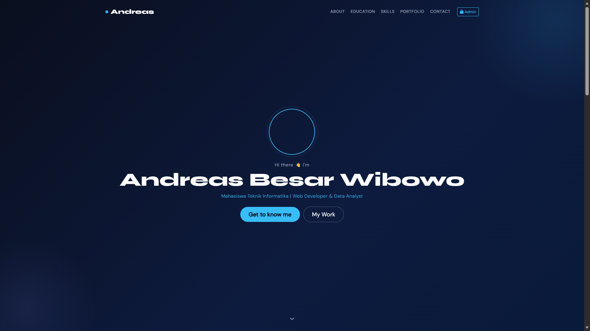
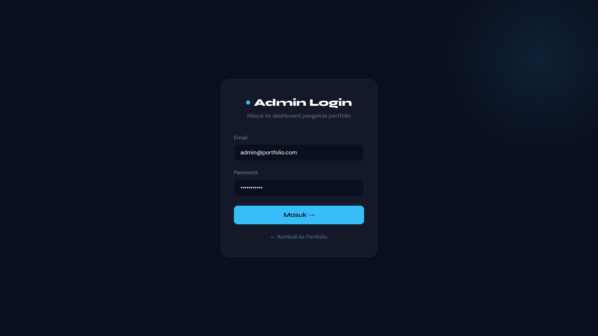

<div align="center">
  <br />

  <h1>LAPORAN PRAKTIKUM <br>
  APLIKASI BERBASIS PLATFORM
  </h1>

  <br />

  <h3>UTS (Ujian Tengah Semester) | PORTFOLIO <br>
  </h3>

  <br />

  

  <br />
  <br />
  <br />

  <h3>Disusun Oleh :</h3>

  <p>
    <strong>Andreas Besar Wibowo</strong><br>
    <strong>2311102198</strong><br>
    <strong>S1 IF-11-REG01</strong>
  </p>

  <br />

  <h3>Dosen Pengampu :</h3>

  <p>
    <strong>Dimas Fanny Hebrasianto Permadi, S.ST., M.Kom</strong>
  </p>
  
  <br />
    <h4>Asisten Praktikum :</h4>
    <strong>Apri Pandu Wicaksono </strong> <br>
    <strong>Rangga Pradarrell Fathi</strong>
  <br />

  <h3>LABORATORIUM HIGH PERFORMANCE
 <br>FAKULTAS INFORMATIKA <br>UNIVERSITAS TELKOM PURWOKERTO <br>2026</h3>
</div>

<hr>

## Tugas | Buat Portfolio
### Deskripsi
Membuat web portofolio dimana layaknya web portofolio pasti ada landing page buat nampilin skill dan data diri kalian, cuma ditambahin dashboard khusus admin buat ngerubah konten dari yang kalian tampilin, misal deskripsi, foto, skill, dan data lain nya bisa dirubah dari dashboard admin untuk ketentuan pertama jelas ya harus pake laravel, buat styling dibebasin boleh tailwind boleh yang lain, trus system nya wajib pake ajax otomatis data ga bisa ditampilin langsung ya, harus fetch data ke backend dulu buat ngambil informasi kalian skill dan data diri

## Jawaban
### Controller
1. Dashboard Controller
```php
<?php

namespace App\Http\Controllers\Admin;

use App\Http\Controllers\Controller;
use App\Models\Education;
use App\Models\Portfolio;
use App\Models\Profile;
use App\Models\Skill;
use Illuminate\Http\Request;
use Illuminate\Support\Facades\Storage;

class DashboardController extends Controller
{
    public function index()
    {
        return view('admin.dashboard');
    }

    // ═══════════════════════════════════════════════
    //  PROFILE
    // ═══════════════════════════════════════════════

    public function profileEdit()
    {
        $profile = Profile::first();
        if (!$profile) {
            // Kembalikan object kosong agar form tetap bisa dirender
            return response()->json([
                'id' => null,
                'name' => '',
                'tagline' => '',
                'about' => '',
                'email' => '',
                'photo' => null,
                'photo_url' => asset('images/default-avatar.svg'),
                'instagram' => '',
                'linkedin' => '',
                'github' => '',
            ]);
        }
        $data = $profile->toArray();
        $data['photo_url'] = $profile->photo
            ? asset('storage/' . $profile->photo)
            : asset('images/default-avatar.svg');
        return response()->json($data);
    }

    public function profileUpdate(Request $request)
    {
        $request->validate([
            'name' => 'required|string|max:255',
            'tagline' => 'nullable|string|max:255',
            'about' => 'required|string',
            'email' => 'required|email|max:255',
            'instagram' => 'nullable|url|max:255',
            'linkedin' => 'nullable|url|max:255',
            'github' => 'nullable|url|max:255',
            'photo' => 'nullable|image|mimes:jpg,jpeg,png,webp|max:2048',
        ]);

        // firstOrNew tanpa kondisi = ambil record pertama atau buat baru
        $profile = Profile::first() ?? new Profile();
        $profile->fill($request->only('name', 'tagline', 'about', 'email', 'instagram', 'linkedin', 'github'));

        if ($request->hasFile('photo')) {
            if ($profile->photo) {
                Storage::disk('public')->delete($profile->photo);
            }
            $profile->photo = $request->file('photo')->store('photos', 'public');
        }

        $profile->save();
        return response()->json(['success' => true, 'message' => 'Profil berhasil diperbarui!']);
    }

    // ═══════════════════════════════════════════════
    //  EDUCATION
    // ═══════════════════════════════════════════════

    public function educationIndex()
    {
        return response()->json(Education::orderBy('order')->orderBy('id')->get());
    }

    public function educationStore(Request $request)
    {
        $validated = $request->validate([
            'institution' => 'required|string|max:255',
            'major' => 'required|string|max:255',
            'period' => 'required|string|max:100',
            'order' => 'nullable|integer|min:0',
        ]);

        $education = Education::create([
            'institution' => $validated['institution'],
            'major' => $validated['major'],
            'period' => $validated['period'],
            'order' => $validated['order'] ?? 0,
        ]);

        return response()->json([
            'success' => true,
            'data' => $education,
            'message' => 'Pendidikan berhasil ditambahkan!',
        ]);
    }

    public function educationUpdate(Request $request, $id)
    {
        // Cari manual agar error lebih jelas jika tidak ketemu
        $education = Education::findOrFail($id);

        $validated = $request->validate([
            'institution' => 'required|string|max:255',
            'major' => 'required|string|max:255',
            'period' => 'required|string|max:100',
            'order' => 'nullable|integer|min:0',
        ]);

        $education->update([
            'institution' => $validated['institution'],
            'major' => $validated['major'],
            'period' => $validated['period'],
            'order' => $validated['order'] ?? $education->order,
        ]);

        return response()->json([
            'success' => true,
            'data' => $education->fresh(),
            'message' => 'Pendidikan berhasil diperbarui!',
        ]);
    }

    public function educationDestroy($id)
    {
        $education = Education::findOrFail($id);
        $education->delete();
        return response()->json(['success' => true, 'message' => 'Pendidikan berhasil dihapus!']);
    }

    // ═══════════════════════════════════════════════
    //  SKILLS
    // ═══════════════════════════════════════════════

    public function skillIndex()
    {
        return response()->json(Skill::orderBy('order')->orderBy('id')->get());
    }

    public function skillStore(Request $request)
    {
        $validated = $request->validate([
            'name' => 'required|string|max:100',
            'color' => 'required|string|max:30',
            'order' => 'nullable|integer|min:0',
        ]);

        $skill = Skill::create([
            'name' => $validated['name'],
            'color' => $validated['color'],
            'order' => $validated['order'] ?? 0,
        ]);

        return response()->json([
            'success' => true,
            'data' => $skill,
            'message' => 'Skill berhasil ditambahkan!',
        ]);
    }

    public function skillUpdate(Request $request, $id)
    {
        $skill = Skill::findOrFail($id);

        $validated = $request->validate([
            'name' => 'required|string|max:100',
            'color' => 'required|string|max:30',
            'order' => 'nullable|integer|min:0',
        ]);

        $skill->update([
            'name' => $validated['name'],
            'color' => $validated['color'],
            'order' => $validated['order'] ?? $skill->order,
        ]);

        return response()->json([
            'success' => true,
            'data' => $skill->fresh(),
            'message' => 'Skill berhasil diperbarui!',
        ]);
    }

    public function skillDestroy($id)
    {
        $skill = Skill::findOrFail($id);
        $skill->delete();
        return response()->json(['success' => true, 'message' => 'Skill berhasil dihapus!']);
    }

    // ═══════════════════════════════════════════════
    //  PORTFOLIO
    // ═══════════════════════════════════════════════

    public function portfolioIndex()
    {
        return response()->json(Portfolio::orderBy('order')->orderBy('id')->get());
    }

    public function portfolioStore(Request $request)
    {
        $validated = $request->validate([
            'title' => 'required|string|max:255',
            'description' => 'nullable|string',
            'order' => 'nullable|integer|min:0',
            'image' => 'nullable|image|mimes:jpg,jpeg,png,webp|max:2048',
        ]);

        $data = [
            'title' => $validated['title'],
            'description' => $validated['description'] ?? null,
            'order' => $validated['order'] ?? 0,
        ];

        if ($request->hasFile('image')) {
            $data['image'] = $request->file('image')->store('portfolios', 'public');
        }

        $portfolio = Portfolio::create($data);
        return response()->json([
            'success' => true,
            'data' => $portfolio,
            'message' => 'Portfolio berhasil ditambahkan!',
        ]);
    }

    public function portfolioUpdate(Request $request, $id)
    {
        $portfolio = Portfolio::findOrFail($id);

        $validated = $request->validate([
            'title' => 'required|string|max:255',
            'description' => 'nullable|string',
            'order' => 'nullable|integer|min:0',
            'image' => 'nullable|image|mimes:jpg,jpeg,png,webp|max:2048',
        ]);

        $data = [
            'title' => $validated['title'],
            'description' => $validated['description'] ?? null,
            'order' => $validated['order'] ?? $portfolio->order,
        ];

        if ($request->hasFile('image')) {
            if ($portfolio->image) {
                Storage::disk('public')->delete($portfolio->image);
            }
            $data['image'] = $request->file('image')->store('portfolios', 'public');
        }

        $portfolio->update($data);
        return response()->json([
            'success' => true,
            'data' => $portfolio->fresh(),
            'message' => 'Portfolio berhasil diperbarui!',
        ]);
    }

    public function portfolioDestroy($id)
    {
        $portfolio = Portfolio::findOrFail($id);
        if ($portfolio->image) {
            Storage::disk('public')->delete($portfolio->image);
        }
        $portfolio->delete();
        return response()->json(['success' => true, 'message' => 'Portfolio berhasil dihapus!']);
    }
}
```
2. Api Controller
```php
<?php

namespace App\Http\Controllers;

use App\Models\Education;
use App\Models\Portfolio;
use App\Models\Profile;
use App\Models\Skill;
use Illuminate\Http\JsonResponse;

class ApiController extends Controller
{
    public function profile(): JsonResponse
    {
        $profile = Profile::first();

        // Guard: jika tabel kosong, kembalikan object default agar frontend tidak crash
        if (!$profile) {
            return response()->json([
                'name' => '',
                'tagline' => '',
                'about' => '',
                'email' => '',
                'photo_url' => asset('images/default-avatar.svg'),
                'instagram' => null,
                'linkedin' => null,
                'github' => null,
            ]);
        }

        $data = $profile->toArray();
        $data['photo_url'] = $profile->photo
            ? asset('storage/' . $profile->photo)
            : asset('images/default-avatar.svg');

        return response()->json($data);
    }

    public function educations(): JsonResponse
    {
        return response()->json(Education::orderBy('order')->orderBy('id')->get());
    }

    public function skills(): JsonResponse
    {
        return response()->json(Skill::orderBy('order')->orderBy('id')->get());
    }

    public function portfolios(): JsonResponse
    {
        $portfolios = Portfolio::orderBy('order')->orderBy('id')->get()->map(function ($item) {
            $item->image_url = $item->image
                ? asset('storage/' . $item->image)
                : asset('images/default-project.svg');
            return $item;
        });
        return response()->json($portfolios);
    }
}
```
2. AutenticatedSessionController
```php
<?php

namespace App\Http\Controllers\Auth;

use App\Http\Controllers\Controller;
use Illuminate\Http\Request;
use Illuminate\Support\Facades\Auth;

class AuthenticatedSessionController extends Controller
{
    /**
     * Show the login form.
     */
    public function create()
    {
        if (Auth::check()) {
            return redirect()->route('admin.dashboard');
        }
        return view('auth.login');
    }

    /**
     * Handle login attempt.
     */
    public function store(Request $request)
    {
        $request->validate([
            'email' => 'required|email',
            'password' => 'required|string',
        ]);

        $credentials = $request->only('email', 'password');

        if (Auth::attempt($credentials, $request->boolean('remember'))) {
            $request->session()->regenerate();
            return redirect()->intended(route('admin.dashboard'));
        }

        return back()
            ->withErrors(['email' => 'Email atau password salah.'])
            ->withInput($request->only('email'));
    }

    /**
     * Handle logout.
     */
    public function destroy(Request $request)
    {
        Auth::logout();
        $request->session()->invalidate();
        $request->session()->regenerateToken();
        return redirect()->route('login');
    }
}
```
### Middleware
1. Redirectfauthentitaced
```php
<?php

namespace App\Http\Middleware;

use Closure;
use Illuminate\Http\Request;
use Illuminate\Support\Facades\Auth;

class RedirectIfAuthenticated
{
    /**
     * Handle an incoming request.
     * Redirect authenticated users away from guest-only pages (login).
     */
    public function handle(Request $request, Closure $next, string ...$guards): mixed
    {
        $guards = empty($guards) ? [null] : $guards;

        foreach ($guards as $guard) {
            if (Auth::guard($guard)->check()) {
                return redirect()->route('admin.dashboard');
            }
        }

        return $next($request);
    }
}
```
### Models
1. Education
```php
<?php

namespace App\Models;

use Illuminate\Database\Eloquent\Model;

class Education extends Model
{
    protected $table = 'educations';
    protected $fillable = ['institution', 'major', 'period', 'order'];
}
```
2. Portfolio
```php
<?php

namespace App\Models;

use Illuminate\Database\Eloquent\Model;

class Portfolio extends Model
{
    protected $fillable = ['title', 'description', 'image', 'link', 'order'];
}
```
3. Profile
```php
<?php

namespace App\Models;

use Illuminate\Database\Eloquent\Model;

class Profile extends Model
{
    protected $fillable = [
        'name', 'tagline', 'about', 'email',
        'photo', 'instagram', 'linkedin', 'github',
    ];
}
```
4. Skill
```php
<?php

namespace App\Models;

use Illuminate\Database\Eloquent\Model;

class Skill extends Model
{
    protected $fillable = ['name', 'color', 'order'];
}
```
### Database Migrations
1. Create Profiles Table
```php
<?php

use Illuminate\Database\Migrations\Migration;
use Illuminate\Database\Schema\Blueprint;
use Illuminate\Support\Facades\Schema;

return new class extends Migration {
    /**
     * Run the migrations.
     */
    public function up(): void
    {
        Schema::create('profiles', function (Blueprint $table) {
            $table->id();
            $table->string('name');
            $table->string('tagline')->nullable();
            $table->text('about');
            $table->string('email');
            $table->string('photo')->nullable();
            $table->string('instagram')->nullable();
            $table->string('linkedin')->nullable();
            $table->string('github')->nullable();
            $table->timestamps();
        });
    }

    /**
     * Reverse the migrations.
     */
    public function down(): void
    {
        Schema::dropIfExists('profiles');
    }
};

```
2. Create Education Table
```php
<?php

use Illuminate\Database\Migrations\Migration;
use Illuminate\Database\Schema\Blueprint;
use Illuminate\Support\Facades\Schema;

return new class extends Migration {
    /**
     * Run the migrations.
     */
    public function up(): void
    {
        Schema::create('educations', function (Blueprint $table) {
            $table->id();
            $table->string('institution');
            $table->string('major');
            $table->string('period');
            $table->integer('order')->default(0);
            $table->timestamps();
        });
    }

    /**
     * Reverse the migrations.
     */
    public function down(): void
    {
        Schema::dropIfExists('educations');
    }
};

```
3. Create Skills Table
```php
<?php

use Illuminate\Database\Migrations\Migration;
use Illuminate\Database\Schema\Blueprint;
use Illuminate\Support\Facades\Schema;

return new class extends Migration {
    /**
     * Run the migrations.
     */
    public function up(): void
    {
        Schema::create('skills', function (Blueprint $table) {
            $table->id();
            $table->string('name');
            $table->string('color')->default('primary');
            $table->integer('order')->default(0);
            $table->timestamps();

        });
    }

    /**
     * Reverse the migrations.
     */
    public function down(): void
    {
        Schema::dropIfExists('skills');
    }
};

```
4. Create Portfolios Table
```php
<?php

use Illuminate\Database\Migrations\Migration;
use Illuminate\Database\Schema\Blueprint;
use Illuminate\Support\Facades\Schema;

return new class extends Migration {
    /**
     * Run the migrations.
     */
    public function up(): void
    {
        Schema::create('portfolios', function (Blueprint $table) {
            $table->id();
            $table->string('title');
            $table->text('description')->nullable();
            $table->string('image')->nullable();
            $table->integer('order')->default(0);
            $table->timestamps();
        });
    }

    /**
     * Reverse the migrations.
     */
    public function down(): void
    {
        Schema::dropIfExists('portfolios');
    }
};

```
### Database Seeders
1. Database Seeders
```php
<?php

namespace Database\Seeders;

use Illuminate\Database\Seeder;
use Illuminate\Support\Facades\DB;
use Illuminate\Support\Facades\Hash;

class DatabaseSeeder extends Seeder
{
    public function run(): void
    {
        // Admin user (skip if exists)
        if (!DB::table('users')->where('email', 'admin@portfolio.com')->exists()) {
            DB::table('users')->insert([
                'name' => 'Admin',
                'email' => 'admin@portfolio.com',
                'password' => Hash::make('password123'),
                'created_at' => now(),
                'updated_at' => now(),
            ]);
        }

        // Profile
        if (!DB::table('profiles')->exists()) {
            DB::table('profiles')->insert([
                'name' => 'Andreas Besar Wibowo',
                'tagline' => 'Mahasiswa Teknik Informatika | Web Developer & Data Analyst',
                'about' => 'Saya adalah Andreas Besar Wibowo, mahasiswa Telkom University Purwokerto angkatan 2023 yang saat ini menempuh pendidikan di semester 6 pada program studi Teknik Informatika. Saya memiliki minat dalam bidang pemrograman web dan analisis data, serta terus mengembangkan kemampuan dalam membangun aplikasi dan mengolah data untuk menghasilkan insight yang bermanfaat. Saya terbiasa menggunakan berbagai tools dan bahasa pemrograman untuk menyelesaikan permasalahan secara logis, sistematis, dan efisien.',
                'email' => 'andreaswibowo903@gmail.com',
                'photo' => null,
                'instagram' => 'https://www.instagram.com/andreaswibowooo/',
                'linkedin' => 'https://www.linkedin.com/in/andreas-besar-wibowo-b282a23b4/',
                'github' => 'https://github.com/AndreasBesar29',
                'created_at' => now(),
                'updated_at' => now(),
            ]);
        }

        // Education
        if (!DB::table('educations')->exists()) {
            DB::table('educations')->insert([
                [
                    'institution' => 'Telkom University Purwokerto',
                    'major' => 'S1 Teknik Informatika',
                    'period' => '2023 - Sekarang',
                    'order' => 1,
                    'created_at' => now(),
                    'updated_at' => now(),
                ],
                [
                    'institution' => 'SMA Yos Sudarso Cilacap',
                    'major' => 'Peminatan MIPA',
                    'period' => '2020 - 2023',
                    'order' => 2,
                    'created_at' => now(),
                    'updated_at' => now(),
                ],
            ]);
        }

        // Skills
        if (!DB::table('skills')->exists()) {
            DB::table('skills')->insert([
                ['name' => 'HTML', 'color' => '#e34c26', 'order' => 1, 'created_at' => now(), 'updated_at' => now()],
                ['name' => 'CSS', 'color' => '#264de4', 'order' => 2, 'created_at' => now(), 'updated_at' => now()],
                ['name' => 'JavaScript', 'color' => '#f7df1e', 'order' => 3, 'created_at' => now(), 'updated_at' => now()],
                ['name' => 'Bootstrap', 'color' => '#7952b3', 'order' => 4, 'created_at' => now(), 'updated_at' => now()],
                ['name' => 'Python', 'color' => '#3572A5', 'order' => 5, 'created_at' => now(), 'updated_at' => now()],
                ['name' => 'Laravel', 'color' => '#ff2d20', 'order' => 6, 'created_at' => now(), 'updated_at' => now()],
                ['name' => 'Java', 'color' => '#b07219', 'order' => 7, 'created_at' => now(), 'updated_at' => now()],
            ]);
        }

        // Portfolios
        if (!DB::table('portfolios')->exists()) {
            DB::table('portfolios')->insert([
                [
                    'title' => 'Project Membuat Website',
                    'description' => 'Membangun website portfolio responsif menggunakan HTML, CSS, Bootstrap, dan JavaScript dengan fitur animasi modern dan typing effect.',
                    'image' => null,
                    'order' => 1,
                    'created_at' => now(),
                    'updated_at' => now(),
                ],
                [
                    'title' => 'Project Analisis Rute pada Gmaps',
                    'description' => 'Menganalisis dan memvisualisasikan rute menggunakan Google Maps API untuk optimasi perjalanan dan pencarian jalur terpendek.',
                    'image' => null,
                    'order' => 2,
                    'created_at' => now(),
                    'updated_at' => now(),
                ],
            ]);
        }
    }
}
```
### CSS
1. Admin 
```php
/* ═══════════════════════════════════════════════
   ADMIN DASHBOARD CSS
   Theme: Dark navy + cyan accent
═══════════════════════════════════════════════ */

:root {
    --bg: #0a0f1e;
    --sidebar: #0d1428;
    --main: #0e1630;
    --card: #131e35;
    --border: rgba(99, 179, 237, 0.15);
    --accent: #38bdf8;
    --accent2: #818cf8;
    --text: #e2e8f0;
    --muted: #64748b;
    --danger: #f87171;
    --success: #34d399;
    --sidebar-w: 240px;
    --radius: 12px;
}

* {
    box-sizing: border-box;
    margin: 0;
    padding: 0;
}

body {
    font-family: "DM Sans", sans-serif;
    background: var(--main);
    color: var(--text);
    display: flex;
    min-height: 100vh;
}

/* ── SIDEBAR ── */
.sidebar {
    width: var(--sidebar-w);
    background: var(--sidebar);
    border-right: 1px solid var(--border);
    display: flex;
    flex-direction: column;
    position: fixed;
    top: 0;
    left: 0;
    height: 100vh;
    z-index: 200;
    transition:
        width 0.3s,
        transform 0.3s;
    overflow: hidden;
}
.sidebar.collapsed {
    width: 0;
    transform: translateX(-100%);
}

.sidebar-brand {
    padding: 1.6rem 1.4rem;
    font-family: "Syne", sans-serif;
    font-weight: 800;
    font-size: 1.1rem;
    color: #fff;
    display: flex;
    align-items: center;
    gap: 10px;
    border-bottom: 1px solid var(--border);
    white-space: nowrap;
}
.brand-dot {
    width: 10px;
    height: 10px;
    border-radius: 50%;
    background: var(--accent);
    flex-shrink: 0;
    animation: pulse 2s infinite;
}
@keyframes pulse {
    0%,
    100% {
        transform: scale(1);
        opacity: 1;
    }
    50% {
        transform: scale(1.4);
        opacity: 0.6;
    }
}

.sidebar-nav {
    flex: 1;
    padding: 1rem 0.75rem;
    display: flex;
    flex-direction: column;
    gap: 4px;
    overflow-y: auto;
}
.nav-item {
    display: flex;
    align-items: center;
    gap: 12px;
    padding: 0.75rem 1rem;
    border-radius: var(--radius);
    color: var(--muted);
    text-decoration: none;
    font-size: 0.9rem;
    font-weight: 500;
    white-space: nowrap;
    transition:
        background 0.2s,
        color 0.2s;
}
.nav-item:hover {
    background: rgba(56, 189, 248, 0.08);
    color: var(--accent);
}
.nav-item.active {
    background: rgba(56, 189, 248, 0.12);
    color: var(--accent);
    font-weight: 600;
}
.nav-item i {
    width: 16px;
    text-align: center;
    font-size: 0.95rem;
}

.sidebar-footer {
    padding: 1rem 0.75rem 1.5rem;
    border-top: 1px solid var(--border);
}
.sidebar-ext-link {
    display: flex;
    align-items: center;
    color: var(--muted);
    font-size: 0.875rem;
    text-decoration: none;
    padding: 0.6rem 1rem;
    border-radius: var(--radius);
    transition:
        color 0.2s,
        background 0.2s;
    white-space: nowrap;
}
.sidebar-ext-link:hover {
    color: var(--accent);
    background: rgba(56, 189, 248, 0.08);
}
.btn-logout {
    width: 100%;
    background: rgba(248, 113, 113, 0.1);
    border: 1px solid rgba(248, 113, 113, 0.2);
    color: var(--danger);
    border-radius: var(--radius);
    padding: 0.6rem 1rem;
    font-size: 0.875rem;
    cursor: pointer;
    transition: background 0.2s;
    text-align: left;
}
.btn-logout:hover {
    background: rgba(248, 113, 113, 0.2);
}

/* ── MAIN CONTENT ── */
.main-content {
    margin-left: var(--sidebar-w);
    flex: 1;
    min-height: 100vh;
    transition: margin-left 0.3s;
}
.main-content.expanded {
    margin-left: 0;
}

/* ── TOPBAR ── */
.topbar {
    display: flex;
    align-items: center;
    gap: 1rem;
    padding: 0 1.5rem;
    height: 60px;
    background: var(--sidebar);
    border-bottom: 1px solid var(--border);
    position: sticky;
    top: 0;
    z-index: 100;
}
.sidebar-toggle {
    background: none;
    border: none;
    color: var(--muted);
    font-size: 1.1rem;
    cursor: pointer;
    padding: 4px 8px;
    border-radius: 8px;
    transition:
        color 0.2s,
        background 0.2s;
}
.sidebar-toggle:hover {
    color: var(--accent);
    background: rgba(56, 189, 248, 0.1);
}
.topbar-title {
    font-family: "Syne", sans-serif;
    font-weight: 700;
    font-size: 1.1rem;
    color: #fff;
    flex: 1;
}
.topbar-user {
    font-size: 0.875rem;
    color: var(--muted);
}

/* ── TAB SECTIONS ── */
.tab-section {
    display: none;
    padding: 2rem 1.5rem;
}
.tab-section.active {
    display: block;
}
.section-hdr {
    margin-bottom: 1.5rem;
}
.section-hdr h2 {
    font-family: "Syne", sans-serif;
    font-weight: 700;
    font-size: 1.5rem;
    color: #fff;
    margin-bottom: 0.25rem;
}
.section-sub {
    color: var(--muted);
    font-size: 0.9rem;
}

/* ── CARD PANEL ── */
.card-panel {
    background: var(--card);
    border: 1px solid var(--border);
    border-radius: var(--radius);
    padding: 2rem;
}

/* ── FORM CONTROLS ── */
.form-label {
    color: var(--muted);
    font-size: 0.85rem;
    font-weight: 500;
    margin-bottom: 0.4rem;
    letter-spacing: 0.02em;
}
.form-ctrl {
    background: var(--bg) !important;
    border: 1px solid var(--border) !important;
    color: var(--text) !important;
    border-radius: 8px !important;
    padding: 0.6rem 0.9rem !important;
    font-size: 0.9rem !important;
    transition: border-color 0.2s !important;
}
.form-ctrl:focus {
    border-color: var(--accent) !important;
    box-shadow: 0 0 0 3px rgba(56, 189, 248, 0.1) !important;
    outline: none !important;
}
.form-ctrl::placeholder {
    color: var(--muted) !important;
}
textarea.form-ctrl {
    resize: vertical;
}

/* ── PHOTO UPLOAD ── */
.photo-upload-wrap {
    text-align: center;
}
.photo-preview-img {
    width: 140px;
    height: 140px;
    border-radius: 50%;
    object-fit: cover;
    border: 3px solid var(--accent);
    margin-bottom: 0.75rem;
}

/* ── BUTTONS ── */
.btn-primary {
    background: var(--accent);
    border: none;
    color: #0a0f1e;
    font-weight: 600;
    border-radius: 8px;
    padding: 0.6rem 1.4rem;
    transition:
        transform 0.2s,
        box-shadow 0.2s;
}
.btn-primary:hover {
    transform: translateY(-1px);
    box-shadow: 0 6px 20px rgba(56, 189, 248, 0.3);
    background: var(--accent);
    color: #0a0f1e;
}
.btn-secondary {
    background: var(--bg);
    border: 1px solid var(--border);
    color: var(--muted);
    border-radius: 8px;
    padding: 0.6rem 1.4rem;
}
.btn-add {
    background: rgba(56, 189, 248, 0.1);
    border: 1px solid rgba(56, 189, 248, 0.3);
    color: var(--accent);
    border-radius: 8px;
    padding: 0.55rem 1.2rem;
    font-size: 0.9rem;
    font-weight: 600;
    cursor: pointer;
    transition: background 0.2s;
}
.btn-add:hover {
    background: rgba(56, 189, 248, 0.2);
}
.btn-icon {
    background: none;
    border: 1px solid var(--border);
    border-radius: 6px;
    padding: 0.35rem 0.7rem;
    font-size: 0.8rem;
    cursor: pointer;
    transition:
        background 0.2s,
        color 0.2s;
    color: var(--muted);
}
.btn-edit {
    border-color: rgba(56, 189, 248, 0.3);
}
.btn-edit:hover {
    background: rgba(56, 189, 248, 0.1);
    color: var(--accent);
}
.btn-del {
    border-color: rgba(248, 113, 113, 0.3);
}
.btn-del:hover {
    background: rgba(248, 113, 113, 0.1);
    color: var(--danger);
}

/* ── DATA LIST ROWS ── */
.data-list {
    display: flex;
    flex-direction: column;
    gap: 0.75rem;
}
.data-row {
    background: var(--card);
    border: 1px solid var(--border);
    border-radius: var(--radius);
    padding: 1rem 1.25rem;
    display: flex;
    align-items: center;
    gap: 1rem;
    transition: border-color 0.2s;
}
.data-row:hover {
    border-color: rgba(56, 189, 248, 0.3);
}
.data-row-icon {
    font-size: 1.2rem;
    color: var(--accent);
    flex-shrink: 0;
}
.data-row-body {
    flex: 1;
    display: flex;
    flex-direction: column;
    gap: 2px;
}
.data-row-body strong {
    color: #fff;
    font-size: 0.95rem;
}
.data-row-body span {
    color: var(--muted);
    font-size: 0.85rem;
}
.data-row-body small {
    color: var(--accent2);
    font-size: 0.8rem;
}
.data-row-actions {
    display: flex;
    gap: 0.5rem;
    flex-shrink: 0;
}
.skill-swatch {
    width: 24px;
    height: 24px;
    border-radius: 6px;
    flex-shrink: 0;
}
.empty-state {
    color: var(--muted);
    text-align: center;
    padding: 3rem 1rem;
    font-size: 0.95rem;
}

/* ── PORTFOLIO ADMIN CARDS ── */
.pf-admin-card {
    background: var(--card);
    border: 1px solid var(--border);
    border-radius: var(--radius);
    overflow: hidden;
    height: 100%;
}
.pf-admin-img-wrap {
    aspect-ratio: 16/9;
    overflow: hidden;
}
.pf-admin-img {
    width: 100%;
    height: 100%;
    object-fit: cover;
}
.pf-admin-body {
    padding: 0.9rem 1rem;
}
.pf-admin-title {
    font-weight: 700;
    color: #fff;
    font-size: 0.95rem;
    margin-bottom: 0.3rem;
}
.pf-admin-desc {
    color: var(--muted);
    font-size: 0.82rem;
    line-height: 1.5;
    margin-bottom: 0.5rem;

    display: -webkit-box;
    line-clamp: 2;
    -webkit-line-clamp: 2;

    -webkit-box-orient: vertical;
    overflow: hidden;
}
.pf-admin-actions {
    padding: 0.6rem 1rem;
    border-top: 1px solid var(--border);
    display: flex;
    gap: 0.5rem;
}

/* ── MODALS ── */
.modal-dark {
    background: var(--card);
    border: 1px solid var(--border);
    border-radius: var(--radius);
}
.modal-dark .modal-header {
    border-color: var(--border);
}
.modal-dark .modal-footer {
    border-color: var(--border);
}
.modal-dark .modal-title {
    font-family: "Syne", sans-serif;
    font-weight: 700;
    color: #fff;
}

/* ── SPINNER ── */
.spinner {
    width: 36px;
    height: 36px;
    border: 3px solid var(--border);
    border-top-color: var(--accent);
    border-radius: 50%;
    animation: spin 0.8s linear infinite;
    margin: 0 auto;
}
@keyframes spin {
    to {
        transform: rotate(360deg);
    }
}

/* ── TOAST ── */
.admin-toast {
    background: var(--card);
    border: 1px solid var(--border);
    border-radius: var(--radius);
    padding: 0.8rem 1.2rem;
    font-size: 0.9rem;
    color: var(--text);
    margin-top: 8px;
    opacity: 0;
    transform: translateX(20px);
    transition:
        opacity 0.3s,
        transform 0.3s;
}
.admin-toast.show {
    opacity: 1;
    transform: translateX(0);
}
.admin-toast.toast-success {
    border-color: var(--success);
    color: var(--success);
}
.admin-toast.toast-error {
    border-color: var(--danger);
    color: var(--danger);
}

/* ── RESPONSIVE ── */
@media (max-width: 768px) {
    .sidebar {
        transform: translateX(-100%);
    }
    .sidebar:not(.collapsed) {
        transform: translateX(0);
        width: var(--sidebar-w);
    }
    .main-content {
        margin-left: 0;
    }
    .card-panel {
        padding: 1rem;
    }
}

/* ── ALERT BOX ── */
.alert-box {
    border-radius: var(--radius);
    padding: 0.9rem 1.2rem;
    font-size: 0.9rem;
    margin-bottom: 1rem;
}
.alert-err {
    background: rgba(248, 113, 113, 0.08);
    border: 1px solid rgba(248, 113, 113, 0.25);
    color: var(--danger);
}
.alert-ok {
    background: rgba(52, 211, 153, 0.08);
    border: 1px solid rgba(52, 211, 153, 0.25);
    color: var(--success);
}

/* ── TOAST AREA ── */
#toast-area {
    position: fixed;
    top: 80px;
    right: 24px;
    z-index: 9999;
    min-width: 280px;
    max-width: 360px;
    display: flex;
    flex-direction: column;
    gap: 8px;
}

/* ── EMPTY STATE ── */
.empty-state {
    color: var(--muted);
    text-align: center;
    padding: 3.5rem 1rem;
    font-size: 0.95rem;
    background: var(--card);
    border: 1px dashed var(--border);
    border-radius: var(--radius);
}
```
2. Portfolio
```php
/* ═══════════════════════════════════════════════
   PORTFOLIO PUBLIC  –  CSS
   Font: Syne (display) + DM Sans (body)
   Theme: Deep navy + electric cyan accent
═══════════════════════════════════════════════ */

:root {
    --bg: #0a0f1e;
    --bg-alt: #0e1428;
    --card: #131929;
    --border: rgba(99, 179, 237, 0.15);
    --accent: #38bdf8;
    --accent2: #818cf8;
    --text: #e2e8f0;
    --muted: #94a3b8;
    --radius: 16px;
}

*,
*::before,
*::after {
    box-sizing: border-box;
    margin: 0;
    padding: 0;
}

html {
    scroll-behavior: smooth;
}

body {
    font-family: "DM Sans", sans-serif;
    background: var(--bg);
    color: var(--text);
    overflow-x: hidden;
}

/* ── NAVBAR ── */
.navbar {
    transition:
        background 0.4s,
        box-shadow 0.4s;
    background: transparent;
    padding: 1.2rem 0;
}
.navbar.scrolled {
    background: rgba(10, 15, 30, 0.92);
    backdrop-filter: blur(16px);
    box-shadow: 0 4px 24px rgba(0, 0, 0, 0.4);
    padding: 0.7rem 0;
}
.navbar-brand {
    font-family: "Syne", sans-serif;
    font-weight: 800;
    font-size: 1.4rem;
    color: #fff !important;
    display: flex;
    align-items: center;
    gap: 8px;
}
.brand-dot {
    width: 10px;
    height: 10px;
    border-radius: 50%;
    background: var(--accent);
    display: inline-block;
    animation: pulse 2s infinite;
}
@keyframes pulse {
    0%,
    100% {
        transform: scale(1);
        opacity: 1;
    }
    50% {
        transform: scale(1.4);
        opacity: 0.6;
    }
}
.nav-link {
    color: var(--muted) !important;
    font-weight: 500;
    font-size: 0.9rem;
    letter-spacing: 0.04em;
    text-transform: uppercase;
    transition: color 0.2s;
}
.nav-link:hover {
    color: var(--accent) !important;
}
.btn-outline-primary {
    border-color: var(--accent);
    color: var(--accent);
    font-size: 0.85rem;
}
.btn-outline-primary:hover {
    background: var(--accent);
    color: var(--bg);
}

/* ── HERO ── */
.hero-section {
    min-height: 100vh;
    background: linear-gradient(135deg, #0a0f1e 0%, #0d1b3e 60%, #0a1a3a 100%);
    display: flex;
    align-items: center;
    justify-content: center;
    position: relative;
    overflow: hidden;
}
.hero-bg-shape {
    position: absolute;
    top: -20%;
    right: -10%;
    width: 600px;
    height: 600px;
    border-radius: 50%;
    background: radial-gradient(
        circle,
        rgba(56, 189, 248, 0.12) 0%,
        transparent 70%
    );
    pointer-events: none;
}
.hero-bg-shape2 {
    position: absolute;
    bottom: -15%;
    left: -8%;
    width: 500px;
    height: 500px;
    border-radius: 50%;
    background: radial-gradient(
        circle,
        rgba(129, 140, 248, 0.1) 0%,
        transparent 70%
    );
    pointer-events: none;
}
.hero-content {
    position: relative;
    z-index: 1;
}
.hero-avatar-wrap {
    position: relative;
    display: inline-block;
}
.hero-avatar {
    width: 160px;
    height: 160px;
    border-radius: 50%;
    object-fit: cover;
    border: 3px solid var(--accent);
    position: relative;
    z-index: 1;
}
.avatar-ring {
    position: absolute;
    inset: -8px;
    border-radius: 50%;
    border: 2px dashed rgba(56, 189, 248, 0.4);
    animation: spin 12s linear infinite;
}
@keyframes spin {
    to {
        transform: rotate(360deg);
    }
}
.hero-pre {
    font-size: 1rem;
    color: var(--muted);
    letter-spacing: 0.05em;
    margin-bottom: 0.3rem;
}
.hero-name {
    font-family: "Syne", sans-serif;
    font-size: clamp(2rem, 5vw, 4rem);
    font-weight: 800;
    color: #fff;
    line-height: 1.1;
    margin-bottom: 0.5rem;
}
.hero-tagline {
    font-size: 1.05rem;
    color: var(--accent);
    font-weight: 300;
    letter-spacing: 0.02em;
}
.btn-primary {
    background: var(--accent);
    border: none;
    color: #0a0f1e;
    font-weight: 600;
    border-radius: 50px;
    padding: 0.7rem 1.8rem;
    transition:
        transform 0.2s,
        box-shadow 0.2s;
}
.btn-primary:hover {
    transform: translateY(-2px);
    box-shadow: 0 8px 24px rgba(56, 189, 248, 0.35);
    background: var(--accent);
    color: #0a0f1e;
}
.btn-outline-light {
    border-radius: 50px;
    padding: 0.7rem 1.8rem;
    border-color: rgba(255, 255, 255, 0.3);
    color: #fff;
}
.btn-outline-light:hover {
    background: rgba(255, 255, 255, 0.1);
    color: #fff;
    border-color: rgba(255, 255, 255, 0.5);
}
.scroll-hint {
    position: absolute;
    bottom: 30px;
    left: 50%;
    transform: translateX(-50%);
    color: var(--muted);
    animation: bounce 2s infinite;
    font-size: 1rem;
}
@keyframes bounce {
    0%,
    100% {
        transform: translateX(-50%) translateY(0);
    }
    50% {
        transform: translateX(-50%) translateY(8px);
    }
}

/* ── SECTIONS ── */
.section-pad {
    padding: 100px 0;
}
.section-alt {
    background: var(--bg-alt);
}
.section-label {
    font-family: "Syne", sans-serif;
    font-size: 0.75rem;
    letter-spacing: 0.2em;
    text-transform: uppercase;
    color: var(--accent);
    margin-bottom: 0.5rem;
}
.section-heading {
    font-family: "Syne", sans-serif;
    font-size: clamp(1.8rem, 3vw, 2.8rem);
    font-weight: 800;
    color: #fff;
    margin-bottom: 3rem;
}

/* ── ABOUT ── */
.about-card {
    background: var(--card);
    border: 1px solid var(--border);
    border-radius: var(--radius);
    padding: 2.5rem;
    position: relative;
}
.about-icon {
    font-size: 2rem;
    color: var(--accent);
    margin-bottom: 1rem;
}
.about-text {
    line-height: 1.9;
    color: var(--muted);
    font-size: 1rem;
}
.about-contact {
    color: var(--accent);
    font-size: 0.95rem;
}

/* ── EDUCATION ── */
.edu-card {
    background: var(--card);
    border: 1px solid var(--border);
    border-radius: var(--radius);
    padding: 1.5rem 2rem;
    display: flex;
    align-items: flex-start;
    gap: 1.5rem;
    margin-bottom: 1rem;
    transition:
        border-color 0.3s,
        transform 0.3s;
}
.edu-card:hover {
    border-color: var(--accent);
    transform: translateX(4px);
}
.edu-icon {
    font-size: 1.4rem;
    color: var(--accent);
    margin-top: 2px;
    flex-shrink: 0;
}
.edu-body {
    flex: 1;
}
.edu-institution {
    font-family: "Syne", sans-serif;
    font-weight: 700;
    color: #fff;
    margin-bottom: 0.2rem;
    font-size: 1.05rem;
}
.edu-major {
    color: var(--muted);
    margin-bottom: 0.3rem;
}
.edu-period {
    font-size: 0.85rem;
    color: var(--accent2);
}

/* ── SKELETON pill ── */
.skill-pill-skeleton {
    width: 90px;
    height: 40px;
    border-radius: 50px;
    background: linear-gradient(
        90deg,
        var(--card) 25%,
        rgba(255, 255, 255, 0.05) 50%,
        var(--card) 75%
    );
    background-size: 200% 100%;
    animation: shimmer 1.5s infinite;
}
.pf-skeleton-card {
    background: var(--card);
    border: 1px solid var(--border);
    border-radius: var(--radius);
    overflow: hidden;
}
.skeleton-img {
    aspect-ratio: 16/9;
    background: linear-gradient(
        90deg,
        var(--card) 25%,
        rgba(255, 255, 255, 0.05) 50%,
        var(--card) 75%
    );
    background-size: 200% 100%;
    animation: shimmer 1.5s infinite;
}

@keyframes spin {
    to {
        transform: rotate(360deg);
    }
}

/* ── SKILLS ── */
.skills-grid {
    display: flex;
    flex-wrap: wrap;
    gap: 0.8rem;
    justify-content: center;
}
.skill-pill {
    display: flex;
    align-items: center;
    gap: 8px;
    background: var(--card);
    border: 1px solid var(--border);
    border-radius: 50px;
    padding: 0.55rem 1.3rem;
    font-weight: 500;
    font-size: 0.95rem;
    color: #fff;
    transition:
        transform 0.2s,
        box-shadow 0.2s,
        border-color 0.2s;
    cursor: default;
}
.skill-pill:hover {
    transform: translateY(-3px);
    border-color: var(--pill-color, var(--accent));
    box-shadow: 0 4px 16px rgba(0, 0, 0, 0.3);
}
.skill-dot {
    width: 10px;
    height: 10px;
    border-radius: 50%;
    flex-shrink: 0;
}

/* ── PORTFOLIO ── */
.portfolio-card {
    background: var(--card);
    border: 1px solid var(--border);
    border-radius: var(--radius);
    overflow: hidden;
    height: 100%;
    transition:
        transform 0.3s,
        box-shadow 0.3s;
}
.portfolio-card:hover {
    transform: translateY(-6px);
    box-shadow: 0 20px 40px rgba(0, 0, 0, 0.4);
}
.pf-img-wrap {
    overflow: hidden;
    aspect-ratio: 16/9;
}
.pf-img {
    width: 100%;
    height: 100%;
    object-fit: cover;
}
.pf-body {
    padding: 1.2rem 1.4rem;
}
.pf-title {
    font-family: "Syne", sans-serif;
    font-weight: 700;
    color: #fff;
    margin-bottom: 0.4rem;
    font-size: 1rem;
}
.pf-desc {
    color: var(--muted);
    font-size: 0.9rem;
    line-height: 1.6;
}

/* ── CONTACT ── */
.contact-lead {
    color: var(--muted);
    font-size: 1rem;
    margin-bottom: 1.5rem;
}
.contact-email-box {
    background: var(--card);
    border: 1px solid var(--border);
    border-radius: var(--radius);
    padding: 1rem 1.5rem;
    font-size: 1.1rem;
}
.contact-email-box a {
    color: var(--accent);
    text-decoration: none;
}
.contact-email-box a:hover {
    text-decoration: underline;
}
.social-links {
    display: flex;
    justify-content: center;
    gap: 1rem;
}
.social-links a {
    width: 50px;
    height: 50px;
    border-radius: 50%;
    background: var(--card);
    border: 1px solid var(--border);
    display: flex;
    align-items: center;
    justify-content: center;
    font-size: 1.2rem;
    color: var(--muted);
    text-decoration: none;
    transition:
        color 0.2s,
        border-color 0.2s,
        transform 0.2s;
}
.social-links a:hover {
    color: var(--accent);
    border-color: var(--accent);
    transform: translateY(-3px);
}

/* ── FOOTER ── */
.footer-bar {
    background: var(--bg-alt);
    border-top: 1px solid var(--border);
    padding: 1.5rem;
    color: var(--muted);
    font-size: 0.9rem;
}

/* ── SKELETON ── */
.skeleton-line {
    height: 16px;
    border-radius: 8px;
    background: linear-gradient(
        90deg,
        var(--card) 25%,
        rgba(255, 255, 255, 0.05) 50%,
        var(--card) 75%
    );
    background-size: 200% 100%;
    animation: shimmer 1.5s infinite;
    margin-bottom: 12px;
}
.skeleton-line.short {
    width: 60%;
}
@keyframes shimmer {
    0% {
        background-position: 200% 0;
    }
    100% {
        background-position: -200% 0;
    }
}

/* ── REVEAL ANIMATION ── */
.reveal {
    animation: fadeUp 0.5s ease both;
}
@keyframes fadeUp {
    from {
        opacity: 0;
        transform: translateY(20px);
    }
    to {
        opacity: 1;
        transform: translateY(0);
    }
}

@media (max-width: 768px) {
    .hero-avatar {
        width: 120px;
        height: 120px;
    }
    .section-pad {
        padding: 70px 0;
    }
}
```
### Admin Dashboard Blade
```html
<!DOCTYPE html>
<html lang="id">

<head>
    <meta charset="UTF-8">
    <meta name="viewport" content="width=device-width, initial-scale=1.0">
    <meta name="csrf-token" content="{{ csrf_token() }}">
    <title>Admin Dashboard – Portfolio</title>
    <link href="https://cdn.jsdelivr.net/npm/bootstrap@5.3.2/dist/css/bootstrap.min.css" rel="stylesheet">
    <link rel="stylesheet" href="https://cdnjs.cloudflare.com/ajax/libs/font-awesome/6.5.0/css/all.min.css">
    <link
        href="https://fonts.googleapis.com/css2?family=Syne:wght@600;700;800&family=DM+Sans:wght@300;400;500&display=swap"
        rel="stylesheet">
    <link rel="stylesheet" href="{{ asset('css/admin.css') }}">
</head>

<body>

    <!-- ═══ SIDEBAR ═══════════════════════════════════ -->
    <aside class="sidebar" id="sidebar">
        <div class="sidebar-brand">
            <span class="brand-dot"></span>
            <span>Admin Panel</span>
        </div>
        <nav class="sidebar-nav">
            <a href="#" class="nav-item active" data-tab="profile">
                <i class="fas fa-user-circle"></i> Profile
            </a>
            <a href="#" class="nav-item" data-tab="education">
                <i class="fas fa-graduation-cap"></i> Education
            </a>
            <a href="#" class="nav-item" data-tab="skills">
                <i class="fas fa-code"></i> Skills
            </a>
            <a href="#" class="nav-item" data-tab="portfolio">
                <i class="fas fa-briefcase"></i> Portfolio
            </a>
        </nav>
        <div class="sidebar-footer">
            <a href="{{ url('/') }}" target="_blank" class="sidebar-ext-link">
                <i class="fas fa-eye me-2"></i> Lihat Portfolio
            </a>
            <form action="{{ route('logout') }}" method="POST" class="mt-2">
                @csrf
                <button type="submit" class="btn-logout">
                    <i class="fas fa-sign-out-alt me-2"></i> Logout
                </button>
            </form>
        </div>
    </aside>

    <!-- ═══ MAIN ═══════════════════════════════════════ -->
    <main class="main-content">

        <div class="topbar">
            <button class="sidebar-toggle" id="sidebarToggle"><i class="fas fa-bars"></i></button>
            <div class="topbar-title" id="topbar-title">Profile</div>
            <div class="topbar-user">
                <i class="fas fa-user-shield me-1"></i> {{ auth()->user()->name ?? 'Admin' }}
            </div>
        </div>

        <div id="toast-area"></div>

        <!-- TAB: PROFILE -->
        <div class="tab-section active" id="tab-profile">
            <div class="section-hdr">
                <h2>Edit Profile</h2>
                <p class="section-sub">Ubah informasi diri yang tampil di halaman portfolio.</p>
            </div>
            <div class="card-panel" id="profile-form-wrap">
                <div class="text-center py-5">
                    <div class="spinner"></div>
                </div>
            </div>
        </div>

        <!-- TAB: EDUCATION -->
        <div class="tab-section" id="tab-education">
            <div class="section-hdr d-flex justify-content-between align-items-start flex-wrap gap-2">
                <div>
                    <h2>Pendidikan</h2>
                    <p class="section-sub">Kelola riwayat pendidikan yang ditampilkan.</p>
                </div>
                <button class="btn-add" id="btn-add-edu"><i class="fas fa-plus me-1"></i> Tambah Pendidikan</button>
            </div>
            <div id="edu-list" class="data-list"></div>
        </div>

        <!-- TAB: SKILLS -->
        <div class="tab-section" id="tab-skills">
            <div class="section-hdr d-flex justify-content-between align-items-start flex-wrap gap-2">
                <div>
                    <h2>Skills</h2>
                    <p class="section-sub">Tambah, ubah, atau hapus skill yang ditampilkan.</p>
                </div>
                <button class="btn-add" id="btn-add-skill"><i class="fas fa-plus me-1"></i> Tambah Skill</button>
            </div>
            <div id="skill-list" class="data-list"></div>
        </div>

        <!-- TAB: PORTFOLIO -->
        <div class="tab-section" id="tab-portfolio">
            <div class="section-hdr d-flex justify-content-between align-items-start flex-wrap gap-2">
                <div>
                    <h2>Portfolio</h2>
                    <p class="section-sub">Kelola proyek yang ditampilkan di portfolio.</p>
                </div>
                <button class="btn-add" id="btn-add-pf"><i class="fas fa-plus me-1"></i> Tambah Proyek</button>
            </div>
            <div class="row g-3" id="pf-list"></div>
        </div>

    </main>

    <!-- MODAL: Education -->
    <div class="modal fade" id="modal-edu" tabindex="-1">
        <div class="modal-dialog">
            <div class="modal-content modal-dark">
                <div class="modal-header">
                    <h5 class="modal-title" id="modal-edu-title">Tambah Pendidikan</h5>
                    <button type="button" class="btn-close btn-close-white" data-bs-dismiss="modal"></button>
                </div>
                <div class="modal-body">
                    <input type="hidden" id="edu-id">
                    <div class="mb-3">
                        <label class="form-label">Institusi *</label>
                        <input type="text" id="edu-institution" class="form-control form-ctrl"
                            placeholder="Contoh: Telkom University Purwokerto">
                    </div>
                    <div class="mb-3">
                        <label class="form-label">Program Studi / Jurusan *</label>
                        <input type="text" id="edu-major" class="form-control form-ctrl"
                            placeholder="Contoh: S1 Teknik Informatika">
                    </div>
                    <div class="mb-3">
                        <label class="form-label">Periode *</label>
                        <input type="text" id="edu-period" class="form-control form-ctrl"
                            placeholder="Contoh: 2023 - Sekarang">
                    </div>
                    <div class="mb-3">
                        <label class="form-label">Urutan Tampil</label>
                        <input type="number" id="edu-order" class="form-control form-ctrl" value="0" min="0">
                    </div>
                </div>
                <div class="modal-footer">
                    <button class="btn btn-secondary" data-bs-dismiss="modal">Batal</button>
                    <button class="btn btn-primary" id="btn-save-edu">
                        <i class="fas fa-save me-1"></i> Simpan
                    </button>
                </div>
            </div>
        </div>
    </div>

    <!-- MODAL: Skill -->
    <div class="modal fade" id="modal-skill" tabindex="-1">
        <div class="modal-dialog">
            <div class="modal-content modal-dark">
                <div class="modal-header">
                    <h5 class="modal-title" id="modal-skill-title">Tambah Skill</h5>
                    <button type="button" class="btn-close btn-close-white" data-bs-dismiss="modal"></button>
                </div>
                <div class="modal-body">
                    <input type="hidden" id="skill-id">
                    <div class="mb-3">
                        <label class="form-label">Nama Skill *</label>
                        <input type="text" id="skill-name" class="form-control form-ctrl" placeholder="Contoh: Laravel">
                    </div>
                    <div class="mb-3">
                        <label class="form-label">Warna *</label>
                        <div class="d-flex gap-2 align-items-center">
                            <input type="color" id="skill-color-picker" value="#38bdf8"
                                style="width:48px;height:38px;border:none;border-radius:8px;cursor:pointer;padding:2px;">
                            <input type="text" id="skill-color" class="form-control form-ctrl" value="#38bdf8"
                                placeholder="#38bdf8" maxlength="7">
                        </div>
                        <small class="text-muted mt-1 d-block">Format hex 6 digit, contoh: #ff2d20</small>
                    </div>
                    <div class="mb-3">
                        <label class="form-label">Urutan Tampil</label>
                        <input type="number" id="skill-order" class="form-control form-ctrl" value="0" min="0">
                    </div>
                </div>
                <div class="modal-footer">
                    <button class="btn btn-secondary" data-bs-dismiss="modal">Batal</button>
                    <button class="btn btn-primary" id="btn-save-skill">
                        <i class="fas fa-save me-1"></i> Simpan
                    </button>
                </div>
            </div>
        </div>
    </div>

    <!-- MODAL: Portfolio -->
    <div class="modal fade" id="modal-pf" tabindex="-1">
        <div class="modal-dialog modal-lg">
            <div class="modal-content modal-dark">
                <div class="modal-header">
                    <h5 class="modal-title" id="modal-pf-title">Tambah Proyek</h5>
                    <button type="button" class="btn-close btn-close-white" data-bs-dismiss="modal"></button>
                </div>
                <div class="modal-body">
                    <input type="hidden" id="pf-id">
                    <div class="row g-3">
                        <div class="col-12">
                            <label class="form-label">Judul Proyek *</label>
                            <input type="text" id="pf-title" class="form-control form-ctrl" placeholder="Nama proyek">
                        </div>
                        <div class="col-12">
                            <label class="form-label">Deskripsi</label>
                            <textarea id="pf-desc" class="form-control form-ctrl" rows="3"
                                placeholder="Deskripsi singkat proyek..."></textarea>
                        </div>
                        <div class="col-md-8">
                            <label class="form-label">Gambar Proyek (opsional, maks 2MB)</label>
                            <input type="file" id="pf-image" class="form-control form-ctrl" accept="image/*">
                            
                        </div>
                        <div class="col-md-4">
                            <label class="form-label">Urutan Tampil</label>
                            <input type="number" id="pf-order" class="form-control form-ctrl" value="0" min="0">
                        </div>
                    </div>
                </div>
                <div class="modal-footer">
                    <button class="btn btn-secondary" data-bs-dismiss="modal">Batal</button>
                    <button class="btn btn-primary" id="btn-save-pf">
                        <i class="fas fa-save me-1"></i> Simpan
                    </button>
                </div>
            </div>
        </div>
    </div>

    <!-- MODAL: Konfirmasi Hapus -->
    <div class="modal fade" id="modal-confirm" tabindex="-1">
        <div class="modal-dialog modal-sm">
            <div class="modal-content modal-dark">
                <div class="modal-header border-0 pb-0">
                    <h5 class="modal-title text-danger">
                        <i class="fas fa-exclamation-triangle me-2"></i>Hapus Data
                    </h5>
                    <button type="button" class="btn-close btn-close-white" data-bs-dismiss="modal"></button>
                </div>
                <div class="modal-body pt-2">
                    <p class="mb-0" id="confirm-msg">Yakin ingin menghapus data ini?</p>
                </div>
                <div class="modal-footer">
                    <button class="btn btn-secondary btn-sm" data-bs-dismiss="modal">Batal</button>
                    <button class="btn btn-danger btn-sm" id="btn-confirm-delete">
                        <i class="fas fa-trash me-1"></i> Ya, Hapus
                    </button>
                </div>
            </div>
        </div>
    </div>

    <script src="https://cdn.jsdelivr.net/npm/bootstrap@5.3.2/dist/js/bootstrap.bundle.min.js"></script>
    <script>
        // ══════════════════════════════════════════════════
        //  CONFIG — gunakan Blade helper agar URL selalu benar
        //  meskipun Laravel dijalankan di subfolder sekalipun
        // ══════════════════════════════════════════════════
        const CSRF = document.querySelector('meta[name="csrf-token"]').content;
        const BASE = '{{ url("/admin") }}';          // PENTING: pakai url() bukan hardcode
        const STORAGE_URL = '{{ asset("storage") }}';
        const DEFAULT_IMG = '{{ asset("images/default-project.svg") }}';
        const DEFAULT_AVA = '{{ asset("images/default-avatar.svg") }}';

        // ── State hapus ───────────────────────────────────
        let pendingDeleteFn = null;

        // ══════════════════════════════════════════════════
        //  UTILITY FUNCTIONS
        // ══════════════════════════════════════════════════

        /** Escape HTML — wajib dipakai setiap output data ke innerHTML */
        function esc(str) {
            if (str === null || str === undefined) return '';
            return String(str)
                .replace(/&/g, '&amp;')
                .replace(/</g, '&lt;')
                .replace(/>/g, '&gt;')
                .replace(/"/g, '&quot;')
                .replace(/'/g, '&#39;');
        }

        /** Toast notifikasi pojok kanan atas */
        function toast(msg, type = 'success') {
            const el = document.createElement('div');
            el.className = 'admin-toast toast-' + type;
            el.innerHTML = (type === 'success'
                ? '<i class="fas fa-check-circle me-2"></i>'
                : '<i class="fas fa-exclamation-circle me-2"></i>'
            ) + esc(msg);
            document.getElementById('toast-area').appendChild(el);
            requestAnimationFrame(() => { requestAnimationFrame(() => el.classList.add('show')); });
            setTimeout(() => {
                el.classList.remove('show');
                setTimeout(() => el.remove(), 400);
            }, 4000);
        }

        /**
         * AJAX helper terpusat.
         * - GET  : ajax(url)
         * - POST JSON : ajax(url, 'POST', { key: val })
         * - POST FormData (file): ajax(url, 'POST', formDataObject)
         */
        async function ajax(url, method = 'GET', body = null) {
            const headers = {
                'Accept': 'application/json',
                'X-CSRF-TOKEN': CSRF,
                'X-Requested-With': 'XMLHttpRequest',
            };
            const opts = { method, headers };

            if (body instanceof FormData) {
                // Jangan set Content-Type — biarkan browser isi boundary multipart
                opts.body = body;
            } else if (body !== null) {
                headers['Content-Type'] = 'application/json';
                opts.body = JSON.stringify(body);
            }

            let res, data;
            try {
                res = await fetch(url, opts);
                data = await res.json();
            } catch (networkErr) {
                throw new Error('Koneksi gagal. Pastikan server Laravel berjalan.');
            }

            if (!res.ok) {
                // Tangkap pesan validasi Laravel (errors object) atau pesan umum
                if (data.errors) {
                    const msgs = Object.values(data.errors).flat();
                    throw new Error(msgs.join('\n'));
                }
                throw new Error(data.message || `Server error ${res.status}`);
            }
            return data;
        }

        /** Set tombol loading state */
        function setBtnLoading(btn, loading) {
            if (loading) {
                btn.disabled = true;
                btn.dataset.orig = btn.innerHTML;
                btn.innerHTML = '<span class="spinner-border spinner-border-sm me-1"></span>Menyimpan...';
            } else {
                btn.disabled = false;
                btn.innerHTML = btn.dataset.orig || '<i class="fas fa-save me-1"></i> Simpan';
            }
        }

        /** Tampilkan modal konfirmasi hapus */
        function confirmDelete(msg, fn) {
            document.getElementById('confirm-msg').textContent = msg;
            pendingDeleteFn = fn;
            bootstrap.Modal.getOrCreateInstance(document.getElementById('modal-confirm')).show();
        }
        document.getElementById('btn-confirm-delete').addEventListener('click', () => {
            if (typeof pendingDeleteFn === 'function') {
                pendingDeleteFn();
                pendingDeleteFn = null;
            }
            bootstrap.Modal.getInstance(document.getElementById('modal-confirm'))?.hide();
        });

        // ══════════════════════════════════════════════════
        //  SIDEBAR & TAB NAVIGATION
        // ══════════════════════════════════════════════════
        const TAB_LOADERS = {
            profile: () => loadProfileForm(),
            education: () => loadEducations(),
            skills: () => loadSkills(),
            portfolio: () => loadPortfolios(),
        };
        const TAB_LABELS = {
            profile: 'Profile', education: 'Pendidikan', skills: 'Skills', portfolio: 'Portfolio',
        };

        document.querySelectorAll('.nav-item[data-tab]').forEach(btn => {
            btn.addEventListener('click', e => {
                e.preventDefault();
                const tab = btn.dataset.tab;
                document.querySelectorAll('.nav-item').forEach(b => b.classList.remove('active'));
                btn.classList.add('active');
                document.querySelectorAll('.tab-section').forEach(s => s.classList.remove('active'));
                document.getElementById('tab-' + tab)?.classList.add('active');
                document.getElementById('topbar-title').textContent = TAB_LABELS[tab] || '';
                TAB_LOADERS[tab]?.();
            });
        });

        document.getElementById('sidebarToggle').addEventListener('click', () => {
            document.getElementById('sidebar').classList.toggle('collapsed');
            document.querySelector('.main-content').classList.toggle('expanded');
        });

        // ══════════════════════════════════════════════════
        //  PROFILE
        // ══════════════════════════════════════════════════
        async function loadProfileForm() {
            const wrap = document.getElementById('profile-form-wrap');
            wrap.innerHTML = '<div class="text-center py-5"><div class="spinner"></div></div>';
            try {
                const p = await ajax(`${BASE}/profile`);
                wrap.innerHTML = `
        <form id="profile-form">
          <div class="row g-3">
            <div class="col-md-8">
              <div class="row g-3">
                <div class="col-md-6">
                  <label class="form-label">Nama *</label>
                  <input type="text" name="name" class="form-control form-ctrl"
                         value="${esc(p.name)}" required placeholder="Nama lengkap">
                </div>
                <div class="col-md-6">
                  <label class="form-label">Email *</label>
                  <input type="email" name="email" class="form-control form-ctrl"
                         value="${esc(p.email)}" required placeholder="email@example.com">
                </div>
                <div class="col-12">
                  <label class="form-label">Tagline</label>
                  <input type="text" name="tagline" class="form-control form-ctrl"
                         value="${esc(p.tagline)}" placeholder="Deskripsi singkat di hero section">
                </div>
                <div class="col-12">
                  <label class="form-label">About / Tentang Saya *</label>
                  <textarea name="about" class="form-control form-ctrl" rows="5"
                            required placeholder="Ceritakan tentang diri Anda...">${esc(p.about)}</textarea>
                </div>
                <div class="col-md-4">
                  <label class="form-label"><i class="fab fa-instagram me-1" style="color:#e1306c"></i>Instagram</label>
                  <input type="url" name="instagram" class="form-control form-ctrl"
                         value="${esc(p.instagram)}" placeholder="https://instagram.com/...">
                </div>
                <div class="col-md-4">
                  <label class="form-label"><i class="fab fa-linkedin me-1" style="color:#0077b5"></i>LinkedIn</label>
                  <input type="url" name="linkedin" class="form-control form-ctrl"
                         value="${esc(p.linkedin)}" placeholder="https://linkedin.com/in/...">
                </div>
                <div class="col-md-4">
                  <label class="form-label"><i class="fab fa-github me-1"></i>GitHub</label>
                  <input type="url" name="github" class="form-control form-ctrl"
                         value="${esc(p.github)}" placeholder="https://github.com/...">
                </div>
              </div>
            </div>
            <div class="col-md-4 text-center">
              <label class="form-label d-block mb-2">Foto Profil</label>
              
              <input type="file" name="photo" id="photo-input"
                     class="form-control form-ctrl" accept="image/jpeg,image/png,image/webp">
              <small class="text-muted d-block mt-1">JPG / PNG / WebP, maks 2MB</small>
            </div>
            <div class="col-12 pt-2">
              <button type="submit" class="btn btn-primary" id="btn-save-profile">
                <i class="fas fa-save me-2"></i>Simpan Perubahan
              </button>
            </div>
          </div>
        </form>`;

                document.getElementById('photo-input').addEventListener('change', function () {
                    if (this.files[0]) {
                        const reader = new FileReader();
                        reader.onload = e => document.getElementById('photo-preview').src = e.target.result;
                        reader.readAsDataURL(this.files[0]);
                    }
                });

                document.getElementById('profile-form').addEventListener('submit', async function (e) {
                    e.preventDefault();
                    const btn = document.getElementById('btn-save-profile');
                    setBtnLoading(btn, true);
                    try {
                        const fd = new FormData(this);
                        await ajax(`${BASE}/profile`, 'POST', fd);
                        toast('Profil berhasil diperbarui!');
                    } catch (err) {
                        toast(err.message, 'error');
                    } finally {
                        setBtnLoading(btn, false);
                    }
                });

            } catch (err) {
                wrap.innerHTML = `<div class="alert-box alert-err">
            <i class="fas fa-exclamation-circle me-2"></i>${esc(err.message)}</div>`;
            }
        }

        // ══════════════════════════════════════════════════
        //  EDUCATION
        // ══════════════════════════════════════════════════
        async function loadEducations() {
            const el = document.getElementById('edu-list');
            el.innerHTML = '<div class="text-center py-4"><div class="spinner"></div></div>';
            try {
                const rows = await ajax(`${BASE}/educations`);
                if (!rows.length) {
                    el.innerHTML = '<div class="empty-state"><i class="fas fa-inbox fa-2x mb-2 d-block"></i>Belum ada data pendidikan.</div>';
                    return;
                }
                el.innerHTML = rows.map(edu => `
            <div class="data-row" id="edu-row-${edu.id}">
                <div class="data-row-icon"><i class="fas fa-graduation-cap"></i></div>
                <div class="data-row-body">
                    <strong>${esc(edu.institution)}</strong>
                    <span>${esc(edu.major)}</span>
                    <small><i class="far fa-calendar-alt me-1"></i>${esc(edu.period)}</small>
                </div>
                <div class="data-row-actions">
                    <button class="btn-icon btn-edit"
                        data-id="${edu.id}"
                        data-institution="${esc(edu.institution)}"
                        data-major="${esc(edu.major)}"
                        data-period="${esc(edu.period)}"
                        data-order="${edu.order || 0}"
                        onclick="openEditEdu(this)">
                        <i class="fas fa-edit"></i> Edit
                    </button>
                    <button class="btn-icon btn-del" onclick="deleteEdu(${edu.id}, '${esc(edu.institution)}')">
                        <i class="fas fa-trash"></i> Hapus
                    </button>
                </div>
            </div>`).join('');
            } catch (err) {
                el.innerHTML = `<div class="alert-box alert-err"><i class="fas fa-exclamation-circle me-2"></i>${esc(err.message)}</div>`;
            }
        }

        function openAddEdu() {
            document.getElementById('modal-edu-title').textContent = 'Tambah Pendidikan';
            document.getElementById('edu-id').value = '';
            document.getElementById('edu-institution').value = '';
            document.getElementById('edu-major').value = '';
            document.getElementById('edu-period').value = '';
            document.getElementById('edu-order').value = 0;
            bootstrap.Modal.getOrCreateInstance(document.getElementById('modal-edu')).show();
        }

        function openEditEdu(btn) {
            document.getElementById('modal-edu-title').textContent = 'Edit Pendidikan';
            document.getElementById('edu-id').value = btn.dataset.id;
            document.getElementById('edu-institution').value = btn.dataset.institution;
            document.getElementById('edu-major').value = btn.dataset.major;
            document.getElementById('edu-period').value = btn.dataset.period;
            document.getElementById('edu-order').value = btn.dataset.order;
            bootstrap.Modal.getOrCreateInstance(document.getElementById('modal-edu')).show();
        }

        document.getElementById('btn-add-edu').addEventListener('click', openAddEdu);

        document.getElementById('btn-save-edu').addEventListener('click', async function () {
            const id = document.getElementById('edu-id').value.trim();
            const institution = document.getElementById('edu-institution').value.trim();
            const major = document.getElementById('edu-major').value.trim();
            const period = document.getElementById('edu-period').value.trim();
            const order = parseInt(document.getElementById('edu-order').value) || 0;

            if (!institution) { toast('Nama institusi wajib diisi.', 'error'); return; }
            if (!major) { toast('Program studi wajib diisi.', 'error'); return; }
            if (!period) { toast('Periode wajib diisi.', 'error'); return; }

            const url = id ? `${BASE}/educations/${id}` : `${BASE}/educations`;
            setBtnLoading(this, true);
            try {
                const res = await ajax(url, 'POST', { institution, major, period, order });
                toast(res.message || 'Data pendidikan berhasil disimpan!');
                bootstrap.Modal.getInstance(document.getElementById('modal-edu'))?.hide();
                loadEducations();
            } catch (err) {
                toast(err.message, 'error');
            } finally {
                setBtnLoading(this, false);
            }
        });

        function deleteEdu(id, name) {
            confirmDelete(`Hapus pendidikan "${name}"? Aksi ini tidak bisa dibatalkan.`, async () => {
                try {
                    const res = await ajax(`${BASE}/educations/${id}/delete`, 'POST');
                    toast(res.message || 'Pendidikan berhasil dihapus!');
                    loadEducations();
                } catch (err) {
                    toast(err.message, 'error');
                }
            });
        }

        // ══════════════════════════════════════════════════
        //  SKILLS
        // ══════════════════════════════════════════════════
        async function loadSkills() {
            const el = document.getElementById('skill-list');
            el.innerHTML = '<div class="text-center py-4"><div class="spinner"></div></div>';
            try {
                const rows = await ajax(`${BASE}/skills`);
                if (!rows.length) {
                    el.innerHTML = '<div class="empty-state"><i class="fas fa-inbox fa-2x mb-2 d-block"></i>Belum ada skill.</div>';
                    return;
                }
                el.innerHTML = rows.map(s => `
            <div class="data-row" id="skill-row-${s.id}">
                <div class="skill-swatch" style="background:${esc(s.color)};flex-shrink:0;"></div>
                <div class="data-row-body">
                    <strong>${esc(s.name)}</strong>
                    <span style="color:${esc(s.color)};font-size:0.82rem;">${esc(s.color)}</span>
                </div>
                <div class="data-row-actions">
                    <button class="btn-icon btn-edit"
                        data-id="${s.id}"
                        data-name="${esc(s.name)}"
                        data-color="${esc(s.color)}"
                        data-order="${s.order || 0}"
                        onclick="openEditSkill(this)">
                        <i class="fas fa-edit"></i> Edit
                    </button>
                    <button class="btn-icon btn-del" onclick="deleteSkill(${s.id}, '${esc(s.name)}')">
                        <i class="fas fa-trash"></i> Hapus
                    </button>
                </div>
            </div>`).join('');
            } catch (err) {
                el.innerHTML = `<div class="alert-box alert-err"><i class="fas fa-exclamation-circle me-2"></i>${esc(err.message)}</div>`;
            }
        }

        // Sinkronisasi color picker ↔ input teks
        document.getElementById('skill-color-picker').addEventListener('input', function () {
            document.getElementById('skill-color').value = this.value;
        });
        document.getElementById('skill-color').addEventListener('input', function () {
            if (/^#[0-9a-fA-F]{6}$/.test(this.value)) {
                document.getElementById('skill-color-picker').value = this.value;
            }
        });

        function openAddSkill() {
            document.getElementById('modal-skill-title').textContent = 'Tambah Skill';
            document.getElementById('skill-id').value = '';
            document.getElementById('skill-name').value = '';
            document.getElementById('skill-color').value = '#38bdf8';
            document.getElementById('skill-color-picker').value = '#38bdf8';
            document.getElementById('skill-order').value = 0;
            bootstrap.Modal.getOrCreateInstance(document.getElementById('modal-skill')).show();
        }

        function openEditSkill(btn) {
            document.getElementById('modal-skill-title').textContent = 'Edit Skill';
            document.getElementById('skill-id').value = btn.dataset.id;
            document.getElementById('skill-name').value = btn.dataset.name;
            document.getElementById('skill-color').value = btn.dataset.color;
            document.getElementById('skill-order').value = btn.dataset.order;
            const hex = btn.dataset.color;
            if (/^#[0-9a-fA-F]{6}$/.test(hex)) {
                document.getElementById('skill-color-picker').value = hex;
            }
            bootstrap.Modal.getOrCreateInstance(document.getElementById('modal-skill')).show();
        }

        document.getElementById('btn-add-skill').addEventListener('click', openAddSkill);

        document.getElementById('btn-save-skill').addEventListener('click', async function () {
            const id = document.getElementById('skill-id').value.trim();
            const name = document.getElementById('skill-name').value.trim();
            const color = document.getElementById('skill-color').value.trim();
            const order = parseInt(document.getElementById('skill-order').value) || 0;

            if (!name) { toast('Nama skill wajib diisi.', 'error'); return; }
            if (!color) { toast('Warna skill wajib diisi.', 'error'); return; }

            const url = id ? `${BASE}/skills/${id}` : `${BASE}/skills`;
            setBtnLoading(this, true);
            try {
                const res = await ajax(url, 'POST', { name, color, order });
                toast(res.message || 'Skill berhasil disimpan!');
                bootstrap.Modal.getInstance(document.getElementById('modal-skill'))?.hide();
                loadSkills();
            } catch (err) {
                toast(err.message, 'error');
            } finally {
                setBtnLoading(this, false);
            }
        });

        function deleteSkill(id, name) {
            confirmDelete(`Hapus skill "${name}"? Aksi ini tidak bisa dibatalkan.`, async () => {
                try {
                    const res = await ajax(`${BASE}/skills/${id}/delete`, 'POST');
                    toast(res.message || 'Skill berhasil dihapus!');
                    loadSkills();
                } catch (err) {
                    toast(err.message, 'error');
                }
            });
        }

        // ══════════════════════════════════════════════════
        //  PORTFOLIO
        // ══════════════════════════════════════════════════
        async function loadPortfolios() {
            const el = document.getElementById('pf-list');
            el.innerHTML = '<div class="text-center py-4 col-12"><div class="spinner"></div></div>';
            try {
                const rows = await ajax(`${BASE}/portfolios`);
                if (!rows.length) {
                    el.innerHTML = '<div class="empty-state col-12"><i class="fas fa-inbox fa-2x mb-2 d-block"></i>Belum ada proyek portfolio.</div>';
                    return;
                }
                el.innerHTML = rows.map(p => {
                    const imgSrc = p.image ? `${STORAGE_URL}/${p.image}` : DEFAULT_IMG;
                    return `
            <div class="col-md-6 col-lg-4">
                <div class="pf-admin-card">
                    <div class="pf-admin-img-wrap">
                        
                    </div>
                    <div class="pf-admin-body">
                        <h6 class="pf-admin-title">${esc(p.title)}</h6>
                        <p class="pf-admin-desc">${esc(p.description || '—')}</p>
                    </div>
                    <div class="pf-admin-actions">
                        <button class="btn-icon btn-edit"
                            data-id="${p.id}"
                            data-title="${esc(p.title)}"
                            data-desc="${esc(p.description || '')}"
                            data-order="${p.order || 0}"
                            data-image="${esc(p.image || '')}"
                            onclick="openEditPf(this)">
                            <i class="fas fa-edit"></i> Edit
                        </button>
                        <button class="btn-icon btn-del" onclick="deletePf(${p.id}, '${esc(p.title)}')">
                            <i class="fas fa-trash"></i> Hapus
                        </button>
                    </div>
                </div>
            </div>`;
                }).join('');
            } catch (err) {
                el.innerHTML = `<div class="alert-box alert-err col-12"><i class="fas fa-exclamation-circle me-2"></i>${esc(err.message)}</div>`;
            }
        }

        // Preview gambar portfolio sebelum upload
        document.getElementById('pf-image').addEventListener('change', function () {
            const preview = document.getElementById('pf-img-preview');
            if (this.files[0]) {
                const reader = new FileReader();
                reader.onload = e => { preview.src = e.target.result; preview.style.display = 'block'; };
                reader.readAsDataURL(this.files[0]);
            } else {
                preview.style.display = 'none';
            }
        });

        function openAddPf() {
            document.getElementById('modal-pf-title').textContent = 'Tambah Proyek';
            document.getElementById('pf-id').value = '';
            document.getElementById('pf-title').value = '';
            document.getElementById('pf-desc').value = '';
            document.getElementById('pf-order').value = 0;
            document.getElementById('pf-image').value = '';
            document.getElementById('pf-img-preview').style.display = 'none';
            bootstrap.Modal.getOrCreateInstance(document.getElementById('modal-pf')).show();
        }

        function openEditPf(btn) {
            document.getElementById('modal-pf-title').textContent = 'Edit Proyek';
            document.getElementById('pf-id').value = btn.dataset.id;
            document.getElementById('pf-title').value = btn.dataset.title;
            document.getElementById('pf-desc').value = btn.dataset.desc;
            document.getElementById('pf-order').value = btn.dataset.order;
            document.getElementById('pf-image').value = '';

            const preview = document.getElementById('pf-img-preview');
            if (btn.dataset.image) {
                preview.src = `${STORAGE_URL}/${btn.dataset.image}`;
                preview.style.display = 'block';
            } else {
                preview.style.display = 'none';
            }
            bootstrap.Modal.getOrCreateInstance(document.getElementById('modal-pf')).show();
        }

        document.getElementById('btn-add-pf').addEventListener('click', openAddPf);

        document.getElementById('btn-save-pf').addEventListener('click', async function () {
            const id = document.getElementById('pf-id').value.trim();
            const title = document.getElementById('pf-title').value.trim();

            if (!title) { toast('Judul proyek wajib diisi.', 'error'); return; }

            const fd = new FormData();
            fd.append('title', title);
            fd.append('description', document.getElementById('pf-desc').value.trim());
            fd.append('order', document.getElementById('pf-order').value || 0);

            const imgFile = document.getElementById('pf-image').files[0];
            if (imgFile) fd.append('image', imgFile);

            const url = id ? `${BASE}/portfolios/${id}` : `${BASE}/portfolios`;
            setBtnLoading(this, true);
            try {
                const res = await ajax(url, 'POST', fd);
                toast(res.message || 'Portfolio berhasil disimpan!');
                bootstrap.Modal.getInstance(document.getElementById('modal-pf'))?.hide();
                loadPortfolios();
            } catch (err) {
                toast(err.message, 'error');
            } finally {
                setBtnLoading(this, false);
            }
        });

        function deletePf(id, title) {
            confirmDelete(`Hapus proyek "${title}"? Gambar juga akan dihapus.`, async () => {
                try {
                    const res = await ajax(`${BASE}/portfolios/${id}/delete`, 'POST');
                    toast(res.message || 'Portfolio berhasil dihapus!');
                    loadPortfolios();
                } catch (err) {
                    toast(err.message, 'error');
                }
            });
        }

        // ══════════════════════════════════════════════════
        //  INIT — load profile saat halaman pertama kali dibuka
        // ══════════════════════════════════════════════════
        document.addEventListener('DOMContentLoaded', () => loadProfileForm());
    </script>
</body>

</html>
```
### Auth Login 
```html
<!DOCTYPE html>
<html lang="id">

<head>
    <meta charset="UTF-8">
    <meta name="viewport" content="width=device-width, initial-scale=1.0">
    <title>Admin Login</title>
    <link href="https://cdn.jsdelivr.net/npm/bootstrap@5.3.2/dist/css/bootstrap.min.css" rel="stylesheet">
    <link href="https://fonts.googleapis.com/css2?family=Syne:wght@700;800&family=DM+Sans:wght@300;400;500&display=swap"
        rel="stylesheet">
    <style>
        :root {
            --bg: #0a0f1e;
            --card: #131929;
            --border: rgba(99, 179, 237, 0.15);
            --accent: #38bdf8;
            --text: #e2e8f0;
            --muted: #64748b;
        }

        body {
            font-family: 'DM Sans', sans-serif;
            background: var(--bg);
            color: var(--text);
            min-height: 100vh;
            display: flex;
            align-items: center;
            justify-content: center;
            overflow: hidden;
        }

        .bg-glow {
            position: fixed;
            width: 500px;
            height: 500px;
            border-radius: 50%;
            background: radial-gradient(circle, rgba(56, 189, 248, 0.10) 0%, transparent 70%);
            top: -100px;
            right: -100px;
            pointer-events: none;
        }

        .login-card {
            background: var(--card);
            border: 1px solid var(--border);
            border-radius: 20px;
            padding: 2.5rem 2rem;
            width: 100%;
            max-width: 400px;
            position: relative;
            z-index: 1;
        }

        .login-brand {
            font-family: 'Syne', sans-serif;
            font-size: 1.6rem;
            font-weight: 800;
            color: #fff;
            text-align: center;
            margin-bottom: 0.25rem;
            display: flex;
            align-items: center;
            justify-content: center;
            gap: 10px;
        }

        .brand-dot {
            width: 10px;
            height: 10px;
            border-radius: 50%;
            background: var(--accent);
            display: inline-block;
        }

        .login-sub {
            text-align: center;
            color: var(--muted);
            font-size: 0.9rem;
            margin-bottom: 2rem;
        }

        .form-label {
            color: var(--muted);
            font-size: 0.85rem;
            font-weight: 500;
            margin-bottom: 0.4rem;
        }

        .form-ctrl {
            background: #0a0f1e !important;
            border: 1px solid var(--border) !important;
            color: var(--text) !important;
            border-radius: 10px !important;
            padding: 0.65rem 1rem !important;
            font-size: 0.9rem !important;
            transition: border-color 0.2s !important;
        }

        .form-ctrl:focus {
            border-color: var(--accent) !important;
            box-shadow: 0 0 0 3px rgba(56, 189, 248, 0.1) !important;
            outline: none !important;
        }

        .form-ctrl::placeholder {
            color: var(--muted) !important;
        }

        .btn-login {
            width: 100%;
            background: var(--accent);
            border: none;
            color: #0a0f1e;
            font-weight: 700;
            font-family: 'Syne', sans-serif;
            border-radius: 10px;
            padding: 0.75rem;
            font-size: 1rem;
            transition: transform 0.2s, box-shadow 0.2s;
            cursor: pointer;
        }

        .btn-login:hover {
            transform: translateY(-2px);
            box-shadow: 0 8px 24px rgba(56, 189, 248, 0.3);
        }

        .alert-err {
            background: rgba(248, 113, 113, 0.1);
            border: 1px solid rgba(248, 113, 113, 0.3);
            border-radius: 10px;
            padding: 0.75rem 1rem;
            color: #f87171;
            font-size: 0.875rem;
            margin-bottom: 1rem;
        }

        .back-link {
            text-align: center;
            margin-top: 1.2rem;
        }

        .back-link a {
            color: var(--muted);
            font-size: 0.875rem;
            text-decoration: none;
            transition: color 0.2s;
        }

        .back-link a:hover {
            color: var(--accent);
        }
    </style>
</head>

<body>
    <div class="bg-glow"></div>
    <div class="login-card">
        <div class="login-brand">
            <span class="brand-dot"></span> Admin Login
        </div>
        <p class="login-sub">Masuk ke dashboard pengelola portfolio</p>

        @if ($errors->any())
            <div class="alert-err">
                <i class="fas fa-exclamation-circle me-2"></i>
                {{ $errors->first() }}
            </div>
        @endif

        <form method="POST" action="{{ route('login') }}">
            @csrf
            <div class="mb-3">
                <label class="form-label">Email</label>
                <input type="email" name="email" class="form-control form-ctrl" placeholder="admin@portfolio.com"
                    value="{{ old('email') }}" required autofocus>
            </div>
            <div class="mb-4">
                <label class="form-label">Password</label>
                <input type="password" name="password" class="form-control form-ctrl" placeholder="••••••••" required>
            </div>
            <button type="submit" class="btn-login">
                Masuk &rarr;
            </button>
        </form>

        <div class="back-link">
            <a href="{{ url('/') }}">← Kembali ke Portfolio</a>
        </div>
    </div>

    <link rel="stylesheet" href="https://cdnjs.cloudflare.com/ajax/libs/font-awesome/6.5.0/css/all.min.css">
</body>

</html>
```
### Portfolio Index Blade
```html
<!DOCTYPE html>
<html lang="id">

<head>
    <meta charset="UTF-8">
    <meta name="viewport" content="width=device-width, initial-scale=1.0">
    <title id="page-title">Portfolio</title>
    <link href="https://cdn.jsdelivr.net/npm/bootstrap@5.3.2/dist/css/bootstrap.min.css" rel="stylesheet">
    <link rel="stylesheet" href="https://cdnjs.cloudflare.com/ajax/libs/font-awesome/6.5.0/css/all.min.css">
    <link
        href="https://fonts.googleapis.com/css2?family=Syne:wght@400;600;700;800&family=DM+Sans:ital,wght@0,300;0,400;0,500;1,300&display=swap"
        rel="stylesheet">
    <link rel="stylesheet" href="{{ asset('css/portfolio.css') }}">
</head>

<body>

    <nav class="navbar navbar-expand-lg fixed-top" id="navbar">
        <div class="container">
            <a class="navbar-brand" href="#hero">
                <span class="brand-dot"></span>
                <span id="nav-brand-name">Portfolio</span>
            </a>
            <button class="navbar-toggler" data-bs-toggle="collapse" data-bs-target="#menu">
                <span class="navbar-toggler-icon"></span>
            </button>
            <div class="collapse navbar-collapse" id="menu">
                <ul class="navbar-nav ms-auto gap-1">
                    <li><a class="nav-link" href="#about">About</a></li>
                    <li><a class="nav-link" href="#education">Education</a></li>
                    <li><a class="nav-link" href="#skills">Skills</a></li>
                    <li><a class="nav-link" href="#portfolio">Portfolio</a></li>
                    <li><a class="nav-link" href="#contact">Contact</a></li>
                </ul>
                <a href="{{ route('login') }}" class="btn btn-sm btn-outline-primary ms-3">
                    <i class="fas fa-lock me-1"></i>Admin
                </a>
            </div>
        </div>
    </nav>

    <section id="hero" class="hero-section">
        <div class="hero-bg-shape"></div>
        <div class="hero-bg-shape2"></div>
        <div class="container h-100 d-flex align-items-center justify-content-center">
            <div class="text-center hero-content">
                <div class="hero-avatar-wrap mb-4">
                    
                    <div class="avatar-ring"></div>
                </div>
                <p class="hero-pre">Hi there 👋 I'm</p>
                <h1 id="hero-name" class="hero-name">&nbsp;</h1>
                <p id="hero-tagline" class="hero-tagline"></p>
                <div class="hero-cta mt-4">
                    <a href="#about" class="btn btn-primary btn-lg me-2">Get to know me</a>
                    <a href="#portfolio" class="btn btn-outline-light btn-lg">My Work</a>
                </div>
            </div>
        </div>
        <div class="scroll-hint"><i class="fas fa-chevron-down"></i></div>
    </section>

    <section id="about" class="section-pad">
        <div class="container">
            <div class="section-label">01 / About</div>
            <h2 class="section-heading">About Me</h2>
            <div class="row justify-content-center">
                <div class="col-lg-8">
                    <div class="about-card">
                        <div class="about-icon"><i class="fas fa-user-astronaut"></i></div>
                        <p id="about-text" class="about-text">Memuat data...</p>
                        <div class="about-contact mt-4">
                            <span id="about-email"><i class="fas fa-envelope me-2"></i>Memuat...</span>
                        </div>
                    </div>
                </div>
            </div>
        </div>
    </section>

    <section id="education" class="section-pad section-alt">
        <div class="container">
            <div class="section-label">02 / Education</div>
            <h2 class="section-heading">Education</h2>
            <div class="row justify-content-center">
                <div class="col-lg-8">
                    <div id="education-list">
                        <div class="skeleton-line mb-2"></div>
                        <div class="skeleton-line short"></div>
                    </div>
                </div>
            </div>
        </div>
    </section>

    <section id="skills" class="section-pad">
        <div class="container">
            <div class="section-label">03 / Skills</div>
            <h2 class="section-heading">Skills</h2>
            <div id="skills-list" class="skills-grid text-center">
                <div class="skeleton-line" style="width:80px;border-radius:50px"></div>
                <div class="skeleton-line" style="width:80px;border-radius:50px"></div>
                <div class="skeleton-line" style="width:100px;border-radius:50px"></div>
            </div>
        </div>
    </section>

    <section id="portfolio" class="section-pad section-alt">
        <div class="container">
            <div class="section-label">04 / Work</div>
            <h2 class="section-heading">Portfolio</h2>
            <div class="row g-4" id="portfolio-list">
                <div class="col-12 text-center py-4">
                    <div
                        style="width:36px;height:36px;border:3px solid rgba(99,179,237,0.15);border-top-color:#38bdf8;border-radius:50%;animation:spin 0.8s linear infinite;margin:0 auto;">
                    </div>
                </div>
            </div>
        </div>
    </section>

    <section id="contact" class="section-pad">
        <div class="container">
            <div class="section-label">05 / Contact</div>
            <h2 class="section-heading">Get In Touch</h2>
            <div class="row justify-content-center">
                <div class="col-lg-6 text-center">
                    <p class="contact-lead">Tertarik untuk berkolaborasi? Hubungi saya melalui:</p>
                    <div id="contact-email" class="contact-email-box mb-4">Memuat...</div>
                    <div id="contact-socials" class="social-links"></div>
                </div>
            </div>
        </div>
    </section>

    <footer class="footer-bar">
        <div class="container text-center">
            <span id="footer-name">Andreas Besar Wibowo</span> © {{ date('Y') }} · All Rights Reserved
        </div>
    </footer>

    <script src="https://cdn.jsdelivr.net/npm/bootstrap@5.3.2/dist/js/bootstrap.bundle.min.js"></script>
    <script>
        const DEFAULT_AVATAR = '{{ asset("images/default-avatar.svg") }}';
        const DEFAULT_PROJECT = '{{ asset("images/default-project.svg") }}';
        const API = {
            profile: '{{ route("api.profile") }}',
            educations: '{{ route("api.educations") }}',
            skills: '{{ route("api.skills") }}',
            portfolios: '{{ route("api.portfolios") }}',
        };

        window.addEventListener('scroll', () => {
            document.getElementById('navbar').classList.toggle('scrolled', window.scrollY > 60);
        });

        function typeWriter(el, text, speed = 65) {
            let i = 0; el.textContent = '';
            const tick = () => { if (i < text.length) { el.textContent += text.charAt(i++); setTimeout(tick, speed); } };
            tick();
        }

        async function apiFetch(url) {
            const res = await fetch(url, { headers: { 'Accept': 'application/json', 'X-Requested-With': 'XMLHttpRequest' } });
            if (!res.ok) throw new Error('HTTP ' + res.status);
            return res.json();
        }

        function escHtml(str) {
            if (!str) return '';
            return String(str).replace(/&/g, '&amp;').replace(/</g, '&lt;').replace(/>/g, '&gt;').replace(/"/g, '&quot;');
        }

        async function loadProfile() {
            try {
                const p = await apiFetch(API.profile);
                document.getElementById('page-title').textContent = 'Portfolio – ' + (p.name || '');
                const photo = document.getElementById('hero-photo');
                photo.src = (p.photo_url) ? p.photo_url : DEFAULT_AVATAR;
                photo.onerror = () => { photo.src = DEFAULT_AVATAR; };
                typeWriter(document.getElementById('hero-name'), p.name || '');
                document.getElementById('hero-tagline').textContent = p.tagline || '';
                document.getElementById('nav-brand-name').textContent = p.name ? p.name.split(' ')[0] : 'Portfolio';
                document.getElementById('about-text').textContent = p.about || '';
                document.getElementById('about-email').innerHTML = '<i class="fas fa-envelope me-2"></i>' + escHtml(p.email);
                document.getElementById('footer-name').textContent = p.name || '';
                document.getElementById('contact-email').innerHTML = p.email
                    ? '<a href="mailto:' + p.email + '">' + escHtml(p.email) + '</a>' : '—';
                let socials = '';
                if (p.instagram) socials += '<a href="' + p.instagram + '" target="_blank" rel="noopener"><i class="fab fa-instagram"></i></a>';
                if (p.linkedin) socials += '<a href="' + p.linkedin + '" target="_blank" rel="noopener"><i class="fab fa-linkedin"></i></a>';
                if (p.github) socials += '<a href="' + p.github + '" target="_blank" rel="noopener"><i class="fab fa-github"></i></a>';
                document.getElementById('contact-socials').innerHTML = socials;
            } catch (e) { console.error('[Profile]', e); }
        }

        async function loadEducations() {
            const el = document.getElementById('education-list');
            try {
                const list = await apiFetch(API.educations);
                if (!list.length) { el.innerHTML = '<p class="text-center text-muted py-4">Belum ada data pendidikan.</p>'; return; }
                el.innerHTML = list.map((edu, i) => `
            <div class="edu-card reveal" style="animation-delay:${i * 0.12}s">
                <div class="edu-icon"><i class="fas fa-graduation-cap"></i></div>
                <div class="edu-body">
                    <h5 class="edu-institution">${escHtml(edu.institution)}</h5>
                    <p class="edu-major">${escHtml(edu.major)}</p>
                    <span class="edu-period"><i class="far fa-calendar-alt me-1"></i>${escHtml(edu.period)}</span>
                </div>
            </div>`).join('');
            } catch (e) { el.innerHTML = '<p class="text-danger text-center">Gagal memuat data pendidikan.</p>'; }
        }

        async function loadSkills() {
            const el = document.getElementById('skills-list');
            try {
                const list = await apiFetch(API.skills);
                if (!list.length) { el.innerHTML = '<p class="text-center text-muted">Belum ada skill.</p>'; return; }
                el.innerHTML = list.map((s, i) => `
            <div class="skill-pill reveal" style="animation-delay:${i * 0.07}s;--pill-color:${s.color}">
                <span class="skill-dot" style="background:${s.color}"></span>
                ${escHtml(s.name)}
            </div>`).join('');
            } catch (e) { el.innerHTML = '<p class="text-danger text-center">Gagal memuat skill.</p>'; }
        }

        async function loadPortfolios() {
            const el = document.getElementById('portfolio-list');
            try {
                const list = await apiFetch(API.portfolios);
                if (!list.length) { el.innerHTML = '<p class="col-12 text-center text-muted py-4">Belum ada proyek.</p>'; return; }
                el.innerHTML = list.map((p, i) => `
            <div class="col-md-6 col-lg-4">
                <div class="portfolio-card reveal" style="animation-delay:${i * 0.1}s">
                    <div class="pf-img-wrap">
                        
                    </div>
                    <div class="pf-body">
                        <h5 class="pf-title">${escHtml(p.title)}</h5>
                        <p class="pf-desc">${escHtml(p.description || '')}</p>
                    </div>
                </div>
            </div>`).join('');
            } catch (e) { el.innerHTML = '<p class="col-12 text-danger text-center py-4">Gagal memuat portfolio.</p>'; }
        }

        document.addEventListener('DOMContentLoaded', () => {
            loadProfile();
            loadEducations();
            loadSkills();
            loadPortfolios();
        });
    </script>
</body>

</html>
```

## Output
1. Portfolio

2. Dashboard Admin

3. Login

4. CRUD Edit Profile


5. CRUD Edit Education


6. CRUD Edit Portfolio


7. CRUD Edit Skills


