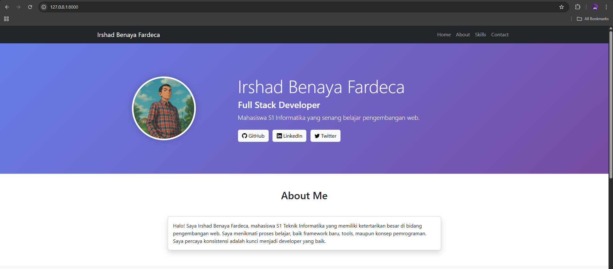
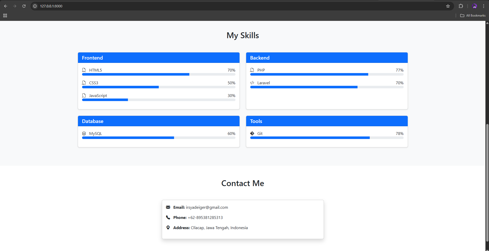
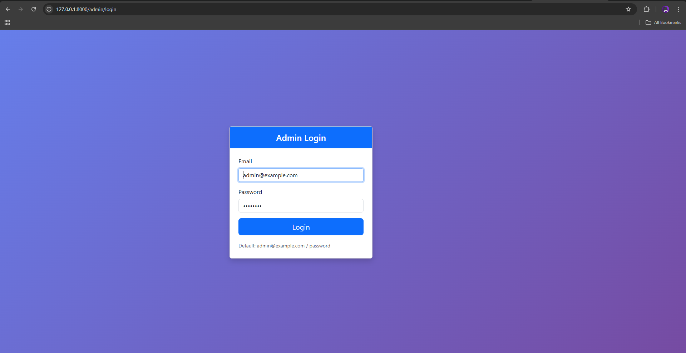
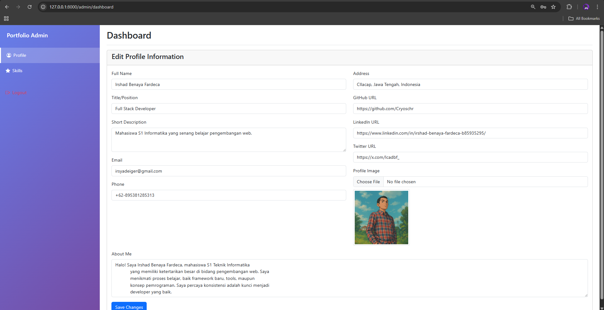
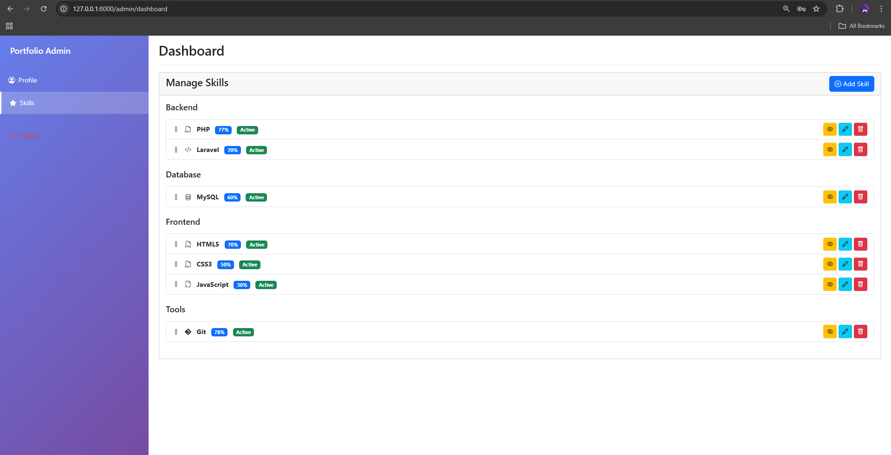

<div align="center">
  <br>

  <h1>LAPORAN PRAKTIKUM <br>
  APLIKASI BERBASIS PLATFORM
  </h1>

  <br>

  <h3>UTS</h3>

  <br>

  


  <br>
  <br>
  <br>

  <h3>Disusun Oleh :</h3>

  <p>
    <strong>Irshad Benaya Fardeca</strong><br>
    <strong>2311102199</strong><br>
    <strong>S1 IF-11-REG01</strong>
  </p>

  <br>

  <h3>Dosen Pengampu :</h3>

  <p>
    <strong>Dimas Fanny Hebrasianto Permadi, S.ST., M.Kom</strong>
  </p>
  
  <br>
  <br>
    <h4>Asisten Praktikum :</h4>
    <strong>Apri Pandu Wicaksono </strong> <br>
    <strong>Rangga Pradarrell Fathi</strong>
  <br>

  <h3>LABORATORIUM HIGH PERFORMANCE
 <br>FAKULTAS INFORMATIKA <br>UNIVERSITAS TELKOM PURWOKERTO <br>2026</h3>
</div>
<hr>

# Tugas
Buat project bisa menggunakan Laravel dimana kalian diminta membuat web inventari toko punya pak cik sama mas aimar (yang ga paham suki) dimana terdapat sebuah crud untuk mengelola produk, dengan tampilan seperti datatable, form create, form edit, dan konfirmasi modal untuk delete. Dan untuk data disimpan dalam database, gunakan database factory dan seeder (biar datanya ga kosong banget). dan buat nilai plus tambahkan dokumentasi project nya (bawaan ai juga udah ada pasti), please wok bantuin biar mas jakobi bisa belanja di toko nya mas aimar, jangan lupa terapin sistem login yaa (pake sistem session), #KingNasirPembantaiNgawiTimur

<br>

# Portfolio
## Kode
## 2.Models
### Portfolio.php
Model untuk mengelola data portfolio.
```
<?php

namespace App\Models;

use Illuminate\Database\Eloquent\Factories\HasFactory;
use Illuminate\Database\Eloquent\Model;

class Portfolio extends Model
{
    use HasFactory;

    protected $fillable = [
        'full_name',
        'title',
        'description',
        'profile_image',
        'email',
        'phone',
        'address',
        'github_url',
        'linkedin_url',
        'twitter_url',
        'about_me'
    ];
}
```
$fillable: Mendefinisikan field yang bisa diisi massal untuk keamanan.
Use HasFactory: Untuk testing dan seeding data.

### Skill.php
Model untuk mengelola data skills.
```
<?php

namespace App\Models;

use Illuminate\Database\Eloquent\Factories\HasFactory;
use Illuminate\Database\Eloquent\Model;

class Skill extends Model
{
    use HasFactory;

    protected $fillable = [
        'name',
        'percentage',
        'category',
        'icon_class',
        'display_order',
        'is_active'
    ];

    protected $casts = [
        'is_active' => 'boolean'
    ];
}
```
$casts: Konversi otomatis is_active ke tipe boolean.

$fillable: Field yang aman untuk mass assignment.

## 3. Controllers
### PortfolioController.php
Controller utama untuk mengelola data portfolio.
```
<?php

namespace App\Http\Controllers;

use App\Models\Portfolio;
use Illuminate\Http\Request;
use Illuminate\Support\Facades\Storage;

class PortfolioController extends Controller
{
    /**
     * API untuk landing page - mengambil data portfolio dan skills
     */
    public function getPortfolioData()
    {
        $portfolio = Portfolio::first();
        $skills = \App\Models\Skill::where('is_active', true)
            ->orderBy('display_order')
            ->get()
            ->groupBy('category');
        
        return response()->json([
            'portfolio' => $portfolio,
            'skills' => $skills
        ]);
    }

    /**
     * API untuk admin dashboard - mengambil semua data
     */
    public function getAdminData()
    {
        $portfolio = Portfolio::first();
        $skills = \App\Models\Skill::orderBy('category')
            ->orderBy('display_order')
            ->get();
        
        return response()->json([
            'portfolio' => $portfolio,
            'skills' => $skills
        ]);
    }

    /**
     * Update data portfolio termasuk upload gambar
     */
    public function updatePortfolio(Request $request)
    {
        $request->validate([
            'full_name' => 'required|string|max:255',
            'title' => 'required|string|max:255',
            'description' => 'required|string',
            'email' => 'required|email',
            'phone' => 'required|string',
            'address' => 'required|string',
            'about_me' => 'required|string',
        ]);

        $portfolio = Portfolio::first();
        $data = $request->except('profile_image');
        
        // Handle upload gambar
        if ($request->hasFile('profile_image')) {
            // Hapus gambar lama jika ada
            if ($portfolio && $portfolio->profile_image) {
                Storage::delete('public/' . $portfolio->profile_image);
            }
            // Simpan gambar baru
            $path = $request->file('profile_image')->store('profiles', 'public');
            $data['profile_image'] = $path;
        }

        // Update atau create portfolio
        if ($portfolio) {
            $portfolio->update($data);
        } else {
            $portfolio = Portfolio::create($data);
        }

        return response()->json([
            'success' => true,
            'message' => 'Portfolio updated successfully',
            'data' => $portfolio
        ]);
    }
}
```
getPortfolioData(): Endpoint publik untuk landing page, hanya mengambil skills aktif

getAdminData(): Endpoint admin, mengambil semua data termasuk skills non-aktif

updatePortfolio(): Handle update data dengan validasi dan upload gambar

### SkillController.php
Controller untuk CRUD skills dengan fitur drag & drop.
```
<?php

namespace App\Http\Controllers;

use App\Models\Skill;
use Illuminate\Http\Request;

class SkillController extends Controller
{
    /**
     * Mendapatkan semua skills
     */
    public function index()
    {
        $skills = Skill::orderBy('category')
            ->orderBy('display_order')
            ->get();
        
        return response()->json($skills);
    }

    /**
     * Menambah skill baru
     */
    public function store(Request $request)
    {
        $request->validate([
            'name' => 'required|string|max:255',
            'percentage' => 'required|integer|min:0|max:100',
            'category' => 'required|string',
            'icon_class' => 'nullable|string',
        ]);

        $skill = Skill::create($request->all());

        return response()->json([
            'success' => true,
            'message' => 'Skill added successfully',
            'data' => $skill
        ]);
    }

    /**
     * Update skill
     */
    public function update(Request $request, Skill $skill)
    {
        $request->validate([
            'name' => 'required|string|max:255',
            'percentage' => 'required|integer|min:0|max:100',
            'category' => 'required|string',
            'icon_class' => 'nullable|string',
        ]);

        $skill->update($request->all());

        return response()->json([
            'success' => true,
            'message' => 'Skill updated successfully',
            'data' => $skill
        ]);
    }

    /**
     * Hapus skill
     */
    public function destroy(Skill $skill)
    {
        $skill->delete();

        return response()->json([
            'success' => true,
            'message' => 'Skill deleted successfully'
        ]);
    }

    /**
     * Update urutan skills (drag & drop)
     */
    public function updateOrder(Request $request)
    {
        $request->validate([
            'skills' => 'required|array',
            'skills.*.id' => 'required|exists:skills,id',
            'skills.*.display_order' => 'required|integer'
        ]);

        foreach ($request->skills as $skillData) {
            Skill::where('id', $skillData['id'])
                ->update(['display_order' => $skillData['display_order']]);
        }

        return response()->json([
            'success' => true,
            'message' => 'Skill order updated successfully'
        ]);
    }

    /**
     * Toggle status aktif/non-aktif skill
     */
    public function toggleActive(Skill $skill)
    {
        $skill->is_active = !$skill->is_active;
        $skill->save();

        return response()->json([
            'success' => true,
            'message' => 'Skill status updated',
            'data' => $skill
        ]);
    }
}
```
CRUD Operations: Create, Read, Update, Delete skills

updateOrder(): Method khusus untuk menyimpan urutan drag & drop

toggleActive(): Switch status aktif tanpa perlu form edit

### AuthController.php
Controller sederhana untuk authentication.
```
<?php

namespace App\Http\Controllers;

use Illuminate\Http\Request;
use Illuminate\Support\Facades\Auth;

class AuthController extends Controller
{
    /**
     * Proses login admin
     */
    public function login(Request $request)
    {
        $credentials = $request->validate([
            'email' => ['required', 'email'],
            'password' => ['required'],
        ]);

        if (Auth::attempt($credentials)) {
            $request->session()->regenerate();
            return redirect()->intended('/admin/dashboard');
        }

        return back()->withErrors([
            'email' => 'The provided credentials do not match our records.',
        ]);
    }

    /**
     * Logout dan hapus session
     */
    public function logout(Request $request)
    {
        Auth::logout();
        $request->session()->invalidate();
        $request->session()->regenerateToken();
        return redirect('/');
    }
}
```
login(): Validasi credentials dan create session

logout(): Hapus session dan redirect ke home

## 4. Views
### landing.blade.php
Halaman utama portfolio.
```
<!DOCTYPE html>
<html lang="en">
<head>
    <meta charset="UTF-8">
    <meta name="viewport" content="width=device-width, initial-scale=1.0">
    <title>Portfolio - Loading...</title>
    <link href="https://cdn.jsdelivr.net/npm/bootstrap@5.3.0/dist/css/bootstrap.min.css" rel="stylesheet">
    <link rel="stylesheet" href="https://cdn.jsdelivr.net/npm/bootstrap-icons@1.11.0/font/bootstrap-icons.css">
    <meta name="csrf-token" content="{{ csrf_token() }}">
    <style>
        .hero-section {
            background: linear-gradient(135deg, #667eea 0%, #764ba2 100%);
            color: white;
            padding: 100px 0;
        }
        .profile-img {
            width: 200px;
            height: 200px;
            object-fit: cover;
            border: 5px solid white;
            box-shadow: 0 0 20px rgba(0,0,0,0.2);
        }
        .loading-spinner {
            display: flex;
            justify-content: center;
            align-items: center;
            min-height: 100vh;
        }
    </style>
</head>
<body>
    <div id="app">
        <!-- Loading spinner - akan diganti dengan konten setelah AJAX selesai -->
        <div class="loading-spinner">
            <div class="spinner-border text-primary" role="status">
                <span class="visually-hidden">Loading...</span>
            </div>
        </div>
    </div>

    <script src="https://cdn.jsdelivr.net/npm/bootstrap@5.3.0/dist/js/bootstrap.bundle.min.js"></script>
    <script src="https://code.jquery.com/jquery-3.7.0.min.js"></script>
    <script>
        $(document).ready(function() {
            loadPortfolioData();
        });

        /**
         * Fetch data portfolio dari server via AJAX
         */
        function loadPortfolioData() {
            $.ajax({
                url: '/api/portfolio',
                method: 'GET',
                success: function(response) {
                    renderPortfolio(response);
                },
                error: function(xhr, status, error) {
                    console.error('Error loading portfolio:', error);
                    $('#app').html(`
                        <div class="alert alert-danger m-5">
                            Failed to load portfolio data. Please try again later.
                        </div>
                    `);
                }
            });
        }

        /**
         * Render HTML portfolio berdasarkan data dari server
         */
        function renderPortfolio(data) {
            const portfolio = data.portfolio;
            const skills = data.skills;
            
            // Generate skills HTML dengan grouping per kategori
            let skillsHtml = '';
            
            if (skills) {
                Object.keys(skills).forEach(category => {
                    skillsHtml += `
                        <div class="col-md-6 mb-4">
                            <div class="card skill-card h-100 shadow-sm">
                                <div class="card-header bg-primary text-white">
                                    <h5 class="mb-0">${category}</h5>
                                </div>
                                <div class="card-body">
                    `;
                    
                    skills[category].forEach(skill => {
                        skillsHtml += `
                            <div class="mb-3">
                                <div class="d-flex justify-content-between">
                                    <span>
                                        ${skill.icon_class ? `<i class="${skill.icon_class} me-2"></i>` : ''}
                                        ${skill.name}
                                    </span>
                                    <span>${skill.percentage}%</span>
                                </div>
                                <div class="progress" style="height: 10px;">
                                    <div class="progress-bar" role="progressbar" 
                                         style="width: ${skill.percentage}%" 
                                         aria-valuenow="${skill.percentage}" 
                                         aria-valuemin="0" 
                                         aria-valuemax="100"></div>
                                </div>
                            </div>
                        `;
                    });
                    
                    skillsHtml += `
                                </div>
                            </div>
                        </div>
                    `;
                });
            }

            // Main HTML template
            const html = `
                <!-- Navigation -->
                <nav class="navbar navbar-expand-lg navbar-dark bg-dark">
                    <div class="container">
                        <a class="navbar-brand" href="#">${portfolio?.full_name || 'Portfolio'}</a>
                        <button class="navbar-toggler" type="button" data-bs-toggle="collapse" data-bs-target="#navbarNav">
                            <span class="navbar-toggler-icon"></span>
                        </button>
                        <div class="collapse navbar-collapse" id="navbarNav">
                            <ul class="navbar-nav ms-auto">
                                <li class="nav-item"><a class="nav-link" href="#home">Home</a></li>
                                <li class="nav-item"><a class="nav-link" href="#about">About</a></li>
                                <li class="nav-item"><a class="nav-link" href="#skills">Skills</a></li>
                                <li class="nav-item"><a class="nav-link" href="#contact">Contact</a></li>
                            </ul>
                        </div>
                    </div>
                </nav>

                <!-- Hero Section -->
                <section id="home" class="hero-section">
                    <div class="container">
                        <div class="row align-items-center">
                            <div class="col-md-4 text-center">
                                ${portfolio?.profile_image ? 
                                    `` :
                                    `<div class="profile-img rounded-circle bg-secondary d-flex align-items-center justify-content-center mx-auto">
                                        <i class="bi bi-person-fill" style="font-size: 5rem;"></i>
                                    </div>`
                                }
                            </div>
                            <div class="col-md-8">
                                <h1 class="display-4">${portfolio?.full_name || 'Your Name'}</h1>
                                <h3>${portfolio?.title || 'Your Title'}</h3>
                                <p class="lead">${portfolio?.description || 'Your description here'}</p>
                                <div class="mt-4">
                                    ${portfolio?.github_url ? `<a href="${portfolio.github_url}" class="btn btn-light me-2" target="_blank"><i class="bi bi-github"></i> GitHub</a>` : ''}
                                    ${portfolio?.linkedin_url ? `<a href="${portfolio.linkedin_url}" class="btn btn-light me-2" target="_blank"><i class="bi bi-linkedin"></i> LinkedIn</a>` : ''}
                                    ${portfolio?.twitter_url ? `<a href="${portfolio.twitter_url}" class="btn btn-light" target="_blank"><i class="bi bi-twitter"></i> Twitter</a>` : ''}
                                </div>
                            </div>
                        </div>
                    </div>
                </section>

                <!-- About Section -->
                <section id="about" class="py-5">
                    <div class="container">
                        <h2 class="text-center mb-5">About Me</h2>
                        <div class="row">
                            <div class="col-lg-8 mx-auto">
                                <div class="card shadow">
                                    <div class="card-body">
                                        <p class="card-text">${portfolio?.about_me || 'Tell us about yourself...'}</p>
                                    </div>
                                </div>
                            </div>
                        </div>
                    </div>
                </section>

                <!-- Skills Section -->
                <section id="skills" class="py-5 bg-light">
                    <div class="container">
                        <h2 class="text-center mb-5">My Skills</h2>
                        <div class="row">
                            ${skillsHtml || '<div class="col-12 text-center"><p>No skills added yet.</p></div>'}
                        </div>
                    </div>
                </section>

                <!-- Contact Section -->
                <section id="contact" class="py-5">
                    <div class="container">
                        <h2 class="text-center mb-5">Contact Me</h2>
                        <div class="row">
                            <div class="col-lg-6 mx-auto">
                                <div class="card shadow">
                                    <div class="card-body">
                                        <div class="mb-3">
                                            <i class="bi bi-envelope-fill me-2"></i>
                                            <strong>Email:</strong> ${portfolio?.email || 'email@example.com'}
                                        </div>
                                        <div class="mb-3">
                                            <i class="bi bi-telephone-fill me-2"></i>
                                            <strong>Phone:</strong> ${portfolio?.phone || '+1234567890'}
                                        </div>
                                        <div class="mb-3">
                                            <i class="bi bi-geo-alt-fill me-2"></i>
                                            <strong>Address:</strong> ${portfolio?.address || 'Your address'}
                                        </div>
                                    </div>
                                </div>
                            </div>
                        </div>
                    </div>
                </section>

                <!-- Footer -->
                <footer class="bg-dark text-white text-center py-3">
                    <p class="mb-0">&copy; 2024 ${portfolio?.full_name || 'Portfolio'}. All rights reserved.</p>
                </footer>
            `;
            
            $('#app').html(html);
        }
    </script>
</body>
</html>
```
Loading State: Menampilkan spinner saat fetching data

AJAX Fetch: Mengambil data dari /api/portfolio

Dynamic Rendering: Generate HTML berdasarkan data JSON

Error Handling: Tampilkan pesan error jika gagal fetch

### admin/dashboard.blade.php
Dashboard admin untuk mengelola konten.
```
<!DOCTYPE html>
<html lang="en">
<head>
    <meta charset="UTF-8">
    <meta name="viewport" content="width=device-width, initial-scale=1.0">
    <title>Admin Dashboard - Portfolio Manager</title>
    <link href="https://cdn.jsdelivr.net/npm/bootstrap@5.3.0/dist/css/bootstrap.min.css" rel="stylesheet">
    <link rel="stylesheet" href="https://cdn.jsdelivr.net/npm/bootstrap-icons@1.11.0/font/bootstrap-icons.css">
    <link rel="stylesheet" href="https://cdn.jsdelivr.net/npm/sweetalert2@11/dist/sweetalert2.min.css">
    <meta name="csrf-token" content="{{ csrf_token() }}">
    <style>
        .sidebar {
            min-height: 100vh;
            background: linear-gradient(135deg, #667eea 0%, #764ba2 100%);
        }
        .sidebar .nav-link {
            color: white;
            padding: 15px 20px;
            transition: all 0.3s;
        }
        .sidebar .nav-link:hover {
            background: rgba(255,255,255,0.1);
            transform: translateX(5px);
        }
        .sidebar .nav-link.active {
            background: rgba(255,255,255,0.2);
            border-left: 4px solid white;
        }
        .content-section {
            display: none;
        }
        .content-section.active {
            display: block;
        }
        .skill-item {
            cursor: move;
            transition: all 0.3s;
        }
        .skill-item:hover {
            background-color: #f8f9fa;
        }
    </style>
</head>
<body>
    <div class="container-fluid">
        <div class="row">
            <!-- Sidebar Navigation -->
            <nav class="col-md-2 d-md-block sidebar p-0">
                <div class="position-sticky">
                    <div class="p-4">
                        <h5 class="text-white">Portfolio Admin</h5>
                    </div>
                    <ul class="nav flex-column">
                        <li class="nav-item">
                            <a class="nav-link active" href="#" data-section="profile">
                                <i class="bi bi-person-circle me-2"></i>Profile
                            </a>
                        </li>
                        <li class="nav-item">
                            <a class="nav-link" href="#" data-section="skills">
                                <i class="bi bi-star-fill me-2"></i>Skills
                            </a>
                        </li>
                        <li class="nav-item mt-4">
                            <form action="/admin/logout" method="POST" id="logout-form">
                                @csrf
                                <button type="submit" class="nav-link text-danger">
                                    <i class="bi bi-box-arrow-right me-2"></i>Logout
                                </button>
                            </form>
                        </li>
                    </ul>
                </div>
            </nav>

            <!-- Main Content Area -->
            <main class="col-md-10 ms-sm-auto px-md-4">
                <div class="pt-3 pb-2 mb-3 border-bottom">
                    <h2>Dashboard</h2>
                </div>

                <!-- Profile Section -->
                <div id="profile-section" class="content-section active">
                    <div class="card">
                        <div class="card-header">
                            <h4>Edit Profile Information</h4>
                        </div>
                        <div class="card-body">
                            <form id="profile-form">
                                @csrf
                                <div class="row">
                                    <div class="col-md-6">
                                        <div class="mb-3">
                                            <label class="form-label">Full Name</label>
                                            <input type="text" class="form-control" name="full_name" id="full_name" required>
                                        </div>
                                        <div class="mb-3">
                                            <label class="form-label">Title/Position</label>
                                            <input type="text" class="form-control" name="title" id="title" required>
                                        </div>
                                        <div class="mb-3">
                                            <label class="form-label">Short Description</label>
                                            <textarea class="form-control" name="description" id="description" rows="3" required></textarea>
                                        </div>
                                        <div class="mb-3">
                                            <label class="form-label">Email</label>
                                            <input type="email" class="form-control" name="email" id="email" required>
                                        </div>
                                        <div class="mb-3">
                                            <label class="form-label">Phone</label>
                                            <input type="text" class="form-control" name="phone" id="phone" required>
                                        </div>
                                    </div>
                                    <div class="col-md-6">
                                        <div class="mb-3">
                                            <label class="form-label">Address</label>
                                            <input type="text" class="form-control" name="address" id="address" required>
                                        </div>
                                        <div class="mb-3">
                                            <label class="form-label">GitHub URL</label>
                                            <input type="url" class="form-control" name="github_url" id="github_url">
                                        </div>
                                        <div class="mb-3">
                                            <label class="form-label">LinkedIn URL</label>
                                            <input type="url" class="form-control" name="linkedin_url" id="linkedin_url">
                                        </div>
                                        <div class="mb-3">
                                            <label class="form-label">Twitter URL</label>
                                            <input type="url" class="form-control" name="twitter_url" id="twitter_url">
                                        </div>
                                        <div class="mb-3">
                                            <label class="form-label">Profile Image</label>
                                            <input type="file" class="form-control" name="profile_image" id="profile_image" accept="image/*">
                                            <div id="image-preview" class="mt-2"></div>
                                        </div>
                                    </div>
                                    <div class="col-12">
                                        <div class="mb-3">
                                            <label class="form-label">About Me</label>
                                            <textarea class="form-control" name="about_me" id="about_me" rows="5" required></textarea>
                                        </div>
                                    </div>
                                </div>
                                <button type="submit" class="btn btn-primary">Save Changes</button>
                            </form>
                        </div>
                    </div>
                </div>

                <!-- Skills Section -->
                <div id="skills-section" class="content-section">
                    <div class="card">
                        <div class="card-header d-flex justify-content-between align-items-center">
                            <h4>Manage Skills</h4>
                            <button class="btn btn-primary" onclick="showAddSkillModal()">
                                <i class="bi bi-plus-circle"></i> Add Skill
                            </button>
                        </div>
                        <div class="card-body">
                            <div id="skills-list">
                                <!-- Skills will be loaded here via AJAX -->
                            </div>
                        </div>
                    </div>
                </div>
            </main>
        </div>
    </div>

    <!-- Skill Modal for Add/Edit -->
    <div class="modal fade" id="skillModal" tabindex="-1">
        <div class="modal-dialog">
            <div class="modal-content">
                <div class="modal-header">
                    <h5 class="modal-title" id="skillModalTitle">Add Skill</h5>
                    <button type="button" class="btn-close" data-bs-dismiss="modal"></button>
                </div>
                <div class="modal-body">
                    <form id="skill-form">
                        <input type="hidden" id="skill_id">
                        <div class="mb-3">
                            <label class="form-label">Skill Name</label>
                            <input type="text" class="form-control" id="skill_name" required>
                        </div>
                        <div class="mb-3">
                            <label class="form-label">Category</label>
                            <select class="form-control" id="skill_category" required>
                                <option value="Frontend">Frontend</option>
                                <option value="Backend">Backend</option>
                                <option value="Database">Database</option>
                                <option value="DevOps">DevOps</option>
                                <option value="Tools">Tools</option>
                                <option value="Other">Other</option>
                            </select>
                        </div>
                        <div class="mb-3">
                            <label class="form-label">Percentage (0-100)</label>
                            <input type="number" class="form-control" id="skill_percentage" min="0" max="100" required>
                        </div>
                        <div class="mb-3">
                            <label class="form-label">Icon Class (Bootstrap Icons)</label>
                            <input type="text" class="form-control" id="skill_icon" placeholder="bi bi-code-slash">
                            <small class="text-muted">Example: bi bi-code-slash, bi bi-database, etc.</small>
                        </div>
                    </form>
                </div>
                <div class="modal-footer">
                    <button type="button" class="btn btn-secondary" data-bs-dismiss="modal">Cancel</button>
                    <button type="button" class="btn btn-primary" onclick="saveSkill()">Save</button>
                </div>
            </div>
        </div>
    </div>

    <script src="https://cdn.jsdelivr.net/npm/bootstrap@5.3.0/dist/js/bootstrap.bundle.min.js"></script>
    <script src="https://code.jquery.com/jquery-3.7.0.min.js"></script>
    <script src="https://cdn.jsdelivr.net/npm/sweetalert2@11"></script>
    <script src="https://cdn.jsdelivr.net/npm/sortablejs@latest/Sortable.min.js"></script>
    
    <script>
        let skillModal;
        let sortableInstance;

        $(document).ready(function() {
            skillModal = new bootstrap.Modal(document.getElementById('skillModal'));
            
            // Load initial data
            loadPortfolioData();
            loadSkills();
            
            // Navigation between sections
            $('.nav-link[data-section]').click(function(e) {
                e.preventDefault();
                const section = $(this).data('section');
                
                $('.nav-link').removeClass('active');
                $(this).addClass('active');
                
                $('.content-section').removeClass('active');
                $(`#${section}-section`).addClass('active');
                
                if (section === 'skills') {
                    loadSkills();
                }
            });
            
            // Handle form submission
            $('#profile-form').submit(function(e) {
                e.preventDefault();
                updateProfile();
            });
            
            // Preview uploaded image
            $('#profile_image').change(function() {
                const file = this.files[0];
                if (file) {
                    const reader = new FileReader();
                    reader.onload = function(e) {
                        $('#image-preview').html(`
                            
                        `);
                    }
                    reader.readAsDataURL(file);
                }
            });
        });

        /**
         * Load portfolio data into form
         */
        function loadPortfolioData() {
            $.ajax({
                url: '/api/admin/portfolio',
                method: 'GET',
                success: function(response) {
                    if (response.portfolio) {
                        $('#full_name').val(response.portfolio.full_name);
                        $('#title').val(response.portfolio.title);
                        $('#description').val(response.portfolio.description);
                        $('#email').val(response.portfolio.email);
                        $('#phone').val(response.portfolio.phone);
                        $('#address').val(response.portfolio.address);
                        $('#github_url').val(response.portfolio.github_url);
                        $('#linkedin_url').val(response.portfolio.linkedin_url);
                        $('#twitter_url').val(response.portfolio.twitter_url);
                        $('#about_me').val(response.portfolio.about_me);
                        
                        if (response.portfolio.profile_image) {
                            $('#image-preview').html(`
                                
                            `);
                        }
                    }
                },
                error: function(xhr, status, error) {
                    Swal.fire('Error', 'Failed to load portfolio data', 'error');
                }
            });
        }

        /**
         * Update profile via AJAX
         */
        function updateProfile() {
            const formData = new FormData($('#profile-form')[0]);
            
            $.ajax({
                url: '/api/admin/portfolio',
                method: 'POST',
                data: formData,
                processData: false,
                contentType: false,
                headers: {
                    'X-CSRF-TOKEN': $('meta[name="csrf-token"]').attr('content')
                },
                success: function(response) {
                    Swal.fire('Success', 'Profile updated successfully', 'success');
                    loadPortfolioData();
                },
                error: function(xhr, status, error) {
                    Swal.fire('Error', 'Failed to update profile', 'error');
                }
            });
        }

        /**
         * Load and display skills list
         */
        function loadSkills() {
            $.ajax({
                url: '/api/admin/skills',
                method: 'GET',
                success: function(skills) {
                    renderSkillsList(skills);
                    initSortable();
                },
                error: function(xhr, status, error) {
                    Swal.fire('Error', 'Failed to load skills', 'error');
                }
            });
        }

        /**
         * Render skills grouped by category
         */
        function renderSkillsList(skills) {
            const skillsByCategory = {};
            skills.forEach(skill => {
                if (!skillsByCategory[skill.category]) {
                    skillsByCategory[skill.category] = [];
                }
                skillsByCategory[skill.category].push(skill);
            });
            
            let html = '';
            Object.keys(skillsByCategory).sort().forEach(category => {
                html += `
                    <div class="mb-4">
                        <h5 class="mb-3">${category}</h5>
                        <div class="list-group sortable-category" data-category="${category}">
                `;
                
                skillsByCategory[category].forEach(skill => {
                    html += `
                        <div class="list-group-item skill-item" data-skill-id="${skill.id}">
                            <div class="d-flex justify-content-between align-items-center">
                                <div>
                                    <i class="bi bi-grip-vertical me-2"></i>
                                    ${skill.icon_class ? `<i class="${skill.icon_class} me-2"></i>` : ''}
                                    <strong>${skill.name}</strong>
                                    <span class="badge bg-primary ms-2">${skill.percentage}%</span>
                                    ${skill.is_active ? 
                                        '<span class="badge bg-success ms-2">Active</span>' : 
                                        '<span class="badge bg-secondary ms-2">Inactive</span>'
                                    }
                                </div>
                                <div>
                                    <button class="btn btn-sm ${skill.is_active ? 'btn-warning' : 'btn-success'}" 
                                            onclick="toggleSkillActive(${skill.id})">
                                        <i class="bi ${skill.is_active ? 'bi-eye-slash' : 'bi-eye'}"></i>
                                    </button>
                                    <button class="btn btn-sm btn-info" onclick="editSkill(${skill.id})">
                                        <i class="bi bi-pencil"></i>
                                    </button>
                                    <button class="btn btn-sm btn-danger" onclick="deleteSkill(${skill.id})">
                                        <i class="bi bi-trash"></i>
                                    </button>
                                </div>
                            </div>
                        </div>
                    `;
                });
                
                html += `
                        </div>
                    </div>
                `;
            });
            
            $('#skills-list').html(html || '<p class="text-muted">No skills added yet.</p>');
        }

        /**
         * Initialize drag & drop for skills ordering
         */
        function initSortable() {
            $('.sortable-category').each(function() {
                new Sortable(this, {
                    animation: 150,
                    ghostClass: 'sortable-ghost',
                    onEnd: function(evt) {
                        updateSkillsOrder();
                    }
                });
            });
        }

        /**
         * Save new skill order after drag & drop
         */
        function updateSkillsOrder() {
            const skills = [];
            $('.skill-item').each(function(index) {
                skills.push({
                    id: $(this).data('skill-id'),
                    display_order: index
                });
            });
            
            $.ajax({
                url: '/api/admin/skills/order',
                method: 'POST',
                data: { skills: skills },
                headers: {
                    'X-CSRF-TOKEN': $('meta[name="csrf-token"]').attr('content')
                },
                success: function(response) {
                    // Order updated successfully
                },
                error: function(xhr, status, error) {
                    Swal.fire('Error', 'Failed to update skill order', 'error');
                }
            });
        }

        function showAddSkillModal() {
            $('#skillModalTitle').text('Add Skill');
            $('#skill_id').val('');
            $('#skill_name').val('');
            $('#skill_category').val('Frontend');
            $('#skill_percentage').val(50);
            $('#skill_icon').val('');
            skillModal.show();
        }

        function editSkill(id) {
            $.ajax({
                url: `/api/admin/skills`,
                method: 'GET',
                success: function(skills) {
                    const skill = skills.find(s => s.id === id);
                    if (skill) {
                        $('#skillModalTitle').text('Edit Skill');
                        $('#skill_id').val(skill.id);
                        $('#skill_name').val(skill.name);
                        $('#skill_category').val(skill.category);
                        $('#skill_percentage').val(skill.percentage);
                        $('#skill_icon').val(skill.icon_class || '');
                        skillModal.show();
                    }
                }
            });
        }

        function saveSkill() {
            const id = $('#skill_id').val();
            const data = {
                name: $('#skill_name').val(),
                category: $('#skill_category').val(),
                percentage: $('#skill_percentage').val(),
                icon_class: $('#skill_icon').val()
            };
            
            const url = id ? `/api/admin/skills/${id}` : '/api/admin/skills';
            const method = id ? 'PUT' : 'POST';
            
            $.ajax({
                url: url,
                method: method,
                data: data,
                headers: {
                    'X-CSRF-TOKEN': $('meta[name="csrf-token"]').attr('content')
                },
                success: function(response) {
                    skillModal.hide();
                    Swal.fire('Success', response.message, 'success');
                    loadSkills();
                },
                error: function(xhr, status, error) {
                    Swal.fire('Error', 'Failed to save skill', 'error');
                }
            });
        }

        function deleteSkill(id) {
            Swal.fire({
                title: 'Are you sure?',
                text: "You won't be able to revert this!",
                icon: 'warning',
                showCancelButton: true,
                confirmButtonColor: '#d33',
                cancelButtonColor: '#3085d6',
                confirmButtonText: 'Yes, delete it!'
            }).then((result) => {
                if (result.isConfirmed) {
                    $.ajax({
                        url: `/api/admin/skills/${id}`,
                        method: 'DELETE',
                        headers: {
                            'X-CSRF-TOKEN': $('meta[name="csrf-token"]').attr('content')
                        },
                        success: function(response) {
                            Swal.fire('Deleted!', response.message, 'success');
                            loadSkills();
                        },
                        error: function(xhr, status, error) {
                            Swal.fire('Error', 'Failed to delete skill', 'error');
                        }
                    });
                }
            });
        }

        function toggleSkillActive(id) {
            $.ajax({
                url: `/api/admin/skills/${id}/toggle`,
                method: 'PATCH',
                headers: {
                    'X-CSRF-TOKEN': $('meta[name="csrf-token"]').attr('content')
                },
                success: function(response) {
                    Swal.fire('Success', response.message, 'success');
                    loadSkills();
                },
                error: function(xhr, status, error) {
                    Swal.fire('Error', 'Failed to toggle skill status', 'error');
                }
            });
        }
    </script>
</body>
</html>
```
Sidebar Navigation: Switch antara Profile dan Skills section

Profile Form: Form untuk edit data portfolio dengan upload gambar

Skills Management: CRUD skills dengan modal popup

Drag & Drop: SortableJS untuk mengatur urutan skills

Real-time Updates: Semua operasi menggunakan AJAX

### admin/login.blade.php
Halaman login admin.
```
<!DOCTYPE html>
<html lang="en">
<head>
    <meta charset="UTF-8">
    <meta name="viewport" content="width=device-width, initial-scale=1.0">
    <title>Admin Login</title>
    <link href="https://cdn.jsdelivr.net/npm/bootstrap@5.3.0/dist/css/bootstrap.min.css" rel="stylesheet">
    <style>
        body {
            background: linear-gradient(135deg, #667eea 0%, #764ba2 100%);
            min-height: 100vh;
            display: flex;
            align-items: center;
            justify-content: center;
        }
        .login-card {
            max-width: 400px;
            width: 100%;
        }
    </style>
</head>
<body>
    <div class="container">
        <div class="row justify-content-center">
            <div class="col-md-6">
                <div class="card login-card shadow">
                    <div class="card-header bg-primary text-white text-center py-3">
                        <h4 class="mb-0">Admin Login</h4>
                    </div>
                    <div class="card-body p-4">
                        <form method="POST" action="/admin/login">
                            @csrf
                            <div class="mb-3">
                                <label for="email" class="form-label">Email</label>
                                <input type="email" class="form-control" id="email" name="email" 
                                       value="admin@example.com" required autofocus>
                            </div>
                            <div class="mb-3">
                                <label for="password" class="form-label">Password</label>
                                <input type="password" class="form-control" id="password" name="password" 
                                       value="password" required>
                            </div>
                            <div class="d-grid">
                                <button type="submit" class="btn btn-primary btn-lg">Login</button>
                            </div>
                        </form>
                        
                        @if($errors->any())
                            <div class="alert alert-danger mt-3">
                                {{ $errors->first() }}
                            </div>
                        @endif
                        
                        <div class="mt-3 text-muted">
                            <small>Default: admin@example.com / password</small>
                        </div>
                    </div>
                </div>
            </div>
        </div>
    </div>
</body>
</html>
```
Simple Form: Form login dengan email dan password

Pre-filled Values: Default credentials untuk kemudahan testing

Error Display: Menampilkan error jika login gagal

---

## Output
### Portfolio
Tampilan Portfolio



### Admin Dashboard
Tampilan Admin



