<div align="center">
  <br />
  <h1>LAPORAN PRAKTIKUM <br>
  APLIKASI BERBASIS PLATFORM
  </h1>
  <br />
  <h3>Ujian UTS<br>
 Portofolio Website dengan Admin Dashboard
  </h3>
  <br />
  
  <br />
  <br />
  <br />
  <h3>Disusun Oleh :</h3>
  <p>
    <strong>Boutefhika Nuha Ziyadatul Khair</strong><br>
    <strong>2311102316</strong><br>
    <strong>S1 IF-11-01</strong>
  </p>
  <br />
  <h3>Dosen Pengampu :</h3>
  <p>
    <strong>Dimas Fanny Hebrasianto Permadi, S.ST., M.Kom</strong>
  </p>
  <br />
  <br />
  <h4>Asisten Praktikum :</h4>
  <strong>Apri Pandu Wicaksono</strong> <br>
  <strong>Rangga Pradarrell Fathi</strong>
  <br />
  <br />
  <h3>LABORATORIUM HIGH PERFORMANCE
  <br>FAKULTAS INFORMATIKA <br>UNIVERSITAS TELKOM PURWOKERTO <br>2026</h3>
</div>

<hr>


## 📌 Deskripsi Proyek

Proyek ini merupakan website portfolio dinamis yang dibangun menggunakan framework Laravel 10. Website terdiri dari dua bagian utama:

1. Halaman Portfolio Publik — Menampilkan data diri, keahlian, pendidikan, pengalaman, dan proyek secara dinamis.
2. Admin Dashboard — Panel khusus admin untuk mengubah seluruh konten portfolio tanpa menyentuh kode program.

Seluruh data di halaman portfolio tidak di-hardcode, melainkan diambil secara dinamis dari database melalui AJAX menggunakan endpoint API yang disediakan Laravel.


## 🎯 Tujuan Proyek

- Membangun portfolio web yang bisa diperbarui kapan saja tanpa coding
- Menerapkan konsep MVC (Model-View-Controller) dengan Laravel
- Menerapkan AJAX untuk pengambilan data dinamis dari backend
- Menerapkan operasi CRUD pada semua data portfolio
- Menerapkan autentikasi admin berbasis sesi (session)
- Upload dan pengelolaan gambar menggunakan Laravel Storage


## 🛠 Teknologi yang Digunakan

| Komponen | Teknologi |
|----------|-----------|
| Backend Framework | Laravel 10 (PHP 8.2) |
| Database | MySQL |
| Frontend | HTML, CSS, JavaScript (Vanilla + jQuery) |
| Data Fetching | AJAX ($.ajax) |
| Autentikasi | Session-based Laravel |
| Storage | Laravel Storage (local disk) |
| Font | Google Fonts (Cormorant Garamond, DM Sans) |
| External API | API Ninjas (quotes), GitHub REST API v3 |

## 🗂 Struktur Direktori

```
protofolio-nuha/
├── app/
│   ├── Http/
│   │   ├── Controllers/
│   │   │   ├── ApiController.php           ← Endpoint AJAX publik
│   │   │   ├── PortfolioController.php     ← Halaman portfolio
│   │   │   └── Admin/
│   │   │       ├── AuthController.php      ← Login & logout admin
│   │   │       └── DashboardController.php ← CRUD semua data
│   │   ├── Middleware/
│   │   │   └── AdminAuthenticated.php      ← Proteksi route admin
│   │   └── Kernel.php
│   └── Models/
│       ├── Profile.php
│       ├── Skill.php
│       ├── Education.php
│       ├── Experience.php
│       ├── Project.php
│       └── SiteSetting.php
├── database/
│   ├── migrations/
│   │   └── 2024_01_01_000001_create_portfolio_tables.php
│   └── seeders/
│       └── DatabaseSeeder.php   ← Data awal sudah terisi
├── resources/views/
│   ├── portfolio.blade.php      ← Halaman utama (AJAX)
│   ├── layouts/admin.blade.php  ← Layout admin
│   └── admin/
│       ├── login.blade.php
│       ├── dashboard.blade.php
│       ├── profile.blade.php
│       ├── skills.blade.php
│       ├── education.blade.php
│       ├── experience.blade.php ← Timeline view
│       ├── projects.blade.php
│       └── settings.blade.php
└── routes/web.php
```

## 🗃 Skema Database

### Tabel `profiles` — Data diri pemilik portfolio

| Kolom | Tipe | Keterangan |
|-------|------|------------|
| id | BIGINT (PK) | Auto increment |
| full_name | VARCHAR | Nama lengkap |
| nim | VARCHAR | Nomor Induk Mahasiswa |
| title | VARCHAR | Judul/posisi |
| about | TEXT | Bio singkat |
| email | VARCHAR | Email |
| phone | VARCHAR | No. HP |
| location | VARCHAR | Kota/lokasi |
| github | VARCHAR | Username GitHub |
| instagram | VARCHAR | Username Instagram |
| photo | VARCHAR | Path file foto profil |
| created_at / updated_at | TIMESTAMP | — |

### Tabel `skills` — Daftar keahlian

| Kolom | Tipe | Keterangan |
|-------|------|------------|
| id | BIGINT (PK) | — |
| name | VARCHAR | Nama skill |
| icon | VARCHAR | Emoji icon |
| category | VARCHAR | technical / tool / soft |
| sort_order | INT | Urutan tampil |
| is_active | BOOLEAN | Ditampilkan atau tidak |

### Tabel `educations` — Riwayat pendidikan

| Kolom | Tipe | Keterangan |
|-------|------|------------|
| id | BIGINT (PK) | — |
| institution | VARCHAR | Nama institusi |
| major | VARCHAR | Jurusan |
| degree | VARCHAR | Jenjang (SMK, S1) |
| year_start | VARCHAR | Tahun masuk |
| year_end | VARCHAR | Tahun lulus (null = masih berjalan) |
| sort_order | INT | — |
| is_active | BOOLEAN | — |

### Tabel `experiences` — Pengalaman kerja/magang

| Kolom | Tipe | Keterangan |
|-------|------|------------|
| id | BIGINT (PK) | — |
| company | VARCHAR | Nama perusahaan |
| position | VARCHAR | Jabatan |
| location | VARCHAR | Kota kerja |
| year | VARCHAR | Tahun |
| duration | VARCHAR | Durasi (misal: "3 bulan") |
| responsibilities | JSON | Array poin tugas |
| sort_order | INT | — |
| is_active | BOOLEAN | — |

### Tabel `projects` — Data proyek/portfolio

| Kolom | Tipe | Keterangan |
|-------|------|------------|
| id | BIGINT (PK) | — |
| title | VARCHAR | Judul proyek |
| description | TEXT | Deskripsi singkat |
| tech_stack | VARCHAR | Teknologi yang digunakan |
| url | VARCHAR | Link proyek (opsional) |
| image | VARCHAR | Path gambar preview |
| sort_order | INT | — |
| is_active | BOOLEAN | — |

### Tabel `site_settings` — Konfigurasi situs (key-value)

| key | Keterangan |
|-----|------------|
| admin_username | Username login admin |
| admin_password | Password (bcrypt hash) |
| github_token | Personal Access Token GitHub |
| quote_api_key | API key dari api-ninjas.com |
| show_github | Tampilkan section GitHub (1/0) |
| show_quote | Tampilkan section Quote (1/0) |


## 🌐 Daftar Route (URL)

### Route Publik
| Method | URL | Fungsi |
|--------|-----|--------|
| GET | `/` | Halaman portfolio |

### Route API (AJAX)
| Method | URL | Fungsi |
|--------|-----|--------|
| GET | `/api/portfolio` | Semua data portfolio (JSON) |
| GET | `/api/github` | Repository GitHub (proxy) |
| GET | `/api/quote` | Motivation quote (proxy) |

### Route Admin (Semua dilindungi middleware)
| Method | URL | Fungsi |
|--------|-----|--------|
| GET | `/admin/login` | Halaman login |
| POST | `/admin/login` | Proses login |
| POST | `/admin/logout` | Logout |
| GET | `/admin` | Dashboard |
| GET/POST | `/admin/profile` | Kelola profil & foto |
| GET/POST/PUT/DELETE | `/admin/skills/{id?}` | CRUD keahlian |
| GET/POST/PUT/DELETE | `/admin/education/{id?}` | CRUD pendidikan |
| GET/POST/PUT/DELETE | `/admin/experience/{id?}` | CRUD pengalaman |
| GET/POST/PUT/DELETE | `/admin/projects/{id?}` | CRUD proyek |
| GET/POST | `/admin/settings` | Pengaturan sistem |


## 🔄 Alur Kerja AJAX

Berikut alur saat pengunjung membuka halaman portfolio:
1. Browser mengakses halaman utama (`/`)
2. Laravel mengirim HTML kosong + JavaScript
3. Browser melakukan request:
   - `GET /api/portfolio` → ambil data dari database
   - `GET /api/github` → ambil repos dari GitHub API
   - `GET /api/quote` → ambil quote dari API Ninjas
4. Laravel memproses:
   - Query database
   - Request ke API eksternal (GitHub & Quote)
5. Semua data dikirim dalam bentuk **JSON**
6. Frontend (jQuery) merender data ke tampilan secara dinamis

## ⚡ Teknologi yang Digunakan
- Backend: Laravel (PHP)
- Frontend: HTML, CSS, JavaScript, jQuery
- Database: MySQL
- API Eksternal:
  - GitHub API
  - API Ninjas (Quote)

Mengapa data di-fetch via Laravel (bukan langsung ke API eksternal)?
- Menghindari masalah CORS (Cross-Origin Resource Sharing)
- API key tersembunyi di server, tidak terekspos ke browser
- Laravel bisa menambahkan caching atau validasi

## 🔐 Login Admin

| Field | Default |
|-------|---------|
| Username | `admin` |
| Password | `password` |

> ⚠️ Segera ganti password melalui menu Pengaturan setelah login pertama!

## 📸 Fitur Upload Foto

1. File diunggah via form `multipart/form-data`
2. Laravel menyimpan ke `storage/app/public/photos/` atau `projects/`
3. Path disimpan di database
4. URL diakses via symlink `/public/storage/`
5. URL dibentuk dengan `asset('storage/' . $path)`

## 🔒 Sistem Autentikasi Admin

Autentikasi menggunakan **session Laravel** tanpa tabel `users`:

1. Username & password (bcrypt) tersimpan di tabel `site_settings`
2. Saat login, password diverifikasi dengan `Hash::check()`
3. Jika valid → session `admin_logged_in = true`
4. Setiap route admin dilindungi middleware `AdminAuthenticated`
5. Middleware redirect ke login jika session tidak ada

## 🎨 Desain & Tampilan

### Halaman Portfolio Publik
- Layout berbentuk **CV/resume** dalam kartu vertikal
- Palet warna: pink soft, cream, blush
- Font: Playfair Display (judul) + DM Sans (teks)
- **Skeleton loader** saat data sedang diambil via AJAX
- Responsif mobile & desktop

### Admin Dashboard
- Sidebar navigasi tetap di kiri
- Topbar dengan tombol "Lihat Portfolio"
- Palet warna konsisten dengan portfolio
- Font: Cormorant Garamond (heading) + DM Sans (teks)
- Form dalam **modal dialog** agar tidak pindah halaman
- Halaman Pengalaman: **layout timeline** dengan dot dan garis vertikal

Dokumentasi

Landing Page
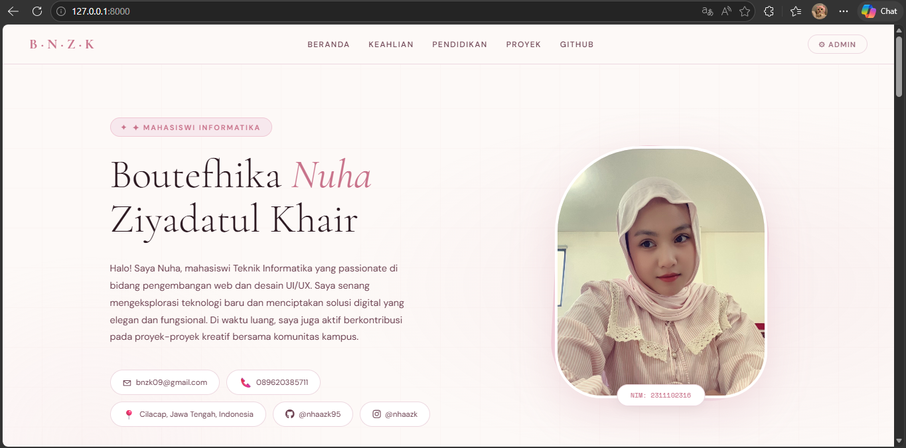

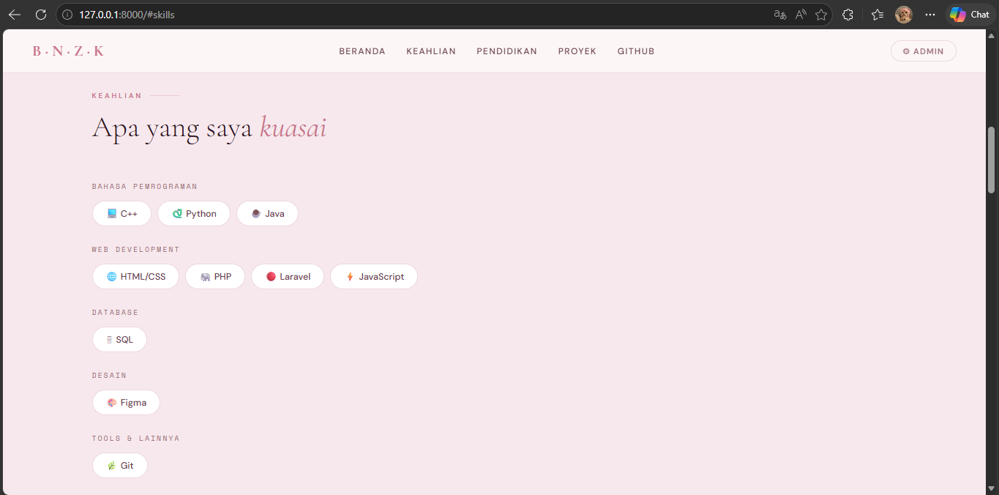

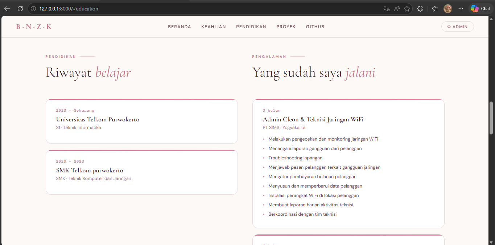

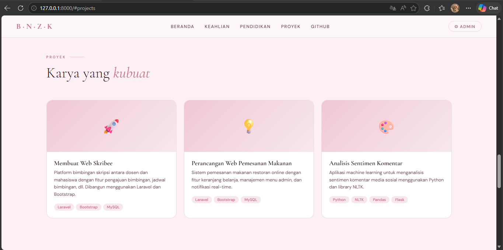

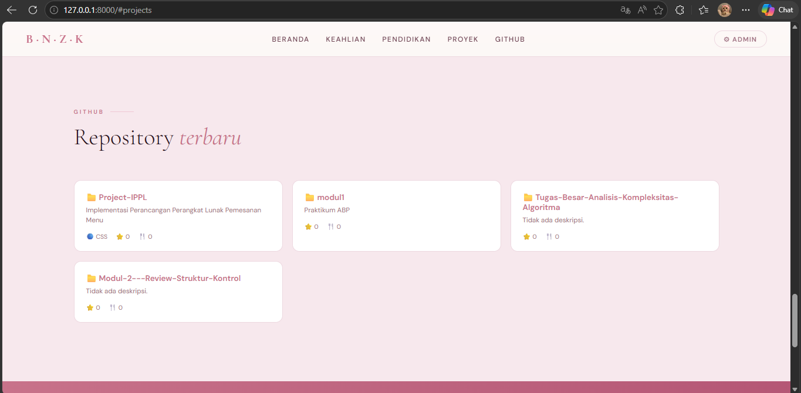

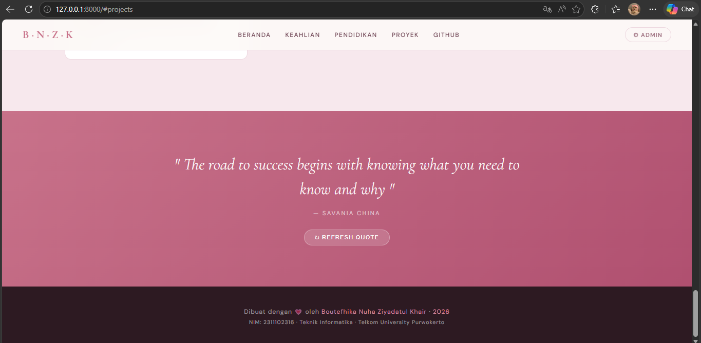

Login Admin
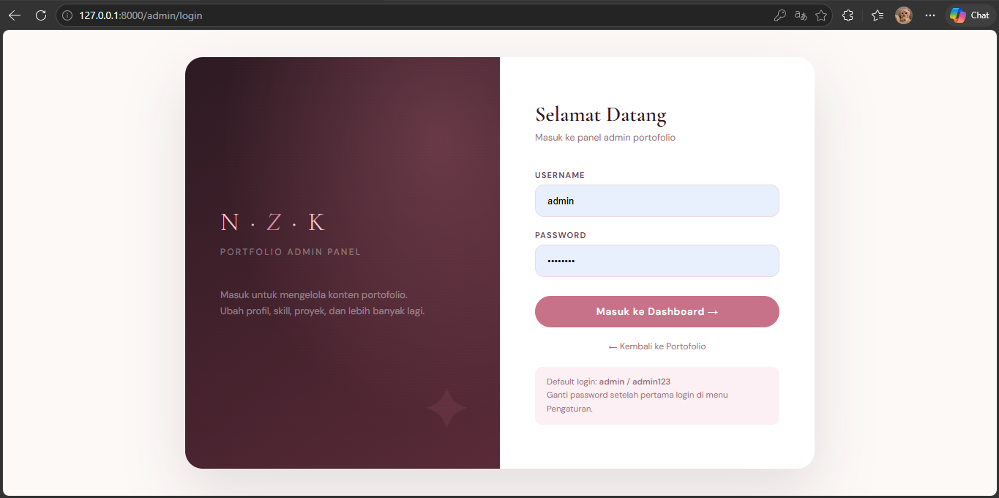

Dashboard
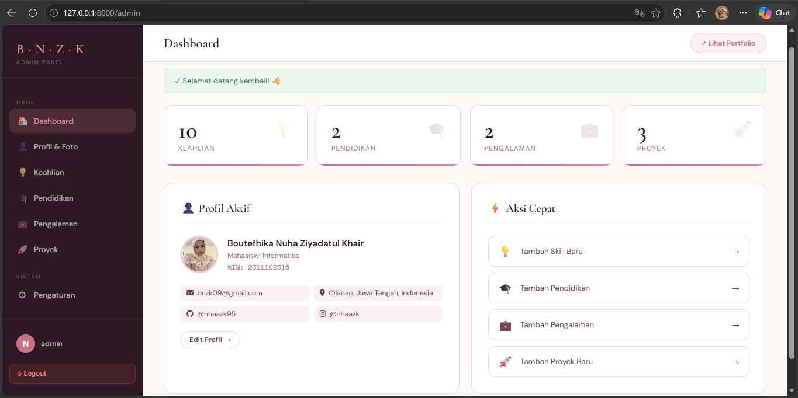

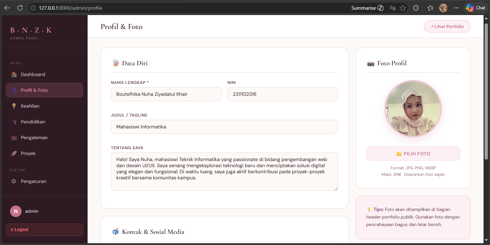

Profil&Foto


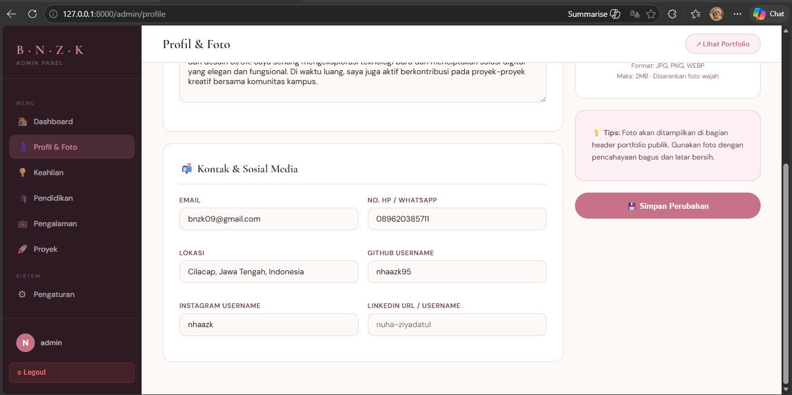

Keahlian
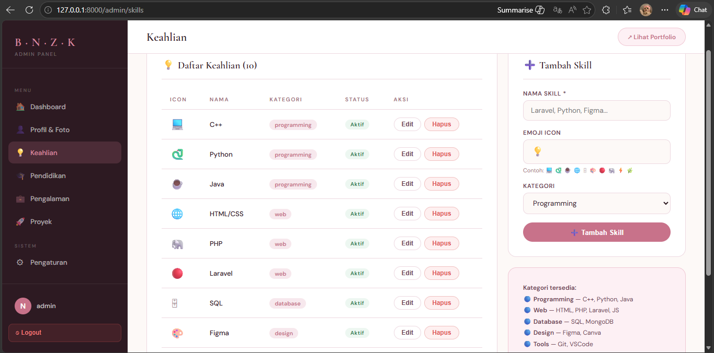

Pendidikan
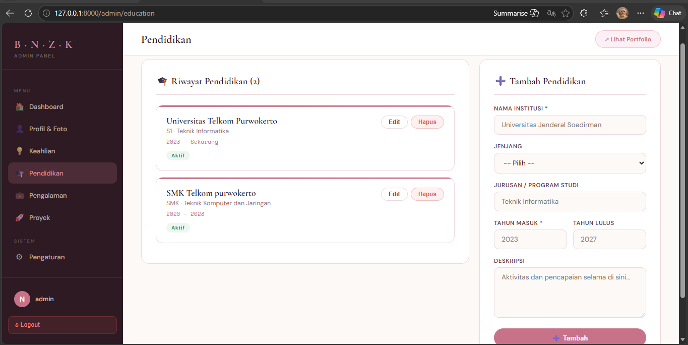

Pengalaman
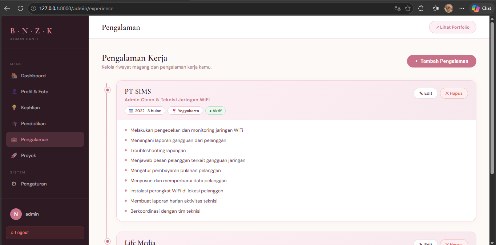

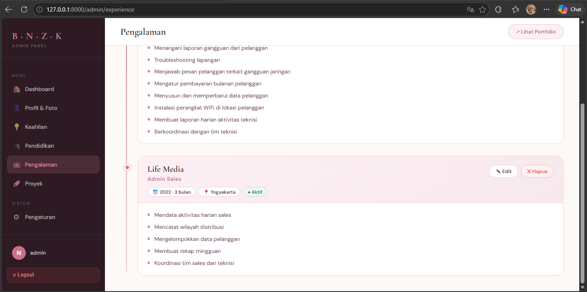

Proyek
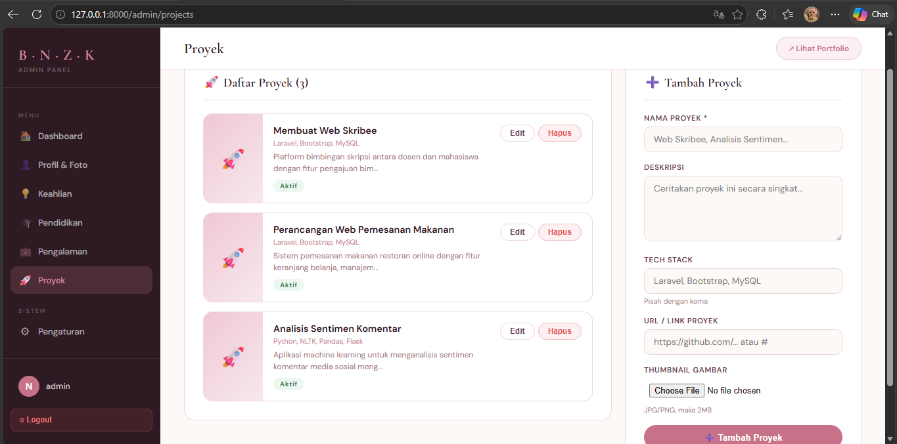

Pengaturan
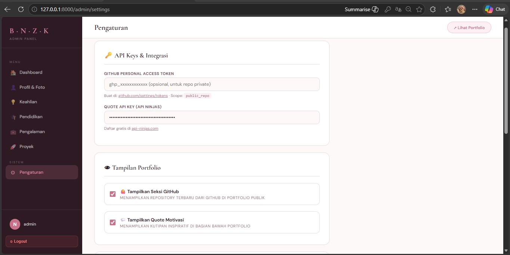

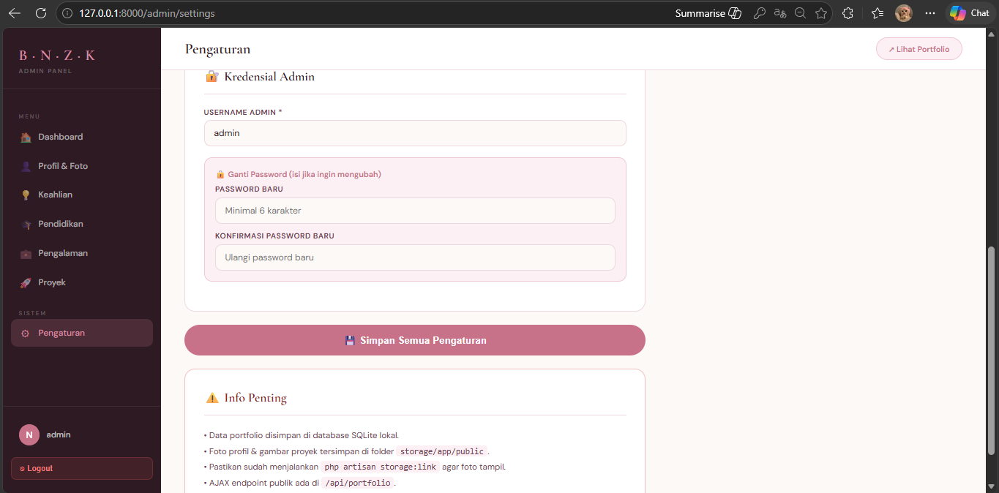
