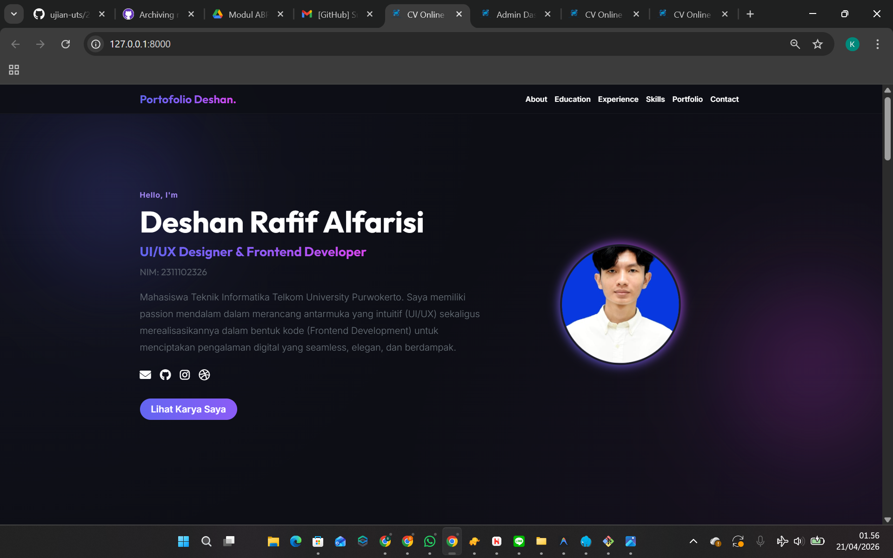
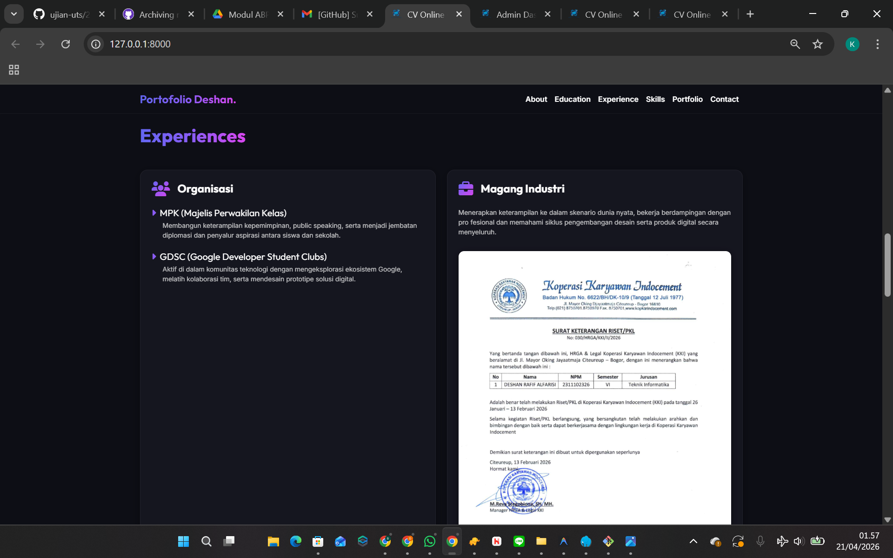
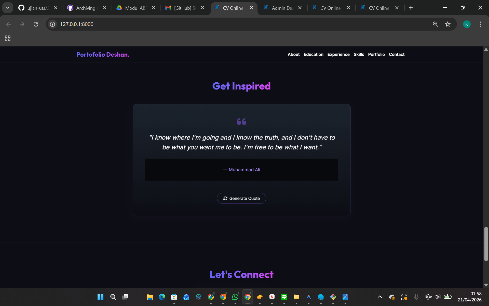
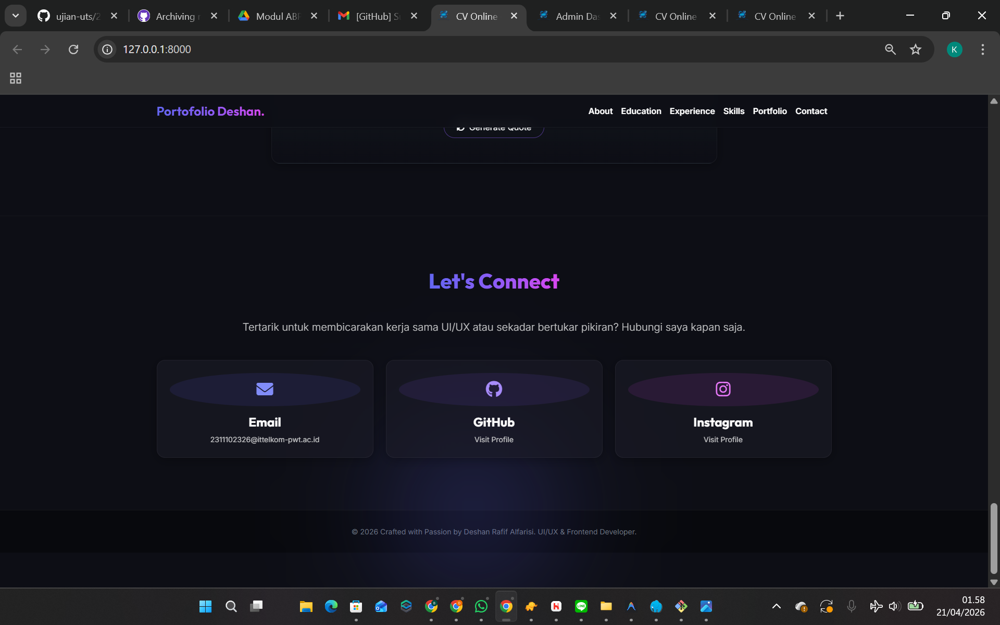

<div align="center">
  <br />
  <h1>LAPORAN UJIAN TENGAH SEMESTER <br>APLIKASI BERBASIS PLATFORM</h1>
  <br />
  <br />
  
  <br />
  <br />
  <br />
  <h3>Disusun Oleh :</h3>
  <p>
    <strong>Deshan Rafif Alfarisi</strong><br>
    <strong>2311102326</strong><br>
    <strong>S1 IF-11-07</strong>
  </p>
  <br />
  <h3>Dosen Pengampu :</h3>
  <p>
    <strong>Dimas Fanny Hebrasianto Permadi, S.ST., M.Kom</strong>
  </p>
  <br />
  <h4>Asisten Praktikum :</h4>
  <strong>Apri Pandu Wicaksono</strong> <br>
  <strong>Rangga Pradarrell Fathi</strong>
  <br />
  <h3>LABORATORIUM HIGH PERFORMANCE <br>FAKULTAS INFORMATIKA <br>UNIVERSITAS TELKOM PURWOKERTO <br>2026</h3>
</div>

---

## 1. Dasar Teori

### 1.1 Laravel Framework

Laravel adalah framework aplikasi web berbasis PHP yang mengikuti pola arsitektur **MVC (Model-View-Controller)**. Framework ini dirancang untuk mempercepat pengembangan aplikasi web modern dengan menyediakan berbagai fitur bawaan seperti routing, Blade templating engine, autentikasi berbasis sesi, Eloquent ORM, migrasi database, dan seeder. Laravel pertama kali dikembangkan oleh Taylor Otwell pada tahun 2011 dan kini menjadi salah satu framework PHP yang paling populer di dunia. Pada proyek ini digunakan Laravel versi 11.

### 1.2 Pola Arsitektur MVC (Model-View-Controller)

MVC adalah pola arsitektur perangkat lunak yang memisahkan aplikasi menjadi tiga lapisan:

- **Model**: Merepresentasikan struktur data dan logika akses database. Dalam Laravel, setiap model Eloquent merepresentasikan satu tabel dan mendefinisikan kolom yang diizinkan diisi secara massal melalui `$fillable`.
- **View**: Lapisan presentasi yang menampilkan data ke pengguna. Laravel menggunakan **Blade Templating Engine** dengan direktif seperti `@foreach`, `@if`, `@extends`, dan `@section`.
- **Controller**: Lapisan pengontrol yang menghubungkan Model dan View, menerima HTTP request, memproses logika bisnis, serta mengembalikan respons.

### 1.3 Eloquent ORM

Eloquent adalah ORM (*Object-Relational Mapper*) bawaan Laravel yang memungkinkan developer berinteraksi dengan database menggunakan objek PHP tanpa menulis SQL secara langsung. Proyek ini menggunakan lima model Eloquent: `Profile`, `Skill`, `Education`, `Experience`, dan `Project`, masing-masing memetakan ke tabel database yang bersesuaian.

### 1.4 Blade Templating Engine

Blade adalah engine template Laravel yang memungkinkan sintaks PHP ditulis di dalam HTML dengan cara yang ekspresif. Proyek ini menggunakan Blade secara langsung (bukan dengan `@extends`) karena setiap halaman merupakan file HTML mandiri, memanfaatkan direktif `@foreach`, `@if`, `@forelse`, `@csrf`, `@method`, dan `{{ }}` untuk interpolasi data dinamis dari database.

### 1.5 Autentikasi Berbasis Sesi

Autentikasi berbasis sesi menyimpan informasi login pengguna di sisi server. Laravel menyediakan facade `Auth` dengan method `Auth::attempt()` untuk verifikasi kredensial, `Auth::logout()` untuk mengakhiri sesi, dan `Auth::check()` untuk mengecek status login. Semua route dashboard dilindungi oleh middleware `auth` sehingga hanya admin yang bisa mengaksesnya.

### 1.6 CSRF Protection

CSRF (*Cross-Site Request Forgery*) adalah serangan di mana pihak ketiga memaksa pengguna yang sudah login untuk mengirim request berbahaya. Laravel melindungi setiap form POST, PUT, dan DELETE dengan token unik per sesi melalui direktif `@csrf`. Jika token tidak cocok, request akan ditolak dengan status 419.

### 1.7 Database Migration dan Seeder

**Migration** adalah sistem version control skema database berbasis PHP yang memungkinkan struktur tabel didefinisikan dan dijalankan secara konsisten di semua environment melalui perintah `php artisan migrate`. **Seeder** mengisi database dengan data awal secara otomatis menggunakan `php artisan db:seed`, mencakup data akun admin, profil, skill, pendidikan, pengalaman, dan proyek.

### 1.8 Bootstrap 5 dan Font Awesome

**Bootstrap 5** adalah framework CSS yang menyediakan sistem grid responsif, komponen UI siap pakai seperti card, badge, navbar, dan list-group. Proyek ini menggunakan Bootstrap via CDN untuk membangun layout yang rapi di halaman admin maupun halaman publik. **Font Awesome** adalah library ikon berbasis font/SVG yang menyediakan ribuan ikon siap pakai, digunakan untuk ikon navigasi sidebar, tombol aksi, dan elemen dekoratif di seluruh halaman.

### 1.9 AJAX dan XMLHttpRequest

AJAX (*Asynchronous JavaScript and XML*) adalah teknik yang memungkinkan halaman web mengambil data dari server tanpa melakukan reload halaman secara penuh. Proyek ini mengimplementasikan AJAX menggunakan **XMLHttpRequest (XHR)** native untuk mengambil quote inspiratif secara dinamis dari API publik `dummyjson.com/quotes/random`. Saat tombol diklik, XHR mengirimkan GET request ke endpoint tersebut, menerima respons JSON, lalu memperbarui konten DOM secara langsung — sebuah contoh nyata integrasi API eksternal dalam aplikasi Laravel.

### 1.10 Single Page Layout (One-Page Portfolio)

Halaman publik portofolio dibangun sebagai *single-page layout* dengan navigasi berbasis anchor (`#about`, `#education`, `#experience`, dll.). Bootstrap Scrollspy digunakan untuk menyorot menu navbar secara aktif sesuai posisi scroll. Pendekatan ini memberikan pengalaman pengguna yang mulus tanpa perpindahan halaman, sekaligus memudahkan indexing dan berbagi URL.

---

## 2. Implementasi Sistem (Kebutuhan Fungsional)

Sistem **CV Online & Portofolio Dinamis** ini dibangun menggunakan framework **Laravel 11** dengan pola arsitektur **MVC**, memanfaatkan **SQLite** sebagai basis data, serta **Bootstrap 5**, **Font Awesome**, dan **Google Fonts (Outfit + Inter)** sebagai fondasi antarmuka pengguna. Sistem terdiri dari dua sisi utama:

**Sisi Publik (`welcome.blade.php`)** — halaman CV online *one-page* yang dapat diakses siapa saja, menampilkan data profil, pendidikan, pengalaman, skill, dan portofolio yang diambil secara dinamis dari database.

**Sisi Admin (`dashboard.blade.php`)** — panel manajemen konten yang hanya bisa diakses setelah login, memungkinkan admin memperbarui semua data yang tampil di halaman publik.

Fitur-fitur utama sistem meliputi:

- **Autentikasi Admin**: Login dan logout berbasis sesi menggunakan `AuthController` kustom dan facade `Auth` Laravel, dengan perlindungan middleware `auth` pada seluruh route dashboard.
- **Manajemen Profil**: Admin dapat memperbarui deskripsi, foto profil, alamat email, URL GitHub, Instagram, dan Dribbble. Foto profil diunggah ke direktori `public/assets/`.
- **Manajemen Skill**: Admin dapat menambah dan menghapus skill dengan tiga kategori: *Design & Tech*, *Soft Skills*, dan *Scientific Skills*.
- **Manajemen Pendidikan**: Admin dapat menambah dan menghapus entri riwayat pendidikan beserta nama institusi, jenjang/periode, dan deskripsi.
- **Manajemen Pengalaman**: Admin dapat menambah dan menghapus pengalaman (organisasi maupun magang) beserta gambar dokumentasi opsional.
- **Manajemen Proyek**: Admin dapat menambah dan menghapus entri portofolio proyek beserta gambar, kategori, dan deskripsi.
- **Halaman Publik Dinamis**: Semua data dari database ditampilkan secara real-time di halaman publik tanpa perlu deploy ulang.
- **Integrasi API AJAX**: Section "Get Inspired" mengambil quote acak dari API `dummyjson.com` menggunakan XMLHttpRequest tanpa reload halaman.

---

## 3. Penjelasan Kode Sumber

### 3.1 Migrations — Struktur Tabel Database

Proyek ini menggunakan lima tabel tambahan di luar tabel `users` bawaan Laravel. Seluruh migration dijalankan sekaligus dengan perintah `php artisan migrate`.

**Tabel `profiles`** — menyimpan data profil tunggal admin. *File: `database/migrations/2026_04_20_175200_create_profiles_table.php`*

```php
Schema::create('profiles', function (Blueprint $table) {
    $table->id();
    $table->text('description')->nullable();      // Deskripsi "About Me"
    $table->string('profile_picture')->nullable(); // Path foto profil
    $table->string('email')->nullable();           // Email kontak
    $table->string('github')->nullable();          // URL GitHub
    $table->string('instagram')->nullable();       // URL Instagram
    $table->string('dribbble')->nullable();        // URL Dribbble
    $table->timestamps();
});
```

**Tabel `skills`** — menyimpan daftar keahlian dengan kategori. *File: `database/migrations/2026_04_20_175200_create_skills_table.php`*

```php
Schema::create('skills', function (Blueprint $table) {
    $table->id();
    $table->string('name');                                       // Nama skill
    $table->string('category')->default('technical');            // technical | soft_skills | scientific
    $table->timestamps();
});
```

**Tabel `education`** — menyimpan riwayat pendidikan. *File: `database/migrations/2026_04_20_184504_create_education_table.php`*

```php
Schema::create('education', function (Blueprint $table) {
    $table->id();
    $table->string('institution');      // Nama institusi pendidikan
    $table->string('degree');           // Jenjang / periode
    $table->text('description')->nullable(); // Deskripsi singkat
    $table->timestamps();
});
```

**Tabel `experiences`** — menyimpan pengalaman organisasi maupun magang. *File: `database/migrations/2026_04_20_184504_create_experiences_table.php`*

```php
Schema::create('experiences', function (Blueprint $table) {
    $table->id();
    $table->string('title');                  // Judul pengalaman
    $table->string('category');              // Kategori: Organisasi / Magang
    $table->text('description')->nullable(); // Deskripsi
    $table->string('image')->nullable();     // Path gambar dokumentasi (opsional)
    $table->timestamps();
});
```

**Tabel `projects`** — menyimpan entri portofolio proyek. *File: `database/migrations/2026_04_20_184504_create_projects_table.php`*

```php
Schema::create('projects', function (Blueprint $table) {
    $table->id();
    $table->string('title');                  // Judul proyek
    $table->string('category');              // Kategori: Dashboard UI, Web Design, dll.
    $table->text('description')->nullable(); // Deskripsi proyek
    $table->string('image')->nullable();     // Path gambar thumbnail
    $table->timestamps();
});
```

---

### 3.2 Models

Kelima model Eloquent hanya mendefinisikan `$fillable` karena tidak memerlukan relasi antar tabel. *File: `app/Models/`*

```php
// Profile.php
class Profile extends Model {
    protected $fillable = ['description', 'profile_picture', 'email', 'github', 'instagram', 'dribbble'];
}

// Skill.php
class Skill extends Model {
    protected $fillable = ['name', 'category'];
}

// Education.php
class Education extends Model {
    protected $fillable = ['institution', 'degree', 'description'];
}

// Experience.php
class Experience extends Model {
    protected $fillable = ['title', 'category', 'description', 'image'];
}

// Project.php
class Project extends Model {
    protected $fillable = ['title', 'category', 'description', 'image'];
}
```

---

### 3.3 Database Seeder

Seeder mengisi seluruh data awal aplikasi secara otomatis dengan `php artisan db:seed`, mencakup akun admin, profil, 16 skill, 2 data pendidikan, 3 pengalaman, dan 3 proyek portofolio. *File: `database/seeders/DatabaseSeeder.php`*

```php
public function run(): void
{
    // Akun admin default
    \App\Models\User::factory()->create([
        'name'     => 'Admin Deshan',
        'email'    => 'admin@admin.com',
        'password' => bcrypt('password'),
    ]);

    // Data profil awal
    \App\Models\Profile::create([
        'description'     => 'Mahasiswa Teknik Informatika Telkom University Purwokerto...',
        'profile_picture' => 'assets/profile.jpeg',
        'email'           => '2311102326@ittelkom-pwt.ac.id',
        'github'          => 'https://github.com/deshanreal',
        'instagram'       => 'https://www.instagram.com/deshanrafif/',
        'dribbble'        => '#',
    ]);

    // 16 Skill (technical, soft_skills, scientific)
    $skills = [
        ['name' => 'Figma / UI Design',       'category' => 'technical'],
        ['name' => 'UX Research',              'category' => 'technical'],
        ['name' => 'HTML & CSS',               'category' => 'technical'],
        ['name' => 'JavaScript',               'category' => 'technical'],
        ['name' => 'Bootstrap',                'category' => 'technical'],
        ['name' => 'PHP & MySQL',              'category' => 'technical'],
        ['name' => 'Kerja Tim',                'category' => 'soft_skills'],
        ['name' => 'Komunikasi Visual',        'category' => 'soft_skills'],
        ['name' => 'Kepemimpinan',             'category' => 'soft_skills'],
        ['name' => 'Manajemen Waktu',          'category' => 'soft_skills'],
        ['name' => 'Empati Pengguna (UX)',     'category' => 'soft_skills'],
        ['name' => 'Analisis Kuesioner',       'category' => 'scientific'],
        ['name' => 'Problem Solving',          'category' => 'scientific'],
        ['name' => 'Logika Algoritma',         'category' => 'scientific'],
        ['name' => 'Pemikiran Kritis',         'category' => 'scientific'],
        ['name' => 'Riset Kompetitor',         'category' => 'scientific'],
    ];
    foreach ($skills as $skill) { \App\Models\Skill::create($skill); }

    // 2 Data pendidikan
    $educations = [
        ['institution' => 'Telkom University Purwokerto', 'degree' => 'S1 Informatika | Sekarang', ...],
        ['institution' => 'SMA N 1 Karanganyar',          'degree' => 'Jurusan MIPA', ...],
    ];
    foreach ($educations as $edu) { \App\Models\Education::create($edu); }

    // 3 Pengalaman (2 Organisasi + 1 Magang)
    $experiences = [
        ['title' => 'MPK (Majelis Perwakilan Kelas)', 'category' => 'Organisasi', ...],
        ['title' => 'GDSC (Google Developer Student Clubs)', 'category' => 'Organisasi', ...],
        ['title' => 'Magang Industri', 'category' => 'Magang', 'image' => 'assets/magang.jpg', ...],
    ];
    foreach ($experiences as $exp) { \App\Models\Experience::create($exp); }

    // 3 Proyek portofolio
    $projects = [
        ['title' => 'Sistem Inventaris Indocement', 'category' => 'Dashboard UI',  'image' => 'assets/porto1.png', ...],
        ['title' => 'COCSLEBEW Top Up Game',        'category' => 'Web Design',    'image' => 'assets/porto2.png', ...],
        ['title' => 'Pixora Studio Landing Page',   'category' => 'Landing Page',  'image' => 'assets/porto3.png', ...],
    ];
    foreach ($projects as $proj) { \App\Models\Project::create($proj); }
}
```

Kredensial login admin:
- **Email**: `admin@admin.com`
- **Password**: `password`

---

### 3.4 Routes `web.php`

Routes mendefinisikan dua kelompok URL utama: route publik (tanpa autentikasi) dan route admin (dilindungi middleware `auth`). Route publik `/` mengambil seluruh data dari database dan meneruskannya ke view `welcome`. *File: `routes/web.php`*

```php
// Route publik — halaman CV online
Route::get('/', function () {
    $profile    = \App\Models\Profile::first();
    $skills     = \App\Models\Skill::all();
    $educations = \App\Models\Education::all();
    $experiences= \App\Models\Experience::all();
    $projects   = \App\Models\Project::all();
    return view('welcome', compact('profile', 'skills', 'educations', 'experiences', 'projects'));
})->name('home');

// Route autentikasi
Route::get('/login',  [AuthController::class, 'showLogin'])->name('login');
Route::post('/login', [AuthController::class, 'login']);
Route::post('/logout',[AuthController::class, 'logout'])->name('logout');

// Route admin — dilindungi middleware auth
Route::middleware('auth')->group(function () {
    // Dashboard admin (mengambil semua data sama seperti route publik)
    Route::get('/dashboard', function () { ... })->name('dashboard');

    // CRUD Profile (hanya update, karena data profil tunggal)
    Route::post('/profile', [ProfileController::class, 'update'])->name('profile.update');

    // CRUD Skills
    Route::post('/skills',            [SkillController::class,  'store'])  ->name('skills.store');
    Route::delete('/skills/{skill}',  [SkillController::class,  'destroy'])->name('skills.destroy');

    // CRUD Education
    Route::post('/educations',               [EducationController::class,  'store'])  ->name('educations.store');
    Route::delete('/educations/{education}', [EducationController::class,  'destroy'])->name('educations.destroy');

    // CRUD Experience
    Route::post('/experiences',                [ExperienceController::class, 'store'])  ->name('experiences.store');
    Route::delete('/experiences/{experience}', [ExperienceController::class, 'destroy'])->name('experiences.destroy');

    // CRUD Projects
    Route::post('/projects',             [ProjectController::class, 'store'])  ->name('projects.store');
    Route::delete('/projects/{project}', [ProjectController::class, 'destroy'])->name('projects.destroy');
});
```

---

### 3.5 Controller `AuthController.php`

Menangani seluruh alur autentikasi admin. *File: `app/Http/Controllers/AuthController.php`*

```php
class AuthController extends Controller
{
    // GET /login — tampilkan halaman login
    public function showLogin()
    {
        return view('auth.login');
    }

    // POST /login — verifikasi kredensial dan buat sesi
    public function login(Request $request)
    {
        $credentials = $request->validate([
            'email'    => ['required', 'email'],
            'password' => ['required'],
        ]);

        if (Auth::attempt($credentials)) {
            $request->session()->regenerate(); // Cegah session fixation attack
            return redirect()->intended('dashboard');
        }

        return back()->withErrors([
            'email' => 'The provided credentials do not match our records.',
        ]);
    }

    // POST /logout — hapus sesi dan redirect ke halaman publik
    public function logout(Request $request)
    {
        Auth::logout();
        $request->session()->invalidate();
        $request->session()->regenerateToken();
        return redirect('/');
    }
}
```

---

### 3.6 Controller `ProfileController.php`

Menangani pembaruan data profil termasuk upload foto. Foto profil disimpan langsung di `public/assets/profile.jpeg` sehingga bisa langsung diakses via URL publik tanpa symlink. *File: `app/Http/Controllers/ProfileController.php`*

```php
public function update(Request $request)
{
    $profile = Profile::first();

    $data = $request->validate([
        'description'     => 'nullable|string',
        'email'           => 'nullable|email',
        'github'          => 'nullable|url',
        'instagram'       => 'nullable|url',
        'dribbble'        => 'nullable|url',
        'profile_picture' => 'nullable|image|max:2048',
    ]);

    // Jika ada file gambar yang diunggah, simpan ke public/assets/
    if ($request->hasFile('profile_picture')) {
        $request->file('profile_picture')->move(public_path('assets'), 'profile.jpeg');
        $data['profile_picture'] = 'assets/profile.jpeg';
    }

    // Update jika profil sudah ada, atau buat baru jika belum
    if ($profile) {
        $profile->update($data);
    } else {
        Profile::create($data);
    }

    return back()->with('success', 'Profile updated successfully.');
}
```

---

### 3.7 Controller `SkillController.php`

Menangani penambahan dan penghapusan skill. Kategori dibatasi ke tiga nilai valid melalui validasi `in:technical,soft_skills,scientific`. *File: `app/Http/Controllers/SkillController.php`*

```php
public function store(Request $request)
{
    $data = $request->validate([
        'name'     => 'required|string|max:255',
        'category' => 'required|string|in:technical,soft_skills,scientific',
    ]);
    Skill::create($data);
    return back()->with('success', 'Skill added successfully.');
}

public function destroy(Skill $skill)
{
    $skill->delete();
    return back()->with('success', 'Skill deleted successfully.');
}
```

---

### 3.8 Controller `EducationController.php`

Menangani penambahan dan penghapusan data pendidikan. *File: `app/Http/Controllers/EducationController.php`*

```php
public function store(Request $request)
{
    $data = $request->validate([
        'institution' => 'required|string|max:255',
        'degree'      => 'required|string|max:255',
        'description' => 'nullable|string',
    ]);
    Education::create($data);
    return back()->with('success', 'Education added successfully.');
}

public function destroy(Education $education)
{
    $education->delete();
    return back()->with('success', 'Education deleted successfully.');
}
```

---

### 3.9 Controller `ExperienceController.php`

Menangani penambahan dan penghapusan pengalaman. Mendukung upload gambar dokumentasi opsional (contoh: foto magang) yang disimpan di `public/assets/`. *File: `app/Http/Controllers/ExperienceController.php`*

```php
public function store(Request $request)
{
    $data = $request->validate([
        'title'       => 'required|string|max:255',
        'category'    => 'required|string|max:255',
        'description' => 'nullable|string',
        'image'       => 'nullable|image|max:2048',
    ]);

    // Upload gambar dokumentasi jika ada
    if ($request->hasFile('image')) {
        $filename = time() . '_' . $request->file('image')->getClientOriginalName();
        $request->file('image')->move(public_path('assets'), $filename);
        $data['image'] = 'assets/' . $filename;
    }

    Experience::create($data);
    return back()->with('success', 'Experience added successfully.');
}

public function destroy(Experience $experience)
{
    $experience->delete();
    return back()->with('success', 'Experience deleted successfully.');
}
```

---

### 3.10 Controller `ProjectController.php`

Menangani penambahan dan penghapusan entri portofolio. Gambar thumbnail proyek wajib disertakan saat menambah proyek baru. *File: `app/Http/Controllers/ProjectController.php`*

```php
public function store(Request $request)
{
    $data = $request->validate([
        'title'       => 'required|string|max:255',
        'category'    => 'required|string|max:255',
        'description' => 'nullable|string',
        'image'       => 'nullable|image|max:2048',
    ]);

    if ($request->hasFile('image')) {
        $filename = time() . '_' . $request->file('image')->getClientOriginalName();
        $request->file('image')->move(public_path('assets'), $filename);
        $data['image'] = 'assets/' . $filename;
    }

    Project::create($data);
    return back()->with('success', 'Project added successfully.');
}

public function destroy(Project $project)
{
    $project->delete();
    return back()->with('success', 'Project deleted successfully.');
}
```

---

### 3.11 View Halaman Login Admin (`auth/login.blade.php`)

Halaman login menggunakan **Bootstrap 5** dan desain *glassmorphism* dengan efek ambient glow ungu-merah muda di sudut layar. Kartu login semi-transparan dengan `backdrop-filter: blur(20px)`. Pesan error ditampilkan dalam `alert alert-danger` jika kredensial tidak valid. *File: `resources/views/auth/login.blade.php`*

```html
<!-- Ambient Glow Background -->
<div class="ambient-glow-1"></div> <!-- Pojok kiri atas, ungu -->
<div class="ambient-glow-2"></div> <!-- Pojok kanan bawah, pink -->

<!-- Login Card -->
<div class="login-card"> <!-- background rgba(255,255,255,0.85), blur(20px) -->
    <h3 class="text-gradient">Welcome Back</h3>
    <p>Sign in to your admin dashboard</p>

    <!-- Error Banner -->
    @if($errors->any())
        <div class="alert alert-danger">{{ $errors->first() }}</div>
    @endif

    <form action="{{ route('login') }}" method="POST">
        @csrf
        <input type="email"    name="email"    placeholder="admin@admin.com" required>
        <input type="password" name="password" placeholder="••••••••"        required>
        <button class="btn-gradient w-100">Log In</button>
    </form>
</div>
```

---

### 3.12 View Dashboard Admin (`dashboard.blade.php`)

Dashboard admin memiliki layout dua kolom dengan sidebar kiri tetap (fixed, lebar 260px) dan area konten utama di kanannya. Seluruh data dikelola dalam satu halaman menggunakan form-form Bootstrap yang dikelompokkan per entitas (profil, skill, pendidikan, pengalaman, proyek). *File: `resources/views/dashboard.blade.php`*

```html
<!-- Sidebar Kiri — Fixed, lebar 260px -->
<div class="sidebar">
    <div class="sidebar-header">
        <h4 class="text-gradient">Admin Panel.</h4>
        <small>Manage your portfolio</small>
    </div>
    <div class="sidebar-nav">
        <a href="{{ route('dashboard') }}" class="active">
            <i class="fas fa-border-all"></i> Dashboard
        </a>
        <a href="{{ route('home') }}" target="_blank">
            <i class="fas fa-external-link-alt"></i> View Website
        </a>
        <!-- Logout -->
        <a href="#" onclick="document.getElementById('logout-form').submit();">
            <i class="fas fa-sign-out-alt"></i> Logout
        </a>
        <form id="logout-form" action="{{ route('logout') }}" method="POST" class="d-none">
            @csrf
        </form>
    </div>
</div>

<!-- Konten Utama (margin-left: 260px) -->
<div class="main-content">

    <!-- Flash Message -->
    @if(session('success'))
        <div class="alert alert-success">
            <i class="fas fa-check-circle"></i> {{ session('success') }}
        </div>
    @endif

    <!-- Baris 1: Profil + Skill -->
    <div class="row">
        <!-- Kartu Profil & Social Links -->
        <div class="col-xl-7">
            <form action="{{ route('profile.update') }}" method="POST" enctype="multipart/form-data">
                @csrf
                profile_picture) }}" class="profile-img-preview">
                <input type="file"  name="profile_picture">
                <textarea name="description">{{ $profile->description ?? '' }}</textarea>
                <input type="email" name="email"     value="{{ $profile->email ?? '' }}">
                <input type="url"   name="github"    value="{{ $profile->github ?? '' }}">
                <input type="url"   name="instagram" value="{{ $profile->instagram ?? '' }}">
                <input type="url"   name="dribbble"  value="{{ $profile->dribbble ?? '' }}">
                <button class="btn-gradient">Save Changes</button>
            </form>
        </div>

        <!-- Kartu Skill -->
        <div class="col-xl-5">
            <form action="{{ route('skills.store') }}" method="POST">
                @csrf
                <input  type="text" name="name"     placeholder="e.g. Laravel" required>
                <select name="category">
                    <option value="technical">Design & Tech</option>
                    <option value="soft_skills">Soft Skills</option>
                    <option value="scientific">Scientific Skills</option>
                </select>
                <button class="btn-gradient">Add Skill</button>
            </form>
            <!-- Daftar skill dengan tombol hapus -->
            @forelse($skills as $skill)
            <div class="list-group-item">
                <span>{{ $skill->name }}</span>
                <span class="badge-category">{{ $skill->category }}</span>
                <form action="{{ route('skills.destroy', $skill) }}" method="POST">
                    @csrf @method('DELETE')
                    <button class="btn-danger-light"><i class="fas fa-trash-alt"></i></button>
                </form>
            </div>
            @empty
                <p class="text-muted">No skills added yet.</p>
            @endforelse
        </div>
    </div>

    <!-- Baris 2: Education + Experience + Projects (3 kolom) -->
    <div class="row">
        <!-- Education -->
        <div class="col-xl-4"> ... </div>
        <!-- Experience (dengan upload gambar) -->
        <div class="col-xl-4"> ... </div>
        <!-- Projects (dengan upload gambar) -->
        <div class="col-xl-4"> ... </div>
    </div>
</div>
```

---

### 3.13 View Halaman Publik (`welcome.blade.php`)

Halaman publik adalah satu-halaman (*one-page*) dengan tema gelap (*dark theme*) menggunakan warna dasar `#0d0e15` (midnight dark blue). Navbar sticky di atas dengan Bootstrap Scrollspy untuk highlight menu aktif. Data ditampilkan secara dinamis dari variabel yang dikirim controller. *File: `resources/views/welcome.blade.php`*

**Section Profil:**
```html
<section id="hero" class="hero">
    <!-- Foto Profil dengan efek glow animasi -->
    <div class="profile-wrapper"> <!-- ::after = gradient glow blur -->
        profile_picture ?? 'assets/profile.jpeg') }}"
             class="profile-img" alt="Deshan Rafif Alfarisi">
    </div>
    <h1>Deshan Rafif Alfarisi</h1>
    <h2 class="text-gradient">UI/UX Designer & Frontend Developer</h2>
    <p>{{ $profile->description ?? 'Deskripsi default...' }}</p>
    <!-- Social Icons: Email, GitHub, Instagram, Dribbble -->
    <div class="social-icons">
        <a href="mailto:{{ $profile->email ?? '...' }}"><i class="fas fa-envelope"></i></a>
        <a href="{{ $profile->github ?? '#' }}"    ><i class="fab fa-github"></i></a>
        <a href="{{ $profile->instagram ?? '#' }}" ><i class="fab fa-instagram"></i></a>
        <a href="{{ $profile->dribbble ?? '#' }}"  ><i class="fab fa-dribbble"></i></a>
    </div>
</section>
```

**Section Education — Timeline:**
```html
<section id="education">
    <div class="timeline"> <!-- border-left ungu -->
        @foreach($educations as $edu)
        <div class="timeline-item"> <!-- ::before = titik gradient ungu -->
            <h4>{{ $edu->institution }}</h4>
            <p style="color: #a78bfa;">{{ $edu->degree }}</p>
            <p class="card-text-secondary">{{ $edu->description }}</p>
        </div>
        @endforeach
    </div>
</section>
```

**Section Experience — Dua Kartu (Organisasi & Magang):**
```html
<section id="experience">
    <!-- Kartu Organisasi -->
    <div class="col-md-6">
        @foreach($experiences->where('category', '!=', 'Magang') as $exp)
            <h5><i class="fas fa-caret-right"></i>{{ $exp->title }}</h5>
            <p>{{ $exp->description }}</p>
        @endforeach
    </div>

    <!-- Kartu Magang dengan foto dokumentasi -->
    <div class="col-md-6">
        @php $magang = $experiences->where('category', 'Magang')->first(); @endphp
        @if($magang)
            <h3>{{ $magang->title }}</h3>
            <p>{{ $magang->description }}</p>
            @if($magang->image)
                image) }}" class="magang-img">
            @endif
        @endif
    </div>
</section>
```

**Section Skills — Tiga Kartu Kategori:**
```html
<section id="skills">
    <h2 class="text-gradient">My Arsenal</h2>
    <div class="row g-4">
        <!-- Design & Tech -->
        <div class="col-md-4">
            <i class="fas fa-bezier-curve icon-gradient"></i>
            <h4>Design & Tech</h4>
            @foreach($skills->where('category', 'technical') as $skill)
                <span class="skill-pill">{{ $skill->name }}</span>
            @endforeach
        </div>
        <!-- Soft Skills -->
        <div class="col-md-4">
            @foreach($skills->where('category', 'soft_skills') as $skill)
                <span class="skill-pill">{{ $skill->name }}</span>
            @endforeach
        </div>
        <!-- Scientific Skills -->
        <div class="col-md-4">
            @foreach($skills->where('category', 'scientific') as $skill)
                <span class="skill-pill">{{ $skill->name }}</span>
            @endforeach
        </div>
    </div>
</section>
```

**Section Selected Works — Grid Portofolio:**
```html
<section id="portfolio">
    <h2 class="text-gradient">Selected Works</h2>
    <div class="row g-4">
        @foreach($projects as $proj)
        <div class="col-md-6 col-lg-4">
            <div class="card card-custom portfolio-card">
                image) }}" class="portfolio-img card-img-top">
                <div class="card-body">
                    <span class="badge">{{ $proj->category }}</span>
                    <h5>{{ $proj->title }}</h5>
                    <p>{{ $proj->description }}</p>
                </div>
            </div>
        </div>
        @endforeach
    </div>
</section>
```

**Section Get Inspired — AJAX Quote:**
```html
<section id="api-section">
    <h2 class="text-gradient">Get Inspired</h2>
    <blockquote>
        <p id="quote-text">"Menghubungkan ke server inovasi..."</p>
        <footer id="quote-author">Sistem</footer>
    </blockquote>
    <button id="btn-refresh-quote">Generate Quote</button>
</section>

<script>
    // AJAX menggunakan XMLHttpRequest native
    function fetchQuote() {
        const xhr = new XMLHttpRequest();
        xhr.open('GET', 'https://dummyjson.com/quotes/random', true);
        xhr.onload = function () {
            if (xhr.status === 200) {
                const data = JSON.parse(xhr.responseText);
                document.getElementById('quote-text').innerHTML   = `"${data.quote}"`;
                document.getElementById('quote-author').innerHTML = data.author;
            }
        };
        xhr.send();
    }

    // Fetch otomatis saat halaman dimuat, dan saat tombol diklik
    document.addEventListener('DOMContentLoaded', fetchQuote);
    document.getElementById('btn-refresh-quote').addEventListener('click', fetchQuote);
</script>
```

---

## 4. Hasil Tampilan (Screenshots) Aplikasi

### 4.1 Halaman Login Admin

Halaman autentikasi admin dengan desain *glassmorphism*. Kartu login semi-transparan diapit oleh dua ambient glow berwarna ungu (kiri atas) dan pink (kanan bawah). Form meminta email dan password admin, dengan tombol "Log In" bergradien indigo-ungu. Jika kredensial salah, alert merah muncul di atas form.


---

### 4.2 Halaman Dashboard Admin — Profil & Skill

Panel admin utama dengan sidebar kiri bergaya *frosted glass* (blur putih). Area konten menampilkan dua kartu berdampingan: kartu **Profile & Social Links** (kiri) untuk mengelola foto, deskripsi, email, GitHub, Instagram, dan Dribbble; serta kartu **Manage Skills** (kanan) untuk menambah dan menghapus skill per kategori.


---

### 4.3 Halaman Dashboard Admin — Pendidikan, Pengalaman & Proyek

Bagian bawah dashboard admin menampilkan tiga kartu dalam layout tiga kolom: **Education** (kiri) untuk mengelola riwayat pendidikan, **Experience** (tengah) untuk mengelola pengalaman organisasi dan magang beserta upload foto dokumentasi, serta **Projects** (kanan) untuk mengelola entri portofolio beserta thumbnail gambar.


---

### 4.4 Halaman Publik — Hero / Profil

Halaman publik CV online dengan tema gelap (*dark theme*). Section hero menampilkan foto profil dengan efek glowing gradient yang beranimasi, nama lengkap, judul profesi bergradien, NIM, deskripsi singkat yang diambil dari database, serta empat ikon media sosial yang mengarah ke kontak asli.



---

### 4.5 Section About Me & Education

Section **About Me** berisi paragraf deskripsi kepribadian dan latar belakang. Di bawahnya, section **Education** menampilkan riwayat pendidikan dalam format **timeline vertikal** dengan garis ungu transparan di sisi kiri dan titik-titik berwarna gradient sebagai penanda setiap entri. Data diambil dinamis dari tabel `education`.


---

### 4.6 Section Experience

Section **Experiences** membagi pengalaman menjadi dua kartu berdampingan: kartu **Organisasi** (kiri) yang menampilkan daftar keterlibatan organisasi (MPK dan GDSC), serta kartu **Magang Industri** (kanan) yang menyertakan deskripsi dan foto dokumentasi magang yang diambil dari field `image` di database.



---

### 4.7 Section My Arsenal

Section **My Arsenal** menampilkan keahlian dalam tiga kartu yang dikelompokkan berdasarkan kategori: **Design & Tech** (ikon bezier curve), **Soft Skills** (ikon hands-helping), dan **Scientific Skills** (ikon brain). Setiap keahlian ditampilkan sebagai *skill pill* dengan efek hover bergradien ungu.


---

### 4.8 Section Selected Works

Section **Selected Works** menampilkan grid tiga kolom berisi kartu portofolio proyek. Setiap kartu menampilkan thumbnail gambar dengan efek zoom saat hover, badge kategori berwarna ungu transparan, judul proyek, dan deskripsi singkat. Data proyek diambil dinamis dari tabel `projects`.


---

### 4.9 Section Get Inspired (AJAX Quote)

Section **Get Inspired** mengintegrasikan API publik `dummyjson.com/quotes/random` menggunakan **XMLHttpRequest (AJAX)**. Quote inspiratif ditampilkan dalam kartu blockquote bergaya gelap. Setiap kali halaman dimuat atau tombol "Generate Quote" ditekan, request asinkron dikirimkan ke API dan tampilan quote diperbarui tanpa reload halaman.



---

### 4.10 Section Contact / Let's Connect

Section **Let's Connect** menampilkan tiga kartu kontak yang dapat diklik langsung: **Email** (mengarah ke `mailto:`), **GitHub** (mengarah ke profil GitHub), dan **Instagram** (mengarah ke profil Instagram). Semua URL kontak diambil dari data profil di database, sehingga bisa diperbarui kapan saja melalui dashboard admin.



---

## 5. Daftar Pustaka

Otwell, T. (2025). *Laravel 11.x Documentation*. Laravel LLC. Diakses dari https://laravel.com/docs/11.x

Otwell, T. (2025). *Eloquent ORM — Laravel 11.x*. Laravel LLC. Diakses dari https://laravel.com/docs/11.x/eloquent

Otwell, T. (2025). *Blade Templates — Laravel 11.x*. Laravel LLC. Diakses dari https://laravel.com/docs/11.x/blade

Otwell, T. (2025). *Authentication — Laravel 11.x*. Laravel LLC. Diakses dari https://laravel.com/docs/11.x/authentication

Otwell, T. (2025). *Database Migrations — Laravel 11.x*. Laravel LLC. Diakses dari https://laravel.com/docs/11.x/migrations

Otwell, T. (2025). *Database Seeding — Laravel 11.x*. Laravel LLC. Diakses dari https://laravel.com/docs/11.x/seeding

Otwell, T. (2025). *CSRF Protection — Laravel 11.x*. Laravel LLC. Diakses dari https://laravel.com/docs/11.x/csrf

Bootstrap Team. (2025). *Bootstrap 5 Documentation*. The Bootstrap Authors. Diakses dari https://getbootstrap.com/docs/5.3

Fonticons, Inc. (2025). *Font Awesome Free Icons*. Diakses dari https://fontawesome.com

DummyJSON. (2025). *DummyJSON — Fake REST API*. Diakses dari https://dummyjson.com

Mozilla Developer Network. (2025). *XMLHttpRequest — Web APIs*. MDN Web Docs. Diakses dari https://developer.mozilla.org/en-US/docs/Web/API/XMLHttpRequest

Welling, L., & Thomson, L. (2016). *PHP and MySQL Web Development* (5th ed.). Addison-Wesley Professional.

Freeman, A. (2022). *Pro PHP 8 MVC: Building Your Own PHP MVC Framework*. Apress.
